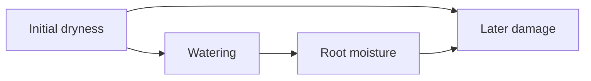

> **In short.** A useful prediction does not automatically tell you what would happen if you changed the predictor. Causal inference asks about that change and needs assumptions about how the system works. Experiments can help by altering the process that normally assigns a treatment, while observational methods use a model to identify appropriate comparisons. Adjusting for more variables can make an estimate worse when those variables have the wrong causal role. The result should name the intervention, the population, and the assumptions that support it.

## Re-learn

### Watching a system and changing it

Imagine an invented greenhouse where a moisture alarm often sounds shortly before a caretaker waters the plants. The alarm predicts watering. Silencing it might reduce watering if the caretaker relies on it; sounding an unrelated alarm would not necessarily have the same effect. The relevant question concerns a particular way of changing the system.

Compare observing that a plant was watered with arranging for it to be watered. In the first case, the observation can reveal something about the soil or the caretaker's habits. In the second, the watering is imposed, so the ordinary reasons why watering occurs no longer explain its assignment. This distinction between observation and intervention is central to causal models. [@hitchcock2024b, § 4.7]

### Draw the assumptions

An arrow from **X** to **Y** in a causal graph represents a direct causal influence relative to the variables included in that graph. A cause can appear direct in a small model and indirect in a larger one that includes an intermediate process. Arrows are therefore claims about a specified representation, not decorations added to correlations. [@hitchcock2024b, § 2.3]

In an invented model, soil dryness affects both watering and later plant damage. Dryness is a common cause, so plants that receive more water might still show more damage. That association could reflect their worse initial condition rather than harm from watering.

### Avoid the two opposite mistakes

Correlation alone does not determine causation. But observational evidence can support causal conclusions when additional assumptions and an appropriate design make the relevant effect identifiable. Neither a blanket dismissal of observations nor an unqualified inference from correlation does justice to the methods. [@hitchcock2024b, § 4.4, 4.7]

The most useful question is specific: what comparison would estimate the outcome of this intervention, and why? A causal conclusion becomes more informative when its assumptions are visible and its limits are stated.

## The full story

### Three questions hiding inside one association

Suppose a greenhouse record shows that frequently watered plants tend to be damaged. One question asks how well watering predicts damage. Another asks what damage would result from a specified watering policy. A third asks whether a particular plant would have survived had its treatment been different. These questions concern observation, intervention, and counterfactuals respectively. Causal models distinguish them, and a solution to one need not settle the others. [@hitchcock2024b, § 4.7, 4.10]

The distinction matters before any complicated mathematics. Predictive information can travel along a common cause. Observing watering gives information about dryness; dryness gives information about damage. Imposing watering need not tell us that the soil was dry, because it changes how watering was assigned.

An estimate of the average effect of watering would also leave open the fate of an individual plant. Different plants might respond differently, and only one actual treatment history is observed for each. The population comparison and the individual counterfactual therefore require different information. [@hitchcock2024b, § 4.10]

### A primary predecessor: Mill's Method of Difference

Mill formulates a comparison in which two instances differ in a single relevant circumstance. His condition is demanding: everything else must be shared. That demand makes the passage useful both as a statement of a causal intuition and as a warning about the gap between an ideal comparison and an actual study. [@mill1843, Book III, ch. VIII, § 2]

::: original The single difference
> If an instance in which the phenomenon under investigation occurs, and an instance in which it does not occur, have every circumstance in common save one, that one occurring only in the former; the circumstance in which alone the two instances differ, is the effect, or the cause, or an indispensable part of the cause, of the phenomenon.
:::
[@mill1843, Book III, ch. VIII, § 2]. This is Mill's Second Canon. It does not say that any two groups with different outcomes satisfy its premises.

The order of inquiry is crucial. If two greenhouse beds differ in watering and soil composition, their outcome difference cannot be attributed to watering just by naming it as the treatment. Mill's comparison aims to eliminate competing circumstances. His subsequent discussion distinguishes the possibilities and limitations of the methods of agreement and difference. [@mill1843, Book III, ch. VIII, § 3]

Modern probabilistic methods need not produce two cases identical in every respect. They can aim to support a comparison of distributions, with explicit assumptions about assignment and background differences. The continuity with Mill is an interest in isolating a difference; the modern framework should not be attributed wholesale to his canon. [@hitchcock2024b, § 4.7; @mill1843, Book III, ch. VIII, § 2]

### What a causal graph asserts

A directed acyclic graph, or DAG, uses arrows for direct causes and rules out directed cycles in the represented variable set. The variable choices matter. A graph connecting watering directly to damage might omit the intermediate change in root moisture. A larger graph can represent that intermediate step. Directness is relative to the variables modeled. [@hitchcock2024b, § 2.3]

This is an invented causal hypothesis, not a finding about real plants. It says that dryness influences assignment and outcome, while watering also influences outcome through moisture. A causal study would need reasons for these arrows and for the absence of important omitted causes.

Graphical models can also represent latent common causes: causes shared by measured variables but absent from the measured variable set. Hitchcock explains the use of acyclic directed mixed graphs with double-headed arrows for such cases. Omitting a measured variable is therefore not innocuous when it removes a common cause essential to the analysis. [@hitchcock2024b, § 2.3]

An arrow does not by itself specify the magnitude of an effect. It describes structure. Numerical equations or probability distributions add information about how changes propagate through that structure. Two models with the same graph can predict different effect sizes. [@hitchcock2024b, § 3.1, 4.7]

### Structural equations and intervention

A structural equation describes how a variable is determined by its parents and background factors. In a simple acyclic model, one can calculate downstream values from those equations. An intervention setting **X** to a specified value replaces the equation normally determining **X**, while retaining the other equations in the stipulated model. [@hitchcock2024b, § 3.1, 3.2]

For the imaginary greenhouse, the normal watering equation might use dryness and the caretaker's schedule. A policy that directly sets watering replaces that equation. Dryness can continue to influence damage, but it no longer determines watering in the intervened system. Graphically, incoming arrows to the intervened variable are broken. [@hitchcock2024b, § 4.7]

This is why the conditional probability **P(damage | watering)** need not equal the probability of damage after imposing watering. Conditioning changes our information about the existing system. Intervention changes a specified part of the system. Pearl's *do* notation is commonly used for the latter distinction. [@hitchcock2024b, § 4.7]

The ideal operation also needs an interpretation in the real study. Does watering mean a fixed amount at a fixed time? Does administering it change the caretaker's other actions? A vague variable can conceal several interventions with different effects. Hitchcock's discussion of soft interventions illustrates that a real intervention can influence a variable without replacing every ordinary influence on it. [@hitchcock2024b, § 4.9]

### Confounders, mediators, and colliders

Three graphical roles help explain why more adjustment is not always better. A common cause of treatment and outcome creates a path along which observational association can arise independently of the treatment's effect. A mediator lies on a directed path from treatment to outcome. A collider is a variable where two arrows meet. Conditioning has different consequences in these different structures. [@hitchcock2024b, § 4.2, 4.7]

In the greenhouse diagram, initial dryness is a common cause. A suitable comparison accounting for dryness might help separate treatment effects from the reason treatment was given. Root moisture is an intermediate variable. Holding it fixed asks a different question from the total effect of watering, because that effect can operate through moisture.

For a collider, invent a second diagram: strong plant damage and a very worried caretaker both cause a bed to be selected for special inspection. Among inspected beds, learning that the caretaker was not worried can make damage more likely, because either reason could explain selection. Selecting the common effect can create an association between its causes.

Under the Markov framework, conditioning on a non-collider can block a path; conditioning on a collider or an appropriate descendant can open one. These are consequences of the assumed model, not a license to classify variables by their correlations alone. [@hitchcock2024b, § 4.2]

Thus an analyst cannot simply adjust for every available variable. The choice depends on the target effect and the assumed causal structure. A variable useful for estimating one effect can be inappropriate for another. Hitchcock's back-door criterion states conditions under which an observational conditional probability can match the relevant intervention probability. [@hitchcock2024b, § 4.7]

### Simpson reversals

Probabilistic causation faces cases in which an association changes direction after conditioning on another variable. Hitchcock's discussion of Simpson's paradox explains why neither the aggregate comparison nor the stratified comparison is automatically causally correct. The relevant causal role of the conditioning variable matters. [@hitchcock2026, § 2.4]

In the invented greenhouse, watering could be associated with damage overall because the driest beds receive the most water. A comparison within dryness levels might reveal a different association. But if the stratification instead selected on a common effect of treatment and outcome, it could introduce bias. The numerical reversal alone does not say which analysis answers the causal question.

This gives a useful division of labor. Statistical calculations describe the relationships in the chosen groups. Causal assumptions explain why those groups support an intervention comparison. One cannot recover the second task merely by making the first calculation more precise. [@hitchcock2026, § 2.4]

### What randomization contributes

Random assignment changes the process by which treatment is allocated. It can prevent investigators from assigning their preferred treatment to the healthiest participants or otherwise systematically favoring an outcome through selection. Reiss and Sprenger emphasize both this protection and its limits: imbalances can arise by chance, and randomization does not address every source of bias. [@reiss-sprenger2020, § 6.3]

In the imaginary experiment, a random device assigns watering schedules to beds. This does not make every bed identical. It supplies a rationale for treatment assignment that does not intentionally depend on the bed's prognosis. Outcomes still have sampling uncertainty, and the study still needs an accurate record of what was assigned and what happened.

The result also concerns the intervention and population actually studied. A greenhouse result cannot simply be transferred to a field with a different climate and soil. Reiss and Sprenger discuss how effects in biomedical and social settings depend on complex arrangements of conditions, limiting an automatic hierarchy in which the method's label alone establishes relevance. [@reiss-sprenger2020, § 6.3]

Experiments are therefore powerful sources of causal information, with particular safeguards and particular vulnerabilities. Describing those vulnerabilities does not show that observational studies are always preferable. Nor does a randomized design make scrutiny of measurement, analysis, or applicability unnecessary. [@reiss-sprenger2020, § 6.3]

### Learning structure from observational distributions

Causal discovery can use patterns of independence and conditional independence to constrain graphs. The Markov condition connects a graph to probabilistic independences; faithfulness adds a converse restriction, ruling out independences caused by special cancellations rather than the graph's structure. These are substantive assumptions. [@hitchcock2024b, § 4.2, 4.3]

For example, two influences might cancel so precisely that variables become independent despite a causal connection. A method relying on faithfulness could misinterpret that distribution. Omitted common causes can create another difficulty, requiring a representation that allows latent influences. The assumptions should therefore be assessed in the setting, rather than treated as facts supplied by the statistical software. [@hitchcock2024b, § 4.2, 4.3]

Even when the assumptions hold, different DAGs can imply the same conditional independences. Hitchcock describes Markov equivalence and the resulting limits on identification. An arbitrarily large observational sample will not distinguish structures that the available distribution and assumptions leave equivalent. [@hitchcock2024b, § 4.4]

This is distinct from sampling uncertainty. Sampling uncertainty concerns imperfect knowledge of the distribution. Identification concerns whether the desired causal answer is determined even with that distribution known. A small study can have both problems; solving one does not automatically solve the other. [@hitchcock2024b, § 4.4]

::: argument Why more observations may be insufficient
1. The observational distribution is compatible with more than one causal model under the available assumptions.
2. Those models disagree about the target intervention.
3. More precise knowledge of that same distribution leaves their disagreement unresolved.
4. Additional causal assumptions or discriminating interventions are needed for a unique answer.
:::
[@hitchcock2024b, § 4.4, 4.7]. The conclusion concerns this model set, rather than every observational study.

### Counterfactuals and individual causation

Lewis's counterfactual account gives a central role to dependence: for distinct actual events, the effect causally depends on the cause when it would not have occurred without it. His interpretation excludes certain backtracking inferences that would trace an absent effect backward to an absent common cause and then forward to another effect. [@menzies-beebee2025, § 1.1]

The simple dependence test faces preemption. Imagine two independent backup systems, where the first acts and prevents the second from acting. The outcome would still have occurred if the first had failed, because the backup would have intervened. Yet the first system can count as the actual cause. Lewis used chains of causal dependence to address such cases; later disputes examine whether these chains handle every relevant example. [@menzies-beebee2025, § 1.3]

This philosophical project should not be collapsed into estimating an average treatment effect. A study might establish that a treatment reduces the frequency of damage without identifying which individual cases it prevented. Conversely, an account of the actual process in one case might not estimate the effect of a policy across a population. [@hitchcock2024b, § 4.10; @menzies-beebee2025, § 1.3]

Hitchcock's discussion of counterfactual probabilities explains why intervention data can leave individual counterfactual quantities only bounded. Different distributions over individuals' response patterns can agree on observed treatment-outcome probabilities. Stronger assumptions may narrow the bounds, but those assumptions contribute real content. [@hitchcock2024b, § 4.10]

### Read a conclusion at the right level

::: positions What each result establishes
| Result | Question answered | Remaining issue |
|---|---|---|
| Association | What predicts what in these observations? | Direction and common causes. |
| Intervention effect | What changes under this intervention? | Applicability and other interventions. |
| Individual counterfactual | What would differ for this case? | Information about response patterns. |
| Actual cause | Which event caused this outcome? | Dependence, preemption, and the causal account. |
:::
[@hitchcock2024b, § 4.7, 4.10; @menzies-beebee2025, § 1.1, 1.3]. A strong answer at one level need not answer the others.

## Beyond the chapter

### What the shortcuts leave out

The warning that correlation does not establish causation is a starting point. A fuller account explains what assumptions connect observation to intervention and why those assumptions could fail. Likewise, randomized assignment helps with selection without making all groups identical or addressing every bias. [@hitchcock2024b, § 4.7; @reiss-sprenger2020, § 6.3]

The main distinction is between a missing estimate and a missing identification argument. Increasing the sample can reduce uncertainty about correlations while leaving a causal disagreement intact. That is an instance of [underdetermination](deeper:10-science-and-evidence/underdetermination), with explicit models and a specific target. [@hitchcock2024b, § 4.4]

### Connections

[Probability errors](deeper:09-induction-probability-bayes/common-errors-in-probabilistic-reasoning) discusses Simpson reversals. [Statistics and significance](deeper:09-induction-probability-bayes/statistics-and-significance) explains why a small p-value does not answer a causal question. [Theory-ladenness](deeper:10-science-and-evidence/theory-ladenness-of-observation) examines the assumptions behind selecting and interpreting measurements.

## Sources

### A reading path

Read Hitchcock's *Causal Models* § 2.3 for graphs, § 3.1 for equations, and § 4.7 for observation and intervention. Sections 4.2–4.4 address independence assumptions and identification; § 4.10 separates counterfactual quantities. His *Probabilistic Causation* § 2.4 covers Simpson reversals. Mill supplies the primary passage; Menzies and Beebee introduce dependence and preemption, and Reiss and Sprenger qualify claims about randomized studies. [@hitchcock2024b, § 2.3, 3.1, 4.2, 4.3, 4.4, 4.7, 4.10; @hitchcock2026, § 2.4; @mill1843, Book III, ch. VIII, § 2; @menzies-beebee2025, § 1.1, 1.3; @reiss-sprenger2020, § 6.3]
