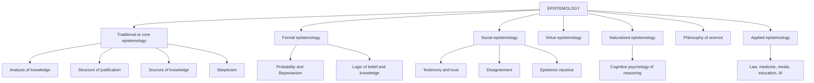

# Chapter 1. What Is Epistemology?

[Contents](README.md) · [Next: A History of the Theory of Knowledge →](02-history-of-epistemology.md)

**Audio:** [listen to this chapter](audio/01-what-is-epistemology.mp3) (35 min, narrated) · [open in the player](audio/index.html#01)

---

> "All men by nature desire to know."
> — Aristotle, *Metaphysics* I.1

> "The first principle is that you must not fool yourself — and you are the easiest person to fool."
> — Richard Feynman, Caltech commencement address, 1974

**Epistemology** is the branch of philosophy that studies knowledge, belief, evidence, justification, and rationality. The word comes from the Greek *epistēmē* (knowledge, understanding) and *logos* (account, study). The Scottish philosopher James Frederick Ferrier coined the English term in his *Institutes of Metaphysic* (1854). German philosophers call the field *Erkenntnistheorie*, "theory of cognition."

Most disciplines study some part of the world. Epistemology studies how we come to know *anything* about the world. For that reason it sits under every other field. Physicists, historians, judges, doctors, and journalists all make claims to know things, and each of them relies, usually without saying so, on assumptions about what counts as good evidence and when a belief is warranted. Epistemology makes those assumptions explicit and tests them.

This chapter gives you the basic vocabulary and the overall map. Every later chapter builds on it.

---

## In this chapter

- [Why epistemology matters for critical thinking](#why-epistemology-matters-for-critical-thinking)
- [The central questions](#the-central-questions)
- [Three kinds of knowing](#three-kinds-of-knowing)
- [Belief, credence, and acceptance](#belief-credence-and-acceptance)
- [The basic vocabulary](#the-basic-vocabulary)
- [Three great distinctions](#three-great-distinctions)
- [Epistemic reasons versus practical reasons](#epistemic-reasons-versus-practical-reasons)
- [Epistemology is normative](#epistemology-is-normative)
- [The map of the field](#the-map-of-the-field)
- [How the pieces connect: one news story, twelve questions](#how-the-pieces-connect-one-news-story-twelve-questions)
- [Check your understanding](#check-your-understanding)
- [Further reading](#further-reading)

---

## Why epistemology matters for critical thinking

Critical thinking is applied epistemology. When you ask "Is this true?", "How do they know that?", "Why should I trust this source?", or "What would change my mind?", you are asking epistemological questions. You are just asking them quickly and informally.

Take a disagreement that could happen at any dinner table:

> **A:** "That new diet works. My cousin lost 10 kg in two months."
> **B:** "Anecdotes aren't evidence."
> **A:** "So you think my cousin is lying?"
> **B:** "No, but one case proves nothing."
> **A:** "Well, the scientists said eggs were bad and then said they were fine, so why trust them?"

This short exchange contains at least six epistemological problems:

1. **The status of testimony.** A believes something because a cousin said it. When is testimony a good reason? See [Testimony](07-sources-of-knowledge.md#testimony).
2. **Induction from a single case.** Can one instance support a general claim? See [Hume's problem of induction](09-induction-probability-bayes.md#humes-problem-of-induction) and [Hasty generalization](15-fallacies.md#hasty-generalization).
3. **Causal inference.** Even if the cousin lost weight, did the *diet* cause it? See [Causation and causal inference](10-science-and-evidence.md#causation-and-causal-inference).
4. **A misunderstanding of B's claim.** B said "one case proves nothing"; A heard "your cousin is lying." That is a [straw man](15-fallacies.md#straw-man), or at least a failure of the [principle of charity](03-logic-and-arguments.md#the-principle-of-charity).
5. **Trust in expertise.** Does the fact that scientists revised a view mean they are unreliable, or is revision a sign that a self-correcting method is working? See [Experts and novices](12-social-epistemology.md#experts-and-novices) and [Fallibilism](06-justification.md#fallibilism).
6. **Standards of evidence.** "Anecdotes aren't evidence" is itself too strong. Anecdotes are weak evidence, not zero evidence. See [Bayes' theorem](09-induction-probability-bayes.md#bayes-theorem).

Someone who has studied epistemology does not "win" such arguments by knowing clever terms. They can see the *structure* of the disagreement: what is being claimed, what would support it, where the parties actually differ, and what would settle the matter. That is the skill this guide is designed to build.

There are three further reasons to study the field.

- **Self-defense.** People who want your money, your vote, or your loyalty exploit predictable weaknesses in human reasoning. Knowing the weaknesses ([Chapter 14](14-psychology-of-reasoning.md)) and the standard tricks ([Chapter 15](15-fallacies.md)) is protective.
- **Better collective decisions.** Democracies, courts, scientific communities, and companies are systems for producing knowledge together. Understanding [social epistemology](12-social-epistemology.md) shows why these systems work when they work and why they fail.
- **Intellectual honesty.** Epistemology teaches you to hold beliefs with the right degree of confidence, not more and not less. This is a moral achievement as well as an intellectual one (see [Chapter 13](13-virtues-and-ethics-of-belief.md)).

---

## The central questions

Epistemology is organized around a handful of big questions. Almost every topic in this guide is an attempt to answer one of them.

| Question | Name of the problem | Where to go |
|---|---|---|
| What *is* knowledge? How does it differ from true belief, lucky guessing, or opinion? | The analysis of knowledge | [Chapter 5](05-the-nature-of-knowledge.md) |
| What makes a belief *justified* or *reasonable*? | The theory of justification | [Chapter 6](06-justification.md) |
| Where does knowledge come from? Perception, memory, reason, testimony? | The sources of knowledge | [Chapter 7](07-sources-of-knowledge.md) |
| Can we know anything at all? How far does our knowledge reach? | The problem of skepticism | [Chapter 8](08-skepticism.md) |
| How can past experience justify beliefs about the future? | The problem of induction | [Chapter 9](09-induction-probability-bayes.md) |
| How should we reason under uncertainty? | Probability and Bayesian epistemology | [Chapter 9](09-induction-probability-bayes.md) |
| What makes science a reliable way of knowing? | Philosophy of science | [Chapter 10](10-science-and-evidence.md) |
| What is truth? Is it objective? | Theories of truth; relativism | [Chapter 11](11-truth-and-relativism.md) |
| When should we trust others? What should we do when experts or peers disagree? | Social epistemology | [Chapter 12](12-social-epistemology.md) |
| What intellectual character traits make a good thinker? Do we have duties about what to believe? | Virtue epistemology; the ethics of belief | [Chapter 13](13-virtues-and-ethics-of-belief.md) |
| How do real human minds reason, and how do they go wrong? | Naturalized epistemology; the psychology of reasoning | [Chapter 14](14-psychology-of-reasoning.md) |

Two questions come before all the others, and philosophers have argued about their order for 2,500 years:

- **What do we know?** (the *extent* of knowledge)
- **How do we know?** (the *criteria* of knowledge)

To say what we know, it seems we need a criterion for picking out knowledge. To test a criterion, it seems we need some clear cases of knowledge to check it against. This circle is called [the problem of the criterion](06-justification.md#the-problem-of-the-criterion). It is a good first example of how epistemology works: a simple question leads quickly to a deep structural puzzle.

---

## Three kinds of knowing

English uses the single word "know" for quite different things. Many other languages separate them: French has *savoir* and *connaître*, German *wissen* and *kennen*, Persian *dānestan* (دانستن) and *shenākhtan* (شناختن).

The concept itself seems to be universal. "Know" is among the ten most common verbs in English, and linguists working on the "Natural Semantic Metalanguage" project (Anna Wierzbicka, Cliff Goddard, and colleagues) list KNOW and THINK among a small set of meanings, fewer than a hundred, that appear to have an exact equivalent in every human language studied. Many words you might expect to be universal are not: some languages have no single verb for "go" or "eat." Jennifer Nagel (*Knowledge: A Very Short Introduction*, 2014, ch. 1) takes this as a hint that the contrast between knowing and merely thinking is basic to human life, not a philosopher's invention.

Knowledge is also different from **facts**. Nagel's example: shake a sealed box containing a coin and put it down. The coin has landed heads or tails; that is a fact. But until someone looks, no one knows which. Writing "heads" on one slip of paper and "tails" on another puts the fact on paper without putting it into anyone's knowledge. Knowledge always belongs to someone: a person, or a group whose members pool what they know (an orchestra knows how to play a symphony that no single player could).

### Propositional knowledge

**Propositional knowledge** is *knowing that* something is the case.

- I know *that* Paris is the capital of France.
- She knows *that* the train leaves at 9:15.
- We know *that* smoking causes cancer.

What is known here is a **proposition**: something that can be true or false. Propositional knowledge is the main topic of traditional epistemology, and when this guide says "knowledge" without qualification, it means this kind. [Chapter 5](05-the-nature-of-knowledge.md) asks what it consists in.

### Knowledge-how

**Knowledge-how** (practical knowledge) is *knowing how* to do something.

- I know how to ride a bicycle.
- She knows how to comfort a crying child.
- A chess master knows how to exploit a weak pawn structure.

Gilbert Ryle, in "Knowing How and Knowing That" (1946) and *The Concept of Mind* (1949), argued that knowing how is a distinct kind of knowledge and cannot be reduced to knowing facts. His argument: if every intelligent action required first considering a proposition, then considering that proposition intelligently would require considering another proposition first, and so on forever. So some intelligence must be in the doing itself. This is **anti-intellectualism**.

Jason Stanley and Timothy Williamson ("Knowing How," 2001) defended **intellectualism**: knowing how to ride a bicycle is knowing, of some way *w*, that *w* is a way for you to ride a bicycle, grasped under a "practical mode of presentation." The debate continues. For critical thinkers, the practical upshot is clear enough: *reasoning well is partly a skill*. You can know all the rules of logic and still reason badly in a heated argument, just as you can know the physics of cycling and still fall off. Skills need practice. That is why this guide includes exercises. See also [Knowledge-how revisited](05-the-nature-of-knowledge.md#knowledge-how-revisited).

### Knowledge by acquaintance

**Knowledge by acquaintance** is direct familiarity with a thing, person, place, or experience.

- I know Tehran (I have lived there).
- I know the taste of saffron.
- I know my sister.

Bertrand Russell distinguished "knowledge by acquaintance" from "knowledge by description" ("Knowledge by Acquaintance and Knowledge by Description," 1910–11; *The Problems of Philosophy*, 1912, ch. 5). You might know a great many facts *about* Napoleon (knowledge by description) without ever having been acquainted with him.

A famous thought experiment presses on this distinction. Frank Jackson's **Mary's room** ("Epiphenomenal Qualia," 1982): Mary is a brilliant scientist who knows every physical fact about color vision but has lived her whole life in a black-and-white room. When she steps outside and sees a red rose for the first time, does she learn something new? Many people say yes: she learns *what it is like* to see red. If so, there is knowledge that no amount of propositional description delivers. (Jackson used the case to argue against physicalism in philosophy of mind, and later changed his mind. The case is still a sharp illustration of acquaintance.)

The Islamic philosophical tradition makes a related distinction between **knowledge by presence** (*ʿilm ḥuḍūrī*) and **acquired, representational knowledge** (*ʿilm ḥuṣūlī*). It is discussed in [Chapter 7](07-sources-of-knowledge.md#knowledge-by-presence).

> **Connection.** Other forms: *knowing who*, *knowing where*, *knowing whether*, *knowing why* ("knowledge-wh"). Many philosophers analyze these as propositional: to know where the keys are is to know, of some place, *that* the keys are there. Knowing *why* is closely tied to [understanding](05-the-nature-of-knowledge.md#understanding-and-wisdom), which some argue is more valuable than knowledge.

---

## Belief, credence, and acceptance

Knowledge involves belief (see [The belief condition](05-the-nature-of-knowledge.md#the-belief-condition)), so we need to be clear about what belief is.

**Belief** is the attitude of *taking something to be true*. If you believe that it is raining, you represent the world as including rain, you are disposed to say "It's raining" if asked sincerely, to carry an umbrella if you care about staying dry, and to be surprised if you walk out and find the street dry. Beliefs are commonly understood as **dispositional**: you believe right now that 2 + 2 = 4 even though you were not thinking about it a moment ago.

Belief is an **all-or-nothing** notion in ordinary talk: you believe, disbelieve, or suspend judgment. There are three basic **doxastic attitudes** (from Greek *doxa*, opinion):

1. **Belief** that *p*
2. **Disbelief** that *p* (believing not-*p*)
3. **Suspension of judgment** about *p* (neither)

But belief also comes in **degrees**. You are more confident that the sun will rise tomorrow than that your team will win on Saturday. A **credence** (or degree of belief, subjective probability) is a number between 0 and 1 representing how confident you are. Credence 1 is certainty that *p*, 0 is certainty that not-*p*, and 0.5 is maximal uncertainty between the two. Bayesian epistemology, covered in [Chapter 9](09-induction-probability-bayes.md#bayesian-epistemology), is largely a theory of how credences should behave.

How full belief relates to credence is a live question. A natural answer, the **Lockean thesis**, says you believe *p* when your credence in *p* is above some threshold (say 0.95). It runs into the [lottery paradox](09-induction-probability-bayes.md#full-belief-and-degrees-of-belief).

**Acceptance** is different from belief. To *accept* a proposition is to adopt it as a premise for reasoning and acting in some context, whether or not you believe it (L. Jonathan Cohen, *An Essay on Belief and Acceptance*, 1992; Michael Bratman, "Practical Reasoning and Acceptance in a Context," 1992). Examples:

- A defense lawyer accepts that her client is innocent for the purpose of building the defense, whatever she privately believes.
- An engineer accepts that air resistance is negligible when doing a quick calculation.
- A negotiator accepts the other side's figures "for the sake of argument."

Distinguishing belief from acceptance clears up many confused discussions. "You're assuming X!" is not a refutation when the other person has only *accepted* X for the sake of argument. Likewise, a scientific **model** is usually accepted, not believed. Everyone knows the ideal gas law is false in detail; it is accepted as a useful approximation.

Other attitudes that are *not* belief: **supposition** ("suppose the moon were made of cheese"), **imagination**, **hope**, **assumption**, **faith** (on some analyses), and **conjecture**. Keep them apart. Much bad reasoning slides from "it's possible that…" (a supposition) to "it's likely that…" (a credence) to "it's the case that…" (a belief).

---

## The basic vocabulary

These terms appear throughout the guide. Full definitions are in the [Glossary](17-glossary.md).

**Proposition.** What a declarative sentence expresses; the kind of thing that can be true or false. "Snow is white" and "La neige est blanche" express the same proposition.

**Truth.** On the most common view, a proposition is true when things are as it says they are. Aristotle put it this way: "To say of what is that it is not, or of what is not that it is, is false, while to say of what is that it is, and of what is not that it is not, is true" (*Metaphysics* Γ 7, 1011b25). The theories are compared in [Chapter 11](11-truth-and-relativism.md).

**Evidence.** Whatever makes a proposition more or less likely to be true *for you*, or supports it. Philosophers disagree about what evidence is: experiences? mental states? known facts? (Timothy Williamson's slogan is "E = K": your evidence is your knowledge.) A useful working idea from probability: *E is evidence for H when E is more probable if H is true than if H is false.* See [Evidence and confirmation](09-induction-probability-bayes.md#evidence-and-confirmation).

**Justification.** The property a belief has when it is held for good reasons, or formed in the right way, so that holding it is epistemically appropriate. A justified belief can still be false: a detective can be justified in believing the butler did it and turn out to be wrong. See [Chapter 6](06-justification.md).

**Rationality.** Close to justification but broader. *Epistemic* rationality concerns believing in line with evidence; *practical* rationality concerns acting well given one's goals and beliefs. Philosophers also distinguish *rationality* as internal coherence (not believing contradictions, updating on evidence) from *reasonableness* in a wider sense.

**Warrant.** Alvin Plantinga's term for "whatever it is that turns true belief into knowledge" (*Warrant: The Current Debate*, 1993). It is a placeholder term: saying something *has warrant* does not yet say what warrant is.

**Certainty.** Two senses. *Psychological* certainty is a feeling of total confidence; people feel certain about many false things. *Epistemic* certainty is the highest possible degree of justification, where there is no possibility of error given your evidence. Few beliefs are epistemically certain.

**Fallibilism.** The view that we can know something even though our justification does not guarantee its truth. Nearly all contemporary epistemologists are fallibilists. See [Fallibilism](06-justification.md#fallibilism).

**Defeater.** A consideration that removes or weakens the justification for a belief. See [Defeaters](06-justification.md#defeaters).

**Reasons.** Philosophers distinguish three senses:
- A **normative reason** *counts in favor* of believing or doing something. ("The dark clouds are a reason to believe it will rain.")
- A **motivating reason** is the consideration in light of which someone actually believes or acts. ("She believed it would rain because she saw clouds.")
- An **explanatory reason** explains why something happened, whether or not anyone was reasoning. ("The bridge collapsed because of metal fatigue.")

A belief can have a good normative reason available and yet be held for a bad motivating reason. That difference underlies the distinction between [propositional and doxastic justification](06-justification.md#what-justification-is).

---

## Three great distinctions

Three distinctions divide up the kinds of truth and knowledge. They are easy to confuse, and some of the most important arguments in philosophy turn on keeping them apart.

### A priori and a posteriori

This distinction is about **how a proposition is known**.

- A proposition is known **a priori** if it can be known independently of experience, other than the experience needed to acquire the concepts. Examples: "All bachelors are unmarried," "7 + 5 = 12," "If A is taller than B and B is taller than C, then A is taller than C."
- A proposition is known **a posteriori** (empirically) if knowing it requires experience of the world. Examples: "Water boils at 100 °C at sea level," "Canberra is the capital of Australia," "There are more than a million species of insects."

"Independent of experience" does not mean you could know it with no experience at all. You needed experience to learn what "bachelor" means. The point is that once you understand the proposition, *no further observation is needed* to know it is true.

### Analytic and synthetic

This distinction is about **what makes a proposition true**, or in Kant's formulation, about the relation between subject and predicate.

- A proposition is **analytic** if it is true in virtue of meaning alone, or (Kant) if the predicate is "contained in" the concept of the subject. "All bachelors are unmarried": the concept *bachelor* already contains *unmarried*.
- A proposition is **synthetic** if its truth depends on how the world is, not just on meanings. "All bachelors are messy" (false, but synthetic) or "The cat is on the mat."

Kant introduced the distinction in the *Critique of Pure Reason* (1781). W. V. O. Quine's "Two Dogmas of Empiricism" (1951) famously attacked it, arguing that no one had given a non-circular account of "true in virtue of meaning." See [Quine and naturalized epistemology](02-history-of-epistemology.md#quine-and-naturalized-epistemology).

### Necessary and contingent

This distinction is about **the modal status** of a proposition: whether it could have been otherwise.

- A **necessary** truth could not have been false: it is true in every possible world. "2 + 2 = 4," "Nothing is red all over and green all over at the same time."
- A **contingent** truth is true but could have been false. "Napoleon lost at Waterloo," "There is a laptop on my desk."

### Putting the three distinctions together

For a long time philosophers assumed these three lined up neatly: *a priori = analytic = necessary*, and *a posteriori = synthetic = contingent*. Two philosophers showed that the alignment fails.

**Kant** argued there are **synthetic a priori** truths: propositions that tell us something substantive about the world yet can be known without experience. His examples were the truths of arithmetic and geometry ("7 + 5 = 12"; "the shortest distance between two points is a straight line") and fundamental principles such as "every event has a cause." Explaining how synthetic a priori knowledge is possible was the central project of the *Critique of Pure Reason*.

**Saul Kripke**, in *Naming and Necessity* (lectures 1970, book 1980), argued for:

- **Necessary a posteriori** truths. "Water is H₂O" and "Hesperus is Phosphorus" (the evening star is the morning star; both are Venus). If water *is* H₂O, it could not have been anything else, so the truth is necessary. But we discovered it by chemistry, not by reflection, so it is known a posteriori.
- **Contingent a priori** truths. If you fix the meaning of "one meter" as "the length of stick S at time t₀," you know a priori that stick S is one meter long at t₀, yet it is contingent, since the stick could have been longer.

| | A priori | A posteriori |
|---|---|---|
| **Necessary** | "2 + 2 = 4"; "All bachelors are unmarried" | "Water is H₂O" (Kripke) |
| **Contingent** | "Stick S is one meter long at t₀" (Kripke; controversial) | "Paris is the capital of France" |

> **Why this matters for critical thinking.** Many arguments quietly depend on one of these distinctions. "You can't prove that from the armchair!" asserts that a claim is a posteriori. "That's true by definition!" asserts that it is analytic, and often hides a [persuasive definition](04-language-concepts-and-definitions.md#kinds-of-definition). "That's just how things happen to be" asserts contingency. When you hear such a move, ask which distinction is in play and whether the classification is correct.

---

## Epistemic reasons versus practical reasons

Suppose a billionaire offers you one million dollars to believe that the moon is made of cheese. You have an excellent *practical* reason to have the belief. But you have no *epistemic* reason to think it is true, and in fact you probably *cannot* believe it at will. (Try.)

This thought experiment illustrates a central idea:

- **Epistemic reasons** bear on whether a proposition is *true*: evidence, arguments, reliable testimony.
- **Practical** (or *pragmatic*) reasons bear on whether it would be *good* or *useful* to have a belief: comfort, reward, social belonging, motivation.

Philosophers have noticed that when we deliberate about *whether to believe p*, the question seems to collapse immediately into the question *whether p is true*. Nishi Shah called this the **transparency** of belief ("How Truth Governs Belief," 2003). That feature suggests belief is constitutively aimed at truth in a way that desire and hope are not.

Practical reasons for belief still matter in debates:

- **Pascal's Wager** (Blaise Pascal, *Pensées*, published 1670) is the most famous practical argument for belief: if God exists, belief brings infinite reward; if not, you lose little. So, Pascal argued, you should try to believe. See [Faith, reason, and religious epistemology](13-virtues-and-ethics-of-belief.md#faith-reason-and-religious-epistemology).
- **William James's "The Will to Believe"** (1896) argued that when a choice is "live, forced, and momentous" and evidence cannot settle it, our "passional nature" may legitimately decide. See [The ethics of belief](13-virtues-and-ethics-of-belief.md#the-ethics-of-belief-clifford-and-james).
- **Motivated reasoning** is the psychological phenomenon of practical reasons leaking into belief without our noticing. We believe what we want to be true, or what our group believes. See [Motivated reasoning](14-psychology-of-reasoning.md#motivated-reasoning).

> **Practical tip.** In a heated discussion, ask yourself: *"Would I still believe this if it were inconvenient for me or my side?"* If you would not, your belief may be resting on practical rather than epistemic reasons.

---

## Epistemology is normative

Some fields are **descriptive**: they describe how things are. Psychology describes how people actually reason. Epistemology is largely **normative**: it concerns how people *ought* to reason, what they are *entitled* to believe, and what counts as *good* evidence.

Ethics asks "What should I do?" Epistemology asks "What should I believe?" Parallel concepts show up on both sides:

| Ethics | Epistemology |
|---|---|
| Right / wrong action | Justified / unjustified belief |
| Moral duty | Epistemic duty (e.g., to consider evidence) |
| Moral virtue (courage, honesty) | Intellectual virtue (open-mindedness, intellectual honesty) |
| Moral responsibility and blame | Epistemic responsibility and blame |
| Consequentialism: maximize good outcomes | Veritism: maximize true beliefs, minimize false ones |
| Deontology: follow duties | Deontological justification: meet your epistemic obligations |

The parallel is not perfect. We usually cannot choose our beliefs directly, which raises the problem of [doxastic voluntarism](06-justification.md#deontology-and-doxastic-voluntarism). But it is illuminating. [Chapter 13](13-virtues-and-ethics-of-belief.md) develops it.

What is the *goal* of believing? The most popular answer is **truth**: we want to believe truths and avoid believing falsehoods. William James noticed that these are two separate commandments, "Believe truth!" and "Shun error!", and that they pull in different directions. If you only cared about believing truths, you would believe everything. If you only cared about avoiding error, you would believe nothing. Every epistemic standard is a trade-off between the two. The same trade-off appears in statistics as the balance between false positives and false negatives, and in law as the standard of proof ("beyond reasonable doubt" favors avoiding false convictions over securing true ones).

Other candidate epistemic goals include **knowledge**, **understanding**, **wisdom**, and **significant truth** (not just any truth; knowing the number of grains of sand on a beach is not valuable). These are discussed in [The value of knowledge](05-the-nature-of-knowledge.md#the-value-of-knowledge).

---

## The map of the field

Contemporary epistemology has many branches. They are best thought of as different angles on the same subject.

- **Traditional (core) epistemology.** The analysis of knowledge, justification, sources, skepticism. [Chapters 5–8](05-the-nature-of-knowledge.md).
- **Formal epistemology.** Uses mathematics (probability theory, logic, decision theory) to model belief and reasoning. [Chapter 9](09-induction-probability-bayes.md).
- **Philosophy of science.** How scientific knowledge is produced and justified. [Chapter 10](10-science-and-evidence.md).
- **Social epistemology.** Knowledge as produced and shared by communities; testimony, expertise, disagreement, institutions. [Chapter 12](12-social-epistemology.md).
- **Virtue epistemology.** Focuses on the intellectual character of the knower. [Chapter 13](13-virtues-and-ethics-of-belief.md).
- **Naturalized epistemology.** Treats epistemology as continuous with empirical science, especially psychology. [Chapter 14](14-psychology-of-reasoning.md) and [Quine](02-history-of-epistemology.md#quine-and-naturalized-epistemology).
- **Feminist and standpoint epistemology.** How social position affects knowledge. [Standpoint and feminist epistemology](12-social-epistemology.md#standpoint-and-feminist-epistemology).
- **Moral, religious, and mathematical epistemology.** How we can know moral truths, religious claims, and mathematical facts. [Reason and the a priori](07-sources-of-knowledge.md#reason-and-the-a-priori), [Faith, reason, and religious epistemology](13-virtues-and-ethics-of-belief.md#faith-reason-and-religious-epistemology).
- **Applied epistemology.** Epistemology of law (standards of proof, eyewitness testimony), medicine (evidence-based medicine), journalism, education, and artificial intelligence.

---

## How the pieces connect: one news story, twelve questions

To see how everything fits together, imagine reading this headline:

> **"New study: People who drink coffee live longer."**

A trained epistemic eye will ask:

1. **What exactly is claimed?** "Live longer" than whom? By how much? Is the claim causal ("coffee makes you live longer") or merely correlational ("coffee drinkers happen to live longer")? → [Chapter 4](04-language-concepts-and-definitions.md), [Chapter 10](10-science-and-evidence.md#correlation-and-causation)
2. **Who is telling me?** A journalist summarizing a press release summarizing a paper. Every link in the chain of [testimony](07-sources-of-knowledge.md#testimony) can distort.
3. **How was the study done?** An observational study of 500,000 people or a randomized trial of 50? → [Randomized controlled trials and the hierarchy of evidence](10-science-and-evidence.md#randomized-controlled-trials-and-the-hierarchy-of-evidence)
4. **Could something else explain the pattern?** Perhaps healthier, wealthier people drink more coffee. → [Confounding](10-science-and-evidence.md#correlation-and-causation)
5. **How big is the effect?** A 1% reduction in relative risk is very different from a 50% reduction. → [Statistics and significance](09-induction-probability-bayes.md#statistics-and-significance)
6. **Does this fit with other evidence?** One study against a hundred contrary ones should move you little. → [Bayes' theorem](09-induction-probability-bayes.md#bayes-theorem)
7. **What do experts say?** → [Experts and novices](12-social-epistemology.md#experts-and-novices)
8. **Has it been replicated?** → [The replication crisis](10-science-and-evidence.md#the-replication-crisis)
9. **Do I want it to be true?** (I love coffee.) → [Motivated reasoning](14-psychology-of-reasoning.md#motivated-reasoning)
10. **Am I seeing only the results that get headlines?** → [Survivorship bias](15-fallacies.md#survivorship-bias), [publication bias](10-science-and-evidence.md#the-replication-crisis)
11. **How confident should I be, and what would change my mind?** → [Calibration](09-induction-probability-bayes.md#calibration-and-scoring-rules)
12. **Does it matter for what I do?** High stakes may call for more evidence. → [Pragmatic encroachment](13-virtues-and-ethics-of-belief.md#pragmatic-encroachment)

A full worked analysis of this kind of headline is in [Case study 3](16-critical-thinking-toolkit.md#case-study-3-a-statistical-headline).

---

## Check your understanding

**1.** Classify each as propositional knowledge, knowledge-how, or knowledge by acquaintance: (a) Ali knows the smell of rain on dry earth. (b) Ali knows that petrichor is caused partly by plant oils and geosmin. (c) Ali knows how to predict rain from the sky's color.

Answer

(a) Acquaintance. (b) Propositional. (c) Knowledge-how. On the intellectualist view, (c) might reduce to propositional knowledge of a way of predicting rain, and one could argue that (a) involves propositional knowledge too. The categories are a starting point, not a final theory.

**2.** Classify "All vixens are female foxes" by the three distinctions.

Answer

A priori (knowable by understanding the words), analytic (true in virtue of meaning), necessary (could not be false). It is the standard case where all three line up.

**3.** Why is "Water is H₂O" philosophically interesting?

Answer

Kripke argued it is *necessary* (in every possible world, water is H₂O, since that is what water *is*) but known only *a posteriori* (through chemistry). That breaks the old assumption that all necessary truths are known a priori.

**4.** A friend says: "I believe in the lucky charm because it makes me calmer before exams." What kind of reason is this, and what is the problem?

Answer

It is a practical reason: it concerns the benefits of having the belief, not evidence that the charm is lucky. The friend may be confusing "believing the charm works" with "carrying the charm is calming." The calming effect could be real (the belief might function like a placebo) even if the charm has no causal power over exam outcomes. This is a good example of why the practical–epistemic distinction matters.

**5.** What is the difference between believing a proposition and accepting it? Give an example from science.

Answer

To believe *p* is to take *p* to be true. To accept *p* is to adopt it as a premise for reasoning or acting in some context, whether or not you believe it. A physicist accepts that a planet is a point mass when calculating its orbit, knowing that planets are not point masses.

**6.** Explain William James's two commandments and why they conflict.

Answer

"Believe truth!" and "Shun error!" If you maximize the first, you should believe as much as possible to catch every truth, and you will also catch many falsehoods. If you maximize the second, you should believe nothing and so avoid all error, and you will also miss every truth. Rational belief requires balancing the two. The balance can reasonably shift with context, such as the cost of errors.

**7.** In the dinner-table dialogue at the start of this chapter, B says "Anecdotes aren't evidence." Is B right?

Answer

Not quite. An anecdote is evidence in the probabilistic sense, since a cousin's weight loss is somewhat more likely if the diet works than if it doesn't. But it is *very weak* evidence. It is one case, it has no control group, it may reflect selection (we hear about successes), and other causes may explain it. A better statement: "One anecdote is far too weak to establish that the diet works."

---

## Further reading

**Accessible introductions**
- Jennifer Nagel, *Knowledge: A Very Short Introduction* (Oxford University Press, 2014). Short and excellent; the best first book.
- Duncan Pritchard, *What Is This Thing Called Knowledge?* (Routledge, 4th ed. 2018). Clear chapter-by-chapter textbook.
- Bertrand Russell, *The Problems of Philosophy* (1912). A classic that is still one of the best introductions to the subject. Free online.

**Textbooks**
- Robert Audi, *Epistemology: A Contemporary Introduction to the Theory of Knowledge* (Routledge, 3rd ed. 2011).
- Richard Feldman, *Epistemology* (Prentice Hall, 2003).
- Matthias Steup and Ram Neta, "Epistemology," *Stanford Encyclopedia of Philosophy* (online, regularly revised).

**On the distinctions**
- Immanuel Kant, *Prolegomena to Any Future Metaphysics* (1783), sections 1–5. Kant's shorter, more readable introduction to the analytic/synthetic and a priori/a posteriori distinctions.
- Saul Kripke, *Naming and Necessity* (Harvard University Press, 1980), Lecture I.
- Gilbert Ryle, *The Concept of Mind* (1949), ch. 2, "Knowing How and Knowing That."

---

[Contents](README.md) · [Next: A History of the Theory of Knowledge →](02-history-of-epistemology.md)
