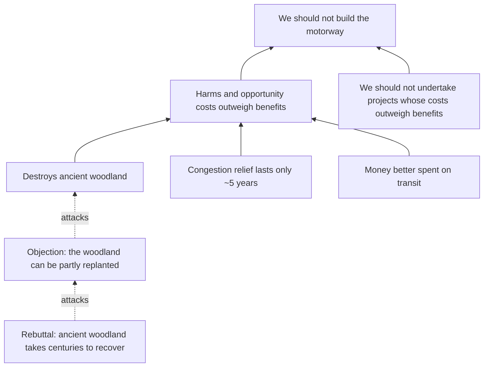
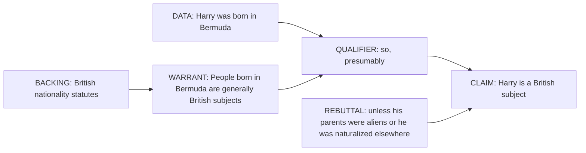

# Chapter 3. Logic and the Anatomy of Arguments

[← Previous: A History of the Theory of Knowledge](02-history-of-epistemology.md) · [Contents](README.md) · [Next: Language, Concepts, and Definitions →](04-language-concepts-and-definitions.md)

---

> "Contrariwise, if it was so, it might be; and if it were so, it would be; but as it isn't, it ain't. That's logic."
> — Tweedledee, in Lewis Carroll, *Through the Looking-Glass* (1871)

> "One person's modus ponens is another person's modus tollens."
> — A saying among philosophers

Epistemology asks when beliefs are justified. Very often, a belief is justified because it is supported by *other* beliefs through reasoning. **Logic** is the study of which patterns of reasoning are good, that is, which patterns transmit support from premises to conclusions. This chapter teaches you to identify arguments, put them in standard form, test them for validity and strength, find hidden premises, and map complex reasoning. These are the core technical skills of critical thinking. You will use them in every later chapter.

---

## In this chapter

- [What an argument is and is not](#what-an-argument-is-and-is-not)
- [Standard form](#standard-form)
- [Deduction, induction, and abduction](#deduction-induction-and-abduction)
- [Validity and soundness](#validity-and-soundness)
- [Strength and cogency](#strength-and-cogency)
- [Propositional logic](#propositional-logic)
- [Valid argument forms](#valid-argument-forms)
- [Formal fallacies](#formal-fallacies)
- [Categorical logic and syllogisms](#categorical-logic-and-syllogisms)
- [Predicate logic and quantifiers](#predicate-logic-and-quantifiers)
- [Modal logic basics](#modal-logic-basics)
- [Paradoxes as stress tests](#paradoxes-as-stress-tests)
- [Reconstructing real arguments](#reconstructing-real-arguments)
- [The Toulmin model](#the-toulmin-model)
- [Dialectical moves](#dialectical-moves)
- [Check your understanding](#check-your-understanding)
- [Further reading](#further-reading)

---

## What an argument is and is not

In logic, an **argument** is not a quarrel. It is a set of statements in which some (the **premises**) are offered as reasons for another (the **conclusion**).

> Premise: All mammals breathe air.
> Premise: Whales are mammals.
> Conclusion: Therefore, whales breathe air.

Many things that look like arguments are not:

- **Assertions.** "Taxes are too high." A claim with no reasons given.
- **Explanations.** "The glass broke because it fell on the tiles." This does not try to *prove* that the glass broke (we already know it did). It tells us *why*. The difference matters: in an argument, the premises are supposed to be better known than the conclusion; in an explanation, the thing explained (the *explanandum*) is usually already accepted. The same "because" sentence can be either, depending on context.
- **Illustrations.** "Many birds cannot fly, for example, penguins and ostriches." The example illustrates rather than proves.
- **Conditionals.** "If it rains, the match will be cancelled." This does not assert that it will rain or that the match is cancelled. It asserts a relation. A conditional can be a premise in an argument but is not itself an argument.
- **Reports of belief.** "I think the economy will recover." A statement about someone's mental state.
- **Rhetoric.** "Any decent person knows this policy is a disaster!" Emotional pressure, not reasons.

**Indicator words** help you find the parts of an argument.

| Conclusion indicators | Premise indicators |
|---|---|
| therefore, so, thus, hence, consequently, it follows that, which shows that, we can conclude that, accordingly | because, since, for, given that, as shown by, the reason is that, in view of, seeing that, assuming that |

Indicators are useful but unreliable. "Since" can mean "from the time that," and many arguments use no indicator words at all. The real test is to ask: *what is this person trying to get me to believe, and what are they offering in support of it?*

---

## Standard form

To evaluate an argument, first put it in **standard form**: number the premises, put the conclusion last, and draw a line between them.

> A newspaper editorial says: "We should not build the new motorway. It will destroy ancient woodland, and the traffic studies show it will only relieve congestion for about five years before new traffic fills it up. Besides, the money would do more good in public transport."

In standard form:

1. The new motorway would destroy ancient woodland.
2. The motorway would relieve congestion for only about five years (because of induced demand).
3. The same money would produce more benefit if spent on public transport.
4. *(Unstated)* We should not undertake a project whose harms and opportunity costs outweigh its benefits.
5. *(Unstated)* The harms and opportunity costs of the motorway outweigh its benefits.
-----
C. We should not build the new motorway.

Notice that the reconstruction had to add premises 4 and 5, which the editorial assumed but did not state. Supplying these **missing premises** fairly is one of the most important skills in critical thinking. See [Supplying missing premises](#supplying-missing-premises).

Standard form also exposes the argument's *structure*. Premises 1–3 are not independent reasons that each alone would justify the conclusion. They jointly support premise 5, which with premise 4 yields the conclusion. That structure tells you where to aim criticism: someone who wants to build the motorway must dispute 1, 2, or 3, or argue that the benefits are larger than the editorial suggests, which would undermine premise 5.

---

## Deduction, induction, and abduction

Arguments are traditionally divided by the kind of support the premises are *meant* to give the conclusion.

**Deductive arguments** aim to show that the conclusion *must* be true if the premises are. The link is necessary.

> All metals conduct electricity. Copper is a metal. So copper conducts electricity.

**Inductive arguments** aim to show that the conclusion is *probably* true given the premises. The link is one of probability. Typical forms:

- **Enumerative induction** (generalization from a sample): "Every emerald examined so far has been green, so all emeralds are green."
- **Statistical syllogism** (from a general rate to a case): "90% of patients with these symptoms have flu; this patient has these symptoms; so this patient probably has flu."
- **Argument from analogy**: "Rats and humans share relevant physiology; this drug damages rat livers; so it will probably damage human livers."
- **Prediction**: "The sun has risen every day in recorded history, so it will rise tomorrow."

**Abductive arguments**, a term from Charles Sanders Peirce, often called **inference to the best explanation** (IBE, a term from Gilbert Harman, 1965), conclude that a hypothesis is true because it would best explain the evidence.

> The kitchen window is broken, there is mud on the floor, and the jewelry box is empty. The best explanation is a burglary. So there was probably a burglary.

Sherlock Holmes calls his method "deduction," but it is almost always abduction. When he tells Watson "You have been in Afghanistan, I perceive," he is inferring the best explanation of Watson's tan, bearing, and injured arm.

| | Deduction | Induction | Abduction |
|---|---|---|---|
| Direction | From general to particular, or rule to case (typically) | From observed cases to general or future claims | From evidence to its best explanation |
| Support | Necessary (if valid) | Probabilistic | Probabilistic, explanatory |
| Can the premises be true and the conclusion false? | Not if valid | Yes | Yes |
| Adding premises | Cannot make a valid argument invalid (monotonic) | Can strengthen or weaken the inference (non-monotonic) | Can overturn the best explanation (non-monotonic) |
| Extends knowledge? | Makes explicit what is implicit in the premises | Goes beyond the premises | Goes beyond the premises and introduces new hypotheses |
| Key figure | Aristotle, Frege | Hume, Mill | Peirce, Harman, Lipton |

The "general to particular" slogan for deduction is only a rough guide. "Socrates is a man and Socrates is mortal, so something is both a man and mortal" is deductive and goes from particular to general.

The row about **monotonicity** is worth remembering. Deduction is **monotonic**: if premises P deductively entail C, then P plus any further premises still entail C. Non-deductive reasoning is **non-monotonic**: "Tweety is a bird, so Tweety flies" is a good inference, but add "Tweety is a penguin" and it fails. Most real-world reasoning is non-monotonic, which is why [defeaters](06-justification.md#defeaters) matter so much in epistemology.

> **Connection.** Induction raises one of philosophy's most famous problems: how can it be *rational* to go beyond our evidence? See [Hume's problem of induction](09-induction-probability-bayes.md#humes-problem-of-induction). Abduction is central to science and detective work; see [Inference to the best explanation](10-science-and-evidence.md#inference-to-the-best-explanation).

---

## Validity and soundness

A deductive argument is **valid** if and only if it is *impossible* for all its premises to be true and its conclusion false. Validity is about **form**, not content. It concerns the connection between premises and conclusion, not whether the premises are actually true.

A valid argument with false premises:

> All fish can fly. All dogs are fish. So all dogs can fly.

This is **valid**: *if* the premises were true, the conclusion would have to be. It is just not a good argument, because its premises are false.

An invalid argument with true premises and a true conclusion:

> All dogs are mammals. Some mammals are pets. So some dogs are pets.

Every statement is true, but the argument is **invalid**. The premises do not guarantee the conclusion. Compare a parallel argument with the same form: "All dogs are mammals. Some mammals are whales. So some dogs are whales." True premises, false conclusion. Since the form can lead from truth to falsehood, it is invalid.

An argument is **sound** if it is valid *and* all its premises are true. A sound argument's conclusion must be true.

| | Premises all true | At least one premise false |
|---|---|---|
| **Valid** | Sound: conclusion guaranteed true | Unsound: conclusion may be true or false |
| **Invalid** | Unsound: conclusion may be true or false | Unsound: conclusion may be true or false |

Four facts about validity that people often get wrong:

1. **A valid argument can have a false conclusion** (if a premise is false).
2. **An invalid argument can have a true conclusion.** Invalidity does not show the conclusion is false; it shows the argument fails to establish it. Concluding that a claim is false because an argument for it is bad is the [fallacy fallacy](15-fallacies.md#the-fallacy-fallacy).
3. **If an argument is valid and its conclusion is false, at least one premise is false.** This is the engine of refutation.
4. **Validity is not the same as persuasiveness.** A valid argument can be useless if its premises are more doubtful than its conclusion.

### The method of counterexample

To show an argument form is invalid, find a **counterexample**: an argument with the same form, obviously true premises, and an obviously false conclusion. This is sometimes called **refutation by logical analogy** or **parity of reasoning**.

> "Successful people wake up early. I wake up early. So I will be successful."
>
> Same form: "Cats have four legs. My table has four legs. So my table is a cat."

The second argument has the same form and clearly fails, so the form is invalid. This technique is powerful in real discussions because it requires no technical vocabulary. You simply say: "By that reasoning, we could also conclude..."

---

## Strength and cogency

Inductive and abductive arguments are not valid or invalid. They are **strong** or **weak**. An argument is **strong** if, assuming the premises are true, the conclusion is probably true. It is **cogent** if it is strong *and* its premises are true (or acceptable). Cogency plays the role for induction that soundness plays for deduction.

Strength comes in degrees. Compare:

> (a) I surveyed 5 people at a gym; 4 exercise daily. So about 80% of the population exercises daily.
>
> (b) A randomized national survey of 10,000 adults found 23% exercise daily (±1%). So about 23% of adults exercise daily.

(a) is very weak (tiny, biased sample). (b) is strong.

The strength of an inductive generalization depends on:

- **Sample size.** Larger samples reduce random error.
- **Representativeness.** Is the sample free of selection bias? A sample of gym-goers is not representative of the population on exercise habits.
- **Variety.** Were instances observed under many different conditions?
- **The strength of the claim.** "Most emeralds are green" is easier to support than "All emeralds are green."
- **Background knowledge.** Do we know of a mechanism? Do we know that this kind of property tends to be uniform across a kind? Copper's conductivity is uniform; people's political opinions are not.

The strength of an **argument from analogy** depends on the number and relevance of the similarities, the number and relevance of the differences, and the diversity of the cases compared. Rats and humans share liver enzymes relevant to drug metabolism; they differ in many other ways, some of which may matter.

The strength of an **abductive argument** depends on whether the hypothesis is the *best* of the available explanations, which requires comparing it against rivals. An explanation can look good until someone thinks of a better alternative. That is the most common failure mode of abductive reasoning. See [Inference to the best explanation](10-science-and-evidence.md#inference-to-the-best-explanation).

---

## Propositional logic

**Propositional logic** (also called sentential logic) studies how the truth of compound statements depends on the truth of their parts. It is the simplest modern logic, and it is enough to analyze a great many everyday arguments.

### Connectives and truth tables

Let *P* and *Q* stand for any propositions. The main **connectives** are:

| Connective | Symbol | English | True when |
|---|---|---|---|
| Negation | ¬P | not P | P is false |
| Conjunction | P ∧ Q | P and Q | both are true |
| Disjunction | P ∨ Q | P or Q (inclusive) | at least one is true |
| Conditional | P → Q | if P then Q | not (P true and Q false) |
| Biconditional | P ↔ Q | P if and only if Q | P and Q have the same truth value |

The full truth table:

| P | Q | ¬P | P ∧ Q | P ∨ Q | P → Q | P ↔ Q |
|---|---|---|---|---|---|---|
| T | T | F | T | T | T | T |
| T | F | F | F | T | F | F |
| F | T | T | F | T | T | F |
| F | F | T | F | F | T | T |

Note that logical "or" is **inclusive**: "P or Q" is true when both are true. Ordinary English sometimes uses an **exclusive** "or" ("soup or salad" usually means not both). When analyzing an argument, check which is meant. An argument that depends on exclusive "or" when only inclusive "or" is justified commits the fallacy of [affirming a disjunct](#formal-fallacies).

Two useful equivalences, **De Morgan's laws**:

- ¬(P ∧ Q) ≡ ¬P ∨ ¬Q: "It's not true that both P and Q" means "Either not P or not Q."
- ¬(P ∨ Q) ≡ ¬P ∧ ¬Q: "Neither P nor Q" means "Not P and not Q."

Everyday mistakes with negation are common. "It's not true that all politicians are corrupt" does *not* mean "No politicians are corrupt." It means "Some politicians are not corrupt."

### The conditional

The conditional "if P then Q" is the most important and most misunderstood connective. P is the **antecedent**; Q is the **consequent**.

The truth table says that P → Q is false only when P is true and Q is false. This **material conditional** gives some odd results: "If the moon is made of cheese, then 2 + 2 = 5" comes out true, because the antecedent is false. These are the **paradoxes of material implication**. Ordinary English conditionals are more complicated, and logicians have developed alternative theories (strict conditionals, counterfactual conditionals, probabilistic accounts). For evaluating arguments, the key facts hold on all theories:

- If P → Q is true and P is true, then Q is true.
- If P → Q is true and Q is false, then P is false.
- P → Q does *not* imply Q → P (its **converse**).
- P → Q does *not* imply ¬P → ¬Q (its **inverse**).
- P → Q *is* equivalent to ¬Q → ¬P (its **contrapositive**).

| Statement | Form | Equivalent to the original? |
|---|---|---|
| If it's a dog, it's a mammal. | P → Q | (original) |
| If it's a mammal, it's a dog. | Q → P (converse) | **No** |
| If it's not a dog, it's not a mammal. | ¬P → ¬Q (inverse) | **No** |
| If it's not a mammal, it's not a dog. | ¬Q → ¬P (contrapositive) | **Yes** |

Many English expressions are conditionals in disguise:

- "Q if P" = P → Q
- "P only if Q" = P → Q (note: *not* Q → P)
- "P unless Q" = ¬Q → P (equivalently, P ∨ Q)
- "No P without Q" = P → Q
- "All P are Q" = for any x, if x is P then x is Q

"Only if" trips up almost everyone. "You can vote only if you are registered" means: if you vote, then you are registered. It does *not* mean that being registered guarantees you can vote (you might also need to be of age).

### Necessary and sufficient conditions

Conditionals express **necessary** and **sufficient conditions**, the most useful concepts for analyzing definitions and claims.

- P is **sufficient** for Q if P's being true guarantees Q's being true: P → Q.
- Q is **necessary** for P if P cannot be true without Q: P → Q.

The *same* conditional expresses both. In "If it is a square, it is a rectangle": being a square is sufficient for being a rectangle; being a rectangle is necessary for being a square.

| Example | Necessary? | Sufficient? |
|---|---|---|
| Oxygen, for fire | Yes | No (also need fuel, heat) |
| Being a square, for being a rectangle | No | Yes |
| Having three sides, for being a triangle (closed plane figure with straight sides) | Yes | Yes |
| Buying a lottery ticket, for winning the lottery | Yes | No |
| Decapitation, for death | No | Yes |

Confusing necessary and sufficient conditions produces many bad arguments:

- "Hard work is necessary for success, so if I work hard I'll succeed." (Treating necessary as sufficient.)
- "Smoking is sufficient to raise cancer risk, so if I don't smoke, my risk won't rise." (Treating sufficient as necessary.)
- "Money doesn't guarantee happiness, so it doesn't matter for happiness." (Denying sufficiency, then wrongly concluding it is not a contributing factor.)

Many real causes are neither necessary nor sufficient but are **INUS conditions** (J. L. Mackie, 1965): an *Insufficient* but *Non-redundant* part of a condition that is itself *Unnecessary* but *Sufficient*. A short circuit is an INUS condition of a house fire: it is not sufficient alone (you need flammable material and oxygen), not necessary (fires have other causes), but it is a non-redundant part of one sufficient set of conditions. See [Causation and causal inference](10-science-and-evidence.md#causation-and-causal-inference).

---

## Valid argument forms

These patterns are valid. Learn to recognize them in ordinary language.

**Modus ponens** (affirming the antecedent)
> If P then Q. P. Therefore Q.
> *If it's raining, the ground is wet. It's raining. So the ground is wet.*

**Modus tollens** (denying the consequent)
> If P then Q. Not Q. Therefore not P.
> *If the patient had measles, she would have a rash. She has no rash. So she doesn't have measles.*

Modus tollens is the logical form of **falsification** in science: if the theory is true, we will observe O; we don't observe O; so the theory is false. See [Popper and falsificationism](10-science-and-evidence.md#popper-and-falsificationism).

**Hypothetical syllogism** (chain argument)
> If P then Q. If Q then R. Therefore if P then R.

**Disjunctive syllogism**
> P or Q. Not P. Therefore Q.
> *The keys are in my coat or on the table. They're not in my coat. So they're on the table.*

**Constructive dilemma**
> If P then R. If Q then S. P or Q. Therefore R or S.

**Reductio ad absurdum** (reduction to absurdity; indirect proof)
> Assume P. Derive a contradiction (or something clearly false) from P. Therefore not P.

The classic example is the proof that √2 is irrational: assume √2 = a/b in lowest terms; then a² = 2b², so *a* is even, so *a* = 2k, so 4k² = 2b², so b² = 2k², so *b* is even; but then a/b was not in lowest terms, a contradiction. So √2 is not a ratio of whole numbers.

Reductio is also the most powerful informal move in philosophical argument. You accept your opponent's claim for the sake of argument, then show that it leads to a conclusion they would reject. Socrates' elenchus is a series of reductios.

**Conjunction, simplification, addition** (trivial but useful)
> P. Q. So P and Q. / P and Q. So P. / P. So P or Q.

> **"One person's modus ponens is another person's modus tollens."** If you have a valid argument "If P then Q; P; so Q," and someone finds Q unbelievable, they may run the argument in reverse: "If P then Q; not Q; so not P." Logic tells you that P and Q stand or fall together. It does not tell you which way to go. That depends on whether you are more confident of P or of not-Q. G. E. Moore used exactly this structure against skepticism: the skeptic argues "If I can't rule out dreaming, I don't know I have hands; I can't rule it out; so I don't know I have hands." Moore replied: "I *do* know I have hands; so either I can rule out dreaming or the first premise is false." See [Mooreanism](08-skepticism.md#mooreanism).

---

## Formal fallacies

A **formal fallacy** is an argument whose *form* is invalid. These are the most common. Each has a valid twin that it resembles.

**Affirming the consequent**
> If P then Q. Q. Therefore P.
> *If he's a spy, he'd be nervous. He's nervous. So he's a spy.*

Invalid: he could be nervous for other reasons. This fallacy is extremely common in reasoning about evidence: "If my hypothesis is true, we'd see this result; we see the result; so my hypothesis is true." The result confirms the hypothesis only to the extent that it is more likely under the hypothesis than under the alternatives. See [Evidence and confirmation](09-induction-probability-bayes.md#evidence-and-confirmation).

**Denying the antecedent**
> If P then Q. Not P. Therefore not Q.
> *If you smoke, you'll damage your lungs. You don't smoke. So you won't damage your lungs.*

Invalid: air pollution, asbestos, and other causes exist.

**Affirming a disjunct**
> P or Q. P. Therefore not Q.
> *Either she's smart or she works hard. She's smart. So she doesn't work hard.*

Invalid for inclusive "or."

**Undistributed middle**
> All A are B. All C are B. Therefore all A are C.
> *All communists support public healthcare. My senator supports public healthcare. So my senator is a communist.*

This is the structure of guilt by association.

**Illicit conversion**
> All A are B. Therefore all B are A.
> *All terrorists are extremists, so all extremists are terrorists.*

**Quantifier shift**
> Everyone has a mother. Therefore there is someone who is everyone's mother.
> ∀x ∃y (y is x's mother) ⊢ ∃y ∀x (y is x's mother). Invalid.

A famous version appears in arguments like: "Every event has a cause, so there is something that is the cause of every event." The premise, even if true, does not yield the conclusion. See [Predicate logic and quantifiers](#predicate-logic-and-quantifiers).

**The modal fallacy**
> Necessarily, if I know P then P is true. I know P. Therefore, P is necessarily true.

Invalid: from □(K → P) and K, only P follows, not □P. The fallacy confuses the *necessity of the consequence* with the *necessity of the consequent*. It turns up in arguments about fate and foreknowledge ("If God knows I will do X, then necessarily I will do X"). See [Modal logic basics](#modal-logic-basics).

---

## Categorical logic and syllogisms

Aristotle's logic deals with four kinds of **categorical propositions**:

| Type | Form | Example |
|---|---|---|
| **A** (universal affirmative) | All S are P | All humans are mortal. |
| **E** (universal negative) | No S are P | No reptiles are mammals. |
| **I** (particular affirmative) | Some S are P | Some birds are flightless. |
| **O** (particular negative) | Some S are not P | Some politicians are not honest. |

The **square of opposition** shows their relations. A and O are **contradictories** (exactly one is true), as are E and I. So to refute "All swans are white" (A), you need only one black swan (O). To refute "No vaccines cause side effects" (E), you need just one that does (I). This simple point is often missed in debates: a universal claim is refuted by a single counterexample, but it takes much more than one example to establish a universal claim.

A **categorical syllogism** has two premises and a conclusion, each a categorical proposition, with three terms. The most famous valid form is called **Barbara** (the vowels encode AAA):

> All M are P. All S are M. Therefore all S are P.
> *All mammals are warm-blooded. All whales are mammals. So all whales are warm-blooded.*

You can test syllogisms with **Venn diagrams** or with the traditional rules:

1. The middle term must be **distributed** (refer to all members of its class) at least once. (Violating this gives the [undistributed middle](#formal-fallacies).)
2. A term distributed in the conclusion must be distributed in its premise. (Violating this is **illicit major** or **illicit minor**.)
3. Two negative premises yield no conclusion.
4. A negative premise requires a negative conclusion, and vice versa.

Syllogistic logic is limited (it cannot handle relations like "taller than," or multiple quantifiers), which is why it was replaced by predicate logic. But the A/E/I/O forms and the square of opposition remain handy for spotting everyday errors.

---

## Predicate logic and quantifiers

**Predicate logic** (first-order logic), invented by Frege in 1879, analyzes sentences into predicates, names, variables, and **quantifiers**:

- **Universal quantifier** ∀x: "for all x"
- **Existential quantifier** ∃x: "there exists an x" (at least one)

"All humans are mortal": ∀x (Human(x) → Mortal(x))
"Some birds cannot fly": ∃x (Bird(x) ∧ ¬Flies(x))
"Everyone loves someone": ∀x ∃y Loves(x, y)
"Someone is loved by everyone": ∃y ∀x Loves(x, y)

The last two show why **quantifier order** matters, and why the [quantifier shift fallacy](#formal-fallacies) is a fallacy. "Everyone loves someone" is plausible; "there is someone everyone loves" is not.

**Scope ambiguity** arises in ordinary language from quantifiers and negation:

- "Everybody didn't pass the test." Does it mean *nobody* passed (∀x ¬Passed(x)) or *not everybody* passed (¬∀x Passed(x))?
- "A woman gives birth in the UK every 30 seconds." There is not one very tired woman (∃x ∀t) but a birth every 30 seconds by some woman or other (∀t ∃x).
- "All that glitters is not gold." Shakespeare meant "Not all that glitters is gold."

A useful rule: when a claim contains "all," "some," "every," "no," or "not," ask whether its meaning changes if you move these words around. If it does, check which reading the arguer needs, and whether the evidence supports that reading.

Two useful equivalences:
- ¬∀x P(x) ≡ ∃x ¬P(x): "Not everything is P" = "Something is not P."
- ¬∃x P(x) ≡ ∀x ¬P(x): "Nothing is P" = "Everything is not P."

---

## Modal logic basics

**Modal logic** adds operators for necessity and possibility:

- □P: "necessarily P" (P is true in every possible world)
- ◇P: "possibly P" (P is true in at least one possible world)
- □P ≡ ¬◇¬P: "necessarily P" = "not possibly not P"

A **possible world** is a complete way things could have been. Talk of possible worlds, developed by Saul Kripke, David Lewis, and others, makes modal claims precise. "Napoleon could have won at Waterloo" means that in some possible world he did.

Modal logic matters for epistemology because:

- The [necessary–contingent distinction](01-what-is-epistemology.md#necessary-and-contingent) is modal.
- Many analyses of knowledge use modal conditions: [sensitivity](05-the-nature-of-knowledge.md#sensitivity-and-tracking) ("if P were false, you would not believe P") and [safety](05-the-nature-of-knowledge.md#safety) ("in nearby possible worlds where you believe P, P is true").
- **Epistemic logic** treats "S knows that P" (KP) and "S believes that P" (BP) as modal operators. It asks, for example, whether KP → KKP (if you know, do you know that you know?). See [Knowing that you know](05-the-nature-of-knowledge.md#knowing-that-you-know).

The **de re / de dicto** distinction is also modal. "The number of planets is necessarily greater than 7." *De dicto* (about the statement): "Necessarily, the number of planets > 7." False, since there could have been fewer planets. *De re* (about the thing): "The number of planets (namely 8) is such that it is necessarily greater than 7." True. The same ambiguity arises with belief: "Lois believes Superman can fly" versus "Lois believes of Clark Kent (who is Superman) that he can fly." See [Sense and reference](04-language-concepts-and-definitions.md#sense-and-reference).

---

## Paradoxes as stress tests

A **paradox** is an apparently valid argument from apparently true premises to an apparently false or contradictory conclusion. Paradoxes are valuable because they show that something we confidently believe must be wrong. Working through them sharpens logical skill. Several appear throughout this guide:

- **The liar paradox.** "This sentence is false." If true, it is false; if false, it is true. Discussed in [Chapter 11](11-truth-and-relativism.md#the-liar-paradox).
- **The sorites paradox** (paradox of the heap). One grain of sand is not a heap; adding one grain to a non-heap never makes a heap; so no amount of sand is a heap. See [Vagueness and the sorites paradox](04-language-concepts-and-definitions.md#vagueness-and-the-sorites-paradox).
- **The lottery paradox** and **the preface paradox**. Rational belief seems to be closed under conjunction, yet it can be rational to believe each of many propositions while also believing that at least one of them is false. See [Full belief and degrees of belief](09-induction-probability-bayes.md#full-belief-and-degrees-of-belief).
- **The paradox of the ravens.** A green apple seems to confirm "All ravens are black." See [The paradox of the ravens](09-induction-probability-bayes.md#the-paradox-of-the-ravens).
- **The surprise examination paradox.** A teacher announces a surprise exam next week. Students reason it cannot be Friday (they would know by Thursday evening), so not Thursday either, and so on; so there can be no surprise exam. Then the exam on Wednesday surprises them. The paradox shows how knowledge of one's own future knowledge can go wrong.
- **Moore's paradox.** "It's raining, but I don't believe it's raining." Not contradictory, yet absurd to assert. See [Knowledge, assertion, and action](05-the-nature-of-knowledge.md#knowledge-assertion-and-action).

When confronted with a paradox, there are exactly three options: reject a premise, reject the reasoning (show it is invalid), or accept the conclusion. Mapping which option each theorist takes is a good way to organize a debate.

---

## Reconstructing real arguments

Real arguments come in messy prose, with premises unstated, repetition, rhetoric, and asides. Before you can evaluate them, you must reconstruct them. Here is a method.

### Finding the conclusion

Ask: *What is the main point? What would the speaker most want me to accept?* Test candidates with the **"therefore" test**: put "therefore" before your candidate conclusion and "because" before the rest. Which arrangement makes sense?

Conclusions are often:
- Stated at the beginning (in essays and editorials) or at the end (in speeches).
- Recommendations ("we should...") or evaluations ("this is wrong...").
- Implicit, especially in rhetorical questions ("Do we really want our children exposed to this?" means "We should not expose our children to this").

### Supplying missing premises

An argument with unstated premises is an **enthymeme**. Almost all everyday arguments are enthymemes. "She must be rich; she drives a Ferrari" assumes "Anyone who drives a Ferrari is rich" (or, more plausibly, "Most people who drive Ferraris are rich").

When you supply a missing premise, follow two principles:

1. **Make the argument valid (or strong).** The premise should bridge the gap between stated premises and conclusion.
2. **Make the premise as plausible as possible.** Choose the most reasonable premise that does the job and that the arguer would plausibly accept.

These can conflict. "Anyone who drives a Ferrari is rich" makes the argument valid but is false (the car could be borrowed or leased). "Most people who drive Ferraris are rich" is more plausible but makes the argument only inductively strong. Usually the second choice is fairer. The general lesson: the **hidden premise is often where the real disagreement lies**. Bringing it into the open is often the most useful contribution you can make to a discussion.

Example:
> "Abortion should be illegal because it is the killing of a human being."

The unstated premise is roughly "Killing a human being should be illegal." But this is not quite right either: killing in self-defense is legal. So the premise must be something like "Intentionally killing an innocent human being should be illegal." Now the argument is clearer, and so are the points of dispute: is a fetus a "human being" in the morally relevant sense (a question about the concept of *person*, see [Chapter 4](04-language-concepts-and-definitions.md#essentially-contested-concepts)), and are there exceptions (such as bodily autonomy arguments, e.g., Judith Jarvis Thomson's "A Defense of Abortion," 1971)? Whatever your view, the reconstruction reveals the real structure of the debate.

### The principle of charity

The **principle of charity** says: interpret others' statements in the most reasonable way available, attributing true beliefs and valid reasoning to them where you can. The term was introduced by Neil L. Wilson (1959) and developed by Donald Davidson and W. V. O. Quine as a principle of interpretation: to understand what someone means at all, you must assume that most of their beliefs are true and reasonable.

Charity is not just politeness. There are three good reasons for it:

1. **Accuracy.** People usually mean something sensible. If your reconstruction makes someone sound foolish, it is probably wrong.
2. **Efficiency.** Refuting a weak version of an argument proves nothing, because the strong version remains. You have wasted your time.
3. **Learning.** You only learn from an opposing view if you engage with its best version.

A strong form of charity is **steelmanning**: constructing the *strongest* version of an opposing argument, even stronger than the one its proponent gave. It is the opposite of the [straw man](15-fallacies.md#straw-man). See [Step 1: Understand before you evaluate](16-critical-thinking-toolkit.md#step-1-understand-before-you-evaluate).

Charity has limits. You should not attribute to people views they plainly do not hold, and you should not "rescue" an argument by replacing it with a different one and then claim the original was good.

### Argument mapping

An **argument map** is a diagram of the structure of reasoning. It shows how premises support conclusions, how objections attack premises, and how rebuttals answer objections. Argument mapping is one of the few critical-thinking interventions with good evidence of effectiveness; studies of university courses built around it (for example, by Tim van Gelder and colleagues at the University of Melbourne) have reported larger gains in critical-thinking test scores than conventional instruction.

Two structural distinctions are key:

- **Linked premises** work only together. "All men are mortal" and "Socrates is a man" jointly support "Socrates is mortal"; neither does alone.
- **Convergent premises** each independently support the conclusion. "The restaurant has great reviews" and "My friend loved it" are separate reasons to try it.

Linked premises are attacked by knocking out *any one* of them. Convergent reasons must *each* be answered.

A simple map, using the motorway example:

When you map an argument, you usually discover that (a) the argument has more hidden premises than you thought, (b) many of the words are rhetoric that supports nothing, and (c) the disagreement concentrates on one or two premises. That discovery is the goal. See [Step 3: Map the argument](16-critical-thinking-toolkit.md#step-3-map-the-argument).

---

## The Toulmin model

The philosopher Stephen Toulmin, in *The Uses of Argument* (1958), argued that formal logic was a poor model of how arguments work in law, science, and everyday life. He proposed a model with six parts:

1. **Claim**: the conclusion being argued for.
2. **Data** (or grounds): the facts offered in support.
3. **Warrant**: the general principle that licenses the step from data to claim.
4. **Backing**: support for the warrant itself.
5. **Qualifier**: the degree of confidence ("probably," "presumably," "certainly").
6. **Rebuttal**: the conditions under which the claim would not hold (exceptions).

Toulmin's own example:

> **Data:** Harry was born in Bermuda.
> **Warrant:** A man born in Bermuda will generally be a British subject.
> **Backing:** The relevant British nationality statutes and legal provisions.
> **Qualifier:** So, *presumably*,
> **Claim:** Harry is a British subject,
> **Rebuttal:** unless both his parents were aliens, or he has become a naturalized American, etc.

The Toulmin model has three advantages over standard form for everyday reasoning:

- It makes the **warrant** explicit. The warrant is usually the unstated premise, and it is usually where the argument is weakest.
- It builds in **qualifiers**, reminding you that most real arguments establish their conclusions only with some degree of probability. See [Qualify appropriately](16-critical-thinking-toolkit.md#qualify-appropriately).
- It builds in **rebuttals**, reminding you that most real warrants have exceptions. That makes it a good model of [defeasible reasoning](06-justification.md#defeaters).

When you encounter an argument, ask the Toulmin questions: *What is the claim? What are the data? What warrant connects them? Why should I accept the warrant? How confident is the claim? What would defeat it?*

---

## Dialectical moves

Arguments occur in dialogue. Beyond checking validity, skilled reasoners use a set of standard moves.

**Counterexample.** To refute a universal claim ("All X are Y"), produce an X that is not Y. To refute a definition ("X is Y"), produce a case of X that is not Y (the definition is too narrow) or a case of Y that is not X (too broad). This is the Socratic method.

**Reductio.** Show that a claim leads to an absurd or unacceptable consequence. "If lying is always wrong, then you must tell the murderer at the door where your friend is hiding." (The case comes from Benjamin Constant's objection to Kant, which Kant answered in "On a Supposed Right to Lie from Philanthropy," 1797.)

**Parity of reasoning.** Show that the same form of reasoning would support an absurd conclusion. See [The method of counterexample](#the-method-of-counterexample). Gaunilo of Marmoutiers used this against Anselm's ontological argument for God: if Anselm's reasoning works, it would also prove the existence of a perfect island.

**Distinction.** Show that an argument depends on running together two things that should be kept apart. "You say 'people have a right to their opinion,' but that is ambiguous between (a) a *legal right to express* an opinion and (b) a claim that all opinions are *equally reasonable*. (a) is true; (b) is false." Drawing distinctions is often the most constructive move in a dispute. See [Ambiguity](04-language-concepts-and-definitions.md#ambiguity).

**Burden shifting and burden identification.** Ask who needs to prove what. See [Burden of proof](16-critical-thinking-toolkit.md#burden-of-proof).

**Conceding and qualifying.** Grant the part of the opposing view that is right. It is honest, it shows you understand the view, and it isolates the real disagreement.

**Turning the tables** (the **tu quoque** in its *legitimate* form). If an opponent's argument relies on a principle that also undermines their own position, pointing this out is a legitimate test of consistency. It becomes a fallacy only when used to *dismiss* a claim rather than to test the principle. See [Tu quoque and whataboutism](15-fallacies.md#tu-quoque-and-whataboutism).

---

## Check your understanding

**1.** Is this an argument or an explanation? "The dinosaurs went extinct because an asteroid struck the Yucatán 66 million years ago."

Answer

Usually an explanation: it assumes that the dinosaurs went extinct and says why. In a debate among paleontologists about *whether* the asteroid was the cause, the same sentence could be the conclusion of an argument supported by evidence such as the iridium layer and the Chicxulub crater.

**2.** Valid or invalid? "If the defendant was at the scene, his fingerprints would be on the gun. His fingerprints are on the gun. So he was at the scene."

Answer

Invalid. It affirms the consequent. The fingerprints could have got there in other ways (he handled the gun earlier, or someone planted them). Note, though, that the fingerprints are still *evidence* that he was at the scene. The deductive form is invalid, but the inductive support may be considerable.

**3.** Write the converse, inverse, and contrapositive of: "If a number is divisible by 4, it is even." Which are true?

Answer

Converse: "If a number is even, it is divisible by 4." False (6). Inverse: "If a number is not divisible by 4, it is not even." False (6). Contrapositive: "If a number is not even, it is not divisible by 4." True, and equivalent to the original.

**4.** "You can get a good job only if you have a degree." Does this mean that having a degree guarantees a good job?

Answer

No. "P only if Q" means P → Q: having a degree is *necessary* for a good job, not *sufficient*. (Whether even the necessity claim is true is a separate question.)

**5.** Identify the formal fallacy: "All good scientists are skeptical. Mark is skeptical. So Mark is a good scientist."

Answer

Undistributed middle (equivalently, affirming the consequent in predicate form). Being skeptical is necessary for being a good scientist, according to the premise, not sufficient.

**6.** What's wrong with: "Every person has a purpose, so there is one purpose that every person has"?

Answer

Quantifier shift: from ∀x ∃y (y is x's purpose) to ∃y ∀x (y is x's purpose). Each person could have a different purpose.

**7.** Supply the missing premise and evaluate: "Of course that article is wrong. It was written by a climate activist."

Answer

Missing premise: "Articles written by climate activists are (always or usually) wrong." Stated this way, the premise is plainly unjustified. It is a form of ad hominem or genetic fallacy. A more charitable premise, "Activists may have motivations that make them less careful about accuracy," could justify extra scrutiny of the article's claims, but it cannot show that the article is wrong. The right response is to check the claims.

**8.** Put this in Toulmin form: "We should bring umbrellas; the forecast says 80% chance of rain."

Answer

Data: the forecast gives an 80% chance of rain. Warrant: when rain is likely, it is wise to bring umbrellas. Backing: forecasts at this confidence level are reasonably well calibrated, and getting soaked is unpleasant while umbrellas cost little. Qualifier: probably. Claim: we should bring umbrellas. Rebuttal: unless we will be indoors the whole time, or it is too windy for umbrellas.

**9.** Explain how a single argument can be used both by a skeptic and by an anti-skeptic.

Answer

If P → Q is accepted, the skeptic reasons from P to Q by modus ponens, and the anti-skeptic reasons from not-Q to not-P by modus tollens. The skeptic: "If I can't rule out dreaming, I don't know I have hands; I can't rule it out; so I don't know." Moore: "If I can't rule out dreaming, I don't know I have hands; I do know I have hands; so I can rule it out (somehow)." Logic fixes that P and Q stand or fall together; our relative confidence determines which direction to go.

---

## Further reading

**Introductory**
- Anthony Weston, *A Rulebook for Arguments* (Hackett, 5th ed. 2017). Short, practical, and excellent.
- Walter Sinnott-Armstrong and Robert Fogelin, *Understanding Arguments: An Introduction to Informal Logic* (Cengage, 9th ed. 2014). The companion to their Coursera course "Think Again."
- Walter Sinnott-Armstrong, *Think Again: How to Reason and Argue* (Oxford University Press, 2018).
- Graham Priest, *Logic: A Very Short Introduction* (Oxford University Press, 2nd ed. 2017).

**Textbooks**
- Irving Copi, Carl Cohen, and Victor Rodych, *Introduction to Logic* (Routledge, 15th ed. 2019). The classic comprehensive textbook.
- Patrick Hurley and Lori Watson, *A Concise Introduction to Logic* (Cengage, 13th ed. 2018).
- P. D. Magnus and others, *forall x: Calgary* (free online open textbook of formal logic).
- Paul Tomassi, *Logic* (Routledge, 1999).

**Argumentation theory**
- Stephen Toulmin, *The Uses of Argument* (Cambridge University Press, 1958; updated ed. 2003).
- Douglas Walton, *Informal Logic: A Pragmatic Approach* (Cambridge University Press, 2nd ed. 2008).
- Ralph H. Johnson and J. Anthony Blair, *Logical Self-Defense* (1977; IDEA ed. 2006).

**Paradoxes**
- R. M. Sainsbury, *Paradoxes* (Cambridge University Press, 3rd ed. 2009).

---

[← Previous: A History of the Theory of Knowledge](02-history-of-epistemology.md) · [Contents](README.md) · [Next: Language, Concepts, and Definitions →](04-language-concepts-and-definitions.md)
