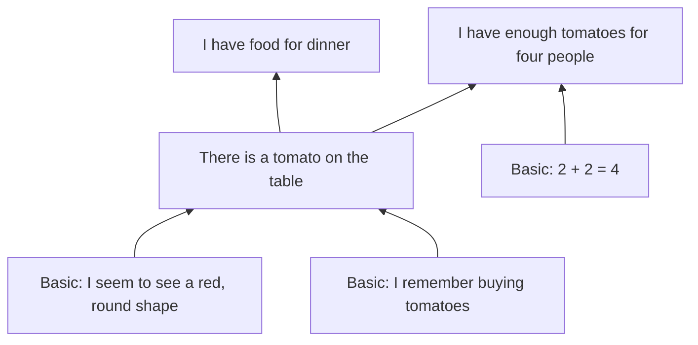
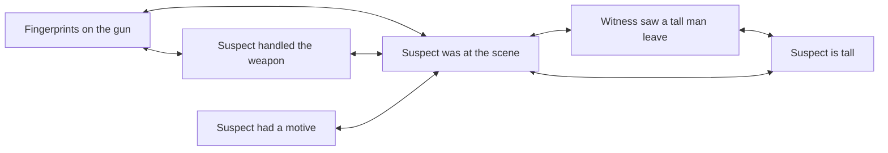

# Chapter 6. Justification: The Structure of Good Reasons

[← Previous: What Is Knowledge?](05-the-nature-of-knowledge.md) · [Contents](README.md) · [Next: The Sources of Knowledge →](07-sources-of-knowledge.md)

---

> "I beseech you, in the bowels of Christ, think it possible you may be mistaken."
> — Oliver Cromwell, letter to the General Assembly of the Church of Scotland (1650)

> "We are like sailors who have to rebuild their ship on the open sea."
> — Otto Neurath (1932)

Even if knowledge cannot be defined as justified true belief, **justification** is a central epistemic concept in its own right. In everyday life, we rarely know for certain whether a belief is true; what we can assess is whether it is *reasonable*, *well-supported*, *warranted by the evidence*. When you ask "Is that a fair conclusion?" or "What grounds do you have for that?", you are asking about justification.

This chapter covers the main theories: what justification is, how it can be lost (defeaters), how reasons can be structured without regress or circularity (foundationalism, coherentism, infinitism, and hybrids), whether justification depends only on what is "inside" the mind (internalism versus externalism), and what it means to say we can know despite the possibility of error (fallibilism).

---

## In this chapter

- [What justification is](#what-justification-is)
- [Defeaters](#defeaters)
- [The regress problem](#the-regress-problem)
- [Agrippa's trilemma](#agrippas-trilemma)
- [Foundationalism](#foundationalism)
- [Coherentism](#coherentism)
- [Infinitism](#infinitism)
- [Foundherentism](#foundherentism)
- [Critical rationalism](#critical-rationalism)
- [Comparing the structures](#comparing-the-structures)
- [Internalism and externalism](#internalism-and-externalism)
- [Evidentialism](#evidentialism)
- [Reliabilism about justification](#reliabilism-about-justification)
- [Phenomenal conservatism](#phenomenal-conservatism)
- [The problem of the criterion](#the-problem-of-the-criterion)
- [Deontology and doxastic voluntarism](#deontology-and-doxastic-voluntarism)
- [Fallibilism](#fallibilism)
- [Check your understanding](#check-your-understanding)
- [Further reading](#further-reading)

---

## What justification is

Justification is a **normative** property of beliefs: a justified belief is one it is epistemically *appropriate*, *reasonable*, or *permissible* to hold. Beyond that point of agreement, there are several conceptions. William Alston ("Concepts of Epistemic Justification," 1985) distinguished many of them, and later (*Beyond "Justification,"* 2005) argued that philosophers have been talking about different "epistemic desiderata" under one name.

| Conception | A belief is justified when... | Associated with |
|---|---|---|
| **Deontological** | Holding it violates no epistemic duty; the believer is blameless | Descartes, Locke, Chisholm |
| **Evidentialist** | It fits the believer's evidence | Conee and Feldman |
| **Reliabilist** | It was produced by a truth-conducive process | Goldman |
| **Virtue-theoretic** | It manifests intellectual competence or virtue | Sosa, Zagzebski |
| **Coherentist** | It coheres with the believer's system of beliefs | BonJour, Lehrer |

Justification comes in **degrees**. One belief can be better justified than another, and a belief can be somewhat justified without being justified enough to count as knowledge.

### Propositional and doxastic justification

Two things are called "justification," and it is important to keep them apart.

- **Propositional justification** (Goldman: *ex ante* justification) is having good reasons available for believing p, whether or not you actually believe p, or believe it for those reasons.
- **Doxastic justification** (*ex post* justification) is a property of an actual belief: it is held *on the basis of* good reasons.

A detective has strong evidence that the butler committed the crime: fingerprints, motive, no alibi. She believes the butler did it. But she believes it because she dislikes butlers, not because of the evidence. She has **propositional** justification (the evidence supports her conclusion) but her belief lacks **doxastic** justification (it isn't based on the evidence).

What does it take for a belief to be based on a reason? This is the problem of the **basing relation**. The most natural answer is causal: the reason must cause, or sustain, the belief. Keith Lehrer's **gypsy lawyer** ("How Reasons Give Us Knowledge," 1971) challenges this. A lawyer becomes convinced of his client's innocence through a fortune-teller's card reading. Later he examines the evidence and sees that it conclusively proves the client innocent, but his belief is still causally sustained by the cards; if the evidence fell apart, he would still believe. Lehrer argued that the lawyer's belief is justified by the evidence anyway, because he *understands* how the evidence supports it. Most philosophers disagree, but the case shows that the basing relation is subtle.

> **Critical-thinking lesson.** It is not enough that good reasons *exist* for your conclusion. Ask whether they are the reasons you actually hold it for. If you would believe the same thing even if those reasons evaporated, your belief is not really based on them. That is a warning sign of motivated reasoning. See [Motivated reasoning](14-psychology-of-reasoning.md#motivated-reasoning).

### Prima facie and all-things-considered justification

A belief is **prima facie** justified ("at first sight") if it has some justification that could be overridden. It is **ultima facie** or **all-things-considered** justified if it remains justified after everything relevant is taken into account. Seeing that a wall looks red gives you prima facie justification to believe it is red. Learning that it is lit by red light may take that justification away. Justification that can be lost this way is **defeasible**.

---

## Defeaters

A **defeater** is a consideration that reduces or removes the justification of a belief. John Pollock (*Contemporary Theories of Knowledge*, 1986) distinguished two main kinds, and the distinction is one of the most useful tools in this guide.

**Rebutting defeaters** are reasons to believe the conclusion is *false*.
> You believe the bird on the fence is a crow. An experienced birdwatcher standing beside you says, "That's a raven: look at the wedge-shaped tail." Her testimony is a reason to think your belief is false.

**Undercutting defeaters** are reasons to think your grounds do not support the conclusion *in this case*, without being reasons to think the conclusion false.
> Pollock's example: a widget on the assembly line looks red, so you believe it is red. Then you learn that the widgets are being illuminated by a red light, which makes widgets of any color look red. You now have no reason to think the widget is red. But you have no reason to think it *isn't* red either. Your grounds have been undercut.

Other kinds:

- **Higher-order defeaters**: evidence that your *reasoning* is impaired. You learn that you've been given a drug that causes subtle reasoning errors, or you are a pilot at high altitude where hypoxia impairs judgment without your noticing. Should you lower your confidence in a calculation that seems perfectly sound? David Christensen and others argue yes. See [Higher-order evidence](12-social-epistemology.md#higher-order-evidence).
- **Defeater defeaters**: considerations that restore justification. You learn that the red light was switched off an hour ago, before the widget was inspected.
- **Normative defeaters**: evidence you *should* have had or considered, even if you didn't. A doctor who fails to read the lab results that were on her desk cannot claim her diagnosis was justified simply because she didn't know about them.
- **Misleading defeaters**: true propositions that would defeat your justification but point away from the truth. The Tom Grabit case in [Chapter 5](05-the-nature-of-knowledge.md#defeasibility-theories).

> **Using defeaters in discussion.** When you criticize an argument, be clear about which kind of defeater you are offering. "Your conclusion is false because..." is a rebutting defeater and puts a burden on *you* to support it. "Your evidence doesn't support your conclusion because..." is an undercutting defeater, and it may be enough to show the argument fails without your having to prove the opposite. Many debates go wrong because a critic offers an undercutter and the other side hears a rebutter: "So you think the vaccine is dangerous?" "No, I think this particular study doesn't show it's safe for this group."

---

## The regress problem

Suppose you believe that it will rain tomorrow (B1). Why? Because the forecast says so (B2). Why believe the forecast? Because forecasts from this service are usually accurate (B3). Why believe that? Because you have checked them against the weather many times (B4). Why trust your memory of those checks? ... and so on.

If every justified belief needs to be justified by another justified belief, then either:

1. The chain **ends** in beliefs that are justified without being justified by other beliefs (**foundationalism**);
2. The chain **circles** back, so that beliefs ultimately support each other (**coherentism**);
3. The chain goes on **forever** without repeating (**infinitism**); or
4. The chain ends in beliefs that are **not justified** at all, in which case, it seems, nothing supported by them is justified either (**skepticism**).

Aristotle posed this problem in the *Posterior Analytics* (I.3) and gave the first foundationalist answer. It has been the organizing problem of the theory of justification ever since.

---

## Agrippa's trilemma

The ancient skeptic Agrippa (1st century CE, known through Sextus Empiricus, *Outlines of Pyrrhonism* I.164–177) formulated five **modes** for inducing suspension of judgment:

1. **Disagreement**: on any question, people disagree.
2. **Infinite regress**: any reason offered needs a further reason.
3. **Relativity**: things appear differently relative to different observers and circumstances.
4. **Hypothesis** (assumption): the dogmatist stops the regress by simply assuming something without argument.
5. **Circularity** (reciprocity): the reason offered for a claim depends on the claim itself.

Modes 2, 4, and 5 form a **trilemma**: every attempt to justify a belief ends in an infinite regress, an arbitrary assumption, or a circle. None seems satisfactory. The German philosopher Hans Albert (*Treatise on Critical Reason*, 1968) called it the **Münchhausen trilemma**, after Baron Münchhausen, who claimed to have pulled himself and his horse out of a swamp by his own hair.

| Horn of the trilemma | The theory that embraces it | How it defends the choice |
|---|---|---|
| Stop at an assumption | Foundationalism | The foundations are not arbitrary; they are justified non-inferentially (by experience or intuition) |
| Circle | Coherentism | Justification is holistic, not linear; mutual support is not viciously circular |
| Regress | Infinitism | An infinite chain of available reasons is not vicious; it is what justification is |
| Accept that nothing is justified | Skepticism, or critical rationalism | We should suspend judgment (skepticism), or rationality does not require justification, only openness to criticism (critical rationalism) |

---

## Foundationalism

**Foundationalism** holds that justified beliefs come in two kinds:

- **Basic beliefs**: justified *non-inferentially*, not on the basis of other beliefs. Their justification comes from experience, intuition, or their own nature.
- **Non-basic beliefs**: justified by being properly inferred, ultimately, from basic beliefs.

The image is a building: the foundations bear the weight of the upper floors and do not rest on anything further. Descartes used exactly this image.

### Classical foundationalism

**Classical foundationalism** (Descartes, and in various forms Locke, Russell, and C. I. Lewis) sets a high bar. Basic beliefs must be **infallible**, **indubitable**, or **incorrigible**. Typical candidates are:

- Beliefs about one's current mental states: "I seem to see something red," "I am in pain."
- Self-evident truths: "2 + 2 = 4," "Nothing can be both red and green all over."

Non-basic beliefs must follow from basic beliefs by **deduction**, or, in later versions, by strong inference.

### Modest foundationalism

Most contemporary foundationalists are **modest foundationalists** (Robert Audi, James Pryor, Michael Huemer). They relax the requirements:

- Basic beliefs need only be **prima facie** justified. They can be fallible and defeasible.
- Ordinary **perceptual beliefs** can be basic. "There's a cup on the table" can be justified directly by your visual experience, without inference from "I seem to see a cup."
- Non-basic beliefs can be justified by **inductive** and **abductive** inference, not just deduction.

James Pryor ("There Is Immediate Justification," 2005) and others argue that some justification must be **immediate**, not based on other beliefs, and that perceptual experience provides it. This is the most widely held view of the structure of justification today.

### Objections to foundationalism

**1. Self-referential incoherence** (against classical foundationalism). Alvin Plantinga ("Reason and Belief in God," 1983) pointed out that the principle of classical foundationalism, "A belief is justified only if it is self-evident, incorrigible, or evident to the senses, or inferred from such beliefs," is itself neither self-evident, incorrigible, nor evident to the senses, and cannot be inferred from such beliefs. So by its own standard, no one is justified in accepting it.

**2. Too little foundation** (against classical foundationalism). If basic beliefs are only about one's own mental states, and inference must be deductive, then almost nothing about the external world can be justified. Classical foundationalism leads to [skepticism](08-skepticism.md).

**3. The Sellarsian dilemma** (Wilfrid Sellars, "Empiricism and the Philosophy of Mind," 1956). What justifies a basic belief? Presumably an experience. Now:
- If the experience has **propositional content** (it represents that something is so), then it is the kind of thing that can be correct or incorrect, and it needs justification itself. So it cannot be a foundation.
- If the experience has **no propositional content** (it is a raw sensation), then it cannot stand in logical relations to beliefs, so it cannot justify anything.

This is Sellars's attack on the **Myth of the Given** (see [Chapter 2](02-history-of-epistemology.md#sellars-and-the-myth-of-the-given)). Modest foundationalists reply that experiences have propositional content but are *not beliefs*, so they are not the kind of state that needs justification, though they can be accurate or inaccurate. John McDowell (*Mind and World*, 1994) argues that experience is already conceptual and can therefore justify.

**4. The arbitrariness objection** (Laurence BonJour, *The Structure of Empirical Knowledge*, 1985). What makes a basic belief likely to be true? If there is a reason, then the belief is justified by that reason and is not basic. If there is no reason, the belief's justification is arbitrary.

**5. The speckled hen** (Roderick Chisholm, "The Problem of the Speckled Hen," 1942, crediting Gilbert Ryle). You glance at a hen with 48 speckles. Your visual experience in some sense presents all 48 speckles. But you are not justified in believing "the hen has 48 speckles," though you would be justified in believing "the hen has 3 speckles" if it had three. So what feature of experience justifies basic beliefs? Not merely what the experience presents.

---

## Coherentism

**Coherentism** denies that any beliefs are basic. A belief is justified by its **coherence** with the believer's whole system of beliefs. Support is mutual and holistic, not linear.

The image is Neurath's boat (see [Chapter 2](02-history-of-epistemology.md#logical-positivism)), or Quine's **web of belief**, in which beliefs support each other like the strands of a net.

**What is coherence?** More than mere consistency (no contradictions). Laurence BonJour (*The Structure of Empirical Knowledge*, 1985) lists:

- **Logical consistency**.
- **Probabilistic consistency**: not believing things that are jointly very improbable.
- **Inferential connections**: beliefs entail or support one another.
- **Explanatory relations**: beliefs explain one another. Coherence is increased when a system is unified by good explanations.
- **Few anomalies**: few unexplained facts.

Keith Lehrer (*Theory of Knowledge*, 1990) and Donald Davidson ("A Coherence Theory of Truth and Knowledge," 1983) defended other forms. Davidson's slogan: "nothing can count as a reason for holding a belief except another belief."

**Why isn't this viciously circular?** Coherentists answer that justification is not a *linear* relation passed along a chain. It is a *holistic* property of a whole system, which individual beliefs inherit by fitting into it. Think of a jigsaw puzzle: no single piece is the foundation, but when all the pieces fit together into a clear picture, you are confident that each is in the right place.

A classic argument for the power of coherence comes from C. I. Lewis (*An Analysis of Knowledge and Valuation*, 1946). Several **independent** witnesses, each of limited reliability, give the same detailed account of an event. Even though no single witness is very trustworthy, the agreement of their stories is hard to explain unless the account is true. Courts rely on this reasoning every day. Note the essential condition: **independence**. If the witnesses conferred, or all read the same newspaper, their agreement is much weaker evidence.

### Objections to coherentism

**1. The isolation (or input) objection.** A system of beliefs could be perfectly coherent yet completely disconnected from reality. A detailed novel is coherent. So is a well-developed paranoid delusion, and so is an elaborate conspiracy theory. Coherence alone cannot guarantee contact with the world. BonJour's response was an **observation requirement**: a justified system must contain beliefs that attribute reliability to spontaneous, non-inferential observational beliefs, so that experience has a way to enter and disrupt the system. Critics replied that this concedes much to foundationalism. (BonJour himself later became a foundationalist.)

**2. The alternative systems objection.** For any coherent system, there could be another, incompatible system that is equally coherent. Which one is justified? Coherence alone cannot say.

**3. The truth-connection problem.** Why should coherence make a belief *more likely to be true*? Formal epistemologists have proved that, surprisingly, there is no measure of coherence that in general raises the probability of truth, other things being equal (Luc Bovens and Stephan Hartmann, *Bayesian Epistemology*, 2003; Erik Olsson, *Against Coherence*, 2005). Coherence among **independent** sources does raise probability, as in Lewis's witnesses. But coherence produced by a single source, or by the believer's own imagination, does not.

> **Critical-thinking lesson.** **Coherence is not enough.** Conspiracy theories are often highly coherent: every fact is explained, every anomaly absorbed, every counter-argument anticipated. That coherence is part of their appeal. But coherence among beliefs that were *built to fit together* is weak evidence. Ask: do the parts of this story come from **independent sources** that could have disagreed? Does the story make **risky predictions** that could fail? Does it have **input from observation** that isn't already interpreted through the theory? See [Conspiracy theories](12-social-epistemology.md#conspiracy-theories).

---

## Infinitism

**Infinitism**, defended by Peter Klein ("Human Knowledge and the Infinite Regress of Reasons," 1999), accepts the regress horn: a belief is justified when there is an **infinite, non-repeating** chain of reasons **available** to the believer.

Klein argues from two principles:

- **The Principle of Avoiding Circularity**: no reason can appear earlier in its own chain of support.
- **The Principle of Avoiding Arbitrariness**: every reason must itself have a further reason available. There are no stopping points where a reason is simply accepted.

Together these principles imply that the chain of reasons must be infinite.

**Objections and replies.**
- *Finite minds.* We cannot hold infinitely many beliefs. Klein's reply: the reasons need only be **available**, not consciously believed. You have a disposition to produce a further reason when challenged.
- *The no-source objection.* If no link in the chain has justification independently, adding more links cannot generate it, just as an infinite chain of people borrowing money from the next person never produces any actual money. Klein's reply: justification is not transmitted from a source; it **emerges** and increases as the chain is extended. It is never complete.

Infinitism fits naturally with fallibilism. It implies that justification is always provisional and that inquiry never ends, since there is always a further reason to seek. Its critics regard this as an admission that nothing is ever fully justified.

---

## Foundherentism

Susan Haack (*Evidence and Inquiry*, 1993) proposed a hybrid called **foundherentism**. It agrees with foundationalism that **experience** contributes to justification without itself needing justification from beliefs. It agrees with coherentism that beliefs **support one another** mutually, and that no class of beliefs is basic.

Her model is a **crossword puzzle**. The reasonableness of an entry depends on:

1. How well it fits its **clue** (the analog of experiential evidence).
2. How well it fits the **intersecting entries** (the analog of mutual support among beliefs).
3. How reasonable *those* intersecting entries are, **independently** of the entry in question.
4. How much of the puzzle has been **completed** (the comprehensiveness of the evidence).

A crossword entry can be well supported even though it relies on other entries that rely on it, without vicious circularity, because each entry is also anchored by its own clue. This is an attractive picture of how scientific and detective reasoning actually works.

---

## Critical rationalism

The **critical rationalists**, Karl Popper, Hans Albert, and W. W. Bartley, took a different route. They argued that the whole search for justification ("justificationism") is a mistake, and that the Münchhausen trilemma shows it cannot succeed.

On their view:

- We can **never justify** a belief in the sense of showing it to be true or probable.
- But we can **criticize** beliefs: test them, look for contradictions, try to refute them.
- **Rationality** consists not in holding justified beliefs but in holding beliefs **open to criticism** and preferring those that have survived the most severe criticism so far.

Bartley (*The Retreat to Commitment*, 1962) developed **pan-critical rationalism** (or comprehensively critical rationalism), which holds *everything* open to criticism, including rationalism itself. He argued this avoids the charge that rationalism rests on an irrational commitment, a charge often used to claim that reason and faith are on equal footing.

**Objection.** When critical rationalists say it is rational to prefer the theory that has survived criticism best, critics reply that this sounds like justification under a different name. Alan Musgrave, a critical rationalist, accepts this: it is reasonable to *believe* the best-tested theory, even though its survival doesn't prove it true or even probable. The critical rationalist's lasting contribution is the insight that **criticism, not proof, drives the growth of knowledge**. See [Popper and falsificationism](10-science-and-evidence.md#popper-and-falsificationism).

---

## Comparing the structures

| | Foundationalism | Coherentism | Infinitism | Foundherentism | Critical rationalism |
|---|---|---|---|---|---|
| Are some beliefs basic? | Yes | No | No | No, but experience is a non-belief input | No |
| Shape of support | Pyramid | Web | Endless chain | Crossword | No positive support, only surviving criticism |
| Answer to the regress | It ends in basic beliefs | Justification is holistic | Endless regress is not vicious | Experience anchors; beliefs interlock | Give up justification |
| Main objection | Sellarsian dilemma; arbitrariness | Isolation; alternative systems | Finite minds; no source | Vagueness | It smuggles justification back |
| Key figures | Aristotle, Descartes, Audi, Pryor | Neurath, Quine, BonJour, Lehrer | Klein | Haack | Popper, Albert, Bartley |

---

## Internalism and externalism

A second great divide concerns *what kind of thing* can justify a belief.

**Internalism** holds that justification depends only on factors **internal** to the subject's perspective. **Externalism** holds that it can depend on factors **external** to that perspective, such as the actual reliability of the process that produced the belief, which the subject may know nothing about.

### Access internalism and mentalism

There are two main forms of internalism:

- **Access internalism** (Roderick Chisholm, Laurence BonJour in his internalist phase): what justifies a belief must be **accessible** to the subject by reflection alone. You should be able to tell, by thinking about it, whether and why your belief is justified.
- **Mentalism** (Earl Conee and Richard Feldman, "Internalism Defended," 2001): justification **supervenes on** the subject's mental states. Any two people alike in all their mental states are alike in what they are justified in believing.

**Motivations for internalism:**
1. **Responsibility.** Justification seems connected to responsibility and blame, and you can only be responsible for what you have access to.
2. **The first-person perspective.** From the inside, the question "Should I believe this?" can only be answered by consulting what is available to me.
3. **The new evil demon intuition** (see below).

### The case for externalism

**Motivations for externalism** (Alvin Goldman, Fred Dretske, Alvin Plantinga, Ernest Sosa):

1. **Animals and young children** know things (the dog knows its owner is at the door), though they cannot reflect on their reasons.
2. **The regress of access.** If you must be aware of your justifiers, and aware that they justify, you need justified beliefs about your justifiers, which need further justifiers, and so on.
3. **The truth connection.** The point of justification is to make true belief more likely. But whether a process is truth-conducive is a fact about the world, not about your mental states. Internal factors alone cannot guarantee a connection to truth.
4. **Ordinary knowledge is full of it.** Most of us cannot explain why our memory or perception is reliable, but we know things by them.

### Test cases for internalism and externalism

These thought experiments are the main battleground.

**Norman the clairvoyant** (Laurence BonJour, "Externalist Theories of Empirical Knowledge," 1980). Norman has a completely reliable power of clairvoyance, but he has no evidence for or against the general possibility of clairvoyance, or that he himself has it. One day, he comes to believe, through his power, that the President is in New York City. The belief is true, and it was formed by a reliable process. Is Norman justified? BonJour says no: from Norman's own perspective, the belief came from nowhere, and it would be *irresponsible* for him to hold it. If so, reliability is not sufficient for justification.

**Truetemp** (Keith Lehrer, *Theory of Knowledge*, 1990). A device secretly implanted in Mr. Truetemp's head reliably causes him to form true beliefs about the temperature. He has no idea why he has these beliefs and never checks them. Is he justified in believing "It is 34 °C"? Many say no, for the same reason as Norman.

**The new evil demon problem** (Stewart Cohen and Keith Lehrer, 1983; Cohen, "Justification and Truth," 1984). Imagine your exact mental duplicate in a world controlled by a Cartesian demon. Your duplicate has the same experiences, the same memories, and reasons in exactly the same way as you. But in the demon world, all your duplicate's perceptual beliefs are false, and the processes that produce them are completely unreliable. Is your duplicate *less justified* than you? Most people say no: your duplicate is doing everything right and is just unlucky. But reliabilism says the duplicate is unjustified. This is the strongest argument for internalism about justification.

**Externalist responses:**
- **Normal-worlds reliabilism** (Goldman, *Epistemology and Cognition*, 1986): a process justifies if it is reliable in "normal worlds," those consistent with our general beliefs about the actual world. Perception is reliable in normal worlds, so the demon-world duplicate is justified.
- **Distinguishing concepts**: the duplicate is *blameless* (an internalist notion) but lacks *warrant* or *knowledge* (externalist notions). Perhaps both sides are right about different concepts.
- **Proper functionalism** (Alvin Plantinga, *Warrant and Proper Function*, 1993): a belief has warrant if it is produced by cognitive faculties **functioning properly** in an **appropriate environment**, according to a **design plan** successfully aimed at truth. Norman's clairvoyance isn't part of any design plan, so his belief lacks warrant.
- **Hybrid views**: William Alston ("An Internalist Externalism," 1988) held that the *grounds* of a justified belief must be accessible, but their *adequacy* (whether they are reliable indicators of truth) need not be. Sosa distinguishes **animal knowledge** (externalist) from **reflective knowledge** (involving an internalist perspective on one's own reliability).

> **Practical upshot.** For evaluating *your own* beliefs, you must use internalist tools: you can only consult the reasons and evidence available to you. For evaluating *sources* (instruments, experts, institutions, methods), externalist questions are crucial: *Is this source actually reliable? What is its track record?* A method can feel convincing from the inside (astrology, a hunch, a charismatic guru) and be unreliable in fact. See [Experts and novices](12-social-epistemology.md#experts-and-novices).

---

## Evidentialism

**Evidentialism** is the leading internalist theory. Earl Conee and Richard Feldman ("Evidentialism," 1985; *Evidentialism*, 2004) state it as:

> A doxastic attitude D toward proposition p is epistemically justified for S at time t if and only if having D toward p **fits the evidence** S has at t.

Key features:

- **Doxastic attitudes** include belief, disbelief, and suspension of judgment (and, in some versions, degrees of belief). Evidentialism says which one is justified: believe if the evidence supports p, disbelieve if it supports not-p, suspend if it is balanced or insufficient.
- **Synchronic**: justification depends on the evidence you have *now*, not how you got it.
- **Evidence you have**, not evidence that exists somewhere.

Open questions for evidentialists:

- **What is evidence?** Experiences? Beliefs? Known facts ([E = K](05-the-nature-of-knowledge.md#knowledge-first))? Conee and Feldman say mental states.
- **What is "fit"?** Probabilistic support? Explanatory relations? Kevin McCain (*Evidentialism and Epistemic Justification*, 2014) develops an **explanationist** answer: evidence supports p when p is part of the best explanation of the evidence available.
- **Evidence you should have had.** Suppose you avoid reading the report that you know contains bad news about your investment. Your belief that the investment is fine fits your evidence, because you've carefully kept your evidence limited. Are you justified? Hilary Kornblith ("Justified Belief and Epistemically Responsible Action," 1983) and others argue that justification also depends on **responsible inquiry**. Evidentialists reply that this is a failure of epistemic *responsibility*, which is distinct from justification. Either way, **willful ignorance** is an epistemic failing. See [The ethics of belief](13-virtues-and-ethics-of-belief.md#the-ethics-of-belief-clifford-and-james).

Evidentialism is close to Hume's maxim that "a wise man proportions his belief to the evidence" and to Clifford's principle. It is the view most critical-thinking courses implicitly assume.

---

## Reliabilism about justification

**Process reliabilism** (Alvin Goldman, "What Is Justified Belief?," 1979) is the leading externalist theory of justification:

> A belief is justified if and only if it is produced by a **reliable** belief-forming process, one that produces a high proportion of true beliefs.

For inferential beliefs, Goldman adds that the process must be **conditionally reliable** (it tends to produce true outputs *when given true inputs*, as deduction does) and that the inputs must themselves be justified.

Goldman's examples of unreliable processes: "confused reasoning, wishful thinking, reliance on emotional attachment, mere hunch or guesswork, and hasty generalization." Reliable ones: "standard perceptual processes, remembering, good reasoning, and introspection."

Reliabilism faces the objections described above (the generality problem, Norman, Truetemp, the new evil demon). In later work (*Epistemology and Cognition*, 1986; "Epistemic Folkways and Scientific Epistemology," 1992), Goldman developed versions to meet them.

Reliabilism has one great virtue for critical thinking: it tells us to evaluate *methods*, not just individual beliefs. The key question becomes: **how reliable is the process that produced this belief?** A belief formed by a reliable method can be trusted even if you can't personally reconstruct the reasoning. A belief formed by an unreliable method should be doubted even when it feels compelling. See [Chapter 14](14-psychology-of-reasoning.md) on the reliability of human cognitive processes.

---

## Phenomenal conservatism

Michael Huemer (*Skepticism and the Veil of Perception*, 2001; "Compassionate Phenomenal Conservatism," 2007) proposed a simple and influential principle:

> **Phenomenal conservatism**: If it seems to S that p, then, in the absence of defeaters, S thereby has at least some degree of justification for believing that p.

"Seemings" include perceptual seemings (it looks as if there is a cat), memory seemings, intellectual seemings (it seems that 2 + 2 = 4, or that torturing for fun is wrong), and introspective seemings.

Huemer offers a **self-defeat argument**: all our beliefs, including the belief that phenomenal conservatism is false, ultimately rest on how things seem to us. So anyone who rejects the principle undermines their own grounds for rejecting it.

Related views: James Pryor's **dogmatism** ("The Skeptic and the Dogmatist," 2000), which says that perceptual experience gives immediate prima facie justification without needing any prior justification to think perception is reliable (see [Dogmatism](08-skepticism.md#dogmatism)), and Richard Swinburne's **principle of credulity** (*The Existence of God*, 1979), which applies the same idea to religious experience.

**Objections.**
- **Cognitive penetration.** Susanna Siegel (*The Rationality of Perception*, 2017) imagines Jack, who fears Jill is angry at him. When he sees her, her face *looks* angry to him, because his fear has shaped his perception. Does the seeming justify his belief? Intuitively, no; it is contaminated by his prior fear. If seemings can be shaped by bias, prejudice, and wishful thinking, phenomenal conservatism seems to give unearned justification to biased perception. See [Cognitive penetration and theory-ladenness](07-sources-of-knowledge.md#cognitive-penetration-and-theory-ladenness).
- **Too permissive.** To a committed conspiracy theorist, it *seems* that the evidence points to a cover-up. Does the conspiracy theorist thereby have justification? Huemer answers that the justification is only prima facie and is easily defeated by counter-evidence. Critics reply that such people often don't recognize defeaters.

A related, older idea is **epistemic conservatism** (Gilbert Harman, *Change in View*, 1986; Quine's "maxim of minimum mutilation"): you are justified in continuing to believe what you already believe, unless you have a positive reason to change. It explains why we don't need to re-justify every belief constantly, but it risks entrenching whatever we happen to believe first.

---

## The problem of the criterion

Roderick Chisholm (*The Problem of the Criterion*, 1973), drawing on Sextus Empiricus and Montaigne, posed a basic puzzle about how epistemology can even begin. There are two questions:

- **(A)** *What do we know?* (What is the extent of our knowledge?)
- **(B)** *How are we to decide whether we know?* (What are the criteria of knowledge?)

It seems we can't answer (A) without first answering (B): to sort knowledge from non-knowledge, we need a criterion. And we can't answer (B) without first answering (A): to test a criterion, we need clear cases of knowledge to check it against. There are three responses:

1. **Skepticism**: we can answer neither, so we know nothing.
2. **Methodism**: start with (B), a criterion, and use it to determine what we know. Descartes (clear and distinct perception) and Locke (empiricism) were methodists. The risk: a bad criterion rules out obvious knowledge. Hume's empiricist criterion seemed to rule out knowledge of causation and the external world.
3. **Particularism**: start with (A), clear particular cases of knowledge ("I know I have hands"), and derive criteria from them. Reid, Moore, and Chisholm were particularists. The risk: we may start with cases that aren't knowledge at all.

Chisholm defended particularism, admitting that he could not refute the skeptic but only choose differently. In practice, most philosophers use a **reflective equilibrium** between cases and criteria, adjusting each in light of the other. See [Reflective equilibrium](04-language-concepts-and-definitions.md#reflective-equilibrium).

This puzzle has the same shape as the problem of evaluating sources in everyday life: to know which experts are reliable, you need to know what's true; to know what's true, you rely on experts. See [Experts and novices](12-social-epistemology.md#experts-and-novices).

---

## Deontology and doxastic voluntarism

The **deontological** conception of justification treats it in terms of duties and permissions: a belief is justified when holding it is *epistemically permissible*, when the believer violates no epistemic duty and is blameless. This conception is natural. We say things like "You shouldn't believe everything you read," and we blame people for credulity.

But it faces a problem. "Ought" implies "can." If we have duties about what to believe, then we must be able to control what we believe. Do we?

**Direct doxastic voluntarism**, the view that we can believe at will, seems false. Try to believe, right now, that you are on the moon, or that 2 + 2 = 5. You can say the words, but you cannot make yourself believe them. Bernard Williams ("Deciding to Believe," 1970) argued that it is not merely a contingent fact that we can't believe at will: belief aims at truth, and if you knew you had acquired a belief by an act of will, regardless of the truth, you could not regard it as a belief about how things are.

William Alston ("The Deontological Conception of Epistemic Justification," 1988) concluded that since we lack voluntary control over our beliefs, the deontological conception must be abandoned.

**Replies:**
- **Indirect control.** We can't choose beliefs directly, but we control what evidence we gather, what we pay attention to, which sources we consult, how long we deliberate, and what intellectual habits we cultivate. Pascal advised the unbeliever who wanted faith to "take holy water, have Masses said," and so on. Our duties may be duties of **inquiry**, not directly of belief.
- **Compatibilist control** (Matthias Steup, "Doxastic Freedom," 2008): beliefs are "free" in the sense that matters if they are responsive to reasons, as actions are free in the compatibilist sense when they respond to reasons.
- **Answerability** (Pamela Hieronymi, "Responsibility for Believing," 2008): we are responsible for beliefs not because we choose them but because they reflect our own judgment about what is true. We can properly be asked for our reasons, and criticized when they are bad, as with emotions like resentment.

> **Practical upshot.** You cannot decide to believe something. But you *are* responsible for your habits of inquiry: whether you seek out counter-evidence, whether you consult reliable sources, whether you check claims before sharing them. Epistemic responsibility is mostly about these indirect choices. See [Chapter 13](13-virtues-and-ethics-of-belief.md).

---

## Fallibilism

**Fallibilism** is the view that we can have knowledge, or justified belief, even though our grounds do not **guarantee** the truth of what we believe. We can know p even though, given our evidence, it is possible that p is false. The term was coined by Charles Sanders Peirce, who wrote that "people cannot attain absolute certainty concerning questions of fact."

Fallibilism is the dominant view in contemporary epistemology, and it is essential to critical thinking. Almost all our knowledge, including scientific knowledge, is fallible. Evidence makes conclusions probable, not certain.

Fallibilism must be distinguished from positions it is often confused with:

| View | Claim |
|---|---|
| **Fallibilism** | We can know p even though we might be wrong. |
| **Infallibilism** | Knowledge requires grounds that make error impossible. |
| **Skepticism** | Since we might be wrong, we don't know (infallibilism + our grounds are fallible). |
| **Relativism** | There is no objective truth to be wrong about. |
| **Dogmatism** (everyday sense) | Refusing to consider that we might be wrong. |

Fallibilism is *not* the view that we should doubt everything, or that all views are equally good, or that confidence is always inappropriate. A fallibilist can be highly confident that the Earth orbits the Sun, and right to be. The point is that confidence should be proportioned to evidence, and even well-established beliefs remain open in principle to revision.

**A puzzle for fallibilists.** David Lewis ("Elusive Knowledge," 1996) noted that fallibilism sounds odd when said aloud: "If you are a contented fallibilist, I implore you to be honest, be naive, hear it afresh. 'He knows, yet he has not eliminated all possibilities of error.' Even if you've numbed your ears, doesn't this overt, explicit fallibilism *still* sound wrong?" Statements of the form "I know that p, but I might be wrong" are called **concessive knowledge attributions** (Patrick Rysiew, 2001). Philosophers debate whether their oddness is merely conversational (it's misleading to draw attention to a remote possibility) or whether it reveals something about knowledge itself. Lewis's answer was [contextualism](08-skepticism.md#contextualism).

> **The practical core of fallibilism.** Cromwell's plea, "think it possible you may be mistaken," is sometimes called **Cromwell's rule** in statistics: never assign a probability of exactly 0 or 1 to an empirical proposition, because then no evidence could ever change your mind (see [Bayes' theorem](09-induction-probability-bayes.md#bayes-theorem)). A fallibilist holds beliefs firmly enough to act on them and loosely enough to revise them. In a discussion, the fallibilist question is: ***What evidence would change my mind?*** If the answer is "nothing," the belief is being held as a dogma, not as a conclusion.

---

## Check your understanding

**1.** Distinguish propositional from doxastic justification with an example of your own.

Answer

Propositional: you have good reasons available for p. Doxastic: your actual belief in p is based on good reasons. Example: a juror has heard strong DNA evidence of guilt but votes guilty because the defendant "looks shifty." She has propositional justification for the verdict, but her belief is not doxastically justified.

**2.** Classify each as a rebutting or undercutting defeater. You believe your friend is at home because her car is in the driveway. (a) You learn she lent her car to her brother this week. (b) You get a text from her saying she's at the airport.

Answer

(a) Undercutting: it removes the support the car gave, without showing she is not at home. (b) Rebutting: it is direct evidence that she is not at home.

**3.** State Agrippa's trilemma and the theory that embraces each horn.

Answer

Every justification ends in an infinite regress, a circle, or an unjustified assumption. Infinitism embraces the regress; coherentism embraces a (holistic) circle; foundationalism stops at "assumptions," which it argues are non-arbitrary basic beliefs. Skepticism and critical rationalism take the trilemma to show that positive justification is unavailable.

**4.** What is the Sellarsian dilemma, and how do modest foundationalists reply?

Answer

Experience either has propositional content (and so needs justification itself) or lacks it (and so cannot logically support beliefs). Either way it cannot be a foundation. Modest foundationalists reply that experiences have propositional content but are not beliefs; they can be accurate or inaccurate, but they are not the kind of state that needs justification. They can confer justification without requiring it.

**5.** Why is the coherence of a conspiracy theory weak evidence of its truth?

Answer

Because coherence increases the probability of truth only when the cohering pieces come from independent sources. Conspiracy theories are typically built to fit: facts are selected and interpreted through the theory, anomalies are absorbed by adding auxiliary claims, and counter-evidence is reinterpreted as part of the cover-up. That kind of coherence can be manufactured for almost any story. Formal results in Bayesian epistemology confirm that coherence alone is not truth-conducive.

**6.** What is the new evil demon problem, and which theory does it target?

Answer

Your mental duplicate in a demon world has the same experiences and reasons in the same way, but all their perceptual beliefs are false and produced by unreliable processes. Intuitively, the duplicate is as justified as you are. This targets reliabilism, which implies that the duplicate is unjustified, and supports internalism.

**7.** Can you be blamed for a belief if you cannot choose what to believe?

Answer

Arguably yes. (1) You control your inquiry: what evidence you seek, what you attend to, which sources you trust. (2) On a compatibilist view, beliefs are free when they respond to reasons. (3) On Hieronymi's view, you are answerable for your beliefs because they express your own judgment, just as you are answerable for your resentment or admiration.

**8.** Is "I know that vaccines don't cause autism, but I could be wrong" coherent?

Answer

On a fallibilist view, yes. Knowledge does not require the impossibility of error, and the evidence against a vaccine–autism link is very strong (large studies involving millions of children, and the original 1998 paper was retracted after it was found to be fraudulent). But the sentence *sounds* odd, and some philosophers (Lewis) take the oddness seriously. A more natural way to express the same fallibilist stance: "The evidence is overwhelming, and I'd need extraordinary new evidence to change my mind."

---

## Further reading

**Surveys**
- Richard Fumerton, *Epistemology* (Blackwell, 2006).
- Laurence BonJour and Ernest Sosa, *Epistemic Justification: Internalism vs. Externalism, Foundations vs. Virtues* (Blackwell, 2003). A debate between two leading figures.
- Matthias Steup, John Turri, and Ernest Sosa (eds.), *Contemporary Debates in Epistemology* (Wiley-Blackwell, 2nd ed. 2014). Paired essays on both sides of major questions.
- Ali Hasan and Richard Fumerton, "Foundationalist Theories of Epistemic Justification"; Erik Olsson, "Coherentist Theories of Epistemic Justification"; Scott Aikin and Peter Klein, "Infinitism" (all *Stanford Encyclopedia of Philosophy*).

**Classic works**
- Roderick Chisholm, *Theory of Knowledge* (Prentice-Hall, 1966; 3rd ed. 1989).
- Laurence BonJour, *The Structure of Empirical Knowledge* (Harvard University Press, 1985).
- Susan Haack, *Evidence and Inquiry* (Blackwell, 1993; expanded ed. Prometheus, 2009).
- Alvin Goldman, "What Is Justified Belief?" (1979), reprinted in many anthologies.
- Earl Conee and Richard Feldman, *Evidentialism: Essays in Epistemology* (Oxford University Press, 2004).
- Alvin Plantinga, *Warrant: The Current Debate* and *Warrant and Proper Function* (Oxford University Press, 1993).
- Michael Huemer, *Skepticism and the Veil of Perception* (Rowman & Littlefield, 2001).
- John Pollock and Joseph Cruz, *Contemporary Theories of Knowledge* (Rowman & Littlefield, 2nd ed. 1999).

---

[← Previous: What Is Knowledge?](05-the-nature-of-knowledge.md) · [Contents](README.md) · [Next: The Sources of Knowledge →](07-sources-of-knowledge.md)
