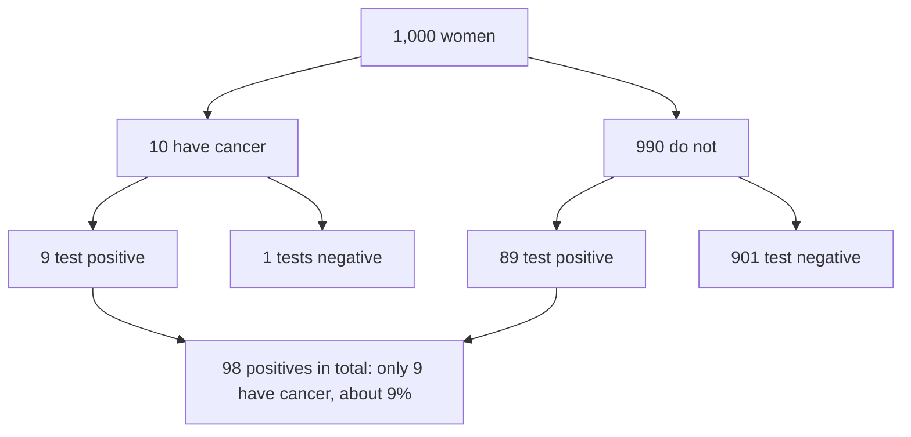

# Chapter 9. Induction, Probability, and Bayesian Reasoning

[← Previous: Skepticism and Its Answers](08-skepticism.md) · [Contents](README.md) · [Next: Science, Evidence, and Explanation →](10-science-and-evidence.md)

**Audio:** [listen to this chapter](audio/09-induction-probability-bayes.mp3) (1 h 5 min, narrated) · [open in the player](audio/index.html#09)

---

> "A wise man, therefore, proportions his belief to the evidence."
> — David Hume, *An Enquiry Concerning Human Understanding* (1748), §X

> "Probability theory is nothing but common sense reduced to calculation."
> — Pierre-Simon Laplace, *Essai philosophique sur les probabilités* (1814)

Almost everything we believe about the world goes beyond what we have observed. We believe the sun will rise tomorrow, that the medicine will work as it did in trials, that the bridge will hold, that the polls tell us something about the election. None of this follows deductively from our evidence. It is **inductive**, and it is **uncertain**.

This chapter covers two things. First, the philosophical problem of induction: can reasoning from the observed to the unobserved be justified at all? Second, the practical tools for reasoning well under uncertainty: probability theory, Bayes' theorem, and the statistical concepts you need to read evidence critically. If you master only one technical tool from this guide, make it the [odds form of Bayes' theorem](#the-odds-form-and-likelihood-ratios). It will change how you think about evidence.

---

## In this chapter

- [Kinds of non-deductive inference](#kinds-of-non-deductive-inference)
- [Hume's problem of induction](#humes-problem-of-induction)
- [Responses to Hume](#responses-to-hume)
- [Goodman's new riddle of induction](#goodmans-new-riddle-of-induction)
- [The paradox of the ravens](#the-paradox-of-the-ravens)
- [Probability: the basics](#probability-the-basics)
- [Bayes' theorem](#bayes-theorem)
- [Bayesian epistemology](#bayesian-epistemology)
- [Full belief and degrees of belief](#full-belief-and-degrees-of-belief)
- [Common errors in probabilistic reasoning](#common-errors-in-probabilistic-reasoning)
- [Calibration and scoring rules](#calibration-and-scoring-rules)
- [Statistics and significance](#statistics-and-significance)
- [Check your understanding](#check-your-understanding)
- [Further reading](#further-reading)

---

## Kinds of non-deductive inference

Non-deductive (ampliative) inferences go beyond their premises. The main types:

- **Enumerative induction**: every observed A has been B, so all As are B (or the next A will be B).
- **Statistical generalization**: 62% of a random sample of voters support the measure, so about 62% of all voters do.
- **Statistical syllogism** (direct inference): 95% of As are B; this is an A; so (probably) this is B.
- **Argument from analogy**: X and Y share properties P, Q, R; X has S; so Y probably has S.
- **Causal inference**: A and B are correlated, and alternative explanations are excluded, so A causes B. See [Chapter 10](10-science-and-evidence.md#causation-and-causal-inference).
- **Inference to the best explanation** (abduction): H best explains the evidence, so H is probably true. See [Chapter 10](10-science-and-evidence.md#inference-to-the-best-explanation).

The statistical syllogism raises the **reference class problem** (discussed by Hans Reichenbach and John Venn, and by Alan Hájek in "The Reference Class Problem Is Your Problem Too," 2007). What is the probability that Ali, a 45-year-old man who smokes and runs marathons, will have a heart attack in the next ten years? It depends on the reference class: 45-year-old men, smokers, marathon runners, 45-year-old male smoking marathon runners (a class with very few members). Each class has a different frequency. There is often no single correct answer, and choosing a reference class is a judgment call. In practice, look for the narrowest class that still has enough data to give a reliable frequency, and check whether different reasonable classes give very different answers.

---

## Hume's problem of induction

David Hume posed the problem in the *Treatise* (1739) and more clearly in the *Enquiry* (1748, Section IV). Set out as an argument:

1. All inferences from experience to the unobserved presuppose the **uniformity principle**: that the unobserved will resemble the observed (the future will resemble the past).
2. The uniformity principle cannot be known a priori, because its denial is not contradictory. We can perfectly well conceive that bread, which has always nourished us, will poison us tomorrow.
3. The uniformity principle cannot be established by experience, because any argument from experience would be an inductive argument, which presupposes the uniformity principle. That would be circular.
4. Therefore, the uniformity principle has no rational justification, and neither do inferences that rely on it.

Hume did not conclude that we should stop reasoning inductively. He concluded that we *can't* stop: "All inferences from experience, therefore, are effects of custom, not of reasoning." Nature has made us form expectations from repeated experience, as it has made us breathe.

Bertrand Russell's **chicken** (*The Problems of Philosophy*, ch. 6) dramatizes the problem: the chicken fed every day by the farmer comes to expect food whenever the farmer appears, until the day the farmer wrings its neck. Its inductive inference was as good as ours. The philosopher C. D. Broad called induction "the glory of science" and "the scandal of philosophy."

---

## Responses to Hume

**1. The inductive justification of induction.** "Induction has worked well in the past, so it will work well in the future." This is circular, as Hume said. Some philosophers (R. B. Braithwaite, Max Black, James Van Cleve) argued that it is only **rule-circular** (using the rule it justifies), not **premise-circular** (assuming its conclusion as a premise), and that rule-circularity is not vicious. Wesley Salmon replied with the **counter-inductivist**: someone who uses the rule "expect the opposite of what has happened before" can argue, with equal rule-circularity, "counter-induction has failed in the past, so it will succeed in the future." If rule-circular arguments work for induction, they work for counter-induction too.

**2. The dissolution.** P. F. Strawson (*Introduction to Logical Theory*, 1952) argued that asking whether induction is rational is like asking whether the law is legal. Being "reasonable" about matters of fact simply *means* proportioning belief to inductive evidence. There is no higher standard for induction to meet. Critics reply that we can still ask whether this practice leads to truth, and Strawson's point does not answer that.

**3. Pragmatic vindication.** Hans Reichenbach (*Experience and Prediction*, 1938) argued that we cannot prove induction will succeed, but we can show that if *any* method can discover the regularities of nature (such as the limiting frequency of an event), induction will. So induction is the best bet. Objections: infinitely many other rules share this property, and the argument says nothing about the short run, which is all we ever have.

**4. Popper's rejection.** Karl Popper argued that science does not use induction at all. Scientists propose bold conjectures and try to refute them by deduction (modus tollens). A theory that survives is **corroborated**, but corroboration says nothing about its future success. Objection (Wesley Salmon, "Rational Prediction," 1981): when an engineer must decide which bridge design to build, relying on the best-corroborated theory is rational only if corroboration indicates future reliability, and that is induction under another name. See [Popper and falsificationism](10-science-and-evidence.md#popper-and-falsificationism).

**5. The material theory of induction.** John Norton ("A Material Theory of Induction," 2003; *The Material Theory of Induction*, 2021) argues that there is no single, universal inductive rule to justify. Each inductive inference is licensed by specific background facts. We infer that all samples of bismuth melt at 271 °C from a few samples, because we know that samples of a chemical element generally share melting points. We do *not* infer that all samples of wax melt at the same temperature, because we know wax is a variable mixture. The problem of induction then becomes a series of local questions about particular background facts, not one global question.

**6. Inference to the best explanation.** D. M. Armstrong (*What Is a Law of Nature?*, 1983) argued that the best explanation of observed regularities is that there are laws of nature, and laws hold in the future too. Objection: why trust inference to the best explanation? It is itself an ampliative inference.

**7. Externalism.** Reliabilists say: if nature is in fact uniform, then induction is a reliable process, and beliefs formed by it are justified and can be knowledge, whether or not we can prove that nature is uniform. We don't need to justify induction to use it justifiably. This is the externalist move against many skeptical problems (see [Internalism and externalism](06-justification.md#internalism-and-externalism)).

**8. Bayesian convergence.** Bayesians show that agents who start with different prior probabilities, but who update on the same evidence by the rules of probability, will tend to **converge** on the same conclusions as evidence accumulates, provided their priors are not dogmatic (they do not assign probability 0 to the truth). This "merger of opinion" (David Blackwell and Lester Dubins, 1962) is reassuring. But it does not answer Hume, because it requires priors that already favor uniformity.

> **Practical upshot.** Hume's problem is not a reason to distrust induction in everyday life. It is a reminder that **inductive conclusions are always fallible**, that the strength of an induction depends on **background knowledge** about what kinds of things are uniform, and that a long run of past success is not a guarantee (ask the chicken, or any investor in 2007). The lesson of the Norton-style view is especially useful: whenever you generalize, ask *what background facts make this kind of property uniform across this kind of case?*

---

## Goodman's new riddle of induction

Nelson Goodman (*Fact, Fiction, and Forecast*, 1955) argued that Hume's problem is not the deepest one. Even if we accept that induction is legitimate, we need to know *which* generalizations to project from the evidence, and the evidence alone cannot tell us.

Define a new predicate, **grue**:

> An object is **grue** if and only if it is first examined before time *t* (say, January 1, 2100) and is green, or is not examined before *t* and is blue.

Every emerald examined so far has been green. Since they were all examined before *t*, every emerald examined so far has also been grue. So our evidence equally supports:

- H1: All emeralds are green.
- H2: All emeralds are grue.

But these hypotheses make conflicting predictions about emeralds first examined after *t*: H1 says they will be green, H2 says they will be blue. The same evidence, and the same inductive rule, support incompatible predictions. Why is it rational to project "green" and not "grue"?

**"Because 'grue' is defined in terms of time, and 'green' isn't."** Goodman's reply: that depends on which predicates you start with. Define "bleen" as "examined before *t* and blue, or not examined before *t* and green." Then "green" can be defined as "grue if examined before *t*, and bleen otherwise." Relative to grue/bleen speakers, *green* is the gerrymandered, time-dependent predicate.

Goodman's own answer was **entrenchment**: we project predicates that have a history of successful projection in our linguistic community. W. V. O. Quine ("Natural Kinds," 1969) suggested that "green" picks out a **natural kind** (a real similarity in nature), and that our innate sense of similarity, shaped by evolution, tends to track natural kinds.

**Why grue matters for critical thinking.**
- **Data never speak for themselves.** Any finite set of observations is consistent with infinitely many generalizations. Which one we project depends on our choice of categories and our background assumptions. Statisticians face the same problem in **curve-fitting**: infinitely many curves pass through any finite set of points. Choosing an overly complicated curve that fits the data perfectly (**overfitting**) usually produces terrible predictions.
- **Beware gerrymandered categories.** "This team has never lost a Tuesday night home game in October when the temperature was below 10 °C" is a grue-like predicate. Look through enough data and you can always find a pattern, but gerrymandered patterns do not project. See [Multiple comparisons and p-hacking](#multiple-comparisons-and-p-hacking) and the [Texas sharpshooter](15-fallacies.md#texas-sharpshooter).
- **Machine learning** faces the new riddle directly. The **"no free lunch" theorems** (David Wolpert, 1996) show that no learning algorithm is better than any other averaged over all possible problems. Learning works only because algorithms have **inductive biases** that fit the structure of the actual world.

---

## The paradox of the ravens

Carl Hempel ("Studies in the Logic of Confirmation," 1945) discovered a puzzle about confirmation using three plausible principles:

1. **Nicod's criterion**: an observation of an A that is B confirms "All As are B." A black raven confirms "All ravens are black."
2. **The equivalence condition**: whatever confirms a hypothesis also confirms any logically equivalent hypothesis.
3. **Logical equivalence**: "All ravens are black" is equivalent to its contrapositive, "All non-black things are non-ravens."

Now: a white shoe is a non-black non-raven. By Nicod's criterion, it confirms "All non-black things are non-ravens." By the equivalence condition, it confirms "All ravens are black." So you can do ornithology without leaving your room, by looking at white shoes, green leaves, and red books. That seems absurd.

**Responses.**
- **Hempel** accepted the conclusion. The white shoe really does confirm the hypothesis. Our intuition that it doesn't is misled by background knowledge (we already know there are far more non-black things than ravens).
- **The Bayesian solution** (developed by I. J. Good and others) agrees that the white shoe confirms, but explains why the confirmation is negligible. Because non-black things vastly outnumber ravens, finding that a randomly chosen non-black thing is not a raven is almost exactly as likely whether or not all ravens are black. The likelihood ratio (see below) is extremely close to 1. By contrast, finding that a randomly chosen raven is black is noticeably more likely if all ravens are black than if some are not.
- **How the evidence was gathered matters.** If you *sample from ravens* and check their color, a black one confirms substantially. If you *sample from non-black things* and check whether they are ravens, a non-raven confirms minutely. If you pick up an object *already knowing* it is a white shoe, it tells you nothing about ravens at all. I. J. Good ("The White Shoe Is a Red Herring," 1967) showed that in some background situations, even a black raven can *disconfirm* "All ravens are black."

**The lesson**: whether an observation is evidence for a hypothesis, and how much, depends on **background knowledge** and on **the procedure that produced the observation**. This is one of the most important ideas in the theory of evidence. It returns in the [Monty Hall problem](#the-monty-hall-problem), in [selection effects](15-fallacies.md#survivorship-bias), and throughout the analysis of scientific studies.

---

## Probability: the basics

### The rules of probability

Andrey Kolmogorov (1933) axiomatized probability theory. For any events (or propositions) A and B:

1. **Non-negativity**: P(A) ≥ 0.
2. **Normalization**: P(something certain) = 1.
3. **Additivity**: if A and B cannot both be true, P(A or B) = P(A) + P(B).

Everything else follows. Useful consequences:

- **Complement**: P(not-A) = 1 − P(A).
- **General addition**: P(A or B) = P(A) + P(B) − P(A and B).
- **The conjunction rule**: P(A and B) ≤ P(A), and P(A and B) ≤ P(B). A conjunction can never be more probable than either of its parts. (See [The conjunction fallacy](#the-conjunction-fallacy).)

### Conditional probability and independence

The **conditional probability** of A given B is:

> P(A | B) = P(A and B) / P(B)

It is the probability of A if we restrict attention to cases where B is true.

A and B are **independent** if P(A | B) = P(A): learning B tells you nothing about A. For independent events, P(A and B) = P(A) × P(B). For dependent events, P(A and B) = P(A) × P(B | A).

**Warning**: P(A | B) is not the same as P(B | A). The probability that someone is a professional basketball player given that they are over two meters tall is small; the probability that someone is over two meters tall given that they are a professional basketball player is large. Confusing the two is the root of the [prosecutor's fallacy](#the-prosecutors-fallacy) and [base rate neglect](#base-rate-neglect). It is sometimes called the **fallacy of the transposed conditional** or **confusion of the inverse**.

**Compounding.** When many conditions must all hold, their probabilities multiply (if independent), and the result shrinks fast. If a plan requires ten independent steps each 90% likely to succeed, the probability that all succeed is 0.9¹⁰ ≈ 0.35. This matters when evaluating detailed forecasts, elaborate plans, and conspiracy theories that require many separate things to be true: **each detail makes the story more vivid and less probable**.

### What is probability?

The rules are uncontroversial. What probability *is* is not. The main interpretations:

| Interpretation | Probability is... | Key figures | Good for | Problem |
|---|---|---|---|---|
| **Classical** | The ratio of favorable to equally possible cases | Laplace | Dice, cards, lotteries | What makes cases "equally possible"? Paradoxes of indifference |
| **Frequentist** | Long-run relative frequency in a series of trials | Venn, von Mises, Reichenbach | Repeatable experiments; statistics | Single events ("Will this candidate win?") |
| **Propensity** | A physical tendency of a setup to produce outcomes | Popper | Quantum events; single-case chances | Hard to specify or measure |
| **Subjective (Bayesian)** | A rational agent's degree of belief | Ramsey, de Finetti, Savage | Any uncertain proposition | Seems too subjective; where do priors come from? |
| **Logical / evidential** | The degree to which evidence supports a hypothesis | Keynes, Carnap | Measuring evidential support | Hard to define non-arbitrarily |

In practice, different questions call for different interpretations. "The probability of rolling a six is 1/6" is naturally classical or frequentist. "The probability that the defendant is guilty" is naturally subjective or evidential.

Even everyday probability statements can be misunderstood. When a forecast says "30% chance of rain tomorrow," people have interpreted it as meaning it will rain 30% of the time, or over 30% of the area, or that 30% of forecasters expect rain (Gerd Gigerenzer and colleagues, "'A 30% Chance of Rain Tomorrow': How Does the Public Understand Probabilistic Weather Forecasts?," 2005). The intended meaning is that on days with this forecast, it rains at the location on about 30% of them. **Always ask: probability of what, out of what?**

---

## Bayes' theorem

Bayes' theorem tells you how to update the probability of a hypothesis H in light of evidence E. It is named after Thomas Bayes (c. 1701–1761), whose essay on the subject was published posthumously in 1763 by his friend Richard Price, and it was developed independently and more fully by Pierre-Simon Laplace.

> **P(H | E) = P(E | H) × P(H) / P(E)**
>
> where P(E) = P(E | H) × P(H) + P(E | not-H) × P(not-H)

The terms:

- **P(H)** is the **prior**: how probable H was before considering E.
- **P(E | H)** is the **likelihood**: how probable the evidence would be if H were true.
- **P(E | not-H)**: how probable the evidence would be if H were false.
- **P(H | E)** is the **posterior**: how probable H is after taking E into account.

In words: *how much you should believe a hypothesis after seeing evidence depends on how much you believed it before, and on how much more expected the evidence is if the hypothesis is true than if it is false.*

### The medical test example

This is the most famous illustration, from Gerd Gigerenzer's work with physicians (*Calculated Risks*, 2002; Gigerenzer et al., "Helping Doctors and Patients Make Sense of Health Statistics," 2007).

> For women aged 50 in a certain region who take part in routine screening:
> - The probability that a woman has breast cancer is 1% (the **prevalence**, or base rate).
> - If a woman has breast cancer, the probability that she tests positive is 90% (the **sensitivity**).
> - If a woman does not have breast cancer, the probability that she nevertheless tests positive is 9% (the **false positive rate**).
>
> A woman tests positive. What is the probability that she actually has breast cancer?

When Gigerenzer posed this question to 160 gynecologists in a training session, only about one in five chose the right answer. Many believed it was about 90%, or 81%. Let us compute:

- P(H) = 0.01; P(not-H) = 0.99
- P(E | H) = 0.90
- P(E | not-H) = 0.09
- P(E) = 0.90 × 0.01 + 0.09 × 0.99 = 0.009 + 0.0891 = 0.0981
- P(H | E) = 0.009 / 0.0981 ≈ **0.092, or about 9%**

So only about **1 in 11** women who test positive has cancer. The test is accurate, but the disease is rare, so false positives from the large healthy population swamp the true positives from the small sick population.

### Natural frequencies

Gigerenzer and Ulrich Hoffrage ("How to Improve Bayesian Reasoning Without Instruction: Frequency Formats," 1995) showed that people reason much better when the same information is presented as **natural frequencies** rather than probabilities:

> Think of 1,000 women.
> - 10 of them have breast cancer. Of these 10, **9** test positive.
> - 990 do not have breast cancer. Of these, about **89** test positive anyway.
> - So 9 + 89 = 98 women test positive, and only 9 of them have cancer.
> - 9 out of 98 ≈ **9%**.

**Practical rule**: whenever you face a problem of this kind, **translate probabilities into counts of people (or cases) out of a round number**. It makes the structure obvious.

### The odds form and likelihood ratios

Bayes' theorem has a simpler form using **odds** instead of probabilities. Odds are the ratio of the probability that something is true to the probability that it is false: a probability of 0.2 is odds of 0.2:0.8, or 1:4.

> **Posterior odds = Prior odds × Likelihood ratio**
>
> where the **likelihood ratio** (or **Bayes factor**) = P(E | H) / P(E | not-H)

In the mammography example:
- Prior odds = 1:99.
- Likelihood ratio = 0.90 / 0.09 = 10.
- Posterior odds = 10:99, which is a probability of 10/109 ≈ 9.2%.

The odds form reveals the two things that matter, **separately**:

1. **Where you started** (the prior odds). A rare disease, an improbable claim, or an unusual event starts with low odds.
2. **How diagnostic the evidence is** (the likelihood ratio). This measures how much more likely the evidence is if the hypothesis is true than if it is false.

It also makes updating on multiple pieces of evidence easy. If the woman takes a second, **independent** test and it is also positive, multiply again: 10:99 × 10 = 100:99, about 50%. A third independent positive: 1000:99, about 91%.

A rough guide to the strength of evidence, loosely following the statistician Harold Jeffreys (*Theory of Probability*, 1939):

| Likelihood ratio | Strength of evidence for H |
|---|---|
| 1 | None: the evidence is equally expected either way |
| 1 to 3 | Weak, barely worth mentioning |
| 3 to 10 | Moderate |
| 10 to 100 | Strong |
| Over 100 | Very strong |

(Ratios below 1 are evidence *against* H, with the same scale applied to the reciprocal.)

### Evidence and confirmation

Bayesian reasoning gives a precise definition: **E is evidence for H if and only if E is more probable if H is true than if H is false**, that is, if the likelihood ratio is greater than 1. Equivalently, E raises the probability of H: P(H | E) > P(H).

This definition has powerful consequences for critical thinking:

1. **"Consistent with" is not "evidence for."** If E is equally likely whether or not H is true, E is no evidence for H, however well it "fits." A horoscope that says "you will face challenges this week" fits everyone's week. Its likelihood ratio is 1.
2. **Evidence is always comparative.** To know whether E supports H, you must ask how likely E would be under the *alternatives*. A suspect's nervousness in an interview is evidence of guilt only to the extent that guilty people are more often nervous in interviews than innocent people are.
3. **Surprising predictions are strong evidence.** If H predicts something that would be very unlikely otherwise (low P(E | not-H)), confirming it gives a large likelihood ratio. This is why a risky, specific prediction that comes true is worth more than a vague one. See [Popper and falsificationism](10-science-and-evidence.md#popper-and-falsificationism).
4. **Absence of evidence can be evidence of absence**, when the evidence would be expected if H were true. If there were an elephant in your room, you would see it. Not seeing one is strong evidence there isn't one. But not finding a particular fossil is weak evidence that the species never existed, because fossilization is rare. See [Argument from ignorance](15-fallacies.md#argument-from-ignorance).
5. **Anecdotes are weak evidence, not zero evidence.** A single testimonial that a remedy worked has a likelihood ratio only slightly above 1, since people recover from most ailments anyway and we hear more about successes than failures.
6. **Extraordinary claims require extraordinary evidence.** A claim with very low prior odds needs an enormous likelihood ratio to become probable. This is the Bayesian content of Hume's argument about miracles and of Carl Sagan's maxim. See [Philosophical razors and heuristics](16-critical-thinking-toolkit.md#philosophical-razors-and-heuristics).
7. **Independent evidence multiplies; dependent evidence doesn't.** Ten news stories that all repeat the same press release are one piece of evidence, not ten. Double-counting dependent evidence is one of the commonest errors in everyday reasoning.
8. **Cromwell's rule.** If your prior probability is exactly 0 or exactly 1, no evidence can ever change it (multiply zero by anything and you get zero). The statistician Dennis Lindley named this after Oliver Cromwell's plea to "think it possible you may be mistaken." Never assign an empirical claim a probability of exactly 0 or 1.

---

## Bayesian epistemology

**Bayesian epistemology** takes probability theory to be a theory of rational belief. Its main claims:

1. **Probabilism**: rational degrees of belief (credences) obey the axioms of probability.
2. **Conditionalization**: rational agents update their credences by Bayes' rule when they learn new evidence.

### Credences and coherence

Why should credences obey the laws of probability? The classic argument is the **Dutch book argument** (Frank Ramsey, "Truth and Probability," 1926; Bruno de Finetti, 1937).

Suppose your credence that it will rain tomorrow is 0.6 and your credence that it will *not* rain is also 0.6. These violate the axioms, since they should sum to 1. A credence of 0.6 means you consider it fair to pay $0.60 for a ticket that pays $1 if the proposition is true. So a bookie can sell you both tickets for $1.20 total. Whatever the weather, exactly one ticket pays $1. You are guaranteed to lose $0.20. A set of bets that guarantees a loss is called a **Dutch book**. The theorem: **your credences are immune to Dutch books if and only if they obey the probability axioms.**

Critics object that the argument concerns betting behavior, not belief, and that you could avoid Dutch books simply by refusing to bet. James Joyce ("A Nonpragmatic Vindication of Probabilism," 1998) gave a purely epistemic argument instead: if your credences violate the axioms, there is always another set of credences that is **more accurate** (closer to the truth) *however the world turns out*. Incoherent credences are **accuracy-dominated**.

### Conditionalization

**Conditionalization** says: if you learn E (and nothing else), your new credence in any hypothesis H should equal your old conditional credence in H given E:

> P_new(H) = P_old(H | E)

Richard Jeffrey (*The Logic of Decision*, 1965) generalized this for cases where learning is uncertain. His example: you look at a piece of cloth by candlelight. It seems green but could be blue. You don't become *certain* it is green; your credence in "green" merely shifts from, say, 0.3 to 0.7. **Jeffrey conditionalization** spreads this change through your other beliefs:

> P_new(H) = P_old(H | E) × P_new(E) + P_old(H | not-E) × P_new(not-E)

### The problem of the priors

Bayes' theorem tells you how to update, but not where to start. Where do prior probabilities come from?

- **Subjective Bayesians** say any coherent prior is rationally permissible, and that the data will eventually swamp differences in priors (the convergence results mentioned [above](#responses-to-hume)).
- **Objective Bayesians** (E. T. Jaynes, Jon Williamson) say rational priors should be as uninformative as possible, for example by using the **principle of indifference** (assign equal probability to each possibility) or **maximum entropy** methods.

The principle of indifference leads to paradoxes. Bas van Fraassen's **cube factory**: a factory produces cubes with sides between 0 and 1 cm long. What is the probability that a cube has a side of at most 0.5 cm? Indifference over *side length* says 1/2. But the same cubes have faces between 0 and 1 cm² in area, and a side of at most 0.5 cm means a face of at most 0.25 cm², so indifference over *face area* says 1/4. Indifference over *volume* (at most 0.125 cm³) says 1/8. Same event, three different "uninformative" probabilities.

**In practice**, good priors come from **base rates**: how often things of this kind turn out to be true. Daniel Kahneman calls this taking the **outside view** (Kahneman and Dan Lovallo, "Timid Choices and Bold Forecasts," 1993). Before evaluating the specific features of a case (the "inside view"), ask how often similar cases succeed. How often are start-ups of this kind still operating after five years? How often do major infrastructure projects finish on budget? (Rarely, according to Bent Flyvbjerg's studies of hundreds of projects.) How often do dramatic single studies in this field replicate? The inside view tends to be optimistic and overconfident; the outside view corrects it. See [Forecasting and superforecasters](14-psychology-of-reasoning.md#forecasting-and-superforecasters).

### The problem of old evidence

Clark Glymour (*Theory and Evidence*, 1980) found a puzzle for Bayesian confirmation theory. The anomalous precession of Mercury's perihelion was known decades before Einstein. When Einstein showed in 1915 that general relativity explained it, physicists rightly regarded this as strong evidence for the theory. But on the Bayesian account, since the evidence was already known, its probability was 1, so P(H | E) = P(H): no confirmation at all. Proposed solutions include asking what one's credence would have been *without* knowing E (a counterfactual prior), and treating what is learned as the logical fact that H *entails* E (Daniel Garber, 1983).

---

## Full belief and degrees of belief

How does all-or-nothing **belief** relate to **credence**? The most natural answer is the **Lockean thesis** (Richard Foley): you should believe p if and only if your credence in p exceeds some high threshold, such as 0.95. Two famous paradoxes make trouble for this.

**The lottery paradox** (Henry Kyburg, *Probability and the Logic of Rational Belief*, 1961). In a fair lottery with 1,000 tickets and one winner, your credence that ticket #1 will lose is 0.999, above the threshold. So you should believe ticket #1 will lose. The same holds for ticket #2, #3, and so on to #1,000. If rational belief is closed under conjunction (if you believe p and believe q, you should believe p and q), you should believe that all 1,000 tickets will lose. But you know that one will win. So rational belief would be inconsistent.

Responses:
- **Reject closure under conjunction** (Kyburg's own choice): you may believe each ticket will lose without believing they all will.
- **Reject the Lockean thesis**: high probability is not enough for belief. Many knowledge-first theorists say you shouldn't believe your ticket will lose, since you don't *know* it will (see [Knowledge, assertion, and action](05-the-nature-of-knowledge.md#knowledge-assertion-and-action)).
- **Give up full belief** as a basic notion and work only with credences (Richard Jeffrey).

**The preface paradox** (D. C. Makinson, "The Paradox of the Preface," 1965). An author has carefully checked every claim in her book and believes each one. But in the preface, she writes, "Any errors that remain are my own," because she reasonably believes that in a long book, at least one claim is false. Her beliefs are jointly inconsistent, yet each seems rational. Unlike the lottery, this case involves beliefs based on good evidence, not mere statistics.

**Lesson for critical thinking**: it can be rational to be confident of each of your beliefs individually and also confident that some of them are wrong. The more claims a position involves, the more likely it is that at least one is false. Humility about a whole body of belief is compatible with confidence in each part, and it is exactly what fallibilism recommends.

---

## Common errors in probabilistic reasoning

Humans are not natural probabilists. These errors are well documented. The psychology behind them is discussed in [Chapter 14](14-psychology-of-reasoning.md).

### Base rate neglect

People tend to ignore the **prior probability** (base rate) and focus on the specific evidence. The mammography problem is one example. Another is Amos Tversky and Daniel Kahneman's **cab problem** (1980):

> A cab was involved in a hit-and-run accident at night. Two cab companies operate in the city: 85% of cabs are Green and 15% are Blue. A witness identified the cab as Blue. Tested under similar conditions, the witness correctly identifies each color 80% of the time. What is the probability that the cab was Blue?

Most people answer 80%. The correct answer:
- Prior odds Blue:Green = 15:85.
- Likelihood ratio = 0.8 / 0.2 = 4.
- Posterior odds = 60:85, a probability of 60/145 ≈ **41%**.

It is more likely that the cab was Green, despite the witness. In natural frequencies: of 100 cabs, 15 are Blue, and the witness calls 12 of them Blue; 85 are Green, and the witness calls 17 of them Blue. Of the 29 cabs called Blue, only 12 are.

### The conjunction fallacy

The conjunction rule says P(A and B) ≤ P(A). Tversky and Kahneman's **Linda problem** ("Extensional versus Intuitive Reasoning," 1983) showed that people violate it systematically:

> Linda is 31 years old, single, outspoken, and very bright. She majored in philosophy. As a student, she was deeply concerned with issues of discrimination and social justice, and also participated in anti-nuclear demonstrations.
>
> Which is more probable?
> (a) Linda is a bank teller.
> (b) Linda is a bank teller and is active in the feminist movement.

In one version, 85% of respondents chose (b). But (b) cannot be more probable than (a), since every feminist bank teller is a bank teller. People judge by **representativeness** (how well Linda matches the image of a feminist) rather than by probability.

Gerd Gigerenzer and Ralph Hertwig argued that many participants interpret "probable" in a non-mathematical sense (plausible, believable), and that the error shrinks dramatically when the question is posed in frequencies ("Out of 100 people like Linda, how many are bank tellers? How many are bank tellers and feminists?"). Both points are valuable. The practical lesson stands: **adding detail makes a story more convincing and less probable.** Beware of vivid, detailed scenarios in forecasting, in court, and in conspiracy theories.

### The gambler's fallacy and the hot hand

The **gambler's fallacy** is the belief that after a run of one outcome, the opposite is "due." After five reds in roulette, black is no more likely than before: each spin is independent. On August 18, 1913, at the Monte Carlo Casino, black reportedly came up 26 times in a row, and gamblers lost heavily betting on red, believing it was overdue.

The opposite belief, that a player who has made several shots in a row is more likely to make the next one (the **hot hand**), was famously declared a fallacy by Thomas Gilovich, Robert Vallone, and Amos Tversky (1985), who found no evidence of it in basketball shooting data. But in 2018, Joshua Miller and Adam Sanjurjo showed that the original analysis contained a subtle statistical bias: in a finite sequence, the proportion of successes that follow a streak of successes is expected to be *below* the overall success rate, even for a random process. Correcting for this bias, they found evidence of a modest hot hand after all. The story is itself a lesson: **findings about biases can be biased**, and even celebrated results deserve scrutiny.

### The prosecutor's fallacy

The **prosecutor's fallacy** confuses P(evidence | innocent) with P(innocent | evidence).

The tragic case of **Sally Clark** in England illustrates it. In 1999 she was convicted of murdering her two infant sons, both of whom had died suddenly. A pediatrician, Sir Roy Meadow, testified that the chance of two sudden infant deaths (SIDS) in a family like hers was about 1 in 73 million. He obtained this by squaring the estimated probability of one SIDS death (1 in 8,543). The figure was presented as if it were the probability that she was innocent. There were two errors:

1. **The independence assumption was false.** Genetic and environmental factors make a second SIDS death in a family *more* likely after a first. Squaring the probability was unjustified.
2. **The prosecutor's fallacy.** Even if two SIDS deaths are very rare, so are two murders of infants by their mother. The relevant question is which explanation is *more probable*, given that two babies died. The statistician Ray Hill later estimated that, given two sudden infant deaths in a family, natural causes were several times more likely than double murder.

The Royal Statistical Society issued a public statement in 2001 criticizing the statistical evidence. Sally Clark's conviction was quashed on appeal in 2003. She died in 2007.

A related error appeared in the O. J. Simpson trial (1995). Defense lawyer Alan Dershowitz argued that only a tiny fraction of men who batter their wives go on to murder them, so the history of abuse was irrelevant. But the relevant question is not the probability that a batterer will murder his wife; it is the probability that the batterer is the murderer, *given that the wife was murdered*. Gerd Gigerenzer estimated from the available statistics that this probability is roughly 8 in 9. **Always condition on everything you know.**

### The Monty Hall problem

On a game show, there are three doors. Behind one is a car; behind the others, goats. You pick door 1. The host, who knows where the car is and always opens a door with a goat, opens door 3 to reveal a goat. He offers you the chance to switch to door 2. Should you?

**Yes. Switching wins with probability 2/3.** Your first pick had a 1/3 chance of being right, and nothing the host does changes that, since he can always open a goat door. The remaining 2/3 is now concentrated on door 2.

If this seems wrong, imagine 100 doors. You pick one. The host opens 98 others, all with goats, leaving your door and door 57. Would you switch?

When Marilyn vos Savant gave the correct answer in her *Parade* magazine column in 1990, she received thousands of letters, many from people with PhDs, insisting she was wrong.

**The deep lesson**: the host's action is evidence, and its value depends on the **process** that produced it. If the host opened a door *at random* and it happened to show a goat, the odds would be 1/2 each. The same observation (a goat behind door 3) has different evidential value depending on how it was generated. Compare the [paradox of the ravens](#the-paradox-of-the-ravens) and [survivorship bias](15-fallacies.md#survivorship-bias).

### Regression to the mean

When a variable is partly due to chance, extreme values tend to be followed by values closer to the average. Francis Galton discovered this in 1886 while studying heights: very tall parents tend to have children who are tall, but less tall than themselves. He called it "regression towards mediocrity."

Regression to the mean is responsible for a great many false causal conclusions.

- **Kahneman's flight instructors.** Daniel Kahneman recalled instructors in the Israeli Air Force who believed that praise made cadets perform worse and criticism made them perform better. After an exceptionally good landing, they praised the cadet, and the next landing was usually worse; after a terrible one, they shouted, and the next was usually better. But this is exactly what regression predicts, regardless of praise or blame. Exceptional performances are partly luck, and luck doesn't repeat reliably.
- **The "Sports Illustrated cover jinx."** Athletes appear on the cover after an exceptional season, and then their performance declines.
- **Medical treatments.** People seek treatment when their symptoms are at their worst. Many conditions fluctuate, so symptoms often improve afterwards whatever the treatment. This is one reason controlled trials are needed. See [Randomized controlled trials](10-science-and-evidence.md#randomized-controlled-trials-and-the-hierarchy-of-evidence).
- **Policy.** Speed cameras placed at sites that had an unusually bad accident year will be followed by fewer accidents, partly because of regression, whatever the cameras do.

### The law of small numbers

Tversky and Kahneman ("Belief in the Law of Small Numbers," 1971) found that people, including trained scientists, expect small samples to resemble the population closely. But small samples vary much more than large ones.

- **The hospital problem** (Kahneman and Tversky, 1972). A large hospital has about 45 births a day, a small one about 15. Over a year, which recorded more days on which more than 60% of the babies born were boys? Most people say "about the same." The answer is the **small hospital**, because small samples fluctuate more.
- **Kidney cancer rates.** Among US counties, those with the *lowest* rates of kidney cancer are mostly rural and sparsely populated. It is tempting to explain this by clean rural living. But the counties with the *highest* rates are also mostly rural and sparsely populated. Small populations produce extreme rates in both directions (Howard Wainer, "The Most Dangerous Equation," 2007; Kahneman, *Thinking, Fast and Slow*, 2011).
- **Small schools.** Wainer describes how the observation that many of the best-performing schools were small led to large investments in creating small schools. But the worst-performing schools were also disproportionately small.

**Lesson**: before explaining an extreme result, ask whether it comes from a **small sample**. Extreme results from small samples are expected by chance alone.

### Simpson's paradox

A trend that appears in every subgroup can reverse when the groups are combined.

**Berkeley admissions (1973).** Overall, the University of California, Berkeley admitted about 44% of male graduate applicants and about 35% of female applicants, suggesting discrimination against women. But when Peter Bickel and colleagues (1975) examined individual departments, most admitted women at equal or higher rates. The overall gap arose because women disproportionately applied to more competitive departments with lower admission rates for everyone.

**Kidney stones** (Charig and colleagues, 1986). A study compared two treatments:

| | Treatment A (open surgery) | Treatment B (percutaneous) |
|---|---|---|
| Small stones | **93%** (81/87) | 87% (234/270) |
| Large stones | **73%** (192/263) | 69% (55/80) |
| **All stones** | 78% (273/350) | **83%** (289/350) |

Treatment A is better for small stones *and* for large stones, but B looks better overall, because doctors used A more for the harder large-stone cases.

**Which comparison should you trust?** Probability alone cannot say. It depends on the **causal structure**. In the kidney stone case, stone size affects both the choice of treatment and the outcome, so you should compare within stone sizes. In other cases, the aggregated figure is correct. Judea Pearl (*The Book of Why*, 2018) argues that Simpson's paradox can only be resolved with causal reasoning. See [Correlation and causation](10-science-and-evidence.md#correlation-and-causation).

---

## Calibration and scoring rules

A person is **well calibrated** if, of all the things they say they are 70% sure of, about 70% turn out to be true; of all the things they are 90% sure of, about 90% turn out true; and so on.

Most people are **overconfident**: of the things they are "90% sure" of, far fewer than 90% are true (see [Overconfidence](14-psychology-of-reasoning.md#overconfidence-and-the-illusion-of-explanatory-depth)). Some professionals who receive rapid, precise feedback are remarkably well calibrated. US weather forecasters are a classic example (Allan Murphy and Robert Winkler, 1977): when they say 70% chance of rain, it rains about 70% of the time.

**Scoring rules** measure the accuracy of probabilistic forecasts. The most common is the **Brier score** (Glenn Brier, 1950): for each forecast, take the squared difference between the probability you gave and what happened (1 if it happened, 0 if not), and average over all forecasts.

- A perfect forecaster scores 0.
- Someone who always says 50% scores 0.25.
- Someone who always says 100% and is wrong half the time scores 0.5.

The Brier score is a **proper scoring rule**: you get the best expected score by reporting your true credences. It rewards both **calibration** (your probabilities match frequencies) and **resolution** (you distinguish events that happen from those that don't, instead of always saying the base rate). Philip Tetlock's forecasting tournaments use it (see [Forecasting and superforecasters](14-psychology-of-reasoning.md#forecasting-and-superforecasters)).

### A calibration exercise

For each question, give a range that you are **90% confident** contains the true answer. Don't look anything up. If you are well calibrated, about 9 of your 10 ranges should contain the answer.

1. The year Gutenberg's Bible was printed.
2. The length of the Nile, in kilometers.
3. The height of Mount Everest, in meters.
4. The number of bones in the adult human body.
5. The average distance from the Earth to the Moon, in kilometers.
6. The year Hume's *A Treatise of Human Nature* was first published.
7. The speed of sound in air at 20 °C, in meters per second.
8. The year Immanuel Kant was born.
9. The number of member states of the United Nations (as of 2025).
10. The year Ibn Sīnā (Avicenna) was born.

Answers

1. About 1455. 2. About 6,650 km (estimates vary). 3. 8,849 m (2020 survey). 4. 206. 5. About 384,400 km. 6. 1739. 7. About 343 m/s. 8. 1724. 9. 193. 10. About 980 CE.

Most people who try exercises like this find that far fewer than 9 of their "90%" ranges contain the answer. Their ranges are too narrow, because they are overconfident. The remedy is to widen your ranges until you are genuinely surprised when the answer falls outside them.

---

## Statistics and significance

Much of the evidence in public debates comes as statistics. You don't need to be a statistician to evaluate it, but you need to understand a few concepts, and avoid a few misunderstandings.

### P-values

A **p-value** is the probability, *assuming the null hypothesis is true* (usually "there is no effect") and assuming the statistical model is correct, of obtaining data at least as extreme as the data actually observed.

By convention (dating back to R. A. Fisher in the 1920s), results with p < 0.05 are called **statistically significant**.

The p-value is widely misunderstood. In 2016, the American Statistical Association took the unusual step of publishing a statement on p-values (Ronald Wasserstein and Nicole Lazar). Among its principles:

- A p-value is **not** the probability that the null hypothesis is true, or that the results were produced by chance alone. (That is the transposed conditional again: P(data | null) is not P(null | data).)
- Scientific conclusions should not be based only on whether a p-value passes a threshold.
- A p-value does **not** measure the size of an effect or the importance of a result.
- By itself, a p-value does not provide a good measure of evidence for a hypothesis.

**"Statistically significant" does not mean "important."** With a very large sample, a tiny, practically irrelevant effect can be highly significant. With a small sample, a large, important effect may fail to reach significance. **"Not statistically significant" does not mean "no effect."** It may mean the study was too small to detect one.

### Confidence intervals and effect sizes

Two things are more informative than a p-value:

- **Effect size**: *how big* is the difference? A drug that lowers blood pressure by 1 mmHg and one that lowers it by 20 mmHg can have the same p-value in different studies.
- **Confidence interval**: a range of values consistent with the data. A 95% confidence interval is produced by a procedure that, in repeated sampling, captures the true value 95% of the time. A narrow interval indicates a precise estimate; a wide one indicates uncertainty. If the interval runs from "a small harm" to "a large benefit," the study hasn't settled much.

### Relative and absolute risk

Health news often reports **relative risk** reductions because they sound impressive. Always ask for the **absolute** figures.

> "This drug cuts your risk of a heart attack by 50%!"

If the risk falls from 2 in 1,000 to 1 in 1,000, that is a 50% **relative** risk reduction, but a **0.1 percentage point** absolute reduction. The **number needed to treat** (NNT) is 1,000: a thousand people must take the drug for one to avoid a heart attack. Now weigh that against the side effects.

A historical example: in 1995, the UK Committee on Safety of Medicines warned that certain third-generation oral contraceptives doubled the risk of potentially life-threatening blood clots. "Doubled" (a 100% relative increase) meant a rise from about 1 in 7,000 women to 2 in 7,000. The scare led many women to stop taking the pill, and it was followed by an estimated increase of about 13,000 abortions in England and Wales the following year, as well as additional births and teenage pregnancies. Pregnancy itself carries a higher risk of blood clots than the pill did.

**Rule**: when you hear "X increases (or decreases) the risk of Y by Z%," ask **"From what, to what?"**

### Multiple comparisons and p-hacking

If you test 20 hypotheses that are all false, at the 0.05 significance level, you should expect about one "significant" result by chance alone. If you test many hypotheses and report only the significant ones, you will "discover" effects that don't exist. The webcomic *xkcd* ("Significant," 2011) illustrated this with scientists who test whether jelly beans cause acne, find nothing, test 20 colors separately, and find that green jelly beans "cause" acne at p < 0.05, which the newspapers duly report.

**P-hacking** is the practice, often unconscious, of exploiting flexibility in data analysis until a significant result appears: trying different subsets of the data, different outcome measures, different control variables, or stopping data collection when p dips below 0.05. Joseph Simmons, Leif Nelson, and Uri Simonsohn ("False-Positive Psychology," 2011) showed how powerful this is. Using flexible but common analytic choices, they "demonstrated" that listening to the Beatles song "When I'm Sixty-Four" made participants literally younger (by about a year and a half, in chronological age), an impossible result.

Andrew Gelman and Eric Loken call the broader problem the **garden of forking paths**: even without deliberate fishing, researchers make many data-dependent choices, each of which could have gone another way, so a reported p-value can be much less meaningful than it looks.

**Remedies** include **pre-registration** (publicly specifying hypotheses and analyses before collecting data), corrections for multiple comparisons (such as the Bonferroni correction), and replication. See [The replication crisis](10-science-and-evidence.md#the-replication-crisis).

### Why most published findings might be false

John Ioannidis's famous paper "Why Most Published Research Findings Are False" (2005) is essentially a Bayesian argument. Suppose that in some field:

- 10% of the hypotheses researchers test are true (the base rate).
- Studies have 80% **power** (the probability of detecting a true effect).
- The significance threshold is 0.05.

Out of 1,000 hypotheses tested: 100 are true, and 80 of them give significant results. 900 are false, and 45 of them give significant results by chance. So of the 125 significant results, 45 (36%) are false. If power is a more realistic 35%, only 35 true effects are detected, and 45 of the 80 significant results (56%) are false. Add p-hacking and publication bias, and the proportion rises further.

The lesson is not that science is unreliable. It is that **a single significant result, especially a surprising one in a field with low prior plausibility and small studies, is weak evidence**. Replication, large samples, and prior plausibility all matter.

---

## Check your understanding

**1.** State Hume's problem of induction in three steps.

Answer

(1) Inductive inference presupposes that the unobserved resembles the observed. (2) This can't be proven a priori, since its denial is conceivable. (3) It can't be proven from experience without circularity. So induction has no rational foundation.

**2.** Explain why "grue" poses a problem even for someone who accepts induction.

Answer

The same evidence (all emeralds examined so far are green, and therefore grue) supports incompatible generalizations. Induction alone can't tell us which predicate to project. We need an account of which categories are "projectible," and that account can't be read off the evidence.

**3.** A test for a rare disease (prevalence 1 in 1,000) has sensitivity 99% and a false positive rate of 2%. You test positive. Roughly how likely are you to have the disease? Use natural frequencies.

Answer

Of 100,000 people, 100 have the disease and 99 test positive. Of 99,900 who don't, 2% (1,998) test positive. So 99 of about 2,097 positives have the disease: about 4.7%. A positive result raises the probability almost fifty-fold, but it is still more likely that you don't have the disease. A second, independent test would help a lot (likelihood ratio 0.99/0.02 ≈ 50 each time).

**4.** What is the likelihood ratio of a piece of evidence that is "consistent with" a hypothesis but equally consistent with its negation?

Answer

1. It provides no evidence either way, however well it "fits."

**5.** Why is a vivid, detailed scenario often less probable than a plain one?

Answer

Because each added detail is an extra conjunct, and P(A and B) ≤ P(A). Detail increases representativeness and plausibility, which makes the story *feel* more likely, while its probability can only fall.

**6.** A school introduces a new program for its lowest-scoring students, and next year their scores rise. What alternative explanation should you consider first?

Answer

Regression to the mean. Students selected for extremely low scores partly had bad luck on the test; on average, their next scores will be closer to the mean regardless of the program. A comparison group of similarly selected students without the program is needed.

**7.** A newspaper reports: "Eating processed meat increases your risk of bowel cancer by 18%." What should you ask?

Answer

"From what, to what?" An 18% relative increase in a lifetime risk of, say, 5 or 6% amounts to an absolute increase of about 1 percentage point. You would also ask how much meat was involved, whether the association is causal (observational data, possible confounding), and what the uncertainty is. (For reference: the International Agency for Research on Cancer reported an 18% increased risk per 50 g of processed meat eaten daily.)

**8.** In Simpson's paradox, how do you decide whether to trust the aggregated or the separated data?

Answer

By the causal structure. If the grouping variable (e.g., stone size) is a common cause of both the treatment choice and the outcome, compare within groups. If the grouping variable is itself caused by the treatment (a mediator), the aggregate may be the right comparison. Statistics alone can't decide; you need a causal model.

**9.** Why does Cromwell's rule matter for open-mindedness?

Answer

Because a prior of exactly 0 or 1 can never be changed by any evidence under Bayesian updating. To remain responsive to evidence, you must leave at least some probability for being wrong. A belief held with literal certainty is immune to evidence, which is the formal definition of a closed mind.

---

## Further reading

**Induction**
- David Hume, *An Enquiry Concerning Human Understanding* (1748), Sections IV–V.
- Nelson Goodman, *Fact, Fiction, and Forecast* (Harvard University Press, 1955; 4th ed. 1983), ch. 3.
- Leah Henderson, "The Problem of Induction," *Stanford Encyclopedia of Philosophy*.
- John Norton, *The Material Theory of Induction* (University of Calgary Press, 2021; open access).

**Probability and Bayesian epistemology**
- Ian Hacking, *An Introduction to Probability and Inductive Logic* (Cambridge University Press, 2001). The best philosophical introduction.
- Darren Bradley, *A Critical Introduction to Formal Epistemology* (Bloomsbury, 2015).
- Michael Titelbaum, *Fundamentals of Bayesian Epistemology* (2 vols., Oxford University Press, 2022).
- Richard Jeffrey, *Subjective Probability: The Real Thing* (Cambridge University Press, 2004).
- Colin Howson and Peter Urbach, *Scientific Reasoning: The Bayesian Approach* (Open Court, 3rd ed. 2006).

**Practical statistical reasoning**
- Gerd Gigerenzer, *Calculated Risks* (Simon & Schuster, 2002; UK title *Reckoning with Risk*). Essential.
- David Spiegelhalter, *The Art of Statistics: Learning from Data* (Pelican, 2019).
- Tim Harford, *How to Make the World Add Up* (UK) / *The Data Detective* (US) (2020).
- Carl Bergstrom and Jevin West, *Calling Bullshit: The Art of Skepticism in a Data-Driven World* (Random House, 2020).
- Jordan Ellenberg, *How Not to Be Wrong* (Penguin, 2014).
- Judea Pearl and Dana Mackenzie, *The Book of Why* (Basic Books, 2018).

---

[← Previous: Skepticism and Its Answers](08-skepticism.md) · [Contents](README.md) · [Next: Science, Evidence, and Explanation →](10-science-and-evidence.md)
