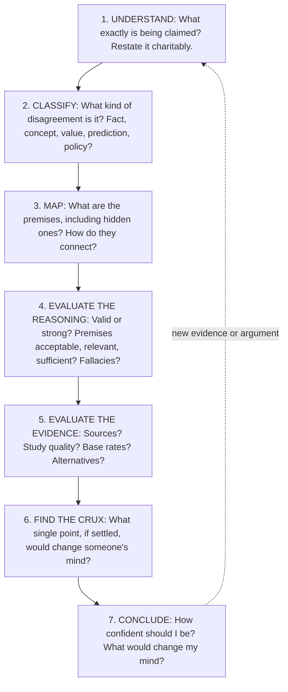

# Chapter 16. The Critical Thinker's Toolkit: Analyzing Discussions and Framing Arguments

[← Previous: A Field Guide to Fallacies](15-fallacies.md) · [Contents](README.md) · [Next: Glossary →](17-glossary.md)

**Audio:** [listen to this chapter](audio/16-critical-thinking-toolkit.mp3) (1 h 1 min, narrated) · [open in the player](audio/index.html#16)

---

> "You should attempt to re-express your target's position so clearly, vividly, and fairly that your target says, 'Thanks, I wish I'd thought of putting it that way.'"
> — Daniel Dennett, *Intuition Pumps and Other Tools for Thinking* (2013), stating Rapoport's first rule

> "The aim of argument, or of discussion, should not be victory, but progress."
> — Joseph Joubert (1754–1824), *Pensées*

The previous fifteen chapters provided the concepts. This chapter turns them into **practice**: a step-by-step method for analyzing any discussion, debate, article, or claim; a method for building your own arguments; tools for handling burden of proof, heuristics, and the ethics of disagreement; five fully worked case studies; and checklists and habits for daily use.

Think of this chapter as the workshop. Each tool links back to the chapter where its theory is explained.

---

## In this chapter

- [The core loop](#the-core-loop)
- [Step 1: Understand before you evaluate](#step-1-understand-before-you-evaluate)
- [Step 2: Identify the kind of disagreement](#step-2-identify-the-kind-of-disagreement)
- [Stasis theory](#stasis-theory)
- [Step 3: Map the argument](#step-3-map-the-argument)
- [Step 4: Evaluate the premises and the reasoning](#step-4-evaluate-the-premises-and-the-reasoning)
- [Step 5: Evaluate the evidence](#step-5-evaluate-the-evidence)
- [Step 6: Find the crux](#step-6-find-the-crux)
- [Step 7: Weigh and conclude](#step-7-weigh-and-conclude)
- [Framing an argument of your own](#framing-an-argument-of-your-own)
- [Burden of proof](#burden-of-proof)
- [Philosophical razors and heuristics](#philosophical-razors-and-heuristics)
- [The baloney detection kit](#the-baloney-detection-kit)
- [The ethics of discussion](#the-ethics-of-discussion)
- [Worked case studies](#worked-case-studies)
- [Checklists](#checklists)
- [Daily practices](#daily-practices)
- [Further reading](#further-reading)

---

## The core loop

Whenever you meet a claim, argument, or disagreement that matters, work through these seven steps. With practice, most of them become quick and automatic.

A useful preliminary is to separate the three modes of persuasion Aristotle identified in the *Rhetoric* (see [Aristotle](02-history-of-epistemology.md#aristotle)):

- **Logos**: the argument and evidence.
- **Ethos**: the speaker's character and credibility.
- **Pathos**: the emotions of the audience.

All three are legitimate parts of communication. But when you are deciding whether a claim is *true*, logos carries the weight, ethos matters only as evidence about testimony (see [Experts and novices](12-social-epistemology.md#experts-and-novices)), and pathos should be set aside. Ask yourself: *if I strip away the speaker's charisma and the emotional tone, what argument is left?*

---

## Step 1: Understand before you evaluate

You cannot evaluate a claim until you know what it is. Most bad arguments about arguments begin with a misunderstanding.

**Restate the claim in your own words**, and check your restatement with the other person if you can: "So, if I understand you, you're saying that... Is that right?"

**Apply the principle of charity** (see [The principle of charity](03-logic-and-arguments.md#the-principle-of-charity)): when a statement can be read in several ways, choose the most reasonable reading.

**Steelman.** Go further: construct the *strongest* version of the opposing view, even stronger than the one presented. If you can refute the strongest version, your conclusion is secure. If you can't, you have learned something. John Stuart Mill made the argument in *On Liberty*: "He who knows only his own side of the case, knows little of that" (see [Hegel, Mill, and Whewell](02-history-of-epistemology.md#hegel-mill-and-whewell)).

**Rapoport's rules.** Daniel Dennett (*Intuition Pumps*, 2013) popularized a set of rules for criticizing an opponent's view, which he attributed to the game theorist Anatol Rapoport:

1. Re-express your target's position so clearly, vividly, and fairly that your target says, "Thanks, I wish I'd thought of putting it that way."
2. List any points of agreement, especially if they are not matters of general or widespread agreement.
3. Mention anything you have learned from your target.
4. Only then are you permitted to say so much as a word of rebuttal or criticism.

**The ideological Turing test.** The economist Bryan Caplan (2011) proposed a test of whether you really understand an opposing view: could you explain it so well that members of that side could not tell you apart from a genuine believer? If you can't pass the test, you probably don't understand the view well enough to reject it confidently.

**Attend to what is implied, not just said.** The philosopher Paul Grice ("Logic and Conversation," 1975) noted that conversation relies on a **cooperative principle**, with maxims of **quantity** (say as much as needed, no more), **quality** (say what you believe true, with evidence), **relation** (be relevant), and **manner** (be clear). We routinely infer meanings beyond the literal words, called **implicatures**. If someone says "Some of the students passed," they implicate that not all did. If a reference letter says only "He has excellent handwriting and was always punctual," it implicates that there is nothing better to say. Understanding a claim includes understanding its implicatures, but be careful: implicatures can be canceled ("Some students passed; in fact, all did"), and it is unfair to hold someone to an implicature they didn't intend.

---

## Step 2: Identify the kind of disagreement

Disagreements differ in kind, and each kind is resolved differently. Many arguments go nowhere because the parties are having different kinds of disagreement without realizing it.

| Type | Question | Example | How it can be resolved |
|---|---|---|---|
| **Factual (empirical)** | What is the case? | "Did crime rise last year?" | Evidence: data, observation, experiment |
| **Causal** | What causes what? | "Did the policy cause the drop in crime?" | Causal inference: controlled comparisons, natural experiments (see [Causation](10-science-and-evidence.md#causation-and-causal-inference)) |
| **Predictive** | What will happen? | "Will this policy reduce crime?" | Models, base rates, track records, forecasting |
| **Conceptual / verbal** | What do we mean by the term? | "Is this 'censorship'?" | Clarify definitions; ban the word; separate the factual question (see [Verbal disputes](04-language-concepts-and-definitions.md#verbal-disputes)) |
| **Interpretive** | What does this text, law, or act mean? | "What did the author of this law intend?" | Context, evidence of intent, interpretive principles |
| **Normative (values)** | What is good, right, just? | "Is it fair to tax inherited wealth?" | Moral argument, consistency tests, thought experiments, reflective equilibrium (see [Facts, values, and the is-ought gap](04-language-concepts-and-definitions.md#facts-values-and-the-is-ought-gap)) |
| **Weighting (priorities)** | How much does each consideration matter? | "Is economic growth more important than equality?" | Often irreducible; clarify trade-offs; look for options that serve both |
| **Practical (policy)** | What should we do? | "Should we build the new motorway?" | Combines all the above: facts + predictions + values + weights + feasibility |
| **Framework (deep)** | What counts as evidence or authority? | "Should scripture or science settle this?" | Hardest; look for shared commitments, immanent critique (see [Deep disagreement](12-social-epistemology.md#deep-disagreement)) |

**Practical disagreements decompose.** Almost every disagreement about what to do contains factual, causal, predictive, conceptual, normative, and weighting components. Listing them separately is often the single most useful thing you can do in a debate. You may discover that you agree on 80% of the components, and that the real disagreement is narrow.

---

## Stasis theory

The ancient rhetoricians developed a tool for exactly this purpose. **Stasis theory** was systematized by **Hermagoras of Temnos** (2nd century BCE) and developed by Cicero and Quintilian for use in law courts. A *stasis* ("standing" or "stopping point") is the point at which the parties' positions meet and the disagreement is joined. The classical stases form a sequence:

1. **Conjecture (fact)**: *Did it happen? Does it exist?* "Did the defendant take the money?"
2. **Definition**: *What is it? How should it be classified?* "Was taking the money theft, or borrowing?"
3. **Quality**: *Is it good or bad, justified or unjustified? How serious?* "Was taking it justified by an emergency?"
4. **Procedure (jurisdiction, policy)**: *What should be done? Who should decide? Is this the right forum?* "Should this be handled by a criminal court, or privately?"

The stases are ordered: if the parties disagree about the facts, arguing about quality is premature. The prosecutor and defense must first establish where they actually disagree.

**Apply it to any modern debate.** Take a dispute about whether a city should remove a controversial statue:
- **Fact**: Who was this person? What did they do? When and why was the statue erected?
- **Definition**: Is the statue a historical record, a memorial honoring the person, or a political symbol? Would removal be "erasing history"?
- **Quality**: How should we weigh the person's achievements and wrongs? Whom does the statue harm or benefit?
- **Procedure**: Who should decide: the city council, a referendum, historians? Should it be removed, moved to a museum, or given explanatory context?

People who seem to be arguing about the same thing are frequently arguing at different stases. Asking "Where exactly do we disagree: about the facts, the definition, the value, or what to do?" can transform a shouting match into a discussion.

---

## Step 3: Map the argument

Now reconstruct the argument's structure (see [Reconstructing real arguments](03-logic-and-arguments.md#reconstructing-real-arguments)).

1. **Find the main conclusion.** Use the "therefore" test.
2. **List the stated premises.** Strip away rhetoric, repetition, and asides.
3. **Supply the missing premises**, choosing the most plausible ones that make the argument work (see [Supplying missing premises](03-logic-and-arguments.md#supplying-missing-premises)).
4. **Identify the structure.** Which premises are linked (work only together) and which are convergent (independent reasons)? Are there sub-arguments supporting premises?
5. **Identify the warrant** that connects evidence to conclusion (see [The Toulmin model](03-logic-and-arguments.md#the-toulmin-model)).
6. **Add objections and replies** to the map.

For a quick analysis, standard form is enough:

> 1. [premise]
> 2. [premise]
> 3. [hidden premise]
> ————
> C. [conclusion]

For a complex debate, draw a map (on paper, or with free tools such as Argdown, Kialo, or Rationale). A map makes it obvious when a conclusion depends on a single weak premise, or when an objection that seemed devastating actually attacks a side issue.

---

## Step 4: Evaluate the premises and the reasoning

Ralph Johnson and J. Anthony Blair (*Logical Self-Defense*, 1977) proposed three criteria for good premises, often called **ARS**:

- **Acceptability**: Are the premises true, or at least reasonable to accept? Are they supported, or are they themselves controversial?
- **Relevance**: Do the premises actually bear on the conclusion? (See [Fallacies of relevance](15-fallacies.md#fallacies-of-relevance).)
- **Sufficiency**: Taken together, do the premises provide *enough* support? (A relevant but weak premise may not be enough.)

Then check the **reasoning**:

- If it's **deductive**: is it valid? Try to find a counterexample (see [The method of counterexample](03-logic-and-arguments.md#the-method-of-counterexample)).
- If it's **inductive**: is the sample large and representative? Are there counterexamples? (See [Strength and cogency](03-logic-and-arguments.md#strength-and-cogency).)
- If it's **abductive**: were alternative explanations considered? Is this one really the best? (See [Inference to the best explanation](10-science-and-evidence.md#inference-to-the-best-explanation).)
- If it's an **analogy**: are the two cases alike in the respects that matter?
- If it's **causal**: have reverse causation, confounding, chance, and selection been ruled out? (See [Correlation and causation](10-science-and-evidence.md#correlation-and-causation).)
- If it's **practical** (we should do A to achieve G): see the critical questions under [Choose the right kind of argument](#choose-the-right-kind-of-argument).

Finally, scan for **fallacies**, remembering that most have legitimate cousins (see [Chapter 15](15-fallacies.md)).

---

## Step 5: Evaluate the evidence

### Evaluate the source

For any claim that rests on testimony, ask (see [Evaluating testimony in practice](07-sources-of-knowledge.md#evaluating-testimony-in-practice)):

- **Competence**: Is the source in a position to know? Does it have relevant expertise?
- **Sincerity**: Does it have reasons to mislead? Is the claim against its interest?
- **Track record**: How reliable has it been before, on this kind of question?
- **Independence**: Is it an independent source, or repeating another? Ten reports quoting one press release are one source.
- **Chain length**: How many steps separate you from the original evidence?

### Read laterally

Professional fact-checkers don't judge a website by looking at it. They **leave** it and see what other sources say about it (see [Do your own research](12-social-epistemology.md#do-your-own-research)). Mike Caulfield's **SIFT** method:

1. **Stop.** Before reading, sharing, or reacting, pause. Do you know this source? What is your purpose?
2. **Investigate the source.** Spend a minute finding out who is behind it and what their expertise and agenda are. Search for the source's name in a new tab.
3. **Find better coverage.** Look for the same claim reported by trusted sources, or for a fact-check. Often you don't need to evaluate *this* source at all; you just need to find a better one.
4. **Trace claims, quotes, and media to the original context.** Find the original study, the full quotation, or the original photo. Much misinformation consists of real material stripped of context.

(Older checklists such as the "CRAAP test," which asks about Currency, Relevance, Authority, Accuracy, and Purpose, are still useful as reminders, but Wineburg and colleagues found that checking a site's features vertically can be misleading, since sophisticated sites can look authoritative.)

### Evaluate the study

For scientific or statistical claims (see [Chapter 9](09-induction-probability-bayes.md) and [Chapter 10](10-science-and-evidence.md)):

- **What kind of study is it?** Randomized trial, cohort study, case-control, cross-sectional survey, case report, modeling, or opinion? Where does it sit in the [hierarchy of evidence](10-science-and-evidence.md#randomized-controlled-trials-and-the-hierarchy-of-evidence)?
- **Who was studied?** How many? How were they selected? Humans or animals? Do the findings apply to the people you care about?
- **Compared with what?** Was there a control group?
- **How big is the effect?** In absolute terms? "From what, to what?" (See [Relative and absolute risk](09-induction-probability-bayes.md#relative-and-absolute-risk).)
- **How uncertain?** Confidence intervals? Sample size?
- **Is it one study or many?** What do systematic reviews and meta-analyses say?
- **Has it been replicated?** Was it pre-registered?
- **Who funded it?** Are there conflicts of interest?
- **Is it plausible given prior knowledge?** An extraordinary result from a single small study is more likely to be a fluke (see [Why most published findings might be false](09-induction-probability-bayes.md#why-most-published-findings-might-be-false)).

### Think like a Bayesian

- **Start with the base rate.** How often are claims of this kind true? (The outside view.)
- **Assess the likelihood ratio.** How much more likely is this evidence if the claim is true than if it's false? (See [The odds form and likelihood ratios](09-induction-probability-bayes.md#the-odds-form-and-likelihood-ratios).)
- **Consider the alternatives.** What else could explain the evidence?
- **Don't double-count** dependent evidence.

---

## Step 6: Find the crux

A **crux** is a point on which the disagreement depends: if it were settled one way, one party would change their mind.

**Ask: "What would change your mind?"** Ask it of the other person, and of yourself. If the honest answer is "nothing," you have learned that the belief is not being held on the basis of evidence, and further argument about evidence may be pointless. If there is an answer, you have found a crux, and you can look for evidence on that specific point.

**Double crux.** The Center for Applied Rationality developed a technique called **double crux** for productive disagreement. Two people who disagree about a claim each look for a further, more concrete proposition such that (a) if it were true, they would believe the claim, and if false, they wouldn't; and (b) they disagree about it. When both people's beliefs about the claim depend on the *same* further proposition, it is a **double crux**: a shared, often testable question on which their disagreement turns.

> A: "Our company should switch to a four-day work week."
> B: "I disagree."
> A: "If I became convinced it would reduce productivity by more than 10%, I'd drop the idea."
> B: "And if I were convinced productivity would stay about the same, I'd support it."
> **Double crux**: *Would productivity fall by more than 10%?* Now they can look at evidence from trials in other companies, or run a pilot.

**Socratic questioning.** When exploring someone's view, or your own, these kinds of questions (developed by Richard Paul and Linda Elder from the Socratic tradition) help locate cruxes:

- **Clarification**: What do you mean by...? Can you give an example?
- **Assumptions**: What are you assuming? Why would someone assume that?
- **Reasons and evidence**: How do you know? What would change your mind?
- **Viewpoints**: How would someone who disagrees respond? What's the strongest objection?
- **Implications**: If that's true, what follows? Would you accept that consequence?
- **The question itself**: Why is this question important? Is this the right question?

---

## Step 7: Weigh and conclude

**Proportion your confidence to the evidence.** Conclusions are rarely all-or-nothing. Use degrees of confidence, and be explicit about them.

Words like "likely," "possible," and "serious chance" are notoriously ambiguous. In 1951, a US National Intelligence Estimate (NIE 29-51) stated that a Soviet attack on Yugoslavia should be considered a "serious possibility." Sherman Kent, a founder of American intelligence analysis, later discovered that the analysts who had agreed on this wording interpreted it as meaning anything from about a 20% to an 80% chance ("Words of Estimative Probability," 1964). The Intergovernmental Panel on Climate Change now uses a calibrated vocabulary:

| Term | Probability |
|---|---|
| Virtually certain | 99–100% |
| Extremely likely | 95–100% |
| Very likely | 90–100% |
| Likely | 66–100% |
| About as likely as not | 33–66% |
| Unlikely | 0–33% |
| Very unlikely | 0–10% |
| Extremely unlikely | 0–5% |
| Exceptionally unlikely | 0–1% |

When a conclusion matters, attach a rough number to it, even privately. Numbers force precision and make it possible to check your calibration later (see [Calibration and scoring rules](09-induction-probability-bayes.md#calibration-and-scoring-rules)).

**Suspend judgment when appropriate.** "I don't know" and "the evidence is mixed" are respectable conclusions. There is no obligation to have an opinion on everything.

**Record what would change your mind.** This makes your belief testable and keeps you honest.

**Distinguish belief from action.** Sometimes you must act before the evidence is conclusive. The practical question is then not "What is true?" but "What is the best action given my uncertainty, the costs of each kind of error, and the value of waiting for more information?" See [Pragmatic encroachment](13-virtues-and-ethics-of-belief.md#pragmatic-encroachment).

---

## Framing an argument of your own

Everything in this guide also applies when *you* are the one making the argument. Here is a method.

### Start with the question

State precisely **what question** you are answering and **what your answer is**. Many poor arguments come from vague questions. Not "What about immigration?" but "Would increasing the annual quota of skilled-worker visas by 20% raise or lower average wages for existing workers in this sector over five years?"

Identify which **stasis** your claim addresses: fact, definition, quality, or procedure. If your claim is practical ("we should..."), recognize that it depends on claims at the earlier stases.

### Build it in standard form

Write your argument out:

> 1. [premise: often an empirical claim]
> 2. [premise: often a normative principle]
> 3. [premise: connecting the two to the case at hand]
> ————
> C. [conclusion]

Then check:
- **Is it valid** (or strong)? If not, what premise is missing?
- **Is every premise explicit?** Are you relying on a hidden assumption that a critic would reject?
- **Which premise is weakest?** That is where your critics will aim, and where you need the most support.

### Choose the right kind of argument

- **Deductive**: when you can establish premises that guarantee the conclusion. Rare outside logic, mathematics, and definitions, but powerful.
- **Inductive**: generalizing from evidence. Needs good samples and background knowledge.
- **Abductive**: arguing that your hypothesis best explains the evidence. Needs explicit comparison with rivals.
- **Analogical**: arguing from a similar case. Needs relevant similarities and no relevant differences.
- **Practical reasoning** (means–end): "We want goal G; action A would achieve G; so we should do A." Douglas Walton's critical questions for practical reasoning are a checklist for making your own proposal robust:
  1. Are there other goals that conflict with G?
  2. Are there alternative actions that would achieve G better?
  3. Is A actually possible (feasible)?
  4. What are the side effects (negative consequences) of A?
  5. Is there evidence that A would actually achieve G?

A policy proposal that has answered these five questions is far stronger than one that hasn't.

### Anticipate objections

Before presenting your argument, write down the **three strongest objections** you can think of, and answer them. Better still, show your argument to someone who disagrees and ask them to find its weakest point (see [The argumentative theory of reasoning](14-psychology-of-reasoning.md#the-argumentative-theory-of-reasoning)). A premortem helps: imagine that your argument has been decisively refuted. What was the refutation?

Addressing objections openly has three benefits: it improves the argument, it shows that you understand the other side (building trust), and it deprives critics of easy responses.

### Qualify appropriately

State your conclusion with the **degree of confidence** your evidence supports, and note the **conditions** under which it holds (the Toulmin **qualifier** and **rebuttal**; see [The Toulmin model](03-logic-and-arguments.md#the-toulmin-model)).

- Overclaiming ("This proves...", "It's obvious that...", "Everyone knows...") invites refutation and damages your credibility when a single counterexample appears.
- Underclaiming ("It might possibly be the case that perhaps...") makes the argument useless.
- Good qualification is specific: "In cities with good public transport, congestion charges have reduced traffic by roughly a fifth; the effect would probably be smaller here, because fewer drivers have alternatives."

### Write clearly

George Orwell's rules from "Politics and the English Language" (1946) are still good advice:

1. Never use a metaphor, simile, or other figure of speech which you are used to seeing in print.
2. Never use a long word where a short one will do.
3. If it is possible to cut a word out, always cut it out.
4. Never use the passive where you can use the active.
5. Never use a foreign phrase, a scientific word, or a jargon word if you can think of an everyday English equivalent.
6. Break any of these rules sooner than say anything outright barbarous.

Clarity is an epistemic virtue: vague claims cannot be tested, and they allow motte-and-bailey retreats (see [Motte and bailey](15-fallacies.md#motte-and-bailey)). Steven Pinker (*The Sense of Style*, 2014) recommends "classic style": write as if you are showing the reader something they can see for themselves.

### A template

> **Question**: [precise question]
> **My answer**: [claim], with [degree of confidence].
> **Main reasons**: 1... 2... 3...
> **Key evidence**: [sources, studies, data], and why they are reliable.
> **Hidden assumptions**: [the premises I'm relying on that some would dispute].
> **Strongest objections and my replies**: ...
> **What would change my mind**: ...
> **Limits**: this conclusion applies when... and may not apply when...

---

## Burden of proof

The **burden of proof** is the obligation to support a claim. Who bears it matters, because in the absence of a decisive argument, the party with the burden loses. Disputes about who bears it are common, and often decide debates unfairly.

**General principles:**

1. **Whoever makes a claim bears the burden of supporting it.** This is Hitchens's razor (below), and it is the default in most rational discussion. "Prove me wrong" is not an argument.
2. **Extraordinary claims bear a heavier burden** than ordinary ones, because their prior probability is lower (see [Evidence and confirmation](09-induction-probability-bayes.md#evidence-and-confirmation)).
3. **Context sets presumptions.** In criminal law, the prosecution bears the burden, and the defendant is presumed innocent. In medicine, a new treatment must show it is safe and effective before approval. In science, a new hypothesis must show it does better than the established one. These presumptions reflect judgments about which errors are worse.
4. **Burden of proof is not the same as standard of proof.** The burden says *who* must provide evidence; the standard says *how much* is needed (beyond reasonable doubt, balance of probabilities, and so on; see [Epistemic institutions](12-social-epistemology.md#epistemic-institutions)).
5. **Burdens can shift.** Once one party presents evidence that meets a reasonable standard, the burden shifts to the other to rebut it.

**Russell's teapot** (see [Faith, reason, and religious epistemology](13-virtues-and-ethics-of-belief.md#the-evidentialist-challenge)) illustrates the default: an unfalsifiable claim that cannot be disproved does not thereby earn belief.

**Burden of proof games.** Watch for:
- **Shifting the burden**: "You can't prove it's not true, so you should accept it."
- **Burden tennis**: both parties insisting the other must prove their case, with no progress.
- **Asymmetric burdens**: demanding overwhelming proof for claims one dislikes, and none for claims one likes (see [Healthy and corrosive skepticism](08-skepticism.md#healthy-and-corrosive-skepticism)).

In practical decisions, it is often better to set burdens aside and ask directly: *given all the evidence we have, which option has the best expected outcome?*

---

## Philosophical razors and heuristics

A **razor** is a rule of thumb that lets you "shave off" unlikely explanations or unnecessary claims. None is infallible. Each is a heuristic, not a law.

| Razor or principle | Statement | Use | Caution |
|---|---|---|---|
| **Ockham's razor** | Do not multiply entities beyond necessity. (Associated with William of Ockham, c. 1287–1347; the famous wording is later.) | Prefer the simpler explanation, other things being equal. | "Other things being equal" is crucial. Simplicity is a tiebreaker, not a trump card. Einstein's principle, as often paraphrased: make things as simple as possible, but no simpler. |
| **Hume's maxim** | "A wise man proportions his belief to the evidence." "No testimony is sufficient to establish a miracle, unless the testimony be of such a kind, that its falsehood would be more miraculous, than the fact." | Weigh the probability that the testimony is mistaken against the improbability of the event. | Requires honest estimates of both. |
| **The Sagan standard** | "Extraordinary claims require extraordinary evidence." (Popularized by Carl Sagan in the television series *Cosmos*, 1980; similar formulations appear in Marcello Truzzi, Laplace, and Hume.) | Low prior probability requires a large likelihood ratio. | "Extraordinary" must mean improbable given background knowledge, not merely unfamiliar or unwelcome. |
| **Hitchens's razor** | "What can be asserted without evidence can also be dismissed without evidence." (Christopher Hitchens, 2003.) | The burden of proof lies with the claimant. | Dismissing an unsupported claim is not the same as proving it false. |
| **Russell's teapot** | An unfalsifiable claim doesn't deserve belief just because it can't be disproved. | Resisting burden-shifting. | See above. |
| **Hanlon's razor** | "Never attribute to malice that which is adequately explained by stupidity." (Published by Robert J. Hanlon in 1980; similar sayings are much older.) | A check against conspiratorial thinking: incompetence and accident are common. | Malice does exist; the razor is about which explanation to try first. |
| **Chesterton's fence** | Don't remove a fence until you know why it was put up. | Before changing a rule or institution, understand its purpose. | Some fences really are pointless; the principle requires inquiry, not preservation. |
| **Popper's falsifiability** | A claim that no possible observation could contradict says nothing about the world. | Ask "What would show this to be false?" | Not a complete criterion of meaning or science (see [Chapter 10](10-science-and-evidence.md#popper-and-falsificationism)). |
| **Alder's razor** ("Newton's flaming laser sword") | "What cannot be settled by experiment or observation is not worth debating." (Mike Alder, 2004.) | Focus debate on questions evidence can settle. | Too strong as a general rule: ethics and mathematics are worth debating. |
| **Brandolini's law** | The effort to refute nonsense is an order of magnitude greater than the effort to produce it. | Choose your battles; rely on trusted sources. | Not a reason to ignore all misinformation. |
| **Cromwell's rule** | Never assign probability 0 or 1 to an empirical claim. | Stay open to evidence. | Very small probabilities are still small. |
| **Hume's guillotine** | You can't derive an "ought" from an "is" alone. | Find the normative premise. | Contested in its strongest form (see [Chapter 4](04-language-concepts-and-definitions.md#facts-values-and-the-is-ought-gap)). |
| **Sturgeon's law** | "Ninety percent of everything is crud." (Theodore Sturgeon, 1957.) | Judge a field by its best work, not its worst (and vice versa). | Also applies to your own side. |

---

## The baloney detection kit

In *The Demon-Haunted World* (1995), chapter 12, "The Fine Art of Baloney Detection," the astronomer Carl Sagan proposed a set of "tools for skeptical thinking." Paraphrased:

1. Wherever possible there must be **independent confirmation** of the "facts."
2. Encourage **substantive debate** on the evidence by knowledgeable proponents of all points of view.
3. **Arguments from authority carry little weight**: "authorities" have made mistakes in the past. (Sagan meant that authority is not a substitute for evidence; see [Appeal to authority](15-fallacies.md#appeal-to-authority) for when deference is reasonable.)
4. **Spin more than one hypothesis.** Think of all the different ways something could be explained, then think of tests by which you might systematically disprove each.
5. **Try not to get overly attached to a hypothesis** just because it's yours.
6. **Quantify.** If whatever it is you're explaining has some measure attached to it, you'll be better able to discriminate among competing hypotheses.
7. **If there's a chain of argument, every link in the chain must work**, including the premise, not just most of them.
8. **Occam's razor.** When faced with two hypotheses that explain the data equally well, choose the simpler.
9. **Always ask whether the hypothesis can be, at least in principle, falsified.**

Sagan added a list of common fallacies to avoid, most of which appear in [Chapter 15](15-fallacies.md).

---

## The ethics of discussion

### The rules of critical discussion

The pragma-dialectical theory of argumentation (Frans van Eemeren and Rob Grootendorst, *A Systematic Theory of Argumentation*, 2004) proposes ten rules for a **critical discussion**, a discussion aimed at resolving a difference of opinion on the merits. Violating any of them is a fallacy in their sense. Summarized:

1. **Freedom rule**: Parties must not prevent each other from advancing standpoints or casting doubt on them.
2. **Burden-of-proof rule**: A party who advances a standpoint must defend it if asked to.
3. **Standpoint rule**: An attack on a standpoint must address the standpoint actually advanced by the other party (no straw men).
4. **Relevance rule**: A party may defend a standpoint only with argumentation relevant to that standpoint.
5. **Unexpressed premise rule**: A party may not falsely attribute an unexpressed premise to the other party, nor disown a premise that they themselves left implicit.
6. **Starting point rule**: A party may not falsely present a premise as an accepted starting point, nor deny a premise that is an accepted starting point.
7. **Argument scheme rule**: A standpoint is not conclusively defended unless the defense uses an appropriate argument scheme, correctly applied.
8. **Validity rule**: The reasoning must be logically valid, or capable of being made valid by making unexpressed premises explicit.
9. **Closure rule**: A failed defense of a standpoint must result in the protagonist retracting it; a successful defense must result in the antagonist retracting their doubt.
10. **Usage rule**: Parties must not use formulations that are unclear or confusingly ambiguous, and must interpret each other's formulations as carefully and accurately as possible.

Rule 9 is the hardest in practice. It requires both parties to be willing to **change their minds** when the argument goes against them.

### The hierarchy of disagreement

The essayist Paul Graham ("How to Disagree," 2008) proposed a hierarchy of forms of disagreement, from worst to best:

| Level | Form | Example |
|---|---|---|
| **DH0** | Name-calling | "You're an idiot." |
| **DH1** | Ad hominem | "Of course you'd say that; you're a lawyer." |
| **DH2** | Responding to tone | "I can't believe how arrogant you sound." |
| **DH3** | Contradiction | "No, that's wrong." (with no reasons) |
| **DH4** | Counterargument | Contradiction plus reasoning and evidence, but perhaps aimed at something slightly different from what was said. |
| **DH5** | Refutation | Quoting what the other person actually said and showing why it's mistaken. |
| **DH6** | Refuting the central point | Refuting the main claim, not a minor side point. |

Aim for DH5 and DH6. Most online disagreement happens at DH0–DH3.

### Know what kind of dialogue you are in

Douglas Walton and Erik Krabbe (*Commitment in Dialogue*, 1995) distinguished types of dialogue with different goals:

| Dialogue type | Goal |
|---|---|
| **Persuasion** (critical discussion) | Resolve a difference of opinion |
| **Inquiry** | Prove or disprove a hypothesis jointly |
| **Information-seeking** | One party obtains information from another |
| **Deliberation** | Decide what to do |
| **Negotiation** | Reach a deal both parties accept |
| **Eristic** (quarrel) | Defeat the other party; vent hostility |

Many fallacies involve an illicit **shift** from one type to another, for example from a persuasion dialogue about facts to a negotiation ("let's split the difference" on a factual question; see [The middle ground fallacy](15-fallacies.md#the-middle-ground-fallacy)), or from inquiry to quarrel. When a discussion goes wrong, ask: what are we actually trying to do here?

### Practical conduct

- **Listen first.** Ask questions before stating your view.
- **Separate the person from the position.** Criticize ideas, not people.
- **Concede what's right.** It's honest, it builds trust, and it narrows the disagreement.
- **Say "I don't know"** and "I was wrong" when they are true. Doing so publicly is one of the most powerful signals of good faith.
- **Don't try to win.** If you "win" an argument by making someone feel stupid, you have usually lost their willingness to consider your view.
- **Know when to stop.** Some conversations are not persuasion dialogues. If the other person is arguing in bad faith (see [Rhetorical tactics that corrupt discussion](15-fallacies.md#rhetorical-tactics-that-corrupt-discussion)), or the setting rewards performance over understanding, it's reasonable to disengage.
- **Change minds slowly.** People rarely change their views during a single argument. They change them later, after reflection, if the argument was good and they didn't feel humiliated. Plant seeds.

---

## Worked case studies

### Case study 1: A health claim

> Your colleague says: *"You should try ColdAway. It's a natural herbal supplement. I took it at the first sign of a cold last month, and the cold was gone in three days. Usually my colds last a week. And it's recommended by a doctor on a popular podcast."*

**Step 1: Understand.** The claim is causal and general: *ColdAway shortens colds* (and implicitly, *it will shorten yours*). The supporting considerations are a personal anecdote, the product's naturalness, and an endorsement by a doctor.

**Step 2: Classify.** A factual causal claim, which can in principle be settled by evidence.

**Step 3: Map.**
> 1. I took ColdAway and my cold lasted three days.
> 2. My colds usually last a week.
> 3. *(Hidden)* So ColdAway caused my cold to be shorter.
> 4. *(Hidden)* What worked for me will work for others.
> 5. It's natural. *(Hidden: natural products are safe/effective.)*
> 6. A doctor recommends it. *(Hidden: this doctor's endorsement is reliable evidence.)*
> ————
> C. ColdAway shortens colds, and you should take it.

**Step 4: Evaluate the reasoning.**
- Premise 3 is **post hoc** reasoning from a single case (see [Post hoc ergo propter hoc](15-fallacies.md#post-hoc-ergo-propter-hoc)). Cold duration varies naturally, and she may have had a milder virus.
- Premise 4 is a **hasty generalization** from one case.
- Premise 5 is an **appeal to nature**.
- Premise 6 may be an illegitimate **appeal to authority**: is the doctor an expert in this area, and does their view reflect the evidence? Are they paid to promote the product (a podcast sponsor)?

**Step 5: Evaluate the evidence.**
- **The likelihood ratio of the anecdote** is only slightly above 1. Colds last anywhere from a few days to two weeks; a three-day cold is not surprising without any treatment. Also consider **selection**: she is telling you about the time it "worked," not about colds where she took it and nothing happened (survivorship). And there may be a **placebo effect** on how she perceived her symptoms.
- **What better evidence exists?** Search for systematic reviews (for example, from the Cochrane Library) of the supplement's main ingredients. For many herbal cold remedies, the evidence is weak, mixed, or of low quality. Check for regulatory warnings about interactions or side effects.
- **Lateral reading on the doctor**: What is their specialty? Do they have financial ties to the product?

**Step 6: Find the crux.** "Would you still believe it works if good-quality randomized trials found no effect?" If she says yes, her belief isn't based on the kind of evidence that could settle the question.

**Step 7: Conclude.** The anecdote is very weak evidence. The claim "ColdAway shortens colds" is unsupported unless controlled trials show otherwise. Practical judgment: if the product is cheap and safe, taking it is a low-stakes personal choice, but it would be a mistake to *believe* it works on this basis, or to recommend it to others as effective.

**A charitable, non-confrontational response**: "I'm glad you felt better quickly! Colds are so variable that it's hard to tell from one time. Have there been any proper trials on it? I'd be curious what they found."

---

### Case study 2: A policy debate

> Your city is debating **congestion charging**: a daily fee for driving into the city center during peak hours.
>
> **Speaker A**: "Congestion charging works. London and Stockholm both cut traffic substantially. Our city center is gridlocked and polluted. The revenue can fund better buses. We should do it."
>
> **Speaker B**: "This is a tax on working people. The rich will pay and keep driving; nurses and cleaners who commute from the suburbs will be priced out. And local shops will lose customers. It's an attack on freedom."

**Step 1: Understand.** Steelman each side.
- A: Pricing road space during peak hours reduces congestion and pollution; evidence from other cities supports this; revenue can improve alternatives.
- B: The charge would impose a disproportionate burden on lower-income people who lack alternatives to driving; it may harm local businesses; and it restricts people's freedom to use public roads.

**Step 2: Classify, using stasis theory.**

| Stasis | Questions in this debate | Type |
|---|---|---|
| **Fact / prediction** | Would traffic fall here, and by how much? Would air quality improve? Would shop revenues fall? How many low-income commuters drive into the center, and what alternatives do they have? | Empirical, predictive |
| **Definition** | Is it a "tax" or a "price"? Is it "regressive"? Is it a restriction of "freedom"? | Conceptual |
| **Quality** | How should we weigh congestion and pollution against costs to drivers? What is fair? | Normative, weighting |
| **Procedure** | Should revenues be ring-fenced for transit? Should low-income workers get exemptions? Should it be decided by referendum? Trialed first? | Practical, procedural |

**Step 3: Map the cruxes.** Much of the disagreement concerns **predictions** and **distributional effects**, which are empirical, and **weights**, which are normative. The "tax versus price" and "freedom" disputes are partly **verbal** and partly about values.

**Step 5: Evidence.**
- *Traffic.* Evidence from other cities is relevant but must be assessed for **external validity** (see [Randomized controlled trials](10-science-and-evidence.md#randomized-controlled-trials-and-the-hierarchy-of-evidence)). London's scheme (introduced in 2003) and Stockholm's (trialed in 2006, then made permanent after a referendum) both reduced traffic entering the charging zones by roughly a fifth, according to official evaluations, though effects on congestion have changed over time as road space was reallocated. Stockholm's experience is also informative on public opinion: support rose substantially after residents experienced the trial. Are the conditions here similar (public transport alternatives, city layout)?
- *Distribution.* Who actually drives into the center at peak times? In many cities, peak-hour drivers into the center have higher average incomes than public transport users, which complicates the claim that the charge is regressive; in others, shift workers without transit options are affected. This is checkable with local travel survey data.
- *Business effects.* What happened to retail in the centers of cities that introduced charges? Evidence is mixed and hard to disentangle from other trends.

**Step 6: Double crux.** Suppose B says: "If there were affordable, reliable alternatives for lower-income commuters, and exemptions for essential shift workers, my main objection would go away." And A says: "If the evidence showed traffic here wouldn't fall meaningfully, I'd drop the proposal." The cruxes are now concrete: *What alternatives exist, and what would the traffic impact be?* A **time-limited trial** with evaluation, as in Stockholm, is a way to gather evidence on exactly these points.

**Step 7: Conclude.** A reasonable conclusion might be: "The evidence from comparable cities suggests traffic would fall substantially. The distributional effects depend on local facts we should measure. A well-designed trial, with exemptions or discounts for low-income essential workers and revenue committed to transit, would address most of B's concerns and test A's claims." Notice that this conclusion was reached by **decomposing** the disagreement, not by declaring a winner.

---

### Case study 3: A statistical headline

> **Headline**: *"Coffee drinkers live longer, major study finds."*
> **Article excerpt** (hypothetical): "In a study of 400,000 adults followed for ten years, those who drank two to three cups of coffee a day were 12% less likely to die during the study period than non-drinkers, after adjusting for age, smoking, and other factors."

Work through the twelve questions from [Chapter 1](01-what-is-epistemology.md#how-the-pieces-connect-one-news-story-twelve-questions):

1. **What exactly is claimed?** The headline suggests causation ("coffee makes you live longer"). The study reports an **association**: coffee drinkers had lower mortality. These are different claims.
2. **Who is telling me?** A journalist, likely working from a press release. Check the original paper's abstract and conclusions, which are usually more cautious.
3. **What kind of study?** An **observational cohort study**: people chose whether to drink coffee. Not a randomized trial (it would be hard to randomize people to drink coffee or not for ten years).
4. **Could something else explain the pattern?**
   - **Confounding**: coffee drinkers might differ in income, employment, social life, or health in ways not fully captured by the adjustments. ("Adjusting for other factors" can only remove confounding by factors that were measured, and measured accurately.)
   - **Reverse causation**: people who become seriously ill often stop drinking coffee (the "sick quitter" effect), which would make non-drinkers look less healthy.
5. **How big is the effect?** "12% less likely to die" is a **relative** reduction. If the ten-year risk of death in this population was about 5%, a 12% relative reduction means about 4.4% instead of 5%: roughly **6 fewer deaths per 1,000 people over ten years**. That's real if causal, but modest.
6. **Does it fit other evidence?** Many large cohort studies in different countries have found similar associations, and meta-analyses of them agree. That **consistency** strengthens the finding, though consistent confounding is possible. There is also a plausible **dose–response** relationship in some studies, with benefits leveling off at higher intake.
7. **What do experts say?** Reviews generally conclude that moderate coffee drinking is not harmful for most adults and may be associated with modest benefits, while noting that causation has not been established. (Pregnant women and some other groups are usually advised to limit caffeine.)
8. **Has it been replicated?** Yes, in the sense of consistent associations across cohorts. Methods such as Mendelian randomization, which use genetic variants that affect coffee consumption as natural experiments, have been applied, with mixed results.
9. **Do I want it to be true?** If you love coffee, be aware of **motivated reasoning**.
10. **Am I seeing only the headline-worthy results?** Studies finding "coffee linked to longer life" make headlines; studies finding no association often don't (**publication and media bias**).
11. **How confident should I be?** Fairly confident that moderate coffee drinking is not harmful for most people; much less confident that it *causes* longer life.
12. **Does it matter for what I do?** Probably not much. It is a reason not to worry about moderate coffee drinking, not a reason to start.

**A good one-sentence summary**: "Large observational studies consistently find that moderate coffee drinkers live slightly longer, which suggests coffee isn't harmful for most people, but they can't show that coffee is the cause."

---

### Case study 4: A philosophical argument

Nick Bostrom's **simulation argument** (introduced in [Chapter 8](08-skepticism.md#the-simulation-argument)) is a good exercise in reconstructing and evaluating a sophisticated argument.

**Step 1: Understand.** Bostrom does *not* argue that we are in a simulation. He argues that at least one of three propositions is true.

**Step 3: Map.** A reconstruction:

> 1. **Substrate independence**: conscious experience can arise from a computational process running on any suitable hardware, not only biological brains.
> 2. **Computational feasibility**: a technologically mature ("posthuman") civilization would have enough computing power to run many simulations of entire human histories, with conscious simulated people.
> 3. If a significant fraction of civilizations at our stage reach maturity, and a significant fraction of mature civilizations run many such "ancestor simulations," then the number of simulated minds with experiences like ours vastly exceeds the number of non-simulated minds.
> 4. **The indifference principle**: if you know that a fraction *x* of all observers with experiences like yours are simulated, and you have no other evidence about which kind you are, your credence that you are simulated should be about *x*.
> ————
> C. At least one of the following is true: (a) almost no civilizations reach maturity; (b) almost no mature civilizations run ancestor simulations; (c) we are almost certainly simulated.

**Step 4: Evaluate.** The argument is valid, given the premises (it's essentially a probabilistic disjunction). So assess the premises.
- **Premise 1** is a contested thesis in the philosophy of mind. If consciousness requires biology (as some argue, for example John Searle), simulated people would not be conscious, and the argument fails.
- **Premise 2** is an empirical prediction about future technology. Some argue that simulating a whole world in detail may be infeasible; Bostrom replies that a simulation only needs to render what observers perceive.
- **Premise 4** raises the **reference class problem** (see [Kinds of non-deductive inference](09-induction-probability-bayes.md#kinds-of-non-deductive-inference)): what counts as an observer "with experiences like yours"? And it assumes you have no evidence distinguishing the cases.
- **Alternative (b)** may be more plausible than it first appears: mature civilizations might have ethical or practical reasons not to run such simulations.

**Step 6: Find the cruxes.** Whether substrate independence is true; how to assign credences among (a), (b), and (c).

**Step 7: Conclude.** The argument is a clever and valid probabilistic structure, but its conclusion (the disjunction) is much weaker than the popular summary "we're probably in a simulation." Its force depends on contested premises in philosophy of mind and on speculative predictions. A reasonable response is to accept that the disjunction is interesting, while assigning substantial credence to (a) or (b), or doubting premise 1. Note also David Chalmers's point that even if (c) were true, most of our beliefs about our world might still be true. This case shows how a valid argument with a startling conclusion can be defused by examining its premises, not by rejecting its logic.

---

### Case study 5: An online dispute

> **Post**: "Social media is destroying teenagers' mental health. The data are clear."
> **Reply**: "There's no real evidence for that. It's just a moral panic, like the panics about comic books, TV, and video games."
> **Reply to reply**: "So you're saying it's fine for kids to be on their phones eight hours a day?"
> **Reply**: "I never said that. You people just want to ban everything."

**Step 1: Understand, and diagnose the conversation.**
- The third message is a **straw man**: the second never said heavy phone use was fine. The fourth replies with a **generalization about "you people"** (a form of ad hominem) and a straw man of its own.
- The conversation has shifted from a **persuasion dialogue** into an **eristic** one (see [Know what kind of dialogue you are in](#know-what-kind-of-dialogue-you-are-in)).

**Step 2: Classify the original disagreement.**
- **Conceptual**: what does "destroying" mean? What counts as "mental health" (diagnosed disorders, self-reported anxiety, well-being)? Which teenagers, and which uses of social media?
- **Empirical and causal**: is there an association between social media use and poor mental health in teenagers? How large? Is it causal?
- **Analogical**: is the comparison with past moral panics apt?

**Watch for motte and bailey** (see [Motte and bailey](15-fallacies.md#motte-and-bailey)) on both sides:
- Bailey: "Social media is *the* cause of a teen mental health crisis." Motte: "Heavy social media use may harm some teenagers."
- Bailey: "There's no evidence of any harm." Motte: "The evidence doesn't show large average effects."

**Step 5: What does the evidence actually say?** (As of the mid-2020s, this is an active scientific debate, and the summary below describes positions rather than settling them.)
- Rates of reported anxiety and depression among teenagers, especially girls, rose in several countries in the 2010s. Some researchers, notably Jonathan Haidt (*The Anxious Generation*, 2024) and Jean Twenge, argue that the spread of smartphones and social media was a major cause.
- Other researchers have found that, averaged across the population, associations between digital technology use and adolescent well-being in large datasets are small. Amy Orben and Andrew Przybylski ("The Association between Adolescent Well-Being and Digital Technology Use," 2019) reported that the association was comparable in size to that of wearing glasses or eating potatoes. Critics of Haidt's thesis, such as the psychologist Candice Odgers, argue that the evidence for large causal effects is weak and that other causes are neglected.
- Some quasi-experimental studies suggest causal effects. For instance, Luca Braghieri, Ro'ee Levy, and Alexey Makarin ("Social Media and Mental Health," 2022) used the staggered rollout of Facebook across US colleges in the mid-2000s and found that its arrival was associated with worse student mental health.
- Effects likely **vary** by individual, type of use, platform, and amount. Average effects can be small while some groups are substantially affected.

**The moral panic analogy** is relevant (past panics about new media were largely overblown, which is a reasonable base-rate consideration) but not decisive: the analogy may fail if social media differs in relevant ways (constant availability, social comparison, algorithmic engagement). See [False analogy](15-fallacies.md#false-analogy).

**Step 6: Find the cruxes.** How large is the causal effect of social media on teen mental health, for whom, and for which kinds of use? And what level of evidence should justify policy action (for example, age limits or school phone bans), given the costs of acting and of not acting? The latter is partly a question about [inductive risk](10-science-and-evidence.md#values-in-science) and values.

**Step 7: Conclude.** "The data are clear" (first post) overstates the case; "there's no real evidence" (second) also overstates it. A defensible summary: "There is a genuine scientific debate. Average associations are small in many studies, some quasi-experimental evidence suggests real harms, and effects probably vary a lot. Reasonable people disagree about how much evidence is needed before restricting teenagers' use."

**How to re-enter the conversation productively**: "It seems like we might agree that very heavy use isn't great for some kids, and disagree about how big the average effect is and what to do about it. What evidence would change your mind about the size of the effect?"

---

## Checklists

### Before you believe a claim

- [ ] What exactly is being claimed? (Restate it.)
- [ ] Who is the source, and how would they know?
- [ ] What's the evidence? Is it anecdote, observational data, or controlled experiment?
- [ ] How big is the effect, in absolute terms?
- [ ] What's the base rate? Is the claim extraordinary?
- [ ] What alternative explanations exist?
- [ ] Do independent sources confirm it?
- [ ] Do I want it to be true (or false)?
- [ ] What would change my mind?

### Before you share something

- [ ] Have I read beyond the headline?
- [ ] Have I checked the source laterally?
- [ ] Have I traced it to the original context?
- [ ] Is it likely to be true, or does it just feel satisfying?
- [ ] Would I be embarrassed if it turned out to be false?

### Before you argue

- [ ] Can I state the other side's view in a way they'd accept?
- [ ] What kind of disagreement is this (fact, concept, value, prediction, policy)?
- [ ] What do we agree on?
- [ ] What's my strongest argument, and what's its weakest premise?
- [ ] What would change my mind?
- [ ] What kind of dialogue is this, and is it worth having now?

### When evaluating a study

- [ ] Study design (RCT, cohort, case-control, cross-sectional, model)?
- [ ] Sample size and selection?
- [ ] Comparison group?
- [ ] Effect size and confidence interval?
- [ ] Absolute versus relative risk?
- [ ] Pre-registered? Replicated? Consistent with other studies?
- [ ] Funding and conflicts of interest?
- [ ] Does the conclusion go beyond the data (e.g., causal language from correlational data)?

### When you notice yourself getting heated

- [ ] Am I defending a belief or trying to find out what's true?
- [ ] Is my identity tied to this view?
- [ ] Am I applying the same standards to both sides? (Selective skeptic test.)
- [ ] Can I explain the *mechanism* behind my view, step by step?
- [ ] Would I be willing to say "I was wrong" if the evidence went the other way?

---

## Daily practices

Critical thinking is a skill (see [Knowledge-how revisited](05-the-nature-of-knowledge.md#knowledge-how-revisited)), and skills are built by regular practice with feedback. Some habits that help:

1. **Keep a prediction journal.** Write down predictions with probabilities ("70%: the project will be finished by March"). Check them later. Compute your calibration. This is the single best way to improve your judgment under uncertainty.
2. **Steelman one opposing view each week.** Pick a view you reject and write the best case for it that you can. Check your version with someone who holds it.
3. **Read laterally.** Make it a reflex: before trusting an unfamiliar source, spend thirty seconds finding out who's behind it.
4. **Explain the mechanism.** When you notice a strong opinion, try to explain step by step *how* the thing you believe works.
5. **Write down what would change your mind** about your most important beliefs.
6. **Map an argument.** Once a week, take an opinion piece and put its argument in standard form, including hidden premises.
7. **Follow smart people you disagree with.** Deliberately include high-quality sources from different perspectives in your reading.
8. **Say "I was wrong" out loud** when you are. It gets easier, and it shows others that changing your mind is normal.
9. **Take the outside view.** Before judging any specific case (a project, a claim, a forecast), ask how often things of this kind turn out a certain way.
10. **Run premortems** before important decisions.
11. **Sleep on it.** When a decision is important and there's time, delay. Reactions formed in anger or excitement are rarely calibrated.
12. **Prefer depth to volume.** Read fewer breaking news items and more long-form analysis, books, and primary sources.

---

## Further reading

**Practical critical thinking**
- Carl Sagan, *The Demon-Haunted World: Science as a Candle in the Dark* (Random House, 1995). Includes the baloney detection kit.
- Walter Sinnott-Armstrong, *Think Again: How to Reason and Argue* (Oxford University Press, 2018).
- Julia Galef, *The Scout Mindset* (Portfolio, 2021).
- Daniel Dennett, *Intuition Pumps and Other Tools for Thinking* (W. W. Norton, 2013).
- Ralph Johnson and J. Anthony Blair, *Logical Self-Defense* (IDEA, 2006).
- Sam Wineburg, *Why Learn History (When It's Already on Your Phone)* (University of Chicago Press, 2018), and Wineburg and Mike Caulfield, *Verified: How to Think Straight, Get Duped Less, and Make Better Decisions about What to Believe Online* (University of Chicago Press, 2023).
- Carl Bergstrom and Jevin West, *Calling Bullshit* (Random House, 2020).

**Argumentation and dialogue**
- Frans van Eemeren and Rob Grootendorst, *A Systematic Theory of Argumentation: The Pragma-Dialectical Approach* (Cambridge University Press, 2004).
- Douglas Walton and Erik Krabbe, *Commitment in Dialogue* (SUNY Press, 1995).
- Paul Graham, "How to Disagree" (2008), available on his website.
- Ian Leslie, *Conflicted: Why Arguments Are Tearing Us Apart and How They Can Bring Us Together* (Faber, 2021).

**Rhetoric**
- Jay Heinrichs, *Thank You for Arguing* (Three Rivers Press, 3rd ed. 2017). An accessible introduction to classical rhetoric, including stasis theory.

---

[← Previous: A Field Guide to Fallacies](15-fallacies.md) · [Contents](README.md) · [Next: Glossary →](17-glossary.md)
