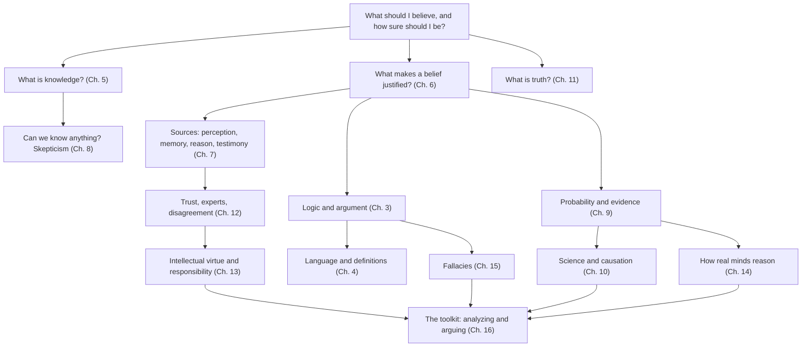

# Mastering Epistemology

**A complete guide to knowledge, evidence, and critical thinking**

> "*Sapere aude!* Have courage to use your own understanding!"
> — Immanuel Kant, "What Is Enlightenment?" (1784)

Epistemology is the study of knowledge: what it is, where it comes from, how far it reaches, and how we should form beliefs when we can't be certain. It is also the theory behind critical thinking. Every time you ask "How do they know that?", "Is this evidence any good?", "Why do smart people disagree about this?", or "What would change my mind?", you are doing epistemology.

This guide is written for someone who wants to **master** the subject, not just sample it: to understand the great debates, to know the arguments and the thinkers behind them, and above all to **use** the ideas to think clearly, analyze discussions, frame arguments, and evaluate claims in everyday life. It draws on the best work in philosophy, from Plato, Ibn Sīnā, Descartes, and Hume to contemporary epistemologists, and on research in logic, statistics, cognitive psychology, and the philosophy of science.

It runs to about 130,000 words across sixteen chapters, a glossary, and a reading list. Every chapter is heavily cross-linked, so you can follow a concept wherever it leads.

Every chapter is also available as narrated audio, about 14½ hours in all. Use the **[audio player](audio/index.html)**, which has section markers and remembers your place, or see [the audio edition](audio/README.md) for the track list and for how the narration was made.

---

## Contents

### Part I. Foundations

| | Chapter | What you'll learn |
|---|---|---|
| 1 | [What Is Epistemology?](01-what-is-epistemology.md) | The central questions; three kinds of knowing; belief, credence, and acceptance; the a priori, analytic, and necessary; epistemic versus practical reasons; the map of the field |
| 2 | [A History of the Theory of Knowledge](02-history-of-epistemology.md) | From the Presocratics, Socrates, Plato, and Aristotle through Indian, Islamic, and Chinese traditions, Descartes, Locke, Hume, Reid, and Kant, to pragmatism, Popper, Wittgenstein, Quine, and Gettier |
| 3 | [Logic and the Anatomy of Arguments](03-logic-and-arguments.md) | Deduction, induction, and abduction; validity and soundness; conditionals and necessary/sufficient conditions; valid forms and formal fallacies; hidden premises; charity; argument mapping; the Toulmin model |
| 4 | [Language, Concepts, and Definitions](04-language-concepts-and-definitions.md) | Sense and reference; kinds of definition; ambiguity and vagueness; verbal disputes; loaded language and framing; contested concepts; the is–ought gap; thought experiments; reflective equilibrium |

### Part II. The Core of Epistemology

| | Chapter | What you'll learn |
|---|---|---|
| 5 | [What Is Knowledge?](05-the-nature-of-knowledge.md) | Justified true belief; the Gettier problem; reliabilism, sensitivity, safety, virtue, and knowledge-first theories; epistemic luck; the value of knowledge; understanding and wisdom |
| 6 | [Justification: The Structure of Good Reasons](06-justification.md) | Defeaters; the regress problem; foundationalism, coherentism, infinitism, and their hybrids; internalism versus externalism; evidentialism; the problem of the criterion; fallibilism |
| 7 | [The Sources of Knowledge](07-sources-of-knowledge.md) | Perception, memory, introspection, reason, and testimony: how each works and how each fails; knowledge by presence; when to trust intuition |
| 8 | [Skepticism and Its Answers](08-skepticism.md) | Pyrrhonian and Cartesian skepticism; the brain in a vat; the closure argument; Moore, contextualism, hinge epistemology, and other responses; healthy versus corrosive skepticism |

### Part III. Evidence, Science, and Truth

| | Chapter | What you'll learn |
|---|---|---|
| 9 | [Induction, Probability, and Bayesian Reasoning](09-induction-probability-bayes.md) | Hume's problem; grue and the ravens; probability; Bayes' theorem with worked examples; base rates, the conjunction fallacy, Monty Hall, regression to the mean, Simpson's paradox; calibration; p-values and risk |
| 10 | [Science, Evidence, and Explanation](10-science-and-evidence.md) | Falsifiability; Duhem–Quine; Kuhn and Lakatos; inference to the best explanation; realism; causation, correlation, and randomized trials; values in science; consensus; the replication crisis; spotting pseudoscience |
| 11 | [Truth, Relativism, and Objectivity](11-truth-and-relativism.md) | Theories of truth; the liar paradox; relativism and its critics; social construction; objectivity and perspective; post-truth and bullshit |

### Part IV. Knowledge in Society and in the Mind

| | Chapter | What you'll learn |
|---|---|---|
| 12 | [Social Epistemology: Knowing Together](12-social-epistemology.md) | Trust and expertise; choosing between experts; peer disagreement; epistemic injustice; standpoint theory; echo chambers; cascades and crowds; misinformation, propaganda, and conspiracy theories; institutions; AI |
| 13 | [Intellectual Virtue and the Ethics of Belief](13-virtues-and-ethics-of-belief.md) | Clifford versus James; intellectual virtues and vices; humility and open-mindedness; pragmatic and moral encroachment; faith, reason, and religious epistemology |
| 14 | [The Psychology of Reasoning](14-psychology-of-reasoning.md) | Dual-process theories; heuristics and biases; confirmation and myside bias; motivated reasoning; overconfidence; identity-protective cognition; the argumentative theory; what debiasing works; superforecasting |

### Part V. Practice

| | Chapter | What you'll learn |
|---|---|---|
| 15 | [A Field Guide to Fallacies](15-fallacies.md) | More than forty fallacies and rhetorical tactics, each with examples, its legitimate cousin, and how to respond; practice exercises |
| 16 | [The Critical Thinker's Toolkit](16-critical-thinking-toolkit.md) | A seven-step method for analyzing any discussion; stasis theory; finding the crux; framing your own arguments; burden of proof; razors; the ethics of discussion; five worked case studies; checklists |

### Appendices

| | | |
|---|---|---|
| 17 | [Glossary](17-glossary.md) | 200 key terms, each linked to its full explanation |
| 18 | [Reading List and Study Plan](18-reading-list.md) | The best books by level; primary texts; non-Western traditions; free resources; a twelve-week study plan |

---

## How the ideas connect

---

## Learning paths

You can read the guide from start to finish. If you have a particular goal, these paths are shorter.

**Critical thinking fast track** (about 10 hours): [1](01-what-is-epistemology.md) → [3](03-logic-and-arguments.md) → [4](04-language-concepts-and-definitions.md) → [9](09-induction-probability-bayes.md) (Bayes' theorem, common errors, statistics) → [14](14-psychology-of-reasoning.md) → [15](15-fallacies.md) → [16](16-critical-thinking-toolkit.md)

**The philosophy of knowledge**: [1](01-what-is-epistemology.md) → [2](02-history-of-epistemology.md) → [5](05-the-nature-of-knowledge.md) → [6](06-justification.md) → [7](07-sources-of-knowledge.md) → [8](08-skepticism.md) → [11](11-truth-and-relativism.md) → [13](13-virtues-and-ethics-of-belief.md)

**Science, data, and evidence**: [3](03-logic-and-arguments.md) → [9](09-induction-probability-bayes.md) → [10](10-science-and-evidence.md) → [12](12-social-epistemology.md) (experts, consensus, misinformation) → [14](14-psychology-of-reasoning.md) → [16](16-critical-thinking-toolkit.md) (case studies 1 and 3)

**Understanding public debates**: [4](04-language-concepts-and-definitions.md) → [11](11-truth-and-relativism.md) → [12](12-social-epistemology.md) → [14](14-psychology-of-reasoning.md) (motivated reasoning, identity) → [15](15-fallacies.md) → [16](16-critical-thinking-toolkit.md)

**Twelve-week structured course**: see [the study plan](18-reading-list.md#a-twelve-week-study-plan).

**Reading Jennifer Nagel's *Knowledge: A Very Short Introduction* alongside the guide**: see the [section-by-section reading map](18-reading-list.md#reading-map-nagels-knowledge-a-very-short-introduction).

---

## How each chapter works

- **Epigraphs** open each chapter with a quotation from a thinker whose ideas it discusses.
- **Cross-links** connect every concept to the other places it matters. Follow them: seeing how ideas connect is what turns information into understanding.
- **Worked examples** appear throughout, from the Gettier cases and the Monty Hall problem to real historical episodes like Semmelweis's handwashing and the Sally Clark trial.
- **"Critical-thinking lesson"** boxes draw out the practical upshot of theoretical ideas.
- **"Check your understanding"** questions end each chapter. Try to answer each one in writing before opening the answer, which is hidden in a collapsible section.
- **Further reading** lists at the end of each chapter point to the best sources, from short introductions to classic papers.
- **Audio** links at the top of each chapter lead to a narrated version. It is adapted for listening: citations and links are dropped, formulas and tables are put into words, and the review questions become a spoken quiz with time to think.

---

## The companion explorer

This guide accompanies the interactive, bilingual (English and Persian) **concept explorer** in this repository ([`map/`](../map/index.html); live at [epis.duckdns.org/map/](https://epis.duckdns.org/map/)). The explorer gives a map-based overview, with learning cards and self-checks for each concept. This guide provides the long-form explanations, arguments, history, examples, and practice behind those cards. The two can be used together: explore the map to see where a concept sits, then read the corresponding section here to master it.

---

## A note on sources and accuracy

The guide aims to present each debate fairly, with the strongest arguments on each side, and to attribute ideas to the people who developed them, with dates and titles so that you can find the originals. Where empirical findings are discussed, it tries to reflect the current state of evidence, including findings that have failed to replicate or remain contested; these are flagged in the text, especially in [Chapter 14](14-psychology-of-reasoning.md#replication-and-the-psychology-of-psychology).

Treat this guide as you would any other source: as a well-intentioned but fallible guide. Check important claims against the primary sources and the *Stanford Encyclopedia of Philosophy*. If you find an error, that is the method working.

> "The duty of the man who investigates the writings of scientists, if learning the truth is his goal, is to make himself an enemy of all that he reads."
> — Ibn al-Haytham, *Doubts Concerning Ptolemy* (c. 1025)
