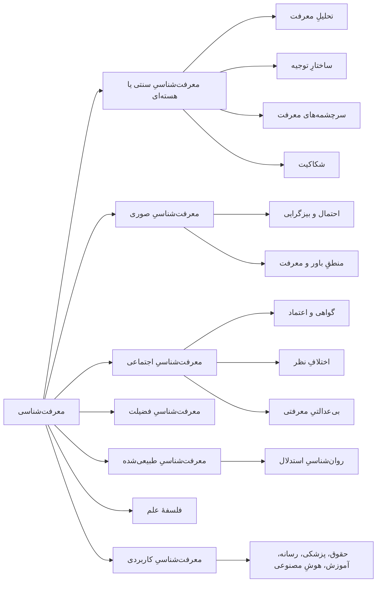

# فصل ۱. معرفت‌شناسی چیست؟

[فهرست](README.md) · [بعدی: تاریخِ نظریهٔ معرفت ←](02-history-of-epistemology.md)

**صوت:** [شنیدنِ این فصل](audio/01-what-is-epistemology.mp3) (۳۵ دقیقه، روایت به انگلیسی) · [باز کردن در پخش‌کننده](audio/index.html#01)

---

> «همهٔ آدم‌ها به‌طورِ طبیعی می‌خواهند بدانند.»
> — ارسطو، *متافیزیک*، کتابِ اول، فصلِ ۱

> «اصلِ اول این است که نباید خودت را فریب بدهی، و تو آسان‌ترین کسی هستی که می‌شود فریبش داد.»
> — ریچارد فاینمن، سخنرانیِ جشنِ فارغ‌التحصیلیِ کلتک، ۱۹۷۴

**معرفت‌شناسی** شاخه‌ای از فلسفه است که معرفت، باور، شواهد، توجیه و عقلانیت را بررسی می‌کند. نامِ انگلیسی‌اش (epistemology) از دو کلمهٔ یونانی ساخته شده است: *اپیستمه* (معرفت، فهم) و *لوگوس* (شرح، بررسی). فیلسوفِ اسکاتلندی جیمز فردریک فریر (James Frederick Ferrier) این اصطلاح را در کتابِ *مبانیِ متافیزیک* (۱۸۵۴) وارد زبانِ انگلیسی کرد. فیلسوفانِ آلمانی به این حوزه *Erkenntnistheorie* می‌گویند، یعنی «نظریهٔ شناخت».

بیشترِ رشته‌ها بخشی از جهان را بررسی می‌کنند. معرفت‌شناسی بررسی می‌کند که ما اصلاً چطور *چیزی* دربارهٔ جهان می‌دانیم. برای همین زیرِ همهٔ رشته‌های دیگر قرار می‌گیرد. فیزیک‌دان‌ها، تاریخ‌دان‌ها، قاضی‌ها، پزشک‌ها و روزنامه‌نگارها همه ادعا می‌کنند چیزهایی را می‌دانند. و هر کدام، معمولاً بی‌آنکه به زبان بیاورد، به فرض‌هایی تکیه دارد: اینکه چه چیزی شاهدِ خوب است و کی یک باور ارزشِ پذیرفتن دارد. معرفت‌شناسی این فرض‌ها را آشکار می‌کند و می‌آزماید.

این فصل واژه‌های پایه و نقشهٔ کلیِ این حوزه را می‌دهد. همهٔ فصل‌های بعدی روی آن ساخته می‌شوند.

---

## چرا معرفت‌شناسی برای تفکرِ نقادانه مهم است

تفکرِ نقادانه همان معرفت‌شناسیِ کاربردی است. وقتی می‌پرسید «این درست است؟»، «از کجا این را می‌دانند؟»، «چرا باید به این منبع اعتماد کنم؟» یا «چه چیزی نظرم را عوض می‌کند؟»، دارید پرسش‌های معرفت‌شناختی می‌پرسید. فقط آن‌ها را سریع و خودمانی می‌پرسید.

اختلافی را در نظر بگیرید که ممکن است سرِ هر سفرهٔ شامی پیش بیاید:

> **الف:** «این رژیمِ تازه جواب می‌دهد. پسرعمه‌ام دو ماهه ده کیلو کم کرد.»
> **ب:** «حکایتِ شخصی شاهد نیست.»
> **الف:** «یعنی می‌گویی پسرعمه‌ام دروغ می‌گوید؟»
> **ب:** «نه، ولی یک مورد چیزی را ثابت نمی‌کند.»
> **الف:** «خب، دانشمندها یک روز گفتند تخم‌مرغ بد است و بعد گفتند اشکالی ندارد؛ پس چرا به آن‌ها اعتماد کنم؟»

همین گفت‌وگوی کوتاه دست‌کم شش مسئلهٔ معرفت‌شناختی دارد:

1. **جایگاهِ گواهی.** «الف» چیزی را باور دارد چون پسرعمه‌اش گفته است. کی حرفِ دیگران دلیلِ خوبی است؟ نگاه کنید به [گواهی](07-sources-of-knowledge.md#testimony).
2. **تعمیم از یک مورد.** آیا یک نمونه می‌تواند از یک ادعای کلی پشتیبانی کند؟ نگاه کنید به [مسئلهٔ استقرای هیوم](09-induction-probability-bayes.md#humes-problem-of-induction) و [تعمیمِ شتاب‌زده](15-fallacies.md#hasty-generalization).
3. **علت‌یابی.** حتی اگر پسرعمه وزن کم کرده باشد، آیا *رژیم* علتش بوده است؟ نگاه کنید به [علیت و استنتاجِ علّی](10-science-and-evidence.md#causation-and-causal-inference).
4. **بد فهمیدنِ حرفِ «ب».** «ب» گفت «یک مورد چیزی را ثابت نمی‌کند»؛ «الف» شنید «پسرعمه‌ات دروغ می‌گوید». این [پهلوانِ پنبه](15-fallacies.md#straw-man) است، یا دست‌کم کوتاهی در [اصلِ حسنِ ظن](03-logic-and-arguments.md#the-principle-of-charity).
5. **اعتماد به کارشناسان.** آیا اینکه دانشمندان نظرشان را اصلاح کرده‌اند یعنی قابل‌اعتماد نیستند؟ یا اصلاحِ نظر نشانهٔ این است که روشی که خودش را اصلاح می‌کند دارد کار می‌کند؟ نگاه کنید به [کارشناسان و نوآموزان](12-social-epistemology.md#experts-and-novices) و [خطاپذیرگرایی](06-justification.md#fallibilism).
6. **معیارهای شاهد.** خودِ جملهٔ «حکایتِ شخصی شاهد نیست» بیش از حد تند است. حکایتِ شخصی شاهدِ ضعیفی است، نه شاهدِ صفر. نگاه کنید به [قضیهٔ بیز](09-induction-probability-bayes.md#bayes-theorem).

کسی که معرفت‌شناسی خوانده با بلد بودنِ اصطلاح‌های زیرکانه در چنین بحث‌هایی «برنده» نمی‌شود. او *ساختارِ* اختلاف را می‌بیند: چه چیزی ادعا می‌شود، چه چیزی از آن پشتیبانی می‌کند، دو طرف واقعاً کجا اختلاف دارند، و چه چیزی مسئله را حل می‌کند. این راهنما برای پرورشِ همین مهارت نوشته شده است.

سه دلیلِ دیگر هم برای یاد گرفتنِ این حوزه هست.

- **دفاع از خود.** کسانی که پول، رأی یا وفاداریِ شما را می‌خواهند از ضعف‌های قابلِ پیش‌بینیِ استدلالِ انسان استفاده می‌کنند. شناختنِ این ضعف‌ها ([فصل ۱۴](14-psychology-of-reasoning.md)) و ترفندهای رایج ([فصل ۱۵](15-fallacies.md)) از شما محافظت می‌کند.
- **تصمیم‌های جمعیِ بهتر.** دموکراسی‌ها، دادگاه‌ها، جامعه‌های علمی و شرکت‌ها نظام‌هایی برای ساختنِ جمعیِ معرفت‌اند. فهمیدنِ [معرفت‌شناسیِ اجتماعی](12-social-epistemology.md) نشان می‌دهد این نظام‌ها وقتی کار می‌کنند چرا کار می‌کنند، و وقتی شکست می‌خورند چرا.
- **صداقتِ فکری.** معرفت‌شناسی یادتان می‌دهد باورها را با اندازهٔ درستی از اطمینان نگه دارید، نه بیشتر و نه کمتر. این هم دستاوردی اخلاقی است و هم فکری (نگاه کنید به [فصل ۱۳](13-virtues-and-ethics-of-belief.md)).

---

## پرسش‌های اصلی

معرفت‌شناسی دورِ چند پرسشِ بزرگ شکل گرفته است. تقریباً هر موضوعی در این راهنما تلاشی برای جواب دادن به یکی از آن‌هاست.

| پرسش | نامِ مسئله | کجا بخوانید |
|---|---|---|
| معرفت *چیست*؟ چه فرقی با باورِ درست، حدسِ خوش‌شانس یا نظرِ شخصی دارد؟ | تحلیلِ معرفت | [فصل ۵](05-the-nature-of-knowledge.md) |
| چه چیزی یک باور را *موجه* یا *معقول* می‌کند؟ | نظریهٔ توجیه | [فصل ۶](06-justification.md) |
| معرفت از کجا می‌آید؟ ادراکِ حسی، حافظه، عقل، گواهی؟ | سرچشمه‌های معرفت | [فصل ۷](07-sources-of-knowledge.md) |
| آیا اصلاً می‌توانیم چیزی بدانیم؟ دانشِ ما تا کجا می‌رسد؟ | مسئلهٔ شکاکیت | [فصل ۸](08-skepticism.md) |
| تجربهٔ گذشته چطور می‌تواند باورهایی دربارهٔ آینده را موجه کند؟ | مسئلهٔ استقرا | [فصل ۹](09-induction-probability-bayes.md) |
| وقتی مطمئن نیستیم، چطور باید استدلال کنیم؟ | احتمال و معرفت‌شناسیِ بیزی | [فصل ۹](09-induction-probability-bayes.md) |
| چه چیزی علم را راهی قابل‌اعتماد برای دانستن می‌کند؟ | فلسفهٔ علم | [فصل ۱۰](10-science-and-evidence.md) |
| حقیقت چیست؟ آیا عینی است؟ | نظریه‌های حقیقت؛ نسبی‌گرایی | [فصل ۱۱](11-truth-and-relativism.md) |
| کی باید به دیگران اعتماد کنیم؟ وقتی کارشناسان یا همتایان با هم اختلاف دارند چه کنیم؟ | معرفت‌شناسیِ اجتماعی | [فصل ۱۲](12-social-epistemology.md) |
| کدام ویژگی‌های شخصیتی کسی را متفکرِ خوبی می‌کند؟ آیا دربارهٔ آنچه باور می‌کنیم وظیفه‌ای داریم؟ | معرفت‌شناسیِ فضیلت؛ اخلاقِ باور | [فصل ۱۳](13-virtues-and-ethics-of-belief.md) |
| ذهنِ واقعیِ آدم‌ها چطور استدلال می‌کند و کجا اشتباه می‌کند؟ | معرفت‌شناسیِ طبیعی‌شده؛ روان‌شناسیِ استدلال | [فصل ۱۴](14-psychology-of-reasoning.md) |

دو پرسش پیش از همهٔ پرسش‌های دیگر می‌آیند، و فیلسوفان ۲۵۰۰ سال است دربارهٔ ترتیبشان بحث می‌کنند:

- **چه چیزی را می‌دانیم؟** (*گسترهٔ* معرفت)
- **چطور می‌دانیم؟** (*معیارهای* معرفت)

برای اینکه بگوییم چه چیزی را می‌دانیم، ظاهراً به معیاری برای شناختنِ معرفت نیاز داریم. برای اینکه یک معیار را بیازماییم، ظاهراً به چند نمونهٔ روشن از معرفت نیاز داریم تا معیار را با آن‌ها بسنجیم. این دور را [مسئلهٔ معیار](06-justification.md#the-problem-of-the-criterion) می‌نامند. نمونهٔ خوبی است از اینکه معرفت‌شناسی چطور کار می‌کند: یک پرسشِ ساده خیلی زود به یک معمای عمیق می‌رسد.

---

## سه گونه دانستن

انگلیسی برای چیزهای خیلی متفاوت فقط یک کلمه دارد: «know». بسیاری از زبان‌های دیگر این معناها را از هم جدا می‌کنند: فرانسوی *savoir* و *connaître* دارد، آلمانی *wissen* و *kennen*، و فارسی «دانستن» و «شناختن».

خودِ این مفهوم ظاهراً در همهٔ زبان‌ها هست. «know» از ده فعلِ پرکاربردِ انگلیسی است. زبان‌شناسانی که در طرحِ «فرازبانِ معناییِ طبیعی» کار می‌کنند (آنا ویرژبیتسکا، کلیف گادارد و همکارانشان) «دانستن» و «فکر کردن» را جزوِ مجموعهٔ کوچکی از معناها می‌دانند، کمتر از صد معنا، که ظاهراً در هر زبانِ انسانیِ بررسی‌شده معادلِ دقیقی دارند. خیلی از کلمه‌هایی که انتظار دارید همگانی باشند نیستند: بعضی زبان‌ها برای «رفتن» یا «خوردن» یک فعلِ واحد ندارند. جنیفر نیگل (*معرفت: درآمدی بسیار کوتاه*، ۲۰۱۴، فصلِ ۱) این را نشانه‌ای می‌داند که فرقِ میانِ دانستن و فقط فکر کردن در زندگیِ انسان بنیادی است، نه اختراعِ فیلسوفان.

معرفت با **واقعیت‌ها** هم فرق دارد. مثالِ نیگل: جعبه‌ای دربسته را که سکه‌ای در آن است تکان بدهید و زمین بگذارید. سکه یا شیر آمده یا خط؛ این یک واقعیت است. اما تا کسی نگاه نکند، هیچ‌کس نمی‌داند کدام. اگر روی یک کاغذ بنویسید «شیر» و روی کاغذِ دیگری «خط»، واقعیت را روی کاغذ آورده‌اید بی‌آنکه کسی آن را بداند. معرفت همیشه مالِ کسی است: یک فرد، یا گروهی که دانسته‌هایشان را روی هم می‌گذارند (یک ارکستر می‌داند چطور سمفونی‌ای را بنوازد که هیچ نوازنده‌ای به‌تنهایی نمی‌تواند).

### معرفتِ گزاره‌ای

**معرفتِ گزاره‌ای** یعنی *دانستنِ اینکه* چیزی این‌طور است.

- می‌دانم *که* پاریس پایتختِ فرانسه است.
- او می‌داند *که* قطار ساعتِ ۹:۱۵ حرکت می‌کند.
- می‌دانیم *که* سیگار سرطان‌زاست.

چیزی که اینجا دانسته می‌شود یک **گزاره** است: چیزی که می‌تواند درست یا نادرست باشد. معرفتِ گزاره‌ای موضوعِ اصلیِ معرفت‌شناسیِ سنتی است. هر جا این راهنما بی‌قید از «معرفت» حرف می‌زند، منظورش همین است. [فصل ۵](05-the-nature-of-knowledge.md) می‌پرسد این معرفت از چه ساخته شده است.

### دانستنِ چگونگی

**دانستنِ چگونگی** (معرفتِ عملی) یعنی دانستنِ اینکه کاری را *چطور* باید انجام داد.

- می‌دانم چطور دوچرخه‌سواری کنم.
- او می‌داند چطور بچه‌ای را که گریه می‌کند آرام کند.
- استادِ شطرنج می‌داند چطور از ساختارِ ضعیفِ پیاده‌ها استفاده کند.

گیلبرت رایل در مقالهٔ «دانستنِ چگونگی و دانستنِ اینکه» (۱۹۴۶) و کتابِ *مفهومِ ذهن* (۱۹۴۹) استدلال کرد که دانستنِ چگونگی نوعِ جداگانه‌ای از معرفت است و نمی‌شود آن را به دانستنِ واقعیت‌ها برگرداند. استدلالش این بود: اگر هر کارِ هوشمندانه لازمه‌اش این بود که اول گزاره‌ای را در نظر بگیریم، آن‌وقت در نظر گرفتنِ هوشمندانهٔ همان گزاره هم به گزاره‌ای دیگر نیاز داشت، و همین‌طور تا بی‌نهایت. پس بخشی از هوشمندی باید در خودِ انجام دادن باشد. این دیدگاه را **ضدعقل‌گرایی** (anti-intellectualism) می‌نامند.

جیسن استنلی و تیموتی ویلیامسون (مقالهٔ «دانستنِ چگونگی»، ۲۰۰۱) از **عقل‌گرایی** (intellectualism) دفاع کردند: دانستنِ اینکه چطور دوچرخه‌سواری کنیم یعنی دانستنِ اینکه، دربارهٔ روشی مثلِ *w*، *w* روشی است که شما با آن دوچرخه‌سواری می‌کنید، و این دانستن «به شکلی عملی» فهمیده می‌شود. بحث هنوز ادامه دارد. برای متفکرِ نقاد، نتیجهٔ عملی به اندازهٔ کافی روشن است: *خوب استدلال کردن تا اندازه‌ای یک مهارت است*. ممکن است همهٔ قاعده‌های منطق را بدانید و باز در یک بحثِ داغ بد استدلال کنید، همان‌طور که ممکن است فیزیکِ دوچرخه‌سواری را بدانید و باز زمین بخورید. مهارت تمرین می‌خواهد. برای همین این راهنما تمرین دارد. همچنین نگاه کنید به [برگشتی به دانستنِ چگونگی](05-the-nature-of-knowledge.md#knowledge-how-revisited).

### معرفت از راهِ آشنایی

**معرفت از راهِ آشنایی** یعنی آشناییِ مستقیم با یک چیز، یک شخص، یک مکان یا یک تجربه.

- تهران را می‌شناسم (آنجا زندگی کرده‌ام).
- مزهٔ زعفران را می‌شناسم.
- خواهرم را می‌شناسم.

برتراند راسل «معرفت از راهِ آشنایی» را از «معرفت از راهِ توصیف» جدا کرد (مقالهٔ «معرفت از راهِ آشنایی و معرفت از راهِ توصیف»، ۱۹۱۰–۱۹۱۱؛ *مسائلِ فلسفه*، ۱۹۱۲، فصلِ ۵). ممکن است واقعیت‌های زیادی *دربارهٔ* ناپلئون بدانید (معرفت از راهِ توصیف) بی‌آنکه هیچ‌وقت با او آشنا بوده باشید.

یک آزمایشِ فکریِ مشهور این تمایز را به چالش می‌کشد: **اتاقِ مری**ِ فرانک جکسون (مقالهٔ «کیفیت‌های پدیداریِ فرعی»، ۱۹۸۲). مری دانشمندِ درخشانی است که همهٔ واقعیت‌های فیزیکی دربارهٔ دیدنِ رنگ را می‌داند، اما تمامِ عمرش را در اتاقی سیاه‌وسفید گذرانده است. وقتی بیرون می‌آید و برای اولین بار گلِ سرخی می‌بیند، آیا چیزِ تازه‌ای یاد می‌گیرد؟ خیلی‌ها می‌گویند بله: یاد می‌گیرد دیدنِ سرخ *چه حسی دارد*. اگر این‌طور باشد، معرفتی هست که هیچ مقدار توصیفِ گزاره‌ای آن را نمی‌دهد. (جکسون از این مثال برای استدلال علیهِ فیزیکالیسم در فلسفهٔ ذهن استفاده کرد و بعدها نظرش را عوض کرد. این مثال هنوز تصویرِ روشنی از آشنایی است.)

سنتِ فلسفهٔ اسلامی تمایزی نزدیک به این دارد: **علمِ حضوری** در برابرِ **علمِ حصولی** (معرفتی که از راهِ تصویر و مفهوم به دست می‌آید). این تمایز در [فصل ۷](07-sources-of-knowledge.md#knowledge-by-presence) بررسی می‌شود.

> **پیوند.** گونه‌های دیگر: *دانستنِ اینکه چه کسی*، *دانستنِ اینکه کجا*، *دانستنِ اینکه آیا*، *دانستنِ اینکه چرا*. بسیاری از فیلسوفان این‌ها را گزاره‌ای می‌دانند: دانستنِ اینکه کلیدها کجاست یعنی دانستنِ اینکه، دربارهٔ جایی، کلیدها *آنجاست*. دانستنِ *چرایی* پیوندِ نزدیکی با [فهم](05-the-nature-of-knowledge.md#understanding-and-wisdom) دارد، که بعضی آن را از معرفت هم ارزشمندتر می‌دانند.

---

## باور، درجهٔ باور و پذیرش

معرفت با باور همراه است (نگاه کنید به [شرطِ باور](05-the-nature-of-knowledge.md#the-belief-condition))، پس باید روشن باشد که باور چیست.

**باور** یعنی *درست دانستنِ چیزی*. اگر باور دارید که باران می‌بارد، جهان را طوری در ذهن دارید که در آن باران می‌بارد: اگر صادقانه از شما بپرسند، آماده‌اید بگویید «باران می‌بارد»؛ اگر نخواهید خیس شوید، چتر برمی‌دارید؛ و اگر بیرون بروید و خیابان را خشک ببینید، تعجب می‌کنید. باورها را معمولاً **گرایشی** (dispositional) می‌دانند: شما همین حالا باور دارید که ۲ + ۲ = ۴، هرچند یک لحظه پیش به آن فکر نمی‌کردید.

در زبانِ روزمره، باور **همه یا هیچ** است: یا باور دارید، یا باور ندارید، یا داوری را کنار می‌گذارید. سه **نگرشِ باوریِ** پایه وجود دارد (doxastic، از کلمهٔ یونانیِ *دوکسا*، یعنی نظر):

1. **باور** به اینکه *p*
2. **ناباوری** به اینکه *p* (باور به خلافِ *p*)
3. **تعلیقِ داوری** دربارهٔ *p* (هیچ‌کدام)

اما باور **درجه** هم دارد. اطمینانتان به اینکه فردا خورشید طلوع می‌کند بیشتر از اطمینانتان به بردنِ تیمتان در بازیِ شنبه است. **درجهٔ باور** (credence، یا احتمالِ ذهنی) عددی میانِ ۰ و ۱ است که نشان می‌دهد چقدر مطمئنید. درجهٔ باورِ ۱ یعنی یقین به *p*، ۰ یعنی یقین به خلافِ *p*، و ۰٫۵ یعنی بیشترین نامطمئنی میانِ این دو. معرفت‌شناسیِ بیزی، که در [فصل ۹](09-induction-probability-bayes.md#bayesian-epistemology) می‌آید، تا حدِ زیادی نظریه‌ای است دربارهٔ اینکه درجه‌های باور چطور باید رفتار کنند.

اینکه باورِ کامل چه رابطه‌ای با درجهٔ باور دارد پرسشی زنده است. یک جوابِ طبیعی، **تزِ لاکی**، می‌گوید وقتی به *p* باور دارید که درجهٔ باورتان به *p* از یک آستانه (مثلاً ۰٫۹۵) بیشتر باشد. این جواب با [پارادوکسِ بخت‌آزمایی](09-induction-probability-bayes.md#full-belief-and-degrees-of-belief) به دردسر می‌افتد.

**پذیرش** با باور فرق دارد. *پذیرفتنِ* یک گزاره یعنی آن را در یک موقعیتِ مشخص مقدمهٔ استدلال و عمل قرار دادن، چه به آن باور داشته باشید چه نه (ال. جاناتان کوهن، *جستاری دربارهٔ باور و پذیرش*، ۱۹۹۲؛ مایکل براتمن، «استدلالِ عملی و پذیرش در یک زمینه»، ۱۹۹۲). چند مثال:

- وکیلِ مدافع برای ساختنِ دفاعیه بی‌گناهیِ موکلش را می‌پذیرد، در دل هرچه باور داشته باشد.
- مهندس برای یک محاسبهٔ سریع می‌پذیرد که مقاومتِ هوا ناچیز است.
- مذاکره‌کننده عددهای طرفِ مقابل را «برای پیش رفتنِ بحث» می‌پذیرد.

جدا کردنِ باور از پذیرش خیلی از بحث‌های آشفته را روشن می‌کند. «تو داری X را فرض می‌گیری!» وقتی طرفِ مقابل X را فقط برای پیش رفتنِ بحث *پذیرفته*، ردیه نیست. همین‌طور، یک **مدلِ** علمی معمولاً پذیرفته می‌شود، نه باور. همه می‌دانند قانونِ گازِ ایده‌آل در جزئیات درست نیست؛ آن را همچون تقریبی سودمند می‌پذیرند.

نگرش‌های دیگری که باور *نیستند*: **فرض کردن** («فرض کن ماه از پنیر ساخته شده باشد»)، **تخیل**، **امید**، **پیش‌فرض**، **ایمان** (طبقِ بعضی تحلیل‌ها) و **حدس**. این‌ها را از هم جدا نگه دارید. خیلی از استدلال‌های بد از «ممکن است که...» (یک فرض) به «محتمل است که...» (یک درجهٔ باور) و از آنجا به «این‌طور است که...» (یک باور) سُر می‌خورند.

---

## واژه‌های پایه

این اصطلاح‌ها در سراسرِ راهنما می‌آیند. تعریف‌های کامل در [واژه‌نامه](17-glossary.md) است.

**گزاره.** چیزی که یک جملهٔ خبری بیان می‌کند؛ از آن نوع چیزهایی که می‌توانند درست یا نادرست باشند. «برف سفید است» و «La neige est blanche» یک گزاره را بیان می‌کنند.

**حقیقت (صدق).** طبقِ رایج‌ترین دیدگاه، گزاره‌ای درست است که چیزها همان‌طور باشند که می‌گوید. ارسطو گفت: «اگر دربارهٔ چیزی که هست بگوییم نیست، یا دربارهٔ چیزی که نیست بگوییم هست، نادرست گفته‌ایم؛ و اگر دربارهٔ چیزی که هست بگوییم هست، و دربارهٔ چیزی که نیست بگوییم نیست، درست گفته‌ایم» (*متافیزیک*، کتابِ گاما، فصلِ ۷، 1011b25). نظریه‌ها در [فصل ۱۱](11-truth-and-relativism.md) با هم مقایسه می‌شوند.

**شواهد.** هر چیزی که گزاره‌ای را *برای شما* محتمل‌تر یا نامحتمل‌تر می‌کند، یا از آن پشتیبانی می‌کند. فیلسوفان دربارهٔ اینکه شاهد چیست اختلاف دارند: تجربه‌ها؟ حالت‌های ذهنی؟ واقعیت‌هایی که می‌دانیم؟ (شعارِ تیموتی ویلیامسون این است: «E = K»، یعنی شواهدِ شما همان معرفتِ شماست.) یک ایدهٔ کاربردیِ سودمند از نظریهٔ احتمال: *E شاهدی برای H است اگر E در صورتِ درست بودنِ H محتمل‌تر باشد تا در صورتِ نادرست بودنش.* نگاه کنید به [شواهد و تأیید](09-induction-probability-bayes.md#evidence-and-confirmation).

**توجیه.** ویژگی‌ای که یک باور دارد وقتی به دلیل‌های خوب داشته شود، یا به شکلِ درستی شکل گرفته باشد، طوری که داشتنش از نظرِ معرفتی به‌جا باشد. باورِ موجه هم می‌تواند نادرست باشد: کارآگاه می‌تواند در باور به اینکه پیشخدمت قاتل است موجه باشد و بعد معلوم شود اشتباه کرده است. نگاه کنید به [فصل ۶](06-justification.md).

**عقلانیت.** نزدیک به توجیه، اما گسترده‌تر. عقلانیتِ *معرفتی* یعنی باور داشتن به شکلی که با شواهد جور است؛ عقلانیتِ *عملی* یعنی خوب عمل کردن با توجه به هدف‌ها و باورهای خود. فیلسوفان *عقلانیت* به معنای انسجامِ درونی (باور نداشتن به تناقض‌ها، به‌روز کردنِ باورها با شواهد) را هم از *معقول بودن* به معنایی گسترده‌تر جدا می‌کنند.

**ضمانت (warrant).** اصطلاحِ آلوین پلنتینگا برای «هر چیزی که باورِ درست را به معرفت تبدیل می‌کند» (*ضمانت: بحثِ کنونی*، ۱۹۹۳). این اصطلاح جای خالی را پر می‌کند: گفتنِ اینکه چیزی *ضمانت دارد* هنوز نمی‌گوید ضمانت چیست.

**یقین.** دو معنا دارد. یقینِ *روانی* احساسِ اطمینانِ کامل است؛ آدم‌ها دربارهٔ خیلی چیزهای نادرست هم احساسِ یقین می‌کنند. یقینِ *معرفتی* بالاترین درجهٔ ممکنِ توجیه است، طوری که با شواهدی که دارید هیچ امکانی برای اشتباه نیست. باورهای کمی یقینِ معرفتی دارند.

**خطاپذیرگرایی.** این دیدگاه که می‌توانیم چیزی را بدانیم، حتی اگر توجیهمان درستی‌اش را تضمین نکند. تقریباً همهٔ معرفت‌شناسانِ امروز خطاپذیرگرا هستند. نگاه کنید به [خطاپذیرگرایی](06-justification.md#fallibilism).

**ابطال‌کننده.** ملاحظه‌ای که توجیهِ یک باور را از بین می‌برد یا ضعیف می‌کند. نگاه کنید به [ابطال‌کننده‌ها](06-justification.md#defeaters).

**دلیل‌ها.** فیلسوفان سه معنا را از هم جدا می‌کنند:
- **دلیلِ هنجاری** به سودِ باور کردن یا انجام دادنِ کاری *وزن دارد*. («ابرهای تیره دلیلی برای باور به باران است.»)
- **دلیلِ انگیزشی** ملاحظه‌ای است که کسی واقعاً به‌خاطرش باور می‌کند یا کاری انجام می‌دهد. («باور کرد باران می‌بارد چون ابرها را دید.»)
- **دلیلِ تبیینی** توضیح می‌دهد چرا چیزی رخ داد، چه کسی استدلالی کرده باشد چه نه. («پل به‌خاطرِ خستگیِ فلز فرو ریخت.»)

ممکن است دلیلِ هنجاریِ خوبی در دسترس باشد و با این حال کسی به‌خاطرِ دلیلِ انگیزشیِ بدی باور داشته باشد. این تفاوت زیربنای تمایزِ میانِ [توجیهِ گزاره‌ای و توجیهِ باوری](06-justification.md#what-justification-is) است.

---

## سه تمایزِ بزرگ

سه تمایز انواعِ حقیقت و معرفت را از هم جدا می‌کنند. آن‌ها را آسان با هم قاطی می‌کنیم، و بعضی از مهم‌ترین استدلال‌های فلسفه به جدا نگه داشتنشان بستگی دارد.

### پیشین و پسین

این تمایز دربارهٔ این است که **گزاره چطور دانسته می‌شود**.

- گزاره‌ای **پیشین** (a priori) دانسته می‌شود اگر بشود آن را بی‌نیاز از تجربه دانست، جز تجربه‌ای که برای یاد گرفتنِ مفهوم‌ها لازم است. مثال‌ها: «همهٔ مردهای مجرد ازدواج نکرده‌اند»، «۷ + ۵ = ۱۲»، «اگر الف از ب بلندتر باشد و ب از ج، الف از ج بلندتر است.»
- گزاره‌ای **پسین** (a posteriori، یا تجربی) دانسته می‌شود اگر دانستنش به تجربهٔ جهان نیاز داشته باشد. مثال‌ها: «آب در سطحِ دریا در ۱۰۰ درجهٔ سانتی‌گراد می‌جوشد»، «کانبرا پایتختِ استرالیاست»، «بیش از یک میلیون گونه حشره وجود دارد.»

«بی‌نیاز از تجربه» یعنی این نیست که بی هیچ تجربه‌ای می‌توانستید آن را بدانید. برای یاد گرفتنِ معنای «مجرد» به تجربه نیاز داشتید. نکته این است که وقتی گزاره را فهمیدید، *دیگر به هیچ مشاهدهٔ دیگری نیاز ندارید* تا بدانید درست است.

### تحلیلی و ترکیبی

این تمایز دربارهٔ این است که **چه چیزی گزاره را درست می‌کند**، یا به زبانِ کانت، دربارهٔ رابطهٔ موضوع و محمول.

- گزاره‌ای **تحلیلی** است اگر فقط به‌خاطرِ معنا درست باشد، یا (به تعبیرِ کانت) اگر محمول «درونِ» مفهومِ موضوع باشد. «همهٔ مردهای مجرد ازدواج نکرده‌اند»: مفهومِ *مجرد* خودش *ازدواج‌نکرده* را در خود دارد.
- گزاره‌ای **ترکیبی** است اگر درستی‌اش به وضعِ جهان بستگی داشته باشد، نه فقط به معناها. «همهٔ مردهای مجرد شلخته‌اند» (نادرست، اما ترکیبی) یا «گربه روی پادری است.»

کانت این تمایز را در *نقدِ عقلِ محض* (۱۷۸۱) مطرح کرد. مقالهٔ مشهورِ دبلیو. وی. او. کواین، «دو جزمِ تجربه‌گرایی» (۱۹۵۱)، به آن حمله کرد و استدلال کرد که هیچ‌کس توضیحی غیرِدوری از «درست به‌خاطرِ معنا» نداده است. نگاه کنید به [کواین و معرفت‌شناسیِ طبیعی‌شده](02-history-of-epistemology.md#quine-and-naturalized-epistemology).

### ضروری و امکانی

این تمایز دربارهٔ **وضعِ وجهیِ** گزاره است: اینکه آیا می‌توانست جورِ دیگری باشد.

- حقیقتِ **ضروری** نمی‌توانست نادرست باشد: در هر جهانِ ممکنی درست است. «۲ + ۲ = ۴»، «هیچ چیزی نمی‌تواند هم‌زمان سرتاسر سرخ و سرتاسر سبز باشد.»
- حقیقتِ **امکانی** درست است، اما می‌توانست نادرست باشد. «ناپلئون در واترلو شکست خورد»، «یک لپ‌تاپ روی میزِ من است.»

### کنار هم گذاشتنِ سه تمایز

فیلسوفان مدت‌ها فرض می‌کردند این سه تمایز دقیقاً روی هم می‌افتند: *پیشین = تحلیلی = ضروری*، و *پسین = ترکیبی = امکانی*. دو فیلسوف نشان دادند که این‌طور نیست.

**کانت** استدلال کرد که حقیقت‌های **ترکیبیِ پیشین** وجود دارند: گزاره‌هایی که چیزِ مهمی دربارهٔ جهان می‌گویند و با این حال بی‌نیاز از تجربه دانستنی‌اند. مثال‌هایش حقیقت‌های حساب و هندسه بودند («۷ + ۵ = ۱۲»؛ «کوتاه‌ترین فاصلهٔ میانِ دو نقطه خطِ راست است») و اصل‌هایی بنیادی مثلِ «هر رویدادی علتی دارد». توضیحِ اینکه معرفتِ ترکیبیِ پیشین چطور ممکن است طرحِ اصلیِ *نقدِ عقلِ محض* بود.

**سال کریپکی** در *نام‌گذاری و ضرورت* (درس‌گفتارهای ۱۹۷۰، کتابِ ۱۹۸۰) از این دو دفاع کرد:

- حقیقت‌های **ضروریِ پسین**. «آب H₂O است» و «هسپروس همان فسفروس است» (ستارهٔ شامگاهی همان ستارهٔ صبحگاهی است؛ هر دو زهره‌اند). اگر آب *همان* H₂O است، نمی‌توانست چیزِ دیگری باشد، پس این حقیقت ضروری است. اما آن را با شیمی کشف کردیم، نه با فکر کردن، پس پسین دانسته می‌شود.
- حقیقت‌های **امکانیِ پیشین**. اگر معنای «یک متر» را این‌طور تعیین کنید: «طولِ میلهٔ S در زمانِ t₀»، به‌طورِ پیشین می‌دانید که میلهٔ S در t₀ یک متر است. اما این امکانی است، چون میله می‌توانست بلندتر باشد.

| | پیشین | پسین |
|---|---|---|
| **ضروری** | «۲ + ۲ = ۴»؛ «همهٔ مردهای مجرد ازدواج نکرده‌اند» | «آب H₂O است» (کریپکی) |
| **امکانی** | «میلهٔ S در t₀ یک متر است» (کریپکی؛ محلِ بحث) | «پاریس پایتختِ فرانسه است» |

> **چرا این برای تفکرِ نقادانه مهم است.** خیلی از استدلال‌ها بی‌سروصدا به یکی از این تمایزها تکیه دارند. «این را که نمی‌شود پشتِ میز ثابت کرد!» ادعا می‌کند که حکمی پسین است. «این طبقِ تعریف درست است!» ادعا می‌کند که حکمی تحلیلی است، و اغلب یک [تعریفِ اقناعی](04-language-concepts-and-definitions.md#kinds-of-definition) را پنهان می‌کند. «اوضاع همین‌طوری پیش آمد» ادعای امکانی بودن است. وقتی چنین حرکتی می‌شنوید، بپرسید کدام تمایز در کار است و آیا دسته‌بندی درست است.

---

## دلیل‌های معرفتی در برابرِ دلیل‌های عملی

فرض کنید میلیاردری به شما یک میلیون دلار پیشنهاد کند تا باور کنید ماه از پنیر ساخته شده است. شما دلیلِ *عملیِ* عالی‌ای برای این باور دارید. اما هیچ دلیلِ *معرفتی‌ای* ندارید که فکر کنید درست است، و در واقع احتمالاً *نمی‌توانید* به اراده آن را باور کنید. (امتحان کنید.)

این آزمایشِ فکری ایده‌ای محوری را نشان می‌دهد:

- **دلیل‌های معرفتی** به این مربوط‌اند که آیا یک گزاره *درست* است: شواهد، استدلال‌ها، گواهیِ قابل‌اعتماد.
- **دلیل‌های عملی** (یا *پراگماتیک*) به این مربوط‌اند که آیا داشتنِ یک باور *خوب* یا *سودمند* است: آرامش، پاداش، تعلقِ اجتماعی، انگیزه.

فیلسوفان دیده‌اند که وقتی دربارهٔ *اینکه آیا p را باور کنیم* فکر می‌کنیم، این پرسش فوراً به پرسشِ *اینکه آیا p درست است* تبدیل می‌شود. نیشی شاه این را **شفافیتِ** باور نامید («حقیقت چطور بر باور حکم می‌راند»، ۲۰۰۳). این ویژگی نشان می‌دهد که باور ذاتاً رو به حقیقت دارد، به شکلی که میل و امید ندارند.

دلیل‌های عملی برای باور هنوز در بحث‌ها مهم‌اند:

- **شرط‌بندیِ پاسکال** (بلز پاسکال، *اندیشه‌ها*، منتشرشده در ۱۶۷۰) مشهورترین استدلالِ عملی برای باور است: اگر خدا وجود داشته باشد، باور پاداشی بی‌پایان دارد؛ اگر نه، چیزِ زیادی از دست نمی‌دهید. پس، به استدلالِ پاسکال، باید سعی کنید باور کنید. نگاه کنید به [ایمان، عقل و معرفت‌شناسیِ دینی](13-virtues-and-ethics-of-belief.md#faith-reason-and-religious-epistemology).
- **«ارادهٔ باور کردن»ِ ویلیام جیمز** (۱۸۹۶) استدلال کرد که وقتی انتخابی «زنده، ناگزیر و سرنوشت‌ساز» است و شواهد نمی‌تواند آن را حل کند، «سرشتِ عاطفیِ» ما حق دارد تصمیم بگیرد. نگاه کنید به [اخلاقِ باور](13-virtues-and-ethics-of-belief.md#the-ethics-of-belief-clifford-and-james).
- **استدلالِ انگیزه‌مند** پدیده‌ای روانی است که در آن دلیل‌های عملی، بی‌آنکه متوجه شویم، وارد باور می‌شوند. چیزی را باور می‌کنیم که دوست داریم درست باشد، یا چیزی را که گروهمان باور دارد. نگاه کنید به [استدلالِ انگیزه‌مند](14-psychology-of-reasoning.md#motivated-reasoning).

> **نکتهٔ عملی.** در یک بحثِ داغ از خودتان بپرسید: *«اگر این باور به ضررِ من یا طرفِ من بود، باز هم باورش داشتم؟»* اگر نه، شاید باورتان بیشتر بر دلیل‌های عملی تکیه دارد تا بر دلیل‌های معرفتی.

---

## معرفت‌شناسی هنجاری است

بعضی رشته‌ها **توصیفی**‌اند: توصیف می‌کنند چیزها چطورند. روان‌شناسی توصیف می‌کند که آدم‌ها واقعاً چطور استدلال می‌کنند. معرفت‌شناسی بیشتر **هنجاری** است: به این می‌پردازد که آدم‌ها *چطور باید* استدلال کنند، *حق دارند* چه چیزی را باور کنند، و چه چیزی شاهدِ *خوب* است.

اخلاق می‌پرسد «چه باید بکنم؟» معرفت‌شناسی می‌پرسد «چه باید باور کنم؟» مفهوم‌هایی موازی در هر دو طرف دیده می‌شوند:

| اخلاق | معرفت‌شناسی |
|---|---|
| کارِ درست / نادرست | باورِ موجه / ناموجه |
| وظیفهٔ اخلاقی | وظیفهٔ معرفتی (مثلاً در نظر گرفتنِ شواهد) |
| فضیلتِ اخلاقی (شجاعت، صداقت) | فضیلتِ فکری (گشوده‌ذهنی، صداقتِ فکری) |
| مسئولیت و سرزنشِ اخلاقی | مسئولیت و سرزنشِ معرفتی |
| پیامدگرایی: بیشترین پیامدِ خوب | حقیقت‌محوری (veritism): بیشترین باورِ درست، کمترین باورِ نادرست |
| وظیفه‌گرایی: پیروی از وظیفه‌ها | توجیهِ وظیفه‌محور: انجام دادنِ وظیفه‌های معرفتیِ خود |

این شباهت کامل نیست. ما معمولاً نمی‌توانیم باورهایمان را مستقیم انتخاب کنیم، و این [مسئلهٔ اراده‌گراییِ باوری](06-justification.md#deontology-and-doxastic-voluntarism) را پیش می‌کشد. اما روشنگر است. [فصل ۱۳](13-virtues-and-ethics-of-belief.md) آن را پیش می‌برد.

*هدفِ* باور داشتن چیست؟ محبوب‌ترین جواب **حقیقت** است: می‌خواهیم چیزهای درست را باور کنیم و از باور به چیزهای نادرست دوری کنیم. ویلیام جیمز دید که این‌ها دو فرمانِ جدا هستند، «حقیقت را باور کن!» و «از خطا دوری کن!»، و به دو سوی مختلف می‌کشند. اگر فقط به باور داشتنِ چیزهای درست اهمیت می‌دادید، همه‌چیز را باور می‌کردید. اگر فقط به دوری از خطا اهمیت می‌دادید، هیچ‌چیز را باور نمی‌کردید. هر معیارِ معرفتی راهی برای برقرار کردنِ تعادل میانِ این دو است. همین تعادل در آمار به شکلِ توازن میانِ مثبت‌های کاذب و منفی‌های کاذب دیده می‌شود، و در حقوق به شکلِ معیارِ اثبات («فراتر از تردیدِ معقول» دوری از محکوم کردنِ بی‌گناه را مهم‌تر از تضمینِ محکوم کردنِ گناهکار می‌داند).

هدف‌های معرفتیِ دیگری که پیشنهاد شده‌اند: **معرفت**، **فهم**، **خرد**، و **حقیقتِ مهم** (نه هر حقیقتی؛ دانستنِ تعدادِ دانه‌های شنِ یک ساحل ارزشی ندارد). این‌ها در [ارزشِ معرفت](05-the-nature-of-knowledge.md#the-value-of-knowledge) بررسی می‌شوند.

---

## نقشهٔ این حوزه

معرفت‌شناسیِ امروز شاخه‌های زیادی دارد. بهتر است آن‌ها را زاویه‌های مختلفی به یک موضوع بدانیم.

- **معرفت‌شناسیِ سنتی (هسته‌ای).** تحلیلِ معرفت، توجیه، سرچشمه‌ها، شکاکیت. [فصل‌های ۵ تا ۸](05-the-nature-of-knowledge.md).
- **معرفت‌شناسیِ صوری.** با ریاضیات (نظریهٔ احتمال، منطق، نظریهٔ تصمیم) باور و استدلال را مدل می‌کند. [فصل ۹](09-induction-probability-bayes.md).
- **فلسفهٔ علم.** معرفتِ علمی چطور ساخته و موجه می‌شود. [فصل ۱۰](10-science-and-evidence.md).
- **معرفت‌شناسیِ اجتماعی.** معرفت آن‌طور که جامعه‌ها آن را می‌سازند و به اشتراک می‌گذارند؛ گواهی، تخصص، اختلافِ نظر، نهادها. [فصل ۱۲](12-social-epistemology.md).
- **معرفت‌شناسیِ فضیلت.** روی شخصیتِ فکریِ داننده تمرکز دارد. [فصل ۱۳](13-virtues-and-ethics-of-belief.md).
- **معرفت‌شناسیِ طبیعی‌شده.** معرفت‌شناسی را پیوسته با علمِ تجربی، به‌ویژه روان‌شناسی، می‌بیند. [فصل ۱۴](14-psychology-of-reasoning.md) و [کواین](02-history-of-epistemology.md#quine-and-naturalized-epistemology).
- **معرفت‌شناسیِ فمینیستی و نظریهٔ موضع.** جایگاهِ اجتماعی چطور روی معرفت اثر می‌گذارد. [معرفت‌شناسیِ موضع و فمینیستی](12-social-epistemology.md#standpoint-and-feminist-epistemology).
- **معرفت‌شناسیِ اخلاق، دین و ریاضیات.** چطور می‌توانیم حقیقت‌های اخلاقی، ادعاهای دینی و واقعیت‌های ریاضی را بدانیم. [عقل و معرفتِ پیشین](07-sources-of-knowledge.md#reason-and-the-a-priori)، [ایمان، عقل و معرفت‌شناسیِ دینی](13-virtues-and-ethics-of-belief.md#faith-reason-and-religious-epistemology).
- **معرفت‌شناسیِ کاربردی.** معرفت‌شناسی در حقوق (معیارهای اثبات، گواهیِ شاهدِ عینی)، پزشکی (پزشکیِ مبتنی بر شواهد)، روزنامه‌نگاری، آموزش و هوشِ مصنوعی.

---

## تکه‌ها چطور به هم وصل می‌شوند: یک خبر، دوازده پرسش

برای اینکه ببینید همه‌چیز چطور با هم جور می‌شود، تصور کنید این تیتر را می‌خوانید:

> **«پژوهشِ تازه: قهوه‌نوشان عمرِ طولانی‌تری دارند.»**

چشمی که در معرفت‌شناسی تمرین کرده می‌پرسد:

1. **دقیقاً چه چیزی ادعا شده؟** «عمرِ طولانی‌تر» برای چه کسانی؟ چقدر؟ آیا ادعا علّی است («قهوه عمرتان را طولانی می‌کند») یا فقط همبستگی («قهوه‌نوشان اتفاقاً عمرِ طولانی‌تری دارند»)؟ ← [فصل ۴](04-language-concepts-and-definitions.md)، [فصل ۱۰](10-science-and-evidence.md#correlation-and-causation)
2. **چه کسی به من می‌گوید؟** روزنامه‌نگاری که خلاصهٔ یک خبرنامه را می‌نویسد که خودش خلاصهٔ یک مقاله است. هر حلقه در زنجیرهٔ [گواهی](07-sources-of-knowledge.md#testimony) می‌تواند چیزی را تحریف کند.
3. **پژوهش چطور انجام شده؟** پژوهشی مشاهده‌ای روی ۵۰۰٬۰۰۰ نفر یا کارآزمایی‌ای تصادفی روی ۵۰ نفر؟ ← [کارآزمایی‌های تصادفیِ کنترل‌شده و سلسله‌مراتبِ شواهد](10-science-and-evidence.md#randomized-controlled-trials-and-the-hierarchy-of-evidence)
4. **ممکن است چیزِ دیگری این الگو را توضیح دهد؟** شاید آدم‌های سالم‌تر و پولدارتر قهوهٔ بیشتری می‌نوشند. ← [مخدوش‌گری](10-science-and-evidence.md#correlation-and-causation)
5. **اثر چقدر بزرگ است؟** کاهشِ یک‌درصدیِ خطرِ نسبی با کاهشِ پنجاه‌درصدی خیلی فرق دارد. ← [آمار و معناداری](09-induction-probability-bayes.md#statistics-and-significance)
6. **با شواهدِ دیگر جور است؟** یک پژوهش در برابرِ صد پژوهشِ مخالف باید شما را فقط کمی جابه‌جا کند. ← [قضیهٔ بیز](09-induction-probability-bayes.md#bayes-theorem)
7. **کارشناسان چه می‌گویند؟** ← [کارشناسان و نوآموزان](12-social-epistemology.md#experts-and-novices)
8. **تکرار شده؟** ← [بحرانِ تکرارپذیری](10-science-and-evidence.md#the-replication-crisis)
9. **آیا دلم می‌خواهد درست باشد؟** (من عاشقِ قهوه‌ام.) ← [استدلالِ انگیزه‌مند](14-psychology-of-reasoning.md#motivated-reasoning)
10. **آیا فقط نتیجه‌هایی را می‌بینم که تیتر می‌شوند؟** ← [سوگیریِ بازماندگی](15-fallacies.md#survivorship-bias)، [سوگیریِ انتشار](10-science-and-evidence.md#the-replication-crisis)
11. **چقدر باید مطمئن باشم، و چه چیزی نظرم را عوض می‌کند؟** ← [کالیبراسیون](09-induction-probability-bayes.md#calibration-and-scoring-rules)
12. **آیا برای کاری که می‌کنم مهم است؟** وقتی پیامدها مهم‌اند، شاید شواهدِ بیشتری لازم باشد. ← [نفوذِ ملاحظه‌های عملی](13-virtues-and-ethics-of-belief.md#pragmatic-encroachment)

تحلیلِ کاملِ چنین تیتری در [مطالعهٔ موردیِ ۳](16-critical-thinking-toolkit.md#case-study-3-a-statistical-headline) آمده است.

---

## فهمِ خود را بسنجید

**۱.** هر کدام را در یکی از سه دسته بگذارید: معرفتِ گزاره‌ای، دانستنِ چگونگی یا معرفت از راهِ آشنایی. (الف) علی بوی باران روی خاکِ خشک را می‌شناسد. (ب) علی می‌داند که بوی خاکِ باران‌خورده تا اندازه‌ای از روغن‌های گیاهی و ژئوسمین است. (ج) علی می‌داند چطور از رنگِ آسمان باران را پیش‌بینی کند.

پاسخ

(الف) آشنایی. (ب) گزاره‌ای. (ج) دانستنِ چگونگی. طبقِ دیدگاهِ عقل‌گرا، شاید (ج) به معرفتِ گزاره‌ای دربارهٔ روشی برای پیش‌بینیِ باران برگردد، و می‌شود استدلال کرد که (الف) هم معرفتِ گزاره‌ای را در خود دارد. این دسته‌ها نقطهٔ شروع‌اند، نه نظریه‌ای نهایی.

**۲.** «همهٔ روباه‌های ماده روباه‌اند و ماده‌اند» را بر پایهٔ سه تمایز دسته‌بندی کنید.

پاسخ

پیشین (با فهمیدنِ کلمه‌ها دانستنی است)، تحلیلی (به‌خاطرِ معنا درست است)، ضروری (نمی‌تواند نادرست باشد). این نمونهٔ معمولی است که در آن هر سه روی هم می‌افتند.

**۳.** چرا «آب H₂O است» از نظرِ فلسفی جالب است؟

پاسخ

کریپکی استدلال کرد که این گزاره *ضروری* است (در هر جهانِ ممکنی آب H₂O است، چون آب *همین* است) اما فقط به‌طورِ *پسین* دانسته می‌شود (از راهِ شیمی). این فرضِ قدیمی را می‌شکند که همهٔ حقیقت‌های ضروری به‌طورِ پیشین دانسته می‌شوند.

**۴.** دوستی می‌گوید: «به طلسمِ شانس باور دارم چون پیش از امتحان آرامم می‌کند.» این چه نوع دلیلی است، و اشکالش چیست؟

پاسخ

دلیلی عملی است: به فایدهٔ داشتنِ باور مربوط است، نه به شاهدی بر اینکه طلسم شانس می‌آورد. دوستتان شاید «باور به اینکه طلسم کار می‌کند» را با «همراه داشتنِ طلسم آرامم می‌کند» قاطی کرده است. اثرِ آرام‌بخش می‌تواند واقعی باشد (باور ممکن است مثلِ دارونما عمل کند)، حتی اگر طلسم هیچ اثرِ علّی‌ای روی نتیجهٔ امتحان نداشته باشد. این مثالِ خوبی است از اینکه چرا فرقِ دلیلِ عملی و معرفتی مهم است.

**۵.** فرقِ باور داشتن به یک گزاره و پذیرفتنِ آن چیست؟ مثالی از علم بزنید.

پاسخ

باور داشتن به *p* یعنی *p* را درست دانستن. پذیرفتنِ *p* یعنی آن را در یک موقعیتِ مشخص مقدمهٔ استدلال یا عمل قرار دادن، چه به آن باور داشته باشید چه نه. فیزیک‌دان وقتی مدارِ یک سیاره را حساب می‌کند می‌پذیرد که سیاره یک جرمِ نقطه‌ای است، با اینکه می‌داند سیاره‌ها جرمِ نقطه‌ای نیستند.

**۶.** دو فرمانِ ویلیام جیمز را توضیح دهید و بگویید چرا با هم تعارض دارند.

پاسخ

«حقیقت را باور کن!» و «از خطا دوری کن!». اگر فقط اولی را دنبال کنید، باید تا جای ممکن باور کنید تا هیچ حقیقتی از دستتان نرود، و در این میان خیلی چیزهای نادرست را هم باور خواهید کرد. اگر فقط دومی را دنبال کنید، باید هیچ‌چیز را باور نکنید تا از هر خطایی دور بمانید، و در این میان همهٔ حقیقت‌ها را هم از دست خواهید داد. باورِ عقلانی یعنی تعادلی میانِ این دو. این تعادل می‌تواند به‌حق با موقعیت تغییر کند، مثلاً با هزینهٔ خطاها.

**۷.** در گفت‌وگوی سرِ سفرهٔ اولِ این فصل، «ب» می‌گوید «حکایتِ شخصی شاهد نیست». آیا «ب» درست می‌گوید؟

پاسخ

نه کاملاً. یک حکایتِ شخصی به معنای احتمالاتی شاهد است، چون اگر رژیم کار کند، وزن کم کردنِ پسرعمه کمی محتمل‌تر است تا اگر کار نکند. اما شاهدی *خیلی ضعیف* است. یک مورد است، گروهِ کنترل ندارد، ممکن است حاصلِ گزینش باشد (خبرِ موفقیت‌ها به گوشمان می‌رسد)، و علت‌های دیگری می‌توانند آن را توضیح دهند. بیانِ بهتر: «یک حکایتِ شخصی خیلی ضعیف‌تر از آن است که نشان دهد رژیم کار می‌کند.»

---

## برای مطالعهٔ بیشتر

**درآمدهای خوش‌خوان**
- Jennifer Nagel, *Knowledge: A Very Short Introduction* (Oxford University Press, 2014). کوتاه و عالی؛ بهترین کتاب برای شروع.
- Duncan Pritchard, *What Is This Thing Called Knowledge?* (Routledge, 4th ed. 2018). کتابِ درسیِ روشنی، فصل به فصل.
- Bertrand Russell, *The Problems of Philosophy* (1912). اثری کلاسیک که هنوز یکی از بهترین درآمدها به این موضوع است. به‌رایگان در اینترنت هست؛ ترجمهٔ فارسی‌اش با عنوانِ «مسائلِ فلسفه» هم در دسترس است.

**کتاب‌های درسی**
- Robert Audi, *Epistemology: A Contemporary Introduction to the Theory of Knowledge* (Routledge, 3rd ed. 2011).
- Richard Feldman, *Epistemology* (Prentice Hall, 2003).
- Matthias Steup and Ram Neta, "Epistemology," *Stanford Encyclopedia of Philosophy* (در اینترنت، با بازنگریِ مرتب).

**دربارهٔ تمایزها**
- Immanuel Kant, *Prolegomena to Any Future Metaphysics* (1783), sections 1–5. درآمدِ کوتاه‌تر و خواناترِ کانت به تمایزهای تحلیلی/ترکیبی و پیشین/پسین؛ به فارسی با عنوانِ «تمهیدات» ترجمه شده است.
- Saul Kripke, *Naming and Necessity* (Harvard University Press, 1980), Lecture I.
- Gilbert Ryle, *The Concept of Mind* (1949), ch. 2, "Knowing How and Knowing That."

---

[فهرست](README.md) · [بعدی: تاریخِ نظریهٔ معرفت ←](02-history-of-epistemology.md)
