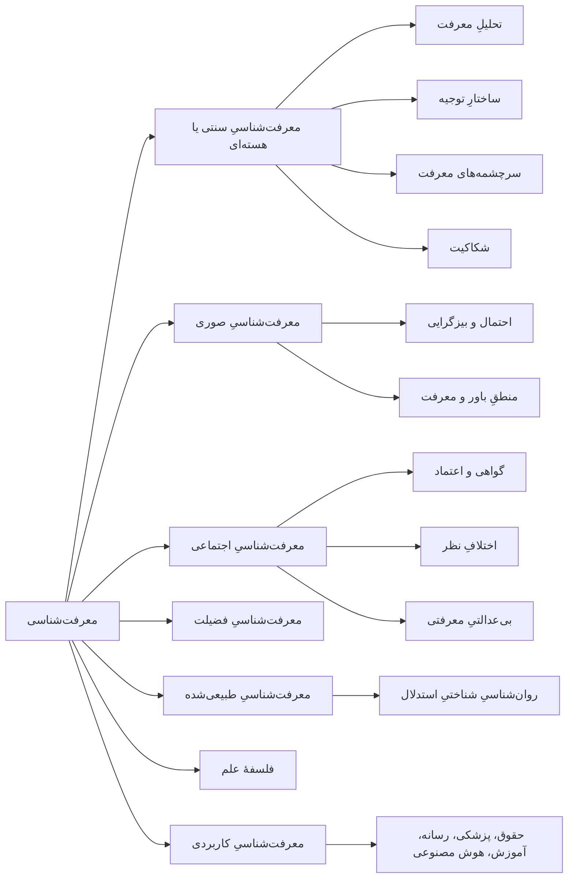

# فصل ۱. معرفت‌شناسی چیست؟

[فهرست](README.md) · [بعدی: تاریخِ نظریهٔ معرفت ←](02-history-of-epistemology.md)

**صوت:** [شنیدنِ این فصل](audio/01-what-is-epistemology.mp3) (۳۵ دقیقه، روایت به انگلیسی) · [باز کردن در پخش‌کننده](audio/index.html#01)

---

> «همهٔ آدمیان بنا به طبیعت خواهانِ دانستن‌اند.»
> — ارسطو، *متافیزیک*، کتابِ یکم، فصلِ ۱

> «اصلِ نخست این است که نباید خودتان را فریب دهید — و خودتان آسان‌ترین کسی هستید که می‌شود فریبش داد.»
> — ریچارد فاینمن، سخنرانیِ جشنِ دانش‌آموختگیِ کلتک، ۱۹۷۴

**معرفت‌شناسی** شاخه‌ای از فلسفه است که معرفت، باور، شواهد، توجیه و عقلانیت را بررسی می‌کند. واژهٔ انگلیسیِ آن (epistemology) از دو واژهٔ یونانی ساخته شده است: *اپیستمه* (معرفت، فهم) و *لوگوس* (شرح، بررسی). فیلسوفِ اسکاتلندی، جیمز فردریک فریر (James Frederick Ferrier)، این اصطلاح را در کتابِ *مبانیِ متافیزیک* (۱۸۵۴) به انگلیسی وارد کرد. فیلسوفانِ آلمانی این حوزه را *Erkenntnistheorie* یعنی «نظریهٔ شناخت» می‌نامند.

بیشترِ رشته‌ها بخشی از جهان را بررسی می‌کنند. معرفت‌شناسی بررسی می‌کند که ما اصلاً چگونه *چیزی* دربارهٔ جهان می‌دانیم. از همین رو زیرِ همهٔ رشته‌های دیگر جای دارد. فیزیک‌دانان، مورخان، قاضیان، پزشکان و روزنامه‌نگاران همه ادعا می‌کنند چیزهایی را می‌دانند، و هر یک، معمولاً بی‌آنکه به زبان آورد، بر فرض‌هایی تکیه دارد دربارهٔ اینکه چه چیزی شاهدِ خوب به شمار می‌آید و کِی باوری سزاوارِ پذیرفتن است. معرفت‌شناسی این فرض‌ها را آشکار می‌کند و به آزمون می‌گذارد.

این فصل واژگانِ پایه و نقشهٔ کلیِ این حوزه را به دست می‌دهد. همهٔ فصل‌های بعدی بر آن بنا می‌شوند.

---

## چرا معرفت‌شناسی برای تفکر نقادانه مهم است

تفکر نقادانه همان معرفت‌شناسیِ کاربردی است. وقتی می‌پرسید «آیا این درست است؟»، «از کجا این را می‌دانند؟»، «چرا باید به این منبع اعتماد کنم؟» یا «چه چیزی نظرم را عوض می‌کند؟»، پرسش‌هایی معرفت‌شناختی می‌پرسید؛ فقط آن‌ها را سریع و غیررسمی می‌پرسید.

اختلافی را در نظر بگیرید که ممکن است سرِ هر سفرهٔ شامی پیش بیاید:

> **الف:** «این رژیمِ تازه جواب می‌دهد. پسرعمه‌ام در دو ماه ده کیلو کم کرد.»
> **ب:** «حکایت‌های شخصی شاهد نیستند.»
> **الف:** «یعنی می‌گویی پسرعمه‌ام دروغ می‌گوید؟»
> **ب:** «نه، ولی یک مورد چیزی را ثابت نمی‌کند.»
> **الف:** «خب، دانشمندها گفتند تخم‌مرغ بد است و بعد گفتند اشکالی ندارد؛ پس چرا به آن‌ها اعتماد کنم؟»

همین گفت‌وگوی کوتاه دست‌کم شش مسئلهٔ معرفت‌شناختی را در خود دارد:

1. **جایگاهِ گواهی.** «الف» چیزی را باور دارد چون پسرعمه‌اش آن را گفته است. گواهیِ دیگران کِی دلیلِ خوبی است؟ نگاه کنید به [گواهی](07-sources-of-knowledge.md#testimony).
2. **استقرا از یک مورد.** آیا یک نمونه می‌تواند ادعایی کلی را پشتیبانی کند؟ نگاه کنید به [مسئلهٔ استقرای هیوم](09-induction-probability-bayes.md#humes-problem-of-induction) و [تعمیمِ شتاب‌زده](15-fallacies.md#hasty-generalization).
3. **استنتاجِ علّی.** حتی اگر پسرعمه وزن کم کرده باشد، آیا *رژیم* علتِ آن بوده است؟ نگاه کنید به [علیت و استنتاجِ علّی](10-science-and-evidence.md#causation-and-causal-inference).
4. **بدفهمیِ ادعای «ب».** «ب» گفت «یک مورد چیزی را ثابت نمی‌کند»؛ «الف» شنید «پسرعمه‌ات دروغ می‌گوید». این [مغالطهٔ پهلوانِ پنبه](15-fallacies.md#straw-man) است، یا دست‌کم کوتاهی در رعایتِ [اصلِ حسنِ ظن](03-logic-and-arguments.md#the-principle-of-charity).
5. **اعتماد به تخصص.** آیا اینکه دانشمندان دیدگاهی را اصلاح کرده‌اند یعنی قابل‌اعتماد نیستند، یا اصلاحِ دیدگاه نشانهٔ آن است که روشی خوداصلاح‌گر دارد کار می‌کند؟ نگاه کنید به [متخصصان و تازه‌کاران](12-social-epistemology.md#experts-and-novices) و [خطاپذیرگرایی](06-justification.md#fallibilism).
6. **معیارهای شواهد.** خودِ جملهٔ «حکایت‌های شخصی شاهد نیستند» بیش از حد تند است. حکایت‌های شخصی شاهدِ ضعیف‌اند، نه شاهدِ صفر. نگاه کنید به [قضیهٔ بیز](09-induction-probability-bayes.md#bayes-theorem).

کسی که معرفت‌شناسی خوانده است با دانستنِ اصطلاح‌های زیرکانه در چنین بحث‌هایی «برنده» نمی‌شود. او *ساختارِ* اختلاف را می‌بیند: چه چیزی ادعا می‌شود، چه چیزی از آن پشتیبانی می‌کند، دو طرف واقعاً کجا با هم اختلاف دارند، و چه چیزی مسئله را فیصله می‌دهد. این همان مهارتی است که این راهنما برای پروردنش نوشته شده است.

سه دلیلِ دیگر هم برای آموختنِ این حوزه هست.

- **دفاع از خود.** کسانی که پول، رأی یا وفاداریِ شما را می‌خواهند از ضعف‌های پیش‌بینی‌پذیرِ استدلالِ انسانی بهره می‌برند. شناختنِ این ضعف‌ها ([فصل ۱۴](14-psychology-of-reasoning.md)) و ترفندهای رایج ([فصل ۱۵](15-fallacies.md)) از شما محافظت می‌کند.
- **تصمیم‌های جمعیِ بهتر.** دموکراسی‌ها، دادگاه‌ها، جامعه‌های علمی و شرکت‌ها نظام‌هایی برای تولیدِ معرفت به‌صورتِ جمعی‌اند. فهمِ [معرفت‌شناسیِ اجتماعی](12-social-epistemology.md) نشان می‌دهد این نظام‌ها وقتی کار می‌کنند چرا کار می‌کنند و چرا شکست می‌خورند.
- **صداقتِ فکری.** معرفت‌شناسی به شما می‌آموزد باورها را با اندازهٔ درستی از اطمینان نگه دارید، نه بیشتر و نه کمتر. این هم دستاوردی اخلاقی است و هم دستاوردی فکری (نگاه کنید به [فصل ۱۳](13-virtues-and-ethics-of-belief.md)).

---

## پرسش‌های اصلی

معرفت‌شناسی گردِ چند پرسشِ بزرگ سامان یافته است. تقریباً هر موضوعی در این راهنما تلاشی است برای پاسخ دادن به یکی از آن‌ها.

| پرسش | نامِ مسئله | کجا بخوانید |
|---|---|---|
| معرفت *چیست*؟ چه فرقی با باورِ صادق، حدسِ خوش‌اقبال یا عقیده دارد؟ | تحلیلِ معرفت | [فصل ۵](05-the-nature-of-knowledge.md) |
| چه چیزی باوری را *موجه* یا *معقول* می‌کند؟ | نظریهٔ توجیه | [فصل ۶](06-justification.md) |
| معرفت از کجا می‌آید؟ ادراکِ حسی، حافظه، عقل، گواهی؟ | سرچشمه‌های معرفت | [فصل ۷](07-sources-of-knowledge.md) |
| آیا اصلاً می‌توانیم چیزی بدانیم؟ دانشِ ما تا کجا می‌رسد؟ | مسئلهٔ شکاکیت | [فصل ۸](08-skepticism.md) |
| تجربهٔ گذشته چگونه می‌تواند باورهایی دربارهٔ آینده را موجه کند؟ | مسئلهٔ استقرا | [فصل ۹](09-induction-probability-bayes.md) |
| در شرایطِ عدم‌قطعیت چگونه باید استدلال کنیم؟ | احتمال و معرفت‌شناسیِ بیزی | [فصل ۹](09-induction-probability-bayes.md) |
| چه چیزی علم را راهی قابل‌اعتماد برای دانستن می‌کند؟ | فلسفهٔ علم | [فصل ۱۰](10-science-and-evidence.md) |
| حقیقت چیست؟ آیا عینی است؟ | نظریه‌های صدق؛ نسبی‌گرایی | [فصل ۱۱](11-truth-and-relativism.md) |
| کِی باید به دیگران اعتماد کنیم؟ وقتی متخصصان یا همتایان اختلاف دارند چه کنیم؟ | معرفت‌شناسیِ اجتماعی | [فصل ۱۲](12-social-epistemology.md) |
| کدام ویژگی‌های منشِ فکری کسی را اندیشمندی خوب می‌کند؟ آیا دربارهٔ آنچه باور می‌کنیم وظیفه‌ای داریم؟ | معرفت‌شناسیِ فضیلت؛ اخلاقِ باور | [فصل ۱۳](13-virtues-and-ethics-of-belief.md) |
| ذهن‌های واقعیِ انسان چگونه استدلال می‌کنند و کجا به خطا می‌روند؟ | معرفت‌شناسیِ طبیعی‌شده؛ روان‌شناسیِ استدلال | [فصل ۱۴](14-psychology-of-reasoning.md) |

دو پرسش پیش از همهٔ پرسش‌های دیگر می‌آیند، و فیلسوفان ۲۵۰۰ سال است که دربارهٔ ترتیبِ آن‌ها بحث می‌کنند:

- **چه چیزی را می‌دانیم؟** (*گسترهٔ* معرفت)
- **چگونه می‌دانیم؟** (*معیارهای* معرفت)

برای اینکه بگوییم چه چیزی را می‌دانیم، ظاهراً به معیاری برای بازشناختنِ معرفت نیاز داریم. برای آزمودنِ یک معیار، ظاهراً به چند نمونهٔ روشن از معرفت نیاز داریم تا معیار را با آن‌ها بسنجیم. این دور را [مسئلهٔ معیار](06-justification.md#the-problem-of-the-criterion) می‌نامند. این نمونهٔ نخستینِ خوبی است از شیوهٔ کارِ معرفت‌شناسی: پرسشی ساده خیلی زود به معمایی ساختاری و ژرف می‌رسد.

---

## سه گونه دانستن

انگلیسی برای چیزهای بسیار متفاوت یک واژهٔ واحد دارد: «know». بسیاری از زبان‌های دیگر این معناها را از هم جدا می‌کنند: فرانسوی *savoir* و *connaître* دارد، آلمانی *wissen* و *kennen*، و فارسی «دانستن» و «شناختن».

خودِ این مفهوم ظاهراً همگانی است. «know» جزوِ ده فعلِ پرکاربردِ انگلیسی است، و زبان‌شناسانی که در طرحِ «فرازبانِ معناشناختیِ طبیعی» کار می‌کنند (آنا ویرژبیتسکا، کلیف گادارد و همکارانشان) «دانستن» و «فکر کردن» را در میانِ مجموعهٔ کوچکی از معناها می‌آورند، کمتر از صد معنا، که ظاهراً در هر زبانِ انسانیِ بررسی‌شده معادلی دقیق دارند. بسیاری از واژه‌هایی که انتظار دارید همگانی باشند چنین نیستند: برخی زبان‌ها فعلِ واحدی برای «رفتن» یا «خوردن» ندارند. جنیفر نیگل (*معرفت: درآمدی بسیار کوتاه*، ۲۰۱۴، فصلِ ۱) این را نشانه‌ای می‌داند از اینکه تمایزِ میانِ دانستن و صرفاً فکر کردن در زندگیِ انسان بنیادی است، نه اختراعِ فیلسوفان.

معرفت با **واقعیت‌ها** هم فرق دارد. مثالِ نیگل: جعبه‌ای دربسته را که سکه‌ای در آن است تکان دهید و زمین بگذارید. سکه یا شیر آمده یا خط؛ این یک واقعیت است. اما تا کسی نگاه نکند، هیچ‌کس نمی‌داند کدام. اگر روی یک کاغذ بنویسید «شیر» و روی کاغذی دیگر «خط»، واقعیت را روی کاغذ آورده‌اید بی‌آنکه آن را در معرفتِ کسی بگذارید. معرفت همیشه از آنِ کسی است: یک فرد، یا گروهی که اعضایش دانسته‌هایشان را روی هم می‌گذارند (یک ارکستر می‌داند سمفونی‌ای را چگونه بنوازد که هیچ نوازنده‌ای به‌تنهایی نمی‌تواند).

### معرفتِ گزاره‌ای

**معرفتِ گزاره‌ای** *دانستنِ اینکه* چیزی چنین است.

- می‌دانم *که* پاریس پایتختِ فرانسه است.
- او می‌داند *که* قطار ساعتِ ۹:۱۵ حرکت می‌کند.
- می‌دانیم *که* سیگار کشیدن سرطان‌زاست.

آنچه در این‌جا دانسته می‌شود یک **گزاره** است: چیزی که می‌تواند صادق یا کاذب باشد. معرفتِ گزاره‌ای موضوعِ اصلیِ معرفت‌شناسیِ سنتی است، و هرجا این راهنما بی‌هیچ قیدی از «معرفت» سخن می‌گوید، همین گونه را در نظر دارد. [فصل ۵](05-the-nature-of-knowledge.md) می‌پرسد این معرفت از چه تشکیل شده است.

### دانستنِ چگونگی

**دانستنِ چگونگی** (معرفتِ عملی) *دانستنِ اینکه* کاری را *چگونه* باید کرد.

- می‌دانم چگونه دوچرخه‌سواری کنم.
- او می‌داند چگونه کودکی گریان را آرام کند.
- استادِ شطرنج می‌داند چگونه از ساختارِ ضعیفِ پیاده‌ها بهره بگیرد.

گیلبرت رایل در مقالهٔ «دانستنِ چگونگی و دانستنِ اینکه» (۱۹۴۶) و کتابِ *مفهومِ ذهن* (۱۹۴۹) استدلال کرد که دانستنِ چگونگی گونه‌ای جداگانه از معرفت است و نمی‌توان آن را به دانستنِ واقعیت‌ها فروکاست. استدلالش این بود: اگر هر کنشِ هوشمندانه مستلزمِ آن بود که نخست گزاره‌ای را در نظر بگیریم، آن‌گاه در نظر گرفتنِ هوشمندانهٔ همان گزاره هم مستلزمِ در نظر گرفتنِ گزاره‌ای دیگر بود، و همین‌طور تا بی‌نهایت. پس بخشی از هوشمندی باید در خودِ انجام دادن باشد. این دیدگاه را **ضدعقل‌گرایی** (anti-intellectualism) می‌نامند.

جیسن استنلی و تیموتی ویلیامسون (مقالهٔ «دانستنِ چگونگی»، ۲۰۰۱) از **عقل‌گرایی** (intellectualism) دفاع کردند: دانستنِ اینکه چگونه دوچرخه‌سواری کنیم یعنی دانستنِ اینکه، دربارهٔ شیوه‌ای مانندِ *w*، *w* شیوه‌ای است که شما با آن دوچرخه‌سواری می‌کنید، و این دانستن زیرِ «نحوهٔ عملیِ عرضه» درک می‌شود. بحث هنوز ادامه دارد. برای متفکرِ نقاد، پیامدِ عملی به‌قدرِ کافی روشن است: *خوب استدلال کردن تا اندازه‌ای یک مهارت است*. ممکن است همهٔ قواعدِ منطق را بدانید و باز در بحثی داغ بد استدلال کنید، همان‌طور که ممکن است فیزیکِ دوچرخه‌سواری را بدانید و باز زمین بخورید. مهارت تمرین می‌خواهد. برای همین است که این راهنما تمرین دارد. نیز نگاه کنید به [بازگشتی به دانستنِ چگونگی](05-the-nature-of-knowledge.md#knowledge-how-revisited).

### معرفت از راهِ آشنایی

**معرفت از راهِ آشنایی** آشناییِ مستقیم با یک چیز، یک شخص، یک مکان یا یک تجربه است.

- تهران را می‌شناسم (آنجا زندگی کرده‌ام).
- مزهٔ زعفران را می‌شناسم.
- خواهرم را می‌شناسم.

برتراند راسل «معرفت از راهِ آشنایی» را از «معرفت از راهِ توصیف» جدا کرد (مقالهٔ «معرفت از راهِ آشنایی و معرفت از راهِ توصیف»، ۱۹۱۰–۱۹۱۱؛ *مسائلِ فلسفه*، ۱۹۱۲، فصلِ ۵). ممکن است واقعیت‌های بسیاری *دربارهٔ* ناپلئون بدانید (معرفت از راهِ توصیف) بی‌آنکه هرگز با او آشنا بوده باشید.

آزمایشِ فکریِ مشهوری روی این تمایز فشار می‌آورد: **اتاقِ مری** از فرانک جکسون (مقالهٔ «کیفیاتِ ذهنیِ پدیدارِ فرعی»، ۱۹۸۲). مری دانشمندی درخشان است که همهٔ واقعیت‌های فیزیکی دربارهٔ دیدنِ رنگ را می‌داند، اما تمامِ عمرش را در اتاقی سیاه‌وسفید گذرانده است. وقتی بیرون می‌آید و برای نخستین بار گلِ سرخی می‌بیند، آیا چیزِ تازه‌ای می‌آموزد؟ بسیاری می‌گویند آری: او می‌آموزد دیدنِ سرخ *چه حسی دارد*. اگر چنین باشد، معرفتی هست که هیچ مقدار توصیفِ گزاره‌ای آن را فراهم نمی‌کند. (جکسون از این مثال برای استدلال علیهِ فیزیکالیسم در فلسفهٔ ذهن استفاده کرد و بعدها نظرش را عوض کرد. این مثال هنوز تصویری تیز از آشنایی است.)

سنتِ فلسفهٔ اسلامی تمایزی خویشاوند میانِ **علمِ حضوری** و **علمِ حصولی** (معرفتِ اکتسابی و بازنمودی) می‌گذارد. این تمایز در [فصل ۷](07-sources-of-knowledge.md#knowledge-by-presence) بررسی می‌شود.

> **پیوند.** گونه‌های دیگر: *دانستنِ اینکه چه کسی*، *دانستنِ اینکه کجا*، *دانستنِ اینکه آیا*، *دانستنِ اینکه چرا*. بسیاری از فیلسوفان این‌ها را گزاره‌ای تحلیل می‌کنند: دانستنِ اینکه کلیدها کجاست یعنی دانستنِ اینکه، دربارهٔ جایی، کلیدها *آنجاست*. دانستنِ *چرایی* پیوندی نزدیک با [فهم](05-the-nature-of-knowledge.md#understanding-and-wisdom) دارد، که برخی آن را ارزشمندتر از معرفت می‌دانند.

---

## باور، درجهٔ باور و پذیرش

معرفت با باور همراه است (نگاه کنید به [شرطِ باور](05-the-nature-of-knowledge.md#the-belief-condition))، پس باید روشن باشیم که باور چیست.

**باور** نگرشِ *صادق دانستنِ چیزی* است. اگر باور دارید که باران می‌بارد، جهان را چنان بازنمایی می‌کنید که باران در آن هست؛ آماده‌اید اگر صادقانه از شما بپرسند بگویید «باران می‌بارد»، اگر نخواهید خیس شوید چتر بردارید، و اگر بیرون بروید و خیابان را خشک ببینید شگفت‌زده شوید. باورها را معمولاً **گرایشی** (dispositional) می‌دانند: شما همین حالا باور دارید که ۲ + ۲ = ۴، هرچند لحظه‌ای پیش به آن فکر نمی‌کردید.

در زبانِ روزمره، باور مفهومی **همه یا هیچ** است: یا باور دارید، یا باور ندارید، یا داوری را معلق می‌گذارید. سه **نگرشِ باوری** (doxastic) پایه وجود دارد (از واژهٔ یونانیِ *دوکسا*، عقیده):

1. **باور** به اینکه *p*
2. **ناباوری** به اینکه *p* (باور به نقیضِ *p*)
3. **تعلیقِ داوری** دربارهٔ *p* (هیچ‌کدام)

اما باور **درجه** هم دارد. اطمینانتان به اینکه فردا خورشید طلوع می‌کند بیشتر است تا به اینکه تیمتان شنبه می‌برد. **درجهٔ باور** (credence؛ یا احتمالِ ذهنی) عددی میانِ ۰ و ۱ است که نشان می‌دهد چقدر مطمئنید. درجهٔ باورِ ۱ یعنی یقین به *p*، ۰ یعنی یقین به نقیضِ *p*، و ۰٫۵ یعنی بیشترین عدم‌قطعیت میانِ این دو. معرفت‌شناسیِ بیزی، که در [فصل ۹](09-induction-probability-bayes.md#bayesian-epistemology) می‌آید، تا حدِ زیادی نظریه‌ای است دربارهٔ اینکه درجه‌های باور چگونه باید رفتار کنند.

اینکه باورِ کامل چه نسبتی با درجهٔ باور دارد پرسشی زنده است. پاسخی طبیعی، **تزِ لاکی**، می‌گوید وقتی به *p* باور دارید که درجهٔ باورتان به *p* از آستانه‌ای بالاتر باشد (مثلاً ۰٫۹۵). این پاسخ با [پارادوکسِ بخت‌آزمایی](09-induction-probability-bayes.md#full-belief-and-degrees-of-belief) به دردسر می‌افتد.

**پذیرش** با باور فرق دارد. *پذیرفتنِ* یک گزاره یعنی آن را در زمینه‌ای معین مقدمهٔ استدلال و عمل قرار دادن، چه به آن باور داشته باشید چه نه (ال. جاناتان کوهن، *جستاری دربارهٔ باور و پذیرش*، ۱۹۹۲؛ مایکل برتمن، «استدلالِ عملی و پذیرش در یک زمینه»، ۱۹۹۲). نمونه‌ها:

- وکیلِ مدافع برای ساختنِ دفاعیه بی‌گناهیِ موکلش را می‌پذیرد، هرچه در دل باور داشته باشد.
- مهندس هنگامِ یک محاسبهٔ سریع می‌پذیرد که مقاومتِ هوا ناچیز است.
- مذاکره‌کننده ارقامِ طرفِ مقابل را «برای پیشبردِ بحث» می‌پذیرد.

جدا کردنِ باور از پذیرش بسیاری از بحث‌های آشفته را روشن می‌کند. «تو داری X را فرض می‌گیری!» وقتی طرفِ مقابل X را فقط برای پیشبردِ بحث *پذیرفته* است، ردیه نیست. به همین ترتیب، یک **مدلِ** علمی معمولاً پذیرفته می‌شود، نه باور. همه می‌دانند قانونِ گازِ ایده‌آل در جزئیات نادرست است؛ آن را به‌عنوانِ تقریبی سودمند می‌پذیرند.

نگرش‌های دیگری که باور *نیستند*: **فرض کردن** («فرض کن ماه از پنیر ساخته شده باشد»)، **تخیل**، **امید**، **پیش‌فرض**، **ایمان** (بنا بر برخی تحلیل‌ها) و **حدس**. این‌ها را از هم جدا نگه دارید. بسیاری از استدلال‌های بد از «ممکن است که…» (یک فرض) به «محتمل است که…» (یک درجهٔ باور) و از آنجا به «چنین است که…» (یک باور) می‌لغزند.

---

## واژگانِ پایه

این اصطلاح‌ها در سراسرِ راهنما می‌آیند. تعریف‌های کامل در [واژه‌نامه](17-glossary.md) است.

**گزاره.** آنچه یک جملهٔ خبری بیان می‌کند؛ از آن دست چیزهایی که می‌توانند صادق یا کاذب باشند. «برف سفید است» و «La neige est blanche» یک گزاره را بیان می‌کنند.

**صدق (حقیقت).** بنا بر رایج‌ترین دیدگاه، گزاره‌ای صادق است که چیزها همان‌گونه باشند که می‌گوید. ارسطو چنین گفت: «گفتنِ اینکه آنچه هست نیست، یا آنچه نیست هست، کاذب است؛ و گفتنِ اینکه آنچه هست هست، و آنچه نیست نیست، صادق است» (*متافیزیک*، کتابِ گاما، فصلِ ۷، 1011b25). نظریه‌ها در [فصل ۱۱](11-truth-and-relativism.md) با هم مقایسه می‌شوند.

**شواهد.** هر چیزی که گزاره‌ای را *برای شما* کم‌وبیش محتمل‌تر می‌کند، یا از آن پشتیبانی می‌کند. فیلسوفان دربارهٔ اینکه شاهد چیست اختلاف دارند: تجربه‌ها؟ حالت‌های ذهنی؟ واقعیت‌های دانسته؟ (شعارِ تیموتی ویلیامسون این است: «E = K»، یعنی شواهدِ شما همان معرفتِ شماست.) ایدهٔ کاریِ سودمندی از نظریهٔ احتمال: *E شاهدی برای H است اگر E در صورتِ صادق بودنِ H محتمل‌تر باشد تا در صورتِ کاذب بودنِ آن.* نگاه کنید به [شواهد و تأیید](09-induction-probability-bayes.md#evidence-and-confirmation).

**توجیه.** ویژگی‌ای که باوری دارد وقتی به دلیل‌های خوب نگه داشته شود، یا به شیوهٔ درست شکل گرفته باشد، چنان‌که نگه داشتنش از نظرِ معرفتی بجا باشد. باورِ موجه هم می‌تواند کاذب باشد: کارآگاه می‌تواند در باور به اینکه پیشخدمت قاتل است موجه باشد و بعد معلوم شود اشتباه کرده است. نگاه کنید به [فصل ۶](06-justification.md).

**عقلانیت.** نزدیک به توجیه اما گسترده‌تر. عقلانیتِ *معرفتی* به باور داشتن هماهنگ با شواهد مربوط است؛ عقلانیتِ *عملی* به خوب عمل کردن با توجه به هدف‌ها و باورهای شخص. فیلسوفان *عقلانیت* را به معنای انسجامِ درونی (باور نداشتن به تناقض‌ها، به‌روز کردنِ باورها با شواهد) از *معقول بودن* به معنایی گسترده‌تر نیز جدا می‌کنند.

**تضمین (warrant).** اصطلاحِ آلوین پلنتینگا برای «هر آنچه باورِ صادق را به معرفت بدل می‌کند» (*تضمین: بحثِ کنونی*، ۱۹۹۳). این اصطلاحی جانشین است: گفتنِ اینکه چیزی *تضمین دارد* هنوز نمی‌گوید تضمین چیست.

**یقین.** دو معنا دارد. یقینِ *روان‌شناختی* احساسِ اطمینانِ کامل است؛ آدم‌ها دربارهٔ بسیاری چیزهای کاذب احساسِ یقین می‌کنند. یقینِ *معرفتی* بالاترین درجهٔ ممکنِ توجیه است، که در آن با شواهدی که دارید هیچ امکانی برای خطا نیست. باورهای کمی یقینِ معرفتی دارند.

**خطاپذیرگرایی.** این دیدگاه که می‌توانیم چیزی را بدانیم هرچند توجیهمان صدقِ آن را تضمین نمی‌کند. تقریباً همهٔ معرفت‌شناسانِ معاصر خطاپذیرگرا هستند. نگاه کنید به [خطاپذیرگرایی](06-justification.md#fallibilism).

**ابطال‌کننده.** ملاحظه‌ای که توجیهِ یک باور را از میان می‌برد یا سست می‌کند. نگاه کنید به [ابطال‌کننده‌ها](06-justification.md#defeaters).

**دلیل‌ها.** فیلسوفان سه معنا را از هم جدا می‌کنند:
- **دلیلِ هنجاری** به سودِ باور یا انجامِ کاری *وزن دارد*. («ابرهای تیره دلیلی برای باور به باریدنِ باران است.»)
- **دلیلِ انگیزشی** ملاحظه‌ای است که کسی در پرتوِ آن واقعاً باور می‌کند یا عمل می‌کند. («او باور کرد باران می‌بارد چون ابرها را دید.»)
- **دلیلِ تبیینی** توضیح می‌دهد چرا چیزی رخ داد، خواه کسی استدلالی کرده باشد خواه نه. («پل به‌خاطرِ خستگیِ فلز فرو ریخت.»)

ممکن است دلیلِ هنجاریِ خوبی در دسترس باشد و با این همه باور به دلیلِ انگیزشیِ بدی نگه داشته شود. این تفاوت زیربنای تمایزِ میانِ [توجیهِ گزاره‌ای و توجیهِ باوری](06-justification.md#what-justification-is) است.

---

## سه تمایزِ بزرگ

سه تمایز گونه‌های صدق و معرفت را از هم جدا می‌کنند. به‌آسانی با هم اشتباه گرفته می‌شوند، و برخی از مهم‌ترین استدلال‌های فلسفه به جدا نگه داشتنِ آن‌ها بستگی دارد.

### پیشین و پسین

این تمایز دربارهٔ **اینکه گزاره چگونه دانسته می‌شود** است.

- گزاره‌ای **پیشین** (a priori) دانسته می‌شود اگر بتوان آن را مستقل از تجربه دانست، جز تجربه‌ای که برای به دست آوردنِ مفهوم‌ها لازم است. نمونه‌ها: «همهٔ مردانِ مجرد ازدواج نکرده‌اند»، «۷ + ۵ = ۱۲»، «اگر الف از ب بلندتر باشد و ب از ج، آن‌گاه الف از ج بلندتر است.»
- گزاره‌ای **پسین** (a posteriori، یا تجربی) دانسته می‌شود اگر دانستنش به تجربهٔ جهان نیاز داشته باشد. نمونه‌ها: «آب در سطحِ دریا در ۱۰۰ درجهٔ سانتی‌گراد می‌جوشد»، «کانبرا پایتختِ استرالیاست»، «بیش از یک میلیون گونه حشره وجود دارد.»

«مستقل از تجربه» به این معنا نیست که بی‌هیچ تجربه‌ای می‌توانستید آن را بدانید. برای یاد گرفتنِ معنای «مجرد» به تجربه نیاز داشتید. نکته این است که وقتی گزاره را فهمیدید، *دیگر به هیچ مشاهدهٔ دیگری نیاز نیست* تا بدانید صادق است.

### تحلیلی و ترکیبی

این تمایز دربارهٔ **اینکه چه چیزی گزاره را صادق می‌کند** است، یا در صورت‌بندیِ کانت، دربارهٔ نسبتِ موضوع و محمول.

- گزاره‌ای **تحلیلی** است اگر تنها به‌خاطرِ معنا صادق باشد، یا (به تعبیرِ کانت) اگر محمول «درونِ» مفهومِ موضوع گنجانده شده باشد. «همهٔ مردانِ مجرد ازدواج نکرده‌اند»: مفهومِ *مجرد* خودش *ازدواج‌نکرده* را در بر دارد.
- گزاره‌ای **ترکیبی** است اگر صدقش به چگونگیِ جهان بستگی داشته باشد، نه فقط به معناها. «همهٔ مردانِ مجرد شلخته‌اند» (کاذب، اما ترکیبی) یا «گربه روی پادری است.»

کانت این تمایز را در *نقدِ عقلِ محض* (۱۷۸۱) مطرح کرد. مقالهٔ مشهورِ و. و. ا. کواین، «دو جزمِ تجربه‌گرایی» (۱۹۵۱)، به آن حمله کرد و استدلال آورد که هیچ‌کس شرحی غیرِدوری از «صادق به‌خاطرِ معنا» به دست نداده است. نگاه کنید به [کواین و معرفت‌شناسیِ طبیعی‌شده](02-history-of-epistemology.md#quine-and-naturalized-epistemology).

### ضروری و امکانی

این تمایز دربارهٔ **جایگاهِ وجهیِ** گزاره است: اینکه آیا می‌توانست جزِ این باشد.

- صدقِ **ضروری** نمی‌توانست کاذب باشد: در هر جهانِ ممکنی صادق است. «۲ + ۲ = ۴»، «هیچ چیزی نمی‌تواند هم‌زمان سراسر سرخ و سراسر سبز باشد.»
- صدقِ **امکانی** صادق است اما می‌توانست کاذب باشد. «ناپلئون در واترلو شکست خورد»، «لپ‌تاپی روی میزِ من است.»

### کنار هم گذاشتنِ سه تمایز

فیلسوفان زمانی دراز فرض می‌کردند این سه تمایز به‌خوبی بر هم منطبق‌اند: *پیشین = تحلیلی = ضروری*، و *پسین = ترکیبی = امکانی*. دو فیلسوف نشان دادند که این انطباق برقرار نیست.

**کانت** استدلال کرد که صدق‌های **ترکیبیِ پیشین** وجود دارند: گزاره‌هایی که چیزی اساسی دربارهٔ جهان به ما می‌گویند و با این همه بی‌تجربه دانستنی‌اند. نمونه‌های او صدق‌های حساب و هندسه بودند («۷ + ۵ = ۱۲»؛ «کوتاه‌ترین فاصلهٔ میانِ دو نقطه خطِ راست است») و اصل‌هایی بنیادی مانندِ «هر رویدادی علتی دارد». توضیحِ اینکه معرفتِ ترکیبیِ پیشین چگونه ممکن است طرحِ اصلیِ *نقدِ عقلِ محض* بود.

**سول کریپکی** در *نام‌گذاری و ضرورت* (درس‌گفتارها ۱۹۷۰، کتاب ۱۹۸۰) از این دو دفاع کرد:

- صدق‌های **ضروریِ پسین**. «آب H₂O است» و «هسپروس همان فسفروس است» (ستارهٔ شامگاهی همان ستارهٔ بامدادی است؛ هر دو زهره‌اند). اگر آب *همان* H₂O است، نمی‌توانست چیزِ دیگری باشد، پس این صدق ضروری است. اما آن را با شیمی کشف کردیم، نه با تأمل، پس پسین دانسته می‌شود.
- صدق‌های **امکانیِ پیشین**. اگر معنای «یک متر» را چنین تثبیت کنید: «طولِ میلهٔ S در زمانِ t₀»، به‌طورِ پیشین می‌دانید که میلهٔ S در t₀ یک متر است، اما این امکانی است، چون میله می‌توانست بلندتر باشد.

| | پیشین | پسین |
|---|---|---|
| **ضروری** | «۲ + ۲ = ۴»؛ «همهٔ مردانِ مجرد ازدواج نکرده‌اند» | «آب H₂O است» (کریپکی) |
| **امکانی** | «میلهٔ S در t₀ یک متر است» (کریپکی؛ محلِ مناقشه) | «پاریس پایتختِ فرانسه است» |

> **چرا این برای تفکر نقادانه مهم است.** بسیاری از استدلال‌ها بی‌سروصدا به یکی از این تمایزها تکیه دارند. «این را که نمی‌شود پشتِ میز ثابت کرد!» ادعا می‌کند که حکمی پسین است. «این بنا به تعریف درست است!» ادعا می‌کند که حکمی تحلیلی است، و اغلب یک [تعریفِ اقناعی](04-language-concepts-and-definitions.md#kinds-of-definition) را پنهان می‌کند. «اوضاع همین‌طور پیش آمده» ادعای امکانی بودن است. وقتی چنین حرکتی می‌شنوید، بپرسید کدام تمایز در کار است و آیا دسته‌بندی درست است.

---

## دلیل‌های معرفتی در برابر دلیل‌های عملی

فرض کنید میلیاردری به شما یک میلیون دلار پیشنهاد کند تا باور کنید ماه از پنیر ساخته شده است. شما دلیلِ *عملیِ* عالی‌ای برای داشتنِ این باور دارید. اما هیچ دلیلِ *معرفتی‌ای* ندارید که فکر کنید صادق است، و در واقع احتمالاً *نمی‌توانید* به اراده آن را باور کنید. (امتحان کنید.)

این آزمایشِ فکری ایده‌ای محوری را نشان می‌دهد:

- **دلیل‌های معرفتی** به این مربوط‌اند که آیا گزاره‌ای *صادق* است: شواهد، استدلال‌ها، گواهیِ قابل‌اعتماد.
- **دلیل‌های عملی** (یا *پراگماتیک*) به این مربوط‌اند که آیا داشتنِ یک باور *خوب* یا *سودمند* است: آرامش، پاداش، تعلقِ اجتماعی، انگیزه.

فیلسوفان متوجه شده‌اند که وقتی دربارهٔ *اینکه آیا p را باور کنیم* می‌اندیشیم، این پرسش بی‌درنگ به پرسشِ *اینکه آیا p صادق است* فرو می‌ریزد. نیشی شاه این را **شفافیتِ** باور نامید («صدق چگونه بر باور حکم می‌راند»، ۲۰۰۳). این ویژگی نشان می‌دهد که باور ذاتاً معطوف به صدق است، به شیوه‌ای که میل و امید نیستند.

دلیل‌های عملی برای باور هنوز در بحث‌ها اهمیت دارند:

- **شرط‌بندیِ پاسکال** (بلز پاسکال، *اندیشه‌ها*، انتشار ۱۶۷۰) مشهورترین استدلالِ عملی برای باور است: اگر خدا وجود داشته باشد، باور پاداشی بی‌پایان می‌آورد؛ اگر نه، چیزِ زیادی از دست نمی‌دهید. پس، به استدلالِ پاسکال، باید بکوشید باور کنید. نگاه کنید به [ایمان، عقل و معرفت‌شناسیِ دین](13-virtues-and-ethics-of-belief.md#faith-reason-and-religious-epistemology).
- **«ارادهٔ معطوف به باور» از ویلیام جیمز** (۱۸۹۶) استدلال کرد که وقتی انتخابی «زنده، ناگزیر و سرنوشت‌ساز» است و شواهد نمی‌توانند آن را فیصله دهند، «طبیعتِ عاطفیِ» ما می‌تواند به‌حق تصمیم بگیرد. نگاه کنید به [اخلاقِ باور](13-virtues-and-ethics-of-belief.md#the-ethics-of-belief-clifford-and-james).
- **استدلالِ انگیزه‌مند** پدیده‌ای روان‌شناختی است که در آن دلیل‌های عملی بی‌آنکه متوجه شویم به باور نشت می‌کنند. آنچه را دوست داریم صادق باشد، یا آنچه گروهمان باور دارد، باور می‌کنیم. نگاه کنید به [استدلالِ انگیزه‌مند](14-psychology-of-reasoning.md#motivated-reasoning).

> **نکتهٔ عملی.** در بحثی داغ از خود بپرسید: *«اگر این باور به ضررِ من یا طرفِ من بود، باز هم آن را باور می‌کردم؟»* اگر نه، باورتان شاید بیشتر بر دلیل‌های عملی تکیه دارد تا بر دلیل‌های معرفتی.

---

## معرفت‌شناسی هنجاری است

برخی رشته‌ها **توصیفی**‌اند: توصیف می‌کنند که چیزها چگونه‌اند. روان‌شناسی توصیف می‌کند که آدم‌ها واقعاً چگونه استدلال می‌کنند. معرفت‌شناسی عمدتاً **هنجاری** است: به این می‌پردازد که آدم‌ها *چگونه باید* استدلال کنند، به باور داشتنِ چه چیزی *محق‌اند*، و چه چیزی شاهدِ *خوب* به شمار می‌آید.

اخلاق می‌پرسد «چه باید بکنم؟» معرفت‌شناسی می‌پرسد «چه باید باور کنم؟» مفهوم‌هایی موازی در هر دو سو دیده می‌شوند:

| اخلاق | معرفت‌شناسی |
|---|---|
| عملِ درست / نادرست | باورِ موجه / ناموجه |
| وظیفهٔ اخلاقی | وظیفهٔ معرفتی (مثلاً در نظر گرفتنِ شواهد) |
| فضیلتِ اخلاقی (شجاعت، صداقت) | فضیلتِ عقلانی (گشوده‌ذهنی، صداقتِ فکری) |
| مسئولیت و سرزنشِ اخلاقی | مسئولیت و سرزنشِ معرفتی |
| پیامدگرایی: بیشینه کردنِ پیامدهای خوب | صدق‌گرایی (veritism): بیشینه کردنِ باورهای صادق، کمینه کردنِ باورهای کاذب |
| وظیفه‌گرایی: پیروی از وظیفه‌ها | توجیهِ تکلیف‌محور: ادا کردنِ تکلیف‌های معرفتیِ خود |

این توازی کامل نیست. ما معمولاً نمی‌توانیم باورهایمان را مستقیم برگزینیم، و این [مسئلهٔ اراده‌گراییِ باوری](06-justification.md#deontology-and-doxastic-voluntarism) را پیش می‌کشد. اما روشنگر است. [فصل ۱۳](13-virtues-and-ethics-of-belief.md) آن را پرورش می‌دهد.

*هدفِ* باور داشتن چیست؟ محبوب‌ترین پاسخ **صدق** است: می‌خواهیم به صدق‌ها باور داشته باشیم و از باور به کذب‌ها بپرهیزیم. ویلیام جیمز متوجه شد که این‌ها دو فرمانِ جدا هستند، «به حقیقت باور کن!» و «از خطا بپرهیز!»، و به دو سوی متفاوت می‌کشند. اگر فقط به باور داشتن به صدق‌ها اهمیت می‌دادید، همه‌چیز را باور می‌کردید. اگر فقط به پرهیز از خطا اهمیت می‌دادید، هیچ‌چیز را باور نمی‌کردید. هر معیارِ معرفتی سبک‌سنگین کردنی میانِ این دو است. همین سبک‌سنگین کردن در آمار به شکلِ توازن میانِ مثبت‌های کاذب و منفی‌های کاذب ظاهر می‌شود، و در حقوق به شکلِ معیارِ اثبات («فراتر از تردیدِ معقول» پرهیز از محکومیتِ نادرست را بر تضمینِ محکومیتِ درست مقدم می‌دارد).

هدف‌های معرفتیِ دیگری که پیشنهاد شده‌اند عبارت‌اند از **معرفت**، **فهم**، **حکمت** و **صدقِ مهم** (نه هر صدقی؛ دانستنِ شمارِ دانه‌های شنِ یک ساحل ارزشی ندارد). این‌ها در [ارزشِ معرفت](05-the-nature-of-knowledge.md#the-value-of-knowledge) بررسی می‌شوند.

---

## نقشهٔ این حوزه

معرفت‌شناسیِ معاصر شاخه‌های بسیاری دارد. بهتر است آن‌ها را زاویه‌هایی گوناگون به یک موضوع بدانیم.

- **معرفت‌شناسیِ سنتی (هسته‌ای).** تحلیلِ معرفت، توجیه، سرچشمه‌ها، شکاکیت. [فصل‌های ۵ تا ۸](05-the-nature-of-knowledge.md).
- **معرفت‌شناسیِ صوری.** با ریاضیات (نظریهٔ احتمال، منطق، نظریهٔ تصمیم) باور و استدلال را مدل می‌کند. [فصل ۹](09-induction-probability-bayes.md).
- **فلسفهٔ علم.** معرفتِ علمی چگونه تولید و موجه می‌شود. [فصل ۱۰](10-science-and-evidence.md).
- **معرفت‌شناسیِ اجتماعی.** معرفت چنان‌که جامعه‌ها تولیدش می‌کنند و به اشتراکش می‌گذارند؛ گواهی، تخصص، اختلافِ نظر، نهادها. [فصل ۱۲](12-social-epistemology.md).
- **معرفت‌شناسیِ فضیلت.** بر منشِ فکریِ داننده تمرکز دارد. [فصل ۱۳](13-virtues-and-ethics-of-belief.md).
- **معرفت‌شناسیِ طبیعی‌شده.** معرفت‌شناسی را پیوسته با علمِ تجربی، به‌ویژه روان‌شناسی، می‌داند. [فصل ۱۴](14-psychology-of-reasoning.md) و [کواین](02-history-of-epistemology.md#quine-and-naturalized-epistemology).
- **معرفت‌شناسیِ فمینیستی و نظریهٔ دیدگاه.** جایگاهِ اجتماعی چگونه بر معرفت اثر می‌گذارد. [نظریهٔ دیدگاه و معرفت‌شناسیِ فمینیستی](12-social-epistemology.md#standpoint-and-feminist-epistemology).
- **معرفت‌شناسیِ اخلاق، دین و ریاضیات.** چگونه می‌توانیم حقیقت‌های اخلاقی، ادعاهای دینی و واقعیت‌های ریاضی را بدانیم. [عقل و معرفتِ پیشین](07-sources-of-knowledge.md#reason-and-the-a-priori)، [ایمان، عقل و معرفت‌شناسیِ دین](13-virtues-and-ethics-of-belief.md#faith-reason-and-religious-epistemology).
- **معرفت‌شناسیِ کاربردی.** معرفت‌شناسیِ حقوق (معیارهای اثبات، گواهیِ شاهدِ عینی)، پزشکی (پزشکیِ مبتنی بر شواهد)، روزنامه‌نگاری، آموزش و هوش مصنوعی.

---

## تکه‌ها چگونه به هم می‌پیوندند: یک خبر، دوازده پرسش

برای اینکه ببینید همه‌چیز چگونه با هم جور می‌شود، تصور کنید این تیتر را می‌خوانید:

> **«پژوهشِ تازه: کسانی که قهوه می‌نوشند عمرِ درازتری دارند.»**

چشمی که به‌لحاظِ معرفتی ورزیده است می‌پرسد:

1. **دقیقاً چه چیزی ادعا شده است؟** «عمرِ درازتر» از چه کسانی؟ چقدر؟ آیا ادعا علّی است («قهوه عمرتان را دراز می‌کند») یا فقط همبستگی («قهوه‌نوشان اتفاقاً عمرِ درازتری دارند»)؟ ← [فصل ۴](04-language-concepts-and-definitions.md)، [فصل ۱۰](10-science-and-evidence.md#correlation-and-causation)
2. **چه کسی به من می‌گوید؟** روزنامه‌نگاری که خلاصهٔ یک اطلاعیهٔ مطبوعاتی را می‌نویسد که خودش خلاصهٔ یک مقاله است. هر حلقه در زنجیرهٔ [گواهی](07-sources-of-knowledge.md#testimony) می‌تواند تحریف کند.
3. **پژوهش چگونه انجام شده است؟** مطالعه‌ای مشاهده‌ای روی ۵۰۰٬۰۰۰ نفر یا کارآزمایی‌ای تصادفی روی ۵۰ نفر؟ ← [کارآزمایی‌های تصادفیِ کنترل‌شده و سلسله‌مراتبِ شواهد](10-science-and-evidence.md#randomized-controlled-trials-and-the-hierarchy-of-evidence)
4. **آیا چیزِ دیگری می‌تواند این الگو را توضیح دهد؟** شاید آدم‌های سالم‌تر و ثروتمندتر قهوهٔ بیشتری می‌نوشند. ← [مخدوش‌گری](10-science-and-evidence.md#correlation-and-causation)
5. **اثر چقدر بزرگ است؟** کاهشِ یک‌درصدی در خطرِ نسبی با کاهشِ پنجاه‌درصدی بسیار فرق دارد. ← [آمار و معناداری](09-induction-probability-bayes.md#statistics-and-significance)
6. **آیا با شواهدِ دیگر جور درمی‌آید؟** یک پژوهش در برابرِ صد پژوهشِ مخالف باید شما را کمی جابه‌جا کند. ← [قضیهٔ بیز](09-induction-probability-bayes.md#bayes-theorem)
7. **متخصصان چه می‌گویند؟** ← [متخصصان و تازه‌کاران](12-social-epistemology.md#experts-and-novices)
8. **آیا تکرار شده است؟** ← [بحرانِ تکرارپذیری](10-science-and-evidence.md#the-replication-crisis)
9. **آیا دلم می‌خواهد درست باشد؟** (من عاشقِ قهوه‌ام.) ← [استدلالِ انگیزه‌مند](14-psychology-of-reasoning.md#motivated-reasoning)
10. **آیا فقط نتیجه‌هایی را می‌بینم که تیتر می‌شوند؟** ← [سوگیریِ بازماندگی](15-fallacies.md#survivorship-bias)، [سوگیریِ انتشار](10-science-and-evidence.md#the-replication-crisis)
11. **چقدر باید مطمئن باشم، و چه چیزی نظرم را عوض می‌کند؟** ← [کالیبراسیون](09-induction-probability-bayes.md#calibration-and-scoring-rules)
12. **آیا این برای کاری که می‌کنم اهمیت دارد؟** مخاطره‌های بالا ممکن است شواهدِ بیشتری بطلبند. ← [دست‌اندازیِ عملی](13-virtues-and-ethics-of-belief.md#pragmatic-encroachment)

تحلیلِ کاملِ چنین تیتری در [مطالعهٔ موردیِ ۳](16-critical-thinking-toolkit.md#case-study-3-a-statistical-headline) آمده است.

---

## فهمِ خود را بسنجید

**۱.** هر یک را در یکی از سه دستهٔ معرفتِ گزاره‌ای، دانستنِ چگونگی یا معرفت از راهِ آشنایی بگذارید: (الف) علی بوی باران روی خاکِ خشک را می‌شناسد. (ب) علی می‌داند که بوی خاکِ باران‌خورده تا اندازه‌ای از روغن‌های گیاهی و ژئوسمین است. (ج) علی می‌داند چگونه از رنگِ آسمان باران را پیش‌بینی کند.

پاسخ

(الف) آشنایی. (ب) گزاره‌ای. (ج) دانستنِ چگونگی. بنا بر دیدگاهِ عقل‌گرایانه، (ج) شاید به معرفتِ گزاره‌ای به شیوه‌ای برای پیش‌بینیِ باران فروکاسته شود، و می‌توان استدلال کرد که (الف) هم معرفتِ گزاره‌ای را در بر دارد. این دسته‌ها نقطهٔ آغازند، نه نظریه‌ای نهایی.

**۲.** «همهٔ روباه‌های ماده روباه‌اند و ماده‌اند» را بر پایهٔ سه تمایز دسته‌بندی کنید.

پاسخ

پیشین (با فهمیدنِ واژه‌ها دانستنی است)، تحلیلی (به‌خاطرِ معنا صادق است)، ضروری (نمی‌تواند کاذب باشد). این نمونهٔ معیاری است که هر سه در آن بر هم منطبق‌اند.

**۳.** چرا «آب H₂O است» از نظرِ فلسفی جالب است؟

پاسخ

کریپکی استدلال کرد که این گزاره *ضروری* است (در هر جهانِ ممکنی آب H₂O است، چون آب *همین* است) اما فقط *پسین* دانسته می‌شود (از راهِ شیمی). این فرضِ قدیمی را می‌شکند که همهٔ صدق‌های ضروری پیشین دانسته می‌شوند.

**۴.** دوستی می‌گوید: «به طلسمِ شانس باور دارم چون پیش از امتحان آرامم می‌کند.» این چه نوع دلیلی است، و اشکالش چیست؟

پاسخ

دلیلی عملی است: به فایده‌های داشتنِ باور مربوط است، نه به شاهدی بر خوش‌یُمن بودنِ طلسم. دوستتان شاید «باور به اینکه طلسم کار می‌کند» را با «همراه داشتنِ طلسم آرام‌بخش است» اشتباه می‌گیرد. اثرِ آرام‌بخش می‌تواند واقعی باشد (باور ممکن است مثلِ دارونما عمل کند) حتی اگر طلسم هیچ نیروی علّی بر نتیجهٔ امتحان نداشته باشد. این نمونهٔ خوبی است از اینکه چرا تمایزِ عملی و معرفتی مهم است.

**۵.** تفاوتِ باور داشتن به یک گزاره و پذیرفتنِ آن چیست؟ مثالی از علم بزنید.

پاسخ

باور داشتن به *p* یعنی *p* را صادق دانستن. پذیرفتنِ *p* یعنی آن را در زمینه‌ای معین مقدمهٔ استدلال یا عمل قرار دادن، چه به آن باور داشته باشید چه نه. فیزیک‌دان هنگامِ محاسبهٔ مدارِ سیاره‌ای می‌پذیرد که سیاره جرمی نقطه‌ای است، با اینکه می‌داند سیاره‌ها جرمِ نقطه‌ای نیستند.

**۶.** دو فرمانِ ویلیام جیمز را توضیح دهید و بگویید چرا با هم تعارض دارند.

پاسخ

«به حقیقت باور کن!» و «از خطا بپرهیز!». اگر اولی را بیشینه کنید، باید تا جای ممکن باور کنید تا هیچ صدقی از دستتان نرود، و در این میان بسیاری کذب‌ها را هم خواهید گرفت. اگر دومی را بیشینه کنید، باید به هیچ چیز باور نکنید تا از هر خطایی دور بمانید، و در این میان همهٔ صدق‌ها را هم از دست خواهید داد. باورِ عقلانی مستلزمِ ایجادِ توازن میانِ این دو است. این توازن می‌تواند به‌حق با زمینه جابه‌جا شود، مثلاً با هزینهٔ خطاها.

**۷.** در گفت‌وگوی سرِ سفرهٔ آغازِ این فصل، «ب» می‌گوید «حکایت‌های شخصی شاهد نیستند». آیا «ب» درست می‌گوید؟

پاسخ

نه کاملاً. یک حکایتِ شخصی به معنای احتمالاتی شاهد است، چون کاهشِ وزنِ پسرعمه اگر رژیم کار کند کمی محتمل‌تر است تا اگر کار نکند. اما شاهدی *بسیار ضعیف* است. یک مورد است، گروهِ کنترل ندارد، ممکن است حاصلِ گزینش باشد (خبرِ موفقیت‌ها به گوشمان می‌رسد)، و علت‌های دیگری می‌توانند آن را توضیح دهند. بیانِ بهتر: «یک حکایتِ شخصی بسیار ضعیف‌تر از آن است که نشان دهد رژیم کار می‌کند.»

---

## برای مطالعهٔ بیشتر

**درآمدهای خوش‌خوان**
- Jennifer Nagel, *Knowledge: A Very Short Introduction* (Oxford University Press, 2014). کوتاه و عالی؛ بهترین کتابِ نخست.
- Duncan Pritchard, *What Is This Thing Called Knowledge?* (Routledge, 4th ed. 2018). درس‌نامه‌ای روشن، فصل به فصل.
- Bertrand Russell, *The Problems of Philosophy* (1912). اثری کلاسیک که هنوز یکی از بهترین درآمدها به این موضوع است. رایگان در اینترنت؛ ترجمهٔ فارسی با عنوانِ «مسائلِ فلسفه» نیز در دسترس است.

**درس‌نامه‌ها**
- Robert Audi, *Epistemology: A Contemporary Introduction to the Theory of Knowledge* (Routledge, 3rd ed. 2011).
- Richard Feldman, *Epistemology* (Prentice Hall, 2003).
- Matthias Steup and Ram Neta, "Epistemology," *Stanford Encyclopedia of Philosophy* (برخط، با بازنگریِ منظم).

**دربارهٔ تمایزها**
- Immanuel Kant, *Prolegomena to Any Future Metaphysics* (1783), sections 1–5. درآمدِ کوتاه‌تر و خواناترِ کانت به تمایزهای تحلیلی/ترکیبی و پیشین/پسین؛ به فارسی با عنوانِ «تمهیدات» ترجمه شده است.
- Saul Kripke, *Naming and Necessity* (Harvard University Press, 1980), Lecture I.
- Gilbert Ryle, *The Concept of Mind* (1949), ch. 2, "Knowing How and Knowing That."

---

[فهرست](README.md) · [بعدی: تاریخِ نظریهٔ معرفت ←](02-history-of-epistemology.md)
