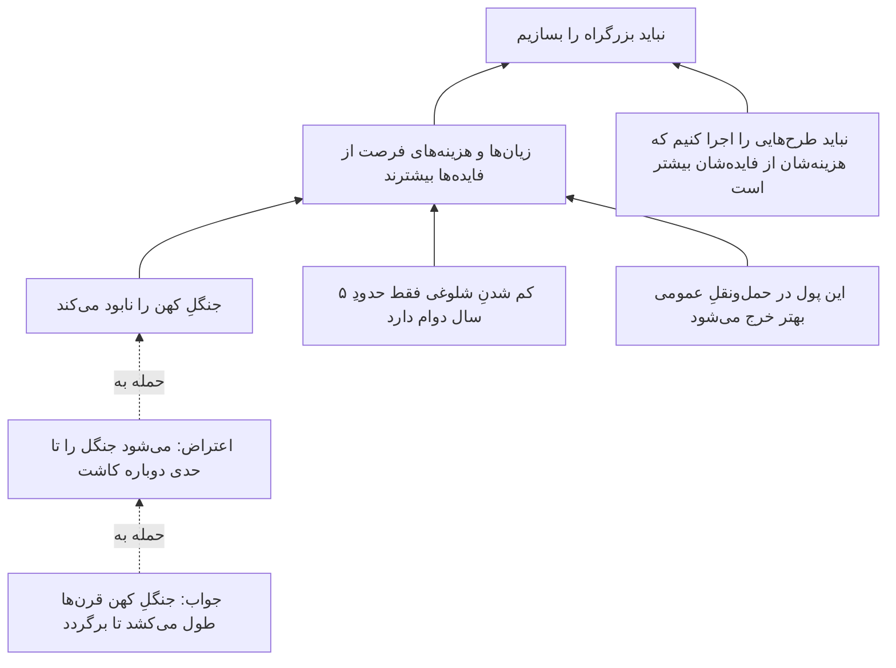
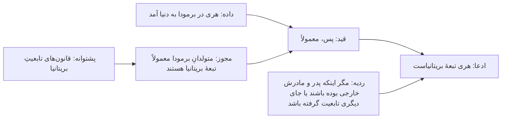

# فصل ۳. منطق و کالبدشناسیِ استدلال

[← قبلی: تاریخِ نظریهٔ معرفت](02-history-of-epistemology.md) · [فهرست](README.md) · [بعدی: زبان، مفهوم‌ها و تعریف‌ها ←](04-language-concepts-and-definitions.md)

**صوت:** [شنیدنِ این فصل](audio/03-logic-and-arguments.mp3) (۴۹ دقیقه، روایت به انگلیسی) · [باز کردن در پخش‌کننده](audio/index.html#03)

---

> «برعکس، اگر این‌طور بود، ممکن بود باشد؛ و اگر این‌طور می‌بود، می‌بود؛ اما چون نیست، نیست. منطق یعنی همین.»
> — تویدل‌دی، در *آن سوی آینه*ٔ لوئیس کارول (۱۸۷۱)

> «وضعِ مقدمِ یک نفر رفعِ تالیِ نفرِ دیگر است.»
> — گفته‌ای میانِ فیلسوفان

معرفت‌شناسی می‌پرسد باورها کِی موجه‌اند. خیلی وقت‌ها یک باور موجه است چون *باورهای دیگری* از راهِ استدلال از آن پشتیبانی می‌کنند. **منطق** بررسیِ این است که کدام الگوهای استدلال خوب‌اند، یعنی کدام الگوها پشتیبانی را از مقدمه‌ها به نتیجه‌ها می‌رسانند. این فصل به شما یاد می‌دهد استدلال‌ها را بشناسید، آن‌ها را به شکلِ استاندارد بنویسید، اعتبار و قوتشان را بسنجید، مقدمه‌های پنهان را پیدا کنید، و نقشهٔ استدلال‌های پیچیده را بکشید. این‌ها مهارت‌های فنیِ اصلیِ تفکرِ نقادانه‌اند و در همهٔ فصل‌های بعد به کارتان می‌آیند.

---

## استدلال چیست و چه نیست

در منطق، **استدلال** به معنای دعوا نیست. استدلال مجموعه‌ای از جمله‌هاست که در آن بعضی جمله‌ها (**مقدمه‌ها**) به‌عنوانِ دلیل برای جملهٔ دیگری (**نتیجه**) آورده می‌شوند.

> مقدمه: همهٔ پستانداران هوا تنفس می‌کنند.
> مقدمه: نهنگ‌ها پستاندارند.
> نتیجه: پس نهنگ‌ها هوا تنفس می‌کنند.

خیلی چیزها شبیهِ استدلال‌اند اما استدلال نیستند:

- **ادعاها.** «مالیات‌ها خیلی بالاست.» یک ادعا، بدونِ هیچ دلیلی.
- **توضیح‌ها (تبیین‌ها).** «لیوان شکست چون روی کاشی افتاد.» این جمله نمی‌خواهد *ثابت کند* که لیوان شکسته است (این را از قبل می‌دانیم). می‌گوید *چرا* شکسته است. این فرق مهم است: در استدلال، مقدمه‌ها قرار است از نتیجه بهتر دانسته شده باشند؛ در توضیح، چیزی که توضیح داده می‌شود معمولاً از قبل پذیرفته شده است. یک جمله با «چون» بسته به موقعیت می‌تواند هر کدام از این دو باشد.
- **مثال‌ها.** «خیلی از پرندگان نمی‌توانند پرواز کنند، مثلاً پنگوئن‌ها و شترمرغ‌ها.» مثال چیزی را نشان می‌دهد، ثابت نمی‌کند.
- **شرطی‌ها.** «اگر باران ببارد، مسابقه لغو می‌شود.» این جمله نمی‌گوید باران خواهد بارید یا مسابقه لغو شده است. فقط رابطه‌ای را بیان می‌کند. یک شرطی می‌تواند مقدمه‌ای در استدلال باشد، اما خودش استدلال نیست.
- **گزارشِ باور.** «فکر می‌کنم اقتصاد بهتر شود.» جمله‌ای دربارهٔ حالتِ ذهنیِ یک نفر.
- **شعار و لفاظی.** «هر آدمِ درستی می‌داند این سیاست فاجعه است!» فشارِ احساسی، نه دلیل.

**کلمه‌های نشانه** کمک می‌کنند بخش‌های یک استدلال را پیدا کنید.

| نشانه‌های نتیجه | نشانه‌های مقدمه |
|---|---|
| پس، بنابراین، به همین دلیل، در نتیجه، نتیجه می‌گیریم که، که نشان می‌دهد، می‌شود نتیجه گرفت که، این‌طور | چون، زیرا، چون‌که، با توجه به اینکه، همان‌طور که ... نشان می‌دهد، دلیلش این است که، از آنجا که، با فرضِ اینکه |

نشانه‌ها مفیدند اما همیشه قابل‌اعتماد نیستند. «از آنجا که» گاهی معنای مکانی دارد، و خیلی از استدلال‌ها اصلاً کلمهٔ نشانه ندارند. آزمونِ واقعی این پرسش است: *این آدم می‌خواهد من چه چیزی را باور کنم، و برای آن چه دلیلی می‌آورد؟*

---

## شکلِ استاندارد

برای ارزیابیِ یک استدلال، اول آن را به **شکلِ استاندارد** بنویسید: مقدمه‌ها را شماره بزنید، نتیجه را آخر بگذارید، و بینشان یک خط بکشید.

> سرمقاله‌ای در روزنامه می‌گوید: «نباید بزرگراهِ تازه را بسازیم. جنگلِ کهن را نابود می‌کند، و مطالعه‌های ترافیکی نشان می‌دهد فقط حدودِ پنج سال از شلوغی کم می‌کند تا اینکه ترافیکِ تازه دوباره پرش کند. از این گذشته، این پول اگر خرجِ حمل‌ونقلِ عمومی شود فایدهٔ بیشتری دارد.»

به شکلِ استاندارد:

1. بزرگراهِ تازه جنگلِ کهن را نابود می‌کند.
2. بزرگراه فقط حدودِ پنج سال از شلوغی کم می‌کند (به‌خاطرِ تقاضای القایی، یعنی جادهٔ بیشتر ماشینِ بیشتری را به خیابان می‌کشد).
3. همین پول اگر خرجِ حمل‌ونقلِ عمومی شود فایدهٔ بیشتری دارد.
4. *(ناگفته)* نباید طرحی را اجرا کنیم که زیان‌ها و هزینه‌های فرصتش (یعنی فایده‌هایی که به‌خاطرش از دست می‌دهیم) از فایده‌هایش بیشتر است.
5. *(ناگفته)* زیان‌ها و هزینه‌های فرصتِ بزرگراه از فایده‌هایش بیشتر است.
-----
ن. نباید بزرگراهِ تازه را بسازیم.

توجه کنید که برای بازسازی مجبور شدیم مقدمه‌های ۴ و ۵ را اضافه کنیم. سرمقاله این‌ها را فرض کرده بود اما نگفته بود. اضافه کردنِ منصفانهٔ این **مقدمه‌های ناگفته** یکی از مهم‌ترین مهارت‌های تفکرِ نقادانه است. نگاه کنید به [اضافه کردنِ مقدمه‌های ناگفته](#supplying-missing-premises).

شکلِ استاندارد *ساختارِ* استدلال را هم نشان می‌دهد. مقدمه‌های ۱ تا ۳ دلیل‌هایی جدا نیستند که هر کدام به‌تنهایی نتیجه را موجه کنند. آن‌ها با هم از مقدمهٔ ۵ پشتیبانی می‌کنند، و مقدمهٔ ۵ همراه با مقدمهٔ ۴ به نتیجه می‌رسد. این ساختار به شما می‌گوید نقد را کجا نشانه بگیرید. کسی که می‌خواهد بزرگراه ساخته شود باید ۱، ۲ یا ۳ را زیرِ سؤال ببرد، یا نشان دهد که فایده‌ها بزرگ‌تر از آن‌اند که سرمقاله می‌گوید، و این مقدمهٔ ۵ را سست می‌کند.

---

## قیاس، استقرا و ابداکشن

استدلال‌ها معمولاً بر اساسِ نوعِ پشتیبانی‌ای که مقدمه‌ها *قرار است* به نتیجه بدهند دسته‌بندی می‌شوند.

**استدلال‌های قیاسی** (deductive) می‌خواهند نشان دهند که اگر مقدمه‌ها درست باشند، نتیجه *حتماً* درست است. پیوندشان ضروری است.

> همهٔ فلزها رسانای برق‌اند. مس فلز است. پس مس رسانای برق است.

**استدلال‌های استقرایی** (inductive) می‌خواهند نشان دهند که اگر مقدمه‌ها درست باشند، نتیجه *احتمالاً* درست است. پیوندشان از جنسِ احتمال است. شکل‌های رایج:

- **استقرای شمارشی** (تعمیم از یک نمونه): «هر زمردی که تا حالا بررسی شده سبز بوده، پس همهٔ زمردها سبزند.»
- **قیاسِ آماری** (از یک نرخِ کلی به یک مورد): «۹۰٪ بیمارانی که این نشانه‌ها را دارند آنفولانزا دارند؛ این بیمار این نشانه‌ها را دارد؛ پس این بیمار احتمالاً آنفولانزا دارد.»
- **استدلال از راهِ تمثیل** (شباهت): «موش و انسان در بدن‌کارکردِ مربوط به این موضوع شبیه‌اند؛ این دارو به کبدِ موش آسیب می‌زند؛ پس احتمالاً به کبدِ انسان هم آسیب می‌زند.»
- **پیش‌بینی**: «خورشید در همهٔ تاریخِ ثبت‌شده هر روز طلوع کرده، پس فردا هم طلوع می‌کند.»

**استدلال‌های ابداکتیو** (abductive؛ اصطلاحی از چارلز سندرز پرس)، که اغلب **استنتاج از راهِ بهترین تبیین** (IBE؛ اصطلاحی از گیلبرت هارمن، ۱۹۶۵) نامیده می‌شوند، نتیجه می‌گیرند که یک فرضیه درست است چون شواهد را بهتر از همه توضیح می‌دهد.

> پنجرهٔ آشپزخانه شکسته، روی زمین گل هست، و جعبهٔ جواهرات خالی است. بهترین توضیح دزدی است. پس احتمالاً دزدی شده است.

شرلوک هولمز روشش را «استنتاجِ قیاسی» می‌نامد، اما تقریباً همیشه ابداکشن است. وقتی به واتسون می‌گوید «می‌بینم که در افغانستان بوده‌اید»، دارد بهترین توضیح را برای آفتاب‌سوختگی، ظاهر و بازوی آسیب‌دیدهٔ واتسون پیدا می‌کند.

| | قیاس | استقرا | ابداکشن |
|---|---|---|---|
| جهت | از کلی به جزئی، یا از قاعده به مورد (معمولاً) | از موردهای دیده‌شده به ادعاهای کلی یا دربارهٔ آینده | از شواهد به بهترین توضیحِ آن‌ها |
| نوعِ پشتیبانی | ضروری (اگر معتبر باشد) | احتمالی | احتمالی، توضیحی |
| ممکن است مقدمه‌ها درست و نتیجه نادرست باشد؟ | اگر معتبر باشد، نه | بله | بله |
| اضافه کردنِ مقدمه | نمی‌تواند استدلالِ معتبر را نامعتبر کند (یکنوا) | می‌تواند استنتاج را قوی‌تر یا ضعیف‌تر کند (نایکنوا) | می‌تواند بهترین توضیح را عوض کند (نایکنوا) |
| معرفت را گسترش می‌دهد؟ | آنچه را در مقدمه‌ها پنهان است آشکار می‌کند | از مقدمه‌ها فراتر می‌رود | از مقدمه‌ها فراتر می‌رود و فرضیه‌های تازه می‌آورد |
| چهرهٔ کلیدی | ارسطو، فرگه | هیوم، میل | پرس، هارمن، لیپتون |

شعارِ «از کلی به جزئی» برای قیاس فقط راهنمایی تقریبی است. «سقراط انسان است و سقراط می‌میرد، پس چیزی هست که هم انسان است و هم می‌میرد» قیاسی است، اما از جزئی به کلی می‌رود.

ردیفِ **یکنوایی** ارزشِ به خاطر سپردن دارد. قیاس **یکنوا** (monotonic) است: اگر مقدمه‌های P به‌طورِ قیاسی نتیجهٔ C را بدهند، P به‌علاوهٔ هر مقدمهٔ دیگری هم C را می‌دهد. استدلالِ غیرقیاسی **نایکنوا** است: «تویتی پرنده است، پس تویتی پرواز می‌کند» استنتاجِ خوبی است، اما اگر «تویتی پنگوئن است» را اضافه کنید، شکست می‌خورد. بیشترِ استدلال‌های دنیای واقعی نایکنوا هستند، و برای همین [ابطال‌کننده‌ها](06-justification.md#defeaters) در معرفت‌شناسی این‌قدر مهم‌اند.

> **پیوند.** استقرا یکی از مشهورترین مسئله‌های فلسفه را پیش می‌کشد: چطور می‌تواند *عقلانی* باشد که از شواهدمان فراتر برویم؟ نگاه کنید به [مسئلهٔ استقرای هیوم](09-induction-probability-bayes.md#humes-problem-of-induction). ابداکشن در علم و کارآگاهی نقشِ اصلی دارد؛ نگاه کنید به [استنتاج از راهِ بهترین تبیین](10-science-and-evidence.md#inference-to-the-best-explanation).

---

## اعتبار و درستی

یک استدلالِ قیاسی **معتبر** (valid) است اگر و فقط اگر *ممکن نباشد* که همهٔ مقدمه‌هایش درست باشند و نتیجه‌اش نادرست. اعتبار به **شکلِ** استدلال مربوط است، نه به محتوایش. یعنی به پیوندِ میانِ مقدمه‌ها و نتیجه مربوط است، نه به اینکه مقدمه‌ها واقعاً درست‌اند یا نه.

یک استدلالِ معتبر با مقدمه‌های نادرست:

> همهٔ ماهی‌ها می‌توانند پرواز کنند. همهٔ سگ‌ها ماهی‌اند. پس همهٔ سگ‌ها می‌توانند پرواز کنند.

این استدلال **معتبر** است: *اگر* مقدمه‌ها درست بودند، نتیجه حتماً درست بود. فقط استدلالِ خوبی نیست، چون مقدمه‌هایش نادرست‌اند.

یک استدلالِ نامعتبر با مقدمه‌ها و نتیجهٔ درست:

> همهٔ سگ‌ها پستاندارند. بعضی پستانداران حیوانِ خانگی‌اند. پس بعضی سگ‌ها حیوانِ خانگی‌اند.

همهٔ جمله‌ها درست‌اند، اما استدلال **نامعتبر** است. مقدمه‌ها نتیجه را تضمین نمی‌کنند. استدلالی با همین شکل را مقایسه کنید: «همهٔ سگ‌ها پستاندارند. بعضی پستانداران نهنگ‌اند. پس بعضی سگ‌ها نهنگ‌اند.» مقدمه‌ها درست، نتیجه نادرست. چون این شکل می‌تواند از مقدمه‌های درست به نتیجهٔ نادرست برسد، نامعتبر است.

یک استدلال **درست** (sound) است اگر معتبر باشد *و* همهٔ مقدمه‌هایش درست باشند. (دقت کنید: وقتی دربارهٔ *استدلال* می‌گوییم «درست»، همین معنای فنی را در نظر داریم.) نتیجهٔ یک استدلالِ درست حتماً درست است.

| | همهٔ مقدمه‌ها درست | دست‌کم یک مقدمه نادرست |
|---|---|---|
| **معتبر** | استدلالِ درست: درستیِ نتیجه تضمین شده | استدلالِ نادرست: نتیجه ممکن است درست یا نادرست باشد |
| **نامعتبر** | استدلالِ نادرست: نتیجه ممکن است درست یا نادرست باشد | استدلالِ نادرست: نتیجه ممکن است درست یا نادرست باشد |

چهار نکته دربارهٔ اعتبار که مردم اغلب اشتباه می‌فهمند:

1. **استدلالِ معتبر می‌تواند نتیجهٔ نادرست داشته باشد** (اگر یکی از مقدمه‌ها نادرست باشد).
2. **استدلالِ نامعتبر می‌تواند نتیجهٔ درست داشته باشد.** نامعتبر بودن نشان نمی‌دهد نتیجه نادرست است؛ فقط نشان می‌دهد این استدلال نمی‌تواند آن را ثابت کند. اینکه از بد بودنِ یک استدلال نتیجه بگیریم ادعایش نادرست است، [مغالطهٔ مغالطه](15-fallacies.md#the-fallacy-fallacy) است.
3. **اگر استدلالی معتبر باشد و نتیجه‌اش نادرست، دست‌کم یکی از مقدمه‌ها نادرست است.** این موتورِ ابطال است.
4. **معتبر بودن با قانع‌کننده بودن یکی نیست.** استدلالِ معتبر اگر مقدمه‌هایش از نتیجه‌اش مشکوک‌تر باشند، به درد نمی‌خورد.

### روشِ مثالِ نقض

برای اینکه نشان دهید شکلی از استدلال نامعتبر است، یک **مثالِ نقض** پیدا کنید: استدلالی با همان شکل، که مقدمه‌هایش آشکارا درست و نتیجه‌اش آشکارا نادرست است. به این کار گاهی **رد از راهِ تمثیلِ منطقی** یا **استدلالِ هم‌شکل** می‌گویند.

> «آدم‌های موفق صبح زود بیدار می‌شوند. من صبح زود بیدار می‌شوم. پس موفق می‌شوم.»
>
> همان شکل: «گربه‌ها چهار پا دارند. میزِ من چهار پا دارد. پس میزِ من گربه است.»

استدلالِ دوم همان شکل را دارد و آشکارا شکست می‌خورد، پس آن شکل نامعتبر است. این فن در بحث‌های واقعی خیلی قوی است، چون به هیچ اصطلاحِ فنی‌ای نیاز ندارد. فقط می‌گویید: «با همین استدلال می‌شد نتیجه گرفت که...»

---

## قوت و استواری

استدلال‌های استقرایی و ابداکتیو معتبر یا نامعتبر نیستند. **قوی** یا **ضعیف**‌اند. یک استدلال **قوی** است اگر، به فرضِ درست بودنِ مقدمه‌ها، نتیجه احتمالاً درست باشد. **استوار** (cogent) است اگر قوی باشد *و* مقدمه‌هایش درست (یا پذیرفتنی) باشند. استواری برای استقرا همان نقشی را دارد که درستی برای قیاس.

قوت درجه دارد. مقایسه کنید:

> (الف) از ۵ نفر در یک باشگاهِ ورزشی پرسیدم؛ ۴ نفرشان هر روز ورزش می‌کنند. پس حدودِ ۸۰٪ مردم هر روز ورزش می‌کنند.
>
> (ب) یک نظرسنجیِ ملیِ تصادفی از ۱۰٬۰۰۰ بزرگسال نشان داد که ۲۳٪ هر روز ورزش می‌کنند (با خطای ±۱٪). پس حدودِ ۲۳٪ بزرگسالان هر روز ورزش می‌کنند.

(الف) خیلی ضعیف است (نمونه‌ای ریز و یک‌طرفه). (ب) قوی است.

قوتِ یک تعمیمِ استقرایی به این‌ها بستگی دارد:

- **اندازهٔ نمونه.** نمونه‌های بزرگ‌تر خطای تصادفی را کم می‌کنند.
- **نماینده بودن.** آیا نمونه از سوگیریِ انتخاب پاک است؟ نمونه‌ای از آدم‌هایی که به باشگاه می‌روند، دربارهٔ عادت‌های ورزشی، نمایندهٔ کلِ مردم نیست.
- **تنوع.** آیا نمونه‌ها در شرایطِ خیلی متفاوت دیده شده‌اند؟
- **قوتِ ادعا.** پشتیبانی از «بیشترِ زمردها سبزند» آسان‌تر از «همهٔ زمردها سبزند» است.
- **دانشِ زمینه‌ای.** آیا سازوکارِ پشتِ ماجرا را می‌شناسیم؟ آیا می‌دانیم این نوع ویژگی معمولاً در یک گروه یکسان است؟ رسانایی مس در همهٔ نمونه‌ها یکسان است؛ نظرهای سیاسیِ آدم‌ها نیست.

قوتِ **استدلال از راهِ تمثیل** به تعداد و ربطِ شباهت‌ها، تعداد و ربطِ تفاوت‌ها، و تنوعِ موردهایی که مقایسه شده‌اند بستگی دارد. موش و انسان آنزیم‌های کبدیِ مربوط به سوخت‌وسازِ دارو را مشترک دارند؛ اما از خیلی جهت‌های دیگر با هم فرق دارند، و بعضی از این فرق‌ها ممکن است مهم باشند.

قوتِ **استدلالِ ابداکتیو** به این بستگی دارد که آیا فرضیه *بهترین* توضیحِ در دسترس است یا نه، و برای فهمیدنِ این باید آن را با رقیب‌هایش مقایسه کرد. یک توضیح ممکن است خوب به نظر برسد تا وقتی که کسی توضیحِ بهتری به ذهنش برسد. این رایج‌ترین راهِ شکستِ استدلالِ ابداکتیو است. نگاه کنید به [استنتاج از راهِ بهترین تبیین](10-science-and-evidence.md#inference-to-the-best-explanation).

---

## منطقِ گزاره‌ها

**منطقِ گزاره‌ها** (منطقِ جمله‌ها) بررسی می‌کند که درست یا نادرست بودنِ جمله‌های مرکب چطور به درست یا نادرست بودنِ بخش‌هایشان بستگی دارد. این ساده‌ترین منطقِ جدید است و برای تحلیلِ خیلی از استدلال‌های روزمره کافی است.

### رابط‌ها و جدول‌های ارزش

فرض کنید *P* و *Q* جای هر جمله‌ای باشند. **رابط‌های** اصلی این‌ها هستند:

| رابط | نماد | به زبانِ روزمره | درست است وقتی |
|---|---|---|---|
| نفی | `¬P` | نه P | P نادرست باشد |
| عطف | `P ∧ Q` | P و Q | هر دو درست باشند |
| فصل | `P ∨ Q` | P یا Q (یا هر دو) | دست‌کم یکی درست باشد |
| شرطی | `P → Q` | اگر P آن‌گاه Q | این‌طور نباشد که P درست و Q نادرست باشد |
| دوشرطی | `P ↔ Q` | P اگر و فقط اگر Q | P و Q هر دو درست یا هر دو نادرست باشند |

جدولِ ارزشِ کامل (د = درست، ن = نادرست):

| `P` | `Q` | `¬P` | `P ∧ Q` | `P ∨ Q` | `P → Q` | `P ↔ Q` |
|---|---|---|---|---|---|---|
| د | د | ن | د | د | د | د |
| د | ن | ن | ن | د | ن | ن |
| ن | د | د | ن | د | د | ن |
| ن | ن | د | ن | ن | د | د |

توجه کنید که «یا»ی منطقی **شامل** است: «P یا Q» وقتی هر دو درست‌اند هم درست است. در زبانِ روزمره گاهی «یا»ی **انحصاری** به کار می‌رود («سوپ یا سالاد» معمولاً یعنی نه هر دو). وقتی استدلالی را تحلیل می‌کنید، ببینید کدام منظور است. استدلالی که به «یا»ی انحصاری تکیه دارد در حالی که فقط «یا»ی شامل موجه است، دچارِ مغالطهٔ [تأییدِ یک طرفِ «یا»](#formal-fallacies) می‌شود.

دو هم‌ارزیِ مفید، **قانون‌های دمورگان**:

- `¬(P ∧ Q) ≡ ¬P ∨ ¬Q`: «این‌طور نیست که هم P و هم Q» یعنی «یا P نیست یا Q نیست.»
- `¬(P ∨ Q) ≡ ¬P ∧ ¬Q`: «نه P و نه Q» یعنی «P نیست، و Q هم نیست.»

اشتباه‌های روزمره با «نه» رایج‌اند. «درست نیست که همهٔ سیاستمداران فاسدند» یعنی «بعضی سیاستمداران فاسد نیستند»؛ به معنای «هیچ سیاستمداری فاسد نیست» *نیست*.

### شرطی

شرطیِ «اگر P آن‌گاه Q» مهم‌ترین و بدفهمیده‌ترین رابط است. به P **مقدم** و به Q **تالی** می‌گویند.

جدولِ ارزش می‌گوید `P → Q` فقط وقتی نادرست است که P درست و Q نادرست باشد. این **شرطیِ مادی** نتیجه‌های عجیبی دارد: «اگر ماه از پنیر ساخته شده باشد، آن‌گاه `2 + 2 = 5`» درست از آب درمی‌آید، چون مقدمش نادرست است. به این‌ها **پارادوکس‌های استلزامِ مادی** می‌گویند. شرطی‌های زبانِ روزمره پیچیده‌ترند، و منطق‌دانان نظریه‌های دیگری هم ساخته‌اند (شرطی‌های اکید، شرطی‌های خلافِ واقع، نظریه‌های احتمالی). برای ارزیابیِ استدلال‌ها، این نکته‌های کلیدی در همهٔ نظریه‌ها درست‌اند:

- اگر `P → Q` درست باشد و P درست باشد، آن‌گاه Q درست است.
- اگر `P → Q` درست باشد و Q نادرست باشد، آن‌گاه P نادرست است.
- از `P → Q` نتیجه *نمی‌شود* که `Q → P` (**عکسِ** آن).
- از `P → Q` نتیجه *نمی‌شود* که `¬P → ¬Q` (**وارونِ** آن).
- `P → Q` با `¬Q → ¬P` (**عکسِ نقیضِ** آن) هم‌ارز *است*.

| جمله | شکل | هم‌ارزِ جملهٔ اصلی؟ |
|---|---|---|
| اگر سگ است، پستاندار است. | `P → Q` | (جملهٔ اصلی) |
| اگر پستاندار است، سگ است. | `Q → P` (عکس) | **نه** |
| اگر سگ نیست، پستاندار نیست. | `¬P → ¬Q` (وارون) | **نه** |
| اگر پستاندار نیست، سگ نیست. | `¬Q → ¬P` (عکسِ نقیض) | **بله** |

خیلی از عبارت‌های روزمره در واقع شرطی‌هایی با لباسِ مبدل‌اند:

- «Q اگر P» = `P → Q`
- «P فقط اگر Q» = `P → Q` (توجه: `Q → P` *نیست*)
- «P مگر اینکه Q» = `¬Q → P` (یا، به همان معنا، `P ∨ Q`)
- «هیچ P‌ای بدونِ Q نیست» = `P → Q`
- «همهٔ Pها Q‌اند» = برای هر x، اگر x یک P باشد، x یک Q است

«فقط اگر» تقریباً همه را زمین می‌زند. «فقط اگر ثبت‌نام کرده باشید می‌توانید رأی بدهید» یعنی: اگر رأی می‌دهید، ثبت‌نام کرده‌اید. این به آن معنا *نیست* که ثبت‌نام کردن تضمین می‌کند بتوانید رأی بدهید (شاید به سنِ قانونی هم نیاز داشته باشید).

### شرط‌های لازم و کافی

شرطی‌ها **شرط‌های لازم** و **کافی** را بیان می‌کنند. این دو مفهوم مفیدترین ابزار برای تحلیلِ تعریف‌ها و ادعاها هستند.

- P برای Q **کافی** است اگر درست بودنِ P درست بودنِ Q را تضمین کند: `P → Q`.
- Q برای P **لازم** است اگر P نتواند بدونِ Q درست باشد: `P → Q`.

*همان* شرطی هر دو را بیان می‌کند. در «اگر مربع است، مستطیل است»: مربع بودن برای مستطیل بودن کافی است؛ مستطیل بودن برای مربع بودن لازم است.

| نمونه | لازم؟ | کافی؟ |
|---|---|---|
| اکسیژن، برای آتش | بله | نه (سوخت و گرما هم لازم است) |
| مربع بودن، برای مستطیل بودن | نه | بله |
| سه ضلع داشتن، برای مثلث بودن (شکلِ بستهٔ صاف با ضلع‌های راست) | بله | بله |
| خریدنِ بلیتِ بخت‌آزمایی، برای بردنِ بخت‌آزمایی | بله | نه |
| گردن زدن، برای مرگ | نه | بله |

قاطی کردنِ شرط‌های لازم و کافی خیلی از استدلال‌های بد را می‌سازد:

- «سخت‌کوشی برای موفقیت لازم است، پس اگر سخت کار کنم موفق می‌شوم.» (لازم را کافی گرفتن.)
- «سیگار کشیدن برای بالا بردنِ خطرِ سرطان کافی است، پس اگر سیگار نکشم خطرم بالا نمی‌رود.» (کافی را لازم گرفتن.)
- «پول شادی را تضمین نمی‌کند، پس برای شادی اهمیتی ندارد.» (رد کردنِ کافی بودن، و بعد این نتیجهٔ غلط که آن عامل هیچ اثری ندارد.)

خیلی از علت‌های واقعی نه لازم‌اند و نه کافی. آن‌ها **شرط‌های INUS** هستند (جی. ال. مکی، ۱۹۶۵): بخشی *ناکافی* اما *ضروری* از شرطی که خودش *غیرلازم* اما *کافی* است. اتصالیِ برق یک شرطِ INUS برای آتش‌سوزیِ خانه است: به‌تنهایی کافی نیست (مادهٔ آتش‌گیر و اکسیژن هم لازم است)، لازم هم نیست (آتش علت‌های دیگری هم دارد)، اما بخشی ضروری از یک مجموعهٔ کافی از شرط‌هاست. نگاه کنید به [علیت و استنتاجِ علّی](10-science-and-evidence.md#causation-and-causal-inference).

---

## شکل‌های معتبرِ استدلال

این الگوها معتبرند. یاد بگیرید آن‌ها را در زبانِ روزمره تشخیص دهید.

**وضعِ مقدم** (modus ponens)
> اگر P آن‌گاه Q. P. پس Q.
> *اگر باران می‌بارد، زمین خیس است. باران می‌بارد. پس زمین خیس است.*

**رفعِ تالی** (modus tollens)
> اگر P آن‌گاه Q. نه Q. پس نه P.
> *اگر بیمار سرخک داشت، جوش‌های پوستی داشت. جوش ندارد. پس سرخک ندارد.*

رفعِ تالی شکلِ منطقیِ **ابطال** در علم است: اگر نظریه درست باشد، O را خواهیم دید؛ O را نمی‌بینیم؛ پس نظریه نادرست است. نگاه کنید به [پوپر و ابطال‌گرایی](10-science-and-evidence.md#popper-and-falsificationism).

**قیاسِ شرطیِ زنجیره‌ای**
> اگر P آن‌گاه Q. اگر Q آن‌گاه R. پس اگر P آن‌گاه R.

**قیاسِ «یا»** (قیاسِ انفصالی)
> P یا Q. نه P. پس Q.
> *کلیدها یا در جیبِ کتم هستند یا روی میز. در جیبِ کتم نیستند. پس روی میزند.*

**دوراهیِ سازنده**
> اگر P آن‌گاه R. اگر Q آن‌گاه S. P یا Q. پس R یا S.

**برهانِ خلف** (reductio ad absurdum؛ اثباتِ غیرمستقیم)
> P را فرض کن. از P یک تناقض (یا چیزی آشکارا نادرست) بیرون بکش. پس نه P.

نمونهٔ کلاسیکش اثباتِ گنگ بودنِ `√2` است (یعنی نمی‌شود آن را به شکلِ کسری از دو عددِ صحیح نوشت): فرض کنید `√2 = a/b` در ساده‌ترین شکل؛ آن‌گاه `a² = 2b²`، پس *a* زوج است، پس `a = 2k`، پس `4k² = 2b²`، پس `b² = 2k²`، پس *b* هم زوج است؛ اما در این صورت a/b در ساده‌ترین شکل نبود، و این تناقض است. پس `√2` نسبتِ دو عددِ صحیح نیست.

برهانِ خلف قوی‌ترین حرکتِ غیرصوری در استدلالِ فلسفی هم هست. ادعای طرفِ مقابل را برای پیش بردنِ بحث قبول می‌کنید، بعد نشان می‌دهید که به نتیجه‌ای می‌رسد که خودش آن را رد می‌کند. الِنخوسِ سقراط رشته‌ای از برهان‌های خلف است.

**عطف، جدا کردن، افزودن** (ساده اما مفید)
> P. Q. پس P و Q. / P و Q. پس P. / P. پس P یا Q.

> **«وضعِ مقدمِ یک نفر رفعِ تالیِ نفرِ دیگر است.»** اگر استدلالی معتبر دارید، «اگر P آن‌گاه Q؛ P؛ پس Q»، و کسی Q را باورنکردنی می‌داند، ممکن است استدلال را برعکس اجرا کند: «اگر P آن‌گاه Q؛ نه Q؛ پس نه P.» منطق به شما می‌گوید P و Q با هم می‌مانند یا با هم می‌افتند. اما نمی‌گوید کدام طرف را انتخاب کنید. این بستگی دارد به اینکه به P مطمئن‌ترید یا به نفیِ Q. جی. ای. مور دقیقاً همین ساختار را علیهِ شکاکیت به کار برد. شکاک استدلال می‌کند: «اگر نتوانم احتمالِ خواب دیدن را کنار بگذارم، نمی‌دانم دست دارم؛ نمی‌توانم کنارش بگذارم؛ پس نمی‌دانم دست دارم.» مور جواب داد: «*می‌دانم* دست دارم؛ پس یا می‌توانم احتمالِ خواب دیدن را کنار بگذارم، یا مقدمهٔ اول نادرست است.» نگاه کنید به [موریسم](08-skepticism.md#mooreanism).

---

## مغالطه‌های صوری

**مغالطهٔ صوری** استدلالی است که *شکلش* نامعتبر است. این‌ها رایج‌ترین‌ها هستند. هر کدام یک همزادِ معتبر دارد که شبیهِ آن است.

**وضعِ تالی**
> اگر P آن‌گاه Q. Q. پس P.
> *اگر جاسوس بود، مضطرب بود. مضطرب است. پس جاسوس است.*

نامعتبر: ممکن است به دلیل‌های دیگری مضطرب باشد. این مغالطه در استدلال دربارهٔ شواهد خیلی رایج است: «اگر فرضیه‌ام درست باشد، این نتیجه را می‌بینیم؛ نتیجه را می‌بینیم؛ پس فرضیه‌ام درست است.» آن نتیجه فقط تا جایی فرضیه را تأیید می‌کند که با فرضِ آن فرضیه محتمل‌تر باشد تا با فرضِ فرضیه‌های دیگر. نگاه کنید به [شواهد و تأیید](09-induction-probability-bayes.md#evidence-and-confirmation).

**رفعِ مقدم**
> اگر P آن‌گاه Q. نه P. پس نه Q.
> *اگر سیگار بکشی، به ریه‌هایت آسیب می‌زنی. سیگار نمی‌کشی. پس به ریه‌هایت آسیب نمی‌زنی.*

نامعتبر: آلودگیِ هوا، آزبست و علت‌های دیگر هم هستند.

**تأییدِ یک طرفِ «یا»**
> P یا Q. P. پس نه Q.
> *یا باهوش است یا سخت‌کوش. باهوش است. پس سخت‌کوش نیست.*

با «یا»ی شامل نامعتبر است.

**حدِ وسطِ غیرمستغرق**
> همهٔ A‌ها B‌اند. همهٔ C‌ها B‌اند. پس همهٔ A‌ها C‌اند.
> *همهٔ کمونیست‌ها از بیمهٔ درمانیِ همگانی پشتیبانی می‌کنند. نمایندهٔ من از بیمهٔ درمانیِ همگانی پشتیبانی می‌کند. پس نمایندهٔ من کمونیست است.*

این ساختارِ «گناه از راهِ همنشینی» است.

**عکسِ نادرست**
> همهٔ A‌ها B‌اند. پس همهٔ B‌ها A‌اند.
> *همهٔ تروریست‌ها افراطی‌اند، پس همهٔ افراطی‌ها تروریست‌اند.*

**جابه‌جا کردنِ سورها**
> هر کسی مادری دارد. پس کسی هست که مادرِ همه است.
> `∀x ∃y (y مادرِ x است) ⊢ ∃y ∀x (y مادرِ x است)`. نامعتبر.

یک نمونهٔ مشهورش در استدلال‌هایی از این نوع دیده می‌شود: «هر رویدادی علتی دارد، پس چیزی هست که علتِ همهٔ رویدادهاست.» مقدمه، حتی اگر درست باشد، این نتیجه را نمی‌دهد. نگاه کنید به [منطقِ محمولات و سورها](#predicate-logic-and-quantifiers).

**مغالطهٔ وجهی**
> ضرورتاً، اگر P را بدانم آن‌گاه P درست است. P را می‌دانم. پس P ضرورتاً درست است.

نامعتبر: از `□(K → P)` و K فقط P نتیجه می‌شود، نه `□P`. این مغالطه *ضروری بودنِ رابطهٔ شرطی* را با *ضروری بودنِ تالی* اشتباه می‌گیرد. در استدلال‌هایی دربارهٔ تقدیر و علمِ پیشینِ خدا پیدا می‌شود («اگر خدا می‌داند که X را انجام خواهم داد، پس ضرورتاً X را انجام خواهم داد»). نگاه کنید به [مبانیِ منطقِ وجهی](#modal-logic-basics).

---

## منطقِ حملی و قیاس

منطقِ ارسطو با چهار نوع **جملهٔ حملی** سروکار دارد:

| نوع | شکل | نمونه |
|---|---|---|
| **A** (موجبهٔ کلیه: همه) | همهٔ Sها P‌اند | همهٔ انسان‌ها می‌میرند. |
| **E** (سالبهٔ کلیه: هیچ) | هیچ Sای P نیست | هیچ خزنده‌ای پستاندار نیست. |
| **I** (موجبهٔ جزئیه: بعضی) | بعضی Sها P‌اند | بعضی پرندگان پرواز نمی‌کنند. |
| **O** (سالبهٔ جزئیه: بعضی نه) | بعضی Sها P نیستند | بعضی سیاستمداران درستکار نیستند. |

**مربعِ تقابل** رابطه‌های میانِ این‌ها را نشان می‌دهد. A و O **متناقض**‌اند (دقیقاً یکی از آن‌ها درست است)، و E و I هم همین‌طور. پس برای رد کردنِ «همهٔ قوها سفیدند» (A) فقط یک قوی سیاه (O) لازم است. برای رد کردنِ «هیچ واکسنی عارضهٔ جانبی ندارد» (E) یک واکسن با عارضه (I) کافی است. این نکتهٔ ساده در بحث‌ها اغلب فراموش می‌شود: ادعای کلی با یک مثالِ نقض رد می‌شود، اما برای ثابت کردنِ ادعای کلی خیلی بیشتر از یک مثال لازم است.

**قیاسِ حملی** دو مقدمه و یک نتیجه دارد که هر سه جملهٔ حملی‌اند، و سه «حد» (اصطلاح) در آن به کار می‌رود. مشهورترین شکلِ معتبرش **بربارا** نام دارد (مصوت‌های این کلمه AAA را نشان می‌دهند؛ در منطقِ سنتیِ ما، ضربِ اولِ شکلِ اول):

> همهٔ Mها P‌اند. همهٔ Sها M‌اند. پس همهٔ Sها P‌اند.
> *همهٔ پستانداران خون‌گرم‌اند. همهٔ نهنگ‌ها پستاندارند. پس همهٔ نهنگ‌ها خون‌گرم‌اند.*

می‌توانید قیاس‌ها را با **نمودارهای ون** یا با قاعده‌های سنتی بسنجید:

1. حدِ وسط باید دست‌کم یک بار **مستغرق** باشد (یعنی به همهٔ اعضای گروهش اشاره کند). (زیر پا گذاشتنِ این قاعده [حدِ وسطِ غیرمستغرق](#formal-fallacies) را می‌سازد.)
2. هر حدی که در نتیجه مستغرق است باید در مقدمه‌اش هم مستغرق باشد. (زیر پا گذاشتنِ این قاعده **اکبرِ نامشروع** یا **اصغرِ نامشروع** نام دارد.)
3. از دو مقدمهٔ منفی هیچ نتیجه‌ای بیرون نمی‌آید.
4. اگر یک مقدمه منفی باشد، نتیجه هم باید منفی باشد، و برعکس.

منطقِ قیاسی محدود است (نمی‌تواند با رابطه‌هایی مثلِ «بلندتر از» یا با چند سور در یک جمله کار کند)، و برای همین منطقِ محمولات جایش را گرفت. اما شکل‌های A/E/I/O و مربعِ تقابل هنوز برای پیدا کردنِ خطاهای روزمره به کار می‌آیند.

---

## منطقِ محمولات و سورها

**منطقِ محمولات** (منطقِ مرتبهٔ اول)، که فرگه در ۱۸۷۹ ساخت، جمله‌ها را به محمول‌ها، نام‌ها، متغیرها و **سورها** تجزیه می‌کند:

- **سورِ کلی** `∀x`: «برای هر x»
- **سورِ وجودی** `∃x`: «x‌ای هست» (دست‌کم یکی)

«همهٔ انسان‌ها می‌میرند»: `∀x (Human(x) → Mortal(x))`
«بعضی پرندگان نمی‌توانند پرواز کنند»: `∃x (Bird(x) ∧ ¬Flies(x))`
«هر کسی کسی را دوست دارد»: `∀x ∃y Loves(x, y)`
«کسی هست که همه دوستش دارند»: `∃y ∀x Loves(x, y)`

دو نمونهٔ آخر نشان می‌دهند چرا **ترتیبِ سورها** مهم است، و چرا [جابه‌جا کردنِ سورها](#formal-fallacies) مغالطه است. «هر کسی کسی را دوست دارد» پذیرفتنی است؛ «کسی هست که همه دوستش دارند» نیست.

**ابهامِ دامنه** در زبانِ روزمره از ترکیبِ سورها و «نه» پیدا می‌شود:

- «همه در امتحان قبول نشدند.» یعنی *هیچ‌کس* قبول نشد (`∀x ¬Passed(x)`) یا *نه همه* قبول شدند (`¬∀x Passed(x)`)؟
- «در ایران هر چند ثانیه یک زن زایمان می‌کند.» منظور یک زنِ خیلی خسته نیست (`∃x ∀t`)، بلکه این است که هر چند ثانیه زنی زایمان می‌کند (`∀t ∃x`).
- «هر گردی گردو نیست.» منظور این است که «نه هر گردی گردوست»، نه اینکه «هیچ گردی گردو نیست.»

یک قاعدهٔ مفید: وقتی ادعایی «همه»، «بعضی»، «هر»، «هیچ» یا «نه» دارد، بپرسید اگر جای این کلمه‌ها را عوض کنید، معنا تغییر می‌کند یا نه. اگر تغییر می‌کند، ببینید گوینده به کدام خوانش نیاز دارد، و آیا شواهد از همان خوانش پشتیبانی می‌کنند.

دو هم‌ارزیِ مفید:
- `¬∀x P(x) ≡ ∃x ¬P(x)`: «نه همه‌چیز P است» = «چیزی هست که P نیست.»
- `¬∃x P(x) ≡ ∀x ¬P(x)`: «هیچ چیز P نیست» = «هر چیزی غیرِ P است.»

---

## مبانیِ منطقِ وجهی

**منطقِ وجهی** عملگرهایی برای ضرورت و امکان اضافه می‌کند:

- `□P`: «ضرورتاً P» (P در هر جهانِ ممکنی درست است)
- `◇P`: «ممکن است P» (P دست‌کم در یک جهانِ ممکن درست است)
- `□P ≡ ¬◇¬P`: «ضرورتاً P» = «ممکن نیست که P نباشد»

یک **جهانِ ممکن** یک شکلِ کامل است که همه‌چیز می‌توانست آن‌طور باشد. حرف زدن از جهان‌های ممکن، که سول کریپکی، دیوید لوئیس و دیگران آن را پروراندند، ادعاهای وجهی را دقیق می‌کند. «ناپلئون می‌توانست در واترلو پیروز شود» یعنی در یک جهانِ ممکن پیروز شد.

منطقِ وجهی برای معرفت‌شناسی مهم است چون:

- [تمایزِ ضروری و امکانی](01-what-is-epistemology.md#necessary-and-contingent) یک تمایزِ وجهی است.
- خیلی از تحلیل‌های معرفت از شرط‌های وجهی استفاده می‌کنند: [حساسیت](05-the-nature-of-knowledge.md#sensitivity-and-tracking) («اگر P نادرست بود، به P باور نداشتی») و [ایمنی](05-the-nature-of-knowledge.md#safety) («در جهان‌های ممکنِ نزدیک که به P باور داری، P درست است»).
- **منطقِ معرفتی** «S می‌داند که P» (`KP`) و «S باور دارد که P» (`BP`) را عملگرهای وجهی می‌داند. مثلاً می‌پرسد آیا `KP → KKP` درست است (اگر چیزی را می‌دانید، آیا می‌دانید که می‌دانید؟). نگاه کنید به [دانستنِ اینکه می‌دانید](05-the-nature-of-knowledge.md#knowing-that-you-know).

تمایزِ **de re / de dicto** (دربارهٔ خودِ چیز / دربارهٔ جمله) هم وجهی است. «تعدادِ سیاره‌ها ضرورتاً بیشتر از ۷ است.» خوانشِ *de dicto* (دربارهٔ جمله): «ضرورتاً، تعدادِ سیاره‌ها > ۷.» نادرست، چون سیاره‌ها می‌توانستند کمتر باشند. خوانشِ *de re* (دربارهٔ خودِ چیز): «تعدادِ سیاره‌ها (یعنی ۸) عددی است که ضرورتاً بیشتر از ۷ است.» درست. همین ابهام در باور هم پیش می‌آید: «لوئیس باور دارد سوپرمن می‌تواند پرواز کند» در برابرِ «لوئیس دربارهٔ کلارک کنت (که همان سوپرمن است) باور دارد که می‌تواند پرواز کند.» نگاه کنید به [معنا و مصداق](04-language-concepts-and-definitions.md#sense-and-reference).

---

## پارادوکس‌ها به‌عنوانِ آزمونِ فشار

**پارادوکس** استدلالی است که ظاهراً معتبر است، از مقدمه‌هایی که ظاهراً درست‌اند شروع می‌شود، و به نتیجه‌ای می‌رسد که ظاهراً نادرست یا متناقض است. پارادوکس‌ها ارزشمندند چون نشان می‌دهند چیزی که با اطمینان باورش داریم باید اشتباه باشد. کار کردن روی آن‌ها مهارتِ منطقی را تیز می‌کند. چند پارادوکس در سراسرِ این راهنما می‌آیند:

- **پارادوکسِ دروغگو.** «این جمله نادرست است.» اگر درست باشد، نادرست است؛ اگر نادرست باشد، درست است. در [فصل ۱۱](11-truth-and-relativism.md#the-liar-paradox) بحث می‌شود.
- **پارادوکسِ خرمن** (سوریتس). یک دانه شن خرمن نیست؛ اضافه کردنِ یک دانه به چیزی که خرمن نیست هیچ‌وقت خرمن نمی‌سازد؛ پس هیچ مقدار شنی خرمن نیست. نگاه کنید به [گنگی و پارادوکسِ خرمن](04-language-concepts-and-definitions.md#vagueness-and-the-sorites-paradox).
- **پارادوکسِ بخت‌آزمایی** و **پارادوکسِ پیش‌گفتار**. به نظر می‌رسد اگر باور به تک‌تکِ چند جمله عقلانی باشد، باور به همهٔ آن‌ها با هم هم عقلانی است. اما می‌تواند عقلانی باشد که به تک‌تکِ جمله‌های زیادی باور داشته باشیم و در همان حال باور داشته باشیم که دست‌کم یکی از آن‌ها نادرست است. نگاه کنید به [باورِ کامل و درجه‌های باور](09-induction-probability-bayes.md#full-belief-and-degrees-of-belief).
- **پارادوکسِ کلاغ‌ها.** یک سیبِ سبز ظاهراً «همهٔ کلاغ‌ها سیاه‌اند» را تأیید می‌کند. نگاه کنید به [پارادوکسِ کلاغ‌ها](09-induction-probability-bayes.md#the-paradox-of-the-ravens).
- **پارادوکسِ امتحانِ غافلگیرانه.** معلمی اعلام می‌کند هفتهٔ بعد امتحانی غافلگیرانه می‌گیرد. دانش‌آموزان استدلال می‌کنند که امتحان نمی‌تواند جمعه باشد (چون پنجشنبه‌شب می‌فهمیدند)، پس پنجشنبه هم نیست، و همین‌طور تا آخر؛ پس هیچ امتحانِ غافلگیرانه‌ای ممکن نیست. بعد امتحانِ چهارشنبه غافلگیرشان می‌کند. این پارادوکس نشان می‌دهد که دانستن دربارهٔ دانسته‌های آیندهٔ خودمان چطور ممکن است به اشتباه برود.
- **پارادوکسِ مور.** «باران می‌بارد، اما باور ندارم که باران می‌بارد.» تناقض نیست، اما گفتنش عجیب و نامعقول است. نگاه کنید به [معرفت، ادعا کردن و عمل](05-the-nature-of-knowledge.md#knowledge-assertion-and-action).

وقتی با یک پارادوکس روبه‌رو می‌شوید، دقیقاً سه راه دارید: یکی از مقدمه‌ها را رد کنید، خودِ استدلال را رد کنید (نشان دهید نامعتبر است)، یا نتیجه را بپذیرید. اینکه ببینید هر نظریه‌پرداز کدام راه را انتخاب می‌کند راهِ خوبی برای مرتب کردنِ یک بحث است.

---

## بازسازیِ استدلال‌های واقعی

استدلال‌های واقعی در نوشته‌هایی درهم‌ریخته می‌آیند، با مقدمه‌های ناگفته، تکرار، لفاظی و حاشیه‌روی. پیش از اینکه بتوانید ارزیابی‌شان کنید، باید آن‌ها را بازسازی کنید. این یک روش است.

### پیدا کردنِ نتیجه

بپرسید: *حرفِ اصلی چیست؟ گوینده بیشتر از همه می‌خواهد من چه چیزی را بپذیرم؟* گزینه‌ها را با **آزمونِ «پس»** بسنجید: «پس» را پیش از نتیجه‌ای که حدس می‌زنید و «چون» را پیش از بقیه بگذارید. کدام ترتیب معنا دارد؟

نتیجه‌ها اغلب:
- در اول (در جستارها و سرمقاله‌ها) یا در آخر (در سخنرانی‌ها) می‌آیند.
- توصیه‌اند («باید...») یا ارزیابی («این اشتباه است...»).
- ناگفته‌اند، به‌ویژه در پرسش‌های بلاغی («واقعاً می‌خواهیم بچه‌هایمان با این روبه‌رو شوند؟» یعنی «نباید بچه‌هایمان را با این روبه‌رو کنیم»).

### اضافه کردنِ مقدمه‌های ناگفته

استدلالی که مقدمه‌های ناگفته دارد **قیاسِ مضمر** (enthymeme) نام دارد. تقریباً همهٔ استدلال‌های روزمره قیاسِ مضمرند. «حتماً پولدار است؛ فراری سوار می‌شود» فرض می‌کند که «هر کس فراری سوار شود پولدار است» (یا، پذیرفتنی‌تر، «بیشترِ کسانی که فراری سوار می‌شوند پولدارند»).

وقتی مقدمه‌ای ناگفته را اضافه می‌کنید، دو اصل را رعایت کنید:

1. **استدلال را معتبر (یا قوی) کنید.** مقدمه باید فاصلهٔ میانِ مقدمه‌های گفته‌شده و نتیجه را پر کند.
2. **مقدمه را تا جای ممکن پذیرفتنی کنید.** معقول‌ترین مقدمه‌ای را انتخاب کنید که کار را انجام می‌دهد و گوینده احتمالاً آن را قبول دارد.

این دو اصل ممکن است با هم ناسازگار شوند. «هر کس فراری سوار شود پولدار است» استدلال را معتبر می‌کند اما نادرست است (ماشین ممکن است قرضی یا اجاره‌ای باشد). «بیشترِ کسانی که فراری سوار می‌شوند پولدارند» پذیرفتنی‌تر است، اما استدلال را فقط به‌طورِ استقرایی قوی می‌کند. معمولاً گزینهٔ دوم منصفانه‌تر است. درسِ کلی: **مقدمهٔ پنهان اغلب همان جایی است که اختلافِ واقعی در آن است.** آشکار کردنش اغلب مفیدترین کاری است که می‌توانید در یک بحث بکنید.

نمونه:
> «سقطِ جنین باید غیرقانونی باشد چون کشتنِ یک انسان است.»

مقدمهٔ ناگفته تقریباً این است: «کشتنِ انسان باید غیرقانونی باشد.» اما این هم کاملاً درست نیست: کشتن در دفاعِ مشروع قانونی است. پس مقدمه باید چیزی شبیهِ این باشد: «کشتنِ عمدیِ یک انسانِ بی‌گناه باید غیرقانونی باشد.» حالا استدلال روشن‌تر است، و نقطه‌های اختلاف هم. آیا جنین «انسان» به معنایی است که از نظرِ اخلاقی مهم است (پرسشی دربارهٔ مفهومِ *شخص*؛ نگاه کنید به [فصل ۴](04-language-concepts-and-definitions.md#essentially-contested-concepts))؟ و آیا استثنایی وجود دارد (مثلاً استدلال‌هایی بر پایهٔ اختیارِ شخص بر بدنِ خودش، مثلِ «دفاعی از سقطِ جنین» از جودیت جارویس تامسون، ۱۹۷۱)؟ دیدگاهِ شما هرچه باشد، بازسازی ساختارِ واقعیِ بحث را نشان می‌دهد.

### اصلِ حسنِ ظن

**اصلِ حسنِ ظن** (principle of charity) می‌گوید: حرف‌های دیگران را به معقول‌ترین شکلِ ممکن تفسیر کنید، و هر جا می‌شود، باورهای درست و استدلالِ معتبر را به آن‌ها نسبت دهید. این اصطلاح را نیل ال. ویلسون (۱۹۵۹) مطرح کرد، و دانلد دیویدسن و و. و. ا. کواین آن را به‌عنوانِ اصلی برای تفسیر پروراندند: برای اینکه اصلاً بفهمید کسی منظورش چیست، باید فرض کنید بیشترِ باورهایش درست و معقول‌اند.

حسنِ ظن فقط ادب نیست. سه دلیلِ خوب برایش هست:

1. **دقت.** آدم‌ها معمولاً منظورِ معقولی دارند. اگر بازسازیِ شما کسی را احمق نشان می‌دهد، احتمالاً اشتباه است.
2. **کارایی.** رد کردنِ روایتِ ضعیفِ یک استدلال چیزی را ثابت نمی‌کند، چون روایتِ قوی‌اش سرِ جایش می‌ماند. فقط وقتتان را تلف کرده‌اید.
3. **یادگیری.** فقط وقتی از یک دیدگاهِ مخالف چیزی یاد می‌گیرید که با بهترین روایتش درگیر شوید.

شکلِ قویِ حسنِ ظن **قوی‌سازیِ استدلالِ مخالف** (steelmanning) است: ساختنِ *قوی‌ترین* روایتِ یک استدلالِ مخالف، حتی قوی‌تر از آنچه خودِ طرفدارش گفته است. این برعکسِ [مغالطهٔ پهلوانِ پنبه](15-fallacies.md#straw-man) است. نگاه کنید به [گامِ ۱: پیش از ارزیابی، بفهمید](16-critical-thinking-toolkit.md#step-1-understand-before-you-evaluate).

حسنِ ظن حد و مرزی دارد. نباید دیدگاه‌هایی را به آدم‌ها نسبت دهید که آشکارا ندارند. همچنین نباید یک استدلال را با عوض کردنش با استدلالی دیگر «نجات دهید» و بعد ادعا کنید که استدلالِ اصلی خوب بود.

### نقشهٔ استدلال

**نقشهٔ استدلال** نموداری از ساختارِ یک استدلال است. نشان می‌دهد مقدمه‌ها چطور از نتیجه‌ها پشتیبانی می‌کنند، اعتراض‌ها چطور به مقدمه‌ها حمله می‌کنند، و جواب‌ها چطور به اعتراض‌ها پاسخ می‌دهند. کشیدنِ نقشهٔ استدلال یکی از معدود روش‌های آموزشِ تفکرِ نقادانه است که شواهدِ خوبی برای اثربخشی‌اش هست. پژوهش‌هایی دربارهٔ درس‌های دانشگاهی‌ای که بر پایهٔ آن ساخته شده‌اند (مثلاً از تیم فان خلدر و همکارانش در دانشگاهِ ملبورن) گزارش داده‌اند که نمره‌های آزمونِ تفکرِ نقادانه با این روش بیشتر از آموزشِ معمولی بالا می‌رود.

دو تمایزِ ساختاری کلیدی‌اند:

- **مقدمه‌های پیوسته** فقط با هم کار می‌کنند. «همهٔ انسان‌ها می‌میرند» و «سقراط انسان است» با هم از «سقراط می‌میرد» پشتیبانی می‌کنند؛ هیچ‌کدام به‌تنهایی نه.
- **مقدمه‌های هم‌گرا** هر کدام جداگانه از نتیجه پشتیبانی می‌کنند. «این رستوران نقدهای عالی دارد» و «دوستم عاشقش شد» دلیل‌هایی جدا برای امتحان کردنش هستند.

به مقدمه‌های پیوسته می‌شود با از کار انداختنِ *هر کدام* از آن‌ها حمله کرد. به دلیل‌های هم‌گرا باید *یکی‌یکی* جواب داد.

یک نقشهٔ ساده، با مثالِ بزرگراه:

وقتی نقشهٔ یک استدلال را می‌کشید، معمولاً می‌فهمید که (الف) استدلال مقدمه‌های پنهانِ بیشتری از آنچه فکر می‌کردید دارد، (ب) خیلی از کلمه‌ها لفاظی‌اند و از هیچ چیز پشتیبانی نمی‌کنند، و (ج) اختلاف روی یکی دو مقدمه متمرکز است. هدف همین کشف است. نگاه کنید به [گامِ ۳: نقشهٔ استدلال را بکشید](16-critical-thinking-toolkit.md#step-3-map-the-argument).

---

## مدلِ تولمین

فیلسوف استیون تولمین در *کاربردهای استدلال* (۱۹۵۸) گفت که منطقِ صوری الگوی ضعیفی برای شیوهٔ کارِ استدلال‌ها در حقوق، علم و زندگیِ روزمره است. او الگویی شش‌بخشی پیشنهاد کرد:

1. **ادعا**: نتیجه‌ای که برایش استدلال می‌شود.
2. **داده** (یا زمینه): واقعیت‌هایی که برای پشتیبانی آورده می‌شوند.
3. **مجوز** (warrant): اصلِ کلی‌ای که رفتن از داده به ادعا را مجاز می‌کند.
4. **پشتوانه** (backing): چیزی که از خودِ مجوز پشتیبانی می‌کند.
5. **قید** (qualifier): درجهٔ اطمینان («احتمالاً»، «معمولاً»، «قطعاً»).
6. **ردیه** (rebuttal): شرایطی که در آن‌ها ادعا برقرار نیست (استثناها).

مثالِ خودِ تولمین:

> **داده:** هری در برمودا به دنیا آمد.
> **مجوز:** کسی که در برمودا به دنیا آمده معمولاً تبعهٔ بریتانیاست.
> **پشتوانه:** قانون‌ها و مقرراتِ تابعیتِ بریتانیا.
> **قید:** پس، *معمولاً*،
> **ادعا:** هری تبعهٔ بریتانیاست،
> **ردیه:** مگر اینکه پدر و مادرش هر دو خارجی بوده باشند، یا تابعیتِ آمریکا گرفته باشد، و مانندِ این‌ها.

مدلِ تولمین برای استدلال‌های روزمره سه برتری بر شکلِ استاندارد دارد:

- **مجوز** را آشکار می‌کند. مجوز معمولاً همان مقدمهٔ ناگفته است، و معمولاً ضعیف‌ترین نقطهٔ استدلال.
- **قیدها** را در خودش دارد، و یادآوری می‌کند که بیشترِ استدلال‌های واقعی نتیجه‌شان را فقط با درجه‌ای از احتمال ثابت می‌کنند. نگاه کنید به [به‌اندازه قید بزنید](16-critical-thinking-toolkit.md#qualify-appropriately).
- **ردیه‌ها** را در خودش دارد، و یادآوری می‌کند که بیشترِ مجوزهای واقعی استثنا دارند. همین آن را الگوی خوبی برای [استدلالِ ابطال‌پذیر](06-justification.md#defeaters) می‌کند.

وقتی با استدلالی روبه‌رو می‌شوید، پرسش‌های تولمین را بپرسید: *ادعا چیست؟ داده‌ها کدام‌اند؟ کدام مجوز آن‌ها را به هم وصل می‌کند؟ چرا باید مجوز را قبول کنم؟ ادعا چقدر مطمئن است؟ چه چیزی آن را از کار می‌اندازد؟*

---

## حرکت‌های جدلی

استدلال‌ها در گفت‌وگو اتفاق می‌افتند. کسانی که در استدلال ماهرند، فراتر از وارسیِ اعتبار، مجموعه‌ای از حرکت‌های استاندارد را به کار می‌برند.

**مثالِ نقض.** برای رد کردنِ یک ادعای کلی («همهٔ Xها Y‌اند»)، یک X بیاورید که Y نیست. برای رد کردنِ یک تعریف («X همان Y است»)، موردی از X بیاورید که Y نیست (تعریف بیش از حد تنگ است) یا موردی از Y که X نیست (تعریف بیش از حد گشاد است). این روشِ سقراط است.

**برهانِ خلف.** نشان دهید یک ادعا به پیامدی نامعقول یا ناپذیرفتنی می‌رسد. «اگر دروغ گفتن همیشه اشتباه است، پس باید به قاتلی که درِ خانه ایستاده بگویید دوستتان کجا پنهان شده است.» (این مورد از اعتراضِ بنژامن کنستان به کانت می‌آید، و کانت در «دربارهٔ حقِ فرضیِ دروغ گفتن از سرِ نوع‌دوستی»، ۱۷۹۷، به آن جواب داد.)

**استدلالِ هم‌شکل.** نشان دهید همان شکلِ استدلال از نتیجه‌ای نامعقول پشتیبانی می‌کند. نگاه کنید به [روشِ مثالِ نقض](#the-method-of-counterexample). گونیلوی مارموتیه این حرکت را در برابرِ برهانِ وجودیِ آنسلم برای وجودِ خدا به کار برد: اگر استدلالِ آنسلم کار کند، وجودِ یک جزیرهٔ کامل را هم ثابت می‌کند.

**تمایز گذاشتن.** نشان دهید یک استدلال به یکی گرفتنِ دو چیزی وابسته است که باید از هم جدا بمانند. «می‌گویید "مردم حق دارند نظرِ خودشان را داشته باشند"، اما این جمله میانِ دو معنا مبهم است: (الف) *حقِ قانونیِ گفتنِ* یک نظر، و (ب) این ادعا که همهٔ نظرها *به یک اندازه معقول‌اند*. (الف) درست است؛ (ب) نادرست.» تمایز گذاشتن اغلب سازنده‌ترین حرکت در یک اختلاف است. نگاه کنید به [ابهام](04-language-concepts-and-definitions.md#ambiguity).

**جابه‌جا کردن و روشن کردنِ بارِ اثبات.** بپرسید چه کسی باید چه چیزی را ثابت کند. نگاه کنید به [بارِ اثبات](16-critical-thinking-toolkit.md#burden-of-proof).

**پذیرفتن و قید زدن.** بخشی از دیدگاهِ مخالف را که درست است بپذیرید. این کار صادقانه است، نشان می‌دهد دیدگاه را فهمیده‌اید، و اختلافِ واقعی را جدا می‌کند.

**برگرداندنِ استدلال** (شکلِ *مشروعِ* «تو هم همین‌طور»، tu quoque). اگر استدلالِ طرفِ مقابل به اصلی تکیه دارد که موضعِ خودش را هم سست می‌کند، اشاره به این یک آزمونِ مشروعِ سازگاری است. این کار فقط وقتی مغالطه می‌شود که برای *کنار گذاشتنِ* یک ادعا به کار برود، نه برای آزمودنِ آن اصل. نگاه کنید به [«تو هم همین‌طور» و «پس آن یکی چه؟»](15-fallacies.md#tu-quoque-and-whataboutism).

---

## فهمِ خود را بسنجید

**۱.** این استدلال است یا توضیح؟ «دایناسورها منقرض شدند چون ۶۶ میلیون سال پیش سیارکی به شبه‌جزیرهٔ یوکاتان خورد.»

پاسخ

معمولاً توضیح است: فرض می‌کند که دایناسورها منقرض شدند و می‌گوید چرا. اما در بحثی میانِ دیرین‌شناسان دربارهٔ *اینکه آیا* سیارک علت بوده یا نه، همین جمله می‌تواند نتیجهٔ استدلالی باشد که شواهدی مثلِ لایهٔ ایریدیوم و دهانهٔ چیکشولوب از آن پشتیبانی می‌کنند.

**۲.** معتبر یا نامعتبر؟ «اگر متهم در صحنه بود، اثرِ انگشتش روی تفنگ بود. اثرِ انگشتش روی تفنگ است. پس در صحنه بود.»

پاسخ

نامعتبر. این وضعِ تالی است. اثرِ انگشت ممکن است از راه‌های دیگری آنجا رفته باشد (قبلاً تفنگ را دست گرفته، یا کسی آن را آنجا گذاشته است). با این حال توجه کنید که اثرِ انگشت هنوز *شاهدی* بر حضورِ او در صحنه است. شکلِ قیاسی نامعتبر است، اما پشتیبانیِ استقرایی ممکن است قابل‌توجه باشد.

**۳.** عکس، وارون و عکسِ نقیضِ این جمله را بنویسید: «اگر عددی بر ۴ بخش‌پذیر باشد، زوج است.» کدام‌ها درست‌اند؟

پاسخ

عکس: «اگر عددی زوج باشد، بر ۴ بخش‌پذیر است.» نادرست (۶). وارون: «اگر عددی بر ۴ بخش‌پذیر نباشد، زوج نیست.» نادرست (۶). عکسِ نقیض: «اگر عددی زوج نباشد، بر ۴ بخش‌پذیر نیست.» درست، و هم‌ارزِ جملهٔ اصلی.

**۴.** «فقط اگر مدرکِ دانشگاهی داشته باشید می‌توانید شغلِ خوبی پیدا کنید.» آیا این یعنی داشتنِ مدرک شغلِ خوب را تضمین می‌کند؟

پاسخ

نه. «P فقط اگر Q» یعنی `P → Q`: داشتنِ مدرک برای شغلِ خوب *لازم* است، نه *کافی*. (اینکه آیا حتی ادعای لازم بودن درست است یا نه، پرسشِ جداگانه‌ای است.)

**۵.** مغالطهٔ صوری را پیدا کنید: «همهٔ دانشمندانِ خوب شکاک‌اند. مارک شکاک است. پس مارک دانشمندِ خوبی است.»

پاسخ

حدِ وسطِ غیرمستغرق (یا، به همان معنا، وضعِ تالی در شکلِ محمولی). طبقِ مقدمه، شکاک بودن برای دانشمندِ خوب بودن لازم است، نه کافی.

**۶.** این استدلال چه اشکالی دارد: «هر کسی هدفی دارد، پس یک هدف هست که همه دارند»؟

پاسخ

جابه‌جا کردنِ سورها: از `∀x ∃y (y هدفِ x است)` به `∃y ∀x (y هدفِ x است)`. ممکن است هر کسی هدفِ متفاوتی داشته باشد.

**۷.** مقدمهٔ ناگفته را اضافه و ارزیابی کنید: «معلوم است که آن مقاله غلط است. یک فعالِ محیط‌زیستِ حوزهٔ اقلیم نوشته‌اش.»

پاسخ

مقدمهٔ ناگفته: «مقاله‌هایی که فعالانِ اقلیم می‌نویسند (همیشه یا معمولاً) غلط‌اند.» وقتی این‌طور گفته شود، آشکارا موجه نیست. این نوعی مغالطهٔ حمله به شخص یا مغالطهٔ منشأ است. مقدمه‌ای منصفانه‌تر، «فعالان ممکن است انگیزه‌هایی داشته باشند که دقتشان را کم کند»، می‌تواند بررسیِ بیشترِ ادعاهای مقاله را موجه کند، اما نمی‌تواند نشان دهد مقاله غلط است. جوابِ درست وارسیِ ادعاهاست.

**۸.** این را به شکلِ تولمین بنویسید: «باید چتر برداریم؛ پیش‌بینیِ هوا می‌گوید ۸۰٪ احتمالِ باران هست.»

پاسخ

داده: پیش‌بینی ۸۰٪ احتمالِ باران می‌دهد. مجوز: وقتی باران محتمل است، برداشتنِ چتر عاقلانه است. پشتوانه: پیش‌بینی‌ها در این سطحِ اطمینان به‌طورِ معقولی دقیق‌اند، و خیس شدن ناخوشایند است در حالی که برداشتنِ چتر هزینهٔ کمی دارد. قید: احتمالاً. ادعا: باید چتر برداریم. ردیه: مگر اینکه همهٔ مدت داخلِ ساختمان باشیم، یا باد برای چتر زیادی تند باشد.

**۹.** توضیح دهید چطور یک استدلال را هم شکاک و هم مخالفِ شکاکیت می‌تواند به کار ببرد.

پاسخ

اگر `P → Q` پذیرفته شود، شکاک با وضعِ مقدم از P به Q می‌رسد، و مخالفِ شکاکیت با رفعِ تالی از نفیِ Q به نفیِ P. شکاک: «اگر نتوانم احتمالِ خواب دیدن را کنار بگذارم، نمی‌دانم دست دارم؛ نمی‌توانم کنارش بگذارم؛ پس نمی‌دانم.» مور: «اگر نتوانم احتمالِ خواب دیدن را کنار بگذارم، نمی‌دانم دست دارم؛ می‌دانم دست دارم؛ پس (به نحوی) می‌توانم کنارش بگذارم.» منطق تعیین می‌کند که P و Q با هم می‌مانند یا با هم می‌افتند؛ اینکه به کدام بیشتر مطمئنیم تعیین می‌کند به کدام طرف برویم.

---

## برای مطالعهٔ بیشتر

**مقدماتی**
- Anthony Weston, *A Rulebook for Arguments* (Hackett, 5th ed. 2017). کوتاه، کاربردی و عالی.
- Walter Sinnott-Armstrong and Robert Fogelin, *Understanding Arguments: An Introduction to Informal Logic* (Cengage, 9th ed. 2014). همراه با درسِ آنلاینِ آن‌ها در Coursera با نامِ "Think Again".
- Walter Sinnott-Armstrong, *Think Again: How to Reason and Argue* (Oxford University Press, 2018).
- Graham Priest, *Logic: A Very Short Introduction* (Oxford University Press, 2nd ed. 2017).

**کتاب‌های درسی**
- Irving Copi, Carl Cohen, and Victor Rodych, *Introduction to Logic* (Routledge, 15th ed. 2019). کتابِ درسیِ جامع و کلاسیک.
- Patrick Hurley and Lori Watson, *A Concise Introduction to Logic* (Cengage, 13th ed. 2018).
- P. D. Magnus and others, *forall x: Calgary* (کتابِ درسیِ رایگان و آزادِ منطقِ صوری، آنلاین).
- Paul Tomassi, *Logic* (Routledge, 1999).

**نظریهٔ استدلال**
- Stephen Toulmin, *The Uses of Argument* (Cambridge University Press, 1958; updated ed. 2003).
- Douglas Walton, *Informal Logic: A Pragmatic Approach* (Cambridge University Press, 2nd ed. 2008).
- Ralph H. Johnson and J. Anthony Blair, *Logical Self-Defense* (1977; IDEA ed. 2006).

**پارادوکس‌ها**
- R. M. Sainsbury, *Paradoxes* (Cambridge University Press, 3rd ed. 2009).

---

[← قبلی: تاریخِ نظریهٔ معرفت](02-history-of-epistemology.md) · [فهرست](README.md) · [بعدی: زبان، مفهوم‌ها و تعریف‌ها ←](04-language-concepts-and-definitions.md)
