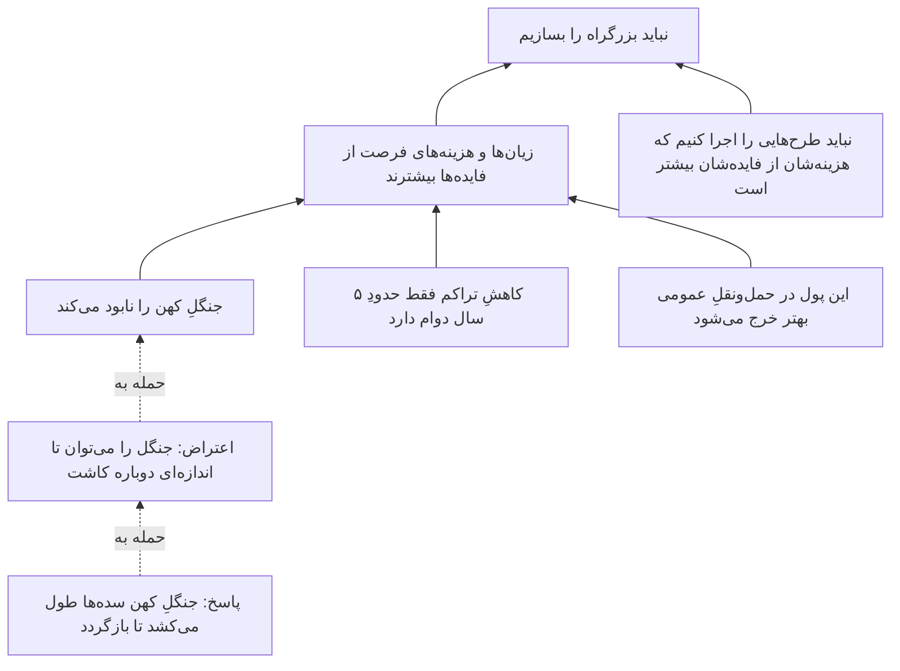
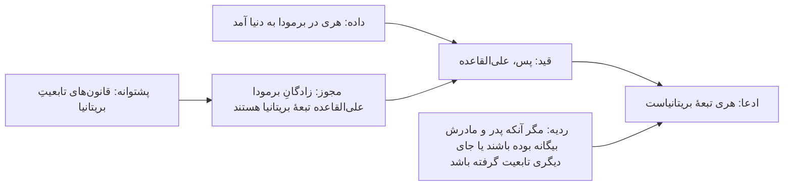

# فصل ۳. منطق و کالبدشناسیِ استدلال

[← قبلی: تاریخِ نظریهٔ معرفت](02-history-of-epistemology.md) · [فهرست](README.md) · [بعدی: زبان، مفهوم‌ها و تعریف‌ها ←](04-language-concepts-and-definitions.md)

**صوت:** [شنیدنِ این فصل](audio/03-logic-and-arguments.mp3) (۴۹ دقیقه، روایت به انگلیسی) · [باز کردن در پخش‌کننده](audio/index.html#03)

---

> «برعکس، اگر چنین بود، ممکن بود باشد؛ و اگر چنین می‌بود، می‌بود؛ اما چون نیست، نیست. منطق همین است.»
> — تویدل‌دی، در *آن سوی آینه*ٔ لوئیس کارول (۱۸۷۱)

> «وضعِ مقدمِ یک نفر رفعِ تالیِ نفرِ دیگر است.»
> — گفته‌ای میانِ فیلسوفان

معرفت‌شناسی می‌پرسد باورها کِی موجه‌اند. بسیار پیش می‌آید که باوری موجه است چون *باورهای دیگری* از راهِ استدلال از آن پشتیبانی می‌کنند. **منطق** بررسیِ این است که کدام الگوهای استدلال خوب‌اند، یعنی کدام الگوها پشتیبانی را از مقدمه‌ها به نتیجه‌ها منتقل می‌کنند. این فصل به شما می‌آموزد استدلال‌ها را بازشناسید، آن‌ها را در صورتِ استاندارد بنویسید، اعتبار و قوتشان را بیازمایید، مقدمه‌های پنهان را بیابید، و استدلال‌های پیچیده را نقشه‌کشی کنید. این‌ها مهارت‌های فنیِ هستهٔ تفکر نقادانه‌اند. در همهٔ فصل‌های بعدی به کارشان خواهید برد.

---

## استدلال چیست و چه نیست

در منطق، **استدلال** به معنای دعوا نیست. مجموعه‌ای از گزاره‌هاست که در آن برخی (**مقدمه‌ها**) به‌عنوانِ دلیل برای گزاره‌ای دیگر (**نتیجه**) عرضه می‌شوند.

> مقدمه: همهٔ پستانداران هوا تنفس می‌کنند.
> مقدمه: نهنگ‌ها پستاندارند.
> نتیجه: پس نهنگ‌ها هوا تنفس می‌کنند.

بسیاری چیزها که شبیهِ استدلال‌اند استدلال نیستند:

- **ادعاها.** «مالیات‌ها خیلی بالاست.» ادعایی بی‌آنکه دلیلی آمده باشد.
- **تبیین‌ها.** «لیوان شکست چون روی کاشی افتاد.» این نمی‌کوشد *ثابت کند* که لیوان شکسته است (از پیش می‌دانیم که شکسته). به ما می‌گوید *چرا*. این تفاوت مهم است: در استدلال، مقدمه‌ها قرار است بهتر از نتیجه دانسته شده باشند؛ در تبیین، آنچه تبیین می‌شود (*تبیین‌خواه*) معمولاً از پیش پذیرفته است. یک جملهٔ «چون»دار بسته به زمینه می‌تواند هر یک از این دو باشد.
- **مثال‌ها.** «بسیاری از پرندگان نمی‌توانند پرواز کنند، مثلاً پنگوئن‌ها و شترمرغ‌ها.» مثال نشان می‌دهد، نه اینکه اثبات کند.
- **شرطی‌ها.** «اگر باران ببارد، مسابقه لغو می‌شود.» این ادعا نمی‌کند که باران خواهد بارید یا مسابقه لغو شده است. نسبتی را ادعا می‌کند. شرطی می‌تواند مقدمه‌ای در استدلال باشد، اما خودش استدلال نیست.
- **گزارشِ باور.** «فکر می‌کنم اقتصاد بهبود پیدا کند.» گزاره‌ای دربارهٔ حالتِ ذهنیِ کسی.
- **لفاظی.** «هر آدمِ درستی می‌داند این سیاست فاجعه است!» فشارِ عاطفی، نه دلیل.

**واژه‌های نشانه** به شما کمک می‌کنند بخش‌های یک استدلال را بیابید.

| نشانه‌های نتیجه | نشانه‌های مقدمه |
|---|---|
| پس، بنابراین، از این رو، در نتیجه، نتیجه می‌شود که، که نشان می‌دهد، می‌توان نتیجه گرفت که، بدین ترتیب | چون، زیرا، چراکه، با توجه به اینکه، چنان‌که نشان می‌دهد، دلیلش این است که، از آنجا که، با فرضِ اینکه |

نشانه‌ها سودمندند اما قابل‌اعتماد نیستند. «از آنجا که» گاهی معنای مکانی دارد، و بسیاری از استدلال‌ها اصلاً هیچ واژهٔ نشانه‌ای ندارند. آزمونِ واقعی این است که بپرسید: *این شخص می‌کوشد مرا به باور کردنِ چه چیزی وادارد، و چه چیزی در پشتیبانی از آن عرضه می‌کند؟*

---

## صورتِ استاندارد

برای ارزیابیِ استدلال، نخست آن را در **صورتِ استاندارد** بنویسید: مقدمه‌ها را شماره‌گذاری کنید، نتیجه را در آخر بگذارید، و میانِ آن‌ها خطی بکشید.

> سرمقاله‌ای در روزنامه می‌گوید: «نباید بزرگراهِ تازه را بسازیم. جنگلِ کهن را نابود می‌کند، و مطالعاتِ ترافیکی نشان می‌دهد فقط حدودِ پنج سال از تراکم می‌کاهد تا ترافیکِ تازه دوباره پرش کند. از این گذشته، این پول اگر صرفِ حمل‌ونقلِ عمومی شود فایدهٔ بیشتری دارد.»

در صورتِ استاندارد:

1. بزرگراهِ تازه جنگلِ کهن را نابود می‌کند.
2. بزرگراه فقط حدودِ پنج سال از تراکم می‌کاهد (به‌خاطرِ تقاضای القایی).
3. همین پول اگر صرفِ حمل‌ونقلِ عمومی شود فایدهٔ بیشتری دارد.
4. *(ناگفته)* نباید طرحی را اجرا کنیم که زیان‌ها و هزینه‌های فرصتش از فایده‌هایش بیشتر است.
5. *(ناگفته)* زیان‌ها و هزینه‌های فرصتِ بزرگراه از فایده‌هایش بیشتر است.
-----
ن. نباید بزرگراهِ تازه را بسازیم.

توجه کنید که بازسازی ناچار شد مقدمه‌های ۴ و ۵ را بیفزاید، که سرمقاله فرضشان گرفته بود اما بیانشان نکرده بود. فراهم کردنِ منصفانهٔ این **مقدمه‌های مفقود** یکی از مهم‌ترین مهارت‌های تفکر نقادانه است. نگاه کنید به [فراهم کردنِ مقدمه‌های مفقود](#supplying-missing-premises).

صورتِ استاندارد *ساختارِ* استدلال را هم آشکار می‌کند. مقدمه‌های ۱ تا ۳ دلیل‌هایی مستقل نیستند که هر کدام به‌تنهایی نتیجه را موجه کنند. آن‌ها با هم از مقدمهٔ ۵ پشتیبانی می‌کنند، که همراه با مقدمهٔ ۴ نتیجه را به دست می‌دهد. این ساختار به شما می‌گوید نقد را کجا نشانه بگیرید: کسی که می‌خواهد بزرگراه ساخته شود باید ۱، ۲ یا ۳ را زیرِ سؤال ببرد، یا استدلال کند که فایده‌ها بزرگ‌تر از آن‌اند که سرمقاله می‌گوید، که مقدمهٔ ۵ را سست می‌کند.

---

## قیاس، استقرا و ابداکشن

استدلال‌ها به‌طورِ سنتی بر پایهٔ گونهٔ پشتیبانی‌ای که مقدمه‌ها *قرار است* به نتیجه بدهند دسته‌بندی می‌شوند.

**استدلال‌های قیاسی** (استنتاجی) می‌کوشند نشان دهند که اگر مقدمه‌ها صادق باشند، نتیجه *باید* صادق باشد. پیوند ضروری است.

> همهٔ فلزها رسانای برق‌اند. مس فلز است. پس مس رسانای برق است.

**استدلال‌های استقرایی** می‌کوشند نشان دهند که با فرضِ مقدمه‌ها، نتیجه *احتمالاً* صادق است. پیوند از جنسِ احتمال است. صورت‌های رایج:

- **استقرای شمارشی** (تعمیم از یک نمونه): «هر زمردی که تاکنون بررسی شده سبز بوده است، پس همهٔ زمردها سبزند.»
- **قیاسِ آماری** (از نرخی کلی به یک مورد): «۹۰٪ بیمارانی که این نشانه‌ها را دارند آنفولانزا دارند؛ این بیمار این نشانه‌ها را دارد؛ پس این بیمار احتمالاً آنفولانزا دارد.»
- **استدلال از راهِ تمثیل**: «موش‌ها و انسان‌ها فیزیولوژیِ مربوطِ مشترکی دارند؛ این دارو به کبدِ موش آسیب می‌زند؛ پس احتمالاً به کبدِ انسان هم آسیب می‌زند.»
- **پیش‌بینی**: «خورشید در همهٔ تاریخِ ثبت‌شده هر روز طلوع کرده است، پس فردا هم طلوع می‌کند.»

**استدلال‌های ابداکتیو** (اصطلاحی از چارلز سندرز پرس)، که اغلب **استنتاجِ بهترین تبیین** (IBE، اصطلاحی از گیلبرت هارمن، ۱۹۶۵) نامیده می‌شوند، نتیجه می‌گیرند که فرضیه‌ای صادق است چون شواهد را بهتر از همه تبیین می‌کند.

> پنجرهٔ آشپزخانه شکسته است، روی زمین گل است، و جعبهٔ جواهرات خالی است. بهترین تبیین دزدی است. پس احتمالاً دزدی رخ داده است.

شرلوک هولمز روشش را «استنتاجِ قیاسی» می‌نامد، اما تقریباً همیشه ابداکشن است. وقتی به واتسون می‌گوید «می‌بینم که در افغانستان بوده‌اید»، بهترین تبیینِ آفتاب‌سوختگی، هیئت و بازوی آسیب‌دیدهٔ واتسون را استنتاج می‌کند.

| | قیاس | استقرا | ابداکشن |
|---|---|---|---|
| جهت | از کلی به جزئی، یا از قاعده به مورد (معمولاً) | از موردهای مشاهده‌شده به ادعاهای کلی یا آینده | از شواهد به بهترین تبیینِ آن‌ها |
| پشتیبانی | ضروری (اگر معتبر باشد) | احتمالاتی | احتمالاتی، تبیینی |
| آیا مقدمه‌ها می‌توانند صادق و نتیجه کاذب باشد؟ | اگر معتبر باشد، نه | آری | آری |
| افزودنِ مقدمه | نمی‌تواند استدلالِ معتبر را نامعتبر کند (یکنوا) | می‌تواند استنتاج را قوی‌تر یا ضعیف‌تر کند (نایکنوا) | می‌تواند بهترین تبیین را واژگون کند (نایکنوا) |
| معرفت را گسترش می‌دهد؟ | آنچه را در مقدمه‌ها نهفته است آشکار می‌کند | از مقدمه‌ها فراتر می‌رود | از مقدمه‌ها فراتر می‌رود و فرضیه‌های تازه می‌آورد |
| چهرهٔ کلیدی | ارسطو، فرگه | هیوم، میل | پرس، هارمن، لیپتون |

شعارِ «از کلی به جزئی» برای قیاس فقط راهنمایی تقریبی است. «سقراط انسان است و سقراط میراست، پس چیزی هست که هم انسان است و هم میرا» قیاسی است و از جزئی به کلی می‌رود.

سطرِ مربوط به **یکنوایی** ارزشِ به خاطر سپردن دارد. قیاس **یکنوا** (monotonic) است: اگر مقدمه‌های P به‌طورِ قیاسی نتیجهٔ C را ایجاب کنند، P به‌علاوهٔ هر مقدمهٔ دیگری هم C را ایجاب می‌کند. استدلالِ غیرقیاسی **نایکنوا** است: «تویتی پرنده است، پس تویتی پرواز می‌کند» استنتاجِ خوبی است، اما «تویتی پنگوئن است» را بیفزایید و شکست می‌خورد. بیشترِ استدلال‌های جهانِ واقعی نایکنوایند، و به همین دلیل [ابطال‌کننده‌ها](06-justification.md#defeaters) در معرفت‌شناسی این‌قدر اهمیت دارند.

> **پیوند.** استقرا یکی از مشهورترین مسئله‌های فلسفه را پیش می‌کشد: چگونه می‌تواند *عقلانی* باشد که از شواهدمان فراتر برویم؟ نگاه کنید به [مسئلهٔ استقرای هیوم](09-induction-probability-bayes.md#humes-problem-of-induction). ابداکشن در علم و کارآگاهی محوری است؛ نگاه کنید به [استنتاجِ بهترین تبیین](10-science-and-evidence.md#inference-to-the-best-explanation).

---

## اعتبار و درستی

استدلالِ قیاسی **معتبر** است اگر و تنها اگر *ناممکن* باشد که همهٔ مقدمه‌هایش صادق و نتیجه‌اش کاذب باشد. اعتبار به **صورت** مربوط است، نه به محتوا. به پیوندِ میانِ مقدمه‌ها و نتیجه مربوط است، نه به اینکه آیا مقدمه‌ها واقعاً صادق‌اند.

استدلالی معتبر با مقدمه‌های کاذب:

> همهٔ ماهی‌ها می‌توانند پرواز کنند. همهٔ سگ‌ها ماهی‌اند. پس همهٔ سگ‌ها می‌توانند پرواز کنند.

این **معتبر** است: *اگر* مقدمه‌ها صادق بودند، نتیجه باید صادق می‌بود. فقط استدلالِ خوبی نیست، چون مقدمه‌هایش کاذب‌اند.

استدلالی نامعتبر با مقدمه‌ها و نتیجهٔ صادق:

> همهٔ سگ‌ها پستاندارند. برخی پستانداران حیوانِ خانگی‌اند. پس برخی سگ‌ها حیوانِ خانگی‌اند.

همهٔ گزاره‌ها صادق‌اند، اما استدلال **نامعتبر** است. مقدمه‌ها نتیجه را تضمین نمی‌کنند. استدلالی موازی با همین صورت را مقایسه کنید: «همهٔ سگ‌ها پستاندارند. برخی پستانداران نهنگ‌اند. پس برخی سگ‌ها نهنگ‌اند.» مقدمه‌های صادق، نتیجهٔ کاذب. چون این صورت می‌تواند از صدق به کذب برسد، نامعتبر است.

استدلالی **درست** (sound) است اگر معتبر باشد *و* همهٔ مقدمه‌هایش صادق باشند. نتیجهٔ استدلالِ درست باید صادق باشد.

| | همهٔ مقدمه‌ها صادق | دست‌کم یک مقدمه کاذب |
|---|---|---|
| **معتبر** | درست: صدقِ نتیجه تضمین‌شده | نادرست: نتیجه ممکن است صادق یا کاذب باشد |
| **نامعتبر** | نادرست: نتیجه ممکن است صادق یا کاذب باشد | نادرست: نتیجه ممکن است صادق یا کاذب باشد |

چهار واقعیت دربارهٔ اعتبار که مردم اغلب اشتباه می‌فهمند:

1. **استدلالِ معتبر می‌تواند نتیجهٔ کاذب داشته باشد** (اگر مقدمه‌ای کاذب باشد).
2. **استدلالِ نامعتبر می‌تواند نتیجهٔ صادق داشته باشد.** نامعتبر بودن نشان نمی‌دهد نتیجه کاذب است؛ نشان می‌دهد استدلال از اثباتش ناتوان است. نتیجه گرفتنِ کذبِ ادعایی از اینکه استدلالی برایش بد است [مغالطهٔ مغالطه](15-fallacies.md#the-fallacy-fallacy) است.
3. **اگر استدلالی معتبر و نتیجه‌اش کاذب باشد، دست‌کم یک مقدمه کاذب است.** این موتورِ ابطال است.
4. **اعتبار با اقناع‌کنندگی یکی نیست.** استدلالِ معتبر اگر مقدمه‌هایش مشکوک‌تر از نتیجه‌اش باشند می‌تواند بی‌فایده باشد.

### روشِ مثالِ نقض

برای نشان دادنِ نامعتبر بودنِ صورتی از استدلال، **مثالِ نقض** بیابید: استدلالی با همان صورت، با مقدمه‌هایی آشکارا صادق و نتیجه‌ای آشکارا کاذب. این را گاهی **ابطال از راهِ تمثیلِ منطقی** یا **هم‌ترازیِ استدلال** می‌نامند.

> «آدم‌های موفق صبح زود بیدار می‌شوند. من صبح زود بیدار می‌شوم. پس موفق خواهم شد.»
>
> همان صورت: «گربه‌ها چهار پا دارند. میزِ من چهار پا دارد. پس میزِ من گربه است.»

استدلالِ دوم همان صورت را دارد و آشکارا شکست می‌خورد، پس آن صورت نامعتبر است. این فن در بحث‌های واقعی نیرومند است چون به هیچ واژگانِ فنی‌ای نیاز ندارد. فقط می‌گویید: «با همین استدلال می‌شد نتیجه گرفت که…»

---

## قوت و استواری

استدلال‌های استقرایی و ابداکتیو معتبر یا نامعتبر نیستند. **قوی** یا **ضعیف**‌اند. استدلالی **قوی** است اگر، با فرضِ صدقِ مقدمه‌ها، نتیجه احتمالاً صادق باشد. **استوار** (cogent) است اگر قوی باشد *و* مقدمه‌هایش صادق (یا پذیرفتنی) باشند. استواری برای استقرا همان نقشی را دارد که درستی برای قیاس.

قوت درجه دارد. مقایسه کنید:

> (الف) از ۵ نفر در یک باشگاهِ ورزشی پرسیدم؛ ۴ نفر هر روز ورزش می‌کنند. پس حدودِ ۸۰٪ مردم هر روز ورزش می‌کنند.
>
> (ب) یک نظرسنجیِ ملیِ تصادفی از ۱۰٬۰۰۰ بزرگسال نشان داد که ۲۳٪ هر روز ورزش می‌کنند (با خطای ±۱٪). پس حدودِ ۲۳٪ بزرگسالان هر روز ورزش می‌کنند.

(الف) بسیار ضعیف است (نمونه‌ای ریز و سوگیرانه). (ب) قوی است.

قوتِ یک تعمیمِ استقرایی به این‌ها بستگی دارد:

- **اندازهٔ نمونه.** نمونه‌های بزرگ‌تر خطای تصادفی را کم می‌کنند.
- **نمایندگی.** آیا نمونه از سوگیریِ گزینش پاک است؟ نمونه‌ای از باشگاه‌روندگان در زمینهٔ عادت‌های ورزشی نمایندهٔ جمعیت نیست.
- **تنوع.** آیا نمونه‌ها در شرایطِ بسیار گوناگونی مشاهده شده‌اند؟
- **قوتِ ادعا.** پشتیبانی از «بیشترِ زمردها سبزند» آسان‌تر از «همهٔ زمردها سبزند» است.
- **دانشِ زمینه‌ای.** آیا سازوکاری می‌شناسیم؟ آیا می‌دانیم این گونه ویژگی معمولاً در یک نوع یکنواخت است؟ رسانایی مس یکنواخت است؛ عقیده‌های سیاسیِ آدم‌ها نیست.

قوتِ **استدلال از راهِ تمثیل** به شمار و ربطِ شباهت‌ها، شمار و ربطِ تفاوت‌ها، و تنوعِ موردهای مقایسه‌شده بستگی دارد. موش‌ها و انسان‌ها آنزیم‌های کبدیِ مربوط به سوخت‌وسازِ دارو را مشترک دارند؛ از بسیاری جهاتِ دیگر با هم فرق دارند، که برخی ممکن است مهم باشد.

قوتِ **استدلالِ ابداکتیو** به این بستگی دارد که آیا فرضیه *بهترین* تبیینِ در دسترس است، که مستلزمِ مقایسه‌اش با رقیبان است. تبیینی ممکن است خوب به نظر برسد تا وقتی که کسی بدیلِ بهتری به ذهنش برسد. این رایج‌ترین شیوهٔ شکستِ استدلالِ ابداکتیو است. نگاه کنید به [استنتاجِ بهترین تبیین](10-science-and-evidence.md#inference-to-the-best-explanation).

---

## منطقِ گزاره‌ها

**منطقِ گزاره‌ها** (منطقِ جمله‌ها) بررسی می‌کند که صدقِ گزاره‌های مرکب چگونه به صدقِ اجزایشان بستگی دارد. ساده‌ترین منطقِ جدید است و برای تحلیلِ بسیاری از استدلال‌های روزمره بس است.

### رابط‌ها و جدول‌های ارزش

فرض کنید *P* و *Q* نمایندهٔ هر گزاره‌ای باشند. **رابط‌های** اصلی این‌هایند:

| رابط | نماد | به زبانِ روزمره | صادق است وقتی |
|---|---|---|---|
| نفی | `¬P` | نه P | P کاذب باشد |
| عطف | `P ∧ Q` | P و Q | هر دو صادق باشند |
| فصل | `P ∨ Q` | P یا Q (شاملِ هر دو) | دست‌کم یکی صادق باشد |
| شرطی | `P → Q` | اگر P آن‌گاه Q | چنین نباشد که P صادق و Q کاذب باشد |
| دوشرطی | `P ↔ Q` | P اگر و تنها اگر Q | P و Q ارزشِ صدقِ یکسانی داشته باشند |

جدولِ ارزشِ کامل (ص = صادق، ک = کاذب):

| `P` | `Q` | `¬P` | `P ∧ Q` | `P ∨ Q` | `P → Q` | `P ↔ Q` |
|---|---|---|---|---|---|---|
| ص | ص | ک | ص | ص | ص | ص |
| ص | ک | ک | ک | ص | ک | ک |
| ک | ص | ص | ک | ص | ص | ک |
| ک | ک | ص | ک | ک | ص | ص |

توجه کنید که «یا»ی منطقی **شامل** است: «P یا Q» وقتی هر دو صادق‌اند هم صادق است. زبانِ روزمره گاهی «یا»ی **مانعةالجمع** به کار می‌برد («سوپ یا سالاد» معمولاً یعنی نه هر دو). هنگامِ تحلیلِ استدلال، بررسی کنید کدام منظور است. استدلالی که به «یا»ی مانعةالجمع تکیه دارد در حالی که فقط «یا»ی شامل موجه است، مرتکبِ مغالطهٔ [تأییدِ یک طرفِ انفصال](#formal-fallacies) می‌شود.

دو هم‌ارزیِ سودمند، **قانون‌های دمورگان**:

- `¬(P ∧ Q) ≡ ¬P ∨ ¬Q`: «چنین نیست که هم P و هم Q» یعنی «یا نه P یا نه Q.»
- `¬(P ∨ Q) ≡ ¬P ∧ ¬Q`: «نه P و نه Q» یعنی «نه P، و نه Q.»

اشتباه‌های روزمره با نفی رایج‌اند. «درست نیست که همهٔ سیاستمداران فاسدند» به معنای «هیچ سیاستمداری فاسد نیست» *نیست*. یعنی «برخی سیاستمداران فاسد نیستند.»

### شرطی

شرطیِ «اگر P آن‌گاه Q» مهم‌ترین و بدفهمیده‌ترین رابط است. P **مقدم** است؛ Q **تالی**.

جدولِ ارزش می‌گوید `P → Q` فقط وقتی کاذب است که P صادق و Q کاذب باشد. این **شرطیِ مادی** نتیجه‌هایی عجیب به بار می‌آورد: «اگر ماه از پنیر ساخته شده باشد، آن‌گاه ۲ + ۲ = ۵» صادق از آب درمی‌آید، چون مقدم کاذب است. این‌ها **پارادوکس‌های استلزامِ مادی**‌اند. شرطی‌های زبانِ روزمره پیچیده‌ترند، و منطق‌دانان نظریه‌های بدیلی پرورده‌اند (شرطی‌های اکید، شرطی‌های خلافِ واقع، شرح‌های احتمالاتی). برای ارزیابیِ استدلال‌ها، واقعیت‌های کلیدی در همهٔ نظریه‌ها برقرارند:

- اگر `P → Q` صادق و P صادق باشد، آن‌گاه Q صادق است.
- اگر `P → Q` صادق و Q کاذب باشد، آن‌گاه P کاذب است.
- `P → Q` مستلزمِ `Q → P` (**عکسِ** آن) *نیست*.
- `P → Q` مستلزمِ `¬P → ¬Q` (**وارونِ** آن) *نیست*.
- `P → Q` با `¬Q → ¬P` (**عکسِ نقیضِ** آن) هم‌ارز *است*.

| گزاره | صورت | هم‌ارزِ اصل؟ |
|---|---|---|
| اگر سگ است، پستاندار است. | `P → Q` | (اصل) |
| اگر پستاندار است، سگ است. | `Q → P` (عکس) | **نه** |
| اگر سگ نیست، پستاندار نیست. | `¬P → ¬Q` (وارون) | **نه** |
| اگر پستاندار نیست، سگ نیست. | `¬Q → ¬P` (عکسِ نقیض) | **آری** |

بسیاری از عبارت‌های روزمره شرطی‌هایی در لباسِ مبدل‌اند:

- «Q اگر P» = `P → Q`
- «P فقط اگر Q» = `P → Q` (توجه: `Q → P` *نیست*)
- «P مگر آنکه Q» = `¬Q → P` (به‌طورِ هم‌ارز، `P ∨ Q`)
- «هیچ P‌ای بی Q نیست» = `P → Q`
- «همهٔ Pها Q‌اند» = برای هر x، اگر x یک P باشد، x یک Q است

«فقط اگر» تقریباً همه را به زمین می‌زند. «فقط اگر ثبت‌نام کرده باشید می‌توانید رأی بدهید» یعنی: اگر رأی بدهید، ثبت‌نام کرده‌اید. به این معنا *نیست* که ثبت‌نام کردن تضمین می‌کند بتوانید رأی بدهید (شاید به سنِ قانونی هم نیاز داشته باشید).

### شرط‌های لازم و کافی

شرطی‌ها **شرط‌های لازم** و **کافی** را بیان می‌کنند، که سودمندترین مفهوم‌ها برای تحلیلِ تعریف‌ها و ادعاها هستند.

- P برای Q **کافی** است اگر صادق بودنِ P صادق بودنِ Q را تضمین کند: `P → Q`.
- Q برای P **لازم** است اگر P نتواند بی Q صادق باشد: `P → Q`.

*همان* شرطی هر دو را بیان می‌کند. در «اگر مربع است، مستطیل است»: مربع بودن برای مستطیل بودن کافی است؛ مستطیل بودن برای مربع بودن لازم است.

| نمونه | لازم؟ | کافی؟ |
|---|---|---|
| اکسیژن، برای آتش | آری | نه (سوخت و گرما هم لازم است) |
| مربع بودن، برای مستطیل بودن | نه | آری |
| سه ضلع داشتن، برای مثلث بودن (شکلِ بستهٔ مسطح با ضلع‌های راست) | آری | آری |
| خریدنِ بلیتِ بخت‌آزمایی، برای بردنِ بخت‌آزمایی | آری | نه |
| گردن زدن، برای مرگ | نه | آری |

اشتباه گرفتنِ شرط‌های لازم و کافی بسیاری استدلال‌های بد پدید می‌آورد:

- «سخت‌کوشی برای موفقیت لازم است، پس اگر سخت کار کنم موفق می‌شوم.» (لازم را کافی گرفتن.)
- «سیگار کشیدن برای بالا بردنِ خطرِ سرطان کافی است، پس اگر سیگار نکشم خطرم بالا نمی‌رود.» (کافی را لازم گرفتن.)
- «پول شادی را تضمین نمی‌کند، پس برای شادی اهمیتی ندارد.» (انکارِ کفایت، و سپس نتیجه‌گیریِ نادرست که عاملی مؤثر نیست.)

بسیاری از علت‌های واقعی نه لازم‌اند نه کافی، بلکه **شرط‌های INUS**‌اند (جی. ال. مکی، ۱۹۶۵): بخشِ *ناکافی* اما *غیرزائدِ* شرطی که خودش *غیرلازم* اما *کافی* است. اتصالِ کوتاه یک شرطِ INUS برای آتش‌سوزیِ خانه است: به‌تنهایی کافی نیست (به مادهٔ آتش‌گیر و اکسیژن نیاز دارید)، لازم نیست (آتش علت‌های دیگری هم دارد)، اما بخشی غیرزائد از یک مجموعهٔ کافی از شرط‌هاست. نگاه کنید به [علیت و استنتاجِ علّی](10-science-and-evidence.md#causation-and-causal-inference).

---

## صورت‌های معتبرِ استدلال

این الگوها معتبرند. یاد بگیرید آن‌ها را در زبانِ روزمره بازشناسید.

**وضعِ مقدم** (modus ponens)
> اگر P آن‌گاه Q. P. پس Q.
> *اگر باران می‌بارد، زمین خیس است. باران می‌بارد. پس زمین خیس است.*

**رفعِ تالی** (modus tollens)
> اگر P آن‌گاه Q. نه Q. پس نه P.
> *اگر بیمار سرخک داشت، بثوراتِ پوستی داشت. بثورات ندارد. پس سرخک ندارد.*

رفعِ تالی صورتِ منطقیِ **ابطال** در علم است: اگر نظریه صادق باشد، O را مشاهده خواهیم کرد؛ O را مشاهده نمی‌کنیم؛ پس نظریه کاذب است. نگاه کنید به [پوپر و ابطال‌گرایی](10-science-and-evidence.md#popper-and-falsificationism).

**قیاسِ شرطیِ زنجیره‌ای**
> اگر P آن‌گاه Q. اگر Q آن‌گاه R. پس اگر P آن‌گاه R.

**قیاسِ انفصالی**
> P یا Q. نه P. پس Q.
> *کلیدها یا در جیبِ کتم هستند یا روی میز. در جیبِ کتم نیستند. پس روی میزند.*

**دوراهیِ سازنده**
> اگر P آن‌گاه R. اگر Q آن‌گاه S. P یا Q. پس R یا S.

**برهانِ خلف** (reductio ad absurdum؛ اثباتِ غیرمستقیم)
> P را فرض کن. از P تناقضی (یا چیزی آشکارا کاذب) بیرون بکش. پس نه P.

نمونهٔ کلاسیک اثباتِ گنگ بودنِ `√2` است: فرض کنید `√2 = a/b` در ساده‌ترین صورت؛ آن‌گاه `a² = 2b²`، پس *a* زوج است، پس `a = 2k`، پس `4k² = 2b²`، پس `b² = 2k²`، پس *b* زوج است؛ اما در این صورت a/b در ساده‌ترین صورت نبود، که تناقض است. پس `√2` نسبتِ دو عددِ صحیح نیست.

برهانِ خلف نیرومندترین حرکتِ غیرصوری در استدلالِ فلسفی هم هست. ادعای حریف را برای پیشبردِ بحث می‌پذیرید، سپس نشان می‌دهید که به نتیجه‌ای می‌انجامد که خودش آن را رد می‌کند. النخوسِ سقراط رشته‌ای از برهان‌های خلف است.

**عطف، تجزیه، افزایش** (پیش‌پاافتاده اما سودمند)
> P. Q. پس P و Q. / P و Q. پس P. / P. پس P یا Q.

> **«وضعِ مقدمِ یک نفر رفعِ تالیِ نفرِ دیگر است.»** اگر استدلالی معتبر دارید، «اگر P آن‌گاه Q؛ P؛ پس Q»، و کسی Q را باورنکردنی می‌یابد، ممکن است استدلال را وارونه اجرا کند: «اگر P آن‌گاه Q؛ نه Q؛ پس نه P.» منطق به شما می‌گوید که P و Q با هم می‌مانند یا با هم می‌افتند. به شما نمی‌گوید به کدام سو بروید. این به این بستگی دارد که به P مطمئن‌ترید یا به نقیضِ Q. جی. ای. مور دقیقاً همین ساختار را علیهِ شکاکیت به کار برد: شکاک استدلال می‌کند «اگر نتوانم خواب دیدن را منتفی کنم، نمی‌دانم دست دارم؛ نمی‌توانم منتفی‌اش کنم؛ پس نمی‌دانم دست دارم.» مور پاسخ داد: «*می‌دانم* دست دارم؛ پس یا می‌توانم خواب دیدن را منتفی کنم یا مقدمهٔ نخست کاذب است.» نگاه کنید به [موریسم](08-skepticism.md#mooreanism).

---

## مغالطه‌های صوری

**مغالطهٔ صوری** استدلالی است که *صورتش* نامعتبر است. این‌ها رایج‌ترین‌هایند. هر کدام همزادی معتبر دارد که به آن شبیه است.

**وضعِ تالی**
> اگر P آن‌گاه Q. Q. پس P.
> *اگر جاسوس بود، مضطرب می‌بود. مضطرب است. پس جاسوس است.*

نامعتبر: ممکن است به دلیل‌های دیگری مضطرب باشد. این مغالطه در استدلال دربارهٔ شواهد بسیار رایج است: «اگر فرضیه‌ام صادق باشد، این نتیجه را خواهیم دید؛ نتیجه را می‌بینیم؛ پس فرضیه‌ام صادق است.» نتیجه فرضیه را فقط تا آنجا تأیید می‌کند که با فرضِ آن فرضیه محتمل‌تر باشد تا با فرضِ بدیل‌ها. نگاه کنید به [شواهد و تأیید](09-induction-probability-bayes.md#evidence-and-confirmation).

**رفعِ مقدم**
> اگر P آن‌گاه Q. نه P. پس نه Q.
> *اگر سیگار بکشی، به ریه‌هایت آسیب می‌زنی. سیگار نمی‌کشی. پس به ریه‌هایت آسیب نمی‌زنی.*

نامعتبر: آلودگیِ هوا، آزبست و علت‌های دیگر هم وجود دارند.

**تأییدِ یک طرفِ انفصال**
> P یا Q. P. پس نه Q.
> *یا باهوش است یا سخت‌کوش. باهوش است. پس سخت‌کوش نیست.*

با «یا»ی شامل نامعتبر است.

**حدِ وسطِ غیرمستغرق**
> همهٔ A‌ها B‌اند. همهٔ C‌ها B‌اند. پس همهٔ A‌ها C‌اند.
> *همهٔ کمونیست‌ها از بهداشتِ عمومیِ همگانی پشتیبانی می‌کنند. سناتورِ من از بهداشتِ عمومیِ همگانی پشتیبانی می‌کند. پس سناتورِ من کمونیست است.*

این ساختارِ «گناه از راهِ همنشینی» است.

**عکسِ نادرست**
> همهٔ A‌ها B‌اند. پس همهٔ B‌ها A‌اند.
> *همهٔ تروریست‌ها افراطی‌اند، پس همهٔ افراطی‌ها تروریست‌اند.*

**جابه‌جاییِ سورها**
> هر کسی مادری دارد. پس کسی هست که مادرِ همه است.
> `∀x ∃y (y مادرِ x است) ⊢ ∃y ∀x (y مادرِ x است)`. نامعتبر.

روایتی مشهور از آن در استدلال‌هایی از این دست دیده می‌شود: «هر رویدادی علتی دارد، پس چیزی هست که علتِ همهٔ رویدادهاست.» مقدمه، حتی اگر صادق باشد، نتیجه را به دست نمی‌دهد. نگاه کنید به [منطقِ محمولات و سورها](#predicate-logic-and-quantifiers).

**مغالطهٔ وجهی**
> ضرورتاً، اگر P را بدانم آن‌گاه P صادق است. P را می‌دانم. پس P ضرورتاً صادق است.

نامعتبر: از `□(K → P)` و K فقط P نتیجه می‌شود، نه `□P`. این مغالطه *ضرورتِ استلزام* را با *ضرورتِ تالی* اشتباه می‌گیرد. در استدلال‌هایی دربارهٔ تقدیر و علمِ پیشین سر برمی‌آورد («اگر خدا می‌داند که X را انجام خواهم داد، پس ضرورتاً X را انجام خواهم داد»). نگاه کنید به [مبانیِ منطقِ وجهی](#modal-logic-basics).

---

## منطقِ حملی و قیاس

منطقِ ارسطو با چهار گونه **گزارهٔ حملی** سروکار دارد:

| گونه | صورت | نمونه |
|---|---|---|
| **A** (موجبهٔ کلیه) | همهٔ Sها P‌اند | همهٔ انسان‌ها میرایند. |
| **E** (سالبهٔ کلیه) | هیچ Sای P نیست | هیچ خزنده‌ای پستاندار نیست. |
| **I** (موجبهٔ جزئیه) | برخی Sها P‌اند | برخی پرندگان پرواز نمی‌کنند. |
| **O** (سالبهٔ جزئیه) | برخی Sها P نیستند | برخی سیاستمداران درستکار نیستند. |

**مربعِ تقابل** نسبت‌های میانِ این‌ها را نشان می‌دهد. A و O **متناقض**‌اند (دقیقاً یکی صادق است)، و E و I نیز. پس برای ردِ «همهٔ قوها سفیدند» (A) فقط یک قوی سیاه (O) لازم است. برای ردِ «هیچ واکسنی عارضهٔ جانبی ندارد» (E) فقط یک واکسن که عارضه دارد (I) بس است. این نکتهٔ ساده در بحث‌ها اغلب نادیده می‌ماند: ادعای کلی با یک مثالِ نقض رد می‌شود، اما اثباتِ ادعای کلی به بسیار بیش از یک مثال نیاز دارد.

**قیاسِ حملی** دو مقدمه و یک نتیجه دارد که هر کدام گزاره‌ای حملی است، با سه حد. مشهورترین صورتِ معتبر **بربارا** نام دارد (مصوت‌هایش AAA را رمزگذاری می‌کنند؛ در منطقِ سنتیِ ما، ضربِ اولِ شکلِ اول):

> همهٔ Mها P‌اند. همهٔ Sها M‌اند. پس همهٔ Sها P‌اند.
> *همهٔ پستانداران خون‌گرم‌اند. همهٔ نهنگ‌ها پستاندارند. پس همهٔ نهنگ‌ها خون‌گرم‌اند.*

می‌توانید قیاس‌ها را با **نمودارهای ون** یا با قاعده‌های سنتی بیازمایید:

1. حدِ وسط باید دست‌کم یک بار **مستغرق** باشد (به همهٔ اعضای دسته‌اش اشاره کند). (نقضِ این قاعده [حدِ وسطِ غیرمستغرق](#formal-fallacies) را پدید می‌آورد.)
2. حدی که در نتیجه مستغرق است باید در مقدمه‌اش هم مستغرق باشد. (نقضِ این قاعده **اکبرِ نامشروع** یا **اصغرِ نامشروع** است.)
3. از دو مقدمهٔ سالبه نتیجه‌ای به دست نمی‌آید.
4. مقدمهٔ سالبه نتیجهٔ سالبه می‌طلبد، و برعکس.

منطقِ قیاسی محدود است (نمی‌تواند با نسبت‌هایی مانندِ «بلندتر از» یا سورهای چندگانه کار کند)، و به همین دلیل منطقِ محمولات جایش را گرفت. اما صورت‌های A/E/I/O و مربعِ تقابل هنوز برای یافتنِ خطاهای روزمره به کار می‌آیند.

---

## منطقِ محمولات و سورها

**منطقِ محمولات** (منطقِ مرتبهٔ اول)، که فرگه در ۱۸۷۹ ابداع کرد، جمله‌ها را به محمول‌ها، نام‌ها، متغیرها و **سورها** تحلیل می‌کند:

- **سورِ کلی** `∀x`: «برای هر x»
- **سورِ وجودی** `∃x`: «x‌ای وجود دارد» (دست‌کم یکی)

«همهٔ انسان‌ها میرایند»: `∀x (Human(x) → Mortal(x))`
«برخی پرندگان نمی‌توانند پرواز کنند»: `∃x (Bird(x) ∧ ¬Flies(x))`
«هر کسی کسی را دوست دارد»: `∀x ∃y Loves(x, y)`
«کسی هست که همه دوستش دارند»: `∃y ∀x Loves(x, y)`

دو نمونهٔ آخر نشان می‌دهند چرا **ترتیبِ سورها** مهم است، و چرا [جابه‌جاییِ سورها](#formal-fallacies) مغالطه است. «هر کسی کسی را دوست دارد» پذیرفتنی است؛ «کسی هست که همه دوستش دارند» نیست.

**ابهامِ دامنه** در زبانِ روزمره از سورها و نفی برمی‌خیزد:

- «همه در امتحان قبول نشدند.» یعنی *هیچ‌کس* قبول نشد (`∀x ¬Passed(x)`) یا *نه همه* قبول شدند (`¬∀x Passed(x)`)؟
- «در ایران هر چند ثانیه یک زن زایمان می‌کند.» یک زنِ بسیار خسته در کار نیست (`∃x ∀t`)، بلکه هر چند ثانیه زنی زایمان می‌کند (`∀t ∃x`).
- «هر گردی گردو نیست.» منظور این است که «نه هر گردی گردوست»، نه اینکه «هیچ گردی گردو نیست.»

قاعده‌ای سودمند: وقتی ادعایی «همه»، «برخی»، «هر»، «هیچ» یا «نه» دارد، بپرسید اگر این واژه‌ها را جابه‌جا کنید آیا معنایش عوض می‌شود. اگر عوض می‌شود، بررسی کنید استدلال‌کننده به کدام خوانش نیاز دارد، و آیا شواهد از آن خوانش پشتیبانی می‌کنند.

دو هم‌ارزیِ سودمند:
- `¬∀x P(x) ≡ ∃x ¬P(x)`: «نه همه‌چیز P است» = «چیزی هست که P نیست.»
- `¬∃x P(x) ≡ ∀x ¬P(x)`: «هیچ چیز P نیست» = «هر چیزی نا‌P است.»

---

## مبانیِ منطقِ وجهی

**منطقِ وجهی** عملگرهایی برای ضرورت و امکان می‌افزاید:

- `□P`: «ضرورتاً P» (P در هر جهانِ ممکنی صادق است)
- `◇P`: «احتمالاً/امکاناً P» (P دست‌کم در یک جهانِ ممکن صادق است)
- `□P ≡ ¬◇¬P`: «ضرورتاً P» = «ممکن نیست که نه P»

**جهانِ ممکن** شیوه‌ای کامل است که چیزها می‌توانستند باشند. سخن گفتن از جهان‌های ممکن، که سول کریپکی، دیوید لوئیس و دیگران پروردند، ادعاهای وجهی را دقیق می‌کند. «ناپلئون می‌توانست در واترلو پیروز شود» یعنی در جهانی ممکن پیروز شد.

منطقِ وجهی برای معرفت‌شناسی مهم است چون:

- [تمایزِ ضروری و امکانی](01-what-is-epistemology.md#necessary-and-contingent) وجهی است.
- بسیاری از تحلیل‌های معرفت شرط‌های وجهی به کار می‌برند: [حساسیت](05-the-nature-of-knowledge.md#sensitivity-and-tracking) («اگر P کاذب بود، به P باور نداشتی») و [ایمنی](05-the-nature-of-knowledge.md#safety) («در جهان‌های ممکنِ نزدیک که به P باور داری، P صادق است»).
- **منطقِ معرفتی** «S می‌داند که P» (`KP`) و «S باور دارد که P» (`BP`) را عملگرهای وجهی می‌داند. برای نمونه می‌پرسد آیا `KP → KKP` (اگر می‌دانی، آیا می‌دانی که می‌دانی؟). نگاه کنید به [دانستنِ اینکه می‌دانید](05-the-nature-of-knowledge.md#knowing-that-you-know).

تمایزِ **de re / de dicto** (دربارهٔ شیء / دربارهٔ گفته) هم وجهی است. «شمارِ سیاره‌ها ضرورتاً بیشتر از ۷ است.» *de dicto* (دربارهٔ گزاره): «ضرورتاً، شمارِ سیاره‌ها > ۷.» کاذب، چون سیاره‌ها می‌توانستند کمتر باشند. *de re* (دربارهٔ خودِ چیز): «شمارِ سیاره‌ها (یعنی ۸) چنان است که ضرورتاً بیشتر از ۷ است.» صادق. همین ابهام در باور هم پیش می‌آید: «لوئیس باور دارد سوپرمن می‌تواند پرواز کند» در برابرِ «لوئیس دربارهٔ کلارک کنت (که همان سوپرمن است) باور دارد که می‌تواند پرواز کند.» نگاه کنید به [معنا و مصداق](04-language-concepts-and-definitions.md#sense-and-reference).

---

## پارادوکس‌ها همچون آزمونِ فشار

**پارادوکس** استدلالی ظاهراً معتبر از مقدمه‌هایی ظاهراً صادق به نتیجه‌ای ظاهراً کاذب یا متناقض است. پارادوکس‌ها ارزشمندند چون نشان می‌دهند چیزی که با اطمینان باورش داریم باید نادرست باشد. کار کردن روی آن‌ها مهارتِ منطقی را تیز می‌کند. چند پارادوکس در سراسرِ این راهنما می‌آیند:

- **پارادوکسِ دروغگو.** «این جمله کاذب است.» اگر صادق باشد، کاذب است؛ اگر کاذب باشد، صادق است. در [فصل ۱۱](11-truth-and-relativism.md#the-liar-paradox) بحث می‌شود.
- **پارادوکسِ خرمن** (سوریتس). یک دانه شن خرمن نیست؛ افزودنِ یک دانه به ناخرمن هرگز خرمن نمی‌سازد؛ پس هیچ مقدار شنی خرمن نیست. نگاه کنید به [ابهام و پارادوکسِ خرمن](04-language-concepts-and-definitions.md#vagueness-and-the-sorites-paradox).
- **پارادوکسِ بخت‌آزمایی** و **پارادوکسِ پیش‌گفتار**. به نظر می‌رسد باورِ عقلانی تحتِ عطف بسته است، اما می‌تواند عقلانی باشد که به تک‌تکِ گزاره‌های بسیاری باور داشته باشیم و در عینِ حال باور داشته باشیم که دست‌کم یکی از آن‌ها کاذب است. نگاه کنید به [باورِ کامل و درجه‌های باور](09-induction-probability-bayes.md#full-belief-and-degrees-of-belief).
- **پارادوکسِ کلاغ‌ها.** سیبی سبز ظاهراً «همهٔ کلاغ‌ها سیاه‌اند» را تأیید می‌کند. نگاه کنید به [پارادوکسِ کلاغ‌ها](09-induction-probability-bayes.md#the-paradox-of-the-ravens).
- **پارادوکسِ امتحانِ غافلگیرانه.** معلمی اعلام می‌کند هفتهٔ آینده امتحانی غافلگیرانه برگزار می‌شود. دانش‌آموزان استدلال می‌کنند که نمی‌تواند جمعه باشد (پنجشنبه‌شب می‌فهمیدند)، پس پنجشنبه هم نیست، و همین‌طور تا آخر؛ پس امتحانِ غافلگیرانه‌ای نمی‌تواند باشد. آن‌گاه امتحانِ چهارشنبه غافلگیرشان می‌کند. این پارادوکس نشان می‌دهد معرفت به معرفتِ آیندهٔ خود چگونه می‌تواند به خطا برود.
- **پارادوکسِ مور.** «باران می‌بارد، اما باور ندارم که باران می‌بارد.» متناقض نیست، اما گفتنش نامعقول است. نگاه کنید به [معرفت، اظهار و عمل](05-the-nature-of-knowledge.md#knowledge-assertion-and-action).

در رویارویی با پارادوکس دقیقاً سه گزینه هست: مقدمه‌ای را رد کنید، استدلال را رد کنید (نشان دهید نامعتبر است)، یا نتیجه را بپذیرید. نقشه‌کشیِ اینکه هر نظریه‌پرداز کدام گزینه را برمی‌گزیند راهِ خوبی برای سامان دادنِ یک بحث است.

---

## بازسازیِ استدلال‌های واقعی

استدلال‌های واقعی در نثری درهم‌ریخته می‌آیند، با مقدمه‌های ناگفته، تکرار، لفاظی و حاشیه‌روی. پیش از آنکه بتوانید ارزیابی‌شان کنید، باید بازسازی‌شان کنید. این یک روش است.

### یافتنِ نتیجه

بپرسید: *نکتهٔ اصلی چیست؟ گوینده بیش از همه می‌خواهد چه چیزی را بپذیرم؟* نامزدها را با **آزمونِ «پس»** بیازمایید: «پس» را پیش از نتیجهٔ نامزدتان و «چون» را پیش از بقیه بگذارید. کدام چینش معنا دارد؟

نتیجه‌ها اغلب:
- در آغاز (در جستارها و سرمقاله‌ها) یا در پایان (در سخنرانی‌ها) بیان می‌شوند.
- توصیه‌اند («باید…») یا ارزیابی («این نادرست است…»).
- ضمنی‌اند، به‌ویژه در پرسش‌های بلاغی («واقعاً می‌خواهیم بچه‌هایمان در معرضِ این باشند؟» یعنی «نباید بچه‌هایمان را در معرضِ این بگذاریم»).

### فراهم کردنِ مقدمه‌های مفقود

استدلالی با مقدمه‌های ناگفته **قیاسِ مضمر** (enthymeme) است. تقریباً همهٔ استدلال‌های روزمره قیاسِ مضمرند. «حتماً پولدار است؛ فراری سوار می‌شود» فرض می‌گیرد که «هر کس فراری سوار شود پولدار است» (یا، پذیرفتنی‌تر، «بیشترِ کسانی که فراری سوار می‌شوند پولدارند»).

وقتی مقدمهٔ مفقودی را فراهم می‌کنید، دو اصل را رعایت کنید:

1. **استدلال را معتبر (یا قوی) کنید.** مقدمه باید شکافِ میانِ مقدمه‌های گفته‌شده و نتیجه را پر کند.
2. **مقدمه را تا جای ممکن پذیرفتنی کنید.** معقول‌ترین مقدمه‌ای را برگزینید که کار را انجام دهد و استدلال‌کننده احتمالاً آن را بپذیرد.

این دو ممکن است با هم تعارض پیدا کنند. «هر کس فراری سوار شود پولدار است» استدلال را معتبر می‌کند اما کاذب است (ماشین ممکن است قرضی یا اجاره‌ای باشد). «بیشترِ کسانی که فراری سوار می‌شوند پولدارند» پذیرفتنی‌تر است اما استدلال را فقط به‌طورِ استقرایی قوی می‌کند. معمولاً گزینهٔ دوم منصفانه‌تر است. درسِ کلی: **مقدمهٔ پنهان اغلب همان جایی است که اختلافِ واقعی در آن است**. آشکار کردنش اغلب سودمندترین سهمی است که می‌توانید در یک بحث داشته باشید.

نمونه:
> «سقطِ جنین باید غیرقانونی باشد چون کشتنِ یک انسان است.»

مقدمهٔ ناگفته تقریباً این است: «کشتنِ انسان باید غیرقانونی باشد.» اما این هم کاملاً درست نیست: کشتن در دفاعِ مشروع قانونی است. پس مقدمه باید چیزی شبیهِ این باشد: «کشتنِ عمدیِ انسانی بی‌گناه باید غیرقانونی باشد.» اکنون استدلال روشن‌تر است، و نقطه‌های مناقشه هم: آیا جنین «انسان» به معنای اخلاقاً مربوط است (پرسشی دربارهٔ مفهومِ *شخص*، نگاه کنید به [فصل ۴](04-language-concepts-and-definitions.md#essentially-contested-concepts))، و آیا استثنایی وجود دارد (مانندِ استدلال‌های مبتنی بر خودآیینیِ بدنی، برای نمونه «دفاعی از سقطِ جنین» از جودیت جارویس تامسون، ۱۹۷۱)؟ دیدگاهِ شما هرچه باشد، بازسازی ساختارِ واقعیِ بحث را آشکار می‌کند.

### اصلِ حسنِ ظن

**اصلِ حسنِ ظن** (principle of charity) می‌گوید: گفته‌های دیگران را به معقول‌ترین شیوهٔ ممکن تفسیر کنید، و هر جا می‌توانید باورهای صادق و استدلالِ معتبر به آنان نسبت دهید. این اصطلاح را نیل ال. ویلسون (۱۹۵۹) مطرح کرد و دانلد دیویدسن و و. و. ا. کواین آن را همچون اصلی برای تفسیر پروردند: برای اینکه اصلاً بفهمید کسی چه منظوری دارد، باید فرض کنید بیشترِ باورهایش صادق و معقول‌اند.

حسنِ ظن فقط ادب نیست. سه دلیلِ خوب برای آن هست:

1. **دقت.** آدم‌ها معمولاً منظورِ معقولی دارند. اگر بازسازیِ شما کسی را ابله جلوه می‌دهد، احتمالاً نادرست است.
2. **کارایی.** ردِ روایتی ضعیف از یک استدلال هیچ چیزی را ثابت نمی‌کند، چون روایتِ قوی باقی می‌ماند. وقتتان را هدر داده‌اید.
3. **یادگیری.** فقط وقتی از دیدگاهی مخالف چیزی می‌آموزید که با بهترین روایتش درگیر شوید.

صورتِ قویِ حسنِ ظن **قوی‌سازیِ استدلالِ مخالف** (steelmanning) است: ساختنِ *قوی‌ترین* روایتِ یک استدلالِ مخالف، حتی قوی‌تر از آنچه مدافعش عرضه کرده است. این وارونهٔ [مغالطهٔ پهلوانِ پنبه](15-fallacies.md#straw-man) است. نگاه کنید به [گامِ ۱: پیش از ارزیابی بفهمید](16-critical-thinking-toolkit.md#step-1-understand-before-you-evaluate).

حسنِ ظن حدودی دارد. نباید دیدگاه‌هایی را به آدم‌ها نسبت دهید که آشکارا ندارند، و نباید استدلالی را با جایگزین کردنش با استدلالی دیگر «نجات دهید» و بعد ادعا کنید که استدلالِ اصلی خوب بود.

### نقشه‌کشیِ استدلال

**نقشهٔ استدلال** نموداری از ساختارِ استدلال است. نشان می‌دهد مقدمه‌ها چگونه از نتیجه‌ها پشتیبانی می‌کنند، اعتراض‌ها چگونه به مقدمه‌ها حمله می‌کنند، و پاسخ‌ها چگونه به اعتراض‌ها جواب می‌دهند. نقشه‌کشیِ استدلال یکی از معدود مداخله‌های آموزشِ تفکر نقادانه است که شواهدِ خوبی از اثربخشی‌اش هست؛ پژوهش‌هایی دربارهٔ درس‌های دانشگاهی‌ای که گردِ آن ساخته شده‌اند (برای نمونه از تیم فان خلدر و همکارانش در دانشگاهِ ملبورن) از پیشرفتی بزرگ‌تر در نمره‌های آزمونِ تفکر نقادانه نسبت به آموزشِ معمول خبر داده‌اند.

دو تمایزِ ساختاری کلیدی‌اند:

- **مقدمه‌های پیوسته** فقط با هم کار می‌کنند. «همهٔ انسان‌ها میرایند» و «سقراط انسان است» با هم از «سقراط میراست» پشتیبانی می‌کنند؛ هیچ‌کدام به‌تنهایی نه.
- **مقدمه‌های هم‌گرا** هر کدام مستقلاً از نتیجه پشتیبانی می‌کنند. «این رستوران نقدهای عالی دارد» و «دوستم عاشقش شد» دلیل‌هایی جداگانه برای امتحان کردنش‌اند.

به مقدمه‌های پیوسته با از کار انداختنِ *هر یک* از آن‌ها می‌توان حمله کرد. به دلیل‌های هم‌گرا باید *تک‌تک* پاسخ داد.

نقشه‌ای ساده، با مثالِ بزرگراه:

وقتی استدلالی را نقشه‌کشی می‌کنید، معمولاً درمی‌یابید که (الف) استدلال مقدمه‌های پنهانِ بیشتری از آنچه فکر می‌کردید دارد، (ب) بسیاری از واژه‌ها لفاظی‌اند و از هیچ چیز پشتیبانی نمی‌کنند، و (ج) اختلاف روی یک یا دو مقدمه متمرکز است. همین کشف هدف است. نگاه کنید به [گامِ ۳: استدلال را نقشه‌کشی کنید](16-critical-thinking-toolkit.md#step-3-map-the-argument).

---

## مدلِ تولمین

فیلسوف استیون تولمین در *کاربردهای استدلال* (۱۹۵۸) استدلال کرد که منطقِ صوری الگوی ضعیفی برای شیوهٔ کارِ استدلال‌ها در حقوق، علم و زندگیِ روزمره است. او الگویی شش‌بخشی پیش نهاد:

1. **ادعا**: نتیجه‌ای که برایش استدلال می‌شود.
2. **داده** (یا زمینه): واقعیت‌هایی که در پشتیبانی عرضه می‌شوند.
3. **مجوز** (warrant): اصلِ کلی‌ای که گذر از داده به ادعا را روا می‌کند.
4. **پشتوانه** (backing): پشتیبانی از خودِ مجوز.
5. **قید** (qualifier): درجهٔ اطمینان («احتمالاً»، «علی‌القاعده»، «قطعاً»).
6. **ردیه** (rebuttal): شرایطی که در آن‌ها ادعا برقرار نیست (استثناها).

مثالِ خودِ تولمین:

> **داده:** هری در برمودا به دنیا آمد.
> **مجوز:** مردی که در برمودا به دنیا آمده باشد علی‌القاعده تبعهٔ بریتانیاست.
> **پشتوانه:** قانون‌ها و مقرراتِ مربوط به تابعیتِ بریتانیا.
> **قید:** پس، *علی‌القاعده*،
> **ادعا:** هری تبعهٔ بریتانیاست،
> **ردیه:** مگر آنکه پدر و مادرش هر دو بیگانه بوده باشند، یا تابعیتِ آمریکا گرفته باشد، و مانندِ این‌ها.

مدلِ تولمین برای استدلال‌های روزمره سه برتری بر صورتِ استاندارد دارد:

- **مجوز** را آشکار می‌کند. مجوز معمولاً همان مقدمهٔ ناگفته است، و معمولاً ضعیف‌ترین جای استدلال است.
- **قیدها** را در خود دارد، و یادآوری می‌کند که بیشترِ استدلال‌های واقعی نتیجه‌هایشان را فقط با درجه‌ای از احتمال اثبات می‌کنند. نگاه کنید به [به‌اندازه قید بزنید](16-critical-thinking-toolkit.md#qualify-appropriately).
- **ردیه‌ها** را در خود دارد، و یادآوری می‌کند که بیشترِ مجوزهای واقعی استثنا دارند. این آن را الگوی خوبی برای [استدلالِ ابطال‌پذیر](06-justification.md#defeaters) می‌کند.

وقتی با استدلالی روبه‌رو می‌شوید، پرسش‌های تولمین را بپرسید: *ادعا چیست؟ داده‌ها کدام‌اند؟ کدام مجوز آن‌ها را به هم وصل می‌کند؟ چرا باید مجوز را بپذیرم؟ ادعا چقدر مطمئن است؟ چه چیزی آن را از اعتبار می‌اندازد؟*

---

## حرکت‌های جدلی

استدلال‌ها در گفت‌وگو رخ می‌دهند. استدلال‌گرانِ ماهر فراتر از وارسیِ اعتبار، مجموعه‌ای از حرکت‌های استاندارد را به کار می‌برند.

**مثالِ نقض.** برای ردِ ادعایی کلی («همهٔ Xها Y‌اند»)، یک X بیاورید که Y نیست. برای ردِ تعریفی («X همان Y است»)، موردی از X بیاورید که Y نیست (تعریف بیش از حد تنگ است) یا موردی از Y که X نیست (بیش از حد گشاد است). این روشِ سقراطی است.

**برهانِ خلف.** نشان دهید ادعایی به پیامدی نامعقول یا ناپذیرفتنی می‌انجامد. «اگر دروغ همیشه نادرست است، پس باید به قاتلی که درِ خانه است بگویید دوستتان کجا پنهان شده است.» (این مورد از اعتراضِ بنژامن کنستان به کانت می‌آید، که کانت در «دربارهٔ حقِ فرضیِ دروغ گفتن از سرِ نوع‌دوستی»، ۱۷۹۷، به آن پاسخ داد.)

**هم‌ترازیِ استدلال.** نشان دهید همان صورتِ استدلال از نتیجه‌ای نامعقول پشتیبانی می‌کند. نگاه کنید به [روشِ مثالِ نقض](#the-method-of-counterexample). گونیلوی مارموتیه این را در برابرِ برهانِ وجودیِ آنسلم بر وجودِ خدا به کار برد: اگر استدلالِ آنسلم کار کند، وجودِ جزیره‌ای کامل را هم اثبات می‌کند.

**تمایز گذاشتن.** نشان دهید استدلالی به یکی گرفتنِ دو چیزی وابسته است که باید از هم جدا بمانند. «می‌گویید "مردم حق دارند نظرِ خودشان را داشته باشند"، اما این میانِ (الف) *حقِ قانونیِ بیانِ* یک نظر و (ب) این ادعا که همهٔ نظرها *به یک اندازه معقول‌اند* مبهم است. (الف) صادق است؛ (ب) کاذب.» تمایز گذاشتن اغلب سازنده‌ترین حرکت در یک مناقشه است. نگاه کنید به [ابهامِ معنایی](04-language-concepts-and-definitions.md#ambiguity).

**جابه‌جا کردن و روشن کردنِ بارِ اثبات.** بپرسید چه کسی باید چه چیزی را ثابت کند. نگاه کنید به [بارِ اثبات](16-critical-thinking-toolkit.md#burden-of-proof).

**پذیرفتن و قید زدن.** بخشی از دیدگاهِ مخالف را که درست است بپذیرید. این صادقانه است، نشان می‌دهد دیدگاه را فهمیده‌اید، و اختلافِ واقعی را جدا می‌کند.

**بازگرداندنِ استدلال** (صورتِ *مشروعِ* «تو هم همین‌طور»، tu quoque). اگر استدلالِ حریف به اصلی تکیه دارد که موضعِ خودش را هم سست می‌کند، اشاره به این آزمونی مشروع برای سازگاری است. فقط وقتی مغالطه می‌شود که برای *کنار زدنِ* ادعایی به کار رود، نه برای آزمودنِ اصل. نگاه کنید به [«تو هم همین‌طور» و «پس فلانی چه؟»](15-fallacies.md#tu-quoque-and-whataboutism).

---

## فهمِ خود را بسنجید

**۱.** این استدلال است یا تبیین؟ «دایناسورها منقرض شدند چون ۶۶ میلیون سال پیش سیارکی به شبه‌جزیرهٔ یوکاتان خورد.»

پاسخ

معمولاً تبیین است: فرض می‌گیرد که دایناسورها منقرض شدند و می‌گوید چرا. در بحثی میانِ دیرین‌شناسان دربارهٔ *اینکه آیا* سیارک علت بوده است، همین جمله می‌تواند نتیجهٔ استدلالی باشد که شواهدی مانندِ لایهٔ ایریدیوم و دهانهٔ چیکشولوب از آن پشتیبانی می‌کنند.

**۲.** معتبر یا نامعتبر؟ «اگر متهم در صحنه بود، اثرِ انگشتش روی تفنگ می‌بود. اثرِ انگشتش روی تفنگ است. پس در صحنه بود.»

پاسخ

نامعتبر. این وضعِ تالی است. اثرِ انگشت ممکن است به راه‌های دیگری آنجا رفته باشد (پیش‌تر تفنگ را در دست گرفته، یا کسی آن را کار گذاشته است). با این همه توجه کنید که اثرِ انگشت هنوز *شاهدی* بر حضورِ او در صحنه است. صورتِ قیاسی نامعتبر است، اما پشتیبانیِ استقرایی ممکن است قابل‌توجه باشد.

**۳.** عکس، وارون و عکسِ نقیضِ این گزاره را بنویسید: «اگر عددی بر ۴ بخش‌پذیر باشد، زوج است.» کدام‌ها صادق‌اند؟

پاسخ

عکس: «اگر عددی زوج باشد، بر ۴ بخش‌پذیر است.» کاذب (۶). وارون: «اگر عددی بر ۴ بخش‌پذیر نباشد، زوج نیست.» کاذب (۶). عکسِ نقیض: «اگر عددی زوج نباشد، بر ۴ بخش‌پذیر نیست.» صادق، و هم‌ارزِ اصل.

**۴.** «فقط اگر مدرکِ دانشگاهی داشته باشید می‌توانید شغلِ خوبی پیدا کنید.» آیا این یعنی داشتنِ مدرک شغلِ خوب را تضمین می‌کند؟

پاسخ

نه. «P فقط اگر Q» یعنی `P → Q`: داشتنِ مدرک برای شغلِ خوب *لازم* است، نه *کافی*. (اینکه آیا حتی ادعای لزوم صادق است پرسشی جداگانه است.)

**۵.** مغالطهٔ صوری را بازشناسید: «همهٔ دانشمندانِ خوب شکاک‌اند. مارک شکاک است. پس مارک دانشمندِ خوبی است.»

پاسخ

حدِ وسطِ غیرمستغرق (یا به‌طورِ هم‌ارز، وضعِ تالی در صورتِ محمولی). بنا بر مقدمه، شکاک بودن برای دانشمندِ خوب بودن لازم است، نه کافی.

**۶.** این استدلال چه اشکالی دارد: «هر کسی هدفی دارد، پس یک هدف هست که همه دارند»؟

پاسخ

جابه‌جاییِ سورها: از `∀x ∃y (y هدفِ x است)` به `∃y ∀x (y هدفِ x است)`. هر کسی ممکن است هدفی متفاوت داشته باشد.

**۷.** مقدمهٔ مفقود را فراهم و ارزیابی کنید: «معلوم است که آن مقاله غلط است. یک فعالِ محیط‌زیستیِ اقلیم نوشته‌اش.»

پاسخ

مقدمهٔ مفقود: «مقاله‌هایی که فعالانِ اقلیم می‌نویسند (همیشه یا معمولاً) غلط‌اند.» با این بیان، مقدمه آشکارا ناموجه است. این صورتی از مغالطهٔ حمله به شخص یا مغالطهٔ منشأ است. مقدمه‌ای منصفانه‌تر، «فعالان ممکن است انگیزه‌هایی داشته باشند که آنان را در دقت کم‌حوصله‌تر کند»، می‌تواند بررسیِ بیشترِ ادعاهای مقاله را موجه کند، اما نمی‌تواند نشان دهد مقاله غلط است. پاسخِ درست وارسیِ ادعاهاست.

**۸.** این را در صورتِ تولمین بنویسید: «باید چتر برداریم؛ پیش‌بینیِ هوا می‌گوید ۸۰٪ احتمالِ باران هست.»

پاسخ

داده: پیش‌بینی ۸۰٪ احتمالِ باران می‌دهد. مجوز: وقتی باران محتمل است، برداشتنِ چتر عاقلانه است. پشتوانه: پیش‌بینی‌ها در این سطحِ اطمینان به‌طورِ معقولی کالیبره‌اند، و خیس شدن ناخوشایند است در حالی که چتر هزینهٔ کمی دارد. قید: احتمالاً. ادعا: باید چتر برداریم. ردیه: مگر آنکه تمامِ مدت داخلِ ساختمان باشیم، یا باد برای چتر بیش از حد تند باشد.

**۹.** توضیح دهید چگونه یک استدلالِ واحد را هم شکاک و هم مخالفِ شکاکیت می‌تواند به کار ببرد.

پاسخ

اگر `P → Q` پذیرفته شود، شکاک با وضعِ مقدم از P به Q می‌رسد، و مخالفِ شکاکیت با رفعِ تالی از نقیضِ Q به نقیضِ P. شکاک: «اگر نتوانم خواب دیدن را منتفی کنم، نمی‌دانم دست دارم؛ نمی‌توانم منتفی‌اش کنم؛ پس نمی‌دانم.» مور: «اگر نتوانم خواب دیدن را منتفی کنم، نمی‌دانم دست دارم؛ می‌دانم دست دارم؛ پس (به نحوی) می‌توانم منتفی‌اش کنم.» منطق تعیین می‌کند که P و Q با هم بمانند یا با هم بیفتند؛ اطمینانِ نسبیِ ما تعیین می‌کند به کدام سو برویم.

---

## برای مطالعهٔ بیشتر

**مقدماتی**
- Anthony Weston, *A Rulebook for Arguments* (Hackett, 5th ed. 2017). کوتاه، کاربردی و عالی.
- Walter Sinnott-Armstrong and Robert Fogelin, *Understanding Arguments: An Introduction to Informal Logic* (Cengage, 9th ed. 2014). همراهِ درسِ برخطِ آنان در Coursera با عنوانِ "Think Again".
- Walter Sinnott-Armstrong, *Think Again: How to Reason and Argue* (Oxford University Press, 2018).
- Graham Priest, *Logic: A Very Short Introduction* (Oxford University Press, 2nd ed. 2017).

**درس‌نامه‌ها**
- Irving Copi, Carl Cohen, and Victor Rodych, *Introduction to Logic* (Routledge, 15th ed. 2019). درس‌نامهٔ جامعِ کلاسیک.
- Patrick Hurley and Lori Watson, *A Concise Introduction to Logic* (Cengage, 13th ed. 2018).
- P. D. Magnus and others, *forall x: Calgary* (درس‌نامهٔ رایگان و آزادِ منطقِ صوری، برخط).
- Paul Tomassi, *Logic* (Routledge, 1999).

**نظریهٔ استدلال‌ورزی**
- Stephen Toulmin, *The Uses of Argument* (Cambridge University Press, 1958; updated ed. 2003).
- Douglas Walton, *Informal Logic: A Pragmatic Approach* (Cambridge University Press, 2nd ed. 2008).
- Ralph H. Johnson and J. Anthony Blair, *Logical Self-Defense* (1977; IDEA ed. 2006).

**پارادوکس‌ها**
- R. M. Sainsbury, *Paradoxes* (Cambridge University Press, 3rd ed. 2009).

---

[← قبلی: تاریخِ نظریهٔ معرفت](02-history-of-epistemology.md) · [فهرست](README.md) · [بعدی: زبان، مفهوم‌ها و تعریف‌ها ←](04-language-concepts-and-definitions.md)
