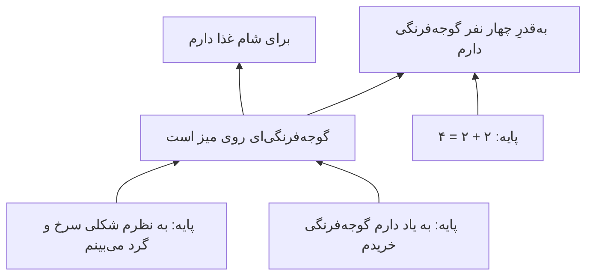

# فصل ۶. توجیه: ساختارِ دلیل‌های خوب

[← قبلی: معرفت چیست؟](05-the-nature-of-knowledge.md) · [فهرست](README.md) · [بعدی: سرچشمه‌های معرفت ←](07-sources-of-knowledge.md)

**صوت:** [شنیدنِ این فصل](audio/06-justification.mp3) (۵۴ دقیقه، روایت به انگلیسی) · [باز کردن در پخش‌کننده](audio/index.html#06)

---

> «شما را به دلِ مسیح سوگند می‌دهم، ممکن بدانید که شاید در اشتباه باشید.»
> — الیور کرامول، نامه به مجمعِ عمومیِ کلیسای اسکاتلند (۱۶۵۰)

> «ما مانندِ ملوانانی هستیم که باید کشتی‌شان را در دریای باز از نو بسازند.»
> — اتو نویرات (۱۹۳۲)

حتی اگر معرفت را نتوان باورِ صادقِ موجه تعریف کرد، **توجیه** خودش مفهومی معرفتیِ محوری است. در زندگیِ روزمره به‌ندرت با یقین می‌دانیم باوری صادق است یا نه؛ آنچه می‌توانیم بسنجیم این است که آیا *معقول* است، *به‌خوبی پشتیبانی‌شده* است، *شواهد آن را روا می‌دارند*. وقتی می‌پرسید «آیا این نتیجه‌گیریِ منصفانه‌ای است؟» یا «برای این چه پایه‌ای دارید؟»، دربارهٔ توجیه می‌پرسید.

این فصل نظریه‌های اصلی را در بر می‌گیرد: توجیه چیست، چگونه می‌تواند از دست برود (ابطال‌کننده‌ها)، چگونه می‌توان دلیل‌ها را بی‌تسلسل یا دور سامان داد (مبناگرایی، انسجام‌گرایی، تسلسل‌گرایی و ترکیب‌ها)، آیا توجیه فقط به آنچه «درونِ» ذهن است بستگی دارد (درون‌گرایی در برابرِ برون‌گرایی)، و گفتنِ اینکه با وجودِ امکانِ خطا می‌توانیم بدانیم یعنی چه (خطاپذیرگرایی).

---

## توجیه چیست

توجیه ویژگی‌ای **هنجاری** برای باورهاست: باورِ موجه باوری است که داشتنش از نظرِ معرفتی *بجا*، *معقول* یا *روا* است. فراتر از این نقطهٔ توافق، چند برداشت وجود دارد. ویلیام آلستون («مفهوم‌های توجیهِ معرفتی»، ۱۹۸۵) بسیاری از آن‌ها را از هم جدا کرد، و بعدها (*فراتر از «توجیه»*، ۲۰۰۵) استدلال کرد که فیلسوفان زیرِ یک نام از «مطلوب‌های معرفتیِ» گوناگونی سخن گفته‌اند.

| برداشت | باوری موجه است وقتی… | وابسته به |
|---|---|---|
| **تکلیف‌محور** | داشتنش هیچ وظیفهٔ معرفتی‌ای را نقض نکند؛ باورمند سرزنش‌ناپذیر باشد | دکارت، لاک، چیزم |
| **شواهدگرایانه** | با شواهدِ باورمند جور باشد | کانی و فلدمن |
| **وثاقت‌گرایانه** | فرایندی صدق‌رسان آن را پدید آورده باشد | گلدمن |
| **فضیلت‌محور** | شایستگی یا فضیلتِ فکری را نشان دهد | سوسا، زاگزبسکی |
| **انسجام‌گرایانه** | با نظامِ باورهای باورمند منسجم باشد | بونجور، لرر |

توجیه **درجه** دارد. باوری می‌تواند بهتر از باوری دیگر موجه باشد، و باوری می‌تواند تا اندازه‌ای موجه باشد بی‌آنکه به‌قدرِ کافی موجه باشد تا معرفت به شمار آید.

### توجیهِ گزاره‌ای و توجیهِ باوری

دو چیز «توجیه» نامیده می‌شود، و مهم است که آن‌ها را از هم جدا نگه داریم.

- **توجیهِ گزاره‌ای** (به تعبیرِ گلدمن: توجیهِ *پیشینی*، ex ante) داشتنِ دلیل‌های خوبِ در دسترس برای باور به p است، چه واقعاً به p باور داشته باشید چه نه، و چه به آن دلیل‌ها باور داشته باشید چه نه.
- **توجیهِ باوری** (توجیهِ *پسینی*، ex post) ویژگیِ یک باورِ واقعی است: *بر پایهٔ* دلیل‌های خوب نگه داشته می‌شود.

کارآگاهی شواهدِ قوی‌ای دارد که پیشخدمت مرتکبِ جرم شده است: اثرِ انگشت، انگیزه، نبودِ عذرِ موجه. او باور دارد پیشخدمت مرتکب شده. اما این را باور دارد چون از پیشخدمت‌ها بدش می‌آید، نه به‌خاطرِ شواهد. او توجیهِ **گزاره‌ای** دارد (شواهد از نتیجه‌اش پشتیبانی می‌کنند) اما باورش توجیهِ **باوری** ندارد (بر پایهٔ شواهد نیست).

چه چیزی لازم است تا باوری بر پایهٔ دلیلی باشد؟ این مسئلهٔ **نسبتِ ابتنا** است. طبیعی‌ترین پاسخ علّی است: دلیل باید علتِ باور باشد یا آن را نگه دارد. **وکیلِ کولی**ِ کیت لرر («دلیل‌ها چگونه به ما معرفت می‌دهند»، ۱۹۷۱) این را به چالش می‌کشد. وکیلی با فالِ ورقِ یک فالگیر به بی‌گناهیِ موکلش متقاعد می‌شود. بعدها شواهد را بررسی می‌کند و می‌بیند که بی‌گناهیِ موکل را قاطعانه ثابت می‌کنند، اما باورش هنوز از نظرِ علّی با ورق‌ها نگه داشته می‌شود؛ اگر شواهد فرو می‌ریخت، باز باور داشت. لرر استدلال کرد که باورِ وکیل به هر حال با شواهد موجه است، چون او *می‌فهمد* شواهد چگونه از آن پشتیبانی می‌کنند. بیشترِ فیلسوفان مخالف‌اند، اما این مورد نشان می‌دهد که نسبتِ ابتنا ظریف است.

> **درسی برای تفکر نقادانه.** کافی نیست که دلیل‌های خوبی برای نتیجه‌تان *وجود داشته باشند*. بپرسید آیا این‌ها همان دلیل‌هایی‌اند که واقعاً به‌خاطرشان به آن باور دارید. اگر حتی با ناپدید شدنِ آن دلیل‌ها باز همان چیز را باور می‌کردید، باورتان واقعاً بر آن‌ها استوار نیست. این نشانهٔ هشدارِ استدلالِ انگیزه‌مند است. نگاه کنید به [استدلالِ انگیزه‌مند](14-psychology-of-reasoning.md#motivated-reasoning).

### توجیهِ در نگاهِ نخست و توجیهِ با در نظر گرفتنِ همه‌چیز

باوری **در نگاهِ نخست** (prima facie) موجه است اگر توجیهی داشته باشد که بتوان بر آن غلبه کرد. **در نهایت** یا **با در نظر گرفتنِ همه‌چیز** موجه است اگر پس از در نظر گرفتنِ هر چیزِ مربوطی موجه بماند. دیدنِ اینکه دیواری سرخ به نظر می‌رسد به شما توجیهی در نگاهِ نخست برای باور به سرخ بودنش می‌دهد. فهمیدنِ اینکه با نورِ سرخ روشن شده است ممکن است آن توجیه را بگیرد. توجیهی که بتواند این‌گونه از دست برود **ابطال‌پذیر** (defeasible) است.

---

## ابطال‌کننده‌ها

**ابطال‌کننده** ملاحظه‌ای است که توجیهِ یک باور را کم می‌کند یا از میان می‌برد. جان پولاک (*نظریه‌های معاصرِ معرفت*، ۱۹۸۶) دو گونهٔ اصلی را از هم جدا کرد، و این تمایز یکی از سودمندترین ابزارهای این راهنماست.

**ابطال‌کننده‌های ردکننده** (rebutting) دلیل‌هایی‌اند برای باور به اینکه نتیجه *کاذب* است.
> باور دارید پرندهٔ روی نرده کلاغ است. پرنده‌نگری باتجربه که کنارتان ایستاده می‌گوید: «آن زاغِ بزرگ است: به دمِ گُوِه‌ای‌شکلش نگاه کن.» گواهیِ او دلیلی است برای اینکه فکر کنید باورتان کاذب است.

**ابطال‌کننده‌های زیرِپاخالی‌کن** (undercutting) دلیل‌هایی‌اند برای اینکه فکر کنید پایه‌هایتان *در این مورد* از نتیجه پشتیبانی نمی‌کنند، بی‌آنکه دلیلی برای کاذب دانستنِ نتیجه باشند.
> مثالِ پولاک: قطعه‌ای روی خطِ تولید سرخ به نظر می‌رسد، پس باور دارید سرخ است. سپس می‌فهمید که قطعه‌ها با نوری سرخ روشن می‌شوند که قطعه‌هایی به هر رنگی را سرخ نشان می‌دهد. اکنون هیچ دلیلی ندارید که فکر کنید قطعه سرخ است. اما هیچ دلیلی هم ندارید که فکر کنید سرخ *نیست*. زیرِ پای پایه‌هایتان خالی شده است.

گونه‌های دیگر:

- **ابطال‌کننده‌های مرتبهٔ بالاتر**: شاهدی بر اینکه *استدلالِ* شما آسیب دیده است. می‌فهمید دارویی به شما داده‌اند که خطاهای ظریفی در استدلال پدید می‌آورد، یا خلبانی در ارتفاعِ بالا هستید که کم‌اکسیژنی بی‌آنکه متوجه شوید داوری‌تان را مختل می‌کند. آیا باید اطمینانتان را به محاسبه‌ای که کاملاً درست به نظر می‌رسد کم کنید؟ دیوید کریستنسن و دیگران استدلال می‌کنند آری. نگاه کنید به [شواهدِ مرتبهٔ بالاتر](12-social-epistemology.md#higher-order-evidence).
- **ابطال‌کننده‌های ابطال‌کننده**: ملاحظه‌هایی که توجیه را بازمی‌گردانند. می‌فهمید نورِ سرخ یک ساعت پیش، پیش از بازرسیِ قطعه، خاموش شده بود.
- **ابطال‌کننده‌های هنجاری**: شاهدی که *باید* می‌داشتید یا در نظر می‌گرفتید، حتی اگر نداشتید. پزشکی که نتیجه‌های آزمایشگاهیِ روی میزش را نمی‌خواند نمی‌تواند ادعا کند تشخیصش صرفاً چون از آن‌ها خبر نداشت موجه بود.
- **ابطال‌کننده‌های گمراه‌کننده**: گزاره‌های صادقی که توجیهتان را ابطال می‌کنند اما از حقیقت دور می‌کنند. موردِ تام گرابیت در [فصل ۵](05-the-nature-of-knowledge.md#defeasibility-theories).

> **به کار بردنِ ابطال‌کننده‌ها در بحث.** وقتی استدلالی را نقد می‌کنید، روشن باشید که کدام گونه ابطال‌کننده را عرضه می‌کنید. «نتیجه‌ات کاذب است چون…» ابطال‌کننده‌ای ردکننده است و باری بر دوشِ *شما* می‌گذارد که از آن پشتیبانی کنید. «شواهدت از نتیجه‌ات پشتیبانی نمی‌کند چون…» ابطال‌کننده‌ای زیرِپاخالی‌کن است، و ممکن است برای نشان دادنِ شکستِ استدلال کافی باشد بی‌آنکه لازم باشد عکسش را ثابت کنید. بسیاری از بحث‌ها به بیراهه می‌روند چون منتقدی زیرِپاخالی‌کنی عرضه می‌کند و طرفِ دیگر ردکننده‌ای می‌شنود: «پس فکر می‌کنی واکسن خطرناک است؟» «نه، فکر می‌کنم این پژوهشِ خاص نشان نمی‌دهد که برای این گروه بی‌خطر است.»

---

## مسئلهٔ تسلسل

فرض کنید باور دارید فردا باران می‌بارد (ب۱). چرا؟ چون پیش‌بینیِ هوا چنین می‌گوید (ب۲). چرا به پیش‌بینی باور دارید؟ چون پیش‌بینی‌های این سرویس معمولاً درست‌اند (ب۳). چرا به این باور دارید؟ چون بارها آن‌ها را با هوای واقعی مقایسه کرده‌اید (ب۴). چرا به حافظه‌تان از آن مقایسه‌ها اعتماد می‌کنید؟ … و همین‌طور تا آخر.

اگر هر باورِ موجهی باید با باورِ موجهِ دیگری موجه شود، آن‌گاه یا:

1. زنجیره در باورهایی **پایان می‌یابد** که بی‌آنکه باورهای دیگر موجهشان کنند موجه‌اند (**مبناگرایی**)؛
2. زنجیره **دور می‌زند** و بازمی‌گردد، چنان‌که باورها در نهایت از یکدیگر پشتیبانی می‌کنند (**انسجام‌گرایی**)؛
3. زنجیره بی‌تکرار **تا ابد** ادامه می‌یابد (**تسلسل‌گرایی**)؛ یا
4. زنجیره در باورهایی پایان می‌یابد که اصلاً **موجه نیستند**، که در این صورت ظاهراً هیچ چیزی هم که بر آن‌ها تکیه دارد موجه نیست (**شکاکیت**).

ارسطو این مسئله را در *تحلیلاتِ ثانی* (کتابِ اول، فصلِ ۳) مطرح کرد و نخستین پاسخِ مبناگرایانه را داد. از آن پس این مسئله مسئلهٔ سامان‌دهندهٔ نظریهٔ توجیه بوده است.

---

## سه‌راهیِ آگریپا

شکاکِ باستانی آگریپا (سدهٔ یکمِ میلادی، شناخته‌شده از راهِ سکستوس امپیریکوس، *طرح‌های پیرونی*، کتابِ اول، بندهای ۱۶۴ تا ۱۷۷) پنج **شیوه** برای پدید آوردنِ تعلیقِ داوری صورت‌بندی کرد:

1. **اختلافِ نظر**: در هر پرسشی، مردم با هم اختلاف دارند.
2. **تسلسلِ بی‌پایان**: هر دلیلی که عرضه شود به دلیلی دیگر نیاز دارد.
3. **نسبیت**: چیزها نسبت به ناظران و اوضاعِ گوناگون به گونه‌های متفاوت ظاهر می‌شوند.
4. **فرضیه** (فرض گرفتن): جزم‌اندیش تسلسل را با فرض گرفتنِ چیزی بی‌استدلال متوقف می‌کند.
5. **دور** (دوسویگی): دلیلی که برای ادعایی عرضه می‌شود به خودِ آن ادعا وابسته است.

شیوه‌های ۲، ۴ و ۵ یک **سه‌راهی** می‌سازند: هر تلاشی برای موجه کردنِ یک باور به تسلسلی بی‌پایان، فرضی دلبخواهی، یا دوری می‌انجامد. هیچ‌کدام رضایت‌بخش به نظر نمی‌رسد. فیلسوفِ آلمانی، هانس آلبرت (*رساله‌ای دربارهٔ عقلِ نقاد*، ۱۹۶۸)، آن را **سه‌راهیِ مونش‌هاوزن** نامید، به نامِ بارون مونش‌هاوزن که ادعا می‌کرد خودش و اسبش را با کشیدنِ موهای خودش از باتلاق بیرون کشیده است.

| شاخهٔ سه‌راهی | نظریه‌ای که آن را می‌پذیرد | چگونه از این انتخاب دفاع می‌کند |
|---|---|---|
| توقف در یک فرض | مبناگرایی | پایه‌ها دلبخواهی نیستند؛ به‌طورِ غیراستنتاجی (با تجربه یا شهود) موجه‌اند |
| دور | انسجام‌گرایی | توجیه کل‌نگرانه است، نه خطی؛ پشتیبانیِ متقابل دورِ باطل نیست |
| تسلسل | تسلسل‌گرایی | زنجیره‌ای بی‌پایان از دلیل‌های در دسترس باطل نیست؛ خودِ توجیه همین است |
| پذیرفتنِ اینکه هیچ چیز موجه نیست | شکاکیت، یا عقل‌گراییِ نقدی | باید داوری را معلق گذاشت (شکاکیت)، یا عقلانیت توجیه نمی‌خواهد، فقط گشودگی به نقد (عقل‌گراییِ نقدی) |

---

## مبناگرایی

**مبناگرایی** بر آن است که باورهای موجه دو گونه‌اند:

- **باورهای پایه**: به‌طورِ *غیراستنتاجی*، نه بر پایهٔ باورهای دیگر، موجه‌اند. توجیهشان از تجربه، شهود یا سرشتِ خودشان می‌آید.
- **باورهای غیرپایه**: با استنتاجِ درست، در نهایت از باورهای پایه، موجه می‌شوند.

تصویرش یک ساختمان است: پی‌ها بارِ طبقه‌های بالا را می‌کشند و خودشان بر چیزِ دیگری تکیه ندارند. دکارت دقیقاً همین تصویر را به کار برد.

### مبناگراییِ کلاسیک

**مبناگراییِ کلاسیک** (دکارت، و به صورت‌های گوناگون لاک، راسل و سی. آی. لوئیس) معیاری بالا می‌گذارد. باورهای پایه باید **خطاناپذیر**، **شک‌ناپذیر** یا **اصلاح‌ناپذیر** باشند. نامزدهای رایج این‌هایند:

- باورها دربارهٔ حالت‌های ذهنیِ کنونیِ خود: «به نظرم چیزی سرخ می‌بینم»، «درد دارم.»
- حقیقت‌های بدیهی: «۲ + ۲ = ۴»، «هیچ چیز نمی‌تواند سراسر هم سرخ باشد و هم سبز.»

باورهای غیرپایه باید با **قیاس**، یا در روایت‌های بعدی با استنتاجی قوی، از باورهای پایه بیرون آیند.

### مبناگراییِ معتدل

بیشترِ مبناگرایانِ معاصر **مبناگرایانِ معتدل**‌اند (رابرت آئودی، جیمز پرایر، مایکل هیومر). آنان شرط‌ها را سست می‌کنند:

- باورهای پایه فقط باید **در نگاهِ نخست** موجه باشند. می‌توانند خطاپذیر و ابطال‌پذیر باشند.
- **باورهای ادراکیِ** عادی می‌توانند پایه باشند. «فنجانی روی میز است» می‌تواند مستقیماً با تجربهٔ دیداری‌تان موجه شود، بی‌استنتاج از «به نظرم فنجانی می‌بینم».
- باورهای غیرپایه می‌توانند با استنتاجِ **استقرایی** و **ابداکتیو**، نه فقط قیاسی، موجه شوند.

جیمز پرایر («توجیهِ بی‌واسطه وجود دارد»، ۲۰۰۵) و دیگران استدلال می‌کنند که برخی توجیه‌ها باید **بی‌واسطه** باشند، نه بر پایهٔ باورهای دیگر، و تجربهٔ ادراکی آن را فراهم می‌کند. این امروز رایج‌ترین دیدگاه دربارهٔ ساختارِ توجیه است.

### اعتراض‌ها به مبناگرایی

**۱. ناسازگاریِ خودارجاع** (علیهِ مبناگراییِ کلاسیک). آلوین پلنتینگا («عقل و باور به خدا»، ۱۹۸۳) یادآور شد که اصلِ مبناگراییِ کلاسیک، «باوری فقط وقتی موجه است که بدیهی، اصلاح‌ناپذیر یا برای حواس آشکار باشد، یا از چنین باورهایی استنتاج شده باشد»، خودش نه بدیهی است، نه اصلاح‌ناپذیر، نه برای حواس آشکار، و از چنین باورهایی هم استنتاج‌پذیر نیست. پس بنا به معیارِ خودش، هیچ‌کس در پذیرفتنش موجه نیست.

**۲. پایهٔ بیش از حد اندک** (علیهِ مبناگراییِ کلاسیک). اگر باورهای پایه فقط دربارهٔ حالت‌های ذهنیِ خودِ شخص باشند، و استنتاج باید قیاسی باشد، آن‌گاه تقریباً هیچ چیزی دربارهٔ جهانِ بیرون موجه‌شدنی نیست. مبناگراییِ کلاسیک به [شکاکیت](08-skepticism.md) می‌انجامد.

**۳. دوراهیِ سلارز** (ویلفرید سلارز، «تجربه‌گرایی و فلسفهٔ ذهن»، ۱۹۵۶). چه چیزی باوری پایه را موجه می‌کند؟ احتمالاً یک تجربه. اکنون:
- اگر تجربه **محتوای گزاره‌ای** داشته باشد (بازنمایی کند که چیزی چنین است)، از آن دست چیزهایی است که می‌تواند درست یا نادرست باشد، و خودش به توجیه نیاز دارد. پس نمی‌تواند پایه باشد.
- اگر تجربه **هیچ محتوای گزاره‌ای نداشته باشد** (احساسی خام باشد)، نمی‌تواند با باورها نسبتِ منطقی داشته باشد، پس نمی‌تواند چیزی را موجه کند.

این حملهٔ سلارز به **اسطورهٔ داده** است (نگاه کنید به [فصل ۲](02-history-of-epistemology.md#sellars-and-the-myth-of-the-given)). مبناگرایانِ معتدل پاسخ می‌دهند که تجربه‌ها محتوای گزاره‌ای دارند اما *باور نیستند*، پس از آن گونه حالت‌هایی نیستند که به توجیه نیاز دارند، هرچند می‌توانند درست یا نادرست باشند. جان مک‌داول (*ذهن و جهان*، ۱۹۹۴) استدلال می‌کند که تجربه پیشاپیش مفهومی است و بنابراین می‌تواند موجه کند.

**۴. اعتراضِ دلبخواهی بودن** (لارنس بونجور، *ساختارِ معرفتِ تجربی*، ۱۹۸۵). چه چیزی احتمالِ صادق بودنِ باوری پایه را بالا می‌برد؟ اگر دلیلی هست، باور با آن دلیل موجه است و پایه نیست. اگر دلیلی نیست، توجیهِ باور دلبخواهی است.

**۵. مرغِ خال‌خالی** (رودریک چیزم، «مسئلهٔ مرغِ خال‌خالی»، ۱۹۴۲، با اشاره به گیلبرت رایل). نگاهی گذرا به مرغی با ۴۸ خال می‌اندازید. تجربهٔ دیداری‌تان به یک معنا همهٔ ۴۸ خال را عرضه می‌کند. اما در باور به اینکه «مرغ ۴۸ خال دارد» موجه نیستید، هرچند اگر سه خال داشت در باور به «مرغ ۳ خال دارد» موجه می‌بودید. پس کدام ویژگیِ تجربه باورهای پایه را موجه می‌کند؟ صرفِ آنچه تجربه عرضه می‌کند نیست.

---

## انسجام‌گرایی

**انسجام‌گرایی** انکار می‌کند که هیچ باوری پایه باشد. باوری با **انسجامش** با کلِ نظامِ باورهای باورمند موجه می‌شود. پشتیبانی متقابل و کل‌نگرانه است، نه خطی.

تصویرش کشتیِ نویرات است (نگاه کنید به [فصل ۲](02-history-of-epistemology.md#logical-positivism))، یا **شبکهٔ باورِ** کواین، که در آن باورها مانندِ رشته‌های یک تور از یکدیگر پشتیبانی می‌کنند.

**انسجام چیست؟** بیش از سازگاریِ صرف (نبودِ تناقض). لارنس بونجور (*ساختارِ معرفتِ تجربی*، ۱۹۸۵) این‌ها را برمی‌شمارد:

- **سازگاریِ منطقی**.
- **سازگاریِ احتمالاتی**: باور نداشتن به چیزهایی که روی هم بسیار نامحتمل‌اند.
- **پیوندهای استنتاجی**: باورها مستلزمِ یکدیگرند یا از یکدیگر پشتیبانی می‌کنند.
- **نسبت‌های تبیینی**: باورها یکدیگر را تبیین می‌کنند. وقتی نظامی با تبیین‌های خوب یکپارچه شود، انسجام بیشتر می‌شود.
- **ناهنجاری‌های اندک**: واقعیت‌های تبیین‌نشدهٔ کم.

کیت لرر (*نظریهٔ معرفت*، ۱۹۹۰) و دانلد دیویدسن («نظریهٔ انسجامیِ صدق و معرفت»، ۱۹۸۳) از صورت‌های دیگری دفاع کردند. شعارِ دیویدسن: «هیچ چیز جز باوری دیگر نمی‌تواند دلیلی برای داشتنِ یک باور به شمار آید.»

**چرا این دورِ باطل نیست؟** انسجام‌گرایان پاسخ می‌دهند که توجیه نسبتی *خطی* نیست که در زنجیره‌ای دست‌به‌دست شود. ویژگی‌ای *کل‌نگرانه* برای کلِ یک نظام است، که باورهای منفرد با جا افتادن در آن به ارث می‌برند. پازلی را در نظر بگیرید: هیچ قطعه‌ای به‌تنهایی پایه نیست، اما وقتی همهٔ قطعه‌ها در تصویری روشن با هم جور می‌شوند، مطمئن می‌شوید که هر کدام در جای درستش است.

استدلالی کلاسیک برای قدرتِ انسجام از سی. آی. لوئیس می‌آید (*تحلیلی از معرفت و ارزش‌گذاری*، ۱۹۴۶). چند شاهدِ **مستقل**، که هر یک اعتمادپذیریِ محدودی دارند، شرحی مفصل و یکسان از رویدادی می‌دهند. هرچند هیچ شاهدِ منفردی چندان قابل‌اعتماد نیست، توافقِ روایت‌هایشان به‌سختی تبیین‌پذیر است مگر آنکه شرح صادق باشد. دادگاه‌ها هر روز بر این استدلال تکیه می‌کنند. به شرطِ ضروری توجه کنید: **استقلال**. اگر شاهدان با هم مشورت کرده باشند، یا همه یک روزنامه را خوانده باشند، توافقشان شاهدِ بسیار ضعیف‌تری است.

### اعتراض‌ها به انسجام‌گرایی

**۱. اعتراضِ انزوا (یا درونداد).** نظامی از باورها می‌تواند کاملاً منسجم و در عینِ حال یکسره از واقعیت جدا باشد. رمانی مفصل منسجم است. توهمِ بدبینانهٔ پرورده‌ای هم منسجم است، و نظریهٔ توطئهٔ پیچیده‌ای هم. انسجام به‌تنهایی نمی‌تواند تماس با جهان را تضمین کند. پاسخِ بونجور **شرطِ مشاهده** بود: نظامِ موجه باید باورهایی داشته باشد که به باورهای مشاهده‌ایِ خودجوش و غیراستنتاجی اعتمادپذیری نسبت دهند، تا تجربه راهی برای ورود و برهم زدنِ نظام داشته باشد. منتقدان پاسخ دادند که این امتیازِ بزرگی به مبناگرایی است. (خودِ بونجور بعدها مبناگرا شد.)

**۲. اعتراضِ نظام‌های بدیل.** برای هر نظامِ منسجمی، ممکن است نظامی دیگر، ناسازگار با آن، به همان اندازه منسجم باشد. کدام موجه است؟ انسجام به‌تنهایی نمی‌تواند بگوید.

**۳. مسئلهٔ پیوند با صدق.** چرا انسجام باید باوری را *محتمل‌تر به صدق* کند؟ معرفت‌شناسانِ صوری، به‌طرزی شگفت، ثابت کرده‌اند که هیچ سنجه‌ای از انسجام نیست که، با فرضِ برابریِ دیگر شرایط، به‌طورِ کلی احتمالِ صدق را بالا ببرد (لوک بووِنس و اشتفان هارتمان، *معرفت‌شناسیِ بیزی*، ۲۰۰۳؛ اریک اولسون، *علیهِ انسجام*، ۲۰۰۵). انسجام میانِ منبع‌های **مستقل** احتمال را بالا می‌برد، چنان‌که در شاهدانِ لوئیس. اما انسجامی که یک منبعِ واحد، یا تخیلِ خودِ باورمند، پدید آورده باشد چنین نمی‌کند.

> **درسی برای تفکر نقادانه.** **انسجام کافی نیست.** نظریه‌های توطئه اغلب بسیار منسجم‌اند: هر واقعیتی تبیین می‌شود، هر ناهنجاری‌ای جذب می‌شود، هر استدلالِ مخالفی پیش‌بینی شده است. این انسجام بخشی از جذابیتشان است. اما انسجام میانِ باورهایی که *برای با هم جور شدن ساخته شده‌اند* شاهدِ ضعیفی است. بپرسید: آیا بخش‌های این داستان از **منبع‌های مستقلی** می‌آیند که می‌توانستند با هم اختلاف داشته باشند؟ آیا داستان **پیش‌بینی‌های پرخطری** می‌کند که ممکن است شکست بخورند؟ آیا **دروندادی از مشاهده** دارد که پیشاپیش از صافیِ نظریه تفسیر نشده باشد؟ نگاه کنید به [نظریه‌های توطئه](12-social-epistemology.md#conspiracy-theories).

---

## تسلسل‌گرایی

**تسلسل‌گرایی**، که پیتر کلاین از آن دفاع کرده است («معرفتِ انسانی و تسلسلِ بی‌پایانِ دلیل‌ها»، ۱۹۹۹)، شاخهٔ تسلسل را می‌پذیرد: باوری موجه است وقتی زنجیره‌ای **بی‌پایان و بی‌تکرار** از دلیل‌ها برای باورمند **در دسترس** باشد.

کلاین از دو اصل استدلال می‌کند:

- **اصلِ پرهیز از دور**: هیچ دلیلی نمی‌تواند پیش‌تر در زنجیرهٔ پشتیبانیِ خودش بیاید.
- **اصلِ پرهیز از دلبخواهی بودن**: هر دلیلی باید خودش دلیلی دیگر در دسترس داشته باشد. هیچ نقطهٔ توقفی نیست که در آن دلیلی صرفاً پذیرفته شود.

این دو اصل روی هم ایجاب می‌کنند که زنجیرهٔ دلیل‌ها بی‌پایان باشد.

**اعتراض‌ها و پاسخ‌ها.**
- *ذهن‌های متناهی.* نمی‌توانیم بی‌نهایت باور داشته باشیم. پاسخِ کلاین: دلیل‌ها فقط باید **در دسترس** باشند، نه آگاهانه باور شوند. شما گرایشی دارید که وقتی به چالش کشیده می‌شوید دلیلی دیگر بیاورید.
- *اعتراضِ بی‌سرچشمگی.* اگر هیچ حلقه‌ای در زنجیره به‌طورِ مستقل توجیه نداشته باشد، افزودنِ حلقه‌های بیشتر نمی‌تواند آن را پدید آورد، همان‌طور که زنجیره‌ای بی‌پایان از آدم‌هایی که از نفرِ بعدی پول قرض می‌گیرند هرگز پولِ واقعی‌ای پدید نمی‌آورد. پاسخِ کلاین: توجیه از سرچشمه‌ای منتقل نمی‌شود؛ با گسترشِ زنجیره **پدیدار** می‌شود و افزایش می‌یابد. هرگز کامل نیست.

تسلسل‌گرایی به‌طورِ طبیعی با خطاپذیرگرایی جور است. ایجاب می‌کند که توجیه همیشه موقت است و پژوهش هرگز پایان نمی‌یابد، چون همیشه دلیلی دیگر برای جستن هست. منتقدانش این را اعترافی می‌دانند به اینکه هیچ چیز هرگز کاملاً موجه نیست.

---

## مبنا‌انسجام‌گرایی

سوزان هاک (*شواهد و پژوهش*، ۱۹۹۳) ترکیبی به نامِ **مبنا‌انسجام‌گرایی** (foundherentism) پیش نهاد. با مبناگرایی هم‌نظر است که **تجربه** در توجیه سهم دارد بی‌آنکه خودش به توجیه از سوی باورها نیاز داشته باشد. با انسجام‌گرایی هم‌نظر است که باورها **متقابلاً از یکدیگر پشتیبانی می‌کنند**، و هیچ دسته‌ای از باورها پایه نیست.

الگوی او **جدولِ کلماتِ متقاطع** است. معقول بودنِ یک پاسخ به این‌ها بستگی دارد:

1. چقدر با **سرنخش** جور است (همتای شواهدِ تجربی).
2. چقدر با **پاسخ‌های متقاطع** جور است (همتای پشتیبانیِ متقابلِ باورها).
3. خودِ *آن* پاسخ‌های متقاطع، **مستقل** از پاسخِ موردِ نظر، چقدر معقول‌اند.
4. چه اندازه از جدول **کامل** شده است (جامعیتِ شواهد).

پاسخی در جدول می‌تواند به‌خوبی پشتیبانی شود هرچند بر پاسخ‌های دیگری تکیه دارد که خودشان بر آن تکیه دارند، بی‌دورِ باطل، چون هر پاسخ با سرنخِ خودش هم لنگر انداخته است. این تصویری جذاب از شیوهٔ واقعیِ کارِ استدلالِ علمی و کارآگاهی است.

---

## عقل‌گراییِ نقدی

**عقل‌گرایانِ نقدی**، یعنی کارل پوپر، هانس آلبرت و و. و. بارتلی، راهی دیگر رفتند. آنان استدلال کردند که کلِ جست‌وجوی توجیه («توجیه‌گرایی») خطاست، و سه‌راهیِ مونش‌هاوزن نشان می‌دهد که نمی‌تواند موفق شود.

بنا بر دیدگاهِ آنان:

- ما **هرگز نمی‌توانیم** باوری را **موجه کنیم**، به این معنا که نشان دهیم صادق یا محتمل است.
- اما می‌توانیم باورها را **نقد کنیم**: بیازماییمشان، دنبالِ تناقض‌ها بگردیم، بکوشیم ردشان کنیم.
- **عقلانیت** نه در داشتنِ باورهای موجه، بلکه در داشتنِ باورهای **گشوده به نقد** و ترجیحِ آن‌هایی است که تاکنون سخت‌ترین نقدها را از سر گذرانده‌اند.

بارتلی (*عقب‌نشینی به تعهد*، ۱۹۶۲) **عقل‌گراییِ همه‌جانبه‌نقادانه** را پرورد، که *همه‌چیز*، از جمله خودِ عقل‌گرایی، را گشوده به نقد می‌داند. او استدلال کرد که این از اتهامِ اینکه عقل‌گرایی بر تعهدی غیرعقلانی استوار است می‌گریزد، اتهامی که اغلب برای ادعای هم‌ترازیِ عقل و ایمان به کار می‌رود.

**اعتراض.** وقتی عقل‌گرایانِ نقدی می‌گویند عقلانی است نظریه‌ای را ترجیح دهیم که بهتر از همه از نقد جان به در برده، منتقدان پاسخ می‌دهند که این مانندِ توجیه با نامی دیگر است. آلن ماسگریو، که خود عقل‌گرای نقدی است، این را می‌پذیرد: معقول است به نظریه‌ای که بهتر از همه آزموده شده *باور داشته باشیم*، هرچند جان به در بردنش آن را صادق یا حتی محتمل ثابت نمی‌کند. سهمِ ماندگارِ عقل‌گرای نقدی این بینش است که **نقد، نه اثبات، رشدِ معرفت را پیش می‌راند**. نگاه کنید به [پوپر و ابطال‌گرایی](10-science-and-evidence.md#popper-and-falsificationism).

---

## مقایسهٔ ساختارها

| | مبناگرایی | انسجام‌گرایی | تسلسل‌گرایی | مبنا‌انسجام‌گرایی | عقل‌گراییِ نقدی |
|---|---|---|---|---|---|
| آیا برخی باورها پایه‌اند؟ | آری | نه | نه | نه، اما تجربه دروندادی غیرباوری است | نه |
| شکلِ پشتیبانی | هرم | شبکه | زنجیرهٔ بی‌پایان | جدولِ کلماتِ متقاطع | نه پشتیبانیِ ایجابی، فقط جان به در بردن از نقد |
| پاسخ به تسلسل | در باورهای پایه پایان می‌یابد | توجیه کل‌نگرانه است | تسلسلِ بی‌پایان باطل نیست | تجربه لنگر می‌اندازد؛ باورها در هم قفل می‌شوند | توجیه را کنار بگذار |
| اعتراضِ اصلی | دوراهیِ سلارز؛ دلبخواهی بودن | انزوا؛ نظام‌های بدیل | ذهن‌های متناهی؛ بی‌سرچشمگی | گنگی | توجیه را پنهانی بازمی‌گرداند |
| چهره‌های کلیدی | ارسطو، دکارت، آئودی، پرایر | نویرات، کواین، بونجور، لرر | کلاین | هاک | پوپر، آلبرت، بارتلی |

---

## درون‌گرایی و برون‌گرایی

دومین شکافِ بزرگ دربارهٔ این است که *چه گونه چیزی* می‌تواند باوری را موجه کند.

**درون‌گرایی** بر آن است که توجیه فقط به عامل‌هایی **درونیِ** منظرِ شخص بستگی دارد. **برون‌گرایی** بر آن است که می‌تواند به عامل‌هایی **بیرون** از آن منظر بستگی داشته باشد، مانندِ اعتمادپذیریِ واقعیِ فرایندی که باور را پدید آورده، که ممکن است شخص هیچ از آن نداند.

جنیفر نیگل (*معرفت*، فصلِ ۵) بحث را با آزمونی ساده آغاز می‌کند. می‌دانید که قلهٔ اورست بلندترین کوهِ جهان است. چگونه آن را آموختید؟ مگر آنکه در آن زمان رویدادی به‌یادماندنی رخ داده باشد، تقریباً مطمئناً نمی‌توانید بگویید. پژوهشگرانِ حافظه این را **فراموشیِ منبع** می‌نامند: واقعیت‌ها را مدت‌ها پس از فراموش کردنِ اینکه از کجا آمدند نگه می‌داریم. اگر به چالش کشیده شوید، شاید فقط بتوانید بگویید آشنا به نظر می‌رسد، و احساسِ آشنایی می‌تواند گمراه کند (بسیاری «می‌دانند» پایتختِ استرالیا سیدنی است؛ کانبراست). آیا با این همه آن را می‌دانید؟

- **درون‌گرا** می‌گوید معرفتِ شما به پایه‌هایی بستگی دارد که در دسترستان است. برخی درون‌گرایان تن به پیامد می‌دهند و می‌گویند بیشترِ ما، به معنای دقیق، چنین واقعیت‌هایی را نمی‌دانیم؛ با تسامح سخن می‌گوییم، چنان‌که فرانسه را «شش‌ضلعی» می‌نامیم. دیگران می‌گویند شما پایه‌های در دسترس دارید: می‌دانید حافظه‌تان به‌طورِ کلی خوب است، و این واقعیت را بارها در جاهایی که قابل‌اعتماد به نظر می‌رسند دیده‌اید.
- **برون‌گرا** می‌گوید اگر واقعیت صادق باشد و باورتان به شیوهٔ درست به آن پیوند داشته باشد (از راهِ زنجیره‌ای قابل‌اعتماد از آموزگاران و کتاب‌ها)، می‌دانید، چه بتوانید آن پیوند را بازسازی کنید چه نه.

این بحث نوادهٔ امروزیِ تقابلِ رویکردِ اول‌شخصِ دکارت و رویکردِ سوم‌شخصِ لاک به معرفت است (نگاه کنید به [لاک](02-history-of-epistemology.md#locke)).

### درون‌گراییِ دسترسی و ذهن‌گرایی

دو صورتِ اصلیِ درون‌گرایی وجود دارد:

- **درون‌گراییِ دسترسی** (رودریک چیزم، لارنس بونجور در دورهٔ درون‌گرایی‌اش): آنچه باوری را موجه می‌کند باید تنها با تأمل برای شخص **در دسترس** باشد. باید بتوانید با اندیشیدن بگویید آیا و چرا باورتان موجه است.
- **ذهن‌گرایی** (ارل کانی و ریچارد فلدمن، «دفاع از درون‌گرایی»، ۲۰۰۱): توجیه بر حالت‌های ذهنیِ شخص **مترتب** (supervenes) است. هر دو نفری که در همهٔ حالت‌های ذهنی‌شان یکسان‌اند، در آنچه به باور داشتنش موجه‌اند یکسان‌اند.

**انگیزه‌های درون‌گرایی:**
1. **مسئولیت.** توجیه ظاهراً با مسئولیت و سرزنش پیوند دارد، و فقط می‌توانید مسئولِ چیزی باشید که به آن دسترسی دارید.
2. **منظرِ اول‌شخص.** از درون، پرسشِ «آیا باید این را باور کنم؟» فقط با رجوع به آنچه در دسترسِ من است پاسخ‌پذیر است.
3. **شهودِ دیوِ فریبکارِ نو** (نگاه کنید به پایین).

### استدلال به سودِ برون‌گرایی

**انگیزه‌های برون‌گرایی** (آلوین گلدمن، فرد درتسکی، آلوین پلنتینگا، ارنست سوسا):

1. **جانوران و کودکانِ خردسال** چیزهایی می‌دانند (سگ می‌داند صاحبش پشتِ در است)، هرچند نمی‌توانند در دلیل‌هایشان تأمل کنند.
2. **تسلسلِ دسترسی.** اگر باید از موجه‌کننده‌هایتان آگاه باشید، و آگاه باشید که موجه می‌کنند، به باورهای موجهی دربارهٔ موجه‌کننده‌هایتان نیاز دارید، که به موجه‌کننده‌هایی دیگر نیاز دارند، و همین‌طور تا آخر.
3. **پیوند با صدق.** مقصودِ توجیه محتمل‌تر کردنِ باورِ صادق است. اما اینکه فرایندی صدق‌رسان است یا نه واقعیتی دربارهٔ جهان است، نه دربارهٔ حالت‌های ذهنیِ شما. عامل‌های درونی به‌تنهایی نمی‌توانند پیوند با صدق را تضمین کنند.
4. **معرفتِ عادی پر از آن است.** بیشترِ ما نمی‌توانیم توضیح دهیم چرا حافظه یا ادراکمان قابل‌اعتماد است، اما با آن‌ها چیزهایی می‌دانیم.

### موردهای آزمونِ درون‌گرایی و برون‌گرایی

این آزمایش‌های فکری میدانِ اصلیِ نبردند.

**نورمنِ روشن‌بین** (لارنس بونجور، «نظریه‌های برون‌گرایانهٔ معرفتِ تجربی»، ۱۹۸۰). نورمن توانِ روشن‌بینیِ کاملاً قابل‌اعتمادی دارد، اما هیچ شاهدی به سود یا زیانِ امکانِ کلیِ روشن‌بینی، یا اینکه خودش آن را دارد، ندارد. روزی از راهِ این توان به این باور می‌رسد که رئیس‌جمهور در شهرِ نیویورک است. باور صادق است، و فرایندی قابل‌اعتماد آن را شکل داده. آیا نورمن موجه است؟ بونجور می‌گوید نه: از منظرِ خودِ نورمن، باور از ناکجا آمده، و داشتنش *غیرمسئولانه* است. اگر چنین باشد، اعتمادپذیری برای توجیه کافی نیست.

**سامانتای روشن‌بین** (باز بونجور، ۱۹۸۰). موردِ تیزترِ بونجور شاهدِ مخالف می‌افزاید. سامانتا باور دارد توانِ روشن‌بینی‌ای دارد که جای رئیس‌جمهور را حس می‌کند، هرچند هرگز آن را نیازموده و دلیلی ندارد که فکر کند روشن‌بینی ممکن است. روزی باور می‌کند رئیس‌جمهور در نیویورک است، با اینکه در روزنامه خوانده و زنده در تلویزیون دیده که در واشنگتن است. در واقع، گزارش‌های خبری به دلیل‌های امنیتی صحنه‌سازی شده بودند، رئیس‌جمهور *در* نیویورک است، و توانِ او، هرطور که کار کند، واقعاً قابل‌اعتماد است. نظریه‌های برون‌گرایانه ظاهراً می‌گویند او می‌داند. اما آشکارا غیرعقلانی رفتار می‌کند: شواهدِ قوی علیهِ باورش را نادیده می‌گیرد. برون‌گرایان به چند شیوه پاسخ داده‌اند (نیگل، *معرفت*، فصلِ ۵، آن‌ها را مرور می‌کند): (۱) بپذیرند که او می‌داند، و شهودِ مخالفمان را به ناآشنایی با توانایی‌های فراطبیعی نسبت دهند؛ (۲) استدلال کنند که روشِ *کلیِ* او، که نادیده گرفتنِ شواهدِ مخالف را در بر دارد، قابل‌اعتماد نیست، چون کسانی که شواهد را نادیده می‌گیرند معمولاً به خطا می‌روند (هرچند این [مسئلهٔ عمومیت](05-the-nature-of-knowledge.md#reliabilism) را بازمی‌گرداند)؛ یا (۳) شرطِ **نبودِ ابطال‌کننده** را بیفزایند: اعتمادپذیری به‌علاوهٔ نبودِ شاهدِ مخالفِ در دسترسی که نادیده گرفتنش غیرعقلانی باشد. درون‌گرایان می‌پرسند اگر شاهدِ *مخالفِ* در دسترس مهم است، چرا شاهدِ *پشتیبانِ* در دسترس نباید مهم باشد.

**ترومپ** (کیت لرر، *نظریهٔ معرفت*، ۱۹۹۰). دستگاهی که پنهانی در سرِ آقای ترومپ کاشته‌اند به‌طورِ قابل‌اعتمادی باعث می‌شود باورهای صادقی دربارهٔ دما شکل دهد. او هیچ نمی‌داند چرا این باورها را دارد و هرگز وارسی‌شان نمی‌کند. آیا در باور به «دما ۳۴ درجهٔ سانتی‌گراد است» موجه است؟ بسیاری به همان دلیلِ موردِ نورمن می‌گویند نه.

**مسئلهٔ دیوِ فریبکارِ نو** (استوارت کوهن و کیت لرر، ۱۹۸۳؛ کوهن، «توجیه و صدق»، ۱۹۸۴). همزادِ ذهنیِ دقیقِ خودتان را در جهانی تصور کنید که دیوی دکارتی آن را اداره می‌کند. همزادتان همان تجربه‌ها و همان خاطره‌ها را دارد و دقیقاً به همان شیوهٔ شما استدلال می‌کند. اما در جهانِ دیو، همهٔ باورهای ادراکیِ همزادتان کاذب‌اند، و فرایندهایی که آن‌ها را پدید می‌آورند یکسره غیرقابل‌اعتمادند. آیا همزادتان *کمتر* از شما موجه است؟ بیشترِ مردم می‌گویند نه: همزادتان همه‌چیز را درست انجام می‌دهد و فقط بدبیاری آورده است. اما وثاقت‌گرایی می‌گوید همزاد ناموجه است. این قوی‌ترین استدلال برای درون‌گرایی دربارهٔ توجیه است.

**پاسخ‌های برون‌گرایانه:**
- **وثاقت‌گراییِ جهان‌های عادی** (گلدمن، *معرفت‌شناسی و شناخت*، ۱۹۸۶): فرایندی موجه می‌کند اگر در «جهان‌های عادی»، یعنی جهان‌هایی سازگار با باورهای کلیِ ما دربارهٔ جهانِ واقعی، قابل‌اعتماد باشد. ادراک در جهان‌های عادی قابل‌اعتماد است، پس همزادِ جهانِ دیو موجه است.
- **جدا کردنِ مفهوم‌ها**: همزاد *سرزنش‌ناپذیر* است (مفهومی درون‌گرایانه) اما *تضمین* یا *معرفت* ندارد (مفهوم‌هایی برون‌گرایانه). شاید هر دو طرف دربارهٔ مفهوم‌های متفاوت درست بگویند.
- **کارکردِ درست‌گرایی** (آلوین پلنتینگا، *تضمین و کارکردِ درست*، ۱۹۹۳): باوری تضمین دارد اگر قوای شناختی‌ای که **به‌درستی کار می‌کنند** در **محیطی مناسب**، بر پایهٔ **طرحی** که با موفقیت صدق را هدف گرفته، آن را پدید آورده باشند. روشن‌بینیِ نورمن جزوِ هیچ طرحی نیست، پس باورش تضمین ندارد.
- **دیدگاه‌های ترکیبی**: ویلیام آلستون («برون‌گراییِ درون‌گرایانه»، ۱۹۸۸) بر آن بود که *پایه‌های* باورِ موجه باید در دسترس باشند، اما *کفایتشان* (اینکه آیا نشانگرهای قابل‌اعتمادِ صدق‌اند) لازم نیست. سوسا **معرفتِ حیوانی** (برون‌گرایانه) را از **معرفتِ تأملی** (که منظری درون‌گرایانه بر اعتمادپذیریِ خود را در بر دارد) جدا می‌کند.

**دو نکتهٔ دیگر از این بحث.**

- **مسئلهٔ عمومیت مسئلهٔ همه است.** درون‌گرایان مسئلهٔ عمومیت را علیهِ وثاقت‌گرایی پیش می‌کشند: کدام توصیف از فرایندِ باورساز اعتمادپذیری‌اش را تعیین می‌کند؟ اما چنان‌که نیگل یادآور می‌شود، درون‌گرایان باید داشتنِ شواهدِ خوب را از باور داشتن *به‌خاطرِ* آن‌ها جدا کنند ([نسبتِ ابتنا](#propositional-and-doxastic-justification)). عضوِ هیئتِ منصفه‌ای که شواهدِ قوی‌ای از گناهکاری دارد اما از سرِ تعصبِ نژادی رأی به محکومیت می‌دهد، چیزِ درست را به دلیلِ نادرست باور دارد. برای نقدِ او، درون‌گرایان هم باید فرایندی را که واقعاً باور را پدید آورده، در سطحِ درستی از عمومیت، توصیف کنند.
- **دو شیوهٔ اندیشیدن.** روان‌شناسان شناختِ سریع و خودکار (بازشناختنِ چهرهٔ دوست، به یاد آوردنِ اینکه ۷ × ۱۱ = ۷۷) را از استدلالِ کند و کنترل‌شده جدا می‌کنند که در آن گام‌هایی را که می‌توانیم وارسی کنیم طی می‌کنیم (نگاه کنید به [نظریه‌های دوفرایندی](14-psychology-of-reasoning.md#dual-process-theories)). دلیل‌های در دسترس برای گونهٔ دومِ اندیشیدن ضروری‌اند، و برای همین است که شرط‌های درون‌گرایانه وقتی با دقت تأمل می‌کنیم یا باید از دیدگاه‌هایمان دفاع کنیم الزام‌آور به نظر می‌رسند. با این همه، شناختِ خودکار هم به‌طورِ گسترده سرچشمهٔ معرفت پذیرفته شده است. سازشی ممکن: دسترسیِ اول‌شخص به شواهد مهم است چون برای کارکردِ *قابل‌اعتمادِ* اندیشهٔ تأملی ضروری است، نه چون شرطِ همهٔ معرفت‌هاست.

> **پیامدِ عملی.** برای ارزیابیِ باورهای *خودتان*، باید ابزارهای درون‌گرایانه به کار ببرید: فقط می‌توانید به دلیل‌ها و شواهدِ در دسترستان رجوع کنید. برای ارزیابیِ *منبع‌ها* (ابزارها، متخصصان، نهادها، روش‌ها)، پرسش‌های برون‌گرایانه حیاتی‌اند: *آیا این منبع واقعاً قابل‌اعتماد است؟ کارنامه‌اش چیست؟* روشی می‌تواند از درون قانع‌کننده به نظر برسد (طالع‌بینی، یک حسِ درونی، مرشدی کاریزماتیک) و در واقع غیرقابل‌اعتماد باشد. نگاه کنید به [متخصصان و تازه‌کاران](12-social-epistemology.md#experts-and-novices).

---

## شواهدگرایی

**شواهدگرایی** نظریهٔ درون‌گرایانهٔ پیشرو است. ارل کانی و ریچارد فلدمن («شواهدگرایی»، ۱۹۸۵؛ *شواهدگرایی*، ۲۰۰۴) آن را چنین بیان می‌کنند:

> نگرشِ باوریِ D نسبت به گزارهٔ p برای S در زمانِ t از نظرِ معرفتی موجه است اگر و تنها اگر داشتنِ D نسبت به p **با شواهدی که S در زمانِ t دارد جور باشد**.

ویژگی‌های کلیدی:

- **نگرش‌های باوری** شاملِ باور، ناباوری و تعلیقِ داوری‌اند (و در برخی روایت‌ها، درجه‌های باور). شواهدگرایی می‌گوید کدام موجه است: اگر شواهد از p پشتیبانی می‌کند باور کن، اگر از نقیضِ p پشتیبانی می‌کند ناباور باش، اگر متوازن یا ناکافی است معلق بگذار.
- **هم‌زمانی**: توجیه به شواهدی بستگی دارد که *اکنون* دارید، نه به اینکه چگونه به دستشان آوردید.
- **شواهدی که دارید**، نه شواهدی که جایی وجود دارد.

پرسش‌های گشوده برای شواهدگرایان:

- **شاهد چیست؟** تجربه‌ها؟ باورها؟ واقعیت‌های دانسته ([E = K](05-the-nature-of-knowledge.md#knowledge-first))؟ کانی و فلدمن می‌گویند حالت‌های ذهنی.
- **«جور بودن» چیست؟** پشتیبانیِ احتمالاتی؟ نسبت‌های تبیینی؟ کوین مک‌کین (*شواهدگرایی و توجیهِ معرفتی*، ۲۰۱۴) پاسخی **تبیین‌گرایانه** می‌پرورد: شواهد از p پشتیبانی می‌کنند وقتی p بخشی از بهترین تبیینِ شواهدِ در دسترس باشد.
- **شواهدی که باید می‌داشتید.** فرض کنید از خواندنِ گزارشی که می‌دانید خبرِ بدی دربارهٔ سرمایه‌گذاری‌تان دارد پرهیز می‌کنید. باورتان که سرمایه‌گذاری خوب است با شواهدتان جور است، چون با دقت شواهدتان را محدود نگه داشته‌اید. آیا موجه‌اید؟ هیلاری کورنبلیث («باورِ موجه و عملِ از نظرِ معرفتی مسئولانه»، ۱۹۸۳) و دیگران استدلال می‌کنند که توجیه به **پژوهشِ مسئولانه** هم بستگی دارد. شواهدگرایان پاسخ می‌دهند که این کوتاهی در *مسئولیتِ* معرفتی است، که از توجیه جداست. در هر حال، **نادانیِ خودخواسته** کاستی‌ای معرفتی است. نگاه کنید به [اخلاقِ باور](13-virtues-and-ethics-of-belief.md#the-ethics-of-belief-clifford-and-james).

شواهدگرایی به اصلِ هیوم نزدیک است که «خردمند باورش را با شواهد متناسب می‌کند» و به اصلِ کلیفورد. این همان دیدگاهی است که بیشترِ درس‌های تفکر نقادانه به‌طورِ ضمنی فرض می‌گیرند.

---

## وثاقت‌گرایی دربارهٔ توجیه

**وثاقت‌گراییِ فرایندی** (آلوین گلدمن، «باورِ موجه چیست؟»، ۱۹۷۹) نظریهٔ برون‌گرایانهٔ پیشرو دربارهٔ توجیه است:

> باوری موجه است اگر و تنها اگر فرایندِ باورسازِ **قابل‌اعتمادی** آن را پدید آورده باشد، فرایندی که نسبتِ بالایی از باورهای صادق پدید می‌آورد.

برای باورهای استنتاجی، گلدمن می‌افزاید که فرایند باید **به‌طورِ شرطی قابل‌اعتماد** باشد (وقتی دروندادهای صادق *داده شود*، بروندادهای صادق بدهد، چنان‌که قیاس چنین است) و خودِ دروندادها باید موجه باشند.

نمونه‌های گلدمن از فرایندهای غیرقابل‌اعتماد: «استدلالِ آشفته، آرزواندیشی، تکیه بر دلبستگیِ عاطفی، حسِ درونی یا حدسِ صرف، و تعمیمِ شتاب‌زده.» و قابل‌اعتمادها: «فرایندهای ادراکیِ معمول، به یاد آوردن، استدلالِ خوب و درون‌نگری.»

وثاقت‌گرایی با اعتراض‌هایی که در بالا توصیف شد روبه‌روست (مسئلهٔ عمومیت، نورمن، ترومپ، دیوِ فریبکارِ نو). گلدمن در کارهای بعدی (*معرفت‌شناسی و شناخت*، ۱۹۸۶؛ «شیوه‌های عامیانهٔ معرفتی و معرفت‌شناسیِ علمی»، ۱۹۹۲) روایت‌هایی برای پاسخ به آن‌ها پرورد.

وثاقت‌گرایی یک حسنِ بزرگ برای تفکر نقادانه دارد: به ما می‌گوید *روش‌ها* را ارزیابی کنیم، نه فقط باورهای منفرد را. پرسشِ کلیدی این می‌شود: **فرایندی که این باور را پدید آورده چقدر قابل‌اعتماد است؟** به باوری که روشی قابل‌اعتماد شکلش داده می‌توان اعتماد کرد حتی اگر نتوانید شخصاً استدلالش را بازسازی کنید. باوری که روشی غیرقابل‌اعتماد شکلش داده باید در آن شک کرد حتی وقتی قانع‌کننده به نظر می‌رسد. دربارهٔ اعتمادپذیریِ فرایندهای شناختیِ انسان نگاه کنید به [فصل ۱۴](14-psychology-of-reasoning.md).

---

## محافظه‌کاریِ پدیداری

مایکل هیومر (*شکاکیت و پردهٔ ادراک*، ۲۰۰۱؛ «محافظه‌کاریِ پدیداریِ دلسوزانه»، ۲۰۰۷) اصلی ساده و اثرگذار پیش نهاد:

> **محافظه‌کاریِ پدیداری**: اگر به نظرِ S برسد که p، آن‌گاه، در نبودِ ابطال‌کننده‌ها، S به همین سبب دست‌کم درجه‌ای از توجیه برای باور به p دارد.

«به نظر رسیدن‌ها» شاملِ به نظر رسیدن‌های ادراکی (به نظر می‌رسد گربه‌ای هست)، به نظر رسیدن‌های حافظه، به نظر رسیدن‌های عقلی (به نظر می‌رسد ۲ + ۲ = ۴، یا شکنجه برای سرگرمی نادرست است) و به نظر رسیدن‌های درون‌نگرانه‌اند.

هیومر **استدلالی خودشکن** عرضه می‌کند: همهٔ باورهای ما، از جمله این باور که محافظه‌کاریِ پدیداری کاذب است، در نهایت بر اینکه چیزها چگونه به نظرمان می‌رسند تکیه دارند. پس هر کس این اصل را رد کند پایه‌های خودش برای رد کردنش را سست می‌کند.

دیدگاه‌های خویشاوند: **جزم‌گراییِ** جیمز پرایر («شکاک و جزم‌گرا»، ۲۰۰۰)، که می‌گوید تجربهٔ ادراکی توجیهی بی‌واسطه و در نگاهِ نخست می‌دهد بی‌آنکه به توجیهِ پیشینی برای قابل‌اعتماد دانستنِ ادراک نیاز داشته باشد (نگاه کنید به [جزم‌گرایی](08-skepticism.md#dogmatism))، و **اصلِ زودباوریِ** ریچارد سوینبرن (*وجودِ خدا*، ۱۹۷۹)، که همین ایده را بر تجربهٔ دینی اعمال می‌کند.

**اعتراض‌ها.**
- **نفوذِ شناختی.** سوزانا سیگل (*عقلانیتِ ادراک*، ۲۰۱۷) جک را تصور می‌کند که می‌ترسد جیل از او خشمگین باشد. وقتی جیل را می‌بیند، چهره‌اش به نظرِ او خشمگین *می‌آید*، چون ترسش ادراکش را شکل داده است. آیا این به نظر رسیدن باورش را موجه می‌کند؟ به‌طورِ شهودی، نه؛ با ترسِ پیشینش آلوده شده است. اگر به نظر رسیدن‌ها می‌توانند با سوگیری، پیش‌داوری و آرزواندیشی شکل بگیرند، محافظه‌کاریِ پدیداری ظاهراً به ادراکِ سوگیرانه توجیهی ناشایست می‌دهد. نگاه کنید به [نفوذِ شناختی و نظریه‌بارگی](07-sources-of-knowledge.md#cognitive-penetration-and-theory-ladenness).
- **بیش از حد سهل‌گیر.** به نظرِ نظریه‌پردازِ توطئه‌ای سرسخت، *به نظر می‌رسد* شواهد به پنهان‌کاری اشاره دارند. آیا نظریه‌پردازِ توطئه به همین سبب توجیه دارد؟ هیومر پاسخ می‌دهد که این توجیه فقط در نگاهِ نخست است و شواهدِ مخالف به‌آسانی ابطالش می‌کنند. منتقدان پاسخ می‌دهند که چنین کسانی اغلب ابطال‌کننده‌ها را بازنمی‌شناسند.

ایده‌ای خویشاوند و کهن‌تر **محافظه‌کاریِ معرفتی** است (گیلبرت هارمن، *تغییرِ دیدگاه*، ۱۹۸۶؛ «اصلِ کمترین بریدگیِ» کواین): در ادامه دادن به باور داشتنِ آنچه از پیش باور دارید موجه‌اید، مگر آنکه دلیلی ایجابی برای تغییر داشته باشید. این توضیح می‌دهد چرا لازم نیست همهٔ باورها را پیوسته از نو موجه کنیم، اما خطرِ ریشه‌دار کردنِ هر چیزی را دارد که اتفاقاً نخست باور کرده‌ایم.

---

## مسئلهٔ معیار

رودریک چیزم (*مسئلهٔ معیار*، ۱۹۷۳)، با تکیه بر سکستوس امپیریکوس و مونتنی، معمایی بنیادی دربارهٔ اینکه معرفت‌شناسی اصلاً چگونه می‌تواند آغاز شود پیش کشید. دو پرسش هست:

- **(الف)** *چه چیزی را می‌دانیم؟* (گسترهٔ معرفتِ ما چیست؟)
- **(ب)** *چگونه باید تصمیم بگیریم که آیا می‌دانیم؟* (معیارهای معرفت چیست؟)

به نظر می‌رسد نمی‌توانیم بی‌آنکه نخست به (ب) پاسخ دهیم به (الف) پاسخ دهیم: برای جدا کردنِ معرفت از نامعرفت، به معیاری نیاز داریم. و نمی‌توانیم بی‌آنکه نخست به (الف) پاسخ دهیم به (ب) پاسخ دهیم: برای آزمودنِ معیاری، به موردهای روشنی از معرفت نیاز داریم تا آن را با آن‌ها بسنجیم. سه پاسخ هست:

1. **شکاکیت**: به هیچ‌کدام نمی‌توانیم پاسخ دهیم، پس هیچ نمی‌دانیم.
2. **روش‌گرایی**: با (ب)، یعنی یک معیار، آغاز کنید و با آن تعیین کنید چه چیزی را می‌دانیم. دکارت (ادراکِ روشن و متمایز) و لاک (تجربه‌گرایی) روش‌گرا بودند. خطر: معیاری بد معرفتِ آشکار را بیرون می‌گذارد. معیارِ تجربه‌گرایانهٔ هیوم ظاهراً معرفت به علیت و جهانِ بیرون را بیرون گذاشت.
3. **جزئی‌گرایی**: با (الف)، یعنی موردهای جزئیِ روشنِ معرفت («می‌دانم دست دارم»)، آغاز کنید و معیارها را از آن‌ها بیرون بکشید. رید، مور و چیزم جزئی‌گرا بودند. خطر: ممکن است با موردهایی آغاز کنیم که اصلاً معرفت نیستند.

چیزم از جزئی‌گرایی دفاع کرد و پذیرفت که نمی‌تواند شکاک را رد کند، فقط می‌تواند انتخابی دیگر بکند. در عمل، بیشترِ فیلسوفان **تعادلی تأملی** میانِ موردها و معیارها به کار می‌برند و هر کدام را در پرتوِ دیگری تعدیل می‌کنند. نگاه کنید به [تعادلِ تأملی](04-language-concepts-and-definitions.md#reflective-equilibrium).

این معما همان شکلِ مسئلهٔ ارزیابیِ منبع‌ها در زندگیِ روزمره را دارد: برای دانستنِ اینکه کدام متخصصان قابل‌اعتمادند، باید بدانید چه چیزی درست است؛ برای دانستنِ اینکه چه چیزی درست است، به متخصصان تکیه می‌کنید. نگاه کنید به [متخصصان و تازه‌کاران](12-social-epistemology.md#experts-and-novices).

---

## تکلیف‌گرایی و اراده‌گراییِ باوری

برداشتِ **تکلیف‌محور** از توجیه آن را بر حسبِ وظیفه‌ها و اجازه‌ها می‌بیند: باوری موجه است وقتی داشتنش *از نظرِ معرفتی رواست*، وقتی باورمند هیچ وظیفهٔ معرفتی‌ای را نقض نمی‌کند و سرزنش‌ناپذیر است. این برداشت طبیعی است. چیزهایی از این دست می‌گوییم: «نباید هرچه می‌خوانی باور کنی»، و آدم‌ها را به‌خاطرِ زودباوری سرزنش می‌کنیم.

اما با مشکلی روبه‌روست. «باید» مستلزمِ «توانستن» است. اگر دربارهٔ آنچه باور می‌کنیم وظیفه‌هایی داریم، پس باید بتوانیم آنچه را باور می‌کنیم مهار کنیم. آیا می‌توانیم؟

**اراده‌گراییِ باوریِ مستقیم**، یعنی این دیدگاه که می‌توانیم به اراده باور کنیم، کاذب به نظر می‌رسد. بکوشید همین حالا باور کنید روی ماه هستید، یا ۲ + ۲ = ۵. می‌توانید واژه‌ها را بگویید، اما نمی‌توانید خودتان را به باور داشتنشان وادارید. برنارد ویلیامز («تصمیم به باور گرفتن»، ۱۹۷۰) استدلال کرد که این صرفاً واقعیتی امکانی نیست که نمی‌توانیم به اراده باور کنیم: باور صدق را هدف می‌گیرد، و اگر می‌دانستید باوری را با کنشی ارادی، بی‌اعتنا به صدق، به دست آورده‌اید، نمی‌توانستید آن را باوری دربارهٔ چگونگیِ چیزها بدانید.

ویلیام آلستون («برداشتِ تکلیف‌محور از توجیهِ معرفتی»، ۱۹۸۸) نتیجه گرفت که چون مهارِ ارادی بر باورهایمان نداریم، برداشتِ تکلیف‌محور باید کنار گذاشته شود.

**پاسخ‌ها:**
- **مهارِ غیرمستقیم.** نمی‌توانیم باورها را مستقیم برگزینیم، اما مهار می‌کنیم که چه شواهدی گرد آوریم، به چه چیزی توجه کنیم، به کدام منبع‌ها رجوع کنیم، چه مدت سنجش کنیم، و چه عادت‌های فکری‌ای بپروریم. پاسکال به بی‌ایمانی که خواهانِ ایمان بود توصیه کرد «آبِ مقدس برگیر، بگذار برایت آیین‌های عشای ربانی برگزار کنند» و مانندِ این‌ها. وظیفه‌های ما شاید وظیفه‌های **پژوهش** باشند، نه مستقیماً وظیفه‌های باور.
- **مهارِ سازگارگرایانه** (ماتیاس اشتوپ، «آزادیِ باوری»، ۲۰۰۸): باورها به معنای مهم «آزاد»ند اگر به دلیل‌ها پاسخ دهند، چنان‌که کنش‌ها به معنای سازگارگرایانه وقتی به دلیل‌ها پاسخ می‌دهند آزادند.
- **پاسخ‌گویی** (پاملا هیرونیمی، «مسئولیت برای باور داشتن»، ۲۰۰۸): ما مسئولِ باورهایمان هستیم نه چون آن‌ها را برمی‌گزینیم، بلکه چون داوریِ خودمان را دربارهٔ اینکه چه چیزی صادق است بازمی‌تابانند. می‌توان به‌حق دلیل‌هایمان را از ما پرسید، و وقتی بدند نقدمان کرد، چنان‌که با عاطفه‌هایی مانندِ رنجش.

> **پیامدِ عملی.** نمی‌توانید تصمیم بگیرید چیزی را باور کنید. اما *مسئولِ* عادت‌های پژوهشتان هستید: اینکه آیا دنبالِ شواهدِ مخالف می‌گردید، آیا به منبع‌های قابل‌اعتماد رجوع می‌کنید، آیا ادعاها را پیش از هم‌رسانی وارسی می‌کنید. مسئولیتِ معرفتی بیشتر دربارهٔ همین انتخاب‌های غیرمستقیم است. نگاه کنید به [فصل ۱۳](13-virtues-and-ethics-of-belief.md).

---

## خطاپذیرگرایی

**خطاپذیرگرایی** این دیدگاه است که می‌توانیم معرفت، یا باورِ موجه، داشته باشیم هرچند پایه‌هایمان صدقِ آنچه را باور داریم **تضمین نمی‌کنند**. می‌توانیم p را بدانیم هرچند، با شواهدی که داریم، ممکن است p کاذب باشد. این اصطلاح را چارلز سندرز پرس ساخت، که نوشت «آدمیان نمی‌توانند در مسائلِ واقعی به یقینِ مطلق برسند.»

خطاپذیرگرایی دیدگاهِ غالب در معرفت‌شناسیِ معاصر است، و برای تفکر نقادانه ضروری است. تقریباً همهٔ معرفتِ ما، از جمله معرفتِ علمی، خطاپذیر است. شواهد نتیجه‌ها را محتمل می‌کنند، نه یقینی.

خطاپذیرگرایی را باید از موضع‌هایی که اغلب با آن اشتباه گرفته می‌شود جدا کرد:

| دیدگاه | ادعا |
|---|---|
| **خطاپذیرگرایی** | می‌توانیم p را بدانیم هرچند ممکن است خطا کنیم. |
| **خطاناپذیرگرایی** | معرفت پایه‌هایی می‌خواهد که خطا را ناممکن کنند. |
| **شکاکیت** | چون ممکن است خطا کنیم، نمی‌دانیم (خطاناپذیرگرایی + پایه‌های ما خطاپذیرند). |
| **نسبی‌گرایی** | هیچ حقیقتِ عینی‌ای نیست که بشود دربارهٔ آن خطا کرد. |
| **جزم‌اندیشی** (به معنای روزمره) | امتناع از در نظر گرفتنِ اینکه ممکن است خطا کنیم. |

خطاپذیرگرایی این دیدگاه *نیست* که باید در همه‌چیز شک کنیم، یا همهٔ دیدگاه‌ها به یک اندازه خوب‌اند، یا اطمینان همیشه نابجاست. خطاپذیرگرا می‌تواند بسیار مطمئن باشد که زمین به دورِ خورشید می‌گردد، و درست است که چنین باشد. نکته این است که اطمینان باید با شواهد متناسب باشد، و حتی باورهای به‌خوبی تثبیت‌شده اصولاً گشوده به بازبینی می‌مانند.

**معمایی برای خطاپذیرگرایان.** دیوید لوئیس («معرفتِ گریزپا»، ۱۹۹۶) یادآور شد که خطاپذیرگرایی وقتی بلند گفته شود عجیب به نظر می‌رسد: «اگر خطاپذیرگرایی راضی هستید، از شما تمنا می‌کنم صادق باشید، ساده‌دل باشید، آن را تازه بشنوید. "او می‌داند، اما همهٔ امکان‌های خطا را منتفی نکرده است." حتی اگر گوش‌هایتان را بی‌حس کرده باشید، آیا این خطاپذیرگراییِ آشکار و صریح *باز هم* نادرست به گوش نمی‌رسد؟» گزاره‌هایی به صورتِ «می‌دانم که p، اما ممکن است خطا کنم» **نسبت‌دهی‌های امتیازدهندهٔ معرفت** نامیده می‌شوند (پاتریک ریسیو، ۲۰۰۱). فیلسوفان بحث می‌کنند که آیا عجیب بودنشان صرفاً گفت‌وگویی است (جلب توجه به امکانی دور گمراه‌کننده است) یا چیزی دربارهٔ خودِ معرفت آشکار می‌کند. پاسخِ لوئیس [زمینه‌گرایی](08-skepticism.md#contextualism) بود.

> **هستهٔ عملیِ خطاپذیرگرایی.** التماسِ کرامول، «ممکن بدانید که شاید در اشتباه باشید»، گاهی در آمار **قاعدهٔ کرامول** نامیده می‌شود: هرگز به گزاره‌ای تجربی احتمالِ دقیقاً ۰ یا ۱ ندهید، چون در این صورت هیچ شاهدی هرگز نمی‌تواند نظرتان را عوض کند (نگاه کنید به [قضیهٔ بیز](09-induction-probability-bayes.md#bayes-theorem)). خطاپذیرگرا باورها را آن‌قدر محکم نگه می‌دارد که بر پایه‌شان عمل کند و آن‌قدر سست که بازبینی‌شان کند. در بحث، پرسشِ خطاپذیرگرایانه این است: ***چه شاهدی نظرم را عوض می‌کند؟*** اگر پاسخ «هیچ» باشد، باور همچون جزم نگه داشته می‌شود، نه همچون نتیجه.

---

## فهمِ خود را بسنجید

**۱.** توجیهِ گزاره‌ای را با مثالی از خودتان از توجیهِ باوری جدا کنید.

پاسخ

گزاره‌ای: دلیل‌های خوبِ در دسترس برای p دارید. باوری: باورِ واقعی‌تان به p بر دلیل‌های خوب استوار است. نمونه: عضوِ هیئتِ منصفه‌ای شواهدِ قوی‌ای از دی‌ان‌ای دربارهٔ گناهکاری شنیده اما رأی به گناهکاری می‌دهد چون متهم «قیافهٔ مشکوکی دارد». او برای حکم توجیهِ گزاره‌ای دارد، اما باورش توجیهِ باوری ندارد.

**۲.** هر کدام را ابطال‌کنندهٔ ردکننده یا زیرِپاخالی‌کن بدانید. باور دارید دوستتان خانه است چون ماشینش جلوی خانه پارک است. (الف) می‌فهمید این هفته ماشینش را به برادرش قرض داده است. (ب) پیامکی از او می‌گیرید که می‌گوید در فرودگاه است.

پاسخ

(الف) زیرِپاخالی‌کن: پشتیبانی‌ای را که ماشین می‌داد از میان می‌برد، بی‌آنکه نشان دهد او خانه نیست. (ب) ردکننده: شاهدی مستقیم است که او خانه نیست.

**۳.** سه‌راهیِ آگریپا و نظریه‌ای را که هر شاخه را می‌پذیرد بیان کنید.

پاسخ

هر توجیهی به تسلسلی بی‌پایان، دوری، یا فرضی ناموجه می‌انجامد. تسلسل‌گرایی تسلسل را می‌پذیرد؛ انسجام‌گرایی دوری (کل‌نگرانه) را؛ مبناگرایی در «فرض‌ها» می‌ایستد، که استدلال می‌کند باورهای پایهٔ غیردلبخواهی‌اند. شکاکیت و عقل‌گراییِ نقدی سه‌راهی را نشانهٔ آن می‌دانند که توجیهِ ایجابی در دسترس نیست.

**۴.** دوراهیِ سلارز چیست، و مبناگرایانِ معتدل چگونه پاسخ می‌دهند؟

پاسخ

تجربه یا محتوای گزاره‌ای دارد (و بنابراین خودش توجیه می‌خواهد) یا ندارد (و بنابراین نمی‌تواند از نظرِ منطقی از باورها پشتیبانی کند). در هر دو حال نمی‌تواند پایه باشد. مبناگرایانِ معتدل پاسخ می‌دهند که تجربه‌ها محتوای گزاره‌ای دارند اما باور نیستند؛ می‌توانند درست یا نادرست باشند، اما از آن گونه حالت‌هایی نیستند که توجیه می‌خواهند. می‌توانند توجیه ببخشند بی‌آنکه به آن نیاز داشته باشند.

**۵.** چرا انسجامِ یک نظریهٔ توطئه شاهدِ ضعیفی بر صدقِ آن است؟

پاسخ

چون انسجام فقط وقتی احتمالِ صدق را بالا می‌برد که قطعه‌های منسجم از منبع‌های مستقل آمده باشند. نظریه‌های توطئه معمولاً برای جور شدن ساخته می‌شوند: واقعیت‌ها از صافیِ نظریه گزینش و تفسیر می‌شوند، ناهنجاری‌ها با افزودنِ ادعاهای کمکی جذب می‌شوند، و شواهدِ مخالف بخشی از پنهان‌کاری تفسیر می‌شوند. چنین انسجامی را می‌توان تقریباً برای هر داستانی ساخت. نتیجه‌های صوری در معرفت‌شناسیِ بیزی تأیید می‌کنند که انسجام به‌تنهایی صدق‌رسان نیست.

**۶.** مسئلهٔ دیوِ فریبکارِ نو چیست، و کدام نظریه را هدف می‌گیرد؟

پاسخ

همزادِ ذهنیِ شما در جهانِ دیو همان تجربه‌ها را دارد و به همان شیوه استدلال می‌کند، اما همهٔ باورهای ادراکی‌اش کاذب‌اند و فرایندهایی غیرقابل‌اعتماد پدیدشان آورده‌اند. به‌طورِ شهودی، همزاد به اندازهٔ شما موجه است. این وثاقت‌گرایی را هدف می‌گیرد، که ایجاب می‌کند همزاد ناموجه است، و از درون‌گرایی پشتیبانی می‌کند.

**۷.** اگر نمی‌توانید برگزینید چه چیزی را باور کنید، آیا می‌توان شما را به‌خاطرِ یک باور سرزنش کرد؟

پاسخ

می‌توان استدلال کرد آری. (۱) پژوهشتان را مهار می‌کنید: چه شواهدی می‌جویید، به چه چیزی توجه می‌کنید، به کدام منبع‌ها اعتماد می‌کنید. (۲) بنا بر دیدگاهی سازگارگرایانه، باورها وقتی به دلیل‌ها پاسخ می‌دهند آزادند. (۳) بنا بر دیدگاهِ هیرونیمی، در برابرِ باورهایتان پاسخ‌گو هستید چون داوریِ خودتان را بیان می‌کنند، همان‌طور که در برابرِ رنجش یا ستایشتان پاسخ‌گو هستید.

**۸.** آیا جملهٔ «می‌دانم واکسن‌ها اوتیسم ایجاد نمی‌کنند، اما ممکن است اشتباه کنم» منسجم است؟

پاسخ

بنا بر دیدگاهی خطاپذیرگرایانه، آری. معرفت ناممکن بودنِ خطا را نمی‌خواهد، و شواهد علیهِ پیوندِ واکسن و اوتیسم بسیار قوی است (پژوهش‌هایی بزرگ روی میلیون‌ها کودک، و مقالهٔ اصلیِ ۱۹۹۸ پس از آنکه معلوم شد تقلبی بوده پس گرفته شد). اما جمله *عجیب به گوش می‌رسد*، و برخی فیلسوفان (لوئیس) این عجیب بودن را جدی می‌گیرند. راهِ طبیعی‌ترِ بیانِ همین موضعِ خطاپذیرگرایانه: «شواهد خردکننده است، و برای عوض کردنِ نظرم به شواهدِ تازه‌ای خارق‌العاده نیاز دارم.»

---

## برای مطالعهٔ بیشتر

**بررسی‌ها**
- Richard Fumerton, *Epistemology* (Blackwell, 2006).
- Laurence BonJour and Ernest Sosa, *Epistemic Justification: Internalism vs. Externalism, Foundations vs. Virtues* (Blackwell, 2003). مناظره‌ای میانِ دو چهرهٔ پیشرو.
- Matthias Steup, John Turri, and Ernest Sosa (eds.), *Contemporary Debates in Epistemology* (Wiley-Blackwell, 2nd ed. 2014). جستارهای جفت در دو سوی پرسش‌های اصلی.
- Ali Hasan and Richard Fumerton, "Foundationalist Theories of Epistemic Justification"; Erik Olsson, "Coherentist Theories of Epistemic Justification"; Scott Aikin and Peter Klein, "Infinitism" (همه در *Stanford Encyclopedia of Philosophy*).

**آثارِ کلاسیک**
- Roderick Chisholm, *Theory of Knowledge* (Prentice-Hall, 1966; 3rd ed. 1989). به فارسی هم ترجمه شده است.
- Laurence BonJour, *The Structure of Empirical Knowledge* (Harvard University Press, 1985).
- Susan Haack, *Evidence and Inquiry* (Blackwell, 1993; expanded ed. Prometheus, 2009).
- Alvin Goldman, "What Is Justified Belief?" (1979)، در بسیاری از گلچین‌ها بازچاپ شده است.
- Earl Conee and Richard Feldman, *Evidentialism: Essays in Epistemology* (Oxford University Press, 2004).
- Alvin Plantinga, *Warrant: The Current Debate* and *Warrant and Proper Function* (Oxford University Press, 1993).
- Michael Huemer, *Skepticism and the Veil of Perception* (Rowman & Littlefield, 2001).
- John Pollock and Joseph Cruz, *Contemporary Theories of Knowledge* (Rowman & Littlefield, 2nd ed. 1999).

---

[← قبلی: معرفت چیست؟](05-the-nature-of-knowledge.md) · [فهرست](README.md) · [بعدی: سرچشمه‌های معرفت ←](07-sources-of-knowledge.md)
