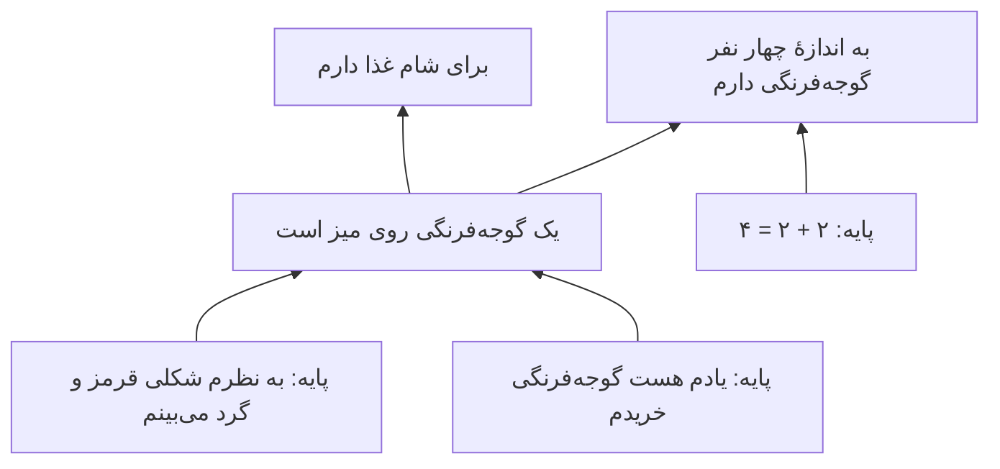
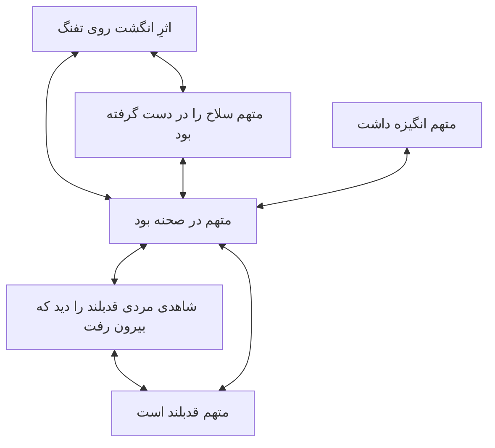

# فصل ۶. توجیه: ساختارِ دلیل‌های خوب

[← قبلی: معرفت چیست؟](05-the-nature-of-knowledge.md) · [فهرست](README.md) · [بعدی: سرچشمه‌های معرفت ←](07-sources-of-knowledge.md)

**صوت:** [شنیدنِ این فصل](audio/06-justification.mp3) (۱ ساعت و ۱۲ دقیقه) · [باز کردن در پخش‌کننده](audio/index.html#06)

---

> «شما را به دلِ مسیح قسم می‌دهم، احتمال بدهید که شاید اشتباه می‌کنید.»
> — الیور کرامول، نامه به مجمعِ عمومیِ کلیسای اسکاتلند (۱۶۵۰)

> «ما مثلِ ملوانانی هستیم که باید کشتی‌شان را وسطِ دریا از نو بسازند.»
> — اتو نویرات (۱۹۳۲)

حتی اگر نشود معرفت را باورِ صادقِ موجه تعریف کرد، **توجیه** خودش یکی از مفهوم‌های اصلیِ معرفت‌شناسی است. در زندگیِ روزمره به‌ندرت با یقین می‌دانیم یک باور درست است یا نه. چیزی که می‌توانیم بسنجیم این است که آیا *معقول* است، آیا *پشتوانهٔ خوبی* دارد، و آیا *شواهد اجازه‌اش را می‌دهند*. وقتی می‌پرسید «آیا این نتیجه‌گیریِ منصفانه‌ای است؟» یا «برای این حرف چه دلیلی دارید؟»، دارید دربارهٔ توجیه می‌پرسید.

این فصل نظریه‌های اصلی را بررسی می‌کند: توجیه چیست؛ چطور ممکن است از دست برود (ابطال‌کننده‌ها)؛ چطور می‌شود دلیل‌ها را بدونِ تسلسل یا دور مرتب کرد (مبناگرایی، انسجام‌گرایی، تسلسل‌گرایی و ترکیب‌هایشان)؛ آیا توجیه فقط به چیزهایی بستگی دارد که «درونِ» ذهن‌اند (درون‌گرایی در برابرِ برون‌گرایی)؛ و اینکه وقتی می‌گوییم با وجودِ امکانِ خطا باز هم می‌توانیم بدانیم، منظورمان چیست (خطاپذیرگرایی).

---

## توجیه چیست

توجیه یک ویژگیِ **هنجاری** (ارزشی) برای باورهاست: باورِ موجه باوری است که داشتنش از نظرِ معرفتی *به‌جا*، *معقول* یا *مجاز* است. اما فراتر از این نقطهٔ توافق، برداشت‌های مختلفی وجود دارد. ویلیام آلستون («مفهوم‌های توجیهِ معرفتی»، ۱۹۸۵) خیلی از آن‌ها را از هم جدا کرد، و بعدها (*فراتر از «توجیه»*، ۲۰۰۵) استدلال کرد که فیلسوفان زیرِ یک اسم دربارهٔ «چیزهای خوبِ معرفتیِ» مختلفی حرف زده‌اند.

| برداشت | باوری موجه است وقتی... | مربوط به |
|---|---|---|
| **وظیفه‌محور** | داشتنش هیچ وظیفهٔ معرفتی‌ای را زیر پا نگذارد؛ باورکننده قابلِ سرزنش نباشد | دکارت، لاک، چیزم |
| **شواهدگرایانه** | با شواهدِ باورکننده جور باشد | کانی و فلدمن |
| **وثاقت‌گرایانه** | یک فرایندِ حقیقت‌رسان آن را ساخته باشد | گلدمن |
| **فضیلت‌محور** | شایستگی یا فضیلتِ فکری را نشان دهد | سوسا، زاگزبسکی |
| **انسجام‌گرایانه** | با نظامِ باورهای باورکننده جور و منسجم باشد | بونجور، لرر |

توجیه **درجه** دارد. یک باور می‌تواند بهتر از باورِ دیگری موجه باشد، و یک باور می‌تواند تا حدی موجه باشد بی‌آنکه آن‌قدر موجه باشد که معرفت حساب شود.

### توجیهِ گزاره‌ای و توجیهِ باوری

دو چیز «توجیه» نامیده می‌شوند، و مهم است که آن‌ها را از هم جدا نگه داریم.

- **توجیهِ گزاره‌ای** (به قولِ گلدمن: توجیهِ *پیشاپیش*، ex ante) یعنی داشتنِ دلیل‌های خوبِ در دسترس برای باور به p، چه واقعاً به p باور داشته باشید چه نه، و چه به‌خاطرِ آن دلیل‌ها باور داشته باشید چه نه.
- **توجیهِ باوری** (توجیهِ *پس از آن*، ex post) ویژگیِ یک باورِ واقعی است: یعنی این باور *بر پایهٔ* دلیل‌های خوب نگه داشته می‌شود.

کارآگاهی شواهدِ قوی‌ای دارد که پیشخدمت مجرم است: اثرِ انگشت، انگیزه، نداشتنِ عذرِ قابل‌قبول. او باور دارد پیشخدمت مجرم است. اما این را باور دارد چون از پیشخدمت‌ها بدش می‌آید، نه به‌خاطرِ شواهد. او توجیهِ **گزاره‌ای** دارد (شواهد از نتیجه‌اش پشتیبانی می‌کنند)، اما باورش توجیهِ **باوری** ندارد (بر پایهٔ شواهد نیست).

چه چیزی لازم است تا یک باور بر پایهٔ یک دلیل باشد؟ این مسئلهٔ **رابطهٔ ابتنا** (basing relation) است. طبیعی‌ترین جواب علّی است: دلیل باید علتِ باور باشد یا آن را سرِ پا نگه دارد. **وکیلِ کولی**ِ کیت لرر («دلیل‌ها چطور به ما معرفت می‌دهند»، ۱۹۷۱) این را به چالش می‌کشد. وکیلی با فالِ ورقِ یک فالگیر قانع می‌شود که موکلش بی‌گناه است. بعدها شواهد را بررسی می‌کند و می‌بیند که بی‌گناهیِ موکل را قاطعانه ثابت می‌کنند، اما باورش هنوز از نظرِ علّی به ورق‌ها وابسته است؛ اگر شواهد فرو می‌ریخت، باز هم باور داشت. لرر استدلال کرد که باورِ وکیل به هر حال با شواهد موجه است، چون او *می‌فهمد* شواهد چطور از آن پشتیبانی می‌کنند. بیشترِ فیلسوفان مخالف‌اند، اما این مورد نشان می‌دهد که رابطهٔ ابتنا ظریف است.

> **درسی برای تفکرِ نقادانه.** کافی نیست که دلیل‌های خوبی برای نتیجه‌تان *وجود داشته باشد*. بپرسید آیا همین‌ها دلیل‌هایی‌اند که واقعاً به‌خاطرشان باور دارید. اگر حتی با از بین رفتنِ آن دلیل‌ها باز همان چیز را باور می‌کردید، باورتان واقعاً بر آن‌ها تکیه ندارد. این یکی از نشانه‌های هشداردهندهٔ استدلالِ انگیزه‌مند است. نگاه کنید به [استدلالِ انگیزه‌مند](14-psychology-of-reasoning.md#motivated-reasoning).

### توجیهِ در نگاهِ اول و توجیهِ با در نظر گرفتنِ همه‌چیز

یک باور **در نگاهِ اول** (prima facie) موجه است اگر توجیهی داشته باشد که ممکن است چیزی بر آن غلبه کند. **در نهایت** یا **با در نظر گرفتنِ همه‌چیز** موجه است اگر پس از در نظر گرفتنِ همهٔ چیزهای مربوط باز موجه بماند. دیدنِ اینکه دیواری قرمز به نظر می‌رسد به شما توجیهِ در نگاهِ اول برای باور به قرمز بودنش می‌دهد. فهمیدنِ اینکه دیوار با نورِ قرمز روشن شده ممکن است آن توجیه را از بین ببرد. توجیهی که بتواند این‌طور از دست برود **ابطال‌پذیر** (defeasible) است.

---

## ابطال‌کننده‌ها

**ابطال‌کننده** چیزی است که توجیهِ یک باور را کم می‌کند یا از بین می‌برد. جان پولاک (*نظریه‌های معاصرِ معرفت*، ۱۹۸۶) دو نوعِ اصلی را از هم جدا کرد، و این تمایز یکی از مفیدترین ابزارهای این راهنماست.

**ابطال‌کننده‌های ردکننده** (rebutting) دلیل‌هایی‌اند برای اینکه باور کنیم نتیجه *نادرست* است.
> باور دارید پرندهٔ روی نرده کلاغ است. یک پرنده‌نگرِ باتجربه که کنارتان ایستاده می‌گوید: «آن زاغِ بزرگ است: به دمِ گُوِه‌ای‌شکلش نگاه کن.» حرفِ او دلیلی است برای اینکه فکر کنید باورتان نادرست است.

**ابطال‌کننده‌های زیرِپاخالی‌کن** (undercutting) دلیل‌هایی‌اند برای اینکه فکر کنید دلیل‌هایتان *در این مورد* از نتیجه پشتیبانی نمی‌کنند، بی‌آنکه دلیلی برای نادرست دانستنِ نتیجه باشند.
> مثالِ پولاک: قطعه‌ای روی خطِ تولید قرمز به نظر می‌رسد، پس باور دارید قرمز است. بعد می‌فهمید قطعه‌ها با نوری قرمز روشن می‌شوند که قطعه‌ها را با هر رنگی قرمز نشان می‌دهد. حالا هیچ دلیلی ندارید که فکر کنید قطعه قرمز است. اما هیچ دلیلی هم ندارید که فکر کنید قرمز *نیست*. زیرِ پای دلیل‌هایتان خالی شده است.

نوع‌های دیگر:

- **ابطال‌کننده‌های مرتبهٔ بالاتر**: شاهدی بر اینکه *استدلالِ خودِ شما* آسیب دیده است. می‌فهمید دارویی به شما داده‌اند که خطاهای ظریفی در استدلال ایجاد می‌کند؛ یا خلبانی هستید در ارتفاعِ بالا، جایی که کمبودِ اکسیژن بی‌آنکه متوجه شوید داوری‌تان را خراب می‌کند. آیا باید اطمینانتان را به محاسبه‌ای که کاملاً درست به نظر می‌رسد کم کنید؟ دیوید کریستنسن و دیگران می‌گویند بله. نگاه کنید به [شواهدِ مرتبهٔ بالاتر](12-social-epistemology.md#higher-order-evidence).
- **ابطال‌کننده‌های ابطال‌کننده**: چیزهایی که توجیه را برمی‌گردانند. می‌فهمید نورِ قرمز یک ساعت پیش، قبل از بررسیِ قطعه، خاموش شده بود.
- **ابطال‌کننده‌های هنجاری**: شاهدی که *باید* می‌داشتید یا در نظر می‌گرفتید، حتی اگر نداشتید. پزشکی که نتیجه‌های آزمایشِ روی میزش را نمی‌خواند نمی‌تواند ادعا کند تشخیصش موجه بود فقط چون از آن‌ها خبر نداشت.
- **ابطال‌کننده‌های گمراه‌کننده**: جمله‌های درستی که توجیهتان را از بین می‌برند اما شما را از حقیقت دور می‌کنند. موردِ تام گرابیت در [فصل ۵](05-the-nature-of-knowledge.md#defeasibility-theories).

> **به کار بردنِ ابطال‌کننده‌ها در بحث.** وقتی استدلالی را نقد می‌کنید، روشن کنید چه نوع ابطال‌کننده‌ای ارائه می‌کنید. «نتیجه‌ات غلط است چون...» یک ابطال‌کنندهٔ ردکننده است و بارِ پشتیبانی از آن را روی دوشِ *شما* می‌گذارد. «شواهدت از نتیجه‌ات پشتیبانی نمی‌کند چون...» یک ابطال‌کنندهٔ زیرِپاخالی‌کن است، و ممکن است برای نشان دادنِ شکستِ استدلال کافی باشد بی‌آنکه لازم باشد عکسش را ثابت کنید. خیلی از بحث‌ها به بیراهه می‌روند چون یک منتقد زیرِپاخالی‌کن ارائه می‌کند و طرفِ مقابل ردکننده می‌شنود: «پس فکر می‌کنی واکسن خطرناک است؟» «نه، فکر می‌کنم این پژوهشِ خاص نشان نمی‌دهد که برای این گروه بی‌خطر است.»

---

## مسئلهٔ تسلسل

فرض کنید باور دارید فردا باران می‌بارد (ب۱). چرا؟ چون پیش‌بینیِ هوا این را می‌گوید (ب۲). چرا به پیش‌بینی باور دارید؟ چون پیش‌بینی‌های این سرویس معمولاً درست‌اند (ب۳). چرا این را باور دارید؟ چون بارها آن‌ها را با هوای واقعی مقایسه کرده‌اید (ب۴). چرا به حافظه‌تان از آن مقایسه‌ها اعتماد می‌کنید؟ ... و همین‌طور تا آخر.

اگر هر باورِ موجهی باید با یک باورِ موجهِ دیگر موجه شود، آن‌وقت یکی از این‌ها پیش می‌آید:

1. زنجیره در باورهایی **تمام می‌شود** که بدونِ کمکِ باورهای دیگر موجه‌اند (**مبناگرایی**)؛
2. زنجیره **دور می‌زند** و برمی‌گردد، به‌طوری که باورها در نهایت از هم پشتیبانی می‌کنند (**انسجام‌گرایی**)؛
3. زنجیره بدونِ تکرار **تا بی‌نهایت** ادامه پیدا می‌کند (**تسلسل‌گرایی**)؛ یا
4. زنجیره در باورهایی تمام می‌شود که اصلاً **موجه نیستند**، و در این صورت ظاهراً هیچ چیزی هم که بر آن‌ها تکیه دارد موجه نیست (**شکاکیت**).

ارسطو این مسئله را در *تحلیلاتِ ثانی* (کتابِ اول، فصلِ ۳) مطرح کرد و اولین جوابِ مبناگرایانه را داد. از آن زمان این مسئله محورِ نظریه‌های توجیه بوده است.

---

## سه‌راهیِ آگریپا

شکاکِ باستانی، آگریپا (قرنِ اولِ میلادی؛ او را از راهِ سکستوس امپیریکوس می‌شناسیم، *طرح‌های پیرونی*، کتابِ اول، بندهای ۱۶۴ تا ۱۷۷)، پنج **شیوه** برای رسیدن به تعلیقِ داوری بیان کرد:

1. **اختلافِ نظر**: دربارهٔ هر پرسشی، مردم با هم اختلاف دارند.
2. **تسلسلِ بی‌پایان**: هر دلیلی که بیاورید خودش دلیلِ دیگری لازم دارد.
3. **نسبیت**: چیزها برای ناظرها و در شرایطِ مختلف متفاوت به نظر می‌رسند.
4. **فرضِ بی‌دلیل**: آدمِ جزم‌اندیش تسلسل را با فرض کردنِ چیزی بدونِ استدلال متوقف می‌کند.
5. **دور**: دلیلی که برای یک ادعا آورده می‌شود به خودِ همان ادعا وابسته است.

شیوه‌های ۲، ۴ و ۵ یک **سه‌راهی** می‌سازند: هر تلاشی برای موجه کردنِ یک باور به تسلسلِ بی‌پایان، یا فرضی دلبخواهی، یا دور می‌رسد. هیچ‌کدام رضایت‌بخش به نظر نمی‌رسد. فیلسوفِ آلمانی، هانس آلبرت (*رساله‌ای دربارهٔ عقلِ نقاد*، ۱۹۶۸)، آن را **سه‌راهیِ مونش‌هاوزن** نامید، به نامِ بارون مونش‌هاوزن که ادعا می‌کرد خودش و اسبش را با کشیدنِ موهای سرِ خودش از باتلاق بیرون کشیده است.

| گزینه در سه‌راهی | نظریه‌ای که آن را می‌پذیرد | چطور از این انتخاب دفاع می‌کند |
|---|---|---|
| توقف در یک فرض | مبناگرایی | پایه‌ها دلبخواهی نیستند؛ بدونِ استنتاج (با تجربه یا شهود) موجه‌اند |
| دور | انسجام‌گرایی | توجیه کل‌نگر است، نه خطی؛ پشتیبانیِ دوطرفه دورِ باطل نیست |
| تسلسل | تسلسل‌گرایی | زنجیرهٔ بی‌پایانی از دلیل‌های در دسترس باطل نیست؛ خودِ توجیه همین است |
| پذیرفتنِ اینکه هیچ چیز موجه نیست | شکاکیت، یا عقل‌گراییِ نقدی | باید داوری را معلق گذاشت (شکاکیت)؛ یا عقلانیت توجیه لازم ندارد، فقط باز بودن به نقد (عقل‌گراییِ نقدی) |

---

## مبناگرایی

**مبناگرایی** می‌گوید باورهای موجه دو نوع‌اند:

- **باورهای پایه**: بدونِ استنتاج، یعنی نه بر پایهٔ باورهای دیگر، موجه‌اند. توجیهشان از تجربه، شهود یا خودِ سرشتشان می‌آید.
- **باورهای غیرپایه**: با استنتاجِ درست، که در نهایت به باورهای پایه می‌رسد، موجه می‌شوند.

تصویرِ این دیدگاه یک ساختمان است: پی بارِ طبقه‌های بالا را نگه می‌دارد و خودش روی چیزِ دیگری تکیه ندارد. دکارت دقیقاً همین تصویر را به کار برد.

### مبناگراییِ کلاسیک

**مبناگراییِ کلاسیک** (دکارت، و به شکل‌های مختلف لاک، راسل و سی. آی. لوئیس) معیارِ بالایی می‌گذارد. باورهای پایه باید **خطاناپذیر**، **شک‌ناپذیر** یا **اصلاح‌ناپذیر** باشند. گزینه‌های رایج این‌ها هستند:

- باورها دربارهٔ حالت‌های ذهنیِ کنونیِ خود: «به نظرم چیزی قرمز می‌بینم»، «درد دارم.»
- حقیقت‌های بدیهی: «`2 + 2 = 4`»، «هیچ چیز نمی‌تواند سرتاسر هم قرمز باشد و هم سبز.»

باورهای غیرپایه باید با **قیاس**، یا در روایت‌های بعدی با استنتاجِ قوی، از باورهای پایه بیرون بیایند.

### مبناگراییِ معتدل

بیشترِ مبناگرایانِ امروزی **مبناگرایانِ معتدل**‌اند (رابرت آئودی، جیمز پرایر، مایکل هیومر). آن‌ها از سخت‌گیریِ شرط‌ها می‌کاهند:

- باورهای پایه فقط باید **در نگاهِ اول** موجه باشند. می‌توانند خطاپذیر و ابطال‌پذیر باشند.
- **باورهای ادراکیِ** معمولی می‌توانند پایه باشند. «فنجانی روی میز است» می‌تواند مستقیماً با تجربهٔ دیداری‌تان موجه شود، بدونِ استنتاج از «به نظرم فنجانی می‌بینم».
- باورهای غیرپایه می‌توانند با استنتاجِ **استقرایی** و **ابداکتیو** هم موجه شوند، نه فقط با قیاس.

جیمز پرایر («توجیهِ بی‌واسطه وجود دارد»، ۲۰۰۵) و دیگران استدلال می‌کنند که بعضی توجیه‌ها باید **بی‌واسطه** باشند، نه بر پایهٔ باورهای دیگر، و تجربهٔ ادراکی این توجیه را فراهم می‌کند. این امروز رایج‌ترین دیدگاه دربارهٔ ساختارِ توجیه است.

### اعتراض‌ها به مبناگرایی

**۱. ناسازگاری با خود** (علیهِ مبناگراییِ کلاسیک). آلوین پلنتینگا («عقل و باور به خدا»، ۱۹۸۳) خاطرنشان کرد که اصلِ مبناگراییِ کلاسیک، یعنی «باوری فقط وقتی موجه است که بدیهی، اصلاح‌ناپذیر یا برای حواس آشکار باشد، یا از چنین باورهایی نتیجه شده باشد»، خودش نه بدیهی است، نه اصلاح‌ناپذیر، نه برای حواس آشکار، و از چنین باورهایی هم نتیجه نمی‌شود. پس طبقِ معیارِ خودش، هیچ‌کس در پذیرفتنش موجه نیست.

**۲. پایهٔ زیادی کم** (علیهِ مبناگراییِ کلاسیک). اگر باورهای پایه فقط دربارهٔ حالت‌های ذهنیِ خودِ شخص باشند و استنتاج باید قیاسی باشد، آن‌وقت تقریباً هیچ چیزی دربارهٔ جهانِ بیرون موجه نمی‌شود. مبناگراییِ کلاسیک به [شکاکیت](08-skepticism.md) می‌رسد.

**۳. دوراهیِ سلارز** (ویلفرید سلارز، «تجربه‌گرایی و فلسفهٔ ذهن»، ۱۹۵۶). چه چیزی یک باورِ پایه را موجه می‌کند؟ احتمالاً یک تجربه. حالا:
- اگر تجربه **محتوای گزاره‌ای** داشته باشد (نشان دهد که چیزی این‌طور است)، از آن جنس چیزهایی است که می‌تواند درست یا نادرست باشد، و خودش توجیه لازم دارد. پس نمی‌تواند پایه باشد.
- اگر تجربه **هیچ محتوای گزاره‌ای نداشته باشد** (یک احساسِ خام باشد)، نمی‌تواند با باورها رابطهٔ منطقی داشته باشد، پس نمی‌تواند چیزی را موجه کند.

این حملهٔ سلارز به **اسطورهٔ داده** است (نگاه کنید به [فصل ۲](02-history-of-epistemology.md#sellars-and-the-myth-of-the-given)). مبناگرایانِ معتدل جواب می‌دهند که تجربه‌ها محتوای گزاره‌ای دارند اما *باور نیستند*، پس از آن جنس حالت‌هایی نیستند که توجیه لازم دارند، هرچند می‌توانند درست یا نادرست باشند. جان مک‌داول (*ذهن و جهان*، ۱۹۹۴) استدلال می‌کند که تجربه از همان اول مفهومی است و در نتیجه می‌تواند باورها را موجه کند.

**۴. اعتراضِ دلبخواهی بودن** (لارنس بونجور، *ساختارِ معرفتِ تجربی*، ۱۹۸۵). چه چیزی احتمالِ درست بودنِ یک باورِ پایه را بالا می‌برد؟ اگر دلیلی هست، باور با آن دلیل موجه است و پایه نیست. اگر دلیلی نیست، توجیهِ باور دلبخواهی است.

**۵. مرغِ خال‌خالی** (رودریک چیزم، «مسئلهٔ مرغِ خال‌خالی»، ۱۹۴۲، با اشاره به گیلبرت رایل). نگاهی گذرا به مرغی با ۴۸ خال می‌اندازید. تجربهٔ دیداری‌تان به یک معنا همهٔ ۴۸ خال را نشان می‌دهد. اما در باور به اینکه «مرغ ۴۸ خال دارد» موجه نیستید، هرچند اگر مرغ سه خال داشت در باور به «مرغ ۳ خال دارد» موجه بودید. پس کدام ویژگیِ تجربه باورهای پایه را موجه می‌کند؟ فقط اینکه تجربه چه چیزی را نشان می‌دهد کافی نیست.

---

## انسجام‌گرایی

**انسجام‌گرایی** قبول ندارد که هیچ باوری پایه باشد. یک باور با **جور بودنش** (انسجامش) با کلِ نظامِ باورهای باورکننده موجه می‌شود. پشتیبانی دوطرفه و کل‌نگر است، نه خطی.

تصویرِ این دیدگاه کشتیِ نویرات است (نگاه کنید به [فصل ۲](02-history-of-epistemology.md#logical-positivism))، یا **شبکهٔ باورِ** کواین، که در آن باورها مثلِ رشته‌های یک تور همدیگر را نگه می‌دارند.

**انسجام چیست؟** انسجام چیزی بیشتر از سازگاریِ صرف (نداشتنِ تناقض) است. لارنس بونجور (*ساختارِ معرفتِ تجربی*، ۱۹۸۵) این‌ها را برمی‌شمارد:

- **سازگاریِ منطقی**.
- **سازگاریِ احتمالی**: باور نداشتن به چیزهایی که با هم خیلی نامحتمل‌اند.
- **پیوندهای استنتاجی**: باورها از هم نتیجه می‌شوند یا از هم پشتیبانی می‌کنند.
- **رابطه‌های توضیحی**: باورها همدیگر را توضیح می‌دهند. وقتی یک نظام با توضیح‌های خوب یکپارچه شود، انسجامش بیشتر می‌شود.
- **ناجوریِ کم**: واقعیت‌های توضیح‌داده‌نشدهٔ اندک.

کیت لرر (*نظریهٔ معرفت*، ۱۹۹۰) و دانلد دیویدسن («نظریهٔ انسجامیِ حقیقت و معرفت»، ۱۹۸۳) از شکل‌های دیگری دفاع کردند. شعارِ دیویدسن: «هیچ چیز جز یک باورِ دیگر نمی‌تواند دلیلی برای داشتنِ یک باور حساب شود.»

**چرا این دورِ باطل نیست؟** انسجام‌گرایان جواب می‌دهند که توجیه رابطه‌ای *خطی* نیست که در یک زنجیره دست‌به‌دست شود، بلکه ویژگی‌ای *کل‌نگر* است که به کلِ یک نظام تعلق دارد، و هر باور با جا افتادن در آن نظام این ویژگی را به ارث می‌برد. یک پازل را در نظر بگیرید: هیچ قطعه‌ای به‌تنهایی پایه نیست، اما وقتی همهٔ قطعه‌ها در یک تصویرِ روشن با هم جور می‌شوند، مطمئن می‌شوید هر کدام سرِ جای درستش است.

یک استدلالِ کلاسیک برای قدرتِ انسجام از سی. آی. لوئیس می‌آید (*تحلیلی از معرفت و ارزش‌گذاری*، ۱۹۴۶). چند شاهدِ **مستقل**، که هر کدام فقط کمی قابل‌اعتمادند، گزارشی مفصل و یکسان از یک رویداد می‌دهند. هرچند هیچ شاهدی به‌تنهایی خیلی قابل‌اعتماد نیست، به‌سختی می‌شود توافقِ روایت‌هایشان را توضیح داد، مگر اینکه گزارش درست باشد. دادگاه‌ها هر روز به این استدلال تکیه می‌کنند. به شرطِ ضروری دقت کنید: **استقلال**. اگر شاهدان با هم مشورت کرده باشند، یا همه یک روزنامه را خوانده باشند، توافقشان شاهدِ خیلی ضعیف‌تری است.

### اعتراض‌ها به انسجام‌گرایی

**۱. اعتراضِ جدا افتادن (یا ورودی).** یک نظامِ باور می‌تواند کاملاً منسجم و در همان حال کاملاً جدا از واقعیت باشد. یک رمانِ مفصل منسجم است. یک توهمِ بدگمانانهٔ پرشاخ‌وبرگ هم منسجم است، و یک نظریهٔ توطئهٔ پیچیده هم. انسجام به‌تنهایی نمی‌تواند تماس با جهان را تضمین کند. جوابِ بونجور **شرطِ مشاهده** بود: نظامِ موجه باید باورهایی داشته باشد که باورهای مشاهده‌ایِ خودبه‌خودی و غیراستنتاجی را قابل‌اعتماد بدانند، تا تجربه راهی برای ورود و به هم ریختنِ نظام داشته باشد. منتقدان جواب دادند که این امتیازِ بزرگی به مبناگرایی است. (خودِ بونجور بعدها مبناگرا شد.)

**۲. اعتراضِ نظام‌های جایگزین.** برای هر نظامِ منسجم، ممکن است نظامِ دیگری باشد که با آن جور نیست اما به همان اندازه منسجم است. کدام موجه است؟ انسجام به‌تنهایی نمی‌تواند بگوید.

**۳. مسئلهٔ پیوند با حقیقت.** چرا انسجام باید باوری را *محتمل‌تر به درستی* کند؟ معرفت‌شناسانِ صوری، به شکلی غافلگیرکننده، ثابت کرده‌اند که هیچ معیاری از انسجام نیست که، اگر بقیهٔ چیزها برابر باشند، به‌طورِ کلی احتمالِ درستی را بالا ببرد (لوک بووِنس و اشتفان هارتمان، *معرفت‌شناسیِ بیزی*، ۲۰۰۳؛ اریک اولسون، *علیهِ انسجام*، ۲۰۰۵). انسجام میانِ منبع‌های **مستقل** احتمال را بالا می‌برد، مثلِ شاهدانِ لوئیس. اما انسجامی که یک منبعِ تنها، یا تخیلِ خودِ باورکننده، ساخته باشد این کار را نمی‌کند.

> **درسی برای تفکرِ نقادانه.** **انسجام کافی نیست.** نظریه‌های توطئه اغلب خیلی منسجم‌اند: هر واقعیتی توضیح داده می‌شود، هر ناجوری‌ای جذب می‌شود، هر استدلالِ مخالفی از قبل پیش‌بینی شده است. این انسجام بخشی از جذابیتشان است. اما انسجام میانِ باورهایی که *برای با هم جور شدن ساخته شده‌اند* شاهدِ ضعیفی است. بپرسید: آیا بخش‌های این داستان از **منبع‌های مستقلی** می‌آیند که می‌توانستند با هم اختلاف داشته باشند؟ آیا داستان **پیش‌بینی‌های پرخطری** می‌کند که ممکن است شکست بخورند؟ آیا **ورودی‌ای از مشاهده** دارد که از قبل از صافیِ نظریه تفسیر نشده باشد؟ نگاه کنید به [نظریه‌های توطئه](12-social-epistemology.md#conspiracy-theories).

---

## تسلسل‌گرایی

**تسلسل‌گرایی**، که پیتر کلاین از آن دفاع کرده است («معرفتِ انسانی و تسلسلِ بی‌پایانِ دلیل‌ها»، ۱۹۹۹)، راهِ تسلسل را می‌پذیرد: یک باور موجه است وقتی زنجیره‌ای **بی‌پایان و بدونِ تکرار** از دلیل‌ها برای باورکننده **در دسترس** باشد.

کلاین از دو اصل استدلال می‌کند:

- **اصلِ پرهیز از دور**: هیچ دلیلی نمی‌تواند زودتر در زنجیرهٔ پشتیبانیِ خودش بیاید.
- **اصلِ پرهیز از دلبخواهی بودن**: هر دلیلی باید خودش یک دلیلِ دیگرِ در دسترس داشته باشد. هیچ نقطهٔ توقفی نیست که در آن دلیلی فقط پذیرفته شود.

از این دو اصل با هم نتیجه می‌شود که زنجیرهٔ دلیل‌ها باید بی‌پایان باشد.

**اعتراض‌ها و جواب‌ها.**
- *ذهن‌های محدود.* نمی‌توانیم بی‌نهایت باور داشته باشیم. جوابِ کلاین: دلیل‌ها فقط باید **در دسترس** باشند، نه اینکه آگاهانه باور شوند. شما این آمادگی را دارید که وقتی به چالش کشیده می‌شوید دلیلِ دیگری بیاورید.
- *اعتراضِ بی‌سرچشمه بودن.* اگر هیچ حلقه‌ای در زنجیره توجیهِ مستقل نداشته باشد، اضافه کردنِ حلقه‌های بیشتر نمی‌تواند آن را بسازد؛ همان‌طور که زنجیره‌ای بی‌پایان از آدم‌هایی که هر کدام از نفرِ بعدی پول قرض می‌گیرند هیچ‌وقت پولِ واقعی نمی‌سازد. جوابِ کلاین: توجیه از یک سرچشمه منتقل نمی‌شود؛ با گسترشِ زنجیره **پیدا می‌شود** و بیشتر می‌شود. هیچ‌وقت کامل نیست.

تسلسل‌گرایی به‌طورِ طبیعی با خطاپذیرگرایی جور است. نتیجه‌اش این است که توجیه همیشه موقت است و پژوهش هیچ‌وقت تمام نمی‌شود، چون همیشه دلیلِ دیگری برای پیدا کردن هست. منتقدانش این را اعترافی می‌دانند به اینکه هیچ چیز هیچ‌وقت کاملاً موجه نیست.

---

## مبنا‌انسجام‌گرایی

سوزان هاک (*شواهد و پژوهش*، ۱۹۹۳) ترکیبی به نامِ **مبنا‌انسجام‌گرایی** (foundherentism) پیشنهاد کرد. او با مبناگرایی موافق است که **تجربه** در توجیه سهم دارد، بی‌آنکه خودش لازم باشد با باورها موجه شود. با انسجام‌گرایی هم موافق است که باورها **از همدیگر پشتیبانی می‌کنند**، و هیچ دسته‌ای از باورها پایه نیست.

الگوی او **جدولِ کلماتِ متقاطع** است. معقول بودنِ یک جواب به این‌ها بستگی دارد:

1. چقدر با **سرنخش** جور است (همتای شواهدِ تجربی).
2. چقدر با **جواب‌های متقاطع** جور است (همتای پشتیبانیِ دوطرفهٔ باورها).
3. خودِ *آن* جواب‌های متقاطع، **مستقل** از جوابِ موردِ نظر، چقدر معقول‌اند.
4. چه مقدار از جدول **پر** شده است (کامل بودنِ شواهد).

یک جواب در جدول می‌تواند پشتوانهٔ خوبی داشته باشد، هرچند به جواب‌های دیگری تکیه دارد که خودشان به آن تکیه دارند؛ و این دورِ باطل نیست، چون هر جواب به سرنخِ خودش هم بند است. این تصویرِ جذابی از طرزِ کارِ واقعیِ استدلالِ علمی و کارآگاهی است.

---

## عقل‌گراییِ نقدی

**عقل‌گرایانِ نقدی**، یعنی کارل پوپر، هانس آلبرت و و. و. بارتلی، راهِ دیگری رفتند. آن‌ها گفتند کلِ جست‌وجوی توجیه («توجیه‌گرایی») اشتباه است، و سه‌راهیِ مونش‌هاوزن نشان می‌دهد که نمی‌تواند موفق شود.

طبقِ دیدگاهِ آن‌ها:

- ما **هیچ‌وقت نمی‌توانیم** یک باور را **موجه کنیم**، به این معنا که نشان دهیم درست یا محتمل است.
- اما می‌توانیم باورها را **نقد کنیم**: آن‌ها را بیازماییم، دنبالِ تناقض بگردیم، تلاش کنیم ردشان کنیم.
- **عقلانیت** در داشتنِ باورهای موجه نیست، بلکه در داشتنِ باورهایی است که **به نقد باز** هستند، و در ترجیح دادنِ آن‌هایی که تا حالا از سخت‌ترین نقدها سالم بیرون آمده‌اند.

بارتلی (*عقب‌نشینی به تعهد*، ۱۹۶۲) **عقل‌گراییِ همه‌جانبه‌نقادانه** را پروراند، که *همه‌چیز* را، از جمله خودِ عقل‌گرایی، قابلِ نقد می‌داند. او استدلال کرد که این دیدگاه از این اتهام فرار می‌کند که عقل‌گرایی بر یک تعهدِ غیرعقلانی تکیه دارد؛ اتهامی که اغلب برای هم‌تراز نشان دادنِ عقل و ایمان به کار می‌رود.

**اعتراض.** عقل‌گرایانِ نقدی می‌گویند عقلانی است نظریه‌ای را ترجیح دهیم که از همه بهتر از نقد جان به در برده است؛ منتقدان جواب می‌دهند که این همان توجیه است با اسمی دیگر. آلن ماسگریو، که خودش عقل‌گرای نقدی است، این را قبول دارد: معقول است به نظریه‌ای که از همه بهتر آزموده شده *باور داشته باشیم*، هرچند جان به در بردنش ثابت نمی‌کند که درست یا حتی محتمل است. سهمِ ماندگارِ عقل‌گراییِ نقدی این ایده است که **نقد، نه اثبات، رشدِ معرفت را پیش می‌برد**. نگاه کنید به [پوپر و ابطال‌گرایی](10-science-and-evidence.md#popper-and-falsificationism).

---

## مقایسهٔ ساختارها

| | مبناگرایی | انسجام‌گرایی | تسلسل‌گرایی | مبنا‌انسجام‌گرایی | عقل‌گراییِ نقدی |
|---|---|---|---|---|---|
| آیا بعضی باورها پایه‌اند؟ | بله | نه | نه | نه، اما تجربه ورودی‌ای غیرباوری است | نه |
| شکلِ پشتیبانی | هرم | شبکه | زنجیرهٔ بی‌پایان | جدولِ کلماتِ متقاطع | هیچ پشتیبانیِ مثبتی نیست، فقط جان به در بردن از نقد |
| جواب به تسلسل | در باورهای پایه تمام می‌شود | توجیه کل‌نگر است | تسلسلِ بی‌پایان باطل نیست | تجربه باورها را به جهان بند می‌کند؛ باورها در هم قفل می‌شوند | توجیه را کنار بگذار |
| اعتراضِ اصلی | دوراهیِ سلارز؛ دلبخواهی بودن | جدا افتادن؛ نظام‌های جایگزین | ذهن‌های محدود؛ بی‌سرچشمه بودن | گنگی | توجیه را پنهانی برمی‌گرداند |
| چهره‌های کلیدی | ارسطو، دکارت، آئودی، پرایر | نویرات، کواین، بونجور، لرر | کلاین | هاک | پوپر، آلبرت، بارتلی |

---

## درون‌گرایی و برون‌گرایی

دومین اختلافِ بزرگ دربارهٔ این است که *چه جور چیزی* می‌تواند یک باور را موجه کند.

**درون‌گرایی** می‌گوید توجیه فقط به عامل‌هایی بستگی دارد که **درونِ** دیدگاهِ خودِ شخص‌اند. **برون‌گرایی** می‌گوید توجیه می‌تواند به عامل‌هایی **بیرون** از آن دیدگاه هم بستگی داشته باشد، مثلِ اینکه فرایندی که باور را ساخته واقعاً چقدر قابل‌اعتماد است، که ممکن است شخص اصلاً از آن خبر نداشته باشد.

جنیفر نیگل (*معرفت*، فصلِ ۵) بحث را با یک آزمونِ ساده شروع می‌کند. می‌دانید که قلهٔ اورست بلندترین کوهِ جهان است. این را چطور یاد گرفتید؟ احتمالاً نمی‌توانید بگویید، مگر اینکه آن موقع اتفاقِ به‌یادماندنی‌ای افتاده باشد. پژوهشگرانِ حافظه این را **فراموشیِ منبع** می‌نامند: واقعیت‌ها را در ذهن نگه می‌داریم، مدت‌ها پس از آنکه فراموش کرده‌ایم از کجا یادشان گرفته‌ایم. اگر کسی شما را به چالش بکشد، شاید فقط بتوانید بگویید آشنا به نظر می‌رسد؛ و احساسِ آشنایی می‌تواند گمراه کند (خیلی‌ها «می‌دانند» پایتختِ استرالیا سیدنی است؛ کانبراست). آیا با این حال آن را می‌دانید؟

- **درون‌گرا** می‌گوید معرفتِ شما به دلیل‌هایی بستگی دارد که در دسترستان است. بعضی درون‌گرایان این پیامد را می‌پذیرند و می‌گویند بیشترِ ما، به معنای دقیق، چنین واقعیت‌هایی را نمی‌دانیم؛ فقط با سهل‌گیری حرف می‌زنیم، همان‌طور که فرانسه را «شش‌ضلعی» می‌نامیم. دیگران می‌گویند شما دلیل‌های در دسترس دارید: می‌دانید حافظه‌تان به‌طورِ کلی خوب است، و این واقعیت را بارها در جاهایی دیده‌اید که قابل‌اعتماد به نظر می‌رسند.
- **برون‌گرا** می‌گوید اگر واقعیت درست باشد و باورتان به شکلِ درست به آن وصل باشد (از راهِ زنجیره‌ای قابل‌اعتماد از معلم‌ها و کتاب‌ها)، می‌دانید، چه بتوانید آن پیوند را بازسازی کنید چه نه.

این بحث شکلِ امروزیِ تقابلِ رویکردِ اول‌شخصِ دکارت و رویکردِ سوم‌شخصِ لاک به معرفت است (نگاه کنید به [لاک](02-history-of-epistemology.md#locke)).

### درون‌گراییِ دسترسی و ذهن‌گرایی

درون‌گرایی دو شکلِ اصلی دارد:

- **درون‌گراییِ دسترسی** (رودریک چیزم، و لارنس بونجور در دورهٔ درون‌گرایی‌اش): چیزی که یک باور را موجه می‌کند باید فقط با تأمل برای شخص **در دسترس** باشد. باید بتوانید با فکر کردن بگویید آیا و چرا باورتان موجه است.
- **ذهن‌گرایی** (ارل کانی و ریچارد فلدمن، «دفاع از درون‌گرایی»، ۲۰۰۱): توجیه **فقط به** حالت‌های ذهنیِ شخص **بستگی دارد** (supervenes). هر دو نفری که همهٔ حالت‌های ذهنی‌شان یکسان است، در اینکه به چه چیزی حق دارند باور داشته باشند هم یکسان‌اند.

**انگیزه‌های درون‌گرایی:**
1. **مسئولیت.** به نظر می‌رسد توجیه با مسئولیت و سرزنش پیوند دارد، و فقط می‌توانید مسئولِ چیزی باشید که به آن دسترسی دارید.
2. **دیدگاهِ اول‌شخص.** از درون، به پرسشِ «آیا باید این را باور کنم؟» فقط با رجوع به چیزهایی می‌شود جواب داد که در دسترسِ من است.
3. **شهودِ دیوِ فریبکارِ نو** (پایین‌تر را ببینید).

### استدلال به نفعِ برون‌گرایی

**انگیزه‌های برون‌گرایی** (آلوین گلدمن، فرد درتسکی، آلوین پلنتینگا، ارنست سوسا):

1. **جانوران و بچه‌های کوچک** چیزهایی می‌دانند (سگ می‌داند صاحبش پشتِ در است)، هرچند نمی‌توانند دربارهٔ دلیل‌هایشان تأمل کنند.
2. **تسلسلِ دسترسی.** اگر باید از موجه‌کننده‌هایتان آگاه باشید، و آگاه باشید که آن‌ها موجه می‌کنند، به باورهای موجهی دربارهٔ موجه‌کننده‌هایتان نیاز دارید، که خودشان موجه‌کننده‌های دیگری لازم دارند، و همین‌طور تا آخر.
3. **پیوند با حقیقت.** هدفِ توجیه این است که باورِ درست را محتمل‌تر کند. اما اینکه یک فرایند حقیقت‌رسان است یا نه، واقعیتی دربارهٔ جهان است، نه دربارهٔ حالت‌های ذهنیِ شما. عامل‌های درونی به‌تنهایی نمی‌توانند پیوند با حقیقت را تضمین کنند.
4. **معرفتِ روزمره پر از چنین مواردی است.** بیشترِ ما نمی‌توانیم توضیح دهیم چرا حافظه یا ادراکمان قابل‌اعتماد است، اما با آن‌ها چیزهایی می‌دانیم.

### موردهای آزمونِ درون‌گرایی و برون‌گرایی

این آزمایش‌های فکری میدانِ اصلیِ این بحث‌اند.

**نورمنِ روشن‌بین** (لارنس بونجور، «نظریه‌های برون‌گرایانهٔ معرفتِ تجربی»، ۱۹۸۰). نورمن توانِ روشن‌بینیِ کاملاً قابل‌اعتمادی دارد، اما هیچ شاهدی به نفع یا ضررِ اینکه روشن‌بینی اصلاً ممکن است، یا اینکه خودش آن را دارد، ندارد. یک روز از راهِ این توان به این باور می‌رسد که رئیس‌جمهور در شهرِ نیویورک است. باور درست است، و یک فرایندِ قابل‌اعتماد آن را ساخته. آیا نورمن موجه است؟ بونجور می‌گوید نه: از دیدگاهِ خودِ نورمن، این باور از ناکجا آمده، و داشتنش *غیرمسئولانه* است. اگر این‌طور باشد، قابل‌اعتماد بودن برای توجیه کافی نیست.

**سامانتای روشن‌بین** (باز هم بونجور، ۱۹۸۰). موردِ سخت‌ترِ بونجور شاهدِ مخالف را هم اضافه می‌کند. سامانتا باور دارد توانِ روشن‌بینی‌ای دارد که جای رئیس‌جمهور را حس می‌کند، هرچند هیچ‌وقت آن را امتحان نکرده و دلیلی ندارد فکر کند روشن‌بینی ممکن است. یک روز باور می‌کند رئیس‌جمهور در نیویورک است، با اینکه در روزنامه خوانده و به‌طورِ زنده در تلویزیون دیده که در واشنگتن است. در واقع، گزارش‌های خبری به دلیل‌های امنیتی صحنه‌سازی شده بودند، رئیس‌جمهور *واقعاً* در نیویورک است، و توانِ سامانتا، هر طور که کار کند، واقعاً قابل‌اعتماد است. نظریه‌های برون‌گرایانه ظاهراً می‌گویند او می‌داند. اما آشکارا غیرعقلانی رفتار می‌کند: شواهدِ قوی علیهِ باورش را نادیده می‌گیرد. برون‌گرایان به چند شکل جواب داده‌اند (نیگل، *معرفت*، فصلِ ۵، آن‌ها را مرور می‌کند): (۱) قبول کنند که او می‌داند، و شهودِ مخالفمان را به ناآشنا بودن با توانایی‌های فراطبیعی نسبت دهند؛ (۲) استدلال کنند که روشِ *کلیِ* او، که نادیده گرفتنِ شواهدِ مخالف را هم در بر دارد، قابل‌اعتماد نیست، چون کسانی که شواهد را نادیده می‌گیرند معمولاً اشتباه می‌کنند (هرچند این [مسئلهٔ کلیت](05-the-nature-of-knowledge.md#reliabilism) را برمی‌گرداند)؛ یا (۳) شرطِ **نبودِ ابطال‌کننده** را اضافه کنند: قابل‌اعتماد بودن به‌علاوهٔ نبودِ شاهدِ مخالفِ در دسترسی که نادیده گرفتنش غیرعقلانی باشد. درون‌گرایان می‌پرسند اگر شاهدِ *مخالفِ* در دسترس مهم است، چرا شاهدِ *پشتیبانِ* در دسترس نباید مهم باشد؟

**ترومپ** (کیت لرر، *نظریهٔ معرفت*، ۱۹۹۰). دستگاهی که پنهانی در سرِ آقای ترومپ کار گذاشته‌اند، به‌طورِ قابل‌اعتمادی باعث می‌شود باورهای درستی دربارهٔ دما پیدا کند. او هیچ نمی‌داند چرا این باورها را دارد و هیچ‌وقت آن‌ها را وارسی نمی‌کند. آیا در باور به «دما ۳۴ درجهٔ سانتی‌گراد است» موجه است؟ خیلی‌ها به همان دلیلِ موردِ نورمن می‌گویند نه.

**مسئلهٔ دیوِ فریبکارِ نو** (استوارت کوهن و کیت لرر، ۱۹۸۳؛ کوهن، «توجیه و حقیقت»، ۱۹۸۴). همزادِ ذهنیِ دقیقِ خودتان را در جهانی تصور کنید که یک دیوِ دکارتی آن را اداره می‌کند. همزادتان همان تجربه‌ها و همان خاطره‌ها را دارد و دقیقاً مثلِ شما استدلال می‌کند. اما در جهانِ دیو، همهٔ باورهای ادراکیِ همزادتان نادرست‌اند، و فرایندهایی که آن‌ها را می‌سازند کاملاً غیرقابل‌اعتمادند. آیا همزادتان *کمتر* از شما موجه است؟ بیشترِ مردم می‌گویند نه: همزادتان همه‌چیز را درست انجام می‌دهد و فقط بدشانسی آورده است. اما وثاقت‌گرایی می‌گوید همزاد موجه نیست. این قوی‌ترین استدلال برای درون‌گرایی دربارهٔ توجیه است.

**جواب‌های برون‌گرایانه:**
- **وثاقت‌گراییِ جهان‌های معمولی** (گلدمن، *معرفت‌شناسی و شناخت*، ۱۹۸۶): یک فرایند موجه می‌کند اگر در «جهان‌های معمولی»، یعنی جهان‌هایی که با باورهای کلیِ ما دربارهٔ جهانِ واقعی جورند، قابل‌اعتماد باشد. ادراک در جهان‌های معمولی قابل‌اعتماد است، پس همزادِ جهانِ دیو موجه است.
- **جدا کردنِ مفهوم‌ها**: همزاد *قابلِ سرزنش نیست* (مفهومی درون‌گرایانه) اما *ضمانت* یا *معرفت* ندارد (مفهوم‌هایی برون‌گرایانه). شاید هر دو طرف دربارهٔ مفهوم‌های متفاوتی درست بگویند.
- **نظریهٔ کارکردِ درست** (آلوین پلنتینگا، *ضمانت و کارکردِ درست*، ۱۹۹۳): یک باور ضمانت دارد اگر توانایی‌های شناختی‌ای که **درست کار می‌کنند**، در **محیطی مناسب**، طبقِ **طرحی** که با موفقیت حقیقت را هدف گرفته، آن را ساخته باشند. روشن‌بینیِ نورمن جزوِ هیچ طرحی نیست، پس باورش ضمانت ندارد.
- **دیدگاه‌های ترکیبی**: ویلیام آلستون («برون‌گراییِ درون‌گرایانه»، ۱۹۸۸) گفت *دلیل‌های* باورِ موجه باید در دسترس باشند، اما *کافی بودنشان* (اینکه آیا نشانه‌های قابل‌اعتمادِ حقیقت‌اند) لازم نیست در دسترس باشد. سوسا **معرفتِ حیوانی** (برون‌گرایانه) را از **معرفتِ تأملی** (که نگاهی درون‌گرایانه به قابل‌اعتماد بودنِ خود را در بر دارد) جدا می‌کند.

**دو نکتهٔ دیگر از این بحث.**

- **مسئلهٔ کلیت مسئلهٔ همه است.** درون‌گرایان مسئلهٔ کلیت را علیهِ وثاقت‌گرایی پیش می‌کشند: کدام توصیف از فرایندِ باورساز قابل‌اعتماد بودنش را تعیین می‌کند؟ اما همان‌طور که نیگل خاطرنشان می‌کند، درون‌گرایان باید داشتنِ شواهدِ خوب را از باور داشتن *به‌خاطرِ* آن‌ها جدا کنند ([رابطهٔ ابتنا](#propositional-and-doxastic-justification)). عضوِ هیئتِ منصفه‌ای که شواهدِ قوی‌ای از گناهکاری دارد اما از سرِ تعصبِ نژادی رأی به محکومیت می‌دهد، چیزِ درست را به دلیلِ غلط باور دارد. برای نقدِ او، درون‌گرایان هم باید فرایندی را که واقعاً باور را ساخته، در سطحِ درستی از کلیت، توصیف کنند.
- **دو شیوهٔ فکر کردن.** روان‌شناسان شناختِ سریع و خودکار (شناختنِ چهرهٔ یک دوست، یادآوردنِ اینکه `7 × 11 = 77`) را از استدلالِ کند و کنترل‌شده جدا می‌کنند که در آن گام‌هایی را برمی‌داریم که می‌توانیم وارسی‌شان کنیم (نگاه کنید به [نظریه‌های دوفرایندی](14-psychology-of-reasoning.md#dual-process-theories)). دلیل‌های در دسترس برای نوعِ دوم ضروری‌اند، و برای همین شرط‌های درون‌گرایانه وقتی با دقت فکر می‌کنیم یا باید از دیدگاهمان دفاع کنیم، الزام‌آور به نظر می‌رسند. با این حال، شناختِ خودکار هم به‌طورِ گسترده سرچشمهٔ معرفت دانسته می‌شود. یک راهِ میانه: دسترسیِ اول‌شخص به شواهد مهم است چون برای کارِ *قابل‌اعتمادِ* فکرِ تأملی ضروری است، نه چون شرطِ همهٔ معرفت‌هاست.

> **نتیجهٔ عملی.** برای ارزیابیِ باورهای *خودتان*، باید از ابزارهای درون‌گرایانه استفاده کنید: فقط می‌توانید به دلیل‌ها و شواهدِ در دسترستان رجوع کنید. برای ارزیابیِ *منبع‌ها* (ابزارها، متخصص‌ها، نهادها، روش‌ها)، پرسش‌های برون‌گرایانه حیاتی‌اند: *آیا این منبع واقعاً قابل‌اعتماد است؟ کارنامه‌اش چیست؟* یک روش ممکن است از درون قانع‌کننده به نظر برسد (طالع‌بینی، یک حسِ درونی، یک مرشدِ کاریزماتیک) و در واقع قابل‌اعتماد نباشد. نگاه کنید به [کارشناسان و نوآموزان](12-social-epistemology.md#experts-and-novices).

---

## شواهدگرایی

**شواهدگرایی** نظریهٔ درون‌گرایانهٔ پیشرو است. ارل کانی و ریچارد فلدمن («شواهدگرایی»، ۱۹۸۵؛ *شواهدگرایی*، ۲۰۰۴) آن را این‌طور بیان می‌کنند:

> نگرشِ باوریِ D نسبت به جملهٔ p برای S در زمانِ t از نظرِ معرفتی موجه است اگر و فقط اگر داشتنِ D نسبت به p **با شواهدی که S در زمانِ t دارد جور باشد**.

ویژگی‌های کلیدی:

- **نگرش‌های باوری** عبارت‌اند از باور، ناباوری و تعلیقِ داوری (و در بعضی روایت‌ها، درجه‌های باور). شواهدگرایی می‌گوید کدام موجه است: اگر شواهد از p پشتیبانی می‌کند باور کن، اگر از نفیِ p پشتیبانی می‌کند باور نکن، و اگر متوازن یا ناکافی است داوری را معلق بگذار.
- **هم‌زمانی**: توجیه به شواهدی بستگی دارد که *همین حالا* دارید، نه به اینکه چطور به دستشان آوردید.
- تنها **شواهدی که دارید** مهم است، نه شواهدی که جایی در جهان وجود دارد.

پرسش‌های باز برای شواهدگرایان:

- **شاهد چیست؟** تجربه‌ها؟ باورها؟ واقعیت‌هایی که می‌دانیم ([E = K](05-the-nature-of-knowledge.md#knowledge-first))؟ کانی و فلدمن می‌گویند حالت‌های ذهنی.
- **«جور بودن» یعنی چه؟** پشتیبانیِ احتمالی؟ رابطه‌های توضیحی؟ کوین مک‌کین (*شواهدگرایی و توجیهِ معرفتی*، ۲۰۱۴) جوابی **توضیح‌محور** می‌دهد: شواهد از p پشتیبانی می‌کنند وقتی p بخشی از بهترین توضیح برای شواهدِ در دسترس باشد.
- **شواهدی که باید می‌داشتید.** فرض کنید از خواندنِ گزارشی که می‌دانید خبرِ بدی دربارهٔ سرمایه‌گذاری‌تان دارد فرار می‌کنید. باورتان که سرمایه‌گذاری خوب است با شواهدتان جور است، چون با دقت شواهدتان را محدود نگه داشته‌اید. آیا موجه‌اید؟ هیلاری کورنبلیث («باورِ موجه و عملِ مسئولانه از نظرِ معرفتی»، ۱۹۸۳) و دیگران استدلال می‌کنند که توجیه به **پژوهشِ مسئولانه** هم بستگی دارد. شواهدگرایان جواب می‌دهند که این کوتاهی در *مسئولیتِ* معرفتی است، که از توجیه جداست. در هر حال، **نادانیِ خودخواسته** یک عیبِ معرفتی است. نگاه کنید به [اخلاقِ باور](13-virtues-and-ethics-of-belief.md#the-ethics-of-belief-clifford-and-james).

شواهدگرایی به اصلِ هیوم که «آدمِ خردمند باورش را با شواهد متناسب می‌کند» و به اصلِ کلیفورد نزدیک است. بیشترِ درس‌های تفکرِ نقادانه، بی‌آنکه به زبان بیاورند، همین دیدگاه را فرض می‌گیرند.

---

## وثاقت‌گرایی دربارهٔ توجیه

**وثاقت‌گراییِ فرایندی** (آلوین گلدمن، «باورِ موجه چیست؟»، ۱۹۷۹) نظریهٔ برون‌گرایانهٔ پیشرو دربارهٔ توجیه است:

> یک باور موجه است اگر و فقط اگر یک فرایندِ باورسازِ **قابل‌اعتماد** آن را ساخته باشد، یعنی فرایندی که نسبتِ بالایی از باورهای درست می‌سازد.

برای باورهایی که از استنتاج می‌آیند، گلدمن اضافه می‌کند که فرایند باید **به‌طورِ شرطی قابل‌اعتماد** باشد (یعنی *اگر* ورودی‌های درست بگیرد، خروجی‌های درست بدهد، همان‌طور که قیاس این‌طور است) و خودِ ورودی‌ها هم باید موجه باشند.

نمونه‌های گلدمن از فرایندهای غیرقابل‌اعتماد: «استدلالِ آشفته، آرزواندیشی، تکیه بر دلبستگیِ احساسی، حسِ درونی یا حدسِ صرف، و تعمیمِ عجولانه.» و نمونه‌هایش از فرایندهای قابل‌اعتماد: «فرایندهای ادراکیِ معمول، یادآوری، استدلالِ خوب و درون‌نگری.»

وثاقت‌گرایی با اعتراض‌هایی که بالاتر گفته شد روبه‌روست (مسئلهٔ کلیت، نورمن، ترومپ، دیوِ فریبکارِ نو). گلدمن در کارهای بعدی‌اش (*معرفت‌شناسی و شناخت*، ۱۹۸۶؛ «شیوه‌های عامیانهٔ معرفتی و معرفت‌شناسیِ علمی»، ۱۹۹۲) روایت‌هایی برای جواب دادن به آن‌ها پروراند.

وثاقت‌گرایی یک امتیازِ بزرگ برای تفکرِ نقادانه دارد: به ما می‌گوید *روش‌ها* را ارزیابی کنیم، نه فقط باورهای تک را. پرسشِ کلیدی این می‌شود: **فرایندی که این باور را ساخته چقدر قابل‌اعتماد است؟** به باوری که یک روشِ قابل‌اعتماد ساخته می‌شود اعتماد کرد، حتی اگر نتوانید خودتان استدلالش را بازسازی کنید. به باوری که یک روشِ غیرقابل‌اعتماد ساخته باید شک کرد، حتی وقتی قانع‌کننده به نظر می‌رسد. دربارهٔ قابل‌اعتماد بودنِ فرایندهای شناختیِ انسان، نگاه کنید به [فصل ۱۴](14-psychology-of-reasoning.md).

---

## محافظه‌کاریِ پدیداری

مایکل هیومر (*شکاکیت و پردهٔ ادراک*، ۲۰۰۱؛ «محافظه‌کاریِ پدیداریِ دلسوزانه»، ۲۰۰۷) اصلی ساده و اثرگذار پیشنهاد کرد:

> **محافظه‌کاریِ پدیداری**: اگر به نظرِ S برسد که p، آن‌وقت، اگر ابطال‌کننده‌ای در کار نباشد، S به همین دلیل دست‌کم مقداری توجیه برای باور به p دارد.

«به نظر رسیدن‌ها» شاملِ به نظر رسیدن‌های ادراکی (به نظر می‌رسد گربه‌ای اینجاست)، به نظر رسیدن‌های حافظه، به نظر رسیدن‌های عقلی (به نظر می‌رسد `2 + 2 = 4`، یا به نظر می‌رسد شکنجه برای سرگرمی اشتباه است) و به نظر رسیدن‌های درون‌نگرانه است.

هیومر **استدلالی از راهِ خودشکنی** ارائه می‌کند: همهٔ باورهای ما، از جمله این باور که محافظه‌کاریِ پدیداری نادرست است، در نهایت بر این تکیه دارند که چیزها چطور به نظرمان می‌رسند. پس هر کس این اصل را رد کند، دلیل‌های خودش برای رد کردنش را سست می‌کند.

دیدگاه‌های نزدیک: **جزم‌گراییِ** جیمز پرایر («شکاک و جزم‌گرا»، ۲۰۰۰)، که می‌گوید تجربهٔ ادراکی توجیهی بی‌واسطه و در نگاهِ اول می‌دهد، بی‌آنکه لازم باشد از قبل دلیلی برای قابل‌اعتماد دانستنِ ادراک داشته باشیم (نگاه کنید به [جزم‌گرایی](08-skepticism.md#dogmatism))؛ و **اصلِ زودباوریِ** ریچارد سوینبرن (*وجودِ خدا*، ۱۹۷۹)، که همین ایده را دربارهٔ تجربهٔ دینی به کار می‌برد.

**اعتراض‌ها.**
- **نفوذِ شناختی.** سوزانا سیگل (*عقلانیتِ ادراک*، ۲۰۱۷) جک را تصور می‌کند که می‌ترسد جیل از او عصبانی باشد. وقتی جیل را می‌بیند، چهره‌اش به نظرِ جک عصبانی *می‌آید*، چون ترسش ادراکش را شکل داده است. آیا این به نظر رسیدن باورش را موجه می‌کند؟ به‌طورِ شهودی، نه؛ با ترسِ قبلی‌اش آلوده شده است. اگر به نظر رسیدن‌ها می‌توانند با سوگیری، پیش‌داوری و آرزواندیشی شکل بگیرند، محافظه‌کاریِ پدیداری ظاهراً به ادراکِ یک‌طرفه توجیهی ناشایست می‌دهد. نگاه کنید به [نفوذِ شناختی و نظریه‌باری](07-sources-of-knowledge.md#cognitive-penetration-and-theory-ladenness).
- **زیادی سهل‌گیر.** به نظرِ یک نظریه‌پردازِ توطئهٔ سرسخت، *به نظر می‌رسد* شواهد به یک پنهان‌کاری اشاره می‌کنند. آیا او به همین دلیل توجیه دارد؟ هیومر جواب می‌دهد که این توجیه فقط در نگاهِ اول است و شواهدِ مخالف به‌راحتی از بینش می‌برند. منتقدان جواب می‌دهند که چنین کسانی اغلب ابطال‌کننده‌ها را تشخیص نمی‌دهند.

یک ایدهٔ نزدیک و قدیمی‌تر **محافظه‌کاریِ معرفتی** است (گیلبرت هارمن، *تغییرِ دیدگاه*، ۱۹۸۶؛ «اصلِ کمترین تغییرِ» کواین): حق دارید به باور داشتنِ چیزی که از قبل باور دارید ادامه دهید، مگر اینکه دلیلِ مثبتی برای تغییر داشته باشید. این توضیح می‌دهد چرا لازم نیست همهٔ باورها را مدام از نو موجه کنیم، اما این خطر را دارد که هر چیزی را که اتفاقاً اول باور کرده‌ایم ریشه‌دار کند.

---

## مسئلهٔ معیار

رودریک چیزم (*مسئلهٔ معیار*، ۱۹۷۳)، با تکیه بر سکستوس امپیریکوس و مونتنی، معمایی پایه‌ای مطرح کرد دربارهٔ اینکه معرفت‌شناسی اصلاً چطور می‌تواند شروع شود. دو پرسش هست:

- **(الف)** *چه چیزهایی را می‌دانیم؟* (گسترهٔ معرفتِ ما چیست؟)
- **(ب)** *چطور باید تصمیم بگیریم که چیزی را می‌دانیم یا نه؟* (معیارهای معرفت چیست؟)

به نظر می‌رسد نمی‌توانیم بدونِ جواب دادن به (ب) به (الف) جواب دهیم: برای جدا کردنِ معرفت از غیرِ معرفت، معیاری لازم داریم. و نمی‌توانیم بدونِ جواب دادن به (الف) به (ب) جواب دهیم: برای آزمودنِ یک معیار، موردهای روشنی از معرفت لازم داریم تا معیار را با آن‌ها بسنجیم. سه جواب هست:

1. **شکاکیت**: به هیچ‌کدام نمی‌توانیم جواب دهیم، پس هیچ نمی‌دانیم.
2. **روش‌گرایی**: با (ب)، یعنی یک معیار، شروع کنید و با آن تعیین کنید چه چیزهایی را می‌دانیم. دکارت (درکِ روشن و متمایز) و لاک (تجربه‌گرایی) روش‌گرا بودند. خطر: یک معیارِ بد معرفتِ آشکار را بیرون می‌گذارد. معیارِ تجربه‌گرایانهٔ هیوم ظاهراً معرفت به علیت و جهانِ بیرون را بیرون گذاشت.
3. **جزئی‌گرایی**: با (الف)، یعنی موردهای روشن و مشخصِ معرفت («می‌دانم دست دارم»)، شروع کنید و معیارها را از آن‌ها بیرون بکشید. رید، مور و چیزم جزئی‌گرا بودند. خطر: ممکن است با موردهایی شروع کنیم که اصلاً معرفت نیستند.

چیزم از جزئی‌گرایی دفاع کرد و قبول کرد که نمی‌تواند شکاک را رد کند؛ فقط می‌تواند انتخابِ دیگری بکند. در عمل، بیشترِ فیلسوفان میانِ موردها و معیارها **تعادلِ تأملی** برقرار می‌کنند و هر کدام را با توجه به دیگری اصلاح می‌کنند. نگاه کنید به [تعادلِ تأملی](04-language-concepts-and-definitions.md#reflective-equilibrium).

این معما همان ساختاری را دارد که مسئلهٔ ارزیابیِ منبع‌ها در زندگیِ روزمره: برای دانستنِ اینکه کدام متخصص‌ها قابل‌اعتمادند، باید بدانید چه چیزی درست است؛ و برای دانستنِ اینکه چه چیزی درست است، به متخصص‌ها تکیه می‌کنید. نگاه کنید به [کارشناسان و نوآموزان](12-social-epistemology.md#experts-and-novices).

---

## وظیفه‌گرایی و اختیاری بودنِ باور

برداشتِ **وظیفه‌محور** توجیه را با زبانِ وظیفه‌ها و اجازه‌ها توضیح می‌دهد: یک باور موجه است وقتی داشتنش *از نظرِ معرفتی مجاز* است، یعنی وقتی باورکننده هیچ وظیفهٔ معرفتی‌ای را زیر پا نمی‌گذارد و قابلِ سرزنش نیست. این برداشت طبیعی است. چیزهایی مثلِ این می‌گوییم: «نباید هرچه می‌خوانی باور کنی»، و آدم‌ها را به‌خاطرِ زودباوری سرزنش می‌کنیم.

اما این برداشت با مشکلی روبه‌روست: «باید» مستلزمِ «توانستن» است. اگر دربارهٔ اینکه چه چیزی را باور کنیم وظیفه‌هایی داریم، پس باید بتوانیم باورهایمان را کنترل کنیم. آیا می‌توانیم؟

**اراده‌گراییِ باوریِ مستقیم**، یعنی این دیدگاه که می‌توانیم با اراده باور کنیم، نادرست به نظر می‌رسد. همین حالا سعی کنید باور کنید روی ماه هستید، یا `2 + 2 = 5`. می‌توانید کلمه‌ها را بگویید، اما نمی‌توانید خودتان را مجبور کنید آن‌ها را باور کنید. برنارد ویلیامز («تصمیم به باور گرفتن»، ۱۹۷۰) استدلال کرد که ناتوانیِ ما در باور کردن با اراده تصادفی نیست: باور حقیقت را هدف می‌گیرد، و اگر می‌دانستید یک باور را با یک کارِ ارادی و بی‌توجه به حقیقت به دست آورده‌اید، نمی‌توانستید آن را باوری دربارهٔ اینکه چیزها واقعاً چطورند بدانید.

ویلیام آلستون («برداشتِ وظیفه‌محور از توجیهِ معرفتی»، ۱۹۸۸) نتیجه گرفت که چون کنترلِ ارادی روی باورهایمان نداریم، برداشتِ وظیفه‌محور باید کنار گذاشته شود.

**جواب‌ها:**
- **کنترلِ غیرمستقیم.** نمی‌توانیم باورها را مستقیماً انتخاب کنیم، اما کنترل می‌کنیم که چه شواهدی جمع کنیم، به چه چیزی توجه کنیم، به کدام منبع‌ها مراجعه کنیم، چقدر سبک‌سنگین کنیم، و چه عادت‌های فکری‌ای در خودمان بپرورانیم. پاسکال به آدمِ بی‌ایمانی که ایمان می‌خواست توصیه کرد «آبِ مقدس بردار، بگذار برایت مراسمِ عشای ربانی برگزار کنند» و مانندِ این‌ها. شاید وظیفه‌های ما وظیفه‌های **پژوهش** باشند، نه مستقیماً وظیفه‌های باور.
- **کنترلِ سازگارگرایانه** (ماتیاس اشتوپ، «آزادیِ باوری»، ۲۰۰۸): باورها به یک معنای مهم «آزاد»ند اگر به دلیل‌ها واکنش نشان دهند؛ همان‌طور که کارها، به معنای سازگارگرایانه، وقتی به دلیل‌ها واکنش نشان می‌دهند آزادند.
- **پاسخ‌گو بودن** (پاملا هیرونیمی، «مسئولیت برای باور داشتن»، ۲۰۰۸): ما مسئولِ باورهایمان هستیم، نه چون آن‌ها را انتخاب می‌کنیم، بلکه چون داوریِ خودمان را دربارهٔ اینکه چه چیزی درست است نشان می‌دهند. می‌شود به‌حق دلیل‌هایمان را از ما پرسید، و وقتی بدند نقدمان کرد؛ همان‌طور که دربارهٔ احساس‌هایی مثلِ رنجش هم چنین می‌کنیم.

> **نتیجهٔ عملی.** نمی‌توانید تصمیم بگیرید چیزی را باور کنید. اما *مسئولِ* عادت‌های پژوهشتان هستید: اینکه دنبالِ شواهدِ مخالف می‌گردید یا نه، به منبع‌های قابل‌اعتماد مراجعه می‌کنید یا نه، و ادعاها را پیش از هم‌رسانی وارسی می‌کنید یا نه. مسئولیتِ معرفتی بیشتر دربارهٔ همین انتخاب‌های غیرمستقیم است. نگاه کنید به [فصل ۱۳](13-virtues-and-ethics-of-belief.md).

---

## خطاپذیرگرایی

**خطاپذیرگرایی** این دیدگاه است که می‌توانیم معرفت، یا باورِ موجه، داشته باشیم هرچند دلیل‌هایمان درستیِ آنچه را باور داریم **تضمین نمی‌کنند**. می‌توانیم p را بدانیم هرچند، با شواهدی که داریم، ممکن است p نادرست باشد. این اصطلاح را چارلز سندرز پرس ساخت، که نوشت «آدم‌ها نمی‌توانند در مسئله‌های واقعی به یقینِ مطلق برسند.»

خطاپذیرگرایی دیدگاهِ غالب در معرفت‌شناسیِ امروز است، و برای تفکرِ نقادانه ضروری است. تقریباً همهٔ معرفتِ ما، از جمله معرفتِ علمی، خطاپذیر است. شواهد نتیجه‌ها را محتمل می‌کنند، نه یقینی.

خطاپذیرگرایی را باید از موضع‌هایی که اغلب با آن اشتباه گرفته می‌شود جدا کرد:

| دیدگاه | ادعا |
|---|---|
| **خطاپذیرگرایی** | می‌توانیم p را بدانیم هرچند ممکن است اشتباه کنیم. |
| **خطاناپذیرگرایی** | معرفت دلیل‌هایی می‌خواهد که اشتباه را ناممکن کنند. |
| **شکاکیت** | چون ممکن است اشتباه کنیم، نمی‌دانیم (خطاناپذیرگرایی + دلیل‌های ما خطاپذیرند). |
| **نسبی‌گرایی** | هیچ حقیقتِ عینی‌ای نیست که بشود دربارهٔ آن اشتباه کرد. |
| **جزم‌اندیشی** (به معنای روزمره) | حاضر نبودن به در نظر گرفتنِ اینکه ممکن است اشتباه کنیم. |

خطاپذیرگرایی این دیدگاه *نیست* که باید به همه‌چیز شک کنیم، یا همهٔ دیدگاه‌ها به یک اندازه خوب‌اند، یا مطمئن بودن همیشه نابجاست. یک خطاپذیرگرا می‌تواند خیلی مطمئن باشد که زمین دورِ خورشید می‌چرخد، و حق هم دارد. نکته این است که اطمینان باید با شواهد متناسب باشد، و حتی باورهای خیلی محکم هم، در اصل، قابلِ بازبینی می‌مانند.

**معمایی برای خطاپذیرگرایان.** دیوید لوئیس («معرفتِ گریزپا»، ۱۹۹۶) خاطرنشان کرد که خطاپذیرگرایی وقتی بلند گفته شود عجیب به نظر می‌رسد: «اگر خطاپذیرگرایی راضی هستید، از شما خواهش می‌کنم صادق باشید، ساده‌دل باشید، آن را تازه بشنوید. "او می‌داند، اما همهٔ احتمال‌های خطا را کنار نگذاشته است." حتی اگر گوش‌هایتان را بی‌حس کرده باشید، آیا این خطاپذیرگراییِ آشکار و صریح *باز هم* غلط به گوش نمی‌رسد؟» جمله‌هایی به شکلِ «می‌دانم که p، اما ممکن است اشتباه کنم» **نسبت‌دهی‌های امتیازدهندهٔ معرفت** نامیده می‌شوند (پاتریک ریسیو، ۲۰۰۱). فیلسوفان بحث می‌کنند که آیا عجیب بودنشان فقط به گفت‌وگو مربوط است (جلب توجه به یک احتمالِ دور گمراه‌کننده است) یا چیزی دربارهٔ خودِ معرفت نشان می‌دهد. جوابِ لوئیس [زمینه‌گرایی](08-skepticism.md#contextualism) بود.

> **هستهٔ عملیِ خطاپذیرگرایی.** خواهشِ کرامول، «احتمال بدهید که شاید اشتباه می‌کنید»، گاهی در آمار **قاعدهٔ کرامول** نامیده می‌شود: هیچ‌وقت به یک جملهٔ تجربی احتمالِ دقیقاً ۰ یا ۱ ندهید، چون در این صورت هیچ شاهدی هیچ‌وقت نمی‌تواند نظرتان را عوض کند (نگاه کنید به [قضیهٔ بیز](09-induction-probability-bayes.md#bayes-theorem)). خطاپذیرگرا باورها را آن‌قدر محکم نگه می‌دارد که بر پایه‌شان عمل کند و آن‌قدر انعطاف‌پذیر که بتواند بازبینی‌شان کند. در بحث، پرسشِ خطاپذیرگرایانه این است: ***چه شاهدی نظرم را عوض می‌کند؟*** اگر جواب «هیچ» باشد، باور مثلِ یک جزم نگه داشته می‌شود، نه مثلِ یک نتیجه.

---

## فهمِ خود را بسنجید

**۱.** با یک مثالِ خودتان، توجیهِ گزاره‌ای را از توجیهِ باوری جدا کنید.

پاسخ

گزاره‌ای: دلیل‌های خوبِ در دسترس برای p دارید. باوری: باورِ واقعی‌تان به p بر دلیل‌های خوب تکیه دارد. نمونه: عضوِ هیئتِ منصفه‌ای شواهدِ قویِ دی‌ان‌ای دربارهٔ گناهکاری را شنیده، اما رأی به گناهکاری می‌دهد چون متهم «قیافهٔ مشکوکی دارد». او برای این حکم توجیهِ گزاره‌ای دارد، اما باورش توجیهِ باوری ندارد.

**۲.** هر کدام را ابطال‌کنندهٔ ردکننده یا زیرِپاخالی‌کن تشخیص دهید. باور دارید دوستتان خانه است چون ماشینش جلوی خانه پارک است. (الف) می‌فهمید این هفته ماشینش را به برادرش قرض داده است. (ب) پیامکی از او می‌گیرید که می‌گوید در فرودگاه است.

پاسخ

(الف) زیرِپاخالی‌کن: پشتیبانی‌ای را که ماشین می‌داد از بین می‌برد، بی‌آنکه نشان دهد او خانه نیست. (ب) ردکننده: شاهدِ مستقیمی است که او خانه نیست.

**۳.** سه‌راهیِ آگریپا و نظریه‌ای را که هر راه را می‌پذیرد بگویید.

پاسخ

هر توجیهی به تسلسلِ بی‌پایان، یا دور، یا فرضی بی‌دلیل می‌رسد. تسلسل‌گرایی تسلسل را می‌پذیرد؛ انسجام‌گرایی دور را (به شکلِ کل‌نگر)؛ مبناگرایی در «فرض‌ها» می‌ایستد، و استدلال می‌کند که این‌ها باورهای پایهٔ غیردلبخواهی‌اند. شکاکیت و عقل‌گراییِ نقدی این سه‌راهی را نشانهٔ این می‌دانند که توجیهِ مثبت در دسترس نیست.

**۴.** دوراهیِ سلارز چیست، و مبناگرایانِ معتدل چطور جواب می‌دهند؟

پاسخ

تجربه یا محتوای گزاره‌ای دارد (و در نتیجه خودش توجیه لازم دارد) یا ندارد (و در نتیجه نمی‌تواند از نظرِ منطقی از باورها پشتیبانی کند). در هر دو حالت نمی‌تواند پایه باشد. مبناگرایانِ معتدل جواب می‌دهند که تجربه‌ها محتوای گزاره‌ای دارند اما باور نیستند؛ می‌توانند درست یا نادرست باشند، اما از آن جنس حالت‌هایی نیستند که توجیه لازم دارند. می‌توانند توجیه بدهند بی‌آنکه خودشان به توجیه نیاز داشته باشند.

**۵.** چرا منسجم بودنِ یک نظریهٔ توطئه شاهدِ ضعیفی بر درستیِ آن است؟

پاسخ

چون انسجام فقط وقتی احتمالِ درستی را بالا می‌برد که تکه‌های منسجم از منبع‌های مستقل آمده باشند. نظریه‌های توطئه معمولاً طوری ساخته می‌شوند که جور شوند: واقعیت‌ها از صافیِ نظریه انتخاب و تفسیر می‌شوند، ناجوری‌ها با اضافه کردنِ ادعاهای کمکی جذب می‌شوند، و شواهدِ مخالف بخشی از پنهان‌کاری تفسیر می‌شود. چنین انسجامی را تقریباً برای هر داستانی می‌شود ساخت. نتیجه‌های صوری در معرفت‌شناسیِ بیزی تأیید می‌کنند که انسجام به‌تنهایی حقیقت‌رسان نیست.

**۶.** مسئلهٔ دیوِ فریبکارِ نو چیست، و کدام نظریه را هدف می‌گیرد؟

پاسخ

همزادِ ذهنیِ شما در جهانِ دیو همان تجربه‌ها را دارد و به همان شکل استدلال می‌کند، اما همهٔ باورهای ادراکی‌اش نادرست‌اند و فرایندهایی غیرقابل‌اعتماد آن‌ها را ساخته‌اند. به‌طورِ شهودی، همزاد به اندازهٔ شما موجه است. این مورد وثاقت‌گرایی را هدف می‌گیرد، که می‌گوید همزاد موجه نیست، و از درون‌گرایی پشتیبانی می‌کند.

**۷.** اگر نمی‌توانید انتخاب کنید چه چیزی را باور کنید، آیا می‌شود شما را به‌خاطرِ یک باور سرزنش کرد؟

پاسخ

می‌شود استدلال کرد که بله. (۱) پژوهشتان را کنترل می‌کنید: چه شواهدی جست‌وجو می‌کنید، به چه چیزی توجه می‌کنید، به کدام منبع‌ها اعتماد می‌کنید. (۲) طبقِ یک دیدگاهِ سازگارگرایانه، باورها وقتی به دلیل‌ها واکنش نشان می‌دهند آزادند. (۳) طبقِ دیدگاهِ هیرونیمی، در برابرِ باورهایتان پاسخ‌گو هستید چون داوریِ خودتان را نشان می‌دهند، همان‌طور که در برابرِ رنجش یا تحسینتان پاسخ‌گو هستید.

**۸.** آیا جملهٔ «می‌دانم واکسن‌ها اوتیسم ایجاد نمی‌کنند، اما ممکن است اشتباه کنم» منسجم است؟

پاسخ

طبقِ یک دیدگاهِ خطاپذیرگرایانه، بله. معرفت لازم ندارد که خطا ناممکن باشد، و شواهد علیهِ رابطهٔ واکسن و اوتیسم خیلی قوی است (پژوهش‌های بزرگ روی میلیون‌ها کودک، و مقالهٔ اصلیِ ۱۹۹۸ بعد از اینکه معلوم شد تقلبی بوده پس گرفته شد). اما این جمله *عجیب به گوش می‌رسد*، و بعضی فیلسوفان (لوئیس) این عجیب بودن را جدی می‌گیرند. راهِ طبیعی‌ترِ گفتنِ همین موضعِ خطاپذیرگرایانه: «شواهد کوبنده است، و برای عوض کردنِ نظرم شواهدِ تازهٔ فوق‌العاده‌ای لازم دارم.»

---

## برای مطالعهٔ بیشتر

**مرورها**
- Richard Fumerton, *Epistemology* (Blackwell, 2006).
- Laurence BonJour and Ernest Sosa, *Epistemic Justification: Internalism vs. Externalism, Foundations vs. Virtues* (Blackwell, 2003). مناظره‌ای میانِ دو چهرهٔ مهم.
- Matthias Steup, John Turri, and Ernest Sosa (eds.), *Contemporary Debates in Epistemology* (Wiley-Blackwell, 2nd ed. 2014). جستارهای جفت‌جفت از دو طرفِ پرسش‌های اصلی.
- Ali Hasan and Richard Fumerton, "Foundationalist Theories of Epistemic Justification"; Erik Olsson, "Coherentist Theories of Epistemic Justification"; Scott Aikin and Peter Klein, "Infinitism" (همه در *Stanford Encyclopedia of Philosophy*).

**آثارِ کلاسیک**
- Roderick Chisholm, *Theory of Knowledge* (Prentice-Hall, 1966; 3rd ed. 1989). به فارسی هم ترجمه شده است.
- Laurence BonJour, *The Structure of Empirical Knowledge* (Harvard University Press, 1985).
- Susan Haack, *Evidence and Inquiry* (Blackwell, 1993; expanded ed. Prometheus, 2009).
- Alvin Goldman, "What Is Justified Belief?" (1979)، در خیلی از گلچین‌ها دوباره چاپ شده است.
- Earl Conee and Richard Feldman, *Evidentialism: Essays in Epistemology* (Oxford University Press, 2004).
- Alvin Plantinga, *Warrant: The Current Debate* and *Warrant and Proper Function* (Oxford University Press, 1993).
- Michael Huemer, *Skepticism and the Veil of Perception* (Rowman & Littlefield, 2001).
- John Pollock and Joseph Cruz, *Contemporary Theories of Knowledge* (Rowman & Littlefield, 2nd ed. 1999).

---

[← قبلی: معرفت چیست؟](05-the-nature-of-knowledge.md) · [فهرست](README.md) · [بعدی: سرچشمه‌های معرفت ←](07-sources-of-knowledge.md)
