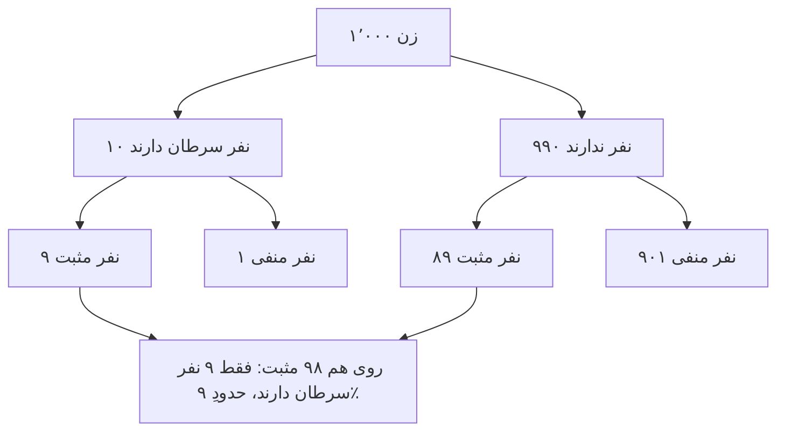

# فصل ۹. استقرا، احتمال و استدلالِ بیزی

[← قبلی: شکاکیت و پاسخ‌هایش](08-skepticism.md) · [فهرست](README.md) · [بعدی: علم، شواهد و تبیین ←](10-science-and-evidence.md)

**صوت:** [شنیدنِ این فصل](audio/09-induction-probability-bayes.mp3) (۱ ساعت و ۵ دقیقه، روایت به انگلیسی) · [باز کردن در پخش‌کننده](audio/index.html#09)

---

> «پس آدمِ خردمند باورش را با شواهد متناسب می‌کند.»
> — دیوید هیوم، *پژوهشی دربارهٔ فهمِ انسانی* (۱۷۴۸)، بخشِ ۱۰

> «نظریهٔ احتمال چیزی نیست جز فهمِ متعارف که به حساب و کتاب تبدیل شده است.»
> — پیر‌ـ‌سیمون لاپلاس، *جستاری فلسفی دربارهٔ احتمالات* (۱۸۱۴)

تقریباً هرچه دربارهٔ جهان باور داریم از چیزهایی که دیده‌ایم فراتر می‌رود. باور داریم فردا خورشید طلوع می‌کند، دارو همان‌طور که در آزمایش‌ها کار کرد کار خواهد کرد، پل دوام می‌آورد، و نظرسنجی‌ها چیزی دربارهٔ انتخابات به ما می‌گویند. هیچ‌کدام از این‌ها به‌طورِ قیاسی از شواهدمان نتیجه نمی‌شود. همه **استقرایی**‌اند، و **نامطمئن**.

این فصل دو بخش دارد. اول، مسئلهٔ فلسفیِ استقرا: آیا اصلاً می‌شود رفتن از چیزهای دیده‌شده به چیزهای دیده‌نشده را موجه کرد؟ دوم، ابزارهای عملی برای خوب استدلال کردن در شرایطِ نامطمئن: نظریهٔ احتمال، قضیهٔ بیز، و مفهوم‌های آماری‌ای که برای خواندنِ نقادانهٔ شواهد لازم دارید. اگر فقط یک ابزارِ فنی از این راهنما را کامل یاد بگیرید، بگذارید [شکلِ نسبتِ بختِ قضیهٔ بیز](#the-odds-form-and-likelihood-ratios) باشد. طرزِ فکر کردنتان دربارهٔ شواهد را تغییر می‌دهد.

---

## انواعِ استنتاجِ غیرقیاسی

استنتاج‌های غیرقیاسی (افزاینده) از مقدمه‌هایشان فراتر می‌روند. انواعِ اصلی:

- **استقرای شمارشی**: هر A که دیده شده B بوده، پس همهٔ Aها B‌اند (یا A‌ی بعدی B خواهد بود).
- **تعمیمِ آماری**: ۶۲٪ یک نمونهٔ تصادفی از رأی‌دهندگان از این طرح پشتیبانی می‌کنند، پس حدودِ ۶۲٪ همهٔ رأی‌دهندگان پشتیبانی می‌کنند.
- **قیاسِ آماری** (استنتاجِ مستقیم): ۹۵٪ Aها B‌اند؛ این یک A است؛ پس (احتمالاً) این B است.
- **استدلال از راهِ تمثیل**: X و Y ویژگی‌های P، Q و R را مشترک دارند؛ X ویژگیِ S را دارد؛ پس Y احتمالاً S را دارد.
- **استنتاجِ علّی**: A و B با هم تغییر می‌کنند و توضیح‌های دیگر کنار گذاشته شده‌اند، پس A علتِ B است. نگاه کنید به [فصل ۱۰](10-science-and-evidence.md#causation-and-causal-inference).
- **استنتاج به بهترین تبیین** (ابداکشن): H شواهد را بهتر از همه توضیح می‌دهد، پس H احتمالاً درست است. نگاه کنید به [فصل ۱۰](10-science-and-evidence.md#inference-to-the-best-explanation).

قیاسِ آماری **مسئلهٔ گروهِ مرجع** را پیش می‌کشد (که هانس رایشنباخ و جان ون، و آلن هایک در «مسئلهٔ گروهِ مرجع مسئلهٔ شما هم هست»، ۲۰۰۷، درباره‌اش بحث کرده‌اند). احتمالِ اینکه علی، مردی ۴۵ساله که سیگار می‌کشد و ماراتن می‌دود، در ده سالِ آینده سکتهٔ قلبی کند چقدر است؟ به گروهِ مرجع بستگی دارد: مردهای ۴۵ساله، سیگاری‌ها، دونده‌های ماراتن، مردهای ۴۵سالهٔ سیگاریِ دوندهٔ ماراتن (گروهی با اعضای خیلی کم). هر گروه نرخِ متفاوتی دارد. اغلب هیچ جوابِ درستِ واحدی نیست، و انتخابِ گروهِ مرجع یک داوری است. در عمل، دنبالِ تنگ‌ترین گروهی بگردید که هنوز دادهٔ کافی برای یک نرخِ قابل‌اعتماد دارد، و ببینید آیا گروه‌های معقولِ مختلف جواب‌های خیلی متفاوتی می‌دهند یا نه.

---

## مسئلهٔ استقرای هیوم

دیوید هیوم این مسئله را در *رساله* (۱۷۳۹) و روشن‌تر در *پژوهش* (۱۷۴۸، بخشِ ۴) مطرح کرد. به شکلِ یک استدلال:

1. همهٔ استنتاج‌ها از تجربه به چیزهای دیده‌نشده **اصلِ یکنواختی** را فرض می‌کنند: اینکه چیزهای دیده‌نشده شبیهِ چیزهای دیده‌شده خواهند بود (آینده شبیهِ گذشته خواهد بود).
2. اصلِ یکنواختی را نمی‌شود پیش از تجربه (پیشین) دانست، چون انکارش تناقض ندارد. کاملاً می‌توانیم تصور کنیم نانی که همیشه ما را سیر کرده فردا مسموممان کند.
3. اصلِ یکنواختی را نمی‌شود با تجربه ثابت کرد، چون هر استدلالی از تجربه یک استدلالِ استقرایی است که خودش اصلِ یکنواختی را فرض می‌کند. این دور است.
4. پس اصلِ یکنواختی هیچ توجیهِ عقلی ندارد، و استنتاج‌هایی هم که بر آن تکیه دارند ندارند.

هیوم نتیجه نگرفت که باید دست از استدلالِ استقرایی بکشیم. نتیجه گرفت که *نمی‌توانیم* دست بکشیم: «پس همهٔ استنتاج‌ها از تجربه اثرِ عادت‌اند، نه استدلال.» طبیعت ما را طوری ساخته که از تجربهٔ تکراری انتظار پیدا کنیم، همان‌طور که ما را طوری ساخته که نفس بکشیم.

**جوجهٔ** برتراند راسل (*مسائلِ فلسفه*، فصلِ ۶) این مسئله را نمایش می‌دهد: جوجه‌ای که کشاورز هر روز به آن دانه می‌دهد، انتظار پیدا می‌کند هر وقت کشاورز پیدا شود دانه‌ای در کار است، تا روزی که کشاورز گردنش را می‌پیچاند. استنتاجِ استقرایی‌اش به خوبیِ استنتاجِ ما بود. فیلسوف سی. دی. براد استقرا را «افتخارِ علم» و «رسواییِ فلسفه» نامید.

---

## پاسخ‌ها به هیوم

**۱. توجیهِ استقراییِ استقرا.** «استقرا در گذشته خوب کار کرده، پس در آینده هم خوب کار خواهد کرد.» این، همان‌طور که هیوم گفت، دوری است. بعضی فیلسوفان (آر. بی. بریث‌ویت، مکس بلک، جیمز ون کلیو) استدلال کردند که این فقط **دورِ قاعده‌ای** است (قاعده‌ای را که موجه می‌کند به کار می‌برد)، نه **دورِ مقدمه‌ای** (نتیجه‌اش را مقدمه نمی‌گیرد)، و دورِ قاعده‌ای باطل نیست. وزلی سالمون با **ضداستقراگرا** جواب داد: کسی که قاعدهٔ «برعکسِ آنچه قبلاً رخ داده را انتظار داشته باش» را به کار می‌برد، می‌تواند با همان مقدار دورِ قاعده‌ای استدلال کند که «ضداستقرا در گذشته شکست خورده، پس در آینده موفق خواهد شد.» اگر استدلال‌هایی با دورِ قاعده‌ای برای استقرا کار کنند، برای ضداستقرا هم کار می‌کنند.

**۲. حل کردن با از بین بردنِ مسئله.** پی. اف. استراسن (*درآمدی بر نظریهٔ منطقی*، ۱۹۵۲) استدلال کرد که پرسیدنِ اینکه آیا استقرا عقلانی است، مثلِ پرسیدنِ این است که آیا قانون قانونی است. «معقول» بودن دربارهٔ امورِ واقع اصلاً *یعنی* متناسب کردنِ باور با شواهدِ استقرایی. هیچ معیارِ بالاتری نیست که استقرا باید به آن برسد. منتقدان جواب می‌دهند که هنوز می‌توانیم بپرسیم آیا این روش به حقیقت می‌رسد یا نه، و نکتهٔ استراسن به این جواب نمی‌دهد.

**۳. دفاعِ عمل‌گرایانه.** هانس رایشنباخ (*تجربه و پیش‌بینی*، ۱۹۳۸) استدلال کرد که نمی‌توانیم ثابت کنیم استقرا موفق خواهد شد، اما می‌توانیم نشان دهیم که اگر *هر* روشی بتواند نظم‌های طبیعت را کشف کند (مثلاً نرخِ درازمدتِ یک رویداد)، استقرا هم می‌تواند. پس استقرا بهترین شرط‌بندی است. اعتراض‌ها: بی‌نهایت قاعدهٔ دیگر هم همین ویژگی را دارند، و این استدلال هیچ چیزی دربارهٔ کوتاه‌مدت نمی‌گوید، که تنها چیزی است که همیشه داریم.

**۴. رد کردنِ پوپر.** کارل پوپر استدلال کرد که علم اصلاً از استقرا استفاده نمی‌کند. دانشمندان حدس‌هایی جسورانه می‌زنند و سعی می‌کنند آن‌ها را با قیاس (رفعِ تالی) رد کنند. نظریه‌ای که جان به در می‌برد **تأییدِ آزمونی** (corroboration) می‌گیرد، اما تأییدِ آزمونی چیزی دربارهٔ موفقیتِ آینده‌اش نمی‌گوید. اعتراض (وزلی سالمون، «پیش‌بینیِ عقلانی»، ۱۹۸۱): وقتی یک مهندس باید تصمیم بگیرد کدام طرحِ پل را بسازد، تکیه بر نظریه‌ای که بیشترین تأییدِ آزمونی را دارد فقط وقتی عقلانی است که تأییدِ آزمونی نشانهٔ قابل‌اعتماد بودن در آینده باشد؛ و این همان استقراست با اسمی دیگر. نگاه کنید به [پوپر و ابطال‌گرایی](10-science-and-evidence.md#popper-and-falsificationism).

**۵. نظریهٔ مادیِ استقرا.** جان نورتن («نظریهٔ مادیِ استقرا»، ۲۰۰۳؛ *نظریهٔ مادیِ استقرا*، ۲۰۲۱) استدلال می‌کند که هیچ قاعدهٔ استقراییِ واحد و همه‌جانبه‌ای برای موجه کردن وجود ندارد. هر استنتاجِ استقرایی را واقعیت‌های پس‌زمینه‌ایِ مشخصی مجاز می‌کنند. از چند نمونه نتیجه می‌گیریم که همهٔ نمونه‌های بیسموت در ۲۷۱ درجهٔ سانتی‌گراد ذوب می‌شوند، چون می‌دانیم نمونه‌های یک عنصرِ شیمیایی معمولاً نقطهٔ ذوبِ یکسانی دارند. نتیجه *نمی‌گیریم* که همهٔ نمونه‌های موم در یک دما ذوب می‌شوند، چون می‌دانیم موم مخلوطی متغیر است. آن‌وقت مسئلهٔ استقرا به یک رشته پرسشِ محلی دربارهٔ واقعیت‌های پس‌زمینه‌ایِ مشخص تبدیل می‌شود، نه یک پرسشِ کلی.

**۶. استنتاج به بهترین تبیین.** دی. ام. آرمسترانگ (*قانونِ طبیعت چیست؟*، ۱۹۸۳) استدلال کرد که بهترین توضیح برای نظم‌هایی که دیده‌ایم این است که قانون‌های طبیعت وجود دارند، و قانون‌ها در آینده هم برقرارند. اعتراض: چرا به استنتاج به بهترین تبیین اعتماد کنیم؟ خودش یک استنتاجِ افزاینده است.

**۷. برون‌گرایی.** وثاقت‌گرایان می‌گویند: اگر طبیعت واقعاً یکنواخت است، آن‌وقت استقرا یک فرایندِ قابل‌اعتماد است، و باورهایی که با آن ساخته می‌شوند موجه‌اند و می‌توانند معرفت باشند، چه بتوانیم یکنواختیِ طبیعت را ثابت کنیم چه نه. لازم نیست استقرا را موجه کنیم تا بتوانیم به‌طورِ موجه از آن استفاده کنیم. این حرکتِ برون‌گرایانه در برابرِ خیلی از مسئله‌های شکاکانه است (نگاه کنید به [درون‌گرایی و برون‌گرایی](06-justification.md#internalism-and-externalism)).

**۸. هم‌گراییِ بیزی.** بیزی‌ها نشان می‌دهند که آدم‌هایی که با احتمال‌های پیشینِ متفاوت شروع می‌کنند اما با شواهدِ یکسان و طبقِ قاعده‌های احتمال به‌روز می‌شوند، با جمع شدنِ شواهد به نتیجه‌های یکسانی **نزدیک می‌شوند**، به شرطِ اینکه پیشین‌هایشان جزمی نباشد (به حقیقت احتمالِ ۰ ندهند). این «یکی شدنِ نظرها» (دیوید بلک‌ول و لستر دوبینز، ۱۹۶۲) اطمینان‌بخش است. اما به هیوم جواب نمی‌دهد، چون پیشین‌هایی لازم دارد که از قبل به نفعِ یکنواختی‌اند.

> **نتیجهٔ عملی.** مسئلهٔ هیوم دلیلی برای بی‌اعتمادی به استقرا در زندگیِ روزمره نیست. یادآوری است که **نتیجه‌های استقرایی همیشه خطاپذیرند**، که قوتِ استقرا به **دانشِ پس‌زمینه‌ای** دربارهٔ اینکه چه نوع چیزهایی یکنواخت‌اند بستگی دارد، و که یک رشتهٔ طولانی از موفقیت‌های گذشته تضمین نیست (از جوجه بپرسید، یا از هر کسی که در ۲۰۰۷ سرمایه‌گذاری کرد). درسِ دیدگاهِ نورتن به‌ویژه مفید است: هر وقت تعمیم می‌دهید، بپرسید *کدام واقعیت‌های پس‌زمینه‌ای این نوع ویژگی را در این نوع موردها یکنواخت می‌کنند؟*

---

## معمای تازهٔ استقرای گودمن

نلسون گودمن (*واقعیت، خیال و پیش‌بینی*، ۱۹۵۵) استدلال کرد که مسئلهٔ هیوم عمیق‌ترین مسئله نیست. حتی اگر قبول کنیم استقرا مشروع است، باید بدانیم *کدام* تعمیم‌ها را از شواهد به آینده ببریم، و شواهد به‌تنهایی نمی‌توانند این را به ما بگویند.

یک صفتِ تازه تعریف کنید، **سبزآبی** (grue):

> چیزی **سبزآبی** است اگر و فقط اگر یا اولین بار پیش از زمانِ *t* (مثلاً اولِ ژانویهٔ ۲۱۰۰) بررسی شده و سبز باشد، یا پیش از *t* بررسی نشده و آبی باشد.

هر زمردی که تا حالا بررسی شده سبز بوده است. چون همه پیش از *t* بررسی شده‌اند، هر زمردی که تا حالا بررسی شده سبزآبی هم بوده است. پس شواهدمان به یک اندازه از این دو پشتیبانی می‌کند:

- H1: همهٔ زمردها سبزند.
- H2: همهٔ زمردها سبزآبی‌اند.

اما این دو فرضیه دربارهٔ زمردهایی که اولین بار بعد از *t* بررسی می‌شوند پیش‌بینی‌های متضادی می‌کنند: H1 می‌گوید سبز خواهند بود، H2 می‌گوید آبی. همان شواهد، و همان قاعدهٔ استقرایی، از پیش‌بینی‌های متضاد پشتیبانی می‌کنند. چرا به آینده بردنِ «سبز» عقلانی است و به آینده بردنِ «سبزآبی» نه؟

**«چون "سبزآبی" بر اساسِ زمان تعریف شده و "سبز" نه.»** جوابِ گودمن: این به این بستگی دارد که با کدام صفت‌ها شروع کنید. «آبی‌سبز» (bleen) را این‌طور تعریف کنید: «پیش از *t* بررسی شده و آبی، یا پیش از *t* بررسی نشده و سبز.» آن‌وقت «سبز» را می‌شود این‌طور تعریف کرد: «اگر پیش از *t* بررسی شده، سبزآبی؛ وگرنه آبی‌سبز.» از دیدِ کسانی که با سبزآبی و آبی‌سبز حرف می‌زنند، *سبز* همان صفتِ دست‌کاری‌شده و وابسته به زمان است.

جوابِ خودِ گودمن **ریشه‌دار بودن** (entrenchment) بود: صفت‌هایی را به آینده می‌بریم که در جامعهٔ زبانی‌مان سابقهٔ موفقی در این کار دارند. و. و. ا. کواین («انواعِ طبیعی»، ۱۹۶۹) گفت «سبز» به یک **نوعِ طبیعی** (یک شباهتِ واقعی در طبیعت) اشاره می‌کند، و حسِ مادرزادیِ ما برای شباهت، که تکامل شکلش داده، معمولاً انواعِ طبیعی را دنبال می‌کند.

**چرا سبزآبی برای تفکرِ نقادانه مهم است.**
- **داده‌ها هیچ‌وقت خودشان حرف نمی‌زنند.** هر مجموعهٔ محدودی از مشاهده‌ها با بی‌نهایت تعمیم جور است. اینکه کدام را به آینده ببریم به دسته‌بندی‌ها و فرض‌های پس‌زمینه‌ای‌مان بستگی دارد. آماردان‌ها در **برازشِ منحنی** با همین مسئله روبه‌رویند: بی‌نهایت منحنی از هر مجموعهٔ محدودی از نقطه‌ها می‌گذرد. انتخابِ یک منحنیِ زیادی پیچیده که کاملاً با داده‌ها جور است (**بیش‌برازش**) معمولاً پیش‌بینی‌های افتضاحی می‌دهد.
- **از دسته‌بندی‌های دست‌کاری‌شده دوری کنید.** «این تیم هیچ‌وقت در بازیِ خانگیِ سه‌شنبه‌شب در ماهِ اکتبر، وقتی دما زیرِ ۱۰ درجهٔ سانتی‌گراد بوده، نباخته است» یک صفتِ شبیهِ سبزآبی است. اگر در داده‌های کافی بگردید، همیشه الگویی پیدا می‌کنید، اما الگوهای دست‌کاری‌شده به آینده منتقل نمی‌شوند. نگاه کنید به [مقایسه‌های چندگانه و پی‌ـ‌هکینگ](#multiple-comparisons-and-p-hacking) و [مغالطهٔ تیراندازِ تگزاسی](15-fallacies.md#texas-sharpshooter).
- **یادگیریِ ماشین** مستقیماً با معمای تازه روبه‌روست. **قضیه‌های «ناهارِ مجانی وجود ندارد»** (دیوید ولپرت، ۱۹۹۶) نشان می‌دهند که هیچ الگوریتمِ یادگیری‌ای، اگر روی همهٔ مسئله‌های ممکن میانگین بگیریم، از دیگری بهتر نیست. یادگیری فقط به این دلیل کار می‌کند که الگوریتم‌ها **سوگیری‌های استقرایی**‌ای دارند که با ساختارِ جهانِ واقعی جور است.

---

## پارادوکسِ کلاغ‌ها

کارل همپل («پژوهش‌هایی در منطقِ تأیید»، ۱۹۴۵) معمایی دربارهٔ تأیید با سه اصلِ پذیرفتنی کشف کرد:

1. **معیارِ نیکو**: دیدنِ یک A که B است، «همهٔ Aها B‌اند» را تأیید می‌کند. یک کلاغِ سیاه «همهٔ کلاغ‌ها سیاه‌اند» را تأیید می‌کند.
2. **شرطِ هم‌ارزی**: هر چیزی که یک فرضیه را تأیید کند، هر فرضیه‌ای را هم که از نظرِ منطقی با آن هم‌ارز است تأیید می‌کند.
3. **هم‌ارزیِ منطقی**: «همهٔ کلاغ‌ها سیاه‌اند» با عکسِ نقیضش، «همهٔ چیزهای غیرسیاه غیرکلاغ‌اند»، هم‌ارز است.

حالا: یک کفشِ سفید چیزی غیرسیاه و غیرکلاغ است. طبقِ معیارِ نیکو، «همهٔ چیزهای غیرسیاه غیرکلاغ‌اند» را تأیید می‌کند. طبقِ شرطِ هم‌ارزی، «همهٔ کلاغ‌ها سیاه‌اند» را تأیید می‌کند. پس می‌توانید بدونِ بیرون رفتن از اتاقتان، با نگاه کردن به کفش‌های سفید، برگ‌های سبز و کتاب‌های قرمز، پرنده‌شناسی کنید. این بی‌معنا به نظر می‌رسد.

**جواب‌ها.**
- **همپل** این نتیجه را پذیرفت. کفشِ سفید واقعاً فرضیه را تأیید می‌کند. شهودمان که می‌گوید تأیید نمی‌کند، از دانشِ پس‌زمینه‌ای گمراه شده است (از قبل می‌دانیم چیزهای غیرسیاه خیلی بیشتر از کلاغ‌ها هستند).
- **راه‌حلِ بیزی** (که آی. جی. گود و دیگران پروراندند) قبول می‌کند که کفشِ سفید تأیید می‌کند، اما توضیح می‌دهد چرا این تأیید ناچیز است. چون چیزهای غیرسیاه خیلی بیشتر از کلاغ‌هایند، اینکه یک چیزِ غیرسیاهِ تصادفی کلاغ نباشد تقریباً دقیقاً به یک اندازه محتمل است، چه همهٔ کلاغ‌ها سیاه باشند چه نه. نسبتِ درست‌نمایی (پایین‌تر را ببینید) خیلی نزدیک به ۱ است. در مقابل، اینکه یک کلاغِ تصادفی سیاه باشد، اگر همهٔ کلاغ‌ها سیاه باشند به‌طورِ محسوسی محتمل‌تر است تا اگر بعضی‌شان سیاه نباشند.
- **اینکه شواهد چطور جمع شده مهم است.** اگر *از کلاغ‌ها نمونه بگیرید* و رنگشان را ببینید، یک کلاغِ سیاه تأییدِ قابل‌توجهی است. اگر *از چیزهای غیرسیاه نمونه بگیرید* و ببینید کلاغ‌اند یا نه، یک غیرکلاغ تأییدِ خیلی ناچیزی است. اگر چیزی را بردارید در حالی که *از قبل می‌دانید* کفشِ سفید است، اصلاً هیچ چیزی دربارهٔ کلاغ‌ها به شما نمی‌گوید. آی. جی. گود («کفشِ سفید ماهیِ قرمز است»، ۱۹۶۷) نشان داد که در بعضی شرایطِ پس‌زمینه‌ای، حتی یک کلاغِ سیاه هم می‌تواند «همهٔ کلاغ‌ها سیاه‌اند» را *ضعیف* کند.

**درس**: اینکه آیا یک مشاهده شاهدی برای یک فرضیه است یا نه، و چقدر، به **دانشِ پس‌زمینه‌ای** و به **روندی که مشاهده را ایجاد کرده** بستگی دارد. این یکی از مهم‌ترین ایده‌ها در نظریهٔ شواهد است. در [مسئلهٔ مانتی هال](#the-monty-hall-problem)، در [اثرهای انتخاب](15-fallacies.md#survivorship-bias) و در سراسرِ تحلیلِ پژوهش‌های علمی دوباره پیدا می‌شود.

---

## احتمال: مبانی

### قاعده‌های احتمال

آندری کولموگوروف (۱۹۳۳) نظریهٔ احتمال را روی چند اصلِ پایه بنا کرد. برای هر رویداد (یا جمله‌ای) مثلِ A و B:

1. **منفی نبودن**: `P(A) ≥ 0`.
2. **یک بودنِ کل**: `P(چیزی قطعی) = 1`.
3. **جمع‌پذیری**: اگر A و B نتوانند هر دو درست باشند، `P(A or B) = P(A) + P(B)`.

همه‌چیزِ دیگر از این‌ها نتیجه می‌شود. پیامدهای مفید:

- **متمم**: `P(not-A) = 1 − P(A)`.
- **جمعِ کلی**: `P(A or B) = P(A) + P(B) − P(A and B)`.
- **قاعدهٔ عطف**: `P(A and B) ≤ P(A)` و `P(A and B) ≤ P(B)`. «هر دو با هم» هیچ‌وقت نمی‌تواند از هیچ‌کدام از جزءهایش محتمل‌تر باشد. (نگاه کنید به [مغالطهٔ عطف](#the-conjunction-fallacy).)

### احتمالِ شرطی و استقلال

**احتمالِ شرطیِ** A به شرطِ B این است:

> `P(A | B) = P(A and B) / P(B)`

یعنی احتمالِ A، اگر فقط به موردهایی نگاه کنیم که B در آن‌ها درست است.

A و B **مستقل**‌اند اگر `P(A | B) = P(A)`: دانستنِ B هیچ چیزی دربارهٔ A به شما نمی‌گوید. برای رویدادهای مستقل، `P(A and B) = P(A) × P(B)`. برای رویدادهای وابسته، `P(A and B) = P(A) × P(B | A)`.

**هشدار**: `P(A | B)` با `P(B | A)` یکی نیست. احتمالِ اینکه کسی بسکتبالیستِ حرفه‌ای باشد، به شرطِ اینکه بیشتر از دو متر قد داشته باشد، کم است؛ احتمالِ اینکه کسی بیشتر از دو متر قد داشته باشد، به شرطِ اینکه بسکتبالیستِ حرفه‌ای باشد، زیاد است. قاطی کردنِ این دو ریشهٔ [مغالطهٔ دادستان](#the-prosecutors-fallacy) و [نادیده گرفتنِ نرخِ پایه](#base-rate-neglect) است. به آن گاهی **مغالطهٔ شرطیِ وارونه** یا **اشتباه گرفتنِ عکس** می‌گویند.

**ضرب شدن.** وقتی شرط‌های زیادی باید همه برقرار باشند، احتمال‌هایشان (اگر مستقل باشند) در هم ضرب می‌شوند، و نتیجه به‌سرعت کوچک می‌شود. اگر طرحی ده گامِ مستقل داشته باشد که هر کدام ۹۰٪ احتمالِ موفقیت دارد، احتمالِ موفقیتِ همه `0.9¹⁰ ≈ 0.35` است. این در ارزیابیِ پیش‌بینی‌های مفصل، طرح‌های پیچیده، و نظریه‌های توطئه‌ای که لازم دارند خیلی چیزهای جداگانه درست باشند مهم است: **هر جزئیاتی داستان را زنده‌تر و نامحتمل‌تر می‌کند**.

### احتمال چیست؟

دربارهٔ قاعده‌ها اختلافی نیست. دربارهٔ اینکه احتمال *چیست* اختلاف هست. تفسیرهای اصلی:

| تفسیر | احتمال یعنی... | چهره‌های کلیدی | مناسب برای | مشکل |
|---|---|---|---|---|
| **کلاسیک** | نسبتِ حالت‌های مطلوب به حالت‌هایی که به یک اندازه ممکن‌اند | لاپلاس | تاس، ورق، بخت‌آزمایی | چه چیزی حالت‌ها را «به یک اندازه ممکن» می‌کند؟ پارادوکس‌های بی‌تفاوتی |
| **بسامدی** | نرخِ درازمدت در یک رشته آزمایش | ون، فون میزس، رایشنباخ | آزمایش‌های تکرارپذیر؛ آمار | رویدادهای یک‌باره («آیا این نامزد برنده می‌شود؟») |
| **گرایشی** | تمایلی فیزیکی در یک وضعیت برای ایجادِ نتیجه‌ها | پوپر | رویدادهای کوانتومی؛ شانس‌های تک‌مورد | مشخص کردن یا اندازه گرفتنش سخت است |
| **ذهنی (بیزی)** | درجهٔ باورِ یک آدمِ عقلانی | رمزی، دِ فینتی، سَوِج | هر جملهٔ نامطمئن | زیادی ذهنی به نظر می‌رسد؛ پیشین‌ها از کجا می‌آیند؟ |
| **منطقی / شاهدی** | اندازه‌ای که شواهد از یک فرضیه پشتیبانی می‌کند | کینز، کارناپ | سنجیدنِ پشتیبانیِ شواهد | تعریفِ غیردلبخواهی‌اش سخت است |

در عمل، پرسش‌های مختلف تفسیرهای مختلفی لازم دارند. «احتمالِ آمدنِ شش ۱/۶ است» به‌طورِ طبیعی کلاسیک یا بسامدی است. «احتمالِ اینکه متهم گناهکار باشد» به‌طورِ طبیعی ذهنی یا شاهدی است.

حتی جمله‌های احتمالیِ روزمره هم ممکن است بد فهمیده شوند. وقتی پیش‌بینیِ هوا می‌گوید «۳۰٪ احتمالِ باران برای فردا»، مردم آن را این‌طور تفسیر کرده‌اند که ۳۰٪ زمان باران می‌بارد، یا روی ۳۰٪ منطقه، یا ۳۰٪ پیش‌بینی‌کننده‌ها انتظارِ باران دارند (گرد گیگرنزر و همکاران، «"۳۰٪ احتمالِ باران برای فردا": مردم پیش‌بینی‌های احتمالیِ هوا را چطور می‌فهمند؟»، ۲۰۰۵). معنای درست این است که از روزهایی که چنین پیش‌بینی‌ای دارند، در حدودِ ۳۰٪ در آن مکان باران می‌بارد. **همیشه بپرسید: احتمالِ چه چیزی، از میانِ چه چیزهایی؟**

---

## قضیهٔ بیز

قضیهٔ بیز به شما می‌گوید احتمالِ یک فرضیهٔ H را با دیدنِ شاهدِ E چطور به‌روز کنید. اسمش را از تامس بیز (حدودِ ۱۷۰۱–۱۷۶۱) گرفته، که جستارش در این باره در ۱۷۶۳، بعد از مرگش، به دستِ دوستش ریچارد پرایس منتشر شد؛ و پیر‌ـ‌سیمون لاپلاس آن را جداگانه و کامل‌تر پروراند.

> **`P(H | E) = P(E | H) × P(H) / P(E)`**
>
> که در آن `P(E) = P(E | H) × P(H) + P(E | not-H) × P(not-H)`

اصطلاح‌ها:

- **`P(H)`** **احتمالِ پیشین** است: H پیش از در نظر گرفتنِ E چقدر محتمل بود.
- **`P(E | H)`** **درست‌نمایی** است: اگر H درست بود، این شاهد چقدر محتمل بود.
- **`P(E | not-H)`**: اگر H نادرست بود، این شاهد چقدر محتمل بود.
- **`P(H | E)`** **احتمالِ پسین** است: H بعد از در نظر گرفتنِ E چقدر محتمل است.

به زبانِ ساده: *اینکه بعد از دیدنِ شاهد چقدر باید یک فرضیه را باور کنید، به دو چیز بستگی دارد: اینکه قبلاً چقدر باورش داشتید، و اینکه اگر فرضیه درست باشد، این شاهد چقدر بیشتر از وقتی که نادرست است انتظار می‌رود.*

### مثالِ آزمایشِ پزشکی

این مشهورترین مثال است، از کارِ گرد گیگرنزر با پزشکان (*خطرهای حساب‌شده*، ۲۰۰۲؛ گیگرنزر و همکاران، «کمک به پزشکان و بیماران برای فهمیدنِ آمارِ سلامت»، ۲۰۰۷).

> برای زنانِ ۵۰ساله در یک منطقهٔ مشخص که در غربالگریِ معمول شرکت می‌کنند:
> - احتمالِ اینکه یک زن سرطانِ سینه داشته باشد ۱٪ است (**شیوع**، یا نرخِ پایه).
> - اگر زنی سرطانِ سینه داشته باشد، احتمالِ اینکه آزمایشش مثبت شود ۹۰٪ است (**حساسیتِ** آزمایش).
> - اگر زنی سرطانِ سینه نداشته باشد، احتمالِ اینکه با این حال آزمایشش مثبت شود ۹٪ است (**نرخِ مثبتِ کاذب**).
>
> آزمایشِ زنی مثبت می‌شود. احتمالِ اینکه واقعاً سرطانِ سینه داشته باشد چقدر است؟

وقتی گیگرنزر این پرسش را در یک جلسهٔ آموزشی از ۱۶۰ متخصصِ زنان پرسید، فقط حدودِ یک نفر از هر پنج نفر جوابِ درست را انتخاب کرد. خیلی‌ها فکر می‌کردند حدودِ ۹۰٪ یا ۸۱٪ است. بیایید حساب کنیم:

- `P(H) = 0.01`؛ `P(not-H) = 0.99`
- `P(E | H) = 0.90`
- `P(E | not-H) = 0.09`
- `P(E) = 0.90 × 0.01 + 0.09 × 0.99 = 0.009 + 0.0891 = 0.0981`
- `P(H | E) = 0.009 / 0.0981 ≈ 0.092`، یعنی **حدودِ ۹٪**

پس از هر **۱۱** زنی که آزمایششان مثبت می‌شود فقط حدودِ **یک نفر** سرطان دارد. آزمایش دقیق است، اما بیماری کمیاب است؛ پس مثبت‌های کاذب از جمعیتِ بزرگِ سالم، مثبت‌های واقعی از جمعیتِ کوچکِ بیمار را زیرِ خودشان پنهان می‌کنند.

### بسامدهای طبیعی

گیگرنزر و اولریش هوفراگه («چطور استدلالِ بیزی را بدونِ آموزش بهتر کنیم: شکل‌های بسامدی»، ۱۹۹۵) نشان دادند که وقتی همین اطلاعات به شکلِ **بسامدهای طبیعی** (تعدادِ آدم‌ها) به جای احتمال‌ها گفته شود، مردم خیلی بهتر استدلال می‌کنند:

> ۱٬۰۰۰ زن را در نظر بگیرید.
> - ۱۰ نفر از آن‌ها سرطانِ سینه دارند. از این ۱۰ نفر، **۹** نفر آزمایششان مثبت می‌شود.
> - ۹۹۰ نفر سرطانِ سینه ندارند. از این‌ها، حدودِ **۸۹** نفر با این حال آزمایششان مثبت می‌شود.
> - پس ۹ + ۸۹ = ۹۸ زن آزمایششان مثبت می‌شود، و فقط ۹ نفر از آن‌ها سرطان دارند.
> - ۹ از ۹۸ ≈ **۹٪**.

**قاعدهٔ عملی**: هر وقت با مسئله‌ای از این نوع روبه‌رو می‌شوید، **احتمال‌ها را به تعدادِ آدم‌ها (یا موردها) از یک عددِ گرد تبدیل کنید**. ساختارِ مسئله را نشان می‌دهد.

### شکلِ نسبتِ بخت و نسبت‌های درست‌نمایی

قضیهٔ بیز شکلِ ساده‌تری دارد که به جای احتمال از **نسبتِ بخت** (odds) استفاده می‌کند. نسبتِ بخت یعنی احتمالِ درست بودنِ چیزی تقسیم بر احتمالِ نادرست بودنش: احتمالِ ۰٫۲ یعنی نسبتِ بختِ ۰٫۲ به ۰٫۸، یا ۱ به ۴.

> **نسبتِ بختِ پسین = نسبتِ بختِ پیشین × نسبتِ درست‌نمایی**
>
> که در آن **نسبتِ درست‌نمایی** (یا **عاملِ بیز**) = `P(E | H) / P(E | not-H)`

در مثالِ ماموگرافی:
- نسبتِ بختِ پیشین = ۱ به ۹۹.
- نسبتِ درست‌نمایی = `0.90 / 0.09 = 10`.
- نسبتِ بختِ پسین = ۱۰ به ۹۹، یعنی احتمالِ `10/109 ≈ 9.2%`.

شکلِ نسبتِ بخت دو چیزِ مهم را **جدا از هم** نشان می‌دهد:

1. **از کجا شروع کردید** (نسبتِ بختِ پیشین). یک بیماریِ کمیاب، یک ادعای نامحتمل یا یک رویدادِ غیرعادی با نسبتِ بختِ پایین شروع می‌شود.
2. **شاهد چقدر فرق‌گذار است** (نسبتِ درست‌نمایی). این نشان می‌دهد شاهد اگر فرضیه درست باشد چند برابر محتمل‌تر است تا اگر نادرست باشد.

همچنین به‌روز شدن با چند شاهد را آسان می‌کند. اگر آن زن یک آزمایشِ دومِ **مستقل** بدهد و آن هم مثبت شود، دوباره ضرب کنید: ۱۰ به ۹۹ × ۱۰ = ۱۰۰ به ۹۹، حدودِ ۵۰٪. سومین مثبتِ مستقل: ۱۰۰۰ به ۹۹، حدودِ ۹۱٪.

یک راهنمای تقریبی برای قوتِ شواهد، با برداشتی آزاد از آماردان هارولد جفریز (*نظریهٔ احتمال*، ۱۹۳۹):

| نسبتِ درست‌نمایی | قوتِ شواهد به نفعِ H |
|---|---|
| ۱ | هیچ: شاهد در هر دو حالت به یک اندازه انتظار می‌رود |
| ۱ تا ۳ | ضعیف، به‌زحمت ارزشِ گفتن دارد |
| ۳ تا ۱۰ | متوسط |
| ۱۰ تا ۱۰۰ | قوی |
| بیشتر از ۱۰۰ | خیلی قوی |

(نسبت‌های کمتر از ۱ شاهدی *علیهِ* H‌اند، با همین جدول که برای عکسشان به کار می‌رود.)

### شواهد و تأیید

استدلالِ بیزی یک تعریفِ دقیق می‌دهد: **E شاهدی برای H است اگر و فقط اگر E وقتی H درست است محتمل‌تر باشد تا وقتی H نادرست است**، یعنی اگر نسبتِ درست‌نمایی بیشتر از ۱ باشد. به زبانِ دیگر، E احتمالِ H را بالا می‌برد: `P(H | E) > P(H)`.

این تعریف پیامدهای قوی‌ای برای تفکرِ نقادانه دارد:

1. **«جور بودن با» یعنی «شاهدِ» نیست.** اگر E چه H درست باشد چه نباشد به یک اندازه محتمل است، E هیچ شاهدی برای H نیست، هر قدر هم «جور دربیاید». طالع‌بینی‌ای که می‌گوید «این هفته با چالش‌هایی روبه‌رو می‌شوی» با هفتهٔ همه جور درمی‌آید. نسبتِ درست‌نمایی‌اش ۱ است.
2. **شواهد همیشه مقایسه‌ای‌اند.** برای اینکه بدانید آیا E از H پشتیبانی می‌کند، باید بپرسید E با فرضِ *فرضیه‌های دیگر* چقدر محتمل بود. مضطرب بودنِ یک متهم در بازجویی فقط تا جایی شاهدِ گناهکاری است که گناهکاران در بازجویی بیشتر از بی‌گناهان مضطرب شوند.
3. **پیش‌بینی‌های غافلگیرکننده شواهدِ قوی‌اند.** اگر H چیزی را پیش‌بینی کند که در غیرِ این صورت خیلی نامحتمل بود (`P(E | not-H)` کم)، درست درآمدنش نسبتِ درست‌نماییِ بزرگی می‌دهد. برای همین یک پیش‌بینیِ پرخطر و مشخص که درست از آب درمی‌آید بیشتر از یک پیش‌بینیِ مبهم ارزش دارد. نگاه کنید به [پوپر و ابطال‌گرایی](10-science-and-evidence.md#popper-and-falsificationism).
4. **نبودِ شاهد می‌تواند شاهدِ نبود باشد**، وقتی که اگر H درست بود، انتظارِ شاهد را داشتیم. اگر فیلی در اتاقتان بود، می‌دیدیدش. ندیدنش شاهدِ قوی‌ای است که فیلی نیست. اما پیدا نکردنِ یک فسیلِ مشخص شاهدِ ضعیفی است که آن گونه هیچ‌وقت وجود نداشته، چون فسیل شدن کمیاب است. نگاه کنید به [استدلال از راهِ جهل](15-fallacies.md#argument-from-ignorance).
5. **حکایت‌های شخصی شاهدِ ضعیف‌اند، نه شاهدِ صفر.** یک تعریفِ تکی از اینکه یک درمان کار کرده، نسبتِ درست‌نمایی‌ای فقط کمی بیشتر از ۱ دارد، چون آدم‌ها از بیشترِ بیماری‌ها به هر حال خوب می‌شوند و خبرِ موفقیت‌ها را بیشتر از شکست‌ها می‌شنویم.
6. **ادعاهای خارق‌العاده شواهدِ خارق‌العاده می‌خواهند.** ادعایی با نسبتِ بختِ پیشینِ خیلی پایین، برای اینکه محتمل شود، به نسبتِ درست‌نماییِ خیلی بزرگی نیاز دارد. این محتوای بیزیِ استدلالِ هیوم دربارهٔ معجزه‌ها و اصلِ کارل سیگن است. نگاه کنید به [تیغ‌های فلسفی و قاعده‌های سرانگشتی](16-critical-thinking-toolkit.md#philosophical-razors-and-heuristics).
7. **شواهدِ مستقل ضرب می‌شوند؛ شواهدِ وابسته نه.** ده خبر که همه یک اطلاعیهٔ مطبوعاتی را تکرار می‌کنند یک شاهدند، نه ده. دو بار شمردنِ شواهدِ وابسته یکی از رایج‌ترین خطاها در استدلالِ روزمره است.
8. **قاعدهٔ کرامول.** اگر احتمالِ پیشینتان دقیقاً ۰ یا دقیقاً ۱ باشد، هیچ شاهدی هیچ‌وقت نمی‌تواند عوضش کند (صفر را در هرچه ضرب کنید صفر می‌شود). آماردان دنیس لیندلی این را به نامِ خواهشِ الیور کرامول نامید که «احتمال بدهید که شاید اشتباه می‌کنید.» هیچ‌وقت به یک ادعای تجربی احتمالِ دقیقاً ۰ یا ۱ ندهید.

---

## معرفت‌شناسیِ بیزی

**معرفت‌شناسیِ بیزی** نظریهٔ احتمال را نظریه‌ای دربارهٔ باورِ عقلانی می‌داند. ادعاهای اصلی‌اش:

1. **احتمال‌گرایی**: درجه‌های باورِ عقلانی (credences) از قاعده‌های احتمال پیروی می‌کنند.
2. **شرطی‌سازی**: آدمِ عقلانی وقتی شاهدِ تازه‌ای یاد می‌گیرد، درجه‌های باورش را با قاعدهٔ بیز به‌روز می‌کند.

### درجه‌های باور و انسجام

چرا درجه‌های باور باید از قانون‌های احتمال پیروی کنند؟ استدلالِ کلاسیک **استدلالِ کتابِ هلندی** است (فرانک رمزی، «حقیقت و احتمال»، ۱۹۲۶؛ برونو دِ فینتی، ۱۹۳۷).

فرض کنید درجهٔ باورتان به اینکه فردا باران می‌بارد ۰٫۶ است و درجهٔ باورتان به اینکه باران *نمی‌بارد* هم ۰٫۶. این‌ها قاعده‌های احتمال را زیر پا می‌گذارند، چون جمعشان باید ۱ شود. درجهٔ باورِ ۰٫۶ یعنی اینکه پرداختِ ۶۰ سنت برای بلیتی که اگر جمله درست باشد ۱ دلار می‌دهد را منصفانه می‌دانید. پس یک دلالِ شرط‌بندی می‌تواند هر دو بلیت را روی هم به ۱٫۲۰ دلار به شما بفروشد. هوا هر طور باشد، دقیقاً یکی از بلیت‌ها ۱ دلار می‌دهد. شما حتماً ۲۰ سنت می‌بازید. مجموعه‌ای از شرط‌ها که باخت را تضمین کند **کتابِ هلندی** نام دارد. قضیه: **درجه‌های باورتان در برابرِ کتاب‌های هلندی امن‌اند اگر و فقط اگر از قاعده‌های احتمال پیروی کنند.**

منتقدان اعتراض می‌کنند که این استدلال دربارهٔ رفتارِ شرط‌بندی است، نه دربارهٔ باور؛ و می‌توانید فقط با شرط نبستن از کتاب‌های هلندی فرار کنید. جیمز جویس («دفاعی غیرعمل‌گرایانه از احتمال‌گرایی»، ۱۹۹۸) در عوض یک استدلالِ کاملاً معرفتی آورد: اگر درجه‌های باورتان قاعده‌ها را زیر پا بگذارند، همیشه مجموعهٔ دیگری از درجه‌های باور هست که *جهان هر طور باشد* **دقیق‌تر** (نزدیک‌تر به حقیقت) است. درجه‌های باورِ ناجور **از نظرِ دقت شکست‌خورده‌اند**.

### شرطی‌سازی

**شرطی‌سازی** می‌گوید: اگر E را یاد بگیرید (و نه چیزِ دیگری)، درجهٔ باورِ تازه‌تان به هر فرضیهٔ H باید با درجهٔ باورِ شرطیِ قبلی‌تان به H به شرطِ E برابر باشد:

> `P_new(H) = P_old(H | E)`

ریچارد جفری (*منطقِ تصمیم*، ۱۹۶۵) این را برای موردهایی که خودِ یاد گرفتن نامطمئن است گسترش داد. مثالش: در نورِ شمع به یک تکه پارچه نگاه می‌کنید. سبز به نظر می‌رسد اما ممکن است آبی باشد. *مطمئن* نمی‌شوید که سبز است؛ درجهٔ باورتان به «سبز» فقط، مثلاً، از ۰٫۳ به ۰٫۷ می‌رسد. **شرطی‌سازیِ جفری** این تغییر را در باورهای دیگرتان پخش می‌کند:

> `P_new(H) = P_old(H | E) × P_new(E) + P_old(H | not-E) × P_new(not-E)`

### مسئلهٔ احتمال‌های پیشین

قضیهٔ بیز به شما می‌گوید چطور به‌روز شوید، اما نمی‌گوید از کجا شروع کنید. احتمال‌های پیشین از کجا می‌آیند؟

- **بیزی‌های ذهنی** می‌گویند هر پیشینِ سازگاری از نظرِ عقلی مجاز است، و داده‌ها سرانجام فرق‌های پیشین‌ها را از بین می‌برند (نتیجه‌های هم‌گرایی که [بالاتر](#responses-to-hume) آمد).
- **بیزی‌های عینی** (ای. تی. جینز، جان ویلیامسون) می‌گویند پیشین‌های عقلانی باید تا جای ممکن کم‌اطلاعات باشند؛ مثلاً با به کار بردنِ **اصلِ بی‌تفاوتی** (به هر حالتِ ممکن احتمالِ برابر بده) یا روش‌های **بیشینه کردنِ آنتروپی**.

اصلِ بی‌تفاوتی به پارادوکس‌هایی می‌رسد. **کارخانهٔ مکعبِ** باس فان فراسن: کارخانه‌ای مکعب‌هایی با ضلعِ میانِ ۰ و ۱ سانتی‌متر می‌سازد. احتمالِ اینکه ضلعِ یک مکعب حداکثر ۰٫۵ سانتی‌متر باشد چقدر است؟ بی‌تفاوتی دربارهٔ *طولِ ضلع* می‌گوید ۱/۲. اما همین مکعب‌ها وجه‌هایی با مساحتِ میانِ ۰ و ۱ سانتی‌مترمربع دارند، و ضلعِ حداکثر ۰٫۵ سانتی‌متر یعنی وجهی با مساحتِ حداکثر ۰٫۲۵ سانتی‌مترمربع؛ پس بی‌تفاوتی دربارهٔ *مساحتِ وجه* می‌گوید ۱/۴. بی‌تفاوتی دربارهٔ *حجم* (حداکثر ۰٫۱۲۵ سانتی‌مترمکعب) می‌گوید ۱/۸. یک رویداد، سه احتمالِ «بی‌طرفانهٔ» متفاوت.

**در عمل**، پیشین‌های خوب از **نرخ‌های پایه** می‌آیند: اینکه چیزهایی از این نوع چند بار درست از آب درمی‌آیند. دانیل کانمن این را **نگاهِ بیرونی** می‌نامد (کانمن و دن لووالو، «انتخاب‌های ترسو و پیش‌بینی‌های جسورانه»، ۱۹۹۳). پیش از ارزیابیِ ویژگی‌های خاصِ یک مورد («نگاهِ درونی»)، بپرسید موردهای مشابه چند بار موفق می‌شوند. چند درصد از استارتاپ‌هایی از این نوع بعد از پنج سال هنوز فعال‌اند؟ طرح‌های بزرگِ زیرساختی چند بار با همان بودجهٔ پیش‌بینی‌شده تمام می‌شوند؟ (طبقِ پژوهش‌های بنت فلیوبیرگ روی صدها طرح، به‌ندرت.) پژوهش‌های تکِ پرسروصدا در این حوزه چند بار تکرار می‌شوند؟ نگاهِ درونی معمولاً خوش‌بینانه و بیش از حد مطمئن است؛ نگاهِ بیرونی اصلاحش می‌کند. نگاه کنید به [پیش‌بینی و اَبَرپیش‌بینان](14-psychology-of-reasoning.md#forecasting-and-superforecasters).

### مسئلهٔ شاهدِ قدیمی

کلارک گلیمور (*نظریه و شاهد*، ۱۹۸۰) معمایی برای نظریهٔ تأییدِ بیزی پیدا کرد. حرکتِ غیرعادیِ نزدیک‌ترین نقطهٔ مدارِ عطارد به خورشید (تقدیمِ حضیض) دهه‌ها پیش از اینشتین شناخته شده بود. وقتی اینشتین در ۱۹۱۵ نشان داد که نسبیتِ عام آن را توضیح می‌دهد، فیزیک‌دانان به‌حق این را شاهدِ قوی‌ای برای نظریه دانستند. اما طبقِ نظریهٔ بیزی، چون این شاهد از قبل دانسته بود، احتمالش ۱ بود، پس `P(H | E) = P(H)`: هیچ تأییدی. راه‌حل‌های پیشنهادی: پرسیدنِ اینکه اگر E را *نمی‌دانستیم* درجهٔ باورمان چه می‌شد (یک پیشینِ خیالی)، و اینکه آنچه یاد گرفته می‌شود را این واقعیتِ منطقی بدانیم که از H، E *نتیجه می‌شود* (دنیل گاربر، ۱۹۸۳).

---

## باورِ کامل و درجه‌های باور

**باورِ** همه یا هیچ چه رابطه‌ای با **درجهٔ باور** دارد؟ طبیعی‌ترین جواب **تزِ لاکی** است (ریچارد فولی): باید p را باور کنید اگر و فقط اگر درجهٔ باورتان به p از یک آستانهٔ بالا، مثلاً ۰٫۹۵، بیشتر باشد. دو پارادوکسِ مشهور برای این دردسر درست می‌کنند.

**پارادوکسِ بخت‌آزمایی** (هنری کایبرگ، *احتمال و منطقِ باورِ عقلانی*، ۱۹۶۱). در یک بخت‌آزماییِ منصفانه با ۱٬۰۰۰ بلیت و یک برنده، درجهٔ باورتان به اینکه بلیتِ شمارهٔ ۱ می‌بازد ۰٫۹۹۹ است، بالاتر از آستانه. پس باید باور کنید بلیتِ شمارهٔ ۱ می‌بازد. همین دربارهٔ بلیتِ ۲، ۳ و همین‌طور تا ۱٬۰۰۰ درست است. اگر باورِ عقلانی با «و» بسته باشد (اگر p را باور دارید و q را باور دارید، باید «p و q» را هم باور داشته باشید)، باید باور کنید که هر ۱٬۰۰۰ بلیت می‌بازند. اما می‌دانید یکی برنده می‌شود. پس باورِ عقلانی ناسازگار می‌شد.

جواب‌ها:
- **بسته بودن با «و» را کنار بگذارید** (انتخابِ خودِ کایبرگ): می‌توانید باور داشته باشید هر بلیت می‌بازد، بی‌آنکه باور داشته باشید همه می‌بازند.
- **تزِ لاکی را کنار بگذارید**: احتمالِ بالا برای باور کافی نیست. خیلی از طرفدارانِ معرفت‌نخست می‌گویند نباید باور کنید بلیتتان می‌بازد، چون *نمی‌دانید* که می‌بازد (نگاه کنید به [معرفت، ادعا کردن و عمل](05-the-nature-of-knowledge.md#knowledge-assertion-and-action)).
- **باورِ کامل را** به‌عنوانِ یک مفهومِ پایه **کنار بگذارید** و فقط با درجه‌های باور کار کنید (ریچارد جفری).

**پارادوکسِ پیش‌گفتار** (دی. سی. میکینسون، «پارادوکسِ پیش‌گفتار»، ۱۹۶۵). نویسنده‌ای همهٔ ادعاهای کتابش را با دقت وارسی کرده و تک‌تکشان را باور دارد. اما در پیش‌گفتار می‌نویسد «هر اشتباهی که مانده از خودِ من است»، چون به‌طورِ معقول باور دارد که در یک کتابِ بلند دست‌کم یک ادعا نادرست است. باورهایش روی هم ناسازگارند، اما هر کدام عقلانی به نظر می‌رسد. برخلافِ بخت‌آزمایی، این مورد باورهایی را در بر دارد که بر شواهدِ خوب تکیه دارند، نه فقط بر آمار.

**درسی برای تفکرِ نقادانه**: می‌تواند عقلانی باشد که به تک‌تکِ باورهایتان مطمئن باشید و در همان حال مطمئن باشید که بعضی‌شان اشتباه‌اند. هرچه یک موضع ادعاهای بیشتری را در بر بگیرد، احتمالِ اینکه دست‌کم یکی نادرست باشد بیشتر است. فروتنی دربارهٔ کلِ یک مجموعه باور با اطمینان به هر جزءِ آن جور است، و دقیقاً همان چیزی است که خطاپذیرگرایی توصیه می‌کند.

---

## خطاهای رایج در استدلالِ احتمالی

انسان‌ها به‌طورِ طبیعی احتمالی فکر نمی‌کنند. این خطاها خوب ثبت شده‌اند. روان‌شناسیِ پشتشان در [فصل ۱۴](14-psychology-of-reasoning.md) بررسی می‌شود.

### نادیده گرفتنِ نرخِ پایه

مردم معمولاً **احتمالِ پیشین** (نرخِ پایه) را نادیده می‌گیرند و روی شاهدِ مشخص تمرکز می‌کنند. مسئلهٔ ماموگرافی یک نمونه است. نمونهٔ دیگر **مسئلهٔ تاکسیِ** آموس تورسکی و دانیل کانمن است (۱۹۸۰):

> یک تاکسی شبانه در تصادفی نقش داشته و فرار کرده است. دو شرکتِ تاکسی در شهر کار می‌کنند: ۸۵٪ تاکسی‌ها سبز و ۱۵٪ آبی‌اند. یک شاهد تاکسی را آبی تشخیص داده است. شاهد، وقتی در شرایطِ مشابه آزمایش شد، هر رنگ را ۸۰٪ مواقع درست تشخیص داد. احتمالِ اینکه تاکسی آبی بوده چقدر است؟

بیشترِ مردم جواب می‌دهند ۸۰٪. جوابِ درست:
- نسبتِ بختِ پیشینِ آبی به سبز = ۱۵ به ۸۵.
- نسبتِ درست‌نمایی = `0.8 / 0.2 = 4`.
- نسبتِ بختِ پسین = ۶۰ به ۸۵، یعنی احتمالِ `60/145 ≈ 41%`، یعنی **حدودِ ۴۱٪**.

با وجودِ شاهد، محتمل‌تر است که تاکسی سبز بوده باشد. با بسامدهای طبیعی: از ۱۰۰ تاکسی، ۱۵ تا آبی‌اند، و شاهد ۱۲ تا از آن‌ها را آبی می‌نامد؛ ۸۵ تا سبزند، و شاهد ۱۷ تا از آن‌ها را آبی می‌نامد. از ۲۹ تاکسی‌ای که آبی نامیده شده‌اند، فقط ۱۲ تا واقعاً آبی‌اند.

### مغالطهٔ عطف

قاعدهٔ عطف می‌گوید `P(A and B) ≤ P(A)`. **مسئلهٔ لیندای** تورسکی و کانمن («استدلالِ مصداقی در برابرِ استدلالِ شهودی»، ۱۹۸۳) نشان داد که مردم به‌طورِ منظم این قاعده را زیر پا می‌گذارند:

> لیندا ۳۱ سال دارد، مجرد، رک و خیلی باهوش است. فلسفه خوانده است. در دورهٔ دانشجویی عمیقاً دغدغهٔ تبعیض و عدالتِ اجتماعی داشت، و در تظاهرات علیهِ سلاح‌های هسته‌ای هم شرکت می‌کرد.
>
> کدام محتمل‌تر است؟
> (الف) لیندا کارمندِ باجهٔ بانک است.
> (ب) لیندا کارمندِ باجهٔ بانک است و در جنبشِ فمینیستی فعال است.

در یک روایت، ۸۵٪ پاسخ‌دهندگان (ب) را انتخاب کردند. اما (ب) نمی‌تواند از (الف) محتمل‌تر باشد، چون هر کارمندِ بانکِ فمینیستی کارمندِ بانک است. مردم بر اساسِ **نمونه‌وار بودن** (اینکه لیندا چقدر با تصویرِ یک فمینیست جور است) داوری می‌کنند، نه بر اساسِ احتمال.

گرد گیگرنزر و رالف هرتویگ استدلال کردند که خیلی از شرکت‌کنندگان «محتمل» را به معنایی غیرریاضی (پذیرفتنی، باورکردنی) می‌فهمند، و وقتی پرسش به شکلِ بسامدی مطرح شود («از ۱۰۰ نفر مثلِ لیندا، چند نفر کارمندِ بانک‌اند؟ چند نفر کارمندِ بانک و فمینیست‌اند؟») خطا خیلی کم می‌شود. هر دو نکته ارزشمندند. درسِ عملی سرِ جایش است: **اضافه کردنِ جزئیات داستان را قانع‌کننده‌تر و نامحتمل‌تر می‌کند.** در پیش‌بینی، در دادگاه و در نظریه‌های توطئه، مراقبِ داستان‌های زنده و مفصل باشید.

### مغالطهٔ قمارباز و دستِ داغ

**مغالطهٔ قمارباز** این باور است که بعد از یک رشته از یک نتیجه، «نوبتِ» نتیجهٔ مخالف است. بعد از پنج بار قرمز در رولت، سیاه از قبل محتمل‌تر نیست: هر چرخش مستقل است. گفته می‌شود در ۱۸ اوتِ ۱۹۱۳، در کازینوی مونت‌کارلو، سیاه ۲۶ بار پشتِ سرِ هم آمد، و قماربازانی که با این باور که قرمز دیر کرده روی قرمز شرط می‌بستند، سنگین باختند.

باورِ برعکس، یعنی اینکه بازیکنی که چند پرتابِ پشتِ سرِ هم را گل کرده احتمالِ بیشتری دارد پرتابِ بعدی را هم گل کند (**دستِ داغ**)، مشهور است که تامس گیلوویچ، رابرت والونه و آموس تورسکی (۱۹۸۵) آن را مغالطه اعلام کردند، چون در داده‌های پرتابِ بسکتبال هیچ شاهدی برایش پیدا نکردند. اما در ۲۰۱۸، جاشوا میلر و آدام سانخورخو نشان دادند که تحلیلِ اصلی یک سوگیریِ آماریِ ظریف داشت: در یک رشتهٔ محدود، حتی برای یک فرایندِ کاملاً تصادفی، انتظار می‌رود نسبتِ موفقیت‌هایی که بعد از یک رشته موفقیت می‌آیند *کمتر* از نرخِ کلیِ موفقیت باشد. بعد از اصلاحِ این سوگیری، در نهایت شاهدی برای یک دستِ داغِ متوسط پیدا کردند. این داستان خودش یک درس است: **یافته‌ها دربارهٔ سوگیری‌ها هم ممکن است سوگیری داشته باشند**، و حتی نتیجه‌های مشهور هم ارزشِ بررسی دارند.

### مغالطهٔ دادستان

**مغالطهٔ دادستان** `P(شاهد | بی‌گناهی)` را با `P(بی‌گناهی | شاهد)` اشتباه می‌گیرد.

پروندهٔ غم‌انگیزِ **سالی کلارک** در انگلستان این را نشان می‌دهد. او در ۱۹۹۹ به قتلِ دو پسرِ نوزادش، که هر دو ناگهان مرده بودند، محکوم شد. یک متخصصِ کودکان، سر روی میدو، شهادت داد که احتمالِ دو مرگِ ناگهانیِ نوزاد (SIDS) در خانواده‌ای مثلِ خانوادهٔ او حدودِ ۱ در ۷۳ میلیون است. او این عدد را با به توانِ دو رساندنِ احتمالِ تخمینیِ یک مرگِ ناگهانی (۱ در ۸٬۵۴۳) به دست آورد. این عدد طوری ارائه شد که انگار احتمالِ بی‌گناهیِ او بود. دو خطا در کار بود:

1. **فرضِ مستقل بودن غلط بود.** عامل‌های ژنتیکی و محیطی مرگِ ناگهانیِ دوم در یک خانواده را، بعد از اولی، *محتمل‌تر* می‌کنند. به توانِ دو رساندنِ احتمال موجه نبود.
2. **مغالطهٔ دادستان.** حتی اگر دو مرگِ ناگهانیِ نوزاد خیلی کمیاب باشد، قتلِ دو نوزاد به دستِ مادر هم کمیاب است. پرسشِ درست این است که، با فرضِ اینکه دو نوزاد مرده‌اند، کدام توضیح *محتمل‌تر* است. آماردان ری هیل بعدها تخمین زد که با فرضِ دو مرگِ ناگهانیِ نوزاد در یک خانواده، علت‌های طبیعی چند برابر محتمل‌تر از قتلِ دوگانه بودند.

انجمنِ سلطنتیِ آمار در ۲۰۰۱ بیانیه‌ای عمومی در انتقاد از این شواهدِ آماری منتشر کرد. محکومیتِ سالی کلارک در ۲۰۰۳ در دادگاهِ تجدیدنظر لغو شد. او در ۲۰۰۷ درگذشت.

خطای مشابهی در دادگاهِ او. جی. سیمپسون (۱۹۹۵) پیش آمد. وکیلِ مدافع، آلن درشوویتز، استدلال کرد که فقط بخشِ خیلی کوچکی از مردانی که همسرشان را کتک می‌زنند در نهایت او را می‌کشند، پس سابقهٔ خشونت بی‌ربط است. اما پرسشِ درست احتمالِ اینکه یک مردِ کتک‌زن همسرش را بکشد نیست؛ احتمالِ این است که کتک‌زن قاتل باشد، *با فرضِ اینکه همسر به قتل رسیده است*. گرد گیگرنزر از آمارِ موجود تخمین زد که این احتمال تقریباً ۸ از ۹ است. **همیشه بر اساسِ همهٔ چیزهایی که می‌دانید شرطی کنید.**

### مسئلهٔ مانتی هال

در یک مسابقهٔ تلویزیونی سه در هست. پشتِ یکی ماشین است؛ پشتِ بقیه بز. درِ ۱ را انتخاب می‌کنید. مجری، که می‌داند ماشین کجاست و همیشه دری را باز می‌کند که پشتش بز است، درِ ۳ را باز می‌کند و یک بز نشان می‌دهد. به شما پیشنهاد می‌کند به درِ ۲ عوض کنید. آیا باید عوض کنید؟

**بله. عوض کردن با احتمالِ ۲/۳ برنده می‌شود.** انتخابِ اولتان ۱/۳ شانسِ درست بودن داشت، و هیچ کاری که مجری می‌کند این را تغییر نمی‌دهد، چون او همیشه می‌تواند دری با بز را باز کند. ۲/۳ باقی‌مانده حالا روی درِ ۲ جمع شده است.

اگر این غلط به نظرتان می‌رسد، ۱۰۰ در را تصور کنید. یکی را انتخاب می‌کنید. مجری ۹۸ درِ دیگر را باز می‌کند، همه با بز، و فقط درِ شما و درِ ۵۷ را می‌گذارد. آیا عوض می‌کنید؟

وقتی مریلین ووس ساوانت در ۱۹۹۰ در ستونش در مجلهٔ *پرِید* جوابِ درست را داد، هزاران نامه دریافت کرد، خیلی‌هایشان از آدم‌هایی با مدرکِ دکترا، که اصرار داشتند اشتباه می‌کند.

**درسِ عمیق**: کارِ مجری یک شاهد است، و ارزشش به **روندی** بستگی دارد که آن را ایجاد کرده. اگر مجری یک در را *تصادفی* باز کرده بود و اتفاقاً بز نشان داده بود، احتمال‌ها هر کدام ۱/۲ می‌شد. همان مشاهده (بزی پشتِ درِ ۳) بسته به اینکه چطور ایجاد شده، ارزشِ شاهدیِ متفاوتی دارد. مقایسه کنید با [پارادوکسِ کلاغ‌ها](#the-paradox-of-the-ravens) و [سوگیریِ بازماندگی](15-fallacies.md#survivorship-bias).

### بازگشت به میانگین

وقتی یک متغیر تا حدی به شانس بستگی دارد، مقدارهای خیلی بالا یا خیلی پایین معمولاً با مقدارهایی نزدیک‌تر به میانگین دنبال می‌شوند. فرانسیس گالتون این را در ۱۸۸۶ موقعِ بررسیِ قدها کشف کرد: پدر و مادرهای خیلی قدبلند معمولاً فرزندانی قدبلند دارند، اما نه به بلندیِ خودشان. او آن را «بازگشت به سوی میان‌مایگی» نامید.

بازگشت به میانگین مسئولِ تعدادِ خیلی زیادی از نتیجه‌گیری‌های علّیِ غلط است.

- **مربیانِ پروازِ کانمن.** دانیل کانمن مربیانی را در نیروی هواییِ اسرائیل به یاد می‌آورد که باور داشتند تشویق باعث می‌شود دانشجویان بدتر عمل کنند و سرزنش باعث می‌شود بهتر عمل کنند. بعد از یک فرودِ عالی دانشجو را تشویق می‌کردند، و فرودِ بعدی معمولاً بدتر بود؛ بعد از یک فرودِ افتضاح سرش داد می‌زدند، و فرودِ بعدی معمولاً بهتر بود. اما این دقیقاً همان چیزی است که بازگشت پیش‌بینی می‌کند، چه تشویقی در کار باشد چه سرزنشی. کارهای استثنایی تا حدی از شانس‌اند، و شانس به‌طورِ قابل‌اعتمادی تکرار نمی‌شود.
- **«نحسیِ جلدِ اسپورتس ایلاستریتد».** ورزشکاران بعد از یک فصلِ استثنایی روی جلدِ مجله می‌آیند، و بعد عملکردشان افت می‌کند.
- **درمان‌های پزشکی.** آدم‌ها وقتی نشانه‌هایشان در بدترین حالت است دنبالِ درمان می‌روند. خیلی از بیماری‌ها بالا و پایین دارند، پس نشانه‌ها اغلب بعد از آن بهتر می‌شوند، درمان هرچه باشد. این یکی از دلیل‌هایی است که آزمایش‌های کنترل‌شده لازم‌اند. نگاه کنید به [کارآزمایی‌های تصادفیِ کنترل‌شده](10-science-and-evidence.md#randomized-controlled-trials-and-the-hierarchy-of-evidence).
- **سیاست‌گذاری.** دوربین‌های کنترلِ سرعتی که در جاهایی نصب شده‌اند که یک سالِ غیرعادی بد از نظرِ تصادف داشته‌اند، با تصادف‌های کمتری دنبال خواهند شد؛ تا حدی به‌خاطرِ بازگشت، دوربین‌ها هر اثری داشته باشند.

### قانونِ عددهای کوچک

تورسکی و کانمن («باور به قانونِ عددهای کوچک»، ۱۹۷۱) دیدند که مردم، از جمله دانشمندانِ آموزش‌دیده، انتظار دارند نمونه‌های کوچک خیلی شبیهِ کلِ جمعیت باشند. اما نمونه‌های کوچک خیلی بیشتر از نمونه‌های بزرگ بالا و پایین می‌شوند.

- **مسئلهٔ بیمارستان** (کانمن و تورسکی، ۱۹۷۲). یک بیمارستانِ بزرگ روزی حدودِ ۴۵ زایمان دارد، یک بیمارستانِ کوچک حدودِ ۱۵. در طولِ یک سال، کدام‌یک روزهای بیشتری را ثبت کرده که در آن‌ها بیشتر از ۶۰٪ نوزادها پسر بودند؟ بیشترِ مردم می‌گویند «تقریباً به یک اندازه». جواب **بیمارستانِ کوچک** است، چون نمونه‌های کوچک بیشتر بالا و پایین می‌شوند.
- **نرخ‌های سرطانِ کلیه.** در میانِ شهرستان‌های آمریکا، آن‌هایی که *کمترین* نرخِ سرطانِ کلیه را دارند بیشترشان روستایی و کم‌جمعیت‌اند. وسوسه‌انگیز است که این را با زندگیِ سالمِ روستایی توضیح دهیم. اما شهرستان‌هایی که *بیشترین* نرخ را دارند هم بیشترشان روستایی و کم‌جمعیت‌اند. جمعیت‌های کوچک در هر دو جهت نرخ‌های افراطی ایجاد می‌کنند (هاوارد وینر، «خطرناک‌ترین معادله»، ۲۰۰۷؛ کانمن، *تفکر، سریع و کند*، ۲۰۱۱).
- **مدرسه‌های کوچک.** وینر توضیح می‌دهد که چطور این مشاهده که خیلی از بهترین مدرسه‌ها کوچک بودند به سرمایه‌گذاری‌های بزرگی برای ساختنِ مدرسه‌های کوچک رسید. اما بدترین مدرسه‌ها هم به شکلِ نامتناسبی کوچک بودند.

**درس**: پیش از اینکه یک نتیجهٔ افراطی را توضیح دهید، بپرسید آیا از یک **نمونهٔ کوچک** آمده است. نتیجه‌های افراطی از نمونه‌های کوچک فقط به‌خاطرِ شانس هم انتظار می‌روند.

### پارادوکسِ سیمپسون

روندی که در همهٔ زیرگروه‌ها دیده می‌شود، ممکن است وقتی گروه‌ها با هم ترکیب شوند برعکس شود.

**پذیرشِ برکلی (۱۹۷۳).** دانشگاهِ کالیفرنیا در برکلی روی هم حدودِ ۴۴٪ متقاضیانِ مردِ تحصیلاتِ تکمیلی و حدودِ ۳۵٪ متقاضیانِ زن را پذیرفت، که نشانهٔ تبعیض علیهِ زنان به نظر می‌رسید. اما وقتی پیتر بیکل و همکارانش (۱۹۷۵) دانشکده‌ها را جداگانه بررسی کردند، بیشترشان زنان را با نرخی برابر یا بالاتر پذیرفته بودند. فاصلهٔ کلی از اینجا آمده بود که زنان بیشتر برای دانشکده‌های رقابتی‌تری درخواست داده بودند که نرخِ پذیرش در آن‌ها برای همه پایین‌تر بود.

**سنگِ کلیه** (چاریگ و همکاران، ۱۹۸۶). پژوهشی دو درمان را مقایسه کرد:

| | درمانِ الف (جراحیِ باز) | درمانِ ب (از راهِ پوست) |
|---|---|---|
| سنگ‌های کوچک | **۹۳٪** (۸۱/۸۷) | ۸۷٪ (۲۳۴/۲۷۰) |
| سنگ‌های بزرگ | **۷۳٪** (۱۹۲/۲۶۳) | ۶۹٪ (۵۵/۸۰) |
| **همهٔ سنگ‌ها** | ۷۸٪ (۲۷۳/۳۵۰) | **۸۳٪** (۲۸۹/۳۵۰) |

درمانِ الف هم برای سنگ‌های کوچک *و هم* برای سنگ‌های بزرگ بهتر است، اما ب روی هم بهتر به نظر می‌رسد؛ چون پزشکان الف را بیشتر برای موردهای سخت‌ترِ سنگِ بزرگ به کار می‌بردند.

**به کدام مقایسه اعتماد کنیم؟** احتمال به‌تنهایی نمی‌تواند بگوید. به **ساختارِ علّی** بستگی دارد. در موردِ سنگِ کلیه، اندازهٔ سنگ هم روی انتخابِ درمان اثر می‌گذارد و هم روی نتیجه؛ پس باید برای هر اندازهٔ سنگ جداگانه مقایسه کنید. در موردهای دیگر، عددِ ترکیبی درست است. جودیا پرل (*کتابِ چرا*، ۲۰۱۸) استدلال می‌کند که پارادوکسِ سیمپسون را فقط با استدلالِ علّی می‌شود حل کرد. نگاه کنید به [همبستگی و علیت](10-science-and-evidence.md#correlation-and-causation).

---

## کالیبراسیون و قاعده‌های نمره‌دهی

کسی **خوب کالیبره** است اگر از همهٔ چیزهایی که می‌گوید ۷۰٪ به آن‌ها مطمئن است، حدودِ ۷۰٪ درست از آب درآید؛ از همهٔ چیزهایی که ۹۰٪ مطمئن است، حدودِ ۹۰٪ درست از آب درآید؛ و همین‌طور تا آخر. یعنی اطمینانش با دقتش جور است.

بیشترِ مردم **بیش از حد مطمئن**‌اند: از چیزهایی که «۹۰٪ مطمئن»اند، خیلی کمتر از ۹۰٪ درست است (نگاه کنید به [اعتمادبه‌نفسِ بیش از حد](14-psychology-of-reasoning.md#overconfidence-and-the-illusion-of-explanatory-depth)). بعضی حرفه‌ای‌ها که بازخوردِ سریع و دقیق می‌گیرند به شکلِ چشمگیری کالیبره‌اند. پیش‌بینی‌کننده‌های هوا در آمریکا یک نمونهٔ کلاسیک‌اند (آلن مورفی و رابرت وینکلر، ۱۹۷۷): وقتی می‌گویند ۷۰٪ احتمالِ باران، حدودِ ۷۰٪ مواقع باران می‌بارد.

**قاعده‌های نمره‌دهی** دقتِ پیش‌بینی‌های احتمالی را می‌سنجند. رایج‌ترینشان **نمرهٔ بریر** است (گلن بریر، ۱۹۵۰): برای هر پیش‌بینی، فرقِ احتمالی که دادید با چیزی که رخ داد (اگر رخ داد ۱، اگر نه ۰) را به توانِ دو برسانید، و روی همهٔ پیش‌بینی‌ها میانگین بگیرید.

- یک پیش‌بینی‌کنندهٔ بی‌نقص نمرهٔ ۰ می‌گیرد.
- کسی که همیشه می‌گوید ۵۰٪ نمرهٔ ۰٫۲۵ می‌گیرد.
- کسی که همیشه می‌گوید ۱۰۰٪ و نیمی از مواقع اشتباه می‌کند نمرهٔ ۰٫۵ می‌گیرد.

نمرهٔ بریر یک **قاعدهٔ نمره‌دهیِ درست** است: بهترین نمرهٔ مورد انتظار را وقتی می‌گیرید که درجه‌های باورِ واقعی‌تان را گزارش کنید. هم **کالیبراسیون** (جور بودنِ احتمال‌هایتان با نرخ‌های واقعی) را پاداش می‌دهد و هم **تفکیک** را (جدا کردنِ رویدادهایی که رخ می‌دهند از آن‌هایی که رخ نمی‌دهند، به جای اینکه همیشه نرخِ پایه را بگویید). مسابقه‌های پیش‌بینیِ فیلیپ تتلاک از آن استفاده می‌کنند (نگاه کنید به [پیش‌بینی و اَبَرپیش‌بینان](14-psychology-of-reasoning.md#forecasting-and-superforecasters)).

### تمرینی برای کالیبراسیون

برای هر پرسش، یک بازه بدهید که **۹۰٪ مطمئن** باشید جوابِ درست داخلش است. چیزی جست‌وجو نکنید. اگر خوب کالیبره باشید، حدودِ ۹ تا از ۱۰ بازه‌تان باید جواب را در بر داشته باشد.

1. سالی که انجیلِ گوتنبرگ چاپ شد.
2. طولِ رودِ نیل، به کیلومتر.
3. ارتفاعِ قلهٔ اورست، به متر.
4. تعدادِ استخوان‌های بدنِ یک آدمِ بزرگسال.
5. میانگینِ فاصلهٔ زمین تا ماه، به کیلومتر.
6. سالی که *رساله‌ای دربارهٔ طبیعتِ انسانِ* هیوم اولین بار منتشر شد.
7. سرعتِ صوت در هوا در دمای ۲۰ درجهٔ سانتی‌گراد، به متر بر ثانیه.
8. سالی که ایمانوئل کانت به دنیا آمد.
9. تعدادِ کشورهای عضوِ سازمانِ ملل (تا ۲۰۲۵).
10. سالی که ابن‌سینا به دنیا آمد.

پاسخ‌ها

1. حدودِ ۱۴۵۵. ۲. حدودِ ۶٬۶۵۰ کیلومتر (تخمین‌ها فرق دارند). ۳. ۸٬۸۴۹ متر (اندازه‌گیریِ ۲۰۲۰). ۴. ۲۰۶. ۵. حدودِ ۳۸۴٬۴۰۰ کیلومتر. ۶. ۱۷۳۹. ۷. حدودِ ۳۴۳ متر بر ثانیه. ۸. ۱۷۲۴. ۹. ۱۹۳. ۱۰. حدودِ ۹۸۰ میلادی.

بیشترِ کسانی که چنین تمرین‌هایی را امتحان می‌کنند می‌بینند که خیلی کمتر از ۹ تا از بازه‌های «۹۰٪»شان جواب را در بر دارد. بازه‌هایشان زیادی تنگ است، چون بیش از حد مطمئن‌اند. چاره این است که بازه‌هایتان را آن‌قدر پهن کنید که اگر جواب بیرون از آن‌ها افتاد، واقعاً تعجب کنید.

---

## آمار و معناداری

بخشِ بزرگی از شواهد در بحث‌های عمومی به شکلِ آمار می‌آید. برای ارزیابی‌اش لازم نیست آماردان باشید، اما باید چند مفهوم را بفهمید و از چند بدفهمی دوری کنید.

### مقدارِ p

**مقدارِ p** احتمالِ به دست آوردنِ داده‌هایی است که دست‌کم به اندازهٔ داده‌های واقعی افراطی باشند، *به فرضِ درست بودنِ فرضیهٔ صفر* (معمولاً «هیچ اثری در کار نیست») و به فرضِ درست بودنِ مدلِ آماری.

طبقِ قرارداد (که به آر. اِی. فیشر در دههٔ ۱۹۲۰ برمی‌گردد)، نتیجه‌هایی با `p < 0.05` **از نظرِ آماری معنادار** نامیده می‌شوند.

مقدارِ p خیلی زیاد بد فهمیده می‌شود. در ۲۰۱۶، انجمنِ آمارِ آمریکا کارِ غیرعادی‌ای کرد و بیانیه‌ای دربارهٔ مقدارهای p منتشر کرد (رونالد واسرستاین و نیکول لازار). از جمله اصل‌هایش:

- مقدارِ p احتمالِ درست بودنِ فرضیهٔ صفر، یا احتمالِ اینکه نتیجه‌ها فقط از شانس آمده باشند، **نیست**. (این باز همان شرطیِ وارونه است: `P(داده | صفر)` با `P(صفر | داده)` یکی نیست.)
- نتیجه‌گیری‌های علمی نباید فقط بر این تکیه کنند که آیا مقدارِ p از یک آستانه رد می‌شود یا نه.
- مقدارِ p اندازهٔ اثر یا اهمیتِ نتیجه را **نمی‌سنجد**.
- مقدارِ p به‌تنهایی معیارِ خوبی برای شواهدِ یک فرضیه نیست.

**«از نظرِ آماری معنادار» یعنی «مهم» نیست.** با یک نمونهٔ خیلی بزرگ، یک اثرِ ریز و در عمل بی‌اهمیت می‌تواند خیلی معنادار باشد. با یک نمونهٔ کوچک، یک اثرِ بزرگ و مهم ممکن است به معناداری نرسد. **«از نظرِ آماری معنادار نیست» یعنی «اثری نیست» نیست.** ممکن است فقط یعنی پژوهش کوچک‌تر از آن بود که اثری را پیدا کند.

### بازه‌های اطمینان و اندازه‌های اثر

دو چیز از مقدارِ p اطلاعاتِ بیشتری می‌دهند:

- **اندازهٔ اثر**: فرق *چقدر* بزرگ است؟ دارویی که فشارِ خون را ۱ میلی‌مترِ جیوه پایین می‌آورد و دارویی که ۲۰ میلی‌متر پایین می‌آورد ممکن است در پژوهش‌های مختلف مقدارِ p یکسانی داشته باشند.
- **بازهٔ اطمینان**: گستره‌ای از مقدارها که با داده‌ها جور است. بازهٔ اطمینانِ ۹۵٪ را روشی می‌سازد که اگر نمونه‌گیری را بارها تکرار کنیم، ۹۵٪ مواقع مقدارِ واقعی را در بر می‌گیرد. بازهٔ تنگ یعنی تخمینِ دقیق؛ بازهٔ پهن یعنی نامطمئن بودن. اگر بازه از «آسیبی کوچک» تا «فایده‌ای بزرگ» کشیده شده، پژوهش چیزِ زیادی را روشن نکرده است.

### خطرِ نسبی و خطرِ مطلق

خبرهای سلامت اغلب کاهشِ **خطرِ نسبی** را گزارش می‌کنند چون چشمگیر به نظر می‌رسد. همیشه عددهای **مطلق** را بخواهید.

> «این دارو خطرِ سکتهٔ قلبی‌تان را ۵۰٪ کم می‌کند!»

اگر خطر از ۲ در ۱٬۰۰۰ به ۱ در ۱٬۰۰۰ برسد، این کاهشِ ۵۰ درصدیِ خطرِ **نسبی** است، اما کاهشِ **۰٫۱ واحدِ درصدِ** مطلق. **تعدادِ لازم برای درمان** (NNT) ۱٬۰۰۰ است: هزار نفر باید دارو را مصرف کنند تا یک نفر از سکتهٔ قلبی در امان بماند. حالا این را در برابرِ عوارضِ جانبی بسنجید.

یک نمونهٔ تاریخی: در ۱۹۹۵، کمیتهٔ ایمنیِ داروهای بریتانیا هشدار داد که بعضی قرص‌های ضدبارداریِ نسلِ سوم خطرِ لخته‌های خونیِ بالقوه خطرناک را دو برابر می‌کنند. «دو برابر» (افزایشِ ۱۰۰ درصدیِ نسبی) یعنی از حدودِ ۱ در ۷٬۰۰۰ زن به ۲ در ۷٬۰۰۰. این ترس باعث شد خیلی از زنان قرص را کنار بگذارند، و در سالِ بعد حدودِ ۱۳٬۰۰۰ سقطِ جنینِ بیشتر در انگلستان و ولز، و همچنین تولدها و بارداری‌های نوجوانانِ بیشتری، تخمین زده شد. خودِ بارداری خطرِ بیشتری برای لخته‌های خونی دارد تا آن قرص‌ها.

**قاعده**: وقتی می‌شنوید «X خطرِ Y را Z درصد بالا (یا پایین) می‌برد»، بپرسید **«از چه، به چه؟»**

### مقایسه‌های چندگانه و پی‌ـ‌هکینگ

اگر در سطحِ معناداریِ ۰٫۰۵، ۲۰ فرضیه را آزمایش کنید که همه نادرست‌اند، باید فقط به‌خاطرِ شانس انتظارِ حدودِ یک نتیجهٔ «معنادار» را داشته باشید. اگر فرضیه‌های زیادی را آزمایش کنید و فقط معنادارها را گزارش کنید، اثرهایی را «کشف» می‌کنید که وجود ندارند. کمیکِ اینترنتیِ *xkcd* («معنادار»، ۲۰۱۱) این را با دانشمندانی نشان داد که آزمایش می‌کنند آیا آبنبات‌های ژله‌ای جوش ایجاد می‌کنند، چیزی پیدا نمی‌کنند، ۲۰ رنگ را جداگانه آزمایش می‌کنند، و «کشف» می‌کنند که آبنبات‌های سبز با `p < 0.05` جوش ایجاد می‌کنند؛ و روزنامه‌ها هم با آب و تاب گزارشش می‌کنند.

**پی‌ـ‌هکینگ** یعنی استفادهٔ، اغلب ناآگاهانه، از انعطاف در تحلیلِ داده‌ها تا یک نتیجهٔ معنادار پیدا شود: امتحان کردنِ زیرمجموعه‌های مختلفِ داده، معیارهای مختلفِ نتیجه، متغیرهای کنترلِ مختلف، یا متوقف کردنِ جمع‌آوریِ داده وقتی p به زیرِ ۰٫۰۵ رسید. جوزف سیمونز، لیف نلسون و اوری سیمونسون («روان‌شناسیِ مثبتِ کاذب»، ۲۰۱۱) نشان دادند این کار چقدر قدرت دارد. با انتخاب‌های تحلیلیِ منعطف اما رایج، «نشان دادند» که گوش دادن به ترانهٔ «وقتی شصت‌وچهار ساله شوم» از بیتل‌ها شرکت‌کنندگان را واقعاً جوان‌تر کرده (حدودِ یک سال و نیم، از نظرِ سنِ تقویمی)؛ نتیجه‌ای ناممکن.

اندرو گلمن و اریک لوکن مسئلهٔ گسترده‌تر را **باغِ راه‌های چندشاخه** می‌نامند: حتی بدونِ ماهی‌گیریِ عمدی، پژوهشگران انتخاب‌های زیادی می‌کنند که به داده‌ها بستگی دارد و هر کدام می‌توانست طورِ دیگری باشد؛ پس مقدارِ p گزارش‌شده ممکن است خیلی کم‌معناتر از آنچه به نظر می‌رسد باشد.

**چاره‌ها**: **پیش‌ثبت** (اعلامِ عمومیِ فرضیه‌ها و تحلیل‌ها پیش از جمع‌آوریِ داده)، اصلاح‌هایی برای مقایسه‌های چندگانه (مثلِ اصلاحِ بونفرونی)، و تکرارِ پژوهش. نگاه کنید به [بحرانِ تکرارپذیری](10-science-and-evidence.md#the-replication-crisis).

### چرا ممکن است بیشترِ یافته‌های منتشرشده نادرست باشند

مقالهٔ مشهورِ جان یوانیدیس، «چرا بیشترِ یافته‌های پژوهشیِ منتشرشده نادرست‌اند» (۲۰۰۵)، در اصل یک استدلالِ بیزی است. فرض کنید در یک حوزه:

- ۱۰٪ فرضیه‌هایی که پژوهشگران آزمایش می‌کنند درست‌اند (نرخِ پایه).
- پژوهش‌ها **توانِ** ۸۰٪ دارند (احتمالِ پیدا کردنِ یک اثرِ واقعی).
- آستانهٔ معناداری ۰٫۰۵ است.

از ۱٬۰۰۰ فرضیهٔ آزمایش‌شده: ۱۰۰ تا درست‌اند، و ۸۰ تا از آن‌ها نتیجهٔ معنادار می‌دهند. ۹۰۰ تا نادرست‌اند، و ۴۵ تا از آن‌ها از روی شانس نتیجهٔ معنادار می‌دهند. پس از ۱۲۵ نتیجهٔ معنادار، ۴۵ تا (۳۶٪) غلط‌اند. اگر توان عددِ واقع‌بینانه‌ترِ ۳۵٪ باشد، فقط ۳۵ اثرِ واقعی پیدا می‌شود، و ۴۵ تا از ۸۰ نتیجهٔ معنادار (۵۶٪) غلط‌اند. پی‌ـ‌هکینگ و سوگیریِ انتشار را هم اضافه کنید، و این نسبت باز هم بالا می‌رود.

درس این نیست که علم قابل‌اعتماد نیست. درس این است که **یک نتیجهٔ معنادارِ تک، به‌ویژه یک نتیجهٔ غافلگیرکننده در حوزه‌ای که ادعاهایش از پیش کم‌احتمال‌اند و پژوهش‌هایش کوچک‌اند، شاهدِ ضعیفی است**. تکرار، نمونه‌های بزرگ و معقول بودنِ ادعا از پیش، همه مهم‌اند.

---

## فهمِ خود را بسنجید

**۱.** مسئلهٔ استقرای هیوم را در سه گام بگویید.

پاسخ

(۱) استنتاجِ استقرایی فرض می‌کند که چیزهای دیده‌نشده شبیهِ چیزهای دیده‌شده‌اند. (۲) این را نمی‌شود پیش از تجربه ثابت کرد، چون انکارش قابلِ تصور است. (۳) نمی‌شود آن را بدونِ دور از تجربه ثابت کرد. پس استقرا هیچ پایهٔ عقلی ندارد.

**۲.** توضیح دهید چرا «سبزآبی» حتی برای کسی که استقرا را قبول دارد مسئله ایجاد می‌کند.

پاسخ

همان شواهد (همهٔ زمردهایی که تا حالا بررسی شده سبزند، و پس سبزآبی‌اند) از تعمیم‌های متضادی پشتیبانی می‌کند. استقرا به‌تنهایی نمی‌تواند بگوید کدام صفت را به آینده ببریم. به نظریه‌ای نیاز داریم که بگوید کدام دسته‌بندی‌ها «قابلِ بردن به آینده»اند، و این نظریه را نمی‌شود از خودِ شواهد خواند.

**۳.** یک آزمایش برای بیماری‌ای کمیاب (شیوع ۱ در ۱٬۰۰۰) حساسیتِ ۹۹٪ و نرخِ مثبتِ کاذبِ ۲٪ دارد. آزمایشتان مثبت می‌شود. تقریباً چقدر احتمال دارد بیماری را داشته باشید؟ از بسامدهای طبیعی استفاده کنید.

پاسخ

از ۱۰۰٬۰۰۰ نفر، ۱۰۰ نفر بیماری را دارند و ۹۹ نفرشان آزمایششان مثبت می‌شود. از ۹۹٬۹۰۰ نفری که بیماری را ندارند، ۲٪ (۱٬۹۹۸ نفر) آزمایششان مثبت می‌شود. پس از حدودِ ۲٬۰۹۷ نتیجهٔ مثبت، ۹۹ نفر بیماری را دارند: حدودِ ۴٫۷٪. نتیجهٔ مثبت احتمال را تقریباً پنجاه برابر بالا می‌برد، اما هنوز محتمل‌تر است که بیماری را نداشته باشید. یک آزمایشِ دومِ مستقل خیلی کمک می‌کند (هر بار نسبتِ درست‌نماییِ `0.99/0.02 ≈ 50`).

**۴.** نسبتِ درست‌نماییِ شاهدی که «با» یک فرضیه «جور است» اما به همان اندازه با نفیِ آن هم جور است، چقدر است؟

پاسخ

1. هیچ شاهدی به هیچ طرف نمی‌دهد، هر قدر هم «جور دربیاید».

**۵.** چرا یک داستانِ زنده و مفصل اغلب از یک داستانِ ساده نامحتمل‌تر است؟

پاسخ

چون هر جزئیاتِ اضافه یک جزءِ دیگر است که باید «و» درست باشد، و `P(A and B) ≤ P(A)`. جزئیات داستان را نمونه‌وارتر و باورکردنی‌تر می‌کند، که باعث می‌شود محتمل‌تر *حس شود*، در حالی که احتمالش فقط می‌تواند کم شود.

**۶.** مدرسه‌ای یک طرحِ تازه برای کم‌نمره‌ترین دانش‌آموزانش اجرا می‌کند، و سالِ بعد نمره‌هایشان بالا می‌رود. اول کدام توضیحِ دیگر را باید در نظر بگیرید؟

پاسخ

بازگشت به میانگین. دانش‌آموزانی که به‌خاطرِ نمره‌های خیلی پایین انتخاب شده‌اند، تا حدی در امتحان بدشانسی آورده بودند؛ به‌طورِ میانگین، نمره‌های بعدی‌شان، چه طرح باشد چه نباشد، به میانگین نزدیک‌تر خواهد بود. یک گروهِ مقایسه از دانش‌آموزانی که به همین شکل انتخاب شده‌اند اما در طرح نبوده‌اند لازم است.

**۷.** روزنامه‌ای گزارش می‌دهد: «خوردنِ گوشتِ فراوری‌شده خطرِ سرطانِ رودهٔ بزرگ را ۱۸٪ بالا می‌برد.» چه باید بپرسید؟

پاسخ

«از چه، به چه؟» افزایشِ ۱۸ درصدیِ نسبی در یک خطرِ مادام‌العمرِ، مثلاً، ۵ یا ۶ درصدی، یعنی افزایشِ مطلقِ حدودِ ۱ واحدِ درصد. همچنین باید بپرسید چه مقدار گوشت در کار بوده، آیا این همبستگی علّی است (داده‌های مشاهده‌ای، عامل‌های مخدوش‌کنندهٔ احتمالی)، و چقدر نامطمئن است. (برای مرجع: آژانسِ بین‌المللیِ پژوهش دربارهٔ سرطان افزایشِ خطرِ ۱۸ درصدی را به ازای هر ۵۰ گرم گوشتِ فراوری‌شده در روز گزارش کرد.)

**۸.** در پارادوکسِ سیمپسون، چطور تصمیم می‌گیرید به داده‌های ترکیبی اعتماد کنید یا به داده‌های جداشده؟

پاسخ

با ساختارِ علّی. اگر متغیرِ گروه‌بندی (مثلاً اندازهٔ سنگ) علتِ مشترکِ انتخابِ درمان و نتیجه است، درونِ گروه‌ها مقایسه کنید. اگر خودِ متغیرِ گروه‌بندی را درمان ایجاد کرده (یک واسطه)، ممکن است مقایسهٔ ترکیبی درست باشد. آمار به‌تنهایی نمی‌تواند تصمیم بگیرد؛ به یک مدلِ علّی نیاز دارید.

**۹.** چرا قاعدهٔ کرامول برای ذهنِ باز داشتن مهم است؟

پاسخ

چون یک پیشینِ دقیقاً ۰ یا ۱ در به‌روزرسانیِ بیزی هیچ‌وقت با هیچ شاهدی تغییر نمی‌کند. برای اینکه به شواهد واکنش نشان دهید، باید دست‌کم کمی احتمال برای اشتباه بودن نگه دارید. باوری که با یقینِ کامل نگه داشته شود در برابرِ شواهد نفوذناپذیر است، و این تعریفِ دقیقِ ذهنِ بسته است.

---

## برای مطالعهٔ بیشتر

**استقرا**
- David Hume, *An Enquiry Concerning Human Understanding* (1748)، بخش‌های ۴ و ۵.
- Nelson Goodman, *Fact, Fiction, and Forecast* (Harvard University Press, 1955; 4th ed. 1983), ch. 3.
- Leah Henderson, "The Problem of Induction," *Stanford Encyclopedia of Philosophy*.
- John Norton, *The Material Theory of Induction* (University of Calgary Press, 2021؛ دسترسیِ رایگان).

**احتمال و معرفت‌شناسیِ بیزی**
- Ian Hacking, *An Introduction to Probability and Inductive Logic* (Cambridge University Press, 2001). بهترین کتابِ مقدماتیِ فلسفی.
- Darren Bradley, *A Critical Introduction to Formal Epistemology* (Bloomsbury, 2015).
- Michael Titelbaum, *Fundamentals of Bayesian Epistemology* (2 vols., Oxford University Press, 2022).
- Richard Jeffrey, *Subjective Probability: The Real Thing* (Cambridge University Press, 2004).
- Colin Howson and Peter Urbach, *Scientific Reasoning: The Bayesian Approach* (Open Court, 3rd ed. 2006).

**استدلالِ آماریِ کاربردی**
- Gerd Gigerenzer, *Calculated Risks* (Simon & Schuster, 2002؛ نامِ بریتانیایی *Reckoning with Risk*). ضروری.
- David Spiegelhalter, *The Art of Statistics: Learning from Data* (Pelican, 2019).
- Tim Harford, *How to Make the World Add Up* (بریتانیا) / *The Data Detective* (آمریکا) (2020).
- Carl Bergstrom and Jevin West, *Calling Bullshit: The Art of Skepticism in a Data-Driven World* (Random House, 2020).
- Jordan Ellenberg, *How Not to Be Wrong* (Penguin, 2014).
- Judea Pearl and Dana Mackenzie, *The Book of Why* (Basic Books, 2018).

---

[← قبلی: شکاکیت و پاسخ‌هایش](08-skepticism.md) · [فهرست](README.md) · [بعدی: علم، شواهد و تبیین ←](10-science-and-evidence.md)
