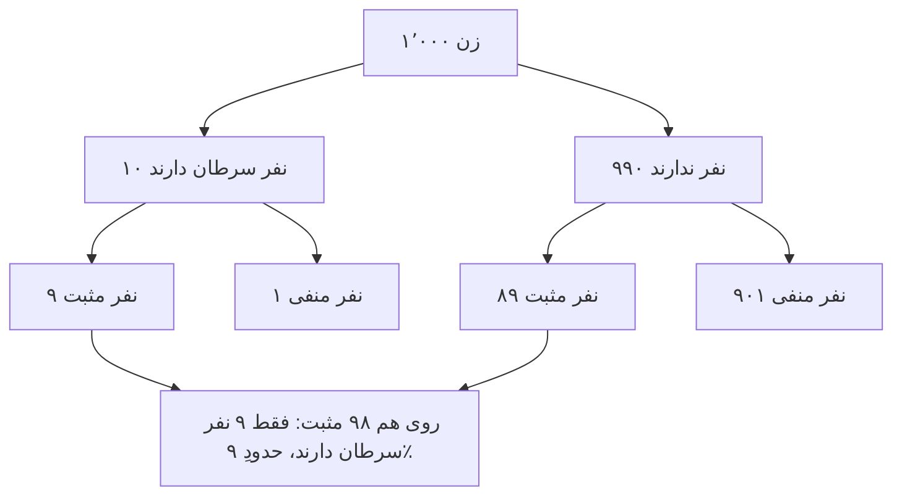

# فصل ۹. استقرا، احتمال و استدلالِ بیزی

[← قبلی: شکاکیت و پاسخ‌هایش](08-skepticism.md) · [فهرست](README.md) · [بعدی: علم، شواهد و تبیین ←](10-science-and-evidence.md)

**صوت:** [شنیدنِ این فصل](audio/09-induction-probability-bayes.mp3) (۱ ساعت و ۵ دقیقه، روایت به انگلیسی) · [باز کردن در پخش‌کننده](audio/index.html#09)

---

> «پس خردمند باورش را با شواهد متناسب می‌کند.»
> — دیوید هیوم، *پژوهشی دربارهٔ فهمِ انسانی* (۱۷۴۸)، بخشِ ۱۰

> «نظریهٔ احتمال چیزی نیست جز فهمِ متعارف که به محاسبه فروکاسته شده است.»
> — پیر‌ـ‌سیمون لاپلاس، *جستاری فلسفی دربارهٔ احتمالات* (۱۸۱۴)

تقریباً هرچه دربارهٔ جهان باور داریم از آنچه مشاهده کرده‌ایم فراتر می‌رود. باور داریم فردا خورشید طلوع می‌کند، دارو همان‌طور که در کارآزمایی‌ها کار کرد کار خواهد کرد، پل تاب می‌آورد، نظرسنجی‌ها چیزی دربارهٔ انتخابات به ما می‌گویند. هیچ‌یک از این‌ها به‌طورِ قیاسی از شواهدمان نتیجه نمی‌شود. **استقرایی** است، و **نامطمئن** است.

این فصل دو چیز را در بر می‌گیرد. نخست، مسئلهٔ فلسفیِ استقرا: آیا اصلاً می‌توان استدلال از مشاهده‌شده به مشاهده‌نشده را موجه کرد؟ دوم، ابزارهای عملی برای خوب استدلال کردن در شرایطِ عدم‌قطعیت: نظریهٔ احتمال، قضیهٔ بیز، و مفهوم‌های آماری‌ای که برای خواندنِ نقادانهٔ شواهد لازم دارید. اگر فقط یک ابزارِ فنی از این راهنما را کاملاً بیاموزید، بگذارید [صورتِ نسبتِ بختِ قضیهٔ بیز](#the-odds-form-and-likelihood-ratios) باشد. شیوهٔ اندیشیدنتان دربارهٔ شواهد را تغییر خواهد داد.

---

## گونه‌های استنتاجِ غیرقیاسی

استنتاج‌های غیرقیاسی (افزاینده) از مقدمه‌هایشان فراتر می‌روند. گونه‌های اصلی:

- **استقرای شمارشی**: هر A‌ای که مشاهده شده B بوده، پس همهٔ Aها B‌اند (یا A‌ی بعدی B خواهد بود).
- **تعمیمِ آماری**: ۶۲٪ نمونه‌ای تصادفی از رأی‌دهندگان از این طرح پشتیبانی می‌کنند، پس حدودِ ۶۲٪ همهٔ رأی‌دهندگان پشتیبانی می‌کنند.
- **قیاسِ آماری** (استنتاجِ مستقیم): ۹۵٪ Aها B‌اند؛ این یک A است؛ پس (احتمالاً) این B است.
- **استدلال از راهِ تمثیل**: X و Y ویژگی‌های P، Q و R را مشترک دارند؛ X ویژگیِ S را دارد؛ پس Y احتمالاً S را دارد.
- **استنتاجِ علّی**: A و B همبسته‌اند و تبیین‌های بدیل کنار گذاشته شده‌اند، پس A علتِ B است. نگاه کنید به [فصل ۱۰](10-science-and-evidence.md#causation-and-causal-inference).
- **استنتاجِ بهترین تبیین** (ابداکشن): H شواهد را بهتر از همه تبیین می‌کند، پس H احتمالاً صادق است. نگاه کنید به [فصل ۱۰](10-science-and-evidence.md#inference-to-the-best-explanation).

قیاسِ آماری **مسئلهٔ دستهٔ مرجع** را پیش می‌کشد (که هانس رایشنباخ و جان ون، و آلن هایک در «مسئلهٔ دستهٔ مرجع مسئلهٔ شما هم هست»، ۲۰۰۷، بحثش کرده‌اند). احتمالِ اینکه علی، مردی ۴۵ساله که سیگار می‌کشد و ماراتن می‌دود، در ده سالِ آینده سکتهٔ قلبی کند چقدر است؟ به دستهٔ مرجع بستگی دارد: مردانِ ۴۵ساله، سیگاری‌ها، دوندگانِ ماراتن، مردانِ ۴۵سالهٔ سیگاریِ دوندهٔ ماراتن (دسته‌ای با اعضای بسیار کم). هر دسته بسامدی متفاوت دارد. اغلب هیچ پاسخِ درستِ یگانه‌ای نیست، و انتخابِ دستهٔ مرجع داوری‌ای است. در عمل، دنبالِ تنگ‌ترین دسته‌ای بگردید که هنوز داده‌های کافی برای بسامدی قابل‌اعتماد دارد، و وارسی کنید آیا دسته‌های معقولِ گوناگون پاسخ‌های بسیار متفاوتی می‌دهند.

---

## مسئلهٔ استقرای هیوم

دیوید هیوم این مسئله را در *رساله* (۱۷۳۹) و روشن‌تر در *پژوهش* (۱۷۴۸، بخشِ ۴) مطرح کرد. به صورتِ یک استدلال:

1. همهٔ استنتاج‌ها از تجربه به مشاهده‌نشده **اصلِ یکنواختی** را پیش‌فرض می‌گیرند: اینکه مشاهده‌نشده به مشاهده‌شده شبیه خواهد بود (آینده به گذشته شبیه خواهد بود).
2. اصلِ یکنواختی را نمی‌توان به‌طورِ پیشین دانست، چون انکارش متناقض نیست. کاملاً می‌توانیم تصور کنیم نانی که همیشه ما را سیر کرده فردا مسموممان کند.
3. اصلِ یکنواختی را نمی‌توان با تجربه اثبات کرد، چون هر استدلالی از تجربه استدلالی استقرایی است که اصلِ یکنواختی را پیش‌فرض می‌گیرد. این دور است.
4. پس اصلِ یکنواختی هیچ توجیهِ عقلانی ندارد، و استنتاج‌هایی هم که بر آن تکیه دارند ندارند.

هیوم نتیجه نگرفت که باید از استدلالِ استقرایی دست بکشیم. نتیجه گرفت که *نمی‌توانیم* دست بکشیم: «پس همهٔ استنتاج‌ها از تجربه اثرهای عادت‌اند، نه استدلال.» طبیعت ما را چنان ساخته که از تجربهٔ تکراری انتظار شکل دهیم، همان‌طور که ما را چنان ساخته که نفس بکشیم.

**جوجهٔ** برتراند راسل (*مسائلِ فلسفه*، فصلِ ۶) این مسئله را به نمایش درمی‌آورد: جوجه‌ای که کشاورز هر روز به آن دانه می‌دهد انتظار پیدا می‌کند هر وقت کشاورز پیدا شود دانه‌ای در کار است، تا روزی که کشاورز گردنش را می‌پیچاند. استنتاجِ استقرایی‌اش به خوبیِ استنتاجِ ما بود. فیلسوف سی. دی. براد استقرا را «افتخارِ علم» و «رسواییِ فلسفه» نامید.

---

## پاسخ‌ها به هیوم

**۱. توجیهِ استقراییِ استقرا.** «استقرا در گذشته خوب کار کرده، پس در آینده هم خوب کار خواهد کرد.» این، چنان‌که هیوم گفت، دوری است. برخی فیلسوفان (آر. بی. بریث‌ویت، مکس بلک، جیمز ون کلیو) استدلال کردند که این فقط **دورِ قاعده‌ای** است (قاعده‌ای را که موجه می‌کند به کار می‌برد)، نه **دورِ مقدمه‌ای** (نتیجه‌اش را مقدمه فرض نمی‌گیرد)، و دورِ قاعده‌ای باطل نیست. وزلی سالمون با **ضداستقراگرا** پاسخ داد: کسی که قاعدهٔ «عکسِ آنچه پیش‌تر رخ داده را انتظار داشته باش» را به کار می‌برد می‌تواند، با همان اندازه دورِ قاعده‌ای، استدلال کند که «ضداستقرا در گذشته شکست خورده، پس در آینده موفق خواهد شد.» اگر استدلال‌های دارای دورِ قاعده‌ای برای استقرا کار کنند، برای ضداستقرا هم کار می‌کنند.

**۲. انحلال.** پی. اف. استراسن (*درآمدی بر نظریهٔ منطقی*، ۱۹۵۲) استدلال کرد که پرسیدنِ اینکه آیا استقرا عقلانی است مانندِ پرسیدنِ این است که آیا قانون قانونی است. «معقول» بودن دربارهٔ امورِ واقع اصلاً *یعنی* متناسب کردنِ باور با شواهدِ استقرایی. هیچ معیارِ بالاتری نیست که استقرا باید برآورد. منتقدان پاسخ می‌دهند که هنوز می‌توانیم بپرسیم آیا این روال به صدق می‌انجامد، و نکتهٔ استراسن به آن پاسخ نمی‌دهد.

**۳. دفاعِ عمل‌گرایانه.** هانس رایشنباخ (*تجربه و پیش‌بینی*، ۱۹۳۸) استدلال کرد که نمی‌توانیم ثابت کنیم استقرا موفق خواهد شد، اما می‌توانیم نشان دهیم که اگر *هر* روشی بتواند انتظام‌های طبیعت (مانندِ بسامدِ حدیِ یک رویداد) را کشف کند، استقرا هم می‌تواند. پس استقرا بهترین شرط‌بندی است. اعتراض‌ها: بی‌نهایت قاعدهٔ دیگر هم این ویژگی را دارند، و استدلال هیچ چیزی دربارهٔ کوتاه‌مدت، که تنها چیزی است که هرگز داریم، نمی‌گوید.

**۴. ردِ پوپر.** کارل پوپر استدلال کرد که علم اصلاً از استقرا استفاده نمی‌کند. دانشمندان حدس‌هایی جسورانه پیش می‌نهند و می‌کوشند با قیاس (رفعِ تالی) ردشان کنند. نظریه‌ای که جان به در می‌برد **تأییدِ آزمونی** (corroboration) می‌یابد، اما تأییدِ آزمونی هیچ چیزی دربارهٔ موفقیتِ آینده‌اش نمی‌گوید. اعتراض (وزلی سالمون، «پیش‌بینیِ عقلانی»، ۱۹۸۱): وقتی مهندسی باید تصمیم بگیرد کدام طرحِ پل را بسازد، تکیه بر نظریه‌ای که بیشترین تأییدِ آزمونی را دارد فقط وقتی عقلانی است که تأییدِ آزمونی نشانگرِ اعتمادپذیریِ آینده باشد، و این همان استقراست با نامی دیگر. نگاه کنید به [پوپر و ابطال‌گرایی](10-science-and-evidence.md#popper-and-falsificationism).

**۵. نظریهٔ مادیِ استقرا.** جان نورتن («نظریهٔ مادیِ استقرا»، ۲۰۰۳؛ *نظریهٔ مادیِ استقرا*، ۲۰۲۱) استدلال می‌کند که هیچ قاعدهٔ استقراییِ یگانه و فراگیری برای موجه کردن نیست. هر استنتاجِ استقرایی را واقعیت‌های زمینه‌ایِ معینی روا می‌کنند. از چند نمونه استنتاج می‌کنیم که همهٔ نمونه‌های بیسموت در ۲۷۱ درجهٔ سانتی‌گراد ذوب می‌شوند، چون می‌دانیم نمونه‌های یک عنصرِ شیمیایی معمولاً نقطهٔ ذوبِ یکسانی دارند. استنتاج *نمی‌کنیم* که همهٔ نمونه‌های موم در یک دما ذوب می‌شوند، چون می‌دانیم موم آمیزه‌ای متغیر است. آن‌گاه مسئلهٔ استقرا به رشته‌ای از پرسش‌های محلی دربارهٔ واقعیت‌های زمینه‌ایِ جزئی بدل می‌شود، نه یک پرسشِ سراسری.

**۶. استنتاجِ بهترین تبیین.** دی. ام. آرمسترانگ (*قانونِ طبیعت چیست؟*، ۱۹۸۳) استدلال کرد که بهترین تبیینِ انتظام‌های مشاهده‌شده این است که قانون‌های طبیعت وجود دارند، و قانون‌ها در آینده هم برقرارند. اعتراض: چرا به استنتاجِ بهترین تبیین اعتماد کنیم؟ خودش استنتاجی افزاینده است.

**۷. برون‌گرایی.** وثاقت‌گرایان می‌گویند: اگر طبیعت در واقع یکنواخت است، آن‌گاه استقرا فرایندی قابل‌اعتماد است، و باورهایی که با آن شکل می‌گیرند موجه‌اند و می‌توانند معرفت باشند، چه بتوانیم یکنواختیِ طبیعت را ثابت کنیم چه نه. لازم نیست استقرا را موجه کنیم تا به‌طورِ موجه به کارش ببریم. این حرکتِ برون‌گرایانه در برابرِ بسیاری از مسئله‌های شکاکانه است (نگاه کنید به [درون‌گرایی و برون‌گرایی](06-justification.md#internalism-and-externalism)).

**۸. هم‌گراییِ بیزی.** بیزی‌ها نشان می‌دهند که کنشگرانی که با احتمالاتِ پیشینِ متفاوت آغاز می‌کنند اما با همان شواهد و بر پایهٔ قاعده‌های احتمال به‌روز می‌شوند، با انباشتِ شواهد به سوی نتیجه‌های یکسان **هم‌گرا** می‌شوند، به این شرط که پیشین‌هایشان جزمی نباشد (به صدق احتمالِ ۰ ندهند). این «ادغامِ عقیده‌ها» (دیوید بلک‌ول و لستر دوبینز، ۱۹۶۲) اطمینان‌بخش است. اما به هیوم پاسخ نمی‌دهد، چون پیشین‌هایی می‌خواهد که پیشاپیش به سودِ یکنواختی‌اند.

> **پیامدِ عملی.** مسئلهٔ هیوم دلیلی برای بی‌اعتمادی به استقرا در زندگیِ روزمره نیست. یادآوری است که **نتیجه‌های استقرایی همیشه خطاپذیرند**، که قوتِ استقرا به **دانشِ زمینه‌ای** دربارهٔ اینکه چه گونه چیزهایی یکنواخت‌اند بستگی دارد، و که رشته‌ای طولانی از موفقیت‌های گذشته تضمین نیست (از جوجه بپرسید، یا از هر سرمایه‌گذاری در ۲۰۰۷). درسِ دیدگاهِ نورتن به‌ویژه سودمند است: هر گاه تعمیم می‌دهید، بپرسید *کدام واقعیت‌های زمینه‌ای این گونه ویژگی را در این گونه موردها یکنواخت می‌کنند؟*

---

## معمای تازهٔ استقرای گودمن

نلسون گودمن (*واقعیت، خیال و پیش‌بینی*، ۱۹۵۵) استدلال کرد که مسئلهٔ هیوم ژرف‌ترین مسئله نیست. حتی اگر بپذیریم استقرا مشروع است، باید بدانیم *کدام* تعمیم‌ها را از شواهد فرافکنی کنیم، و شواهد به‌تنهایی نمی‌توانند به ما بگویند.

محمولی تازه تعریف کنید، **سبزآبی** (grue):

> شیئی **سبزآبی** است اگر و تنها اگر نخستین بار پیش از زمانِ *t* (مثلاً یکمِ ژانویهٔ ۲۱۰۰) بررسی شده و سبز باشد، یا پیش از *t* بررسی نشده و آبی باشد.

هر زمردی که تاکنون بررسی شده سبز بوده است. چون همه پیش از *t* بررسی شده‌اند، هر زمردی که تاکنون بررسی شده سبزآبی هم بوده است. پس شواهدمان به یک اندازه از این دو پشتیبانی می‌کند:

- H1: همهٔ زمردها سبزند.
- H2: همهٔ زمردها سبزآبی‌اند.

اما این فرضیه‌ها دربارهٔ زمردهایی که نخستین بار پس از *t* بررسی می‌شوند پیش‌بینی‌های ناسازگار می‌کنند: H1 می‌گوید سبز خواهند بود، H2 می‌گوید آبی. همان شواهد، و همان قاعدهٔ استقرایی، از پیش‌بینی‌های ناسازگار پشتیبانی می‌کنند. چرا فرافکنیِ «سبز» عقلانی است و فرافکنیِ «سبزآبی» نه؟

**«چون "سبزآبی" بر حسبِ زمان تعریف شده و "سبز" نه.»** پاسخِ گودمن: این به این بستگی دارد که با کدام محمول‌ها آغاز کنید. «آبی‌سبز» (bleen) را چنین تعریف کنید: «پیش از *t* بررسی شده و آبی، یا پیش از *t* بررسی نشده و سبز.» آن‌گاه «سبز» را می‌توان چنین تعریف کرد: «اگر پیش از *t* بررسی شده سبزآبی، و در غیرِ این صورت آبی‌سبز.» نسبت به گویندگانِ سبزآبی/آبی‌سبز، *سبز* همان محمولِ دست‌کاری‌شده و وابسته به زمان است.

پاسخِ خودِ گودمن **ریشه‌داری** (entrenchment) بود: محمول‌هایی را فرافکنی می‌کنیم که در جامعهٔ زبانی‌مان پیشینه‌ای از فرافکنیِ موفق دارند. و. و. ا. کواین («انواعِ طبیعی»، ۱۹۶۹) گفت «سبز» یک **نوعِ طبیعی** (شباهتی واقعی در طبیعت) را برمی‌گزیند، و حسِ فطریِ شباهتِ ما، که تکامل شکلش داده، معمولاً انواعِ طبیعی را ردگیری می‌کند.

**چرا سبزآبی برای تفکر نقادانه مهم است.**
- **داده‌ها هرگز خودشان سخن نمی‌گویند.** هر مجموعهٔ متناهی از مشاهده‌ها با بی‌نهایت تعمیم سازگار است. اینکه کدام را فرافکنی کنیم به انتخابِ دسته‌بندی‌ها و فرض‌های زمینه‌ای‌مان بستگی دارد. آماردانان در **برازشِ منحنی** با همین مسئله روبه‌رویند: بی‌نهایت منحنی از هر مجموعهٔ متناهی از نقطه‌ها می‌گذرند. انتخابِ منحنی‌ای بیش از حد پیچیده که کاملاً با داده‌ها جور است (**بیش‌برازش**) معمولاً پیش‌بینی‌های افتضاحی می‌دهد.
- **از دسته‌بندی‌های دست‌کاری‌شده بپرهیزید.** «این تیم هرگز در بازیِ خانگیِ سه‌شنبه‌شبی در ماهِ اکتبر که دما زیرِ ۱۰ درجهٔ سانتی‌گراد بوده نباخته است» محمولی سبزآبی‌مانند است. اگر در داده‌های کافی بگردید، همیشه الگویی می‌یابید، اما الگوهای دست‌کاری‌شده فرافکنی نمی‌شوند. نگاه کنید به [مقایسه‌های چندگانه و پی‌ـ‌هکینگ](#multiple-comparisons-and-p-hacking) و [مغالطهٔ تیراندازِ تگزاسی](15-fallacies.md#texas-sharpshooter).
- **یادگیریِ ماشین** مستقیماً با معمای تازه روبه‌روست. **قضیه‌های «ناهارِ مجانی وجود ندارد»** (دیوید ولپرت، ۱۹۹۶) نشان می‌دهند که هیچ الگوریتمِ یادگیری‌ای، اگر بر همهٔ مسئله‌های ممکن میانگین گرفته شود، از دیگری بهتر نیست. یادگیری فقط به این دلیل کار می‌کند که الگوریتم‌ها **سوگیری‌های استقرایی**‌ای دارند که با ساختارِ جهانِ واقعی جور است.

---

## پارادوکسِ کلاغ‌ها

کارل همپل («پژوهش‌هایی در منطقِ تأیید»، ۱۹۴۵) معمایی دربارهٔ تأیید با سه اصلِ پذیرفتنی کشف کرد:

1. **معیارِ نیکو**: مشاهدهٔ یک A که B است «همهٔ Aها B‌اند» را تأیید می‌کند. کلاغی سیاه «همهٔ کلاغ‌ها سیاه‌اند» را تأیید می‌کند.
2. **شرطِ هم‌ارزی**: هرچه فرضیه‌ای را تأیید کند، هر فرضیهٔ منطقاً هم‌ارز با آن را هم تأیید می‌کند.
3. **هم‌ارزیِ منطقی**: «همهٔ کلاغ‌ها سیاه‌اند» با عکسِ نقیضش، «همهٔ چیزهای ناسیاه ناکلاغ‌اند»، هم‌ارز است.

اکنون: کفشی سفید چیزی ناسیاه و ناکلاغ است. بنا بر معیارِ نیکو، «همهٔ چیزهای ناسیاه ناکلاغ‌اند» را تأیید می‌کند. بنا بر شرطِ هم‌ارزی، «همهٔ کلاغ‌ها سیاه‌اند» را تأیید می‌کند. پس می‌توانید بی‌آنکه از اتاقتان بیرون بروید، با نگاه کردن به کفش‌های سفید، برگ‌های سبز و کتاب‌های سرخ، پرنده‌شناسی کنید. این نامعقول به نظر می‌رسد.

**پاسخ‌ها.**
- **همپل** نتیجه را پذیرفت. کفشِ سفید واقعاً فرضیه را تأیید می‌کند. شهودمان که تأیید نمی‌کند از دانشِ زمینه‌ای گمراه شده است (پیشاپیش می‌دانیم که چیزهای ناسیاه بسیار بیشتر از کلاغ‌هایند).
- **راه‌حلِ بیزی** (که آی. جی. گود و دیگران پروردند) می‌پذیرد که کفشِ سفید تأیید می‌کند، اما توضیح می‌دهد چرا تأییدش ناچیز است. چون چیزهای ناسیاه به‌مراتب بیشتر از کلاغ‌هایند، یافتنِ اینکه چیزی ناسیاه که تصادفی برگزیده شده کلاغ نیست تقریباً دقیقاً به یک اندازه محتمل است، چه همهٔ کلاغ‌ها سیاه باشند چه نه. نسبتِ درست‌نمایی (نگاه کنید به پایین) بسیار نزدیک به ۱ است. در مقابل، یافتنِ اینکه کلاغی که تصادفی برگزیده شده سیاه است، اگر همهٔ کلاغ‌ها سیاه باشند به‌طورِ محسوسی محتمل‌تر است تا اگر برخی نباشند.
- **اینکه شواهد چگونه گرد آمده مهم است.** اگر *از کلاغ‌ها نمونه بگیرید* و رنگشان را وارسی کنید، کلاغی سیاه تأییدِ قابل‌توجهی است. اگر *از چیزهای ناسیاه نمونه بگیرید* و وارسی کنید کلاغ‌اند یا نه، ناکلاغی تأییدِ بسیار ناچیزی است. اگر شیئی را بردارید در حالی که *پیشاپیش می‌دانید* کفشی سفید است، اصلاً هیچ چیزی دربارهٔ کلاغ‌ها به شما نمی‌گوید. آی. جی. گود («کفشِ سفید ماهیِ سرخ است»، ۱۹۶۷) نشان داد که در برخی وضع‌های زمینه‌ای، حتی کلاغی سیاه هم می‌تواند «همهٔ کلاغ‌ها سیاه‌اند» را *تضعیف* کند.

**درس**: اینکه آیا مشاهده‌ای شاهدی برای فرضیه‌ای است، و چه اندازه، به **دانشِ زمینه‌ای** و به **روندی که مشاهده را پدید آورده** بستگی دارد. این یکی از مهم‌ترین ایده‌ها در نظریهٔ شواهد است. در [مسئلهٔ مانتی هال](#the-monty-hall-problem)، در [اثرهای گزینش](15-fallacies.md#survivorship-bias) و در سراسرِ تحلیلِ پژوهش‌های علمی بازمی‌گردد.

---

## احتمال: مبانی

### قاعده‌های احتمال

آندری کولموگوروف (۱۹۳۳) نظریهٔ احتمال را اصل‌موضوعی کرد. برای هر رویداد (یا گزاره‌ای) مانندِ A و B:

1. **نامنفی بودن**: `P(A) ≥ 0`.
2. **بهنجارش**: `P(چیزی یقینی) = 1`.
3. **جمع‌پذیری**: اگر A و B نتوانند هر دو صادق باشند، `P(A or B) = P(A) + P(B)`.

همه‌چیزِ دیگر از این‌ها نتیجه می‌شود. پیامدهای سودمند:

- **متمم**: `P(not-A) = 1 − P(A)`.
- **جمعِ کلی**: `P(A or B) = P(A) + P(B) − P(A and B)`.
- **قاعدهٔ عطف**: `P(A and B) ≤ P(A)` و `P(A and B) ≤ P(B)`. عطف هرگز نمی‌تواند از هیچ‌یک از اجزایش محتمل‌تر باشد. (نگاه کنید به [مغالطهٔ عطف](#the-conjunction-fallacy).)

### احتمالِ شرطی و استقلال

**احتمالِ شرطیِ** A به شرطِ B چنین است:

> `P(A | B) = P(A and B) / P(B)`

احتمالِ A است اگر توجه را به موردهایی محدود کنیم که B در آن‌ها صادق است.

A و B **مستقل**‌اند اگر `P(A | B) = P(A)`: دانستنِ B هیچ چیزی دربارهٔ A به شما نمی‌گوید. برای رویدادهای مستقل، `P(A and B) = P(A) × P(B)`. برای رویدادهای وابسته، `P(A and B) = P(A) × P(B | A)`.

**هشدار**: `P(A | B)` با `P(B | A)` یکی نیست. احتمالِ اینکه کسی بسکتبالیستِ حرفه‌ای باشد، به شرطِ اینکه بیش از دو متر قد داشته باشد، کم است؛ احتمالِ اینکه کسی بیش از دو متر قد داشته باشد، به شرطِ اینکه بسکتبالیستِ حرفه‌ای باشد، زیاد است. اشتباه گرفتنِ این دو ریشهٔ [مغالطهٔ دادستان](#the-prosecutors-fallacy) و [نادیده گرفتنِ نرخِ پایه](#base-rate-neglect) است. گاهی **مغالطهٔ شرطیِ وارونه** یا **اشتباه گرفتنِ عکس** نامیده می‌شود.

**ترکیب شدن.** وقتی شرط‌های بسیاری باید همه برقرار باشند، احتمال‌هایشان (اگر مستقل باشند) در هم ضرب می‌شوند، و نتیجه به‌سرعت کوچک می‌شود. اگر طرحی ده گامِ مستقل داشته باشد که هر کدام ۹۰٪ احتمالِ موفقیت دارد، احتمالِ موفقیتِ همه `0.9¹⁰ ≈ 0.35` است. این در ارزیابیِ پیش‌بینی‌های مفصل، طرح‌های پیچیده، و نظریه‌های توطئه‌ای که صادق بودنِ چیزهای جداگانهٔ بسیاری را لازم دارند مهم است: **هر جزئیاتی داستان را زنده‌تر و نامحتمل‌تر می‌کند**.

### احتمال چیست؟

قاعده‌ها بی‌مناقشه‌اند. اینکه احتمال *چیست* بی‌مناقشه نیست. تفسیرهای اصلی:

| تفسیر | احتمال یعنی… | چهره‌های کلیدی | مناسب برای | اشکال |
|---|---|---|---|---|
| **کلاسیک** | نسبتِ موردهای مساعد به موردهای به یک اندازه ممکن | لاپلاس | تاس، ورق، بخت‌آزمایی | چه چیزی موردها را «به یک اندازه ممکن» می‌کند؟ پارادوکس‌های بی‌تفاوتی |
| **بسامدگرا** | بسامدِ نسبیِ درازمدت در رشته‌ای از آزمایش‌ها | ون، فون میزس، رایشنباخ | آزمایش‌های تکرارپذیر؛ آمار | رویدادهای یگانه («آیا این نامزد پیروز می‌شود؟») |
| **گرایشی** | گرایشی فیزیکی در یک چیدمان برای پدید آوردنِ نتیجه‌ها | پوپر | رویدادهای کوانتومی؛ شانس‌های تک‌مورد | مشخص کردن یا اندازه گرفتنش دشوار است |
| **ذهنی (بیزی)** | درجهٔ باورِ کنشگری عقلانی | رمزی، دِ فینتی، سَوِج | هر گزارهٔ نامطمئنی | بیش از حد ذهنی به نظر می‌رسد؛ پیشین‌ها از کجا می‌آیند؟ |
| **منطقی / شاهدی** | درجه‌ای که شواهد از فرضیه‌ای پشتیبانی می‌کند | کینز، کارناپ | سنجشِ پشتیبانیِ شواهد | تعریفِ غیردلبخواهی‌اش دشوار است |

در عمل، پرسش‌های گوناگون تفسیرهای گوناگونی می‌طلبند. «احتمالِ آمدنِ شش ۱/۶ است» به‌طورِ طبیعی کلاسیک یا بسامدگراست. «احتمالِ اینکه متهم گناهکار باشد» به‌طورِ طبیعی ذهنی یا شاهدی است.

حتی گزاره‌های احتمالاتیِ روزمره هم ممکن است بد فهمیده شوند. وقتی پیش‌بینیِ هوا می‌گوید «۳۰٪ احتمالِ باران در فردا»، مردم آن را چنین تفسیر کرده‌اند که ۳۰٪ زمان باران می‌بارد، یا روی ۳۰٪ منطقه، یا ۳۰٪ پیش‌بینی‌کنندگان انتظارِ باران دارند (گرد گیگرنزر و همکاران، «"۳۰٪ احتمالِ باران در فردا": مردم پیش‌بینی‌های احتمالاتیِ هوا را چگونه می‌فهمند؟»، ۲۰۰۵). معنای مقصود این است که در روزهایی با این پیش‌بینی، در حدودِ ۳۰٪ آن‌ها در آن مکان باران می‌بارد. **همیشه بپرسید: احتمالِ چه چیزی، از میانِ چه چیزهایی؟**

---

## قضیهٔ بیز

قضیهٔ بیز به شما می‌گوید احتمالِ فرضیهٔ H را در پرتوِ شاهدِ E چگونه به‌روز کنید. نامش را از تامس بیز (حدودِ ۱۷۰۱–۱۷۶۱) گرفته، که جستارش در این باره در ۱۷۶۳، پس از مرگش، به دستِ دوستش ریچارد پرایس منتشر شد، و پیر‌ـ‌سیمون لاپلاس آن را مستقلاً و کامل‌تر پرورد.

> **`P(H | E) = P(E | H) × P(H) / P(E)`**
>
> که در آن `P(E) = P(E | H) × P(H) + P(E | not-H) × P(not-H)`

اصطلاح‌ها:

- **`P(H)`** **پیشین** است: H پیش از در نظر گرفتنِ E چقدر محتمل بود.
- **`P(E | H)`** **درست‌نمایی** است: اگر H صادق بود، شاهد چقدر محتمل بود.
- **`P(E | not-H)`**: اگر H کاذب بود، شاهد چقدر محتمل بود.
- **`P(H | E)`** **پسین** است: H پس از در نظر گرفتنِ E چقدر محتمل است.

به بیانِ ساده: *اینکه پس از دیدنِ شاهد باید چقدر به فرضیه‌ای باور داشته باشید به این بستگی دارد که پیش‌تر چقدر به آن باور داشتید، و به اینکه شاهد، اگر فرضیه صادق باشد، چقدر بیشتر انتظار می‌رود تا اگر کاذب باشد.*

### مثالِ آزمایشِ پزشکی

این مشهورترین مثال است، از کارِ گرد گیگرنزر با پزشکان (*خطرهای محاسبه‌شده*، ۲۰۰۲؛ گیگرنزر و همکاران، «کمک به پزشکان و بیماران برای فهمیدنِ آمارِ سلامت»، ۲۰۰۷).

> برای زنانِ ۵۰ساله در منطقه‌ای معین که در غربالگریِ معمول شرکت می‌کنند:
> - احتمالِ اینکه زنی سرطانِ سینه داشته باشد ۱٪ است (**شیوع**، یا نرخِ پایه).
> - اگر زنی سرطانِ سینه داشته باشد، احتمالِ اینکه آزمایشش مثبت شود ۹۰٪ است (**حساسیت**).
> - اگر زنی سرطانِ سینه نداشته باشد، احتمالِ اینکه با این همه آزمایشش مثبت شود ۹٪ است (**نرخِ مثبتِ کاذب**).
>
> آزمایشِ زنی مثبت می‌شود. احتمالِ اینکه واقعاً سرطانِ سینه داشته باشد چقدر است؟

وقتی گیگرنزر این پرسش را در جلسه‌ای آموزشی از ۱۶۰ متخصصِ زنان پرسید، فقط حدودِ یک نفر از هر پنج نفر پاسخِ درست را برگزید. بسیاری فکر می‌کردند حدودِ ۹۰٪ یا ۸۱٪ است. بیایید حساب کنیم:

- `P(H) = 0.01`؛ `P(not-H) = 0.99`
- `P(E | H) = 0.90`
- `P(E | not-H) = 0.09`
- `P(E) = 0.90 × 0.01 + 0.09 × 0.99 = 0.009 + 0.0891 = 0.0981`
- `P(H | E) = 0.009 / 0.0981 ≈ 0.092`، یعنی **حدودِ ۹٪**

پس از هر **۱۱** زنی که آزمایششان مثبت می‌شود فقط حدودِ **یک نفر** سرطان دارد. آزمایش دقیق است، اما بیماری نادر است، پس مثبت‌های کاذب از جمعیتِ بزرگِ سالم مثبت‌های درست از جمعیتِ کوچکِ بیمار را زیر می‌گیرند.

### بسامدهای طبیعی

گیگرنزر و اولریش هوفراگه («چگونه استدلالِ بیزی را بی‌آموزش بهتر کنیم: قالب‌های بسامدی»، ۱۹۹۵) نشان دادند که وقتی همین اطلاعات به صورتِ **بسامدهای طبیعی** به جای احتمال‌ها عرضه شود، مردم بسیار بهتر استدلال می‌کنند:

> ۱٬۰۰۰ زن را در نظر بگیرید.
> - ۱۰ نفر از آنان سرطانِ سینه دارند. از این ۱۰ نفر، **۹** نفر آزمایششان مثبت می‌شود.
> - ۹۹۰ نفر سرطانِ سینه ندارند. از این‌ها، حدودِ **۸۹** نفر با این همه آزمایششان مثبت می‌شود.
> - پس ۹ + ۸۹ = ۹۸ زن آزمایششان مثبت می‌شود، و فقط ۹ نفر از آنان سرطان دارند.
> - ۹ از ۹۸ ≈ **۹٪**.

**قاعدهٔ عملی**: هر گاه با مسئله‌ای از این دست روبه‌رو می‌شوید، **احتمال‌ها را به شمارِ آدم‌ها (یا موردها) از میانِ عددی گرد برگردانید**. ساختار را آشکار می‌کند.

### صورتِ نسبتِ بخت و نسبت‌های درست‌نمایی

قضیهٔ بیز صورتی ساده‌تر دارد که به جای احتمال‌ها از **نسبتِ بخت** (odds) استفاده می‌کند. نسبتِ بخت نسبتِ احتمالِ صادق بودنِ چیزی به احتمالِ کاذب بودنش است: احتمالِ ۰٫۲ یعنی نسبتِ بختِ ۰٫۲ به ۰٫۸، یا ۱ به ۴.

> **نسبتِ بختِ پسین = نسبتِ بختِ پیشین × نسبتِ درست‌نمایی**
>
> که در آن **نسبتِ درست‌نمایی** (یا **عاملِ بیز**) = `P(E | H) / P(E | not-H)`

در مثالِ ماموگرافی:
- نسبتِ بختِ پیشین = ۱ به ۹۹.
- نسبتِ درست‌نمایی = `0.90 / 0.09 = 10`.
- نسبتِ بختِ پسین = ۱۰ به ۹۹، که احتمالِ `10/109 ≈ 9.2%` است.

صورتِ نسبتِ بخت دو چیزِ مهم را **جدا از هم** آشکار می‌کند:

1. **از کجا آغاز کردید** (نسبتِ بختِ پیشین). بیماری‌ای نادر، ادعایی نامحتمل یا رویدادی غیرعادی با نسبتِ بختِ پایین آغاز می‌شود.
2. **شاهد چقدر تشخیص‌دهنده است** (نسبتِ درست‌نمایی). این می‌سنجد که شاهد اگر فرضیه صادق باشد چقدر محتمل‌تر است تا اگر کاذب باشد.

همچنین به‌روز شدن با چند شاهد را آسان می‌کند. اگر آن زن آزمایشِ دومِ **مستقلی** بدهد و آن هم مثبت شود، دوباره ضرب کنید: ۱۰ به ۹۹ × ۱۰ = ۱۰۰ به ۹۹، حدودِ ۵۰٪. سومین مثبتِ مستقل: ۱۰۰۰ به ۹۹، حدودِ ۹۱٪.

راهنمایی تقریبی برای قوتِ شواهد، با اقتباسی آزاد از آماردان هارولد جفریز (*نظریهٔ احتمال*، ۱۹۳۹):

| نسبتِ درست‌نمایی | قوتِ شواهد به سودِ H |
|---|---|
| ۱ | هیچ: شاهد در هر دو حال به یک اندازه انتظار می‌رود |
| ۱ تا ۳ | ضعیف، به‌زحمت درخورِ ذکر |
| ۳ تا ۱۰ | متوسط |
| ۱۰ تا ۱۰۰ | قوی |
| بیش از ۱۰۰ | بسیار قوی |

(نسبت‌های کمتر از ۱ شاهدی *علیهِ* H‌اند، با همین مقیاس که بر معکوسشان اعمال می‌شود.)

### شواهد و تأیید

استدلالِ بیزی تعریفی دقیق می‌دهد: **E شاهدی برای H است اگر و تنها اگر E با فرضِ صدقِ H محتمل‌تر باشد تا با فرضِ کذبِ آن**، یعنی اگر نسبتِ درست‌نمایی بیشتر از ۱ باشد. به‌طورِ هم‌ارز، E احتمالِ H را بالا می‌برد: `P(H | E) > P(H)`.

این تعریف پیامدهای نیرومندی برای تفکر نقادانه دارد:

1. **«سازگار با» یعنی «شاهدی برای» نیست.** اگر E چه H صادق باشد چه نباشد به یک اندازه محتمل است، E هیچ شاهدی برای H نیست، هر قدر هم که «جور دربیاید». طالع‌بینی‌ای که می‌گوید «این هفته با چالش‌هایی روبه‌رو می‌شوی» با هفتهٔ همه جور درمی‌آید. نسبتِ درست‌نمایی‌اش ۱ است.
2. **شواهد همیشه مقایسه‌ای‌اند.** برای دانستنِ اینکه آیا E از H پشتیبانی می‌کند، باید بپرسید E زیرِ *بدیل‌ها* چقدر محتمل می‌بود. اضطرابِ متهمی در بازجویی فقط تا آنجا شاهدی بر گناهکاری است که گناهکاران در بازجویی بیشتر از بی‌گناهان مضطرب شوند.
3. **پیش‌بینی‌های شگفت‌آور شواهدِ قوی‌اند.** اگر H چیزی را پیش‌بینی کند که در غیرِ این صورت بسیار نامحتمل بود (`P(E | not-H)` پایین)، تأییدش نسبتِ درست‌نماییِ بزرگی می‌دهد. برای همین است که پیش‌بینی‌ای پرخطر و مشخص که درست از آب درمی‌آید بیش از پیش‌بینی‌ای مبهم ارزش دارد. نگاه کنید به [پوپر و ابطال‌گرایی](10-science-and-evidence.md#popper-and-falsificationism).
4. **نبودِ شاهد می‌تواند شاهدِ نبود باشد**، وقتی که اگر H صادق بود شاهد انتظار می‌رفت. اگر فیلی در اتاقتان بود، می‌دیدیدش. ندیدنش شاهدِ قوی‌ای است که فیلی نیست. اما نیافتنِ فسیلی معین شاهدِ ضعیفی است که آن گونه هرگز وجود نداشته، چون سنگواره شدن نادر است. نگاه کنید به [استدلال از راهِ جهل](15-fallacies.md#argument-from-ignorance).
5. **حکایت‌های شخصی شاهدِ ضعیف‌اند، نه شاهدِ صفر.** یک گواهیِ منفرد که درمانی کار کرده نسبتِ درست‌نمایی‌ای فقط اندکی بیشتر از ۱ دارد، چون آدم‌ها از بیشترِ بیماری‌ها به هر حال بهبود می‌یابند و بیشتر خبرِ موفقیت‌ها را می‌شنویم تا شکست‌ها.
6. **ادعاهای خارق‌العاده شواهدِ خارق‌العاده می‌طلبند.** ادعایی با نسبتِ بختِ پیشینِ بسیار پایین به نسبتِ درست‌نمایی‌ای عظیم نیاز دارد تا محتمل شود. این محتوای بیزیِ استدلالِ هیوم دربارهٔ معجزه‌ها و اصلِ کارل سیگن است. نگاه کنید به [تیغ‌های فلسفی و قاعده‌های سرانگشتی](16-critical-thinking-toolkit.md#philosophical-razors-and-heuristics).
7. **شواهدِ مستقل ضرب می‌شوند؛ شواهدِ وابسته نه.** ده خبر که همه یک اطلاعیهٔ مطبوعاتی را تکرار می‌کنند یک شاهدند، نه ده. دوباره شمردنِ شواهدِ وابسته یکی از رایج‌ترین خطاها در استدلالِ روزمره است.
8. **قاعدهٔ کرامول.** اگر احتمالِ پیشینتان دقیقاً ۰ یا دقیقاً ۱ باشد، هیچ شاهدی هرگز نمی‌تواند تغییرش دهد (صفر را در هرچه ضرب کنید صفر می‌شود). آماردان دنیس لیندلی این را به نامِ التماسِ الیور کرامول نامید که «ممکن بدانید که شاید در اشتباه باشید.» هرگز به ادعایی تجربی احتمالِ دقیقاً ۰ یا ۱ ندهید.

---

## معرفت‌شناسیِ بیزی

**معرفت‌شناسیِ بیزی** نظریهٔ احتمال را نظریه‌ای دربارهٔ باورِ عقلانی می‌داند. ادعاهای اصلی‌اش:

1. **احتمال‌گرایی**: درجه‌های باورِ عقلانی (credences) از اصل‌موضوع‌های احتمال پیروی می‌کنند.
2. **شرطی‌سازی**: کنشگرانِ عقلانی وقتی شاهدِ تازه‌ای می‌آموزند، درجه‌های باورشان را با قاعدهٔ بیز به‌روز می‌کنند.

### درجه‌های باور و انسجام

چرا درجه‌های باور باید از قانون‌های احتمال پیروی کنند؟ استدلالِ کلاسیک **استدلالِ کتابِ هلندی** است (فرانک رمزی، «صدق و احتمال»، ۱۹۲۶؛ برونو دِ فینتی، ۱۹۳۷).

فرض کنید درجهٔ باورتان به اینکه فردا باران می‌بارد ۰٫۶ است و درجهٔ باورتان به اینکه *نمی‌بارد* هم ۰٫۶. این‌ها اصل‌موضوع‌ها را نقض می‌کنند، چون باید جمعشان ۱ شود. درجهٔ باورِ ۰٫۶ یعنی پرداختِ ۶۰ سنت برای بلیتی که اگر گزاره صادق باشد ۱ دلار می‌پردازد را منصفانه می‌دانید. پس دلالِ شرط‌بندی می‌تواند هر دو بلیت را روی هم به ۱٫۲۰ دلار به شما بفروشد. هوا هرچه باشد، دقیقاً یک بلیت ۱ دلار می‌پردازد. تضمین‌شده ۲۰ سنت می‌بازید. مجموعه‌ای از شرط‌ها که باختی را تضمین کند **کتابِ هلندی** نامیده می‌شود. قضیه: **درجه‌های باورتان در برابرِ کتاب‌های هلندی مصون‌اند اگر و تنها اگر از اصل‌موضوع‌های احتمال پیروی کنند.**

منتقدان اعتراض می‌کنند که این استدلال به رفتارِ شرط‌بندی مربوط است، نه به باور، و می‌توانید صرفاً با شرط نبستن از کتاب‌های هلندی بپرهیزید. جیمز جویس («دفاعی غیرعمل‌گرایانه از احتمال‌گرایی»، ۱۹۹۸) به جای آن استدلالی صرفاً معرفتی آورد: اگر درجه‌های باورتان اصل‌موضوع‌ها را نقض کنند، همیشه مجموعهٔ دیگری از درجه‌های باور هست که *جهان هرطور که باشد* **دقیق‌تر** (نزدیک‌تر به صدق) است. درجه‌های باورِ ناسازگار **از نظرِ دقت مغلوب**‌اند.

### شرطی‌سازی

**شرطی‌سازی** می‌گوید: اگر E را بیاموزید (و نه چیزِ دیگری)، درجهٔ باورِ تازه‌تان به هر فرضیهٔ H باید با درجهٔ باورِ شرطیِ پیشینتان به H به شرطِ E برابر باشد:

> `P_new(H) = P_old(H | E)`

ریچارد جفری (*منطقِ تصمیم*، ۱۹۶۵) این را برای موردهایی که آموختن نامطمئن است تعمیم داد. مثالش: به تکه پارچه‌ای در نورِ شمع نگاه می‌کنید. سبز به نظر می‌رسد اما ممکن است آبی باشد. *مطمئن* نمی‌شوید که سبز است؛ درجهٔ باورتان به «سبز» صرفاً از، مثلاً، ۰٫۳ به ۰٫۷ جابه‌جا می‌شود. **شرطی‌سازیِ جفری** این تغییر را در باورهای دیگرتان پخش می‌کند:

> `P_new(H) = P_old(H | E) × P_new(E) + P_old(H | not-E) × P_new(not-E)`

### مسئلهٔ احتمالاتِ پیشین

قضیهٔ بیز به شما می‌گوید چگونه به‌روز شوید، اما نه از کجا آغاز کنید. احتمالاتِ پیشین از کجا می‌آیند؟

- **بیزی‌های ذهنی** می‌گویند هر پیشینِ منسجمی از نظرِ عقلانی رواست، و داده‌ها سرانجام تفاوت‌های پیشین‌ها را زیر می‌گیرند (نتیجه‌های هم‌گرایی که [بالاتر](#responses-to-hume) ذکر شد).
- **بیزی‌های عینی** (ای. تی. جینز، جان ویلیامسون) می‌گویند پیشین‌های عقلانی باید تا جای ممکن کم‌اطلاع باشند، برای نمونه با به کار بردنِ **اصلِ بی‌تفاوتی** (به هر امکان احتمالِ برابر بده) یا روش‌های **بیشینه‌سازیِ آنتروپی**.

اصلِ بی‌تفاوتی به پارادوکس‌هایی می‌انجامد. **کارخانهٔ مکعبِ** باس فان فراسن: کارخانه‌ای مکعب‌هایی با ضلعِ میانِ ۰ و ۱ سانتی‌متر می‌سازد. احتمالِ اینکه مکعبی ضلعی حداکثر ۰٫۵ سانتی‌متر داشته باشد چقدر است؟ بی‌تفاوتی نسبت به *طولِ ضلع* می‌گوید ۱/۲. اما همین مکعب‌ها وجه‌هایی با مساحتِ میانِ ۰ و ۱ سانتی‌مترمربع دارند، و ضلعِ حداکثر ۰٫۵ سانتی‌متر یعنی وجهی حداکثر ۰٫۲۵ سانتی‌مترمربع، پس بی‌تفاوتی نسبت به *مساحتِ وجه* می‌گوید ۱/۴. بی‌تفاوتی نسبت به *حجم* (حداکثر ۰٫۱۲۵ سانتی‌مترمکعب) می‌گوید ۱/۸. یک رویداد، سه احتمالِ «کم‌اطلاعِ» متفاوت.

**در عمل**، پیشین‌های خوب از **نرخ‌های پایه** می‌آیند: اینکه چیزهایی از این دست چند بار صادق از آب درمی‌آیند. دانیل کانمن این را اتخاذِ **نگاهِ بیرونی** می‌نامد (کانمن و دن لووالو، «انتخاب‌های کم‌دل و پیش‌بینی‌های جسورانه»، ۱۹۹۳). پیش از ارزیابیِ ویژگی‌های مشخصِ یک مورد («نگاهِ درونی»)، بپرسید موردهای مشابه چند بار موفق می‌شوند. استارتاپ‌هایی از این دست چند درصدشان پس از پنج سال هنوز فعال‌اند؟ طرح‌های بزرگِ زیرساختی چند بار با بودجهٔ پیش‌بینی‌شده تمام می‌شوند؟ (به گزارشِ پژوهش‌های بنت فلیوبیرگ روی صدها طرح، به‌ندرت.) پژوهش‌های منفردِ پرسروصدا در این حوزه چند بار تکرار می‌شوند؟ نگاهِ درونی معمولاً خوش‌بینانه و بیش از حد مطمئن است؛ نگاهِ بیرونی اصلاحش می‌کند. نگاه کنید به [پیش‌بینی و اَبَرپیش‌بینان](14-psychology-of-reasoning.md#forecasting-and-superforecasters).

### مسئلهٔ شاهدِ کهنه

کلارک گلیمور (*نظریه و شاهد*، ۱۹۸۰) معمایی برای نظریهٔ تأییدِ بیزی یافت. حرکتِ تقدیمیِ غیرعادیِ حضیضِ عطارد دهه‌ها پیش از اینشتین شناخته بود. وقتی اینشتین در ۱۹۱۵ نشان داد که نسبیتِ عام آن را تبیین می‌کند، فیزیک‌دانان به‌حق این را شاهدِ قوی‌ای برای نظریه دانستند. اما بنا بر شرحِ بیزی، چون شاهد پیشاپیش دانسته بود، احتمالش ۱ بود، پس `P(H | E) = P(H)`: هیچ تأییدی. راه‌حل‌های پیشنهادی عبارت‌اند از پرسیدنِ اینکه اگر E را *نمی‌دانستیم* درجهٔ باورمان چه می‌بود (پیشینی خلافِ واقع)، و در نظر گرفتنِ آنچه آموخته می‌شود همچون این واقعیتِ منطقی که H *مستلزمِ* E است (دنیل گاربر، ۱۹۸۳).

---

## باورِ کامل و درجه‌های باور

**باورِ** همه یا هیچ چه نسبتی با **درجهٔ باور** دارد؟ طبیعی‌ترین پاسخ **تزِ لاکی** است (ریچارد فولی): باید به p باور داشته باشید اگر و تنها اگر درجهٔ باورتان به p از آستانه‌ای بالا، مانندِ ۰٫۹۵، بیشتر باشد. دو پارادوکسِ مشهور برای این دردسر می‌سازند.

**پارادوکسِ بخت‌آزمایی** (هنری کایبرگ، *احتمال و منطقِ باورِ عقلانی*، ۱۹۶۱). در بخت‌آزمایی‌ای منصفانه با ۱٬۰۰۰ بلیت و یک برنده، درجهٔ باورتان به اینکه بلیتِ شمارهٔ ۱ می‌بازد ۰٫۹۹۹ است، بالاتر از آستانه. پس باید باور داشته باشید بلیتِ شمارهٔ ۱ می‌بازد. همین دربارهٔ بلیتِ ۲، ۳ و همین‌طور تا ۱٬۰۰۰ صدق می‌کند. اگر باورِ عقلانی تحتِ عطف بسته باشد (اگر به p و به q باور دارید، باید به p و q باور داشته باشید)، باید باور داشته باشید که هر ۱٬۰۰۰ بلیت می‌بازند. اما می‌دانید یکی می‌برد. پس باورِ عقلانی ناسازگار می‌شد.

پاسخ‌ها:
- **بسته بودن تحتِ عطف را رد کنید** (انتخابِ خودِ کایبرگ): می‌توانید باور داشته باشید هر بلیت می‌بازد بی‌آنکه باور داشته باشید همه می‌بازند.
- **تزِ لاکی را رد کنید**: احتمالِ بالا برای باور کافی نیست. بسیاری از نظریه‌پردازانِ معرفت‌ـ‌نخست می‌گویند نباید باور داشته باشید بلیتتان می‌بازد، چون *نمی‌دانید* که می‌بازد (نگاه کنید به [معرفت، اظهار و عمل](05-the-nature-of-knowledge.md#knowledge-assertion-and-action)).
- **باورِ کامل را** به‌عنوانِ مفهومی بنیادی **کنار بگذارید** و فقط با درجه‌های باور کار کنید (ریچارد جفری).

**پارادوکسِ پیش‌گفتار** (دی. سی. میکینسون، «پارادوکسِ پیش‌گفتار»، ۱۹۶۵). نویسنده‌ای همهٔ ادعاهای کتابش را با دقت وارسی کرده و به تک‌تکشان باور دارد. اما در پیش‌گفتار می‌نویسد «هر خطایی که مانده از خودِ من است»، چون به‌طورِ معقولی باور دارد که در کتابی بلند دست‌کم یک ادعا کاذب است. باورهایش روی هم ناسازگارند، اما هر کدام عقلانی به نظر می‌رسد. برخلافِ بخت‌آزمایی، این مورد باورهایی را در بر دارد که بر شواهدِ خوب استوارند، نه صرفاً بر آمار.

**درسی برای تفکر نقادانه**: می‌تواند عقلانی باشد که به تک‌تکِ باورهایتان مطمئن باشید و در عینِ حال مطمئن باشید که برخی‌شان نادرست‌اند. هرچه موضعی ادعاهای بیشتری را در بر گیرد، احتمالِ اینکه دست‌کم یکی کاذب باشد بیشتر است. فروتنی دربارهٔ کلِ یک پیکرهٔ باور با اطمینان به هر جزءِ آن سازگار است، و دقیقاً همان چیزی است که خطاپذیرگرایی توصیه می‌کند.

---

## خطاهای رایج در استدلالِ احتمالاتی

انسان‌ها به‌طورِ طبیعی احتمال‌اندیش نیستند. این خطاها به‌خوبی مستند شده‌اند. روان‌شناسیِ پشتشان در [فصل ۱۴](14-psychology-of-reasoning.md) بررسی می‌شود.

### نادیده گرفتنِ نرخِ پایه

مردم معمولاً **احتمالِ پیشین** (نرخِ پایه) را نادیده می‌گیرند و روی شاهدِ مشخص تمرکز می‌کنند. مسئلهٔ ماموگرافی یک نمونه است. نمونهٔ دیگر **مسئلهٔ تاکسیِ** آموس تورسکی و دانیل کانمن است (۱۹۸۰):

> تاکسی‌ای شبانه در تصادفی دخیل بوده و گریخته است. دو شرکتِ تاکسی در شهر کار می‌کنند: ۸۵٪ تاکسی‌ها سبز و ۱۵٪ آبی‌اند. شاهدی تاکسی را آبی تشخیص داده است. شاهد، وقتی در شرایطی مشابه آزموده شد، هر رنگ را ۸۰٪ مواقع درست تشخیص داد. احتمالِ اینکه تاکسی آبی بوده چقدر است؟

بیشترِ مردم پاسخ می‌دهند ۸۰٪. پاسخِ درست:
- نسبتِ بختِ پیشینِ آبی به سبز = ۱۵ به ۸۵.
- نسبتِ درست‌نمایی = `0.8 / 0.2 = 4`.
- نسبتِ بختِ پسین = ۶۰ به ۸۵، یعنی احتمالِ `60/145 ≈ 41%`، یعنی **حدودِ ۴۱٪**.

با وجودِ شاهد، محتمل‌تر است که تاکسی سبز بوده باشد. با بسامدهای طبیعی: از ۱۰۰ تاکسی، ۱۵ تا آبی‌اند، و شاهد ۱۲ تا از آن‌ها را آبی می‌نامد؛ ۸۵ تا سبزند، و شاهد ۱۷ تا از آن‌ها را آبی می‌نامد. از ۲۹ تاکسی‌ای که آبی نامیده شده‌اند، فقط ۱۲ تا آبی‌اند.

### مغالطهٔ عطف

قاعدهٔ عطف می‌گوید `P(A and B) ≤ P(A)`. **مسئلهٔ لیندای** تورسکی و کانمن («استدلالِ مصداقی در برابرِ استدلالِ شهودی»، ۱۹۸۳) نشان داد که مردم به‌طورِ نظام‌مند آن را نقض می‌کنند:

> لیندا ۳۱ سال دارد، مجرد، رک و بسیار باهوش است. فلسفه خوانده است. در دانشجویی عمیقاً دغدغهٔ تبعیض و عدالتِ اجتماعی داشت، و در تظاهرات علیهِ سلاح‌های هسته‌ای هم شرکت می‌کرد.
>
> کدام محتمل‌تر است؟
> (الف) لیندا کارمندِ باجهٔ بانک است.
> (ب) لیندا کارمندِ باجهٔ بانک است و در جنبشِ فمینیستی فعال است.

در یک روایت، ۸۵٪ پاسخ‌دهندگان (ب) را برگزیدند. اما (ب) نمی‌تواند از (الف) محتمل‌تر باشد، چون هر کارمندِ بانکِ فمینیستی کارمندِ بانک است. مردم بر پایهٔ **نمایندگی** (اینکه لیندا چقدر با تصویرِ یک فمینیست جور است) داوری می‌کنند، نه بر پایهٔ احتمال.

گرد گیگرنزر و رالف هرتویگ استدلال کردند که بسیاری از شرکت‌کنندگان «محتمل» را به معنایی غیرریاضی (پذیرفتنی، باورکردنی) تفسیر می‌کنند، و وقتی پرسش به صورتِ بسامدی مطرح شود («از ۱۰۰ نفر مانندِ لیندا، چند نفر کارمندِ بانک‌اند؟ چند نفر کارمندِ بانک و فمینیست‌اند؟») خطا به‌شدت کم می‌شود. هر دو نکته ارزشمندند. درسِ عملی پابرجاست: **افزودنِ جزئیات داستان را قانع‌کننده‌تر و نامحتمل‌تر می‌کند.** در پیش‌بینی، در دادگاه و در نظریه‌های توطئه از سناریوهای زنده و مفصل بپرهیزید.

### مغالطهٔ قمارباز و دستِ داغ

**مغالطهٔ قمارباز** این باور است که پس از رشته‌ای از یک نتیجه، نتیجهٔ مخالف «سررسیده» است. پس از پنج بار سرخ در رولت، سیاه از پیش محتمل‌تر نیست: هر چرخش مستقل است. گفته می‌شود در ۱۸ اوتِ ۱۹۱۳، در کازینوی مونت‌کارلو، سیاه ۲۶ بار پشتِ سرِ هم آمد، و قماربازانی که با این باور که سرخ دیر کرده روی سرخ شرط می‌بستند سنگین باختند.

باورِ وارونه، اینکه بازیکنی که چند پرتابِ پیاپی را گل کرده احتمالِ بیشتری دارد پرتابِ بعدی را هم گل کند (**دستِ داغ**)، مشهور است که تامس گیلوویچ، رابرت والونه و آموس تورسکی (۱۹۸۵) آن را مغالطه اعلام کردند، چون در داده‌های پرتابِ بسکتبال هیچ شاهدی برایش نیافتند. اما در ۲۰۱۸، جاشوا میلر و آدام سانخورخو نشان دادند که تحلیلِ اصلی سوگیریِ آماریِ ظریفی داشت: در رشته‌ای متناهی، انتظار می‌رود نسبتِ موفقیت‌هایی که از پیِ رشته‌ای از موفقیت‌ها می‌آیند، حتی برای فرایندی تصادفی، *کمتر* از نرخِ کلیِ موفقیت باشد. با اصلاحِ این سوگیری، در نهایت شاهدی بر دستِ داغیِ متوسط یافتند. این داستان خودش درسی است: **یافته‌ها دربارهٔ سوگیری‌ها می‌توانند سوگیرانه باشند**، و حتی نتیجه‌های مشهور هم سزاوارِ بررسی‌اند.

### مغالطهٔ دادستان

**مغالطهٔ دادستان** `P(شاهد | بی‌گناهی)` را با `P(بی‌گناهی | شاهد)` اشتباه می‌گیرد.

پروندهٔ تراژیکِ **سالی کلارک** در انگلستان آن را نشان می‌دهد. او در ۱۹۹۹ به قتلِ دو پسرِ نوزادش، که هر دو ناگهان مرده بودند، محکوم شد. متخصصِ کودکان، سر روی میدو، شهادت داد که احتمالِ دو مرگِ ناگهانیِ نوزاد (SIDS) در خانواده‌ای مانندِ خانوادهٔ او حدودِ ۱ در ۷۳ میلیون است. او این را با به توانِ دو رساندنِ احتمالِ تخمینیِ یک مرگِ ناگهانی (۱ در ۸٬۵۴۳) به دست آورد. این رقم چنان عرضه شد که گویی احتمالِ بی‌گناهیِ او بود. دو خطا در کار بود:

1. **فرضِ استقلال کاذب بود.** عامل‌های ژنتیکی و محیطی مرگِ ناگهانیِ دوم در یک خانواده را پس از اولی *محتمل‌تر* می‌کنند. به توانِ دو رساندنِ احتمال ناموجه بود.
2. **مغالطهٔ دادستان.** حتی اگر دو مرگِ ناگهانیِ نوزاد بسیار نادر باشد، دو قتلِ نوزاد به دستِ مادر هم نادر است. پرسشِ مربوط این است که با فرضِ اینکه دو نوزاد مرده‌اند، کدام تبیین *محتمل‌تر* است. آماردان ری هیل بعدها تخمین زد که با فرضِ دو مرگِ ناگهانیِ نوزاد در یک خانواده، علت‌های طبیعی چند برابر محتمل‌تر از قتلِ دوگانه بودند.

انجمنِ سلطنتیِ آمار در ۲۰۰۱ بیانیه‌ای عمومی در انتقاد از شواهدِ آماری منتشر کرد. محکومیتِ سالی کلارک در ۲۰۰۳ در دادگاهِ تجدیدنظر لغو شد. او در ۲۰۰۷ درگذشت.

خطایی خویشاوند در دادگاهِ او. جی. سیمپسون (۱۹۹۵) پیدا شد. وکیلِ مدافع، آلن درشوویتز، استدلال کرد که فقط کسرِ بسیار کوچکی از مردانی که همسرانشان را کتک می‌زنند سرانجام آنان را می‌کشند، پس سابقهٔ خشونت بی‌ربط است. اما پرسشِ مربوط احتمالِ اینکه مردی کتک‌زن همسرش را بکشد نیست؛ احتمالِ این است که کتک‌زن قاتل باشد، *با فرضِ اینکه همسر به قتل رسیده است*. گرد گیگرنزر از آمارِ موجود تخمین زد که این احتمال تقریباً ۸ از ۹ است. **همیشه بر پایهٔ هرچه می‌دانید شرطی کنید.**

### مسئلهٔ مانتی هال

در یک مسابقهٔ تلویزیونی سه در هست. پشتِ یکی ماشین است؛ پشتِ بقیه بز. درِ ۱ را برمی‌گزینید. مجری، که می‌داند ماشین کجاست و همیشه دری با بز را باز می‌کند، درِ ۳ را باز می‌کند و بزی را نشان می‌دهد. به شما پیشنهاد می‌کند به درِ ۲ تغییر دهید. آیا باید تغییر دهید؟

**آری. تغییر دادن با احتمالِ ۲/۳ می‌برد.** انتخابِ نخستتان ۱/۳ شانسِ درست بودن داشت، و هیچ کاری که مجری می‌کند آن را تغییر نمی‌دهد، چون او همیشه می‌تواند دری با بز را باز کند. ۲/۳ باقی‌مانده اکنون روی درِ ۲ متمرکز شده است.

اگر این نادرست به نظر می‌رسد، ۱۰۰ در را تصور کنید. یکی را برمی‌گزینید. مجری ۹۸ درِ دیگر را باز می‌کند، همه با بز، و درِ شما و درِ ۵۷ را باقی می‌گذارد. آیا تغییر می‌دهید؟

وقتی مریلین ووس ساوانت در ۱۹۹۰ در ستونش در مجلهٔ *پرِید* پاسخِ درست را داد، هزاران نامه دریافت کرد، بسیاری از آدم‌هایی با مدرکِ دکترا، که پافشاری می‌کردند اشتباه می‌کند.

**درسِ ژرف**: کنشِ مجری شاهد است، و ارزشش به **روندی** بستگی دارد که آن را پدید آورده. اگر مجری دری را *تصادفی* باز کرده بود و اتفاقاً بز نشان می‌داد، احتمال‌ها هر کدام ۱/۲ می‌شد. همان مشاهده (بزی پشتِ درِ ۳) بسته به چگونگیِ پدید آمدنش ارزشِ شاهدیِ متفاوتی دارد. مقایسه کنید با [پارادوکسِ کلاغ‌ها](#the-paradox-of-the-ravens) و [سوگیریِ بازماندگی](15-fallacies.md#survivorship-bias).

### بازگشت به میانگین

وقتی متغیری تا اندازه‌ای از شانس است، مقدارهای افراطی معمولاً با مقدارهایی نزدیک‌تر به میانگین دنبال می‌شوند. فرانسیس گالتون این را در ۱۸۸۶ هنگامِ بررسیِ قدها کشف کرد: پدر و مادرهای بسیار بلندقد معمولاً فرزندانی بلندقد دارند، اما نه به بلندیِ خودشان. او آن را «بازگشت به سوی میان‌مایگی» نامید.

بازگشت به میانگین مسئولِ شمارِ بسیار زیادی از نتیجه‌گیری‌های علّیِ نادرست است.

- **مربیانِ پروازِ کانمن.** دانیل کانمن مربیانی را در نیروی هواییِ اسرائیل به یاد می‌آورد که باور داشتند تشویق باعث می‌شود دانشجویان بدتر عمل کنند و سرزنش باعث می‌شود بهتر عمل کنند. پس از فرودی استثنایی، دانشجو را تشویق می‌کردند، و فرودِ بعدی معمولاً بدتر بود؛ پس از فرودی افتضاح، فریاد می‌زدند، و فرودِ بعدی معمولاً بهتر بود. اما این دقیقاً همان چیزی است که بازگشت پیش‌بینی می‌کند، تشویق یا سرزنش در کار باشد یا نه. اجراهای استثنایی تا اندازه‌ای از بخت‌اند، و بخت به‌طورِ قابل‌اعتمادی تکرار نمی‌شود.
- **«نحسیِ جلدِ اسپورتس ایلاستریتد».** ورزشکاران پس از فصلی استثنایی روی جلد می‌آیند، و سپس عملکردشان افت می‌کند.
- **درمان‌های پزشکی.** آدم‌ها وقتی نشانه‌هایشان در بدترین حالت است دنبالِ درمان می‌روند. بسیاری از بیماری‌ها نوسان دارند، پس نشانه‌ها اغلب پس از آن بهتر می‌شوند، درمان هرچه باشد. این یکی از دلیل‌هایی است که کارآزمایی‌های کنترل‌شده لازم‌اند. نگاه کنید به [کارآزمایی‌های تصادفیِ کنترل‌شده](10-science-and-evidence.md#randomized-controlled-trials-and-the-hierarchy-of-evidence).
- **سیاست‌گذاری.** دوربین‌های کنترلِ سرعتی که در جاهایی نصب شده‌اند که سالی به‌طورِ غیرعادی بد از نظرِ تصادف داشته‌اند، با تصادف‌های کمتری دنبال خواهند شد، تا اندازه‌ای به‌خاطرِ بازگشت، دوربین‌ها هر اثری داشته باشند.

### قانونِ عددهای کوچک

تورسکی و کانمن («باور به قانونِ عددهای کوچک»، ۱۹۷۱) دریافتند که مردم، از جمله دانشمندانِ آموزش‌دیده، انتظار دارند نمونه‌های کوچک از نزدیک به جمعیت شبیه باشند. اما نمونه‌های کوچک بسیار بیشتر از نمونه‌های بزرگ نوسان دارند.

- **مسئلهٔ بیمارستان** (کانمن و تورسکی، ۱۹۷۲). بیمارستانی بزرگ روزی حدودِ ۴۵ زایمان دارد، بیمارستانی کوچک حدودِ ۱۵. در طولِ یک سال، کدام روزهای بیشتری را ثبت کرده که در آن‌ها بیش از ۶۰٪ نوزادانِ متولدشده پسر بودند؟ بیشترِ مردم می‌گویند «تقریباً به یک اندازه». پاسخ **بیمارستانِ کوچک** است، چون نمونه‌های کوچک بیشتر نوسان دارند.
- **نرخ‌های سرطانِ کلیه.** در میانِ شهرستان‌های آمریکا، آن‌هایی که *کمترین* نرخِ سرطانِ کلیه را دارند بیشترشان روستایی و کم‌جمعیت‌اند. وسوسه‌انگیز است که این را با زندگیِ پاکیزهٔ روستایی توضیح دهیم. اما شهرستان‌هایی که *بیشترین* نرخ را دارند هم بیشترشان روستایی و کم‌جمعیت‌اند. جمعیت‌های کوچک در هر دو جهت نرخ‌های افراطی پدید می‌آورند (هاوارد وینر، «خطرناک‌ترین معادله»، ۲۰۰۷؛ کانمن، *تفکر، سریع و کند*، ۲۰۱۱).
- **مدرسه‌های کوچک.** وینر توصیف می‌کند که چگونه مشاهدهٔ اینکه بسیاری از بهترین مدرسه‌ها کوچک بودند به سرمایه‌گذاری‌های بزرگی برای ساختنِ مدرسه‌های کوچک انجامید. اما بدترین مدرسه‌ها هم به‌طورِ نامتناسبی کوچک بودند.

**درس**: پیش از تبیینِ نتیجه‌ای افراطی، بپرسید آیا از **نمونه‌ای کوچک** آمده است. نتیجه‌های افراطی از نمونه‌های کوچک به‌تنهایی از شانس انتظار می‌روند.

### پارادوکسِ سیمپسون

روندی که در همهٔ زیرگروه‌ها دیده می‌شود ممکن است وقتی گروه‌ها با هم ترکیب شوند وارونه شود.

**پذیرشِ برکلی (۱۹۷۳).** دانشگاهِ کالیفرنیا در برکلی روی هم حدودِ ۴۴٪ متقاضیانِ مردِ تحصیلاتِ تکمیلی و حدودِ ۳۵٪ متقاضیانِ زن را پذیرفت، که از تبعیض علیهِ زنان حکایت می‌کرد. اما وقتی پیتر بیکل و همکارانش (۱۹۷۵) دانشکده‌ها را جداگانه بررسی کردند، بیشترشان زنان را با نرخی برابر یا بالاتر پذیرفته بودند. شکافِ کلی از اینجا برخاسته بود که زنان به‌طورِ نامتناسبی برای دانشکده‌های رقابتی‌تری درخواست داده بودند که نرخِ پذیرش در آن‌ها برای همه پایین‌تر بود.

**سنگِ کلیه** (چاریگ و همکاران، ۱۹۸۶). پژوهشی دو درمان را مقایسه کرد:

| | درمانِ الف (جراحیِ باز) | درمانِ ب (از راهِ پوست) |
|---|---|---|
| سنگ‌های کوچک | **۹۳٪** (۸۱/۸۷) | ۸۷٪ (۲۳۴/۲۷۰) |
| سنگ‌های بزرگ | **۷۳٪** (۱۹۲/۲۶۳) | ۶۹٪ (۵۵/۸۰) |
| **همهٔ سنگ‌ها** | ۷۸٪ (۲۷۳/۳۵۰) | **۸۳٪** (۲۸۹/۳۵۰) |

درمانِ الف هم برای سنگ‌های کوچک *و هم* برای سنگ‌های بزرگ بهتر است، اما ب روی هم بهتر به نظر می‌رسد، چون پزشکان الف را بیشتر برای موردهای دشوارترِ سنگِ بزرگ به کار می‌بردند.

**به کدام مقایسه اعتماد کنید؟** احتمال به‌تنهایی نمی‌تواند بگوید. به **ساختارِ علّی** بستگی دارد. در موردِ سنگِ کلیه، اندازهٔ سنگ هم بر انتخابِ درمان و هم بر نتیجه اثر می‌گذارد، پس باید در هر اندازهٔ سنگ جداگانه مقایسه کنید. در موردهای دیگر، رقمِ ترکیبی درست است. جودیا پرل (*کتابِ چرا*، ۲۰۱۸) استدلال می‌کند که پارادوکسِ سیمپسون را فقط با استدلالِ علّی می‌توان حل کرد. نگاه کنید به [همبستگی و علیت](10-science-and-evidence.md#correlation-and-causation).

---

## کالیبراسیون و قاعده‌های نمره‌دهی

کسی **به‌خوبی کالیبره** است اگر، از همهٔ چیزهایی که می‌گوید ۷۰٪ به آن‌ها مطمئن است، حدودِ ۷۰٪ درست از آب درآید؛ از همهٔ چیزهایی که ۹۰٪ مطمئن است، حدودِ ۹۰٪ درست از آب درآید؛ و همین‌طور تا آخر.

بیشترِ مردم **بیش از حد مطمئن**‌اند: از چیزهایی که «۹۰٪ مطمئن»اند، بسیار کمتر از ۹۰٪ درست است (نگاه کنید به [اعتمادبه‌نفسِ بیش از حد](14-psychology-of-reasoning.md#overconfidence-and-the-illusion-of-explanatory-depth)). برخی حرفه‌ای‌ها که بازخوردِ سریع و دقیق دریافت می‌کنند به‌طرزی چشمگیر کالیبره‌اند. پیش‌بینی‌کنندگانِ هوا در آمریکا نمونه‌ای کلاسیک‌اند (آلن مورفی و رابرت وینکلر، ۱۹۷۷): وقتی می‌گویند ۷۰٪ احتمالِ باران، حدودِ ۷۰٪ مواقع باران می‌بارد.

**قاعده‌های نمره‌دهی** دقتِ پیش‌بینی‌های احتمالاتی را می‌سنجند. رایج‌ترینشان **نمرهٔ بریر** است (گلن بریر، ۱۹۵۰): برای هر پیش‌بینی، مجذورِ تفاوتِ احتمالی که دادید و آنچه رخ داد (اگر رخ داد ۱، اگر نه ۰) را بگیرید، و بر همهٔ پیش‌بینی‌ها میانگین بگیرید.

- پیش‌بینی‌کننده‌ای بی‌نقص نمرهٔ ۰ می‌گیرد.
- کسی که همیشه می‌گوید ۵۰٪ نمرهٔ ۰٫۲۵ می‌گیرد.
- کسی که همیشه می‌گوید ۱۰۰٪ و نیمی از مواقع اشتباه می‌کند نمرهٔ ۰٫۵ می‌گیرد.

نمرهٔ بریر یک **قاعدهٔ نمره‌دهیِ سره** است: بهترین نمرهٔ مورد انتظار را با گزارشِ درجه‌های باورِ واقعی‌تان می‌گیرید. هم **کالیبراسیون** (احتمال‌هایتان با بسامدها جور است) و هم **تفکیک** (رویدادهایی را که رخ می‌دهند از آن‌هایی که رخ نمی‌دهند جدا می‌کنید، به جای آنکه همیشه نرخِ پایه را بگویید) را پاداش می‌دهد. مسابقه‌های پیش‌بینیِ فیلیپ تتلاک از آن استفاده می‌کنند (نگاه کنید به [پیش‌بینی و اَبَرپیش‌بینان](14-psychology-of-reasoning.md#forecasting-and-superforecasters)).

### تمرینی برای کالیبراسیون

برای هر پرسش، بازه‌ای بدهید که **۹۰٪ مطمئن** باشید پاسخِ درست را در بر دارد. چیزی جست‌وجو نکنید. اگر به‌خوبی کالیبره باشید، حدودِ ۹ تا از ۱۰ بازه‌تان باید پاسخ را در بر داشته باشد.

1. سالی که انجیلِ گوتنبرگ چاپ شد.
2. طولِ رودِ نیل، به کیلومتر.
3. ارتفاعِ قلهٔ اورست، به متر.
4. شمارِ استخوان‌های بدنِ انسانِ بزرگسال.
5. میانگینِ فاصلهٔ زمین تا ماه، به کیلومتر.
6. سالی که *رساله‌ای دربارهٔ طبیعتِ انسانِ* هیوم نخستین بار منتشر شد.
7. سرعتِ صوت در هوا در دمای ۲۰ درجهٔ سانتی‌گراد، به متر بر ثانیه.
8. سالی که ایمانوئل کانت به دنیا آمد.
9. شمارِ کشورهای عضوِ سازمانِ ملل (تا ۲۰۲۵).
10. سالی که ابن سینا به دنیا آمد.

پاسخ‌ها

1. حدودِ ۱۴۵۵. ۲. حدودِ ۶٬۶۵۰ کیلومتر (تخمین‌ها فرق دارند). ۳. ۸٬۸۴۹ متر (سنجشِ ۲۰۲۰). ۴. ۲۰۶. ۵. حدودِ ۳۸۴٬۴۰۰ کیلومتر. ۶. ۱۷۳۹. ۷. حدودِ ۳۴۳ متر بر ثانیه. ۸. ۱۷۲۴. ۹. ۱۹۳. ۱۰. حدودِ ۹۸۰ میلادی.

بیشترِ کسانی که چنین تمرین‌هایی را امتحان می‌کنند درمی‌یابند که بسیار کمتر از ۹ تا از بازه‌های «۹۰٪»شان پاسخ را در بر دارد. بازه‌هایشان بیش از حد تنگ است، چون بیش از حد مطمئن‌اند. چاره این است که بازه‌هایتان را آن‌قدر گشاد کنید که اگر پاسخ بیرون از آن‌ها افتاد واقعاً شگفت‌زده شوید.

---

## آمار و معناداری

بخشِ بزرگی از شواهد در بحث‌های عمومی به صورتِ آمار می‌آید. برای ارزیابی‌اش لازم نیست آماردان باشید، اما باید چند مفهوم را بفهمید، و از چند بدفهمی بپرهیزید.

### مقدارِ p

**مقدارِ p** احتمالِ به دست آوردنِ داده‌هایی دست‌کم به اندازهٔ داده‌های واقعاً مشاهده‌شده افراطی است، *با فرضِ صدقِ فرضیهٔ صفر* (معمولاً «هیچ اثری در کار نیست») و با فرضِ درستیِ مدلِ آماری.

بنا به قرارداد (که به آر. اِی. فیشر در دههٔ ۱۹۲۰ بازمی‌گردد)، نتیجه‌هایی با `p < 0.05` **از نظرِ آماری معنادار** نامیده می‌شوند.

مقدارِ p به‌طورِ گسترده بد فهمیده می‌شود. در ۲۰۱۶، انجمنِ آمارِ آمریکا گامی غیرعادی برداشت و بیانیه‌ای دربارهٔ مقدارهای p منتشر کرد (رونالد واسرستاین و نیکول لازار). از جمله اصل‌هایش:

- مقدارِ p احتمالِ صادق بودنِ فرضیهٔ صفر، یا احتمالِ اینکه نتیجه‌ها صرفاً از شانس پدید آمده باشند، **نیست**. (این دوباره همان شرطیِ وارونه است: `P(داده | صفر)` همان `P(صفر | داده)` نیست.)
- نتیجه‌گیری‌های علمی نباید فقط بر این استوار باشند که آیا مقدارِ p از آستانه‌ای می‌گذرد.
- مقدارِ p اندازهٔ اثر یا اهمیتِ نتیجه را **نمی‌سنجد**.
- مقدارِ p به‌تنهایی سنجهٔ خوبی از شواهد برای یک فرضیه به دست نمی‌دهد.

**«از نظرِ آماری معنادار» یعنی «مهم» نیست.** با نمونه‌ای بسیار بزرگ، اثری ریز و در عمل بی‌اهمیت می‌تواند بسیار معنادار باشد. با نمونه‌ای کوچک، اثری بزرگ و مهم ممکن است به معناداری نرسد. **«از نظرِ آماری معنادار نیست» یعنی «اثری نیست» نیست.** ممکن است یعنی پژوهش کوچک‌تر از آن بود که اثری را آشکار کند.

### بازه‌های اطمینان و اندازه‌های اثر

دو چیز از مقدارِ p آگاهی‌بخش‌ترند:

- **اندازهٔ اثر**: تفاوت *چقدر* بزرگ است؟ دارویی که فشارِ خون را ۱ میلی‌مترِ جیوه پایین می‌آورد و دارویی که ۲۰ میلی‌متر پایین می‌آورد ممکن است در پژوهش‌های گوناگون مقدارِ p یکسانی داشته باشند.
- **بازهٔ اطمینان**: گستره‌ای از مقدارها که با داده‌ها سازگار است. بازهٔ اطمینانِ ۹۵٪ را روندی پدید می‌آورد که در نمونه‌گیری‌های مکرر ۹۵٪ مواقع مقدارِ واقعی را در بر می‌گیرد. بازه‌ای تنگ نشانهٔ تخمینی دقیق است؛ بازه‌ای گشاد نشانهٔ عدم‌قطعیت. اگر بازه از «آسیبی کوچک» تا «سودی بزرگ» امتداد دارد، پژوهش چیزِ زیادی را فیصله نداده است.

### خطرِ نسبی و خطرِ مطلق

خبرهای سلامت اغلب کاهش‌های **خطرِ نسبی** را گزارش می‌کنند چون چشمگیر به نظر می‌رسند. همیشه رقم‌های **مطلق** را بخواهید.

> «این دارو خطرِ سکتهٔ قلبی‌تان را ۵۰٪ کم می‌کند!»

اگر خطر از ۲ در ۱٬۰۰۰ به ۱ در ۱٬۰۰۰ کاهش یابد، این کاهشِ ۵۰ درصدیِ خطرِ **نسبی** است، اما کاهشِ **۰٫۱ واحدِ درصدیِ** مطلق. **شمارِ لازم برای درمان** (NNT) ۱٬۰۰۰ است: هزار نفر باید دارو را مصرف کنند تا یک نفر از سکتهٔ قلبی در امان بماند. حالا این را در برابرِ عارضه‌های جانبی بسنجید.

نمونه‌ای تاریخی: در ۱۹۹۵، کمیتهٔ ایمنیِ داروهای بریتانیا هشدار داد که برخی قرص‌های ضدبارداریِ نسلِ سوم خطرِ لخته‌های خونیِ بالقوه تهدیدکنندهٔ جان را دو برابر می‌کنند. «دو برابر» (افزایشِ ۱۰۰ درصدیِ نسبی) یعنی افزایشی از حدودِ ۱ در ۷٬۰۰۰ زن به ۲ در ۷٬۰۰۰. این ترس باعث شد بسیاری از زنان مصرفِ قرص را کنار بگذارند، و در سالِ بعد با افزایشی تخمینی در حدودِ ۱۳٬۰۰۰ سقطِ جنین در انگلستان و ولز، و نیز تولدها و بارداری‌های نوجوانانِ بیشتر، دنبال شد. خودِ بارداری خطرِ بیشتری برای لخته‌های خونی دارد تا آن قرص‌ها.

**قاعده**: وقتی می‌شنوید «X خطرِ Y را Z درصد افزایش (یا کاهش) می‌دهد»، بپرسید **«از چه، به چه؟»**

### مقایسه‌های چندگانه و پی‌ـ‌هکینگ

اگر در سطحِ معناداریِ ۰٫۰۵، ۲۰ فرضیه را بیازمایید که همه کاذب‌اند، باید به‌تنهایی از شانس انتظارِ حدودِ یک نتیجهٔ «معنادار» داشته باشید. اگر فرضیه‌های بسیاری را بیازمایید و فقط معنادارها را گزارش کنید، اثرهایی را «کشف» خواهید کرد که وجود ندارند. کمیکِ اینترنتیِ *xkcd* («معنادار»، ۲۰۱۱) این را با دانشمندانی نشان داد که می‌آزمایند آیا آبنبات‌های ژله‌ای جوش پدید می‌آورند، چیزی نمی‌یابند، ۲۰ رنگ را جداگانه می‌آزمایند، و درمی‌یابند که آبنبات‌های سبز با `p < 0.05` جوش «پدید می‌آورند»، که روزنامه‌ها هم به‌درستی گزارشش می‌کنند.

**پی‌ـ‌هکینگ** روالِ، اغلب ناآگاهانهٔ، بهره بردن از انعطاف در تحلیلِ داده‌هاست تا نتیجه‌ای معنادار پدیدار شود: امتحان کردنِ زیرمجموعه‌های گوناگونِ داده‌ها، سنجه‌های گوناگونِ پیامد، متغیرهای کنترلِ گوناگون، یا متوقف کردنِ گردآوریِ داده وقتی p به زیرِ ۰٫۰۵ می‌رسد. جوزف سیمونز، لیف نلسون و اوری سیمونسون («روان‌شناسیِ مثبتِ کاذب»، ۲۰۱۱) نشان دادند این چقدر نیرومند است. با انتخاب‌های تحلیلیِ منعطف اما رایج، «نشان دادند» که گوش دادن به ترانهٔ «وقتی شصت‌وچهار ساله شوم» از بیتل‌ها شرکت‌کنندگان را به معنای واقعی جوان‌تر کرده (حدودِ یک سال و نیم، به سنِ تقویمی)، نتیجه‌ای ناممکن.

اندرو گلمن و اریک لوکن مسئلهٔ گسترده‌تر را **باغِ راه‌های چنگالی** می‌نامند: حتی بی‌ماهی‌گیریِ عمدی، پژوهشگران انتخاب‌های بسیاری وابسته به داده‌ها می‌کنند که هر یک می‌توانست جورِ دیگری باشد، پس مقدارِ p گزارش‌شده ممکن است بسیار کم‌معناتر از آنچه به نظر می‌رسد باشد.

**چاره‌ها** عبارت‌اند از **پیش‌ثبت** (تعیینِ عمومیِ فرضیه‌ها و تحلیل‌ها پیش از گردآوریِ داده)، اصلاح‌هایی برای مقایسه‌های چندگانه (مانندِ اصلاحِ بونفرونی)، و تکرار. نگاه کنید به [بحرانِ تکرارپذیری](10-science-and-evidence.md#the-replication-crisis).

### چرا ممکن است بیشترِ یافته‌های منتشرشده نادرست باشند

مقالهٔ مشهورِ جان یوانیدیس، «چرا بیشترِ یافته‌های پژوهشیِ منتشرشده نادرست‌اند» (۲۰۰۵)، در اصل استدلالی بیزی است. فرض کنید در حوزه‌ای:

- ۱۰٪ فرضیه‌هایی که پژوهشگران می‌آزمایند صادق‌اند (نرخِ پایه).
- پژوهش‌ها **توانِ** ۸۰٪ دارند (احتمالِ آشکار کردنِ اثری واقعی).
- آستانهٔ معناداری ۰٫۰۵ است.

از ۱٬۰۰۰ فرضیهٔ آزموده‌شده: ۱۰۰ تا صادق‌اند، و ۸۰ تا از آن‌ها نتیجهٔ معنادار می‌دهند. ۹۰۰ تا کاذب‌اند، و ۴۵ تا از آن‌ها از روی شانس نتیجهٔ معنادار می‌دهند. پس از ۱۲۵ نتیجهٔ معنادار، ۴۵ تا (۳۶٪) نادرست‌اند. اگر توان عددِ واقع‌بینانه‌ترِ ۳۵٪ باشد، فقط ۳۵ اثرِ واقعی آشکار می‌شود، و ۴۵ تا از ۸۰ نتیجهٔ معنادار (۵۶٪) نادرست‌اند. پی‌ـ‌هکینگ و سوگیریِ انتشار را بیفزایید، و این نسبت باز هم بالا می‌رود.

درس این نیست که علم قابل‌اعتماد نیست. این است که **یک نتیجهٔ معنادارِ منفرد، به‌ویژه نتیجه‌ای شگفت‌آور در حوزه‌ای با معقولیتِ پیشینِ پایین و پژوهش‌های کوچک، شاهدِ ضعیفی است**. تکرار، نمونه‌های بزرگ و معقولیتِ پیشین همه مهم‌اند.

---

## فهمِ خود را بسنجید

**۱.** مسئلهٔ استقرای هیوم را در سه گام بیان کنید.

پاسخ

(۱) استنتاجِ استقرایی پیش‌فرض می‌گیرد که مشاهده‌نشده به مشاهده‌شده شبیه است. (۲) این را نمی‌توان به‌طورِ پیشین اثبات کرد، چون انکارش تصورپذیر است. (۳) نمی‌توان آن را بی‌دور از تجربه اثبات کرد. پس استقرا هیچ پایهٔ عقلانی ندارد.

**۲.** توضیح دهید چرا «سبزآبی» حتی برای کسی که استقرا را می‌پذیرد مسئله پدید می‌آورد.

پاسخ

همان شواهد (همهٔ زمردهایی که تاکنون بررسی شده سبزند، و بنابراین سبزآبی‌اند) از تعمیم‌هایی ناسازگار پشتیبانی می‌کند. استقرا به‌تنهایی نمی‌تواند بگوید کدام محمول را فرافکنی کنیم. به شرحی از اینکه کدام دسته‌بندی‌ها «فرافکنی‌پذیر»ند نیاز داریم، و آن شرح را نمی‌توان از شواهد خواند.

**۳.** آزمایشی برای بیماری‌ای نادر (شیوع ۱ در ۱٬۰۰۰) حساسیتِ ۹۹٪ و نرخِ مثبتِ کاذبِ ۲٪ دارد. آزمایشتان مثبت می‌شود. تقریباً چقدر احتمال دارد بیماری را داشته باشید؟ از بسامدهای طبیعی استفاده کنید.

پاسخ

از ۱۰۰٬۰۰۰ نفر، ۱۰۰ نفر بیماری را دارند و ۹۹ نفر آزمایششان مثبت می‌شود. از ۹۹٬۹۰۰ نفری که ندارند، ۲٪ (۱٬۹۹۸ نفر) آزمایششان مثبت می‌شود. پس از حدودِ ۲٬۰۹۷ مثبت، ۹۹ نفر بیماری را دارند: حدودِ ۴٫۷٪. نتیجهٔ مثبت احتمال را تقریباً پنجاه برابر بالا می‌برد، اما هنوز محتمل‌تر است که بیماری را نداشته باشید. آزمایشِ دومِ مستقل بسیار کمک می‌کند (هر بار نسبتِ درست‌نماییِ `0.99/0.02 ≈ 50`).

**۴.** نسبتِ درست‌نماییِ شاهدی که «با» فرضیه‌ای «سازگار» است اما به همان اندازه با نقیضش سازگار است چقدر است؟

پاسخ

1. هیچ شاهدی به هیچ سو نمی‌دهد، هر قدر هم که «جور دربیاید».

**۵.** چرا سناریوی زنده و مفصل اغلب از سناریوی ساده نامحتمل‌تر است؟

پاسخ

چون هر جزئیاتِ افزوده جزءِ عطفیِ دیگری است، و `P(A and B) ≤ P(A)`. جزئیات نمایندگی و پذیرفتنی بودن را بیشتر می‌کند، که باعث می‌شود داستان محتمل‌تر *حس شود*، در حالی که احتمالش فقط می‌تواند کم شود.

**۶.** مدرسه‌ای طرحی تازه برای دانش‌آموزانِ کم‌نمره‌ترش اجرا می‌کند، و سالِ بعد نمره‌هایشان بالا می‌رود. نخست کدام تبیینِ بدیل را باید در نظر بگیرید؟

پاسخ

بازگشت به میانگین. دانش‌آموزانی که به‌خاطرِ نمره‌های بسیار پایین برگزیده شده‌اند تا اندازه‌ای در آزمون بدبیاری آورده بودند؛ به‌طورِ میانگین، نمره‌های بعدی‌شان، طرح در کار باشد یا نه، به میانگین نزدیک‌تر خواهد بود. گروهِ مقایسه‌ای از دانش‌آموزانی که به همین شیوه برگزیده شده‌اند اما در طرح نبوده‌اند لازم است.

**۷.** روزنامه‌ای گزارش می‌دهد: «خوردنِ گوشتِ فراوری‌شده خطرِ سرطانِ رودهٔ بزرگ را ۱۸٪ افزایش می‌دهد.» چه باید بپرسید؟

پاسخ

«از چه، به چه؟» افزایشِ ۱۸ درصدیِ نسبی در خطرِ مادام‌العمرِ، مثلاً، ۵ یا ۶ درصدی به افزایشِ مطلقِ حدودِ ۱ واحدِ درصد می‌رسد. همچنین می‌پرسید چه مقدار گوشت در کار بوده، آیا این همبستگی علّی است (داده‌های مشاهده‌ای، مخدوش‌گریِ ممکن)، و عدم‌قطعیت چقدر است. (برای ارجاع: آژانسِ بین‌المللیِ پژوهش دربارهٔ سرطان افزایشِ خطرِ ۱۸ درصدی را به ازای هر ۵۰ گرم گوشتِ فراوری‌شده در روز گزارش کرد.)

**۸.** در پارادوکسِ سیمپسون، چگونه تصمیم می‌گیرید به داده‌های ترکیبی اعتماد کنید یا به داده‌های تفکیک‌شده؟

پاسخ

با ساختارِ علّی. اگر متغیرِ گروه‌بندی (مثلاً اندازهٔ سنگ) علتِ مشترکِ هم انتخابِ درمان و هم نتیجه باشد، درونِ گروه‌ها مقایسه کنید. اگر خودِ متغیرِ گروه‌بندی را درمان پدید آورده باشد (یک میانجی)، ممکن است مقایسهٔ ترکیبی درست باشد. آمار به‌تنهایی نمی‌تواند تصمیم بگیرد؛ به مدلی علّی نیاز دارید.

**۹.** چرا قاعدهٔ کرامول برای گشوده‌ذهنی مهم است؟

پاسخ

چون پیشینی دقیقاً ۰ یا ۱ در به‌روزرسانیِ بیزی هرگز با هیچ شاهدی تغییر نمی‌کند. برای اینکه به شواهد پاسخ‌گو بمانید، باید دست‌کم اندکی احتمال برای اشتباه بودن باقی بگذارید. باوری که با یقینِ واقعی نگه داشته شود در برابرِ شواهد مصون است، که تعریفِ صوریِ ذهنِ بسته است.

---

## برای مطالعهٔ بیشتر

**استقرا**
- David Hume, *An Enquiry Concerning Human Understanding* (1748)، بخش‌های ۴ و ۵.
- Nelson Goodman, *Fact, Fiction, and Forecast* (Harvard University Press, 1955; 4th ed. 1983), ch. 3.
- Leah Henderson, "The Problem of Induction," *Stanford Encyclopedia of Philosophy*.
- John Norton, *The Material Theory of Induction* (University of Calgary Press, 2021; دسترسیِ آزاد).

**احتمال و معرفت‌شناسیِ بیزی**
- Ian Hacking, *An Introduction to Probability and Inductive Logic* (Cambridge University Press, 2001). بهترین درآمدِ فلسفی.
- Darren Bradley, *A Critical Introduction to Formal Epistemology* (Bloomsbury, 2015).
- Michael Titelbaum, *Fundamentals of Bayesian Epistemology* (2 vols., Oxford University Press, 2022).
- Richard Jeffrey, *Subjective Probability: The Real Thing* (Cambridge University Press, 2004).
- Colin Howson and Peter Urbach, *Scientific Reasoning: The Bayesian Approach* (Open Court, 3rd ed. 2006).

**استدلالِ آماریِ کاربردی**
- Gerd Gigerenzer, *Calculated Risks* (Simon & Schuster, 2002؛ عنوانِ بریتانیایی *Reckoning with Risk*). ضروری.
- David Spiegelhalter, *The Art of Statistics: Learning from Data* (Pelican, 2019).
- Tim Harford, *How to Make the World Add Up* (بریتانیا) / *The Data Detective* (آمریکا) (2020).
- Carl Bergstrom and Jevin West, *Calling Bullshit: The Art of Skepticism in a Data-Driven World* (Random House, 2020).
- Jordan Ellenberg, *How Not to Be Wrong* (Penguin, 2014).
- Judea Pearl and Dana Mackenzie, *The Book of Why* (Basic Books, 2018).

---

[← قبلی: شکاکیت و پاسخ‌هایش](08-skepticism.md) · [فهرست](README.md) · [بعدی: علم، شواهد و تبیین ←](10-science-and-evidence.md)
