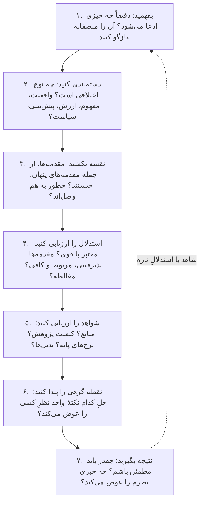

# فصل ۱۶. جعبه‌ابزارِ متفکرِ نقاد: تحلیلِ گفت‌وگوها و ساختنِ استدلال

[← قبلی: راهنمای میدانیِ مغالطه‌ها](15-fallacies.md) · [فهرست](README.md) · [بعدی: واژه‌نامه ←](17-glossary.md)

**صوت:** [شنیدنِ این فصل](audio/16-critical-thinking-toolkit.mp3) (۱ ساعت و ۱ دقیقه، روایت به انگلیسی) · [باز کردن در پخش‌کننده](audio/index.html#16)

---

> «باید بکوشید موضعِ طرفِ مقابل را آن‌قدر روشن، زنده و منصفانه بازگو کنید که خودش بگوید: "ممنون، کاش خودم این‌طور گفته بودم."»
> — دنیل دنت، *پمپ‌های شهود و ابزارهای دیگر برای فکر کردن* (۲۰۱۳)، در بیانِ قاعدهٔ اولِ راپوپورت

> «هدفِ استدلال یا بحث نباید پیروزی باشد، بلکه پیشرفت.»
> — ژوزف ژوبر (۱۷۵۴–۱۸۲۴)، *اندیشه‌ها*

پانزده فصلِ گذشته مفهوم‌ها را فراهم کردند. این فصل آن‌ها را به **عمل** درمی‌آورد: روشی قدم‌به‌قدم برای تحلیلِ هر گفت‌وگو، مناظره، مقاله یا ادعا؛ روشی برای ساختنِ استدلال‌های خودتان؛ ابزارهایی برای بارِ اثبات، قاعده‌های سرانگشتی و آدابِ اختلاف؛ پنج مطالعهٔ موردی که کامل حل شده‌اند؛ و چک‌لیست‌ها و عادت‌هایی برای استفادهٔ روزانه.

این فصل را کارگاه بدانید. هر ابزار به فصلی پیوند دارد که نظریه‌اش آنجا توضیح داده شده است.

---

## حلقهٔ اصلی

هر وقت با ادعا، استدلال یا اختلافی مهم روبه‌رو شدید، این هفت گام را بردارید. با تمرین، بیشترشان سریع و خودکار می‌شوند.

یک کارِ مقدماتیِ مفید این است که سه راهِ قانع کردن را که ارسطو در *خطابه* برشمرد، از هم جدا کنید (نگاه کنید به [ارسطو](02-history-of-epistemology.md#aristotle)):

- **لوگوس**: استدلال و شواهد.
- **اتوس**: منش و اعتبارِ گوینده.
- **پاتوس**: احساس‌های شنوندگان.

هر سه بخشِ مشروعی از ارتباط‌اند. اما وقتی می‌خواهید تصمیم بگیرید که ادعایی *درست* است یا نه، بارِ اصلی بر دوشِ لوگوس است، اتوس فقط به‌عنوانِ شاهدی دربارهٔ گواهیِ گوینده اهمیت دارد (نگاه کنید به [کارشناسان و نوآموزان](12-social-epistemology.md#experts-and-novices))، و پاتوس را باید کنار گذاشت. از خودتان بپرسید: *اگر جذابیتِ گوینده و لحنِ احساسی‌اش را کنار بگذارم، چه استدلالی باقی می‌ماند؟*

---

## گامِ ۱: پیش از ارزیابی، بفهمید

تا ندانید ادعا چیست، نمی‌توانید ارزیابی‌اش کنید. بیشترِ بحث‌های بی‌حاصل با یک بدفهمی شروع می‌شوند.

**ادعا را با کلمه‌های خودتان بازگو کنید**، و اگر می‌توانید بازگویی‌تان را با طرفِ مقابل وارسی کنید: «پس، اگر درست فهمیده باشم، می‌گویید که... درست است؟»

**اصلِ حسنِ ظن را به کار ببرید** (نگاه کنید به [اصلِ حسنِ ظن](03-logic-and-arguments.md#the-principle-of-charity)): وقتی جمله‌ای را می‌شود به چند شکل فهمید، معقول‌ترین برداشت را انتخاب کنید.

**استدلالِ مخالف را قوی کنید.** از این هم جلوتر بروید: *قوی‌ترین* روایتِ دیدگاهِ مخالف را بسازید، حتی قوی‌تر از آنچه طرفِ مقابل گفته است. اگر بتوانید قوی‌ترین روایت را رد کنید، نتیجه‌تان محکم است؛ اگر نتوانید، چیزی یاد گرفته‌اید. جان استوارت میل این استدلال را در *دربارهٔ آزادی* آورد: «کسی که فقط طرفِ خودش را در یک ماجرا می‌شناسد، همان را هم کم می‌شناسد» (نگاه کنید به [هگل، میل و ویول](02-history-of-epistemology.md#hegel-mill-and-whewell)).

**قاعده‌های راپوپورت.** دنیل دنت (*پمپ‌های شهود*، ۲۰۱۳) چند قاعده برای نقدِ دیدگاهِ مخالف را بر سرِ زبان‌ها انداخت و آن‌ها را به نظریه‌پردازِ بازی، آناتول راپوپورت، نسبت داد:

1. موضعِ طرفِ مقابل را آن‌قدر روشن، زنده و منصفانه بازگو کنید که خودش بگوید: «ممنون، کاش خودم این‌طور گفته بودم.»
2. همهٔ نکته‌هایی را که با او در آن‌ها توافق دارید بشمارید، به‌ویژه آن‌هایی را که همه بر سرشان توافق ندارند.
3. هر چیزی را که از طرفِ مقابل یاد گرفته‌اید بگویید.
4. فقط بعد از این‌هاست که اجازه دارید حتی یک کلمه در رد یا نقدِ او بگویید.

**آزمونِ تورینگِ ایدئولوژیک.** اقتصاددان برایان کاپلان (۲۰۱۱) آزمونی پیشنهاد کرد تا ببینید واقعاً دیدگاهِ مخالف را می‌فهمید یا نه: آیا می‌توانید آن را آن‌قدر خوب توضیح دهید که طرفدارانش نتوانند شما را از یک باورمندِ واقعی تشخیص دهند؟ اگر از این آزمون سربلند بیرون نمی‌آیید، احتمالاً دیدگاه را آن‌قدر خوب نمی‌فهمید که بتوانید با اطمینان ردش کنید.

**به آنچه در لفافه گفته می‌شود هم توجه کنید، نه فقط به خودِ کلمه‌ها.** فیلسوف پل گرایس («منطق و گفت‌وگو»، ۱۹۷۵) نشان داد که گفت‌وگو بر یک **اصلِ همکاری** تکیه دارد، با قاعده‌هایی دربارهٔ **کمیت** (به اندازهٔ لازم بگو، نه بیشتر)، **کیفیت** (چیزی را بگو که درست می‌دانی و برایش شاهد داری)، **ربط** (به موضوع مربوط باش) و **شیوه** (روشن حرف بزن). ما همیشه معناهایی فراتر از معنای تحت‌اللفظیِ کلمه‌ها برداشت می‌کنیم که به آن‌ها **تلویح** می‌گویند. اگر کسی بگوید «بعضی از دانشجویان قبول شدند»، تلویحاً می‌گوید همه قبول نشدند. اگر یک توصیه‌نامه فقط بگوید «خطِ بسیار خوبی دارد و همیشه وقت‌شناس بود»، تلویحاً می‌گوید چیزِ بهتری برای گفتن نیست. فهمیدنِ یک ادعا یعنی فهمیدنِ تلویح‌هایش هم، اما مراقب باشید: تلویح را می‌شود پس گرفت («بعضی از دانشجویان قبول شدند؛ در واقع همه قبول شدند»)، و منصفانه نیست کسی را پای تلویحی نگه دارید که منظورش نبوده است.

---

## گامِ ۲: نوعِ اختلاف را مشخص کنید

اختلاف‌ها انواعِ مختلفی دارند، و هر نوع راهِ حلِ خودش را دارد. بسیاری از بحث‌ها به جایی نمی‌رسند، چون دو طرف، بی‌آنکه بدانند، دربارهٔ دو نوعِ متفاوت از اختلاف حرف می‌زنند.

| نوع | پرسش | مثال | چطور می‌شود حلش کرد |
|---|---|---|---|
| **واقعی (تجربی)** | چه چیزی برقرار است؟ | «آیا پارسال جرم بیشتر شد؟» | شاهد: داده، مشاهده، آزمایش |
| **علّی** | چه چیزی علتِ چه چیزی است؟ | «آیا این سیاست باعثِ کاهشِ جرم شد؟» | استنتاجِ علّی: مقایسه‌های کنترل‌شده، آزمایش‌های طبیعی (نگاه کنید به [علیت](10-science-and-evidence.md#causation-and-causal-inference)) |
| **پیش‌بینانه** | چه رخ خواهد داد؟ | «آیا این سیاست جرم را کم می‌کند؟» | مدل‌ها، نرخ‌های پایه، کارنامه‌ها، پیش‌بینی |
| **مفهومی / لفظی** | منظورمان از این اصطلاح چیست؟ | «آیا این "سانسور" است؟» | روشن کردنِ تعریف‌ها؛ کنار گذاشتنِ خودِ کلمه؛ جدا کردنِ پرسشِ واقعی (نگاه کنید به [نزاع‌های لفظی](04-language-concepts-and-definitions.md#verbal-disputes)) |
| **تفسیری** | این متن، قانون یا کار یعنی چه؟ | «نویسندهٔ این قانون چه قصدی داشت؟» | بافت، شاهدِ قصد، اصل‌های تفسیر |
| **هنجاری (ارزشی)** | چه چیزی خوب، درست، عادلانه است؟ | «آیا مالیات بر ثروتِ ارثی منصفانه است؟» | استدلالِ اخلاقی، آزمون‌های سازگاری، آزمایش‌های فکری، تعادلِ تأملی (نگاه کنید به [واقعیت‌ها، ارزش‌ها و شکافِ هست‌ـ‌باید](04-language-concepts-and-definitions.md#facts-values-and-the-is-ought-gap)) |
| **وزن‌دهی (اولویت‌ها)** | هر ملاحظه چقدر مهم است؟ | «آیا رشدِ اقتصادی از برابری مهم‌تر است؟» | اغلب حل‌شدنی نیست؛ بده‌بستان‌ها را روشن کنید؛ دنبالِ گزینه‌هایی بگردید که هر دو هدف را برآورده کنند |
| **عملی (سیاستی)** | چه باید بکنیم؟ | «آیا باید بزرگراهِ تازه را بسازیم؟» | ترکیبی از همهٔ موارد بالا: واقعیت‌ها + پیش‌بینی‌ها + ارزش‌ها + وزن‌ها + شدنی بودن |
| **چارچوبی (عمیق)** | چه چیزی شاهد یا مرجع به حساب می‌آید؟ | «این مسئله را باید کتابِ مقدس حل کند یا علم؟» | از همه سخت‌تر؛ دنبالِ تعهدهای مشترک و نقدِ درونی بگردید (نگاه کنید به [اختلافِ عمیق](12-social-epistemology.md#deep-disagreement)) |

**اختلاف‌های عملی را می‌شود به اجزایشان شکست.** تقریباً هر اختلافی دربارهٔ اینکه چه باید کرد، جزءهای واقعی، علّی، پیش‌بینانه، مفهومی، هنجاری و وزن‌دهی دارد. جدا جدا نوشتنِ آن‌ها اغلب مفیدترین کاری است که در یک بحث می‌توانید بکنید. شاید ببینید که در ۸۰٪ اجزا توافق دارید و اختلافِ واقعی بسیار کوچک است.

---

## نظریهٔ نقطهٔ نزاع

سخنورانِ باستان ابزاری درست برای همین کار ساختند. **نظریهٔ نقطهٔ نزاع** (stasis) را **هرماگوراسِ تِمنوسی** (قرنِ دومِ پیش از میلاد) سامان داد و سیسرو و کوئینتیلیان آن را برای کار در دادگاه‌ها پروراندند. «استاسیس» («ایستادن» یا «نقطهٔ توقف») جایی است که موضع‌های دو طرف به هم برمی‌خورند و اختلاف آنجا گره می‌خورد. نقطه‌های نزاعِ کلاسیک به ترتیب این‌هاست:

1. **گمان (واقعیت)**: *آیا رخ داد؟ آیا وجود دارد؟* «آیا متهم پول را برداشت؟»
2. **تعریف**: *چیست؟ چطور باید دسته‌بندی‌اش کرد؟* «برداشتنِ پول دزدی بود یا قرض؟»
3. **کیفیت**: *خوب است یا بد، موجه است یا ناموجه؟ چقدر جدی؟* «آیا برداشتنش به‌خاطرِ یک وضعِ اضطراری موجه بود؟»
4. **رویه (صلاحیت، سیاست)**: *چه باید کرد؟ چه کسی باید تصمیم بگیرد؟ آیا اینجا جای درستی است؟* «آیا این باید در دادگاهِ کیفری رسیدگی شود، یا خصوصی حل شود؟»

این نقطه‌ها ترتیب دارند: اگر دو طرف دربارهٔ واقعیت‌ها اختلاف دارند، بحث دربارهٔ کیفیت زودهنگام است. دادستان و وکیل باید اول روشن کنند که واقعاً کجا با هم اختلاف دارند.

**این روش را در هر بحثِ امروزی به کار ببرید.** بحثی را در نظر بگیرید دربارهٔ اینکه آیا یک شهر باید مجسمه‌ای بحث‌برانگیز را بردارد یا نه:
- **واقعیت**: این شخص که بود؟ چه کرد؟ مجسمه کی و چرا ساخته شد؟
- **تعریف**: آیا مجسمه یک سندِ تاریخی است، یادبودی برای بزرگداشتِ آن شخص، یا یک نمادِ سیاسی؟ آیا برداشتنش «پاک کردنِ تاریخ» است؟
- **کیفیت**: دستاوردها و خطاهای آن شخص را چطور باید سنجید؟ مجسمه به چه کسی آسیب می‌زند یا سود می‌رساند؟
- **رویه**: چه کسی باید تصمیم بگیرد: شورای شهر، همه‌پرسی، تاریخ‌دانان؟ باید برداشته شود، به موزه برود، یا توضیحی کنارش گذاشته شود؟

آدم‌هایی که ظاهراً دربارهٔ یک چیز بحث می‌کنند، اغلب بر سرِ نقطه‌های نزاعِ متفاوتی بحث می‌کنند. این پرسش که «دقیقاً کجا اختلاف داریم: دربارهٔ واقعیت‌ها، تعریف، ارزش، یا اینکه چه باید کرد؟» می‌تواند یک دعوای پرسروصدا را به گفت‌وگو تبدیل کند.

---

## گامِ ۳: نقشهٔ استدلال را بکشید

حالا ساختارِ استدلال را بازسازی کنید (نگاه کنید به [بازسازیِ استدلال‌های واقعی](03-logic-and-arguments.md#reconstructing-real-arguments)).

1. **نتیجهٔ اصلی را پیدا کنید.** از آزمونِ «پس» استفاده کنید.
2. **مقدمه‌های گفته‌شده را فهرست کنید.** لفاظی، تکرار و حرف‌های حاشیه‌ای را کنار بگذارید.
3. **مقدمه‌های ناگفته را اضافه کنید**، و از میانِ آن‌ها پذیرفتنی‌ترین‌هایی را انتخاب کنید که استدلال را سرِ پا نگه می‌دارند (نگاه کنید به [اضافه کردنِ مقدمه‌های ناگفته](03-logic-and-arguments.md#supplying-missing-premises)).
4. **ساختار را مشخص کنید.** کدام مقدمه‌ها به هم پیوسته‌اند (فقط با هم کار می‌کنند) و کدام هم‌گرا (دلیل‌های مستقل)؟ آیا استدلال‌های فرعی‌ای پشتِ مقدمه‌ها هست؟
5. **مجوزی را که شاهد را به نتیجه وصل می‌کند** مشخص کنید (نگاه کنید به [مدلِ تولمین](03-logic-and-arguments.md#the-toulmin-model)).
6. **اعتراض‌ها و جواب‌ها را** به نقشه اضافه کنید.

برای تحلیلی سریع، صورتِ استاندارد کافی است:

> ۱. [مقدمه]
> ۲. [مقدمه]
> ۳. [مقدمهٔ پنهان]
> ————
> ن. [نتیجه]

برای یک بحثِ پیچیده، نقشه بکشید (روی کاغذ، یا با ابزارهای رایگانی مثلِ Argdown، Kialo یا Rationale). نقشه نشان می‌دهد کجا یک نتیجه فقط به یک مقدمهٔ ضعیف بند است، یا کجا اعتراضی که کوبنده به نظر می‌رسید در واقع به نکته‌ای حاشیه‌ای حمله می‌کند.

---

## گامِ ۴: مقدمه‌ها و استدلال را ارزیابی کنید

رالف جانسون و جی. آنتونی بلر (*دفاعِ منطقی از خود*، ۱۹۷۷) سه معیار برای مقدمه‌های خوب پیشنهاد کردند که اغلب با حروفِ اولشان، **ARS**، شناخته می‌شوند:

- **پذیرفتنی بودن**: آیا مقدمه‌ها درست‌اند، یا دست‌کم پذیرفتنشان معقول است؟ پشتوانه دارند، یا خودشان محلِ بحث‌اند؟
- **ربط**: آیا مقدمه‌ها واقعاً به نتیجه مربوط‌اند؟ (نگاه کنید به [مغالطه‌های ربط](15-fallacies.md#fallacies-of-relevance).)
- **کفایت**: آیا مقدمه‌ها روی‌هم‌رفته پشتوانهٔ *کافی* برای نتیجه‌اند؟ (مقدمه‌ای که مربوط اما ضعیف است ممکن است کافی نباشد.)

بعد **استدلال** را وارسی کنید:

- اگر **قیاسی** است: معتبر است؟ سعی کنید مثالِ نقضی پیدا کنید (نگاه کنید به [روشِ مثالِ نقض](03-logic-and-arguments.md#the-method-of-counterexample)).
- اگر **استقرایی** است: نمونه بزرگ و نماینده است؟ مثالِ نقضی هست؟ (نگاه کنید به [قوت و قانع‌کنندگی](03-logic-and-arguments.md#strength-and-cogency).)
- اگر **ابداکشنی** است: توضیح‌های دیگر در نظر گرفته شده‌اند؟ آیا این واقعاً بهترین توضیح است؟ (نگاه کنید به [استنتاج از راهِ بهترین تبیین](10-science-and-evidence.md#inference-to-the-best-explanation).)
- اگر **تمثیل** است: آیا دو مورد در جنبه‌هایی که مهم است شبیه‌اند؟
- اگر **علّی** است: آیا احتمالِ علیتِ وارونه، مخدوش‌گری، شانس و گزینش کنار گذاشته شده است؟ (نگاه کنید به [همبستگی و علیت](10-science-and-evidence.md#correlation-and-causation).)
- اگر **عملی** است (برای رسیدن به G باید A را انجام دهیم): پرسش‌های انتقادیِ بخشِ [نوعِ درستِ استدلال را انتخاب کنید](#choose-the-right-kind-of-argument) را ببینید.

در آخر، دنبالِ **مغالطه‌ها** بگردید، و یادتان باشد که بیشترشان خویشاوندانِ مشروعی دارند (نگاه کنید به [فصل ۱۵](15-fallacies.md)).

---

## گامِ ۵: شواهد را ارزیابی کنید

### منبع را ارزیابی کنید

برای هر ادعایی که بر گواهی استوار است بپرسید (نگاه کنید به [ارزیابیِ گواهی در عمل](07-sources-of-knowledge.md#evaluating-testimony-in-practice)):

- **توانایی**: آیا منبع در جایگاهی است که بداند؟ تخصصِ مربوط را دارد؟
- **صداقت**: دلیلی برای گمراه کردن دارد؟ آیا این ادعا به ضررِ خودِ اوست؟
- **کارنامه**: در این نوع پرسش‌ها، تا حالا چقدر قابل‌اعتماد بوده است؟
- **استقلال**: منبعی مستقل است، یا حرفِ منبعِ دیگری را تکرار می‌کند؟ ده گزارش که همه از یک خبرگزاری نقل می‌کنند، یک منبع به حساب می‌آیند.
- **طولِ زنجیره**: میانِ شما و شاهدِ اصلی چند واسطه هست؟

### جانبی بخوانید

راستی‌آزمایانِ حرفه‌ای دربارهٔ یک وب‌سایت فقط با نگاه کردن به خودِ آن داوری نمی‌کنند. از آن **بیرون می‌روند** و می‌بینند منابعِ دیگر درباره‌اش چه می‌گویند (نگاه کنید به [«خودت تحقیق کن»](12-social-epistemology.md#do-your-own-research)). روشِ **SIFT**ِ مایک کالفیلد:

1. **بایستید.** پیش از خواندن، بازنشر یا واکنش نشان دادن، مکث کنید. این منبع را می‌شناسید؟ هدفتان از خواندنش چیست؟
2. **منبع را بررسی کنید.** یک دقیقه وقت بگذارید تا بفهمید چه کسی پشتِ آن است و چه تخصص و چه هدفی دارد. اسمِ منبع را در زبانهٔ تازه‌ای جست‌وجو کنید.
3. **پوششِ بهتری پیدا کنید.** همان ادعا را در منابعِ قابل‌اعتماد یا در یک گزارشِ راستی‌آزمایی پیدا کنید. اغلب اصلاً لازم نیست *این* منبع را ارزیابی کنید؛ کافی است منبعِ بهتری پیدا کنید.
4. **ادعاها، نقل‌قول‌ها و تصویرها را تا بافتِ اصلی‌شان دنبال کنید.** پژوهشِ اصلی، نقل‌قولِ کامل یا عکسِ اصلی را پیدا کنید. بخشِ زیادی از اطلاعاتِ نادرست از مطالبِ واقعی‌ای ساخته شده که از بافتشان جدا شده‌اند.

(چک‌لیست‌های قدیمی‌تر مثلِ «آزمونِ CRAAP»، که دربارهٔ به‌روز بودن، ربط، مرجعیت، دقت و هدف می‌پرسد، هنوز به‌عنوانِ یادآور مفیدند؛ اما واینبرگ و همکارانش دیدند که بررسیِ عمودیِ ویژگی‌های خودِ سایت ممکن است گمراه‌کننده باشد، چون سایت‌های حرفه‌ای به‌راحتی معتبر به نظر می‌رسند.)

### پژوهش را ارزیابی کنید

برای ادعاهای علمی یا آماری (نگاه کنید به [فصل ۹](09-induction-probability-bayes.md) و [فصل ۱۰](10-science-and-evidence.md)):

- **چه نوع پژوهشی است؟** کارآزماییِ تصادفی، پژوهشِ هم‌گروهی، مورد‌ـ‌شاهدی، پیمایشِ مقطعی، گزارشِ موردی، مدل‌سازی یا نظر؟ در [سلسله‌مراتبِ شواهد](10-science-and-evidence.md#randomized-controlled-trials-and-the-hierarchy-of-evidence) کجا قرار می‌گیرد؟
- **چه کسانی بررسی شدند؟** چند نفر؟ چطور انتخاب شدند؟ انسان بودند یا حیوان؟ آیا یافته‌ها دربارهٔ آدم‌هایی که برای شما مهم‌اند هم صدق می‌کند؟
- **در مقایسه با چه؟** گروهِ کنترل داشت؟
- **اثر چقدر بزرگ است؟** به‌طورِ مطلق؟ «از چه، به چه؟» (نگاه کنید به [خطرِ نسبی و خطرِ مطلق](09-induction-probability-bayes.md#relative-and-absolute-risk).)
- **چقدر نامطمئن؟** بازه‌های اطمینان؟ اندازهٔ نمونه؟
- **یک پژوهش است یا چندتا؟** مرورهای نظام‌مند و فراتحلیل‌ها چه می‌گویند؟
- **تکرار شده؟** پیش‌ثبت شده بود؟
- **چه کسی بودجه‌اش را داد؟** تعارضِ منافع هست؟
- **با توجه به دانسته‌های قبلی پذیرفتنی است؟** نتیجه‌ای خارق‌العاده که فقط از یک پژوهشِ کوچک آمده، به احتمالِ بیشتری تصادفی است (نگاه کنید به [چرا ممکن است بیشترِ یافته‌های منتشرشده نادرست باشند](09-induction-probability-bayes.md#why-most-published-findings-might-be-false)).

### بیزی فکر کنید

- **از نرخِ پایه شروع کنید.** ادعاهایی از این دست چند وقت یک بار درست از آب درمی‌آیند؟ (نگاهِ بیرونی.)
- **نسبتِ درست‌نمایی را بسنجید.** اگر ادعا درست باشد، دیدنِ این شاهد چقدر محتمل‌تر است تا اگر نادرست باشد؟ (نگاه کنید به [شکلِ نسبتِ بخت و نسبت‌های درست‌نمایی](09-induction-probability-bayes.md#the-odds-form-and-likelihood-ratios).)
- **توضیح‌های دیگر را در نظر بگیرید.** چه چیزِ دیگری ممکن است این شاهد را توضیح دهد؟
- شواهدِ وابسته به هم را **دو بار نشمارید**.

---

## گامِ ۶: نقطهٔ گرهی را پیدا کنید

**نقطهٔ گرهی** نکته‌ای است که اختلاف به آن بند است: اگر به یک شکل حل شود، یکی از دو طرف نظرش را عوض می‌کند.

**بپرسید: «چه چیزی نظرت را عوض می‌کند؟»** هم از طرفِ مقابل و هم از خودتان. اگر جوابِ صادقانه «هیچ چیز» است، فهمیده‌اید که این باور بر پایهٔ شواهد نیست، و شاید بحثِ بیشتر دربارهٔ شواهد بی‌فایده باشد. اگر جوابی هست، یک نقطهٔ گرهی پیدا کرده‌اید و می‌توانید دربارهٔ همان نکتهٔ مشخص دنبالِ شاهد بگردید.

**گرهِ دوگانه.** «مرکزِ عقلانیتِ کاربردی» روشی به نامِ **گرهِ دوگانه** (double crux) برای اختلافِ سازنده ساخت. دو نفری که دربارهٔ ادعایی اختلاف دارند، هر کدام دنبالِ گزاره‌ای مشخص‌تر می‌گردند که (الف) اگر درست بود ادعا را می‌پذیرفتند و اگر نادرست بود نمی‌پذیرفتند؛ و (ب) دربارهٔ آن اختلاف دارند. وقتی باورِ هر دو نفر به ادعا به *یک* گزارهٔ واحد بستگی داشته باشد، یک **گرهِ دوگانه** پیدا شده است: پرسشی مشترک و اغلب آزمون‌پذیر که اختلافشان به آن بند است.

> الف: «شرکتمان باید به هفتهٔ کاریِ چهارروزه برود.»
> ب: «مخالفم.»
> الف: «اگر قانع شوم که بهره‌وری را بیش از ۱۰٪ کم می‌کند، از این ایده دست می‌کشم.»
> ب: «و اگر من قانع شوم که بهره‌وری تقریباً ثابت می‌ماند، از آن حمایت می‌کنم.»
> **گرهِ دوگانه**: *آیا بهره‌وری بیش از ۱۰٪ کم می‌شود؟* حالا می‌توانند شواهدِ شرکت‌هایی را که این کار را آزموده‌اند ببینند، یا خودشان آن را آزمایشی اجرا کنند.

**پرسشگریِ سقراطی.** وقتی دیدگاهِ کسی، یا دیدگاهِ خودتان، را می‌کاوید، این نوع پرسش‌ها (که ریچارد پال و لیندا الدر از سنتِ سقراطی پروراندند) به پیدا کردنِ نقطه‌های گرهی کمک می‌کنند:

- **روشن‌سازی**: منظورتان از ... چیست؟ می‌توانید مثالی بزنید؟
- **پیش‌فرض‌ها**: چه چیزی را فرض می‌گیرید؟ چرا کسی باید آن را فرض بگیرد؟
- **دلیل‌ها و شواهد**: از کجا می‌دانید؟ چه چیزی نظرتان را عوض می‌کند؟
- **زاویه‌های دید**: کسی که مخالف است چه جوابی می‌دهد؟ قوی‌ترین اعتراض چیست؟
- **لوازم**: اگر این درست است، چه نتیجه‌ای از آن می‌گیریم؟ آن نتیجه را می‌پذیرید؟
- **خودِ پرسش**: چرا این پرسش مهم است؟ آیا پرسشِ درستی است؟

---

## گامِ ۷: بسنجید و نتیجه بگیرید

**اطمینانتان را با شواهد متناسب کنید.** نتیجه‌ها به‌ندرت همه یا هیچ‌اند. از درجه‌های اطمینان استفاده کنید و آن‌ها را صریح بگویید.

کلمه‌هایی مثلِ «محتمل»، «ممکن» و «احتمالِ جدی» به‌طرزِ بدی مبهم‌اند. در ۱۹۵۱، یک برآوردِ اطلاعاتیِ ملیِ آمریکا (NIE 29-51) اعلام کرد که حملهٔ شوروی به یوگسلاوی را باید «امکانی جدی» دانست. شرمن کنت، از بنیان‌گذارانِ تحلیلِ اطلاعاتیِ آمریکا، بعدها فهمید تحلیلگرانی که بر سرِ این عبارت توافق کرده بودند، آن را هر چیزی از حدودِ ۲۰٪ تا ۸۰٪ احتمال می‌دانستند («کلمه‌های احتمالِ برآوردی»، ۱۹۶۴). هیئتِ بین‌دولتیِ تغییرِ اقلیم حالا از واژگانی استاندارد استفاده می‌کند:

| اصطلاح | احتمال |
|---|---|
| تقریباً قطعی | ۹۹–۱۰۰٪ |
| به‌شدت محتمل | ۹۵–۱۰۰٪ |
| بسیار محتمل | ۹۰–۱۰۰٪ |
| محتمل | ۶۶–۱۰۰٪ |
| تقریباً به همان اندازه محتمل که نامحتمل | ۳۳–۶۶٪ |
| نامحتمل | ۰–۳۳٪ |
| بسیار نامحتمل | ۰–۱۰٪ |
| به‌شدت نامحتمل | ۰–۵٪ |
| استثنائاً نامحتمل | ۰–۱٪ |

وقتی نتیجه‌ای مهم است، یک عددِ تقریبی به آن بدهید، حتی اگر فقط برای خودتان. عدد شما را به دقت وادار می‌کند و امکان می‌دهد بعداً ببینید پیش‌بینی‌هایتان چقدر درست از آب درآمده‌اند (نگاه کنید به [کالیبراسیون و قاعده‌های نمره‌دهی](09-induction-probability-bayes.md#calibration-and-scoring-rules)).

**هر جا لازم است، داوری نکنید.** «نمی‌دانم» و «شواهد دوپهلوست» نتیجه‌هایی آبرومندند. هیچ اجباری نیست که دربارهٔ همه‌چیز نظر داشته باشید.

**بنویسید چه چیزی نظرتان را عوض می‌کند.** این کار باورتان را آزمون‌پذیر می‌کند و شما را با خودتان صادق نگه می‌دارد.

**باور را از عمل جدا کنید.** گاهی باید پیش از قطعی شدنِ شواهد دست به کار شوید. آن‌وقت پرسشِ عملی این نیست که «چه چیزی درست است؟»، بلکه این است که «با این عدمِ قطعیت، با هزینه‌ای که هر نوع خطا دارد، و با ارزشِ صبر کردن برای اطلاعاتِ بیشتر، بهترین کار چیست؟» نگاه کنید به [نفوذِ ملاحظه‌های عملی](13-virtues-and-ethics-of-belief.md#pragmatic-encroachment).

---

## ساختنِ استدلالِ خودتان

همهٔ آنچه در این راهنما آمد وقتی *شما* استدلال می‌کنید هم صدق می‌کند. این یک روش است.

### با پرسش شروع کنید

دقیق بگویید **به چه پرسشی** جواب می‌دهید و **جوابتان چیست**. بسیاری از استدلال‌های ضعیف از پرسش‌های مبهم می‌آیند. نه «مهاجرت چه؟» بلکه «آیا افزایشِ ۲۰ درصدیِ سهمیهٔ سالانهٔ ویزای کارگرانِ ماهر، در طولِ پنج سال میانگینِ دستمزدِ کارگرانِ فعلیِ این بخش را بالا می‌برد یا پایین می‌آورد؟»

مشخص کنید ادعایتان به کدام **نقطهٔ نزاع** مربوط است: واقعیت، تعریف، کیفیت یا رویه. اگر ادعایتان عملی است («باید...»)، بپذیرید که به ادعاهایی در نقطه‌های نزاعِ پیشین بستگی دارد.

### آن را در صورتِ استاندارد بسازید

استدلالتان را بنویسید:

> ۱. [مقدمه: اغلب یک ادعای تجربی]
> ۲. [مقدمه: اغلب یک اصلِ هنجاری]
> ۳. [مقدمه: وصل کردنِ آن دو به موردِ مطرح]
> ————
> ن. [نتیجه]

بعد وارسی کنید:
- **معتبر است** (یا قوی)؟ اگر نه، کدام مقدمه گم شده؟
- **آیا همهٔ مقدمه‌ها صریح‌اند؟** آیا به فرضی پنهان تکیه دارید که منتقد ردش می‌کند؟
- **کدام مقدمه ضعیف‌تر است؟** منتقدان همان‌جا را نشانه می‌گیرند، و همان‌جا بیشترین پشتیبانی را لازم دارید.

### نوعِ درستِ استدلال را انتخاب کنید

- **قیاسی**: وقتی می‌توانید مقدمه‌هایی را اثبات کنید که نتیجه را تضمین می‌کنند. بیرون از منطق، ریاضیات و تعریف‌ها کمیاب است، اما قوی است.
- **استقرایی**: تعمیم از شواهد. به نمونه‌های خوب و دانشِ پس‌زمینه نیاز دارد.
- **ابداکشنی**: استدلال کردن که فرضیه‌تان بهترین تبیینِ شواهد است. به مقایسهٔ صریح با رقیبان نیاز دارد.
- **تمثیلی**: استدلال از یک موردِ مشابه. به شباهت‌های مربوط و نبودِ تفاوت‌های مربوط نیاز دارد.
- **استدلالِ عملی** (وسیله‌ـ‌هدف): «هدفِ G را می‌خواهیم؛ کارِ A به G می‌رسد؛ پس باید A را انجام دهیم.» پرسش‌های انتقادیِ داگلاس والتون برای استدلالِ عملی فهرستی برای محکم کردنِ پیشنهادِ خودتان است:
  1. آیا هدف‌های دیگری هست که با G تعارض دارند؟
  2. آیا کارهای بدیلی هست که بهتر به G می‌رسند؟
  3. آیا A واقعاً ممکن (شدنی) است؟
  4. اثرهای جانبیِ (پیامدهای منفیِ) A چیست؟
  5. آیا شاهدی هست که A واقعاً به G می‌رسد؟

پیشنهادِ سیاستی‌ای که به این پنج پرسش جواب داده خیلی قوی‌تر از پیشنهادی است که نداده.

### اعتراض‌ها را پیش‌بینی کنید

پیش از عرضهٔ استدلالتان، **سه اعتراضِ قوی‌ای** را که به ذهنتان می‌رسد بنویسید، و به آن‌ها جواب دهید. بهتر از آن، استدلالتان را به کسی نشان دهید که مخالف است و از او بخواهید ضعیف‌ترین نقطه‌اش را پیدا کند (نگاه کنید به [نظریهٔ استدلالیِ استدلال](14-psychology-of-reasoning.md#the-argumentative-theory-of-reasoning)). پیش‌کالبدشکافی کمک می‌کند: تصور کنید استدلالتان قاطعانه رد شده است. آن ردیه چه بود؟

پرداختنِ آشکار به اعتراض‌ها سه سود دارد: استدلال را بهتر می‌کند، نشان می‌دهد طرفِ مقابل را می‌فهمید (و اعتماد می‌سازد)، و جواب‌های آسان را از منتقدان می‌گیرد.

### به‌اندازه قید بزنید

نتیجه‌تان را با **درجهٔ اطمینانی** که شواهدتان پشتیبانی می‌کند بگویید، و **شرط‌هایی** را که در آن‌ها برقرار است یادآوری کنید (**قید** و **ردیه**ٔ تولمین؛ نگاه کنید به [مدلِ تولمین](03-logic-and-arguments.md#the-toulmin-model)).

- زیاده‌گویی («این ثابت می‌کند...»، «آشکار است که...»، «همه می‌دانند...») دعوت به رد شدن است و وقتی یک مثالِ نقض پیدا شود اعتبارتان را خراب می‌کند.
- کم‌گویی («ممکن است شاید احتمالاً این‌طور باشد که...») استدلال را بی‌فایده می‌کند.
- قیدِ خوب مشخص است: «در شهرهایی با حمل‌ونقلِ عمومیِ خوب، عوارضِ ورود به مرکزِ شهر ترافیک را حدودِ یک‌پنجم کم کرده است؛ اینجا احتمالاً اثر کمتر است، چون رانندگانِ کمتری گزینهٔ دیگری دارند.»

### روشن بنویسید

قاعده‌های جورج اورول از «سیاست و زبانِ انگلیسی» (۱۹۴۶) هنوز توصیه‌های خوبی‌اند:

1. هیچ‌وقت استعاره، تشبیه یا صنعتِ ادبی‌ای را که عادت دارید در نوشته‌ها ببینید به کار نبرید.
2. هیچ‌وقت کلمهٔ بلند را جایی که کلمهٔ کوتاه کار را انجام می‌دهد به کار نبرید.
3. اگر می‌شود کلمه‌ای را حذف کرد، همیشه حذفش کنید.
4. هیچ‌وقت مجهول را جایی که می‌شود معلوم به کار برد به کار نبرید.
5. هیچ‌وقت عبارتِ خارجی، کلمهٔ علمی یا اصطلاحِ تخصصی را به کار نبرید اگر معادلِ روزمره‌ای در زبانِ خودتان به ذهنتان می‌رسد.
6. هر کدام از این قاعده‌ها را بشکنید پیش از آنکه چیزی آشکارا زشت بگویید.

روشنی یک فضیلتِ معرفتی است: ادعاهای مبهم را نمی‌شود آزمود، و راه را برای عقب‌نشینی‌های «دژ و کشتزار» باز می‌گذارند (نگاه کنید به [دژ و کشتزار](15-fallacies.md#motte-and-bailey)). استیون پینکر (*حسِ سبک*، ۲۰۱۴) «سبکِ کلاسیک» را توصیه می‌کند: طوری بنویسید که گویی چیزی را به خواننده نشان می‌دهید که خودش می‌تواند ببیند.

### یک الگو

> **پرسش**: [پرسشِ دقیق]
> **جوابِ من**: [ادعا]، با [درجهٔ اطمینان].
> **دلیل‌های اصلی**: ۱... ۲... ۳...
> **شواهدِ کلیدی**: [منابع، پژوهش‌ها، داده‌ها]، و اینکه چرا قابل‌اعتمادند.
> **فرض‌های پنهان**: [مقدمه‌هایی که به آن‌ها تکیه دارم و بعضی ممکن است قبولشان نداشته باشند].
> **قوی‌ترین اعتراض‌ها و جواب‌های من**: ...
> **چه چیزی نظرم را عوض می‌کند**: ...
> **حدود**: این نتیجه وقتی صدق می‌کند که... و ممکن است وقتی... صدق نکند.

---

## بارِ اثبات

**بارِ اثبات** وظیفهٔ پشتیبانی از یک ادعاست. اینکه این بار بر دوشِ کیست مهم است، چون وقتی استدلالِ قاطعی در کار نیست، طرفی که بار را دارد می‌بازد. دعوا بر سرِ اینکه بار با کیست رایج است، و اغلب بحث‌ها را ناعادلانه یکسره می‌کند.

**اصل‌های کلی:**

1. **هر کس ادعایی می‌کند، بارِ پشتیبانی از آن را دارد.** این تیغِ هیچنز است (پایین‌تر)، و در بیشترِ بحث‌های عقلانی پیش‌فرض همین است. «ثابت کن اشتباه می‌کنم» استدلال نیست.
2. **ادعاهای خارق‌العاده بارِ سنگین‌تری دارند** تا ادعاهای معمولی، چون احتمالِ پیشینشان کمتر است (نگاه کنید به [شواهد و تأیید](09-induction-probability-bayes.md#evidence-and-confirmation)).
3. **بافت پیش‌فرض‌ها را تعیین می‌کند.** در حقوقِ کیفری، بار بر دوشِ دادستان است و فرض بر بی‌گناهیِ متهم است. در پزشکی، درمانِ تازه باید پیش از تأیید نشان دهد بی‌خطر و مؤثر است. در علم، فرضیهٔ تازه باید نشان دهد بهتر از فرضیهٔ جاافتاده عمل می‌کند. این پیش‌فرض‌ها داوری‌هایی را بازتاب می‌دهند دربارهٔ اینکه کدام خطاها بدترند.
4. **بارِ اثبات همان معیارِ اثبات نیست.** بار می‌گوید *چه کسی* باید شاهد بیاورد؛ معیار می‌گوید *چه اندازه* شاهد لازم است (فراتر از تردیدِ معقول، ترجیحِ احتمال‌ها، و مانندِ این‌ها؛ نگاه کنید به [نهادهای معرفتی](12-social-epistemology.md#epistemic-institutions)).
5. **بار می‌تواند جابه‌جا شود.** وقتی یک طرف شاهدی آورد که به معیارِ معقولی می‌رسد، بار به دوشِ طرفِ دیگر می‌افتد که ردش کند.

**قوریِ راسل** (نگاه کنید به [ایمان، عقل و معرفت‌شناسیِ دینی](13-virtues-and-ethics-of-belief.md#the-evidentialist-challenge)) این پیش‌فرض را نشان می‌دهد: ادعایی ابطال‌ناپذیر که نمی‌شود ردش کرد، به همین دلیل سزاوارِ باور نمی‌شود.

**بازی‌های بارِ اثبات.** مراقبِ این‌ها باشید:
- **جابه‌جا کردنِ بار**: «نمی‌توانی ثابت کنی درست نیست، پس باید قبولش کنی.»
- **تنیسِ بار**: هر دو طرف اصرار دارند که دیگری باید ادعایش را ثابت کند، و هیچ پیشرفتی نیست.
- **بارهای نامتقارن**: خواستنِ اثباتِ بسیار قوی برای ادعاهایی که دوست ندارید، و هیچ اثباتی برای ادعاهایی که دوست دارید (نگاه کنید به [شکاکیتِ سالم و فرساینده](08-skepticism.md#healthy-and-corrosive-skepticism)).

در تصمیم‌های عملی، اغلب بهتر است بارها را کنار بگذارید و مستقیم بپرسید: *با همهٔ شواهدی که داریم، کدام گزینه بهترین نتیجهٔ مورد انتظار را دارد؟*

---

## تیغ‌های فلسفی و قاعده‌های سرانگشتی

**تیغ** قاعده‌ای سرانگشتی است که به شما امکان می‌دهد تبیین‌های نامحتمل یا ادعاهای غیرضروری را «بتراشید». هیچ‌کدام خطاناپذیر نیست. هر کدام یک قاعدهٔ سرانگشتی است، نه یک قانون.

| تیغ یا اصل | بیان | کاربرد | احتیاط |
|---|---|---|---|
| **تیغِ اوکام** | موجودات را بیش از ضرورت زیاد نکن. (منسوب به ویلیامِ اوکامی، حدودِ ۱۲۸۷–۱۳۴۷؛ عبارتِ مشهورش بعدتر است.) | با فرضِ برابریِ باقی چیزها، تبیینِ ساده‌تر را ترجیح بدهید. | «با فرضِ برابریِ باقی چیزها» حیاتی است. سادگی برای شکستنِ تساوی است، نه برگِ برنده. اصلِ اینشتین، آن‌طور که اغلب بازگو می‌شود: چیزها را تا جای ممکن ساده کنید، اما نه ساده‌تر. |
| **اصلِ هیوم** | «خردمند باورش را با شواهد متناسب می‌کند.» «هیچ گواهی‌ای برای اثباتِ معجزه کافی نیست، مگر آنکه گواهی از آن نوعی باشد که نادرستی‌اش معجزه‌آساتر از خودِ رویداد باشد.» | احتمالِ اشتباه بودنِ گواهی را در برابرِ نامحتمل بودنِ رویداد بسنجید. | به تخمینِ صادقانهٔ هر دو نیاز دارد. |
| **معیارِ سیگن** | «ادعاهای خارق‌العاده شواهدِ خارق‌العاده می‌خواهند.» (کارل سیگن آن را در مجموعهٔ تلویزیونیِ *کیهان*، ۱۹۸۰، مشهور کرد؛ صورت‌بندی‌های مشابهی در آثارِ مارچلو تروتسی، لاپلاس و هیوم آمده است.) | احتمالِ پیشینِ پایین نسبتِ درست‌نماییِ بزرگی لازم دارد. | «خارق‌العاده» باید یعنی نامحتمل با توجه به دانشِ پس‌زمینه، نه فقط ناآشنا یا ناخوشایند. |
| **تیغِ هیچنز** | «آنچه را بی‌شاهد می‌شود ادعا کرد، بی‌شاهد هم می‌شود کنار گذاشت.» (کریستوفر هیچنز، ۲۰۰۳.) | بارِ اثبات با مدعی است. | کنار گذاشتنِ ادعایی بی‌پشتوانه همان اثباتِ نادرستی‌اش نیست. |
| **قوریِ راسل** | ادعایی ابطال‌ناپذیر فقط چون نمی‌شود ردش کرد سزاوارِ باور نیست. | مقاومت در برابرِ جابه‌جا کردنِ بار. | بالا را ببینید. |
| **تیغِ هنلن** | «هرگز چیزی را که نادانی به‌خوبی توضیحش می‌دهد به بدخواهی نسبت نده.» (منتشرشده به دستِ رابرت جی. هنلن در ۱۹۸۰؛ گفته‌های مشابه خیلی قدیمی‌ترند.) | وارسی‌ای در برابرِ فکرِ توطئه‌ای: ناشی‌گری و حادثه رایج‌اند. | بدخواهی هم وجود دارد؛ این تیغ دربارهٔ این است که اول کدام تبیین را امتحان کنیم. |
| **حصارِ چسترتون** | حصاری را تا نفهمیده‌ای چرا گذاشته شده برندار. | پیش از تغییرِ یک قاعده یا نهاد، هدفش را بفهمید. | بعضی حصارها واقعاً بی‌فایده‌اند؛ این اصل پژوهش می‌خواهد، نه نگه‌داشتن. |
| **ابطال‌پذیریِ پوپر** | ادعایی که هیچ مشاهدهٔ ممکنی نمی‌تواند با آن تناقض داشته باشد چیزی دربارهٔ جهان نمی‌گوید. | بپرسید: «چه چیزی نشان می‌دهد این نادرست است؟» | معیارِ کاملی برای معنا یا علم نیست (نگاه کنید به [فصل ۱۰](10-science-and-evidence.md#popper-and-falsificationism)). |
| **تیغِ آلدر** («شمشیرِ لیزریِ شعله‌ورِ نیوتن») | «آنچه را با آزمایش یا مشاهده نمی‌شود حل کرد، ارزشِ بحث ندارد.» (مایک آلدر، ۲۰۰۴.) | بحث را روی پرسش‌هایی متمرکز کنید که شواهد می‌تواند حلشان کند. | به‌عنوانِ قاعده‌ای کلی بیش از حد قوی است: اخلاق و ریاضیات ارزشِ بحث دارند. |
| **قانونِ براندولینی** | انرژیِ لازم برای رد کردنِ حرف‌های بی‌معنا چند برابرِ انرژیِ لازم برای ساختنشان است. | نبردهایتان را انتخاب کنید؛ به منابعِ مورد اعتماد تکیه کنید. | دلیلی برای نادیده گرفتنِ همهٔ اطلاعاتِ نادرست نیست. |
| **قاعدهٔ کرامول** | هرگز به یک ادعای تجربی احتمالِ ۰ یا ۱ ندهید. | به روی شواهد باز بمانید. | احتمال‌های خیلی کوچک باز هم کوچک‌اند. |
| **گیوتینِ هیوم** | نمی‌شود «باید» را فقط از «هست» بیرون کشید. | مقدمهٔ هنجاری را پیدا کنید. | در قوی‌ترین شکلش محلِ بحث است (نگاه کنید به [فصل ۴](04-language-concepts-and-definitions.md#facts-values-and-the-is-ought-gap)). |
| **قانونِ استرجن** | «نود درصدِ هر چیزی آشغال است.» (تئودور استرجن، ۱۹۵۷.) | دربارهٔ یک حوزه از روی بهترین کارهایش داوری کنید، نه بدترین‌ها (و برعکس). | دربارهٔ طرفِ خودتان هم صدق می‌کند. |

---

## جعبه‌ابزارِ تشخیصِ مزخرفات

ستاره‌شناس کارل سیگن در *جهانِ دیوزده* (۱۹۹۵)، فصلِ ۱۲، «هنرِ ظریفِ تشخیصِ مزخرفات»، مجموعه‌ای از «ابزارها برای فکرِ شکاکانه» پیشنهاد کرد. با بازگویی:

1. هر جا ممکن است، «واقعیت‌ها» باید **تأییدِ مستقل** داشته باشند.
2. **بحثِ جدی** دربارهٔ شواهد را میانِ مدافعانِ آگاهِ همهٔ دیدگاه‌ها تشویق کنید.
3. **استدلال از روی مرجعیت وزنِ کمی دارد**: «مرجع‌ها» در گذشته اشتباه کرده‌اند. (منظورِ سیگن این بود که مرجعیت جانشینِ شاهد نیست؛ برای اینکه کی اعتماد به مرجع معقول است، نگاه کنید به [توسل به مرجع](15-fallacies.md#appeal-to-authority).)
4. **بیش از یک فرضیه بسازید.** به همهٔ راه‌های مختلفی فکر کنید که می‌شود چیزی را توضیح داد، بعد به آزمون‌هایی فکر کنید که با آن‌ها بتوانید هر کدام را به‌طورِ نظام‌مند رد کنید.
5. **سعی کنید بیش از حد به یک فرضیه دل نبندید** فقط چون مالِ خودتان است.
6. **کمّی کنید.** اگر چیزی که توضیح می‌دهید اندازه‌ای دارد، بهتر می‌توانید میانِ فرضیه‌های رقیب فرق بگذارید.
7. **اگر زنجیره‌ای از استدلال هست، همهٔ حلقه‌های زنجیره باید کار کنند**، از جمله مقدمه، نه فقط بیشترشان.
8. **تیغِ اوکام.** وقتی با دو فرضیه روبه‌رو هستید که داده‌ها را به یک اندازه خوب توضیح می‌دهند، ساده‌تر را انتخاب کنید.
9. **همیشه بپرسید آیا فرضیه، دست‌کم در اصل، ابطال‌پذیر است.**

سیگن فهرستی از مغالطه‌های رایج را هم برای پرهیز افزود، که بیشترشان در [فصل ۱۵](15-fallacies.md) آمده‌اند.

---

## اخلاقِ گفت‌وگو

### قاعده‌های بحثِ نقادانه

نظریهٔ دیالکتیکِ کاربردیِ استدلال‌ورزی (فرانس فان ایمرن و روب خروتندورست، *نظریه‌ای نظام‌مند دربارهٔ استدلال‌ورزی*، ۲۰۰۴) ده قاعده برای یک **بحثِ نقادانه** پیشنهاد می‌کند، یعنی بحثی که هدفش حلِ یک اختلافِ نظر بر پایهٔ شایستگیِ استدلال‌هاست. شکستنِ هر کدام، به معنای آن‌ها، مغالطه است. به‌طورِ خلاصه:

1. **قاعدهٔ آزادی**: طرفین نباید جلوی مطرح کردنِ موضع‌ها یا تردید در آن‌ها را بگیرند.
2. **قاعدهٔ بارِ اثبات**: کسی که موضعی را مطرح می‌کند، اگر از او خواسته شد باید از آن دفاع کند.
3. **قاعدهٔ موضع**: حمله به یک موضع باید به همان موضعی بپردازد که طرفِ مقابل واقعاً مطرح کرده (پهلوانِ پنبه ممنوع).
4. **قاعدهٔ ربط**: هر طرف فقط با استدلالی که به موضعش مربوط است می‌تواند از آن دفاع کند.
5. **قاعدهٔ مقدمهٔ ناگفته**: هیچ طرفی نباید به دروغ مقدمه‌ای ناگفته را به طرفِ مقابل نسبت دهد، یا مقدمه‌ای را که خودش ناگفته گذاشته انکار کند.
6. **قاعدهٔ نقطهٔ شروع**: هیچ طرفی نباید به دروغ مقدمه‌ای را نقطهٔ شروعِ پذیرفته‌شده جلوه دهد، یا مقدمه‌ای را که نقطهٔ شروعِ پذیرفته‌شده است انکار کند.
7. **قاعدهٔ طرح‌وارهٔ استدلال**: از یک موضع به‌طورِ قطعی دفاع نشده مگر آنکه دفاع از طرح‌وارهٔ استدلالیِ مناسبی استفاده کند که درست به کار رفته باشد.
8. **قاعدهٔ اعتبار**: استدلال باید از نظرِ منطقی معتبر باشد، یا با صریح کردنِ مقدمه‌های ناگفته بشود معتبرش کرد.
9. **قاعدهٔ پایان‌بندی**: دفاعِ ناموفق از یک موضع باید به پس گرفتنِ آن به دستِ مدافع بینجامد؛ دفاعِ موفق باید به پس گرفتنِ تردید به دستِ مخالف بینجامد.
10. **قاعدهٔ کاربرد**: طرفین نباید از عبارت‌های ناروشن یا گیج‌کننده و مبهم استفاده کنند، و باید عبارت‌های یکدیگر را تا جای ممکن با دقت و درستی تفسیر کنند.

قاعدهٔ ۹ در عمل از همه سخت‌تر است. لازمه‌اش این است که هر دو طرف آماده باشند وقتی استدلال به ضررشان است **نظرشان را عوض کنند**.

### سلسله‌مراتبِ مخالفت

جستارنویس پل گراهام («چطور مخالفت کنیم»، ۲۰۰۸) سلسله‌مراتبی از شکل‌های مخالفت پیشنهاد کرد، از بدترین تا بهترین:

| سطح | شکل | مثال |
|---|---|---|
| **DH0** | فحش دادن | «تو احمقی.» |
| **DH1** | حمله به شخص | «معلوم است که این را می‌گویی؛ وکیلی.» |
| **DH2** | جواب دادن به لحن | «باورم نمی‌شود چقدر مغرورانه حرف می‌زنی.» |
| **DH3** | نقضِ خالی | «نه، اشتباه است.» (بی هیچ دلیلی) |
| **DH4** | استدلالِ مخالف | نقض همراه با استدلال و شاهد، اما شاید متوجهِ چیزی کمی متفاوت از آنچه گفته شده. |
| **DH5** | ردیه | نقل کردنِ آنچه طرفِ مقابل واقعاً گفته و نشان دادنِ اینکه چرا اشتباه است. |
| **DH6** | رد کردنِ نکتهٔ اصلی | رد کردنِ ادعای اصلی، نه یک نکتهٔ فرعیِ حاشیه‌ای. |

هدفتان DH5 و DH6 باشد. بیشترِ مخالفت‌های اینترنتی در سطح‌های DH0 تا DH3 رخ می‌دهند.

### بدانید در چه نوع گفت‌وگویی هستید

داگلاس والتون و اریک کرابه (*تعهد در گفت‌وگو*، ۱۹۹۵) انواعی از گفت‌وگو را با هدف‌های مختلف از هم جدا کردند:

| نوعِ گفت‌وگو | هدف |
|---|---|
| **قانع کردن** (بحثِ نقادانه) | حلِ یک اختلافِ نظر |
| **پژوهش** | اثبات یا ردِ مشترکِ یک فرضیه |
| **جست‌وجوی اطلاعات** | یک طرف از دیگری اطلاعات می‌گیرد |
| **مشورت** | تصمیم دربارهٔ اینکه چه باید کرد |
| **مذاکره** | رسیدن به توافقی که هر دو طرف بپذیرند |
| **جدل** (دعوا) | شکست دادنِ طرفِ مقابل؛ خالی کردنِ خصومت |

بسیاری از مغالطه‌ها شاملِ **لغزیدنِ** نامشروع از یک نوع به نوعی دیگرند، برای نمونه از گفت‌وگوی قانع کردن دربارهٔ واقعیت‌ها به مذاکره («بیا اختلاف را نصف کنیم» در یک پرسشِ واقعی؛ نگاه کنید به [مغالطهٔ حدِ وسط](15-fallacies.md#the-middle-ground-fallacy))، یا از پژوهش به دعوا. وقتی بحثی خراب می‌شود، بپرسید: واقعاً اینجا داریم چه کار می‌کنیم؟

### رفتارِ عملی

- **اول گوش بدهید.** پیش از گفتنِ نظرتان پرسش کنید.
- **شخص را از موضع جدا کنید.** ایده‌ها را نقد کنید، نه آدم‌ها را.
- **آنچه درست است را بپذیرید.** صادقانه است، اعتماد می‌سازد، و اختلاف را باریک‌تر می‌کند.
- **بگویید «نمی‌دانم»** و «اشتباه کردم» وقتی درست است. گفتنشان در جمع از نیرومندترین نشانه‌های حسنِ نیت است.
- **دنبالِ بردن نباشید.** اگر بحثی را با احمق جلوه دادنِ کسی «ببرید»، معمولاً آمادگی‌اش را برای در نظر گرفتنِ دیدگاهتان از دست داده‌اید.
- **بدانید کی دست بکشید.** بعضی گفت‌وگوها گفت‌وگوی قانع کردن نیستند. اگر طرفِ مقابل با نیتِ بد بحث می‌کند (نگاه کنید به [ترفندهای بلاغی‌ای که بحث را خراب می‌کنند](15-fallacies.md#rhetorical-tactics-that-corrupt-discussion))، یا فضا به نمایش پاداش می‌دهد نه به فهم، کنار کشیدن معقول است.
- **آهسته نظرها را عوض کنید.** آدم‌ها به‌ندرت در یک بحث نظرشان را عوض می‌کنند. بعداً، پس از فکر کردن، عوضش می‌کنند، اگر استدلال خوب بوده و احساسِ تحقیر نکرده باشند. بذر بکارید.

---

## مطالعه‌های موردیِ حل‌شده

### مطالعهٔ موردیِ ۱: یک ادعای سلامت

> همکارتان می‌گوید: *«باید کُلدآوی را امتحان کنی. یک مکملِ گیاهیِ طبیعی است. ماهِ پیش با اولین نشانه‌های سرماخوردگی خوردمش، و سرماخوردگی سه‌روزه خوب شد. معمولاً سرماخوردگی‌ام یک هفته طول می‌کشد. تازه یک پزشک در یک پادکستِ پرطرفدار توصیه‌اش کرده.»*

**گامِ ۱: بفهمید.** ادعا علّی و کلی است: *کُلدآوی سرماخوردگی را کوتاه می‌کند* (و تلویحاً، *سرماخوردگیِ شما را هم کوتاه می‌کند*). ملاحظه‌های پشتیبان یک حکایتِ شخصی، طبیعی بودنِ محصول و توصیهٔ یک پزشک‌اند.

**گامِ ۲: دسته‌بندی کنید.** یک ادعای علّیِ واقعی، که در اصل می‌شود با شواهد حلش کرد.

**گامِ ۳: نقشه بکشید.**
> ۱. کُلدآوی خوردم و سرماخوردگی‌ام سه روز طول کشید.
> ۲. سرماخوردگی‌هایم معمولاً یک هفته طول می‌کشد.
> ۳. *(پنهان)* پس کُلدآوی باعث شد سرماخوردگی‌ام کوتاه‌تر شود.
> ۴. *(پنهان)* آنچه برای من کار کرد برای دیگران هم کار می‌کند.
> ۵. طبیعی است. *(پنهان: محصولاتِ طبیعی بی‌خطر/مؤثرند.)*
> ۶. یک پزشک توصیه‌اش می‌کند. *(پنهان: توصیهٔ این پزشک شاهدِ قابل‌اعتمادی است.)*
> ————
> ن. کُلدآوی سرماخوردگی را کوتاه می‌کند، و باید بخوری‌اش.

**گامِ ۴: استدلال را ارزیابی کنید.**
- مقدمهٔ ۳ استدلالِ **«پس از این، پس به‌خاطرِ این»** از یک موردِ تنهاست (نگاه کنید به [«پس از این، پس به‌خاطرِ این»](15-fallacies.md#post-hoc-ergo-propter-hoc)). طولِ سرماخوردگی به‌طورِ طبیعی فرق می‌کند، و شاید ویروسِ خفیف‌تری گرفته بود.
- مقدمهٔ ۴ **تعمیمِ شتاب‌زده** از یک مورد است.
- مقدمهٔ ۵ **توسل به طبیعت** است.
- مقدمهٔ ۶ ممکن است **توسلِ نامشروع به مرجع** باشد: آیا این پزشک در این حوزه کارشناس است، و آیا نظرش بازتابِ شواهد است؟ آیا برای تبلیغِ محصول پول می‌گیرد (حامیِ مالیِ پادکست)؟

**گامِ ۵: شواهد را ارزیابی کنید.**
- **نسبتِ درست‌نماییِ این حکایت** فقط کمی بیشتر از ۱ است. سرماخوردگی از چند روز تا دو هفته طول می‌کشد؛ یک سرماخوردگیِ سه‌روزه بی هیچ درمانی هم عجیب نیست. **گزینش** را هم در نظر بگیرید: او دربارهٔ باری که «کار کرد» به شما می‌گوید، نه دربارهٔ سرماخوردگی‌هایی که خوردش و اتفاقی نیفتاد (بازماندگی). و شاید یک **اثرِ دارونما** روی حسش از نشانه‌ها بوده باشد.
- **چه شاهدِ بهتری هست؟** دنبالِ مرورهای نظام‌مند (برای نمونه از کتابخانهٔ کاکرین) دربارهٔ موادِ اصلیِ این مکمل بگردید. برای بسیاری از داروهای گیاهیِ سرماخوردگی، شواهد ضعیف، دوپهلو یا کم‌کیفیت است. هشدارهای رسمی دربارهٔ تداخل‌ها یا عوارضِ جانبی را وارسی کنید.
- **خواندنِ جانبی دربارهٔ پزشک**: تخصصش چیست؟ پیوندِ مالی با محصول دارد؟

**گامِ ۶: نقطهٔ گرهی را پیدا کنید.** «اگر کارآزمایی‌های تصادفیِ باکیفیت هیچ اثری پیدا کنند، باز هم باور داری کار می‌کند؟» اگر بگوید بله، باورش بر آن نوع شاهدی که می‌تواند مسئله را حل کند استوار نیست.

**گامِ ۷: نتیجه بگیرید.** این حکایت شاهدِ بسیار ضعیفی است. ادعای «کُلدآوی سرماخوردگی را کوتاه می‌کند» پشتوانه ندارد مگر آنکه کارآزمایی‌های کنترل‌شده خلافش را نشان دهند. داوریِ عملی: اگر محصول ارزان و بی‌خطر است، خوردنش انتخابی شخصی و کم‌خطر است، اما اشتباه است که بر این پایه *باور کنیم* کار می‌کند، یا آن را به‌عنوانِ چیزی مؤثر به دیگران توصیه کنیم.

**جوابی منصفانه و بی‌دعوا**: «خوشحالم که زود بهتر شدی! سرماخوردگی آن‌قدر متغیر است که از یک بار نمی‌شود فهمید. کارآزماییِ درست‌وحسابی‌ای رویش انجام شده؟ کنجکاوم ببینم چه نتیجه‌ای گرفته‌اند.»

---

### مطالعهٔ موردیِ ۲: یک بحثِ سیاستی

> شهرِ شما دربارهٔ **عوارضِ ترافیک** بحث می‌کند: هزینه‌ای روزانه برای رانندگی به مرکزِ شهر در ساعت‌های شلوغ.
>
> **گویندهٔ الف**: «عوارضِ ترافیک کار می‌کند. لندن و استکهلم هر دو ترافیک را خیلی کم کردند. مرکزِ شهرِ ما قفل و آلوده است. درآمدش می‌تواند خرجِ اتوبوس‌های بهتر شود. باید انجامش دهیم.»
>
> **گویندهٔ ب**: «این مالیات بر مردمِ کارگر است. ثروتمندها می‌پردازند و به رانندگی ادامه می‌دهند؛ پرستارها و نظافتچی‌هایی که از حومه رفت‌وآمد می‌کنند نمی‌توانند بپردازند. و مغازه‌های محلی مشتری از دست می‌دهند. این حمله به آزادی است.»

**گامِ ۱: بفهمید.** هر دو طرف را قوی‌سازی کنید.
- الف: قیمت‌گذاریِ فضای جاده در ساعت‌های شلوغ ترافیک و آلودگی را کم می‌کند؛ شواهدِ شهرهای دیگر از این پشتیبانی می‌کند؛ درآمدش می‌تواند بدیل‌ها را بهتر کند.
- ب: این عوارض بارِ نامتناسبی بر دوشِ آدم‌های کم‌درآمدی می‌گذارد که بدیلی برای رانندگی ندارند؛ ممکن است به کسب‌وکارهای محلی آسیب بزند؛ و آزادیِ آدم‌ها را در استفاده از جاده‌های عمومی محدود می‌کند.

**گامِ ۲: با نظریهٔ نقطهٔ نزاع دسته‌بندی کنید.**

| نقطهٔ نزاع | پرسش‌ها در این بحث | نوع |
|---|---|---|
| **واقعیت / پیش‌بینی** | آیا اینجا ترافیک کم می‌شود، و چقدر؟ کیفیتِ هوا بهتر می‌شود؟ درآمدِ مغازه‌ها کم می‌شود؟ چند رفت‌وآمدکنندهٔ کم‌درآمد با خودرو به مرکز می‌آیند، و چه بدیل‌هایی دارند؟ | تجربی، پیش‌بینانه |
| **تعریف** | «مالیات» است یا «قیمت»؟ «پس‌رونده» (فشارِ بیشتر بر کم‌درآمدها) است؟ محدود کردنِ «آزادی» است؟ | مفهومی |
| **کیفیت** | ترافیک و آلودگی را چطور باید در برابرِ هزینه برای رانندگان سنجید؟ چه چیزی منصفانه است؟ | هنجاری، وزن‌دهی |
| **رویه** | آیا درآمدها باید فقط خرجِ حمل‌ونقل شوند؟ کارگرانِ کم‌درآمد معافیت بگیرند؟ با همه‌پرسی تصمیم گرفته شود؟ اول آزمایشی اجرا شود؟ | عملی، رویه‌ای |

**گامِ ۳: نقطه‌های گرهی را نقشه بکشید.** بخشِ زیادی از اختلاف دربارهٔ **پیش‌بینی‌ها** و **اثرهای توزیعی** است، که تجربی‌اند، و دربارهٔ **وزن‌ها**، که هنجاری‌اند. دعواهای «مالیات یا قیمت» و «آزادی» تا اندازه‌ای **لفظی** و تا اندازه‌ای دربارهٔ ارزش‌ها هستند.

**گامِ ۵: شواهد.**
- *ترافیک.* شواهدِ شهرهای دیگر مربوط است اما باید از نظرِ **اعتبارِ بیرونی** سنجیده شود (نگاه کنید به [کارآزمایی‌های تصادفیِ کنترل‌شده](10-science-and-evidence.md#randomized-controlled-trials-and-the-hierarchy-of-evidence)). طرحِ لندن (از ۲۰۰۳) و طرحِ استکهلم (آزمایشی در ۲۰۰۶، و بعد دائمی پس از یک همه‌پرسی)، طبقِ ارزیابی‌های رسمی، هر دو ترافیکِ ورودی به محدودهٔ عوارض را حدودِ یک‌پنجم کم کردند، هرچند اثرشان بر ترافیک با تغییرِ کاربریِ فضای جاده در طولِ زمان تغییر کرده است. تجربهٔ استکهلم دربارهٔ افکارِ عمومی هم آموزنده است: پس از اینکه ساکنان دورهٔ آزمایشی را تجربه کردند، حمایت خیلی بیشتر شد. آیا شرایطِ اینجا مشابه است (بدیل‌های حمل‌ونقلِ عمومی، ساختارِ شهر)؟
- *توزیع.* چه کسانی واقعاً در ساعت‌های شلوغ به مرکز رانندگی می‌کنند؟ در بسیاری از شهرها، رانندگانِ ساعت‌های شلوغ به مرکز درآمدِ میانگینِ بالاتری از مسافرانِ حمل‌ونقلِ عمومی دارند، که ادعای پس‌رونده بودنِ عوارض را پیچیده می‌کند؛ در شهرهای دیگر، کارگرانِ شیفتی‌ای که حمل‌ونقلِ عمومی ندارند آسیب می‌بینند. این را می‌شود با داده‌های پیمایشِ سفرِ محلی وارسی کرد.
- *اثر بر کسب‌وکار.* بر سرِ خرده‌فروشی در مرکزِ شهرهایی که عوارض گذاشتند چه آمد؟ شواهد دوپهلوست و جدا کردنش از روندهای دیگر سخت است.

**گامِ ۶: گرهِ دوگانه.** فرض کنید ب می‌گوید: «اگر بدیل‌های ارزان و قابل‌اعتمادی برای رفت‌وآمدکنندگانِ کم‌درآمد، و معافیت برای کارگرانِ شیفتیِ ضروری وجود داشت، اعتراضِ اصلی‌ام از بین می‌رفت.» و الف می‌گوید: «اگر شواهد نشان می‌داد ترافیکِ اینجا به‌طورِ معناداری کم نمی‌شود، از این پیشنهاد دست می‌کشیدم.» حالا نقطه‌های گرهی مشخص‌اند: *چه بدیل‌هایی وجود دارد، و اثر بر ترافیک چه خواهد بود؟* یک **آزمایشِ محدود در زمان** همراه با ارزیابی، مثلِ استکهلم، راهی برای جمع کردنِ شواهد دقیقاً دربارهٔ همین نکته‌هاست.

**گامِ ۷: نتیجه بگیرید.** نتیجهٔ معقولی می‌تواند این باشد: «شواهدِ شهرهای قابلِ مقایسه نشان می‌دهد ترافیک به‌طورِ چشمگیری کم خواهد شد. اثرهای توزیعی به واقعیت‌های محلی‌ای بستگی دارد که باید بسنجیم. یک آزمایشِ خوب‌طراحی‌شده، با معافیت یا تخفیف برای کارگرانِ ضروریِ کم‌درآمد و درآمدی که به حمل‌ونقل اختصاص یابد، به بیشترِ نگرانی‌های ب می‌پردازد و ادعاهای الف را می‌آزماید.» دقت کنید که این نتیجه با **تجزیه کردنِ** اختلاف به دست آمد، نه با اعلامِ یک برنده.

---

### مطالعهٔ موردیِ ۳: یک تیترِ آماری

> **تیتر**: *«قهوه‌نوشان عمرِ طولانی‌تری دارند؛ پژوهشی بزرگ نشان داد.»*
> **بخشی از مقاله** (فرضی): «در پژوهشی روی ۴۰۰٬۰۰۰ بزرگسال که ده سال دنبال شدند، کسانی که روزی دو تا سه فنجان قهوه می‌نوشیدند، پس از تعدیل برای سن، سیگار کشیدن و عامل‌های دیگر، ۱۲٪ کمتر از غیرقهوه‌نوشان در دورهٔ پژوهش مردند.»

دوازده پرسشِ [فصل ۱](01-what-is-epistemology.md#how-the-pieces-connect-one-news-story-twelve-questions) را یکی‌یکی طی کنید:

1. **دقیقاً چه چیزی ادعا می‌شود؟** تیتر علیت را القا می‌کند («قهوه عمرتان را طولانی‌تر می‌کند»). پژوهش یک **همبستگی** را گزارش می‌کند: قهوه‌نوشان مرگ‌ومیرِ کمتری داشتند. این دو ادعا متفاوت‌اند.
2. **چه کسی به من می‌گوید؟** یک روزنامه‌نگار، احتمالاً بر پایهٔ یک خبرنامه. چکیده و نتیجه‌گیریِ مقالهٔ اصلی را ببینید، که معمولاً محتاط‌ترند.
3. **چه نوع پژوهشی؟** یک **پژوهشِ هم‌گروهیِ مشاهده‌ای**: خودِ آدم‌ها انتخاب کردند قهوه بنوشند یا نه. کارآزماییِ تصادفی نیست (سخت است آدم‌ها را ده سال به‌تصادف به نوشیدن یا ننوشیدنِ قهوه بگماریم).
4. **ممکن است چیزِ دیگری این الگو را توضیح دهد؟**
   - **مخدوش‌گری**: قهوه‌نوشان ممکن است در درآمد، شغل، زندگیِ اجتماعی یا سلامت به شکل‌هایی فرق داشته باشند که تعدیل‌ها کامل آن را نگرفته‌اند. («تعدیل برای عامل‌های دیگر» فقط می‌تواند مخدوش‌گریِ عامل‌هایی را حذف کند که سنجیده شده‌اند، و دقیق سنجیده شده‌اند.)
   - **علیتِ وارونه**: آدم‌هایی که سخت بیمار می‌شوند اغلب قهوه را کنار می‌گذارند (اثرِ «ترک‌کنندهٔ بیمار»)، که غیرقهوه‌نوشان را ناسالم‌تر نشان می‌دهد.
5. **اثر چقدر بزرگ است؟** «۱۲٪ کمتر مردند» کاهشی **نسبی** است. اگر خطرِ ده‌سالهٔ مرگ در این جمعیت حدودِ ۵٪ بود، کاهشِ نسبیِ ۱۲٪ یعنی حدودِ ۴٫۴٪ به جای ۵٪: تقریباً **۶ مرگِ کمتر در هر ۱٬۰۰۰ نفر در ده سال**. اگر علّی باشد واقعی است، اما متوسط.
6. **با شواهدِ دیگر جور است؟** بسیاری از پژوهش‌های هم‌گروهیِ بزرگ در کشورهای مختلف همبستگی‌های مشابهی یافته‌اند، و فراتحلیل‌هایشان هم موافق‌اند. این **پایداری** یافته را قوی‌تر می‌کند، هرچند مخدوش‌گریِ پایدار هم ممکن است. در بعضی پژوهش‌ها یک رابطهٔ **دوز‌ـ‌پاسخِ** پذیرفتنی هم هست، که سودش در مصرفِ بالاتر ثابت می‌ماند.
7. **کارشناسان چه می‌گویند؟** مرورها معمولاً نتیجه می‌گیرند که نوشیدنِ متوسطِ قهوه برای بیشترِ بزرگسالان مضر نیست و ممکن است با سودهای متوسطی همراه باشد، و یادآوری می‌کنند که علیت اثبات نشده است. (به زنانِ باردار و بعضی گروه‌های دیگر معمولاً توصیه می‌شود کافئین را محدود کنند.)
8. **تکرار شده؟** بله، به این معنا که همبستگی‌ها در گروه‌های مختلف پایدارند. روش‌هایی مثلِ تصادفی‌سازیِ مندلی، که از تفاوت‌های ژنتیکیِ مؤثر بر مصرفِ قهوه همچون آزمایش‌های طبیعی استفاده می‌کنند، به کار رفته‌اند، با نتیجه‌های دوپهلو.
9. **آیا دلم می‌خواهد درست باشد؟** اگر عاشقِ قهوه‌اید، مراقبِ **استدلالِ انگیزه‌مند** باشید.
10. **آیا فقط نتیجه‌های تیترشدنی را می‌بینم؟** پژوهش‌هایی که «قهوه با عمرِ طولانی‌تر مرتبط است» پیدا می‌کنند تیتر می‌شوند؛ پژوهش‌هایی که هیچ رابطه‌ای پیدا نمی‌کنند اغلب نه (**سوگیریِ انتشار و رسانه**).
11. **چقدر باید مطمئن باشم؟** نسبتاً مطمئن که نوشیدنِ متوسطِ قهوه برای بیشترِ آدم‌ها مضر نیست؛ خیلی کمتر مطمئن که *باعثِ* عمرِ طولانی‌تر می‌شود.
12. **آیا برای کارهایم مهم است؟** احتمالاً نه چندان. دلیلی است برای اینکه نگرانِ نوشیدنِ متوسطِ قهوه نباشید، نه دلیلی برای شروع کردنش.

**یک خلاصهٔ خوبِ یک‌جمله‌ای**: «پژوهش‌های مشاهده‌ایِ بزرگ پیوسته نشان می‌دهند که قهوه‌نوشانِ متوسط کمی بیشتر عمر می‌کنند، که نشان می‌دهد قهوه برای بیشترِ آدم‌ها مضر نیست، اما نمی‌توانند نشان دهند که علت خودِ قهوه است.»

---

### مطالعهٔ موردیِ ۴: یک استدلالِ فلسفی

**استدلالِ شبیه‌سازیِ** نیک بوستروم (که در [فصل ۸](08-skepticism.md#the-simulation-argument) معرفی شد) تمرینِ خوبی برای بازسازی و ارزیابیِ یک استدلالِ پیچیده است.

**گامِ ۱: بفهمید.** بوستروم استدلال *نمی‌کند* که ما در یک شبیه‌سازی هستیم. استدلال می‌کند که دست‌کم یکی از سه گزاره درست است.

**گامِ ۳: نقشه بکشید.** یک بازسازی:

> ۱. **استقلال از بستر**: تجربهٔ آگاهانه می‌تواند از یک فرایندِ محاسباتی پدید آید که روی هر سخت‌افزارِ مناسبی اجرا می‌شود، نه فقط مغزهای زیستی.
> ۲. **امکانِ محاسباتی**: یک تمدنِ از نظرِ فناوری بالغ («پساانسانی») قدرتِ محاسباتیِ کافی دارد تا شبیه‌سازی‌های زیادی از کلِ تاریخ‌های انسانی، با آدم‌های شبیه‌سازیِ آگاه، اجرا کند.
> ۳. اگر کسرِ قابل‌توجهی از تمدن‌هایی که در مرحلهٔ ما هستند به بلوغ برسند، و کسرِ قابل‌توجهی از تمدن‌های بالغ شبیه‌سازی‌های «نیاکانیِ» زیادی از این دست اجرا کنند، آنگاه شمارِ ذهن‌های شبیه‌سازی‌شده با تجربه‌هایی مثلِ ما خیلی بیشتر از شمارِ ذهن‌های شبیه‌سازی‌نشده است.
> ۴. **اصلِ بی‌تفاوتی**: اگر می‌دانید کسرِ *x* از همهٔ مشاهده‌گرانی که تجربه‌هایی مثلِ شما دارند شبیه‌سازی‌شده‌اند، و هیچ شاهدِ دیگری دربارهٔ اینکه شما از کدام نوعید ندارید، درجهٔ باورتان به اینکه شبیه‌سازی‌شده‌اید باید حدودِ *x* باشد.
> ————
> ن. دست‌کم یکی از این‌ها درست است: (الف) تقریباً هیچ تمدنی به بلوغ نمی‌رسد؛ (ب) تقریباً هیچ تمدنِ بالغی شبیه‌سازیِ نیاکانی اجرا نمی‌کند؛ (ج) ما تقریباً به‌یقین شبیه‌سازی‌شده‌ایم.

**گامِ ۴: ارزیابی کنید.** با فرضِ مقدمه‌ها، استدلال معتبر است (در اصل یک «یا این یا آن»ِ احتمالاتی است). پس مقدمه‌ها را بسنجید.
- **مقدمهٔ ۱** تزی بحث‌برانگیز در فلسفهٔ ذهن است. اگر آگاهی به زیست‌شناسی نیاز داشته باشد (همان‌طور که بعضی، مثلاً جان سرل، استدلال می‌کنند)، آدم‌های شبیه‌سازی‌شده آگاه نخواهند بود، و استدلال شکست می‌خورد.
- **مقدمهٔ ۲** پیش‌بینی‌ای تجربی دربارهٔ فناوریِ آینده است. بعضی استدلال می‌کنند شبیه‌سازیِ کلِ یک جهان با جزئیات شاید شدنی نباشد؛ بوستروم جواب می‌دهد که شبیه‌سازی فقط باید آنچه را مشاهده‌گران درک می‌کنند نشان دهد.
- **مقدمهٔ ۴** **مسئلهٔ طبقهٔ مرجع** را پیش می‌کشد (نگاه کنید به [گونه‌های استنتاجِ غیرقیاسی](09-induction-probability-bayes.md#kinds-of-non-deductive-inference)): چه کسی مشاهده‌گری «با تجربه‌هایی مثلِ شما» حساب می‌شود؟ و فرض می‌گیرد که هیچ شاهدی ندارید که دو حالت را از هم جدا کند.
- **گزینهٔ (ب)** ممکن است پذیرفتنی‌تر از آن باشد که اول به نظر می‌رسد: تمدن‌های بالغ ممکن است دلیل‌های اخلاقی یا عملی برای اجرا نکردنِ چنین شبیه‌سازی‌هایی داشته باشند.

**گامِ ۶: نقطه‌های گرهی را پیدا کنید.** آیا استقلال از بستر درست است؛ چطور میانِ (الف)، (ب) و (ج) درجهٔ باور تقسیم کنیم.

**گامِ ۷: نتیجه بگیرید.** این استدلال ساختاری احتمالاتیِ زیرکانه و معتبر است، اما نتیجه‌اش («یا این یا آن») خیلی ضعیف‌تر از خلاصهٔ رایجِ «ما احتمالاً در یک شبیه‌سازی هستیم» است. قوتش به مقدمه‌هایی بحث‌برانگیز در فلسفهٔ ذهن و به پیش‌بینی‌هایی نظرورزانه بستگی دارد. جوابِ معقول این است که بپذیریم این «یا این یا آن» جالب است، و در عینِ حال درجهٔ باورِ قابل‌توجهی به (الف) یا (ب) بدهیم، یا به مقدمهٔ ۱ شک کنیم. به نکتهٔ دیوید چالمرز هم توجه کنید که حتی اگر (ج) درست بود، بیشترِ باورهایمان دربارهٔ جهانمان هنوز می‌توانست درست باشد. این مورد نشان می‌دهد چطور می‌شود یک استدلالِ معتبر با نتیجه‌ای شگفت‌آور را با بررسیِ مقدمه‌هایش خنثی کرد، نه با رد کردنِ منطقش.

---

### مطالعهٔ موردیِ ۵: یک دعوای اینترنتی

> **پست**: «شبکه‌های اجتماعی دارند سلامتِ روانِ نوجوانان را نابود می‌کنند. داده‌ها روشن‌اند.»
> **جواب**: «هیچ شاهدِ واقعی‌ای برایش نیست. فقط یک هراسِ اخلاقی است، مثلِ هراس‌هایی که دربارهٔ کتاب‌های کمیک، تلویزیون و بازی‌های ویدئویی بود.»
> **جواب به جواب**: «پس می‌گویی اشکالی ندارد بچه‌ها روزی هشت ساعت با گوشی باشند؟»
> **جواب**: «من هیچ‌وقت این را نگفتم. شماها فقط می‌خواهید همه‌چیز را ممنوع کنید.»

**گامِ ۱: بفهمید، و گفت‌وگو را تشخیص دهید.**
- پیامِ سوم یک **پهلوانِ پنبه** است: پیامِ دوم هرگز نگفته بود استفادهٔ زیاد از گوشی اشکالی ندارد. پیامِ چهارم با **تعمیمی دربارهٔ «شماها»** (نوعی حمله به شخص) و یک پهلوانِ پنبهٔ دیگر جواب می‌دهد.
- گفت‌وگو از یک **گفت‌وگوی قانع کردن** به یک **دعوا** لغزیده است (نگاه کنید به [بدانید در چه نوع گفت‌وگویی هستید](#know-what-kind-of-dialogue-you-are-in)).

**گامِ ۲: اختلافِ اصلی را دسته‌بندی کنید.**
- **مفهومی**: «نابود کردن» یعنی چه؟ چه چیزی «سلامتِ روان» حساب می‌شود (اختلال‌های تشخیص‌داده‌شده، اضطرابِ خودگزارش‌شده، بهزیستی)؟ کدام نوجوانان، و کدام استفاده‌ها از شبکه‌های اجتماعی؟
- **تجربی و علّی**: آیا میانِ استفاده از شبکه‌های اجتماعی و سلامتِ روانِ ضعیف در نوجوانان همبستگی هست؟ چقدر بزرگ؟ آیا علّی است؟
- **تمثیلی**: آیا مقایسه با هراس‌های اخلاقیِ گذشته به‌جاست؟

**مراقبِ دژ و کشتزار باشید** (نگاه کنید به [دژ و کشتزار](15-fallacies.md#motte-and-bailey))، در هر دو طرف:
- کشتزار: «شبکه‌های اجتماعی *علتِ* بحرانِ سلامتِ روانِ نوجوانان‌اند.» دژ: «استفادهٔ زیاد از شبکه‌های اجتماعی ممکن است به بعضی نوجوانان آسیب بزند.»
- کشتزار: «هیچ شاهدی از هیچ آسیبی نیست.» دژ: «شواهد اثرهای میانگینِ بزرگی نشان نمی‌دهد.»

**گامِ ۵: شواهد واقعاً چه می‌گوید؟** (در میانهٔ دههٔ ۲۰۲۰، این بحثی علمیِ فعال است، و خلاصهٔ زیر موضع‌ها را توصیف می‌کند، نه اینکه آن‌ها را حل کند.)
- نرخِ اضطراب و افسردگیِ گزارش‌شده در میانِ نوجوانان، به‌ویژه دختران، در دههٔ ۲۰۱۰ در چند کشور بالا رفت. بعضی پژوهشگران، به‌ویژه جاناتان هایت (*نسلِ مضطرب*، ۲۰۲۴) و جین توئنگی، استدلال می‌کنند که گسترشِ گوشی‌های هوشمند و شبکه‌های اجتماعی علتِ اصلی بود.
- پژوهشگرانِ دیگر دریافته‌اند که، به‌طورِ میانگین در کلِ جمعیت، همبستگی‌های میانِ استفاده از فناوریِ دیجیتال و بهزیستیِ نوجوانان در داده‌های بزرگ کوچک است. امی اوربن و اندرو پشیبیلسکی («رابطهٔ بهزیستیِ نوجوانان و استفاده از فناوریِ دیجیتال»، ۲۰۱۹) گزارش دادند که این همبستگی از نظرِ اندازه با همبستگیِ عینک زدن یا خوردنِ سیب‌زمینی قابلِ مقایسه بود. منتقدانِ تزِ هایت، مثلِ روان‌شناس کندیس اوجرز، استدلال می‌کنند که شواهدِ اثرهای علّیِ بزرگ ضعیف است و علت‌های دیگر نادیده گرفته شده‌اند.
- بعضی پژوهش‌های شبه‌آزمایشی اثرهای علّی را نشان می‌دهند. برای نمونه، لوکا براگیری، روعی لوی و الکسی ماکارین («شبکه‌های اجتماعی و سلامتِ روان»، ۲۰۲۲) از راه‌اندازیِ مرحله‌به‌مرحلهٔ فیس‌بوک در دانشگاه‌های آمریکا در میانهٔ دههٔ ۲۰۰۰ استفاده کردند و دریافتند که آمدنش با سلامتِ روانِ بدترِ دانشجویان همراه بود.
- اثرها احتمالاً بسته به فرد، نوعِ استفاده، سکو و مقدار **فرق می‌کنند**. اثرهای میانگین می‌توانند کوچک باشند در حالی که بعضی گروه‌ها به‌شدت آسیب می‌بینند.

**تمثیلِ هراسِ اخلاقی** مربوط است (هراس‌های گذشته دربارهٔ رسانه‌های تازه عمدتاً اغراق‌آمیز بودند، که ملاحظهٔ معقولی از نوعِ نرخِ پایه است) اما قاطع نیست: اگر شبکه‌های اجتماعی از جهت‌هایی مربوط فرق داشته باشند (در دسترس بودنِ همیشگی، مقایسهٔ اجتماعی، درگیرسازیِ الگوریتمی)، این تمثیل ممکن است شکست بخورد. نگاه کنید به [تمثیلِ نادرست](15-fallacies.md#false-analogy).

**گامِ ۶: نقطه‌های گرهی را پیدا کنید.** اثرِ علّیِ شبکه‌های اجتماعی بر سلامتِ روانِ نوجوانان چقدر بزرگ است، برای چه کسانی، و برای کدام نوعِ استفاده؟ و با توجه به هزینه‌های عمل کردن و عمل نکردن، چه سطحی از شواهد باید اقدامِ سیاستی (مثلاً محدودیتِ سنی یا ممنوعیتِ گوشی در مدرسه) را موجه کند؟ پرسشِ دوم تا اندازه‌ای پرسشی دربارهٔ [خطرِ استقرایی](10-science-and-evidence.md#values-in-science) و ارزش‌هاست.

**گامِ ۷: نتیجه بگیرید.** «داده‌ها روشن‌اند» (پستِ اول) در ادعا زیاده‌روی می‌کند؛ «هیچ شاهدِ واقعی‌ای نیست» (دومی) هم زیاده‌روی می‌کند. خلاصه‌ای دفاع‌پذیر: «یک بحثِ علمیِ واقعی در جریان است. در بسیاری از پژوهش‌ها همبستگی‌های میانگین کوچک‌اند، بعضی شواهدِ شبه‌آزمایشی آسیب‌های واقعی را نشان می‌دهند، و اثرها احتمالاً خیلی متفاوت‌اند. آدم‌های معقول دربارهٔ اینکه پیش از محدود کردنِ استفادهٔ نوجوانان چه اندازه شاهد لازم است اختلاف دارند.»

**چطور دوباره و به شکلی سازنده وارد گفت‌وگو شوید**: «به نظرم شاید موافق باشیم که استفادهٔ خیلی زیاد برای بعضی بچه‌ها خوب نیست، و دربارهٔ اینکه اثرِ میانگین چقدر بزرگ است و چه باید کرد اختلاف داریم. چه شاهدی نظرت را دربارهٔ اندازهٔ اثر عوض می‌کند؟»

---

## فهرست‌های وارسی

### پیش از اینکه ادعایی را باور کنید

- [ ] دقیقاً چه چیزی ادعا می‌شود؟ (بازگویش کنید.)
- [ ] منبع کیست، و از کجا باید بداند؟
- [ ] شاهد چیست؟ حکایت است، داده‌های مشاهده‌ای، یا آزمایشِ کنترل‌شده؟
- [ ] اثر به‌طورِ مطلق چقدر بزرگ است؟
- [ ] نرخِ پایه چیست؟ آیا ادعا خارق‌العاده است؟
- [ ] چه تبیین‌های بدیلی هست؟
- [ ] آیا منابعِ مستقل تأییدش می‌کنند؟
- [ ] آیا دلم می‌خواهد درست (یا نادرست) باشد؟
- [ ] چه چیزی نظرم را عوض می‌کند؟

### پیش از اینکه چیزی را به اشتراک بگذارید

- [ ] آیا بیشتر از تیتر را خوانده‌ام؟
- [ ] آیا منبع را جانبی وارسی کرده‌ام؟
- [ ] آیا آن را تا بافتِ اصلی‌اش دنبال کرده‌ام؟
- [ ] آیا احتمالاً درست است، یا فقط حسِ خوبی می‌دهد؟
- [ ] اگر نادرست از آب درآمد، شرمنده می‌شوم؟

### پیش از اینکه بحث کنید

- [ ] آیا می‌توانم دیدگاهِ طرفِ مقابل را طوری بیان کنم که خودشان بپذیرند؟
- [ ] این چه نوع اختلافی است (واقعیت، مفهوم، ارزش، پیش‌بینی، سیاست)؟
- [ ] بر سرِ چه چیزهایی توافق داریم؟
- [ ] قوی‌ترین استدلالم چیست، و ضعیف‌ترین مقدمه‌اش کدام است؟
- [ ] چه چیزی نظرم را عوض می‌کند؟
- [ ] این چه نوع گفت‌وگویی است، و آیا ارزشِ داشتنش را حالا دارد؟

### وقتی پژوهشی را ارزیابی می‌کنید

- [ ] طرحِ پژوهش (کارآزماییِ تصادفی، هم‌گروهی، مورد‌ـ‌شاهدی، مقطعی، مدل)؟
- [ ] اندازه و شیوهٔ انتخابِ نمونه؟
- [ ] گروهِ مقایسه؟
- [ ] اندازهٔ اثر و بازهٔ اطمینان؟
- [ ] خطرِ مطلق در برابرِ خطرِ نسبی؟
- [ ] پیش‌ثبت‌شده؟ تکرارشده؟ سازگار با پژوهش‌های دیگر؟
- [ ] منبعِ بودجه و تعارضِ منافع؟
- [ ] آیا نتیجه‌گیری از داده‌ها فراتر می‌رود (مثلاً زبانِ علّی از داده‌های همبستگی)؟

### وقتی می‌بینید دارید داغ می‌کنید

- [ ] دارم از یک باور دفاع می‌کنم یا می‌کوشم بفهمم چه چیزی درست است؟
- [ ] آیا هویتم به این دیدگاه گره خورده است؟
- [ ] آیا برای هر دو طرف معیارهای یکسانی به کار می‌برم؟ (آزمونِ شکاکِ گزینشی.)
- [ ] آیا می‌توانم *سازوکارِ* پشتِ دیدگاهم را قدم‌به‌قدم توضیح دهم؟
- [ ] اگر شواهد به سوی دیگر رفت، حاضرم بگویم «اشتباه کردم»؟

---

## تمرین‌های روزانه

تفکرِ نقادانه یک مهارت است (نگاه کنید به [بازنگری در دانستنِ چگونگی](05-the-nature-of-knowledge.md#knowledge-how-revisited))، و مهارت‌ها با تمرینِ منظم همراه با بازخورد ساخته می‌شوند. چند عادتی که کمک می‌کند:

1. **دفترِ پیش‌بینی داشته باشید.** پیش‌بینی‌ها را با احتمال بنویسید («۷۰٪: پروژه تا اسفند تمام می‌شود»). بعداً وارسی‌شان کنید. کالیبراسیونتان را حساب کنید. این بهترین راهِ بهتر کردنِ داوری‌تان در شرایطِ عدم‌قطعیت است.
2. **هر هفته یک دیدگاهِ مخالف را قوی‌سازی کنید.** دیدگاهی را که رد می‌کنید انتخاب کنید و بهترین دفاعی را که می‌توانید برایش بنویسید. روایتتان را با کسی که آن دیدگاه را دارد وارسی کنید.
3. **جانبی بخوانید.** این را به یک واکنشِ خودکار تبدیل کنید: پیش از اعتماد به یک منبعِ ناآشنا، سی ثانیه وقت بگذارید تا بفهمید چه کسی پشتش است.
4. **سازوکار را توضیح دهید.** وقتی می‌بینید نظرِ تندی دارید، سعی کنید قدم‌به‌قدم توضیح دهید چیزی که باورش دارید *چطور* کار می‌کند.
5. **بنویسید چه چیزی نظرتان را** دربارهٔ مهم‌ترین باورهایتان **عوض می‌کند**.
6. **نقشهٔ یک استدلال را بکشید.** هفته‌ای یک بار، یک یادداشتِ نظر را بردارید و استدلالش را در صورتِ استاندارد، با مقدمه‌های پنهان، بنویسید.
7. **آدم‌های باهوشی را دنبال کنید که با آن‌ها مخالفید.** عمداً منابعِ باکیفیتی از زاویه‌های دیدِ مختلف را در خوانده‌هایتان بگنجانید.
8. **وقتی اشتباه کرده‌اید، بلند بگویید «اشتباه کردم».** آسان‌تر می‌شود، و به دیگران نشان می‌دهد که تغییرِ نظر عادی است.
9. **نگاهِ بیرونی را بگیرید.** پیش از داوری دربارهٔ هر موردِ خاص (یک پروژه، یک ادعا، یک پیش‌بینی)، بپرسید چیزهایی از این دست چند بار به نتیجهٔ خاصی می‌رسند.
10. **پیش از تصمیم‌های مهم پیش‌کالبدشکافی کنید.**
11. **یک شب رویش بخوابید.** وقتی تصمیمی مهم است و وقت هست، صبر کنید. واکنش‌هایی که در خشم یا هیجان شکل می‌گیرند به‌ندرت کالیبره‌اند.
12. **عمق را به حجم ترجیح دهید.** خبرهای فوریِ کمتر و تحلیل‌های بلند، کتاب‌ها و منابعِ دست‌اولِ بیشتری بخوانید.

---

## برای مطالعهٔ بیشتر

**تفکرِ نقادانهٔ عملی**
- Carl Sagan, *The Demon-Haunted World: Science as a Candle in the Dark* (Random House, 1995). جعبه‌ابزارِ تشخیصِ مزخرفات را در بر دارد.
- Walter Sinnott-Armstrong, *Think Again: How to Reason and Argue* (Oxford University Press, 2018).
- Julia Galef, *The Scout Mindset* (Portfolio, 2021).
- Daniel Dennett, *Intuition Pumps and Other Tools for Thinking* (W. W. Norton, 2013).
- Ralph Johnson and J. Anthony Blair, *Logical Self-Defense* (IDEA, 2006).
- Sam Wineburg, *Why Learn History (When It's Already on Your Phone)* (University of Chicago Press, 2018), و Wineburg and Mike Caulfield, *Verified: How to Think Straight, Get Duped Less, and Make Better Decisions about What to Believe Online* (University of Chicago Press, 2023).
- Carl Bergstrom and Jevin West, *Calling Bullshit* (Random House, 2020).

**استدلال‌ورزی و گفت‌وگو**
- Frans van Eemeren and Rob Grootendorst, *A Systematic Theory of Argumentation: The Pragma-Dialectical Approach* (Cambridge University Press, 2004).
- Douglas Walton and Erik Krabbe, *Commitment in Dialogue* (SUNY Press, 1995).
- Paul Graham, "How to Disagree" (2008)، در وب‌سایتِ خودش.
- Ian Leslie, *Conflicted: Why Arguments Are Tearing Us Apart and How They Can Bring Us Together* (Faber, 2021).

**سخنوری**
- Jay Heinrichs, *Thank You for Arguing* (Three Rivers Press, 3rd ed. 2017). درآمدی خوش‌خوان به سخنوریِ کلاسیک، از جمله نظریهٔ نقطهٔ نزاع.

---

[← قبلی: راهنمای میدانیِ مغالطه‌ها](15-fallacies.md) · [فهرست](README.md) · [بعدی: واژه‌نامه ←](17-glossary.md)
