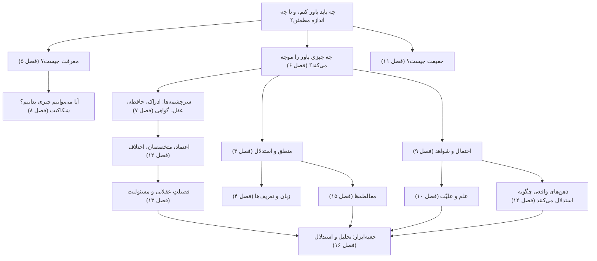

# تسلط بر معرفت‌شناسی

**راهنمای کاملِ معرفت، شواهد و تفکر نقادانه**

> «جرئتِ دانستن داشته باش! شهامتِ به‌کاربستنِ فهمِ خودت را داشته باش!»
> — ایمانوئل کانت، «روشنگری چیست؟» (۱۷۸۴)

معرفت‌شناسی مطالعهٔ معرفت است: اینکه معرفت چیست، از کجا می‌آید، تا کجا گسترده است، و وقتی نمی‌توانیم مطمئن باشیم چگونه باید باور بسازیم. معرفت‌شناسی نظریهٔ پشتِ تفکر نقادانه هم هست. هر بار که می‌پرسید «آن‌ها از کجا این را می‌دانند؟»، «این شاهد اصلاً ارزشی دارد؟»، «چرا آدم‌های باهوش در این باره اختلاف دارند؟» یا «چه چیزی نظرم را عوض می‌کند؟»، دارید معرفت‌شناسی می‌ورزید.

این راهنما برای کسی نوشته شده که می‌خواهد بر این موضوع **تسلط** یابد، نه اینکه فقط نگاهی گذرا به آن بیندازد: بحث‌های بزرگ را بفهمد، استدلال‌ها و اندیشمندانِ پشتِ آن‌ها را بشناسد، و بیش از همه این ایده‌ها را **به کار ببندد** تا روشن بیندیشد، بحث‌ها را تحلیل کند، استدلال بسازد و ادعاها را در زندگیِ روزمره ارزیابی کند. این راهنما از بهترین آثارِ فلسفه، از افلاطون، ابن سینا، دکارت و هیوم تا معرفت‌شناسانِ معاصر، و از پژوهش‌های منطق، آمار، روان‌شناسیِ شناختی و فلسفهٔ علم بهره می‌گیرد.

متنِ آن حدود ۱۳۰ هزار واژه است، در شانزده فصل، یک واژه‌نامه و یک فهرستِ مطالعه. همهٔ فصل‌ها با پیوندهای فراوان به هم وصل شده‌اند، تا بتوانید هر مفهوم را هر جا که می‌رود دنبال کنید.

همهٔ فصل‌ها روایتِ صوتی هم دارند، روی‌هم حدود چهارده ساعت و نیم، به زبان انگلیسی. از **[پخش‌کنندهٔ صوتی](audio/index.html)** استفاده کنید که نشانگرِ بخش‌ها دارد و جایی را که مانده‌اید به یاد می‌سپارد، یا برای فهرستِ کاملِ فایل‌ها و شیوهٔ ساختِ روایت، [نسخهٔ صوتی](audio/README.md) را ببینید.

---

## فهرست مطالب

### بخش یکم. بنیادها

| | فصل | آنچه می‌آموزید |
|---|---|---|
| ۱ | [معرفت‌شناسی چیست؟](01-what-is-epistemology.md) | پرسش‌های اصلی؛ سه گونه دانستن؛ باور، درجهٔ باور و پذیرش؛ پیشین، تحلیلی و ضروری؛ دلیل‌های معرفتی در برابر دلیل‌های عملی؛ شاخه‌های این حوزه |
| ۲ | [تاریخِ نظریهٔ معرفت](02-history-of-epistemology.md) | از پیشاسقراطیان، سقراط، افلاطون و ارسطو، از راهِ سنت‌های هندی، اسلامی و چینی، تا دکارت، لاک، هیوم، رید و کانت، و از آنجا تا گتیه، کواین و امروز |
| ۳ | [منطق و کالبدشناسیِ استدلال](03-logic-and-arguments.md) | قیاس، استقرا و ابداکشن؛ اعتبار و درستی؛ شرطی‌ها و شرط‌های لازم و کافی؛ صورت‌های معتبر و مغالطه‌های صوری؛ مقدمه‌های پنهان؛ نقشه‌کشیِ استدلال؛ مدلِ تولمین |
| ۴ | [زبان، مفهوم‌ها و تعریف‌ها](04-language-concepts-and-definitions.md) | معنا و مصداق؛ گونه‌های تعریف؛ ابهام و گنگی؛ نزاع‌های لفظی؛ زبانِ جهت‌دار و قاب‌بندی؛ مفهوم‌های مناقشه‌برانگیز؛ مهندسیِ مفهومی |

### بخش دوم. هستهٔ معرفت‌شناسی

| | فصل | آنچه می‌آموزید |
|---|---|---|
| ۵ | [معرفت چیست؟](05-the-nature-of-knowledge.md) | باورِ صادقِ موجه؛ مسئلهٔ گتیه؛ وثاقت‌گرایی، حساسیت، ایمنی، فضیلت و نظریه‌های «معرفت‌ـ‌نخست»؛ بختِ معرفتی؛ ارزشِ معرفت؛ فهم و حکمت |
| ۶ | [توجیه: ساختارِ دلیل‌های خوب](06-justification.md) | ابطال‌کننده‌ها؛ مسئلهٔ تسلسل؛ مبناگرایی، انسجام‌گرایی، تسلسل‌گرایی و ترکیب‌هایشان؛ درون‌گرایی در برابر برون‌گرایی؛ شواهدگرایی؛ مسئلهٔ معیار؛ خطاپذیرگرایی |
| ۷ | [سرچشمه‌های معرفت](07-sources-of-knowledge.md) | ادراکِ حسی، حافظه، درون‌نگری، عقل و گواهی: هر کدام چگونه کار می‌کند و چگونه خطا می‌کند؛ علمِ حضوری؛ کِی به شهود اعتماد کنیم |
| ۸ | [شکاکیت و پاسخ‌هایش](08-skepticism.md) | شکاکیتِ پیرونی و دکارتی؛ مغز در خمره؛ استدلالِ انسداد؛ مور، زمینه‌گرایی، معرفت‌شناسیِ لولا و پاسخ‌های دیگر؛ شکاکیتِ سالم در برابر شکاکیتِ ویرانگر |

### بخش سوم. شواهد، علم و حقیقت

| | فصل | آنچه می‌آموزید |
|---|---|---|
| ۹ | [استقرا، احتمال و استدلالِ بیزی](09-induction-probability-bayes.md) | مسئلهٔ هیوم؛ «گرو» و کلاغ‌ها؛ احتمال؛ قضیهٔ بیز با مثال‌های حل‌شده؛ نرخ‌های پایه، مغالطهٔ عطف، مسئلهٔ مانتی هال؛ کالیبراسیون |
| ۱۰ | [علم، شواهد و تبیین](10-science-and-evidence.md) | ابطال‌پذیری؛ دوئم‌ـ‌کواین؛ کوهن و لاکاتوش؛ استنتاج بهترین تبیین؛ واقع‌گرایی؛ علیّت، همبستگی و کارآزماییِ تصادفی؛ ارزش‌ها؛ بحرانِ تکرارپذیری |
| ۱۱ | [حقیقت، نسبی‌گرایی و عینیت](11-truth-and-relativism.md) | نظریه‌های صدق؛ پارادوکسِ دروغگو؛ نسبی‌گرایی و منتقدانش؛ برساختِ اجتماعی؛ عینیت و چشم‌انداز؛ پساحقیقت و یاوه |

### بخش چهارم. معرفت در جامعه و در ذهن

| | فصل | آنچه می‌آموزید |
|---|---|---|
| ۱۲ | [معرفت‌شناسیِ اجتماعی: دانستن با هم](12-social-epistemology.md) | اعتماد و تخصص؛ انتخاب میانِ متخصصان؛ اختلافِ همتایان؛ بی‌عدالتیِ معرفتی؛ نظریهٔ دیدگاه؛ اتاق‌های پژواک؛ آبشارها و جمعیت‌ها؛ اطلاعاتِ نادرست |
| ۱۳ | [فضیلتِ عقلانی و اخلاقِ باور](13-virtues-and-ethics-of-belief.md) | کلیفورد در برابر جیمز؛ فضیلت‌ها و رذیلت‌های عقلانی؛ فروتنی و گشوده‌ذهنی؛ دست‌اندازیِ عملی و اخلاقی؛ ایمان، دین و استدلال |
| ۱۴ | [روان‌شناسیِ استدلال](14-psychology-of-reasoning.md) | نظریه‌های دوفرایندی؛ میان‌برهای ذهنی و سوگیری‌ها؛ سوگیریِ تأییدی و سوگیریِ جانب‌دارانه؛ استدلالِ انگیزه‌مند؛ اعتمادبه‌نفسِ بیش از حد؛ شناختِ هویت‌پاسدار؛ نظریهٔ استدلالیِ عقل |

### بخش پنجم. عمل

| | فصل | آنچه می‌آموزید |
|---|---|---|
| ۱۵ | [راهنمای میدانیِ مغالطه‌ها](15-fallacies.md) | بیش از چهل مغالطه و ترفندِ بلاغی، هر کدام با مثال، خویشاوندِ مشروعش و شیوهٔ پاسخ‌دادن؛ تمرین‌ها |
| ۱۶ | [جعبه‌ابزارِ متفکرِ نقاد](16-critical-thinking-toolkit.md) | روشی هفت‌مرحله‌ای برای تحلیلِ هر بحث؛ نظریهٔ ایستایی؛ یافتنِ گرهِ اختلاف؛ ساختنِ استدلالِ خودتان؛ بارِ اثبات؛ تیغ‌ها؛ اخلاقِ گفت‌وگو؛ مطالعه‌های موردی |

### پیوست‌ها

| | | |
|---|---|---|
| ۱۷ | [واژه‌نامه](17-glossary.md) | ۲۰۰ اصطلاحِ کلیدی، هر یک با پیوند به توضیحِ کاملش |
| ۱۸ | [فهرستِ مطالعه و برنامهٔ درسی](18-reading-list.md) | بهترین کتاب‌ها به تفکیکِ سطح؛ متن‌های اصلی؛ سنت‌های غیرغربی؛ منابعِ رایگان؛ برنامهٔ درسیِ دوازده‌هفته‌ای |

---

## ایده‌ها چگونه به هم می‌پیوندند

---

## مسیرهای یادگیری

می‌توانید راهنما را از آغاز تا پایان بخوانید. اگر هدفِ مشخصی دارید، این مسیرها کوتاه‌ترند.

**مسیرِ سریعِ تفکر نقادانه** (حدود ۱۰ ساعت): [۱](01-what-is-epistemology.md) ← [۳](03-logic-and-arguments.md) ← [۴](04-language-concepts-and-definitions.md) ← [۹](09-induction-probability-bayes.md) (قضیهٔ بیز، خطاهای رایج، آمار) ← [۱۴](14-psychology-of-reasoning.md) ← [۱۵](15-fallacies.md) ← [۱۶](16-critical-thinking-toolkit.md)

**فلسفهٔ معرفت**: [۱](01-what-is-epistemology.md) ← [۲](02-history-of-epistemology.md) ← [۵](05-the-nature-of-knowledge.md) ← [۶](06-justification.md) ← [۷](07-sources-of-knowledge.md) ← [۸](08-skepticism.md) ← [۱۱](11-truth-and-relativism.md) ← [۱۳](13-virtues-and-ethics-of-belief.md)

**علم، داده و شواهد**: [۳](03-logic-and-arguments.md) ← [۹](09-induction-probability-bayes.md) ← [۱۰](10-science-and-evidence.md) ← [۱۲](12-social-epistemology.md) (متخصصان، اجماع، اطلاعاتِ نادرست) ← [۱۴](14-psychology-of-reasoning.md) ← [۱۶](16-critical-thinking-toolkit.md) (مطالعه‌های موردیِ ۱ و ۳)

**فهمیدنِ بحث‌های عمومی**: [۴](04-language-concepts-and-definitions.md) ← [۱۱](11-truth-and-relativism.md) ← [۱۲](12-social-epistemology.md) ← [۱۴](14-psychology-of-reasoning.md) (استدلالِ انگیزه‌مند، هویت) ← [۱۵](15-fallacies.md) ← [۱۶](16-critical-thinking-toolkit.md)

**دورهٔ ساختارمندِ دوازده‌هفته‌ای**: [برنامهٔ درسی](18-reading-list.md#a-twelve-week-study-plan) را ببینید.

**خواندنِ کتابِ «معرفت: درآمدی بسیار کوتاه» نوشتهٔ جنیفر نیگل همراه با این راهنما**: [نقشهٔ خواندنِ بخش به بخش](18-reading-list.md#reading-map-nagels-knowledge-a-very-short-introduction) را ببینید.

---

## هر فصل چگونه کار می‌کند

- **سرلوحه‌ها**: هر فصل با گفتاوردی از اندیشمندی آغاز می‌شود که ایده‌هایش در آن فصل بررسی می‌شود.
- **پیوندهای میان‌فصلی** هر مفهوم را به جاهای دیگری که در آن‌ها اهمیت دارد وصل می‌کنند. دنبالشان کنید: دیدنِ پیوندِ ایده‌ها همان چیزی است که اطلاعات را به فهم بدل می‌کند.
- **مثال‌های حل‌شده** در سراسرِ متن آمده‌اند، از موردهای گتیه و مسئلهٔ مانتی هال تا رویدادهای تاریخیِ واقعی مانند شستنِ دست‌ها به توصیهٔ زملوایس و پروندهٔ سالی کلارک.
- جعبه‌های **«درسِ تفکر نقادانه»** پیامدِ عملیِ ایده‌های نظری را بیرون می‌کشند.
- پرسش‌های **«فهمِ خود را بسنجید»** پایان‌بخشِ هر فصل‌اند. پیش از باز کردنِ پاسخ، که در بخشی تاشو پنهان است، بکوشید به هر پرسش به صورتِ نوشتاری پاسخ دهید.
- فهرست‌های **مطالعهٔ بیشتر** در پایانِ هر فصل شما را به بهترین منابع می‌رسانند، از درآمدهای کوتاه تا مقاله‌های کلاسیک.
- **صوت**: هر فصل نسخهٔ روایت‌شده به زبان انگلیسی دارد. این نسخه برای شنیدن بازنویسی شده است: ارجاع‌ها و پیوندها حذف شده‌اند، فرمول‌ها و جدول‌ها به زبان گفتاری درآمده‌اند، و پرسش‌های مرور به آزمونکی شفاهی با فرصتِ فکرکردن بدل شده‌اند.

---

## نقشهٔ همراه

این راهنما همراهِ **نقشهٔ تعاملیِ دوزبانهٔ (فارسی و انگلیسی) مفاهیم** در همین مخزن است ([`map/`](../../map/index.html)؛ نسخهٔ زنده در [epis.duckdns.org/map/](https://epis.duckdns.org/map/)). نقشه نمایی کلی بر پایهٔ نقشه به دست می‌دهد، با کارت‌های آموزشی و خودآزمایی برای هر مفهوم. این راهنما توضیح‌های مفصل، استدلال‌ها، تاریخ، مثال‌ها و تمرین‌های پشتِ آن کارت‌ها را فراهم می‌کند.

---

## دربارهٔ منابع و دقت

این راهنما می‌کوشد هر بحث را منصفانه، با قوی‌ترین استدلال‌های هر طرف، عرضه کند و ایده‌ها را، با تاریخ و عنوان، به کسانی نسبت دهد که پرورانده‌اندشان، تا بتوانید سراغِ اصلِ آثار بروید. هر جا که یافته‌های تجربی بحث می‌شوند، می‌کوشد وضعِ کنونیِ شواهد را بازتاب دهد، از جمله یافته‌هایی که تکرار نشده‌اند یا همچنان محلِ مناقشه‌اند؛ این موارد در متن مشخص شده‌اند، به‌ویژه در [فصل ۱۴](14-psychology-of-reasoning.md#replication-and-the-psychology-of-psychology).

با این راهنما همان‌گونه رفتار کنید که با هر منبعِ دیگر: راهنمایی خیرخواه ولی خطاپذیر. ادعاهای مهم را با منابعِ اصلی و «دانشنامهٔ فلسفهٔ استنفورد» بسنجید. اگر خطایی یافتید، یعنی روش دارد درست کار می‌کند.

> «وظیفهٔ کسی که نوشته‌های دانشمندان را می‌کاود، اگر هدفش شناختِ حقیقت است، این است که خود را دشمنِ هر آنچه می‌خوانَد کند.»
> — ابن هیثم، «الشکوک علی بطلمیوس» (حدود ۱۰۲۵)
