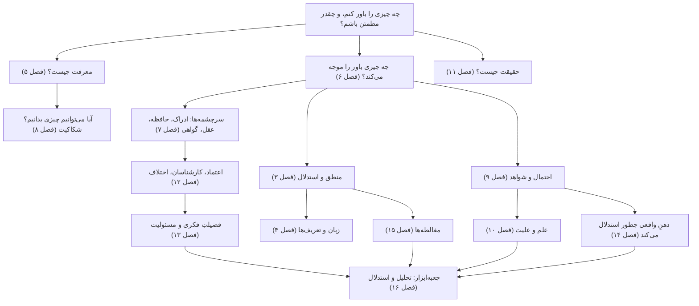

# تسلط بر معرفت‌شناسی

**راهنمای کاملِ معرفت، شواهد و تفکرِ نقادانه**

> «جرئتِ دانستن داشته باش! شهامتِ به کار بردنِ فهمِ خودت را داشته باش!»
> — ایمانوئل کانت، «روشنگری چیست؟» (۱۷۸۴)

معرفت‌شناسی دانشِ شناختنِ معرفت است: اینکه معرفت چیست، از کجا می‌آید، تا کجا می‌رسد، و وقتی نمی‌توانیم مطمئن باشیم، چطور باید باورهایمان را شکل بدهیم. معرفت‌شناسی پشتوانهٔ نظریِ تفکرِ نقادانه هم هست. هر بار که می‌پرسید «از کجا این را می‌دانند؟»، «این شاهد اصلاً ارزشی دارد؟»، «چرا آدم‌های باهوش سرِ این موضوع اختلاف دارند؟» یا «چه چیزی ممکن است نظرم را عوض کند؟»، در واقع دارید معرفت‌شناسی می‌کنید.

این راهنما برای کسی نوشته شده که می‌خواهد بر این موضوع **مسلط** شود، نه اینکه فقط سرسری نگاهی به آن بیندازد. می‌خواهد بحث‌های بزرگ را بفهمد، استدلال‌ها و اندیشمندانِ پشتِ آن‌ها را بشناسد، و مهم‌تر از همه، این ایده‌ها را **به کار ببرد**: روشن فکر کند، بحث‌ها را تحلیل کند، استدلال بسازد و ادعاهایی را که هر روز می‌شنود بسنجد. این راهنما از بهترین آثارِ فلسفه بهره می‌گیرد، از افلاطون، ابن‌سینا، دکارت و هیوم تا معرفت‌شناسانِ امروز، و همین‌طور از پژوهش‌ها در منطق، آمار، روان‌شناسیِ شناختی و فلسفهٔ علم.

متنِ راهنما حدودِ ۱۳۰ هزار واژه است: شانزده فصل، یک واژه‌نامه و یک فهرستِ مطالعه. فصل‌ها با پیوندهای فراوان به هم وصل شده‌اند تا بتوانید هر مفهوم را در هر جای کتاب که دوباره پیدا می‌شود دنبال کنید.

همهٔ فصل‌ها نسخهٔ صوتی هم دارند. روایتِ فارسی فصل‌به‌فصل آماده می‌شود: تا اینجا ۷ فصل از ۱۶ فصل روایتِ فارسی دارد و بقیه فعلاً روایتِ انگلیسی. می‌توانید از **[پخش‌کنندهٔ صوتی](audio/index.html)** استفاده کنید، که بخش‌های هر فصل را نشان می‌دهد و یادش می‌ماند تا کجا گوش داده‌اید. برای فهرستِ کاملِ فایل‌ها و اینکه روایت‌ها چطور ساخته شده‌اند، [نسخهٔ صوتی](audio/README.md) را ببینید.

---

## فهرست مطالب

### بخش یکم. بنیادها

| | فصل | آنچه می‌آموزید |
|---|---|---|
| ۱ | [معرفت‌شناسی چیست؟](01-what-is-epistemology.md) | پرسش‌های اصلی؛ سه گونه دانستن؛ باور، درجهٔ باور و پذیرش؛ پیشین، تحلیلی و ضروری؛ دلیل‌های معرفتی در برابرِ دلیل‌های عملی؛ نقشهٔ این حوزه |
| ۲ | [تاریخِ نظریهٔ معرفت](02-history-of-epistemology.md) | از پیشاسقراطیان، سقراط، افلاطون و ارسطو، با گذر از سنت‌های هندی، اسلامی و چینی، تا دکارت، لاک، هیوم، رید و کانت، و از آنجا تا گتیه، کواین و امروز |
| ۳ | [منطق و کالبدشناسیِ استدلال](03-logic-and-arguments.md) | قیاس، استقرا و ابداکشن؛ اعتبار و درستی؛ جمله‌های شرطی و شرط‌های لازم و کافی؛ شکل‌های معتبرِ استدلال و مغالطه‌های صوری؛ مقدمه‌های ناگفته؛ نقشهٔ استدلال؛ مدلِ تولمین |
| ۴ | [زبان، مفهوم‌ها و تعریف‌ها](04-language-concepts-and-definitions.md) | معنا و مصداق؛ انواعِ تعریف؛ ابهام و گنگی؛ نزاع‌های لفظی؛ زبانِ جهت‌دار و قاب‌بندی؛ مفهوم‌هایی که ذاتاً محلِ اختلاف‌اند؛ مهندسیِ مفهومی |

### بخش دوم. هستهٔ معرفت‌شناسی

| | فصل | آنچه می‌آموزید |
|---|---|---|
| ۵ | [معرفت چیست؟](05-the-nature-of-knowledge.md) | باورِ صادقِ موجه؛ مسئلهٔ گتیه؛ وثاقت‌گرایی، حساسیت، ایمنی، فضیلت و نظریه‌های «معرفت‌نخست»؛ بختِ معرفتی؛ ارزشِ معرفت؛ فهم و حکمت |
| ۶ | [توجیه: ساختارِ دلیل‌های خوب](06-justification.md) | ابطال‌کننده‌ها؛ مسئلهٔ تسلسل؛ مبناگرایی، انسجام‌گرایی، تسلسل‌گرایی و ترکیب‌هایشان؛ درون‌گرایی در برابر برون‌گرایی؛ شواهدگرایی؛ مسئلهٔ معیار؛ خطاپذیرگرایی |
| ۷ | [سرچشمه‌های معرفت](07-sources-of-knowledge.md) | ادراکِ حسی، حافظه، درون‌نگری، عقل و گواهی: هر کدام چطور کار می‌کند و کجا خطا می‌کند؛ علمِ حضوری؛ کی می‌شود به شهود اعتماد کرد |
| ۸ | [شکاکیت و پاسخ‌هایش](08-skepticism.md) | شکاکیتِ پیرونی و دکارتی؛ مغز در خمره؛ استدلالِ انسداد؛ مور، زمینه‌گرایی، معرفت‌شناسیِ لولا و پاسخ‌های دیگر؛ شکاکیتِ سالم در برابرِ شکاکیتِ ویرانگر |

### بخش سوم. شواهد، علم و حقیقت

| | فصل | آنچه می‌آموزید |
|---|---|---|
| ۹ | [استقرا، احتمال و استدلالِ بیزی](09-induction-probability-bayes.md) | مسئلهٔ هیوم؛ «گرو» و کلاغ‌ها؛ احتمال؛ قضیهٔ بیز با مثال‌های حل‌شده؛ نرخِ پایه، مغالطهٔ عطف، مسئلهٔ مانتی هال؛ کالیبراسیون |
| ۱۰ | [علم، شواهد و تبیین](10-science-and-evidence.md) | ابطال‌پذیری؛ مسئلهٔ دوئم‌ـ‌کواین؛ کوهن و لاکاتوش؛ استنتاج از راهِ بهترین تبیین؛ واقع‌گرایی؛ علیت، همبستگی و کارآزماییِ تصادفی؛ ارزش‌ها؛ بحرانِ تکرارپذیری |
| ۱۱ | [حقیقت، نسبی‌گرایی و عینیت](11-truth-and-relativism.md) | نظریه‌های صدق؛ پارادوکسِ دروغگو؛ نسبی‌گرایی و منتقدانش؛ برساخت‌گراییِ اجتماعی؛ عینیت و چشم‌انداز؛ پساحقیقت و چرندگویی |

### بخش چهارم. معرفت در جامعه و در ذهن

| | فصل | آنچه می‌آموزید |
|---|---|---|
| ۱۲ | [معرفت‌شناسیِ اجتماعی: دانستن با هم](12-social-epistemology.md) | اعتماد و تخصص؛ انتخاب میانِ کارشناسان؛ اختلافِ همتایان؛ بی‌عدالتیِ معرفتی؛ نظریهٔ دیدگاه؛ اتاق‌های پژواک؛ آبشارها و جمعیت‌ها؛ اطلاعاتِ نادرست |
| ۱۳ | [فضیلتِ فکری و اخلاقِ باور](13-virtues-and-ethics-of-belief.md) | کلیفورد در برابرِ جیمز؛ فضیلت‌ها و رذیلت‌های فکری؛ فروتنی و گشوده‌ذهنی؛ نفوذِ ملاحظه‌های عملی و اخلاقی؛ ایمان، دین و استدلال |
| ۱۴ | [روان‌شناسیِ استدلال](14-psychology-of-reasoning.md) | نظریه‌های دوفرایندی؛ میان‌برهای ذهنی و سوگیری‌ها؛ سوگیریِ تأییدی و سوگیریِ جانبِ خود؛ استدلالِ انگیزه‌مند؛ اعتمادبه‌نفسِ بیش از حد؛ شناختِ هویت‌محافظ؛ نظریهٔ استدلالیِ عقل |

### بخش پنجم. عمل

| | فصل | آنچه می‌آموزید |
|---|---|---|
| ۱۵ | [راهنمای میدانیِ مغالطه‌ها](15-fallacies.md) | بیش از چهل مغالطه و ترفندِ بلاغی، هر کدام با مثال، با شکلِ درست و مشروعش، و با راهِ جواب دادن به آن؛ تمرین‌ها |
| ۱۶ | [جعبه‌ابزارِ متفکرِ نقاد](16-critical-thinking-toolkit.md) | روشی هفت‌مرحله‌ای برای تحلیلِ هر بحث؛ نظریهٔ نقطهٔ نزاع؛ پیدا کردنِ گرهِ اختلاف؛ ساختنِ استدلالِ خودتان؛ بارِ اثبات؛ تیغ‌های فلسفی؛ اخلاقِ گفت‌وگو؛ مطالعه‌های موردی |

### پیوست‌ها

| | | |
|---|---|---|
| ۱۷ | [واژه‌نامه](17-glossary.md) | ۲۰۰ اصطلاحِ کلیدی، هر کدام با پیوند به جایی که کامل توضیح داده شده |
| ۱۸ | [فهرستِ مطالعه و برنامهٔ یادگیری](18-reading-list.md) | بهترین کتاب‌ها برای هر سطح؛ متن‌های اصلی؛ سنت‌های غیرغربی؛ منابعِ رایگان؛ برنامهٔ مطالعهٔ دوازده‌هفته‌ای |

---

## ایده‌ها چطور به هم وصل می‌شوند

---

## مسیرهای یادگیری

می‌توانید راهنما را از اول تا آخر بخوانید. اما اگر هدفِ مشخصی دارید، این مسیرها کوتاه‌ترند.

**مسیرِ سریعِ تفکرِ نقادانه** (حدود ۱۰ ساعت): [۱](01-what-is-epistemology.md) ← [۳](03-logic-and-arguments.md) ← [۴](04-language-concepts-and-definitions.md) ← [۹](09-induction-probability-bayes.md) (قضیهٔ بیز، خطاهای رایج، آمار) ← [۱۴](14-psychology-of-reasoning.md) ← [۱۵](15-fallacies.md) ← [۱۶](16-critical-thinking-toolkit.md)

**فلسفهٔ معرفت**: [۱](01-what-is-epistemology.md) ← [۲](02-history-of-epistemology.md) ← [۵](05-the-nature-of-knowledge.md) ← [۶](06-justification.md) ← [۷](07-sources-of-knowledge.md) ← [۸](08-skepticism.md) ← [۱۱](11-truth-and-relativism.md) ← [۱۳](13-virtues-and-ethics-of-belief.md)

**علم، داده و شواهد**: [۳](03-logic-and-arguments.md) ← [۹](09-induction-probability-bayes.md) ← [۱۰](10-science-and-evidence.md) ← [۱۲](12-social-epistemology.md) (کارشناسان، اجماع، اطلاعاتِ نادرست) ← [۱۴](14-psychology-of-reasoning.md) ← [۱۶](16-critical-thinking-toolkit.md) (مطالعه‌های موردیِ ۱ و ۳)

**فهمیدنِ بحث‌های عمومی**: [۴](04-language-concepts-and-definitions.md) ← [۱۱](11-truth-and-relativism.md) ← [۱۲](12-social-epistemology.md) ← [۱۴](14-psychology-of-reasoning.md) (استدلالِ انگیزه‌مند، هویت) ← [۱۵](15-fallacies.md) ← [۱۶](16-critical-thinking-toolkit.md)

**دورهٔ منظمِ دوازده‌هفته‌ای**: [برنامهٔ مطالعهٔ دوازده‌هفته‌ای](18-reading-list.md#a-twelve-week-study-plan) را ببینید.

**خواندنِ کتابِ «معرفت: درآمدی بسیار کوتاه» نوشتهٔ جنیفر نیگل همراه با این راهنما**: [نقشهٔ خواندنِ بخش به بخش](18-reading-list.md#reading-map-nagels-knowledge-a-very-short-introduction) را ببینید.

---

## هر فصل چه بخش‌هایی دارد

- **سرلوحه‌ها**: هر فصل با جمله‌ای از اندیشمندی شروع می‌شود که ایده‌هایش در آن فصل بررسی می‌شود.
- **پیوندهای میان‌فصلی** هر مفهوم را به جاهای دیگری که در آن‌ها مهم است وصل می‌کنند. دنبالشان کنید، چون دیدنِ ربطِ ایده‌ها به هم است که اطلاعات را به فهم تبدیل می‌کند.
- **مثال‌های حل‌شده** در سراسرِ متن آمده‌اند، از موردهای گتیه و مسئلهٔ مانتی هال تا ماجراهای واقعیِ تاریخی، مثلِ توصیهٔ زملوایس به شستنِ دست‌ها و پروندهٔ سالی کلارک.
- کادرهای **«درسِ تفکرِ نقادانه»** نشان می‌دهند ایده‌های نظری در عمل به چه کاری می‌آیند.
- هر فصل با پرسش‌های **«فهمِ خود را بسنجید»** تمام می‌شود. پاسخ‌ها در بخشی بسته پنهان‌اند. پیش از باز کردنشان، سعی کنید جوابِ هر پرسش را خودتان بنویسید.
- فهرستِ **مطالعهٔ بیشتر** در پایانِ هر فصل بهترین منابع را معرفی می‌کند، از کتاب‌های درآمدِ کوتاه تا مقاله‌های کلاسیک.
- **صوت**: هر فصل یک نسخهٔ صوتی به زبانِ فارسی (یا، تا وقتی روایتِ فارسیِ آن آماده شود، به زبانِ انگلیسی) دارد که برای شنیدن بازنویسی شده است. ارجاع‌ها و پیوندها حذف شده‌اند، فرمول‌ها و جدول‌ها به زبانِ گفتاری درآمده‌اند، و پرسش‌های مرور به آزمونی شفاهی تبدیل شده‌اند که بینِ پرسش و پاسخ فرصتِ فکر کردن می‌دهد.

---

## نقشهٔ همراه

این راهنما همراهِ **نقشهٔ تعاملیِ مفهوم‌ها** است که به فارسی و انگلیسی در همین مخزن قرار دارد ([`map/`](../../map/index.html)؛ نسخهٔ آنلاین در [epis.duckdns.org/map/](https://epis.duckdns.org/map/)). نقشه تصویری کلی از موضوع می‌دهد و برای هر مفهوم کارتِ آموزشی و خودآزمایی دارد. این راهنما توضیح‌های مفصل، استدلال‌ها، تاریخ، مثال‌ها و تمرین‌هایی را می‌دهد که پشتِ آن کارت‌ها هستند.

---

## دربارهٔ منابع و دقت

این راهنما سعی کرده هر بحث را منصفانه و با قوی‌ترین استدلال‌های هر طرف بیاورد. هر ایده را هم، با ذکرِ سال و نامِ اثر، به کسی نسبت داده که آن را پرورانده است تا بتوانید سراغِ خودِ آثار بروید. هر جا پای یافته‌های تجربی در میان است، سعی کرده وضعِ امروزِ شواهد را نشان دهد، از جمله یافته‌هایی که تکرار نشده‌اند یا هنوز محلِ بحث‌اند. این موارد در متن مشخص شده‌اند، به‌خصوص در [فصل ۱۴](14-psychology-of-reasoning.md#replication-and-the-psychology-of-psychology).

با این راهنما همان‌طور رفتار کنید که با هر منبعِ دیگری: راهنمایی دلسوز، اما جایزالخطا. ادعاهای مهم را با منابعِ اصلی و «دانشنامهٔ فلسفهٔ استنفورد» مقایسه کنید. اگر اشتباهی پیدا کردید، یعنی روش دارد درست کار می‌کند.

> «وظیفهٔ کسی که نوشته‌های دانشمندان را بررسی می‌کند، اگر هدفش شناختنِ حقیقت است، این است که خود را دشمنِ هر چیزی کند که می‌خوانَد.»
> — ابن‌هیثم، «الشکوک علی بطلمیوس» (حدود ۱۰۲۵)
